# 发光二极管

> 原文：<https://learn.sparkfun.com/tutorials/light-emitting-diodes-leds>

## 介绍

led 无处不在:在我们的手机、汽车甚至家中。任何时候某个电子设备亮了，很有可能是它背后的 LED。它们有各种各样的尺寸、形状和颜色，但是不管它们看起来怎么样，它们都有一个共同点:它们是电子产品的典范。他们被广泛认为可以让任何项目变得更好，他们经常被添加到不太可能的事情中(让每个人都高兴)。

[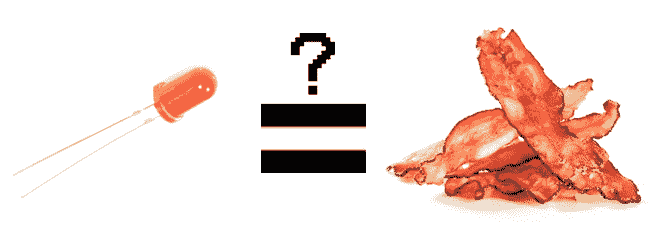](https://cdn.sparkfun.com/assets/b/7/6/0/4/51f1ba6bce395f3c20000003.jpg)

然而，与培根不同的是，一旦你把它们煮熟了，它们就不再好吃了。这个指南将帮助你避免任何意外的 LED 烧烤！不过，首先要做的是。大家都在谈论的这个 LED 到底是什么？

发光二极管是一种特殊类型的二极管，可以将电能转化为光。事实上，LED 代表“发光二极管”(它确实如罐头上说的那样！)这反映在二极管和 LED 示意图符号之间的相似性上:

[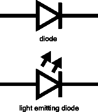](https://cdn.sparkfun.com/assets/c/5/7/2/7/51f1c87ace395fea20000004.png)

简而言之，led 就像微型灯泡。然而，相比之下，led 需要更少的能量来点亮。它们也更节能，所以它们不会像传统灯泡那样变热(除非你真的给它们充电)。这使得它们非常适合移动设备和其他低功耗应用。不过，不要把他们排除在权力游戏之外。高强度发光二极管已经进入重点照明，聚光灯，甚至汽车头灯！

你开始渴望了吗？渴望在所有东西上都装上 led 灯？很好，跟着我们，我们会告诉你怎么做！

### 推荐阅读

以下是本教程将讨论的一些其他主题。如果你对它们中的任何一个都不熟悉，请在进一步学习之前先看看相应的教程。

 [### 什么是电路？](https://learn.sparkfun.com/tutorials/what-is-a-circuit) Every electrical project starts with a circuit. Don't know what a circuit is? We're here to help.[Favorited Favorite](# "Add to favorites") 82 [### 电压、电流、电阻和欧姆定律](https://learn.sparkfun.com/tutorials/voltage-current-resistance-and-ohms-law) Learn about Ohm's Law, one of the most fundamental equations in all electrical engineering.[Favorited Favorite](# "Add to favorites") 132 [### 什么是电？](https://learn.sparkfun.com/tutorials/what-is-electricity) We can see electricity in action on our computers, lighting our houses, as lightning strikes in thunderstorms, but what is it? This is not an easy question, but this tutorial will shed some light on it 83 [### 二极管](https://learn.sparkfun.com/tutorials/diodes) A diode primer! Diode properties, types of diodes, and diode applications.[Favorited Favorite](# "Add to favorites") 70 [### 电力](https://learn.sparkfun.com/tutorials/electric-power) An overview of electric power, the rate of energy transfer. We'll talk definition of power, watts, equations, and power ratings. 1.21 gigawatts of tutorial fun 54 [### 极性](https://learn.sparkfun.com/tutorials/polarity) An introduction to polarity in electronic components. Discover what polarity is, which parts have it, and how to identify it.[Favorited Favorite](# "Add to favorites") 52 [### 公制前缀和国际单位制单位](https://learn.sparkfun.com/tutorials/metric-prefixes-and-si-units) This tutorial will explain how to use and convert between the standard metric prefixes.[Favorited Favorite](# "Add to favorites") 22

### 建议观看

[https://www.youtube.com/embed/7R5SfKsOByU/?autohide=1&border=0&wmode=opaque&enablejsapi=1](https://www.youtube.com/embed/7R5SfKsOByU/?autohide=1&border=0&wmode=opaque&enablejsapi=1)

## 如何使用它们

所以你得出了一个明智的结论，你需要在所有的东西上安装 led。我们以为你会回心转意。

[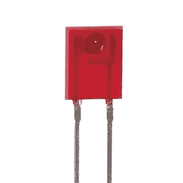](https://cdn.sparkfun.com/assets/a/0/8/8/5/51f1d073ce395f7120000002.gif)

让我们看一下规则手册:

### 1)极性很重要

在电子学中，[极性](https://learn.sparkfun.com/tutorials/polarity)表示一个电路元件是否对称。发光二极管是二极管，只允许电流单向流动。当没有电流时，就没有光。幸运的是，这也意味着你不能通过反向插入来损坏 LED。相反，这是行不通的。

[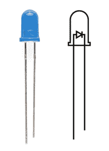](https://cdn.sparkfun.com/assets/1/6/5/a/4/51f1d3a2ce395fd720000008.jpg)

LED 的正极称为**“阳极”**，以具有更长的“引线”或引脚为标志。LED 的另一面，也就是负极，叫做**“阴极”**电流从阳极流向阴极，从不反方向流动。反向的 LED 可以通过阻挡电流来阻止整个电路正常工作。所以，如果增加一个 LED 坏了你的电路，不要惊慌。试着把它翻过来。

### 2)莫尔电流等于莫尔光

LED 的亮度直接取决于它吸收多少电流。这意味着两件事。首先，超高亮度 led 消耗电池的速度更快，因为额外的亮度来自使用的额外功率。第二，你可以通过控制流经 LED 的电流来控制它的亮度。但是，调节情绪并不是减少你的电流的唯一原因。

### 3)存在权力过大这种事情

如果你将一个 LED 直接连接到一个电流源，它会试图消耗尽可能多的能量，就像旧时的悲剧英雄一样，它会自我毁灭。这就是限制流经 LED 的电流量非常重要的原因。

为此，我们使用电阻。电阻限制电路中的电子流，防止 LED 消耗过多电流。别担心，只需要一点基本的数学知识就可以确定最佳电阻值。您可以在我们的[电阻教程](https://learn.sparkfun.com/tutorials/resistors/example-applications)的应用示例中找到所有相关信息！

 [### 电阻

#### 2013 年 4 月 1 日](https://learn.sparkfun.com/tutorials/resistors) A tutorial on all things resistors. What is a resistor, how do they behave in parallel/series, decoding the resistor color codes, and resistor applications.[Favorited Favorite](# "Add to favorites") 57

不要让所有这些数学问题吓到你，把事情搞得太糟其实很难。在下一节中，我们将讨论如何在没有计算器的情况下制作 LED 电路。

## 不带数学的 led

在讨论如何阅读数据手册之前，我们先来看一些 led。毕竟这是 LED 教程，不是*阅读*教程。

这也不是一个数学教程，所以我们会给你一些让 led 启动和运行的经验法则。正如您可能已经从上一节的信息中收集到的，您需要一个电池、一个电阻和一个 LED。我们使用电池作为我们的电源，因为它们很容易找到，并且它们不会提供危险的电流量。

LED 电路的基本模板非常简单，只需将电池、电阻和 LED 串联起来。像这样:

[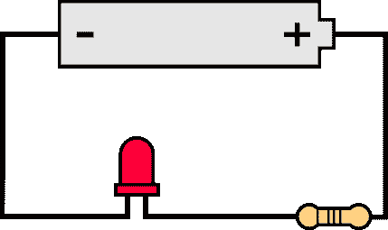](https://cdn.sparkfun.com/assets/6/e/8/3/c/51f93d85757b7f2049270817.png)

### 330 欧姆电阻器

对于大多数 led 来说，一个好的电阻值是 **330 欧姆** ( 橙色 - 橙色-棕色 )。您可以使用上一节中的信息来帮助您确定您需要的确切值，但这是 led*而不是*数学...因此，首先在上述电路中接入一个 330 欧姆的电阻，看看会发生什么。

[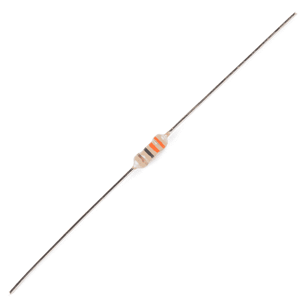](https://cdn.sparkfun.com/assets/learn_tutorials/7/1/14490-02_330OhmResistor.jpg)

### 反复试验

电阻的有趣之处在于，它们会以热量的形式消耗额外的功率，因此，如果你的电阻变热，你可能需要使用较小的电阻。然而，如果你的电阻太小，你就有烧坏 LED 的危险！假设你有几个 LED 和电阻可以使用，这里有一个流程图可以帮助你通过试错法来设计你的 LED 电路:

[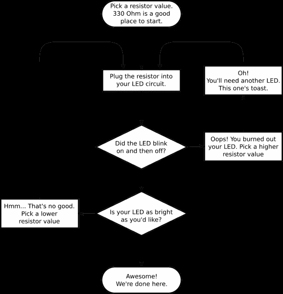](https://cdn.sparkfun.com/assets/learn_tutorials/7/1/g6109.png)

### 扔硬币电池

另一种点亮 LED 的方法是将它连接到硬币电池上。由于硬币电池不能提供足够的电流来损坏 LED，您可以将它们直接连接在一起！只需将一个 [CR2032 硬币电池](https://www.sparkfun.com/products/338)推入 LED 的引线之间。LED 的长腿应该接触到标有“+”的电池一侧。现在你可以用胶带把整个东西包起来，加上磁铁，然后把它粘在东西上！为[投掷运动员](http://www.instructables.com/id/LED-Throwies/)欢呼！

[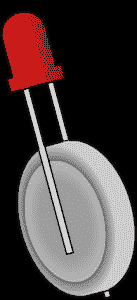](https://cdn.sparkfun.com/assets/2/2/9/3/8/51f94eed757b7f573d96660d.png)

当然，如果你用试错法没有得到很好的结果，你可以随时拿出计算器来算一算。别担心，为您的电路计算最佳电阻值并不难。但是在你能算出最佳电阻值之前，你需要为你的 LED 找到最佳电流。为此，我们需要向数据表报告...

## 获取详细信息

不要把任何奇怪的发光二极管插到你的电路里，那是不健康的。先去了解他们。还有比阅读数据手册更好的方法。

作为一个例子，我们将仔细阅读我们的[基本红色 5 毫米 LED](https://www.sparkfun.com/products/9590) 的[数据表](http://www.sparkfun.com/datasheets/Components/LED/COM-09590-YSL-R531R3D-D2.pdf)。

### LED 电流

从顶层开始往下走，首先映入眼帘的是这张迷人的桌子:

[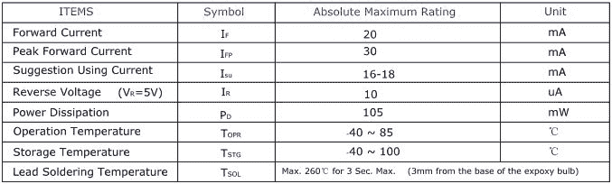](https://cdn.sparkfun.com/assets/8/a/5/0/2/51f20420ce395fe058000000.JPG)

啊，是的，但是这意味着什么？

表中的第一行表示您的 LED 能够持续处理多少电流。在这种情况下，你可以给它 20mA 或更少，它会在 20mA 时发出最亮的光。第二行告诉我们短脉冲串的最大峰值电流应该是多少。这种 LED 可以处理 30mA 的短时冲击，但你不希望维持电流太长时间。该数据手册甚至有助于建议 16-18mA 的稳定电流范围(从上往下第三行)。这是一个很好的目标值，可以帮助您进行我们讨论过的电阻计算。

下面几行对于本教程来说不太重要。在大多数情况下，反向电压是一个二极管特性，不必担心。功耗是指 LED 在受到损坏之前可以使用的功率，单位为毫瓦。只要您将 LED 保持在其建议的额定电压和电流范围内，这应该会自行解决。

### LED 电压

让我们看看他们还在这里放了什么样的桌子...啊！

[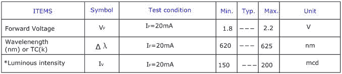](https://cdn.sparkfun.com/assets/4/4/9/0/9/51f6d886ce395f8c67000006.jpg)

这是一个有用的小桌子！第一行告诉我们 LED 两端的**正向电压**将会是多少。使用 led 时，正向电压是一个经常出现的术语。这个数字将帮助你决定你的电路需要给 LED 提供多少电压。如果有多个 LED 连接到一个电源，这些数字非常重要，因为所有 LED 的正向电压加在一起不能超过电源电压。我们将在本教程的[部分更深入地讨论这个问题。](https://learn.sparkfun.com/tutorials/light-emitting-diodes-leds/delving-deeper)

### LED 波长

这张表上的第二行告诉我们光的波长。波长基本上是解释光是什么颜色的一种非常精确的方式。这个数字可能会有一些变化，所以这个表给了我们一个最小值和一个最大值。在这种情况下，它是 620 到 625 纳米，正好在光谱的红色低端(620 到 750 纳米)。同样，我们将在[部分更深入地研究](https://learn.sparkfun.com/tutorials/light-emitting-diodes-leds/delving-deeper)波长。

### LED 亮度

最后一行(标有“发光强度”)是衡量 led 灯亮度的指标。单位 mcd，或**毫坎德拉**，是测量光源强度的标准单位。这种 LED 的最大强度为 200 mcd，这意味着它的亮度足以引起你的注意，但不是手电筒的亮度。在 200 mcd 时，这个 LED 将成为一个很好的指示器。

### 视角

[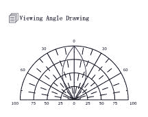](https://cdn.sparkfun.com/assets/0/f/0/4/a/51f2041fce395f9356000000.JPG)

接下来，我们得到了这个代表 LED 视角的扇形图。不同风格的发光二极管将结合透镜和反射镜，要么将大部分光线集中在一个地方，要么尽可能广泛地传播。有些发光二极管就像泛光灯，向四面八方发射光子；其他的方向性很强，除非你直视它们，否则你无法判断它们是否开启。为了阅读该图，想象 LED 直立在其下。图上的“辐条”代表视角。圆形线以最大强度的百分比表示强度。这款 LED 的视角非常窄。你可以看到，直视 LED 是它最亮的时候，因为在 0 度时，蓝线与最外面的圆相交。要获得 50%的视角，即光线强度减半的角度，请沿着图表周围的 50%圆，直到它与蓝线相交，然后沿着最近的辐条读出角度。对于这种 LED，50%视角约为 20 度。

### 规模

[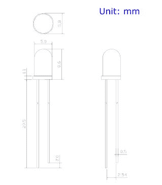](https://cdn.sparkfun.com/assets/3/2/5/b/9/51f2041fce395f9856000000.JPG)

最后是机械制图。这张图片包含了将 LED 实际安装在外壳中所需的所有尺寸！注意，像大多数 led 一样，这个底部有一个小凸缘。当你想把它安装在面板上时，这很方便。只需钻一个大小适合 LED 灯体的孔，凸缘就能防止它掉下来！

现在你已经知道如何解读数据手册，让我们看看你在野外可能会遇到什么样的奇特 led...

## 发光二极管的类型

恭喜你，你知道基本知识了！也许你已经拿到了几个发光二极管，并开始点亮东西，这太棒了！你想加强你的 blinky 游戏吗？让我们来谈谈如何让它超越你的标准 LED。

[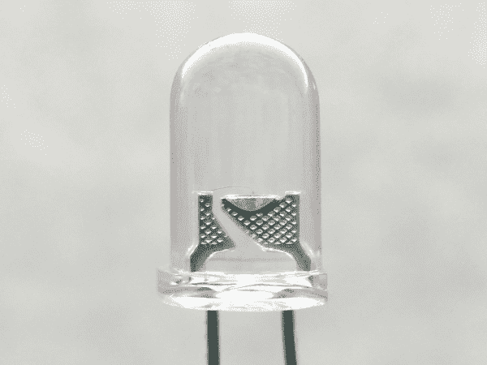](https://cdn.sparkfun.com/assets/learn_tutorials/7/1/SuperBrightLED_ZoomedIn.jpg)*Close Up of Super Bright 5mm LED Close Up*

### 发光二极管的类型

这是其他角色的演员阵容。

### rgb led

[RGB(红绿蓝)led](https://www.sparkfun.com/search/results?term=rgb+led)其实是三合一的 led！但这并不意味着它只能做出三种颜色。因为红色、绿色和蓝色是附加的原色，所以您可以控制每种颜色的强度来创建彩虹的每种颜色。大多数 RGB LEDs 有四个引脚:每种颜色一个，还有一个公共引脚。在某些情况下，普通引脚[是阳极](https://www.sparkfun.com/products/10820)，而在其他情况下，[是阴极](https://www.sparkfun.com/products/105)。

[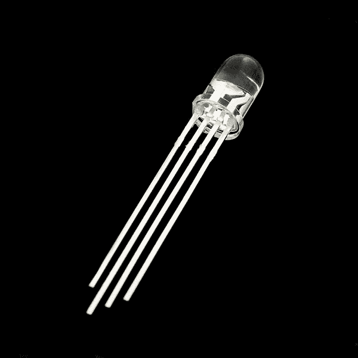](https://cdn.sparkfun.com/assets/learn_tutorials/7/1/00105-03-LCommonClearCathode.jpg)*RGB Common Clear Cathode LED*

### 集成电路发光二极管

#### 自行车运动

有些 led 比其他的更智能。以[循环 LED](https://www.sparkfun.com/search/results?term=rgb+cycling) 为例。在这些 LED 内部，实际上有一个[集成电路](https://learn.sparkfun.com/tutorials/integrated-circuits)，它允许 LED 在没有任何外部控制器的情况下闪烁。这是控制颜色的集成电路(铁砧顶端的黑色大方块)的特写。

[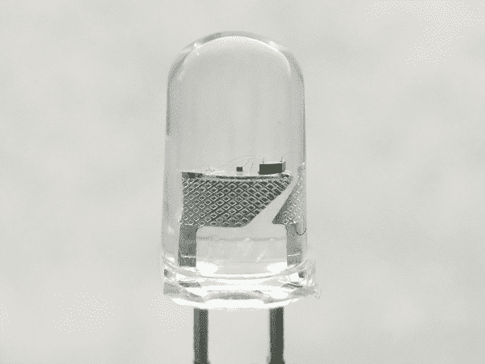](https://cdn.sparkfun.com/assets/learn_tutorials/7/1/SlowCyclingLED_ZoomedIn.jpg)*5mm Slow Cycling LED Close Up*

只需打开电源，看着它走！对于那些想要更多动作但没有空间放置控制电路的项目来说，这是非常棒的。甚至还有 RGB 闪烁的 led，循环成千上万种颜色！

#### 可寻址 led

其他类型的发光二极管可以单独控制。有不同的芯片组( [WS2812](https://www.sparkfun.com/search/results?term=ws2812) 、 [APA102](https://www.sparkfun.com/search/results?term=apa102) 、 [UCS1903](https://www.sparkfun.com/products/14555) ，仅举几个例子)用于控制链接在一起的单个 LED。下面是一个 WS2812 的特写。右边较大的方形 IC 单独控制颜色。

[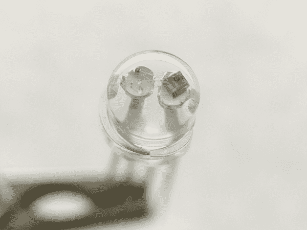](https://cdn.sparkfun.com/assets/learn_tutorials/7/1/AddressableLEDWS2812_ZoomedIn.jpg)*Addressable WS2812 PTH Close Up*

#### [内置电阻](#LED-built-in-resistor)

这是什么魔法？内置电阻的 LED？没错。还有一些 led 包含一个小的限流电阻。如果你仔细看下面的图像，在柱子上有一个小的黑色方形 IC 来限制这些类型的 led 的电流。

[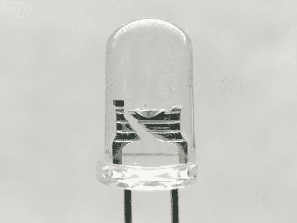](https://cdn.sparkfun.com/assets/learn_tutorials/7/1/SuperBrightLEDwithBuiltInResistor_ZoomedIn.jpg)*LED with Built-In Resistor Close Up*

所以把内置电阻的 LED 插到你的电源上，点亮它！我们已经在 3.3V、5V 和 9V 下测试了这些类型的 led。

[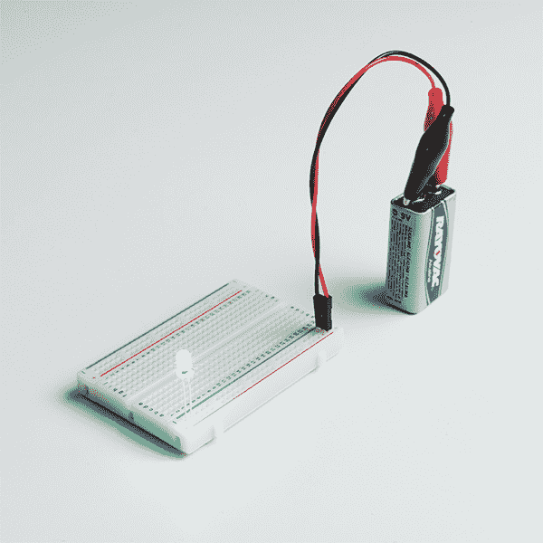](https://cdn.sparkfun.com/assets/learn_tutorials/7/1/14563-LED_-_Green_with_Resistor_5mm__25_pack_.jpg)*Super Bright Green LED with Built in Resistor Powered***Note:** The datasheet for the LEDs with built-in resistor indicates that the recommended forward voltage is around 5V. Testing one out at 5V, it pulls about 18mA. Stress testing with a 9V battery, it pulls about 30mA. This is probably at the higher end of the input voltage. Using a higher voltage can reduce the life of the LED. At about 16V, the LED blew out under our stress tests.

### 表面贴装(SMD)封装

[SMD LED](https://www.sparkfun.com/products/10866)与其说是一种特定的 LED，不如说是一种封装类型。随着电子产品变得越来越小，制造商已经想出如何在更小的空间里塞进更多的元件。SMD(表面贴装器件)器件是其标准对应物的微小版本。这是一个封装在小型 5050 封装中的 WS2812B 可寻址 LED 的特写镜头。

*Addressable WS2812B Close Up*

SMD LEDs 有几种尺寸，从相当大的到比米粒还小的都有！因为它们太小了，而且有衬垫而不是腿，所以不容易操作，但如果你空间紧张，它们可能正是医生要求的。

| [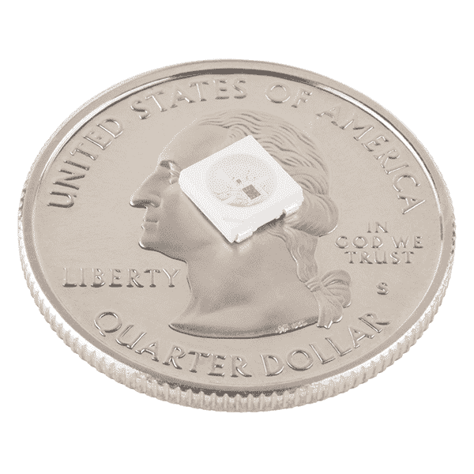](https://cdn.sparkfun.com/assets/learn_tutorials/7/1/13667-02_SMD-WS2812B_5050.jpg) | [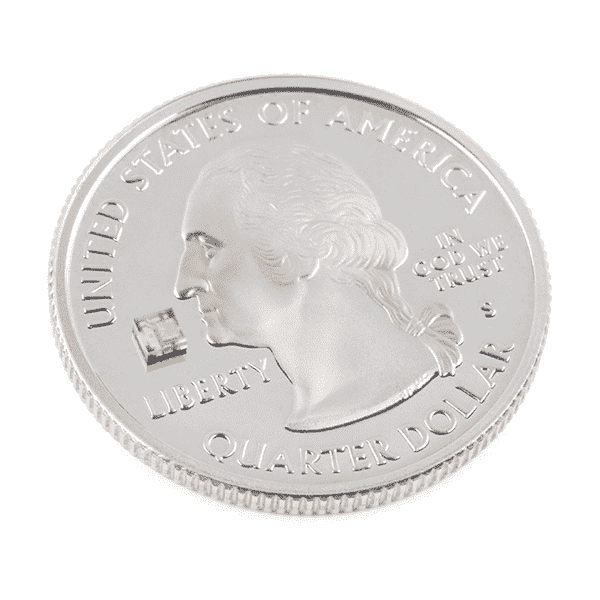](https://cdn.sparkfun.com/assets/learn_tutorials/7/1/14608-SMD_LED_-_RGB_APA102-2020.jpg) |
| *WS2812B-5050 包装* | *APA102-2020 包装* |

SMD LEDs 也使拾取和放置机器更容易和更快地将大量 led 填充到 PCB 和条带上。你可能不会手工焊接所有这些组件。

| [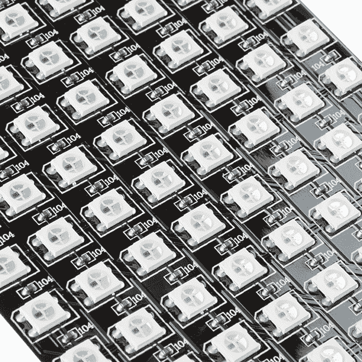](https://cdn.sparkfun.com/assets/learn_tutorials/7/1/13304-03_FlexibleLEDMatrix_8x32_WS2812B.jpg) | [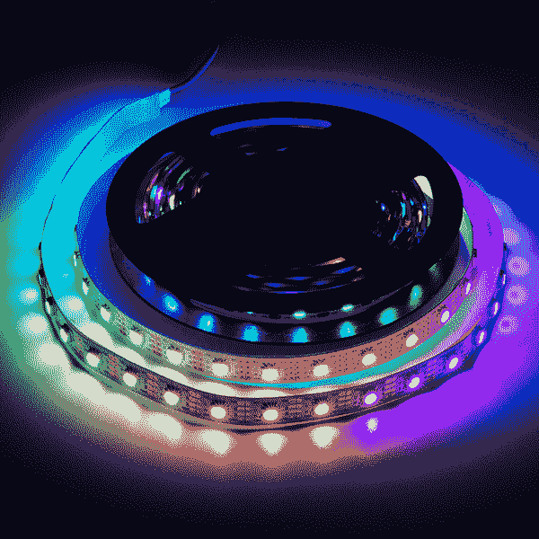](https://cdn.sparkfun.com/assets/learn_tutorials/7/1/14016-action_Addressable_LED_Strip_APA102.jpg) |
| *8x 32 可寻址(WS2812-5050) LED 矩阵特写* | *5M 可寻址(APA102-5050) LED 条供电* |

### 大功率的

Luxeon 和 CREE 等制造商生产的高功率 led 灯非常亮。这些比超亮的还要亮！一般来说，如果 LED 能够消耗 1 瓦或更多的功率，则被认为是高功率的。这些是你在非常好的手电筒中发现的奇特的发光二极管。它们的阵列甚至可以用于聚光灯和汽车前灯。因为有太多的能量通过 LED 泵出，这些通常需要散热器。一个[散热器](https://www.sparkfun.com/tutorials/314)基本上是一大块导热金属，具有很大的表面积，其作用是将尽可能多的废热转移到周围的空气中。可以在分线板的设计中内置一些散热装置，如下图所示。

|  | [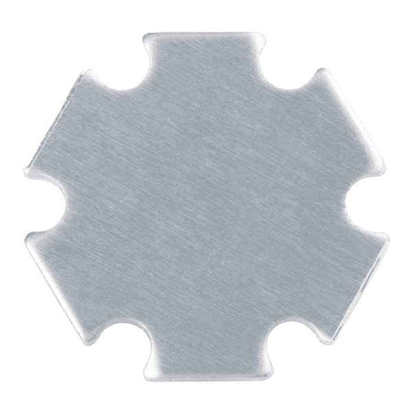](https://cdn.sparkfun.com/assets/learn_tutorials/7/1/08718-03b_HighPowerLED_Aluminum_Back.jpg) |
| *高功率 RGB LED* | *铝制背板用于散热* |

高功率 led 会产生大量的废热，如果没有适当的冷却，它们会损坏自己。不过，不要让“废热”这个术语欺骗了你，与传统灯泡相比，这些设备仍然非常高效。为了控制，你可以使用一个[恒流 LED 驱动器](https://www.sparkfun.com/products/13716)。

### 特殊发光二极管

甚至有发光二极管发出正常可见光谱之外的光。例如，你可能每天都在使用红外发光二极管。它们被用在像电视遥控器这样的东西上，以不可见光的形式发送小块信息！这些可能看起来像标准的 led，所以很难与普通的 led 区分开来。

[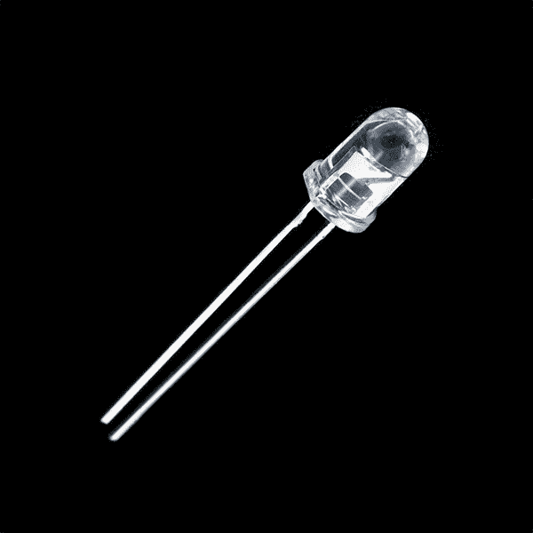](https://cdn.sparkfun.com/assets/learn_tutorials/7/1/09469-1_Infrared_LED_850nm.jpg)*IR LED*

在光谱的另一端，你还可以看到紫外线发光二极管。紫外线发光二极管会使某些材料发出荧光，就像一个黑光灯！它们也用于表面消毒，因为许多细菌对紫外线辐射敏感。它们也可能被用于检测伪钞(钞票、信用卡、文件等)，晒伤，等等。使用这些 led 时，请佩戴护目镜。

[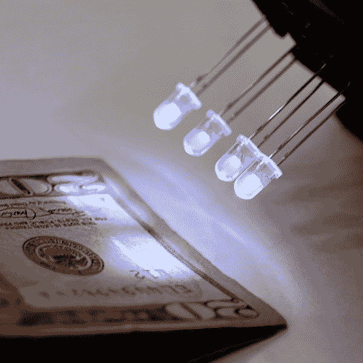](https://cdn.sparkfun.com/assets/learn_tutorials/7/1/08662-02-L_Ultraviolet_LED.jpg)*UV LED Inspecting a US Bill*

### 更多 led

有了这样的发光二极管，你就没有理由让任何东西不亮了。然而，如果你对 LED 知识的渴望还没有得到满足，那么请继续阅读，我们将深入了解 LED、颜色和发光强度的本质！

## 深入探究

你已经从 LEDs 101 毕业了，还想要更多？别担心，我们还有更多。让我们从发光二极管背后的科学开始...犯罪...眨眼。我们已经提到过 led 是一种特殊的二极管，但让我们更深入地探究一下它的确切含义:

我们所说的 LED 实际上是 LED 和封装在一起，但 LED 本身实际上很小！这是一个掺杂了杂质的半导体材料芯片，为电荷载流子创造了一个边界。当电流流入半导体时，它从边界的一边跳到另一边，在这个过程中释放能量。在大多数二极管中，能量以热的形式离开，但是在 led 中，能量以光的形式消散。

光的波长和颜色取决于制造二极管的半导体材料的类型。这是因为半导体的能带结构因材料而异，所以光子以不同的频率发射。下表按频率列出了常见的 LED 半导体:

[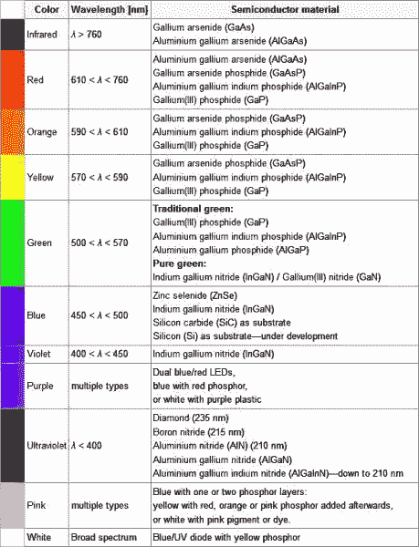](https://cdn.sparkfun.com/assets/5/b/5/b/a/51f95fcd757b7f6f3dcb351f.jpg)*Truncated table of semiconductor materials by color. The full table is available on the [Wikipedia entry for "LED"](https://en.wikipedia.org/wiki/LED)*

虽然光的波长取决于半导体的带隙，但光的强度取决于通过二极管的功率。在上一节中，我们谈了一点发光强度，但这不仅仅是用一个数字来表示某物看起来有多亮。

测量发光强度的单位称为坎德拉，尽管当你谈论单个 led 的强度时，你通常在毫坎德拉范围内。有趣的是，这个单位并不是光能量的真正度量，而是“亮度”的实际度量。这是通过获取在特定方向发射的功率并用光的亮度函数对该数字进行加权来实现的。人眼对某些波长的光比其他波长的光更敏感，光度函数是解释这种敏感性的标准化模型。

发光二极管的发光强度从几十到几万毫烛光不等。你的电视上的电源灯可能是 100 mcd 左右，而一个好的手电筒可能是 20，000 mcd。直视任何比几千毫烛光更亮的东西都是痛苦的；不要尝试。

### 正向电压降

哦，我还答应了我们要讨论正向压降的概念。还记得我们看数据手册时提到的所有 led 的正向电压加在一起不能超过系统电压吗？这是因为电路中的每个元件都必须*分担*电压，并且每个元件一起使用的电压量将总是等于可用的电压量。这被称为[基尔霍夫电压定律](https://en.wikipedia.org/wiki/Kirchhoff%27s_circuit_laws)。因此，如果您有一个 5V 电源，每个 led 的正向压降为 2.4V，那么您不能同时为两个以上的 led 供电。

当您希望根据其它器件的正向电压来估算给定器件上的电压时，基尔霍夫定律也会派上用场。例如，在我刚才给出的例子中，有一个 5V 电源和 2 个 led，每个 led 的正向压降为 2.4V。我们当然希望包含限流电阻，对吧？你怎么知道电阻两端的电压？这很简单:

> 5(系统电压)= 2.4 (LED 1) + 2.4 (LED 2) +电阻器
> 
> 5 = 4.8 +电阻
> 
> 电阻器= 5 - 4.8
> 
> 电阻= 0.2

所以电阻上有 2V 电压！这是一个简化的例子，并不总是这么简单，但希望这能让你明白为什么正向压降如此重要。利用你从基尔霍夫定律得到的电压值，你还可以利用欧姆定律来确定通过一个元件的电流。简而言之，**您希望系统电压等于组合电路元件的预期正向电压。**

### 计算限流电阻

如果您需要计算与 LED 串联的精确限流电阻值，请查看电阻教程中的[示例应用，了解更多信息。](https://learn.sparkfun.com/tutorials/resistors#current-limiting)

|  |
| [用于计算限流电阻的方程式](https://learn.sparkfun.com/tutorials/resistors#current-limiting) |

## 资源和更进一步

你成功了！你知道，就像，几乎所有的事情...关于 led。现在去把发光二极管放在你喜欢的地方吧！如今，现在...一个没有限流电阻的 LED 被过度供电并自行烧毁的戏剧性再现:

[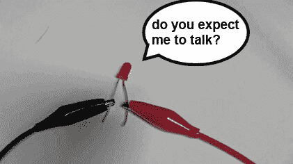](https://cdn.sparkfun.com/assets/b/9/b/8/5/51f1e90dce395fba20000002.gif)Yeah... it's not spectacular.

如果您想了解更多与 LED 相关的主题，请访问以下其他教程:

 [### 光](https://learn.sparkfun.com/tutorials/light) Light is a useful tool for the electrical engineer. Understanding how light relates to electronics is a fundamental skill for many projects.[Favorited Favorite](# "Add to favorites") 24 [### 红外通信](https://learn.sparkfun.com/tutorials/ir-communication) This tutorial explains how common infrared (IR) communication works, as well as shows you how to set up a simple IR transmitter and receiver with an Arduino.[Favorited Favorite](# "Add to favorites") 42 [### 闪烁的顶部](https://learn.sparkfun.com/tutorials/das-blinken-top-hat) A top hat decked out with LED strips makes for a heck of a wedding gift.[Favorited Favorite](# "Add to favorites") 1 [### 发光二极管是如何制造的](https://learn.sparkfun.com/tutorials/how-leds-are-made) We take a tour of a LED manufacturer and learn how PTH 5mm LEDs are made for SparkFun.[Favorited Favorite](# "Add to favorites") 18 [### 使用串行 7 段显示器](https://learn.sparkfun.com/tutorials/using-the-serial-7-segment-display) How to quickly and easily set up the Serial 7-Segment Display and the Serial 7-Segment Display Shield.[Favorited Favorite](# "Add to favorites") 14 [### LED 灯条连接](https://learn.sparkfun.com/tutorials/led-light-bar-hookup) A quick overview of SparkFun's LED light bars, and some examples to show how to hook them up.[Favorited Favorite](# "Add to favorites") 10 [### 西蒙说组装指南](https://learn.sparkfun.com/tutorials/simon-says-assembly-guide) No matter what flavor of the Simon Says Through-hole Soldering Kit you've purchased, this tutorial is here to guide you through the entire build process.[Favorited Favorite](# "Add to favorites") 4 [### Lumenati Hookup Guide](https://learn.sparkfun.com/tutorials/lumenati-hookup-guide) Lumenati is our line of APA102c-based addressable LED boards. We'll show you how to bring the sparkle to your projects 5

## 有兴趣了解更多关于 led 的信息吗？

查看我们的 **[LED](https://www.sparkfun.com/leds)** 页面，了解在您的项目中开始使用这些组件所需的一切。

带我去那里！

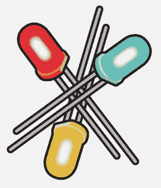

或者看看这些相关的博客帖子:

 [### 底层竞赛:LED 灯泡和 DFM

May 11, 2015](https://www.sparkfun.com/news/1821 "May 11, 2015: The dropping cost of LED bulbs is accelerating. We compare a few brands to see how they are approaching design and lower cost manufacturing.")[Favorited Favorite](# "Add to favorites") 7 experiments with DIY lamps and nail art") [### 紫外线发光二极管、光引发剂和凝胶指甲油的冒险

April 19, 2016](https://www.sparkfun.com/news/2073 "April 19, 2016: My (successful) experiments with DIY lamps and nail art")[Favorited Favorite](# "Add to favorites") 0 [### t:使用发光二极管作为光传感器

August 9, 2016](https://www.sparkfun.com/news/2161 "August 9, 2016: It's a known trick that we can use LEDs in reverse. We'll explore how to use them as photodetectors with Arduino and create a simple demo that responds to hand swipes.")[Favorited Favorite](# "Add to favorites") 2 [### 3D 打印焊接辅助手

April 16, 2018](https://www.sparkfun.com/news/2661 "April 16, 2018: A review of an extremely useful device to help you with soldering.")[Favorited Favorite](# "Add to favorites") 0 [### ATP:led 电路设计

July 2, 2018](https://www.sparkfun.com/news/2723 "July 2, 2018: We tend to over-simplify the act of dropping an LED into a circuit. But do you know what all of those specs in the data sheet mean?")[Favorited Favorite](# "Add to favorites") 0 [### 数学褪色

December 26, 2018](https://www.sparkfun.com/news/2844 "December 26, 2018: Chances are, you may never use all 16 million colors available to you with your RGB LEDs. But whatever colors you use, you should know how to smoothly fade from one color to another. And thanks to the wonders of math, now you can!")[Favorited Favorite](# "Add to favorites") 4