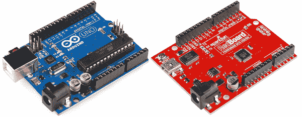
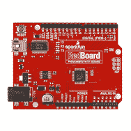
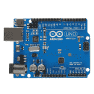
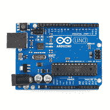
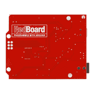
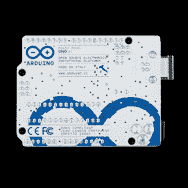
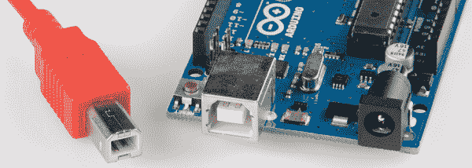
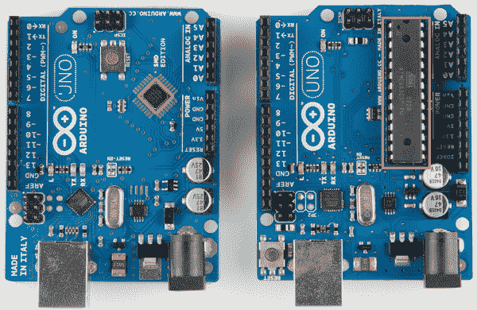
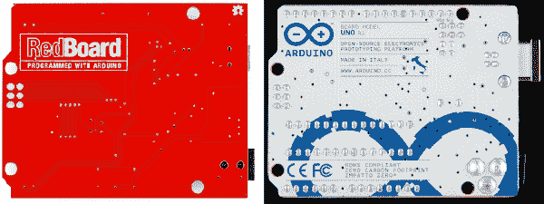

# RedBoard 对 Uno

> 原文：<https://learn.sparkfun.com/tutorials/redboard-vs-uno>

## 什么是 RedBoard？

Arduino 是当今最流行的物理计算平台之一。对于有经验的和初露头角的电子爱好者来说，这都是一个神奇的工具。它部分是硬件，部分是软件，部分是社区；所有这些共同创造了一个支持良好、设计可靠的电子平台。

最好的部分:整个 Arduino 项目——包括硬件和软件——都是开源的。[原理图](http://arduino.cc/en/uploads/Main/Arduino_Uno_Rev3-schematic.pdf)、硬件设计文件、[源代码](https://github.com/arduino/Arduino)都可以免费查看和修改。在[知识共享许可](http://creativecommons.org/licenses/by-sa/3.0/)下发布，任何人都可以自由重复硬件设计并制作自己的版本。这就是我们对[红板](https://www.sparkfun.com/products/11575)所做的。它的外观和行为仍然与 Arduino Uno 相似，但稍作修改，使该板更适合我们的目的。

*An [Arduino Uno PTH](https://www.sparkfun.com/products/11021) (left, blue) next to a [RedBoard](https://www.sparkfun.com/products/11575).*

我们的[介绍视频](http://www.youtube.com/watch?v=su0sYPqyV_w&feature=youtu.be&t=3m25s)掩盖了 RedBoard 与 Arduino Uno 的一些不同之处:

替换打开

[https://www.youtube.com/embed/su0sYPqyV_w?rel=0&start=205&end=268&autoplay=0](https://www.youtube.com/embed/su0sYPqyV_w?rel=0&start=205&end=268&autoplay=0)

替换关闭

在本教程中，我们将深入了解这两种主板之间的主要异同。简而言之，关键信息如下:

#### 主要差异

*   **USB 连接器** : Arduino Uno 使用 USB type B 连接器，而 Redboard 使用较小的 mini-B 连接器。每个连接器需要不同的 USB 电缆。
*   **USB 转串行转换器**:Arduino Uno 使用一个加载了定制固件的 ATmega16U2 在 USB 和串行之间转换。RedBoard 使用 FTDI FT231X。这种差异只有在**安装驱动**时才真正普遍，因为每个驱动都需要不同的驱动文件。
*   **SMD vs PTH**:Arduino Uno 有两种版本，通孔(PTH)或表面贴装(SMD)。RedBoard 仅在 SMD 中提供。RedBoard 更进一步，让*的每个*元件表面贴装。板子底部没有锋利的边缘！
*   这不会对 Arduino 的操作产生任何实际影响，但肯定会影响主板的 swag-factor。酷蓝还是~~费拉里~~火花红？
*   **价格**:因为我们在科罗拉多州博尔德市内部制造主板，所以我们可以将价格降低一点。

#### 主要相似之处

*   **ATmega328** :两块板上的主微处理器都是流行的 ATmega328。这是他们最重要的相似之处。
*   **IDE 交互/板卡选择类型**:两块板卡上的 ATmega328 加载了相同的 bootloader (Optiboot)。也就是说，当你对板卡编程时，你仍然可以在*工具>板卡*菜单下选择 *Arduino Uno* 。
*   **尺寸和连接器布局**:两块板的尺寸和形状相同，母头连接器都放在相同的位置。所有屏蔽和外壳将与两种板兼容。
*   **数字和模拟引脚**:每块板卡有 14 个数字 I/o 和 6 个模拟 I/o。
*   **工作电压**:两块板都工作在 5V，有一个板载 3.3V 稳压器。它们可以通过 USB 或 7-15V 桶形插孔电源供电。

## 比较和对比

RedBoard、Arduino Uno SMD 和 Arduino Uno PTH 有许多共同之处。他们的相似之处确实多于不同之处。这里有一个列表概述:

|  | [红纸板](https://www.sparkfun.com/products/11575) | [Arduino Uno SMD](https://www.sparkfun.com/products/11224) | Arduino Uno PTH |
| 俯视图 |  |  |  |
| 仰视图 |  |  |  |
| 规模 | 2.7 x 2.1 英寸(68.58 x 53.34mm 毫米) | 2.7 x 2.1 英寸(68.58 x 53.34mm 毫米) | 2.7 x 2.1 英寸(68.58 x 53.34mm 毫米) |
| 颜色 | 红色 | 蓝色/白色 | 蓝色/白色 |
| USB 连接器 | 迷你 B 型 | 型个性 | 型个性 |
| USB 转串行芯片 | FTDI FT231X | ATmega16U2 带定制固件 | ATmega16U2 带定制固件 |
| 驱动程序(Windows) | FTDI VCP 司机 | Arduino USB 驱动程序 | Arduino USB 驱动程序 |
| Windows 兼容性 | 8 (32 位和 64 位)、7 (32 位和 64 位)、Vista (32 位和 64 位)、XP (32 位和 64 位)、2000、98 [*](http://www.ftdichip.com/FTDrivers.htm) | 8 (32 位和 64 位)、7 (32 位和 64 位)、Vista (32 位和 64 位)、XP (32 位和 64 位) | 8 (32 位和 64 位)、7 (32 位和 64 位)、Vista (32 位和 64 位)、XP (32 位和 64 位) |
| Mac 兼容性 | OS X，OS 9，OS 8 | OS X | OS X |
| Linux 兼容性 | 是 | 是 | 是 |
| 主微处理器 | ATmega328 | ATmega328 | ATmega328 |
| MCU PTH 或 SMD | DoctorofSacredMusic 圣乐博士 | DoctorofSacredMusic 圣乐博士 | PTH |
| V [在]范围内(推荐) | 7-15 伏 | 7-12V | 7-12V |
| 工作电压 | 5V | 5V | 5V |
| 数字 I/O 引脚 | Fourteen | Fourteen | Fourteen |
| 模拟输入 | six | six | six |
| Arduino *板*选择 | Arduino Uno | Arduino Uno | Arduino Uno |
| 零售价 | $24.95 | $29.95 | $24.95 |

* * *

接下来，我们将深入探讨 RedBoard 和 Arduino Uno 之间最显著的差异。

## USB 连接器和驱动程序

Arduino Uno 和 Redboard 都通过 USB 与计算机接口，但[连接器](../connector-basics/usb-connectors)不同。Arduino Uno 使用较大的方形 B 型连接器。B 型 USB 连接器通常出现在 USB 打印机或其他尺寸不是问题的设备上。

RedBoard 使用一个 **mini-B USB** 连接器。Mini-B 连接器是薄型 USB 连接器，可以在相机、MP3 播放器和手机上找到。

显然，你需要一根**电缆**来匹配开发板上的连接器。Arduino Uno 需要一根 [A 到 B](https://www.sparkfun.com/products/512) 线缆，而 RedBoard 需要一根 [A 到 mini-B](https://www.sparkfun.com/products/11301) 线缆(或者你可以用一根 [Cerberus 线缆](https://www.sparkfun.com/products/11515)覆盖两个底座)。

### USB 转串行转换器

主板之间的第二个区别是它们如何将来自计算机的 USB 转换成 Arduino 可以理解的串行协议。Arduino 串行通信对于**上传草图**和通过**串行监视器**发送/接收信息至关重要。Uno 使用装载了定制固件的 Atmel 处理器 ATmega16U2 来将 USB 转换为串行(或从串行转换)。

在 Arduino Uno 发布之前,[开发平台的早期版本](http://arduino.cc/en/Main/Boards)使用专用的 USB 转串行收发器:FTDI 的 FT232RL。你可以说我们怀旧，但与 ATmega16U2 解决方案相比，我们更喜欢 FT232RL 的强大可靠性。因此，当我们设计自己版本的 Arduino 平台时，我们决定回归 FT232RL，以满足我们的 USB 转串行需求。

大约 99%的时候，这些 IC 应该与你日常的 Arduino 黑客行为无关。一旦安装了驱动程序，每个驱动程序都应该在 Arduino 和计算机之间透明地转换数据。当您第一次将主板连接到计算机时，两种 USB/串行收发器之间的差异最为明显。

### USB 驱动程序安装

特别是对于 Windows 用户来说，每块主板都需要安装一个独特的**驱动程序**才能使用。这两种芯片都有大量的安装教程([我们的 FTDI 驱动安装指南](https://learn.sparkfun.com/tutorials/how-to-install-ftdi-drivers)和 [Arduino 的他们的指南](http://arduino.cc/en/Guide/Windows))。

最新版本的 FTDI 驱动程序可以直接从[芯片制造商的网页](http://www.ftdichip.com/Drivers/VCP.htm)上下载，那里有他们自己的[安装指南](http://www.ftdichip.com/Support/Documents/InstallGuides.htm)。应该不缺乏对驱动安装的支持。

一旦主板连接到您的计算机上，并且安装了驱动程序，这两个芯片就几乎看不见了。在很大程度上，我们并不关心 Arduino 如何与我们的电脑通信，只是关心它如何通信。

## SMD 与 PTH 之比较

Arduino Uno 有两种形式:[表面贴装(SMD)](https://www.sparkfun.com/products/11224) 和[通孔(PTH)](https://www.sparkfun.com/products/11021) 。两个版本非常相似，唯一的显著区别来自 ATmega328 处理器的封装。SMD 元件通常更容易大规模组装(尽管手工组装更困难)，因此 SMD 版本的 Uno 要么更便宜，要么更容易获得，或者两者兼而有之。

*An SMD Arduino Uno (left) and the regular PTH version. The ATmega328 processors are highlighted on each board, they look different, but are actually (pretty much) the same thing.*

RedBoard 只提供一种形式:表面贴装。实际上，该设计通过将每个元件都做成*SMD(例如，Arduino UNO SMD 仍然有 PTH 连接器)，进一步扩大了 SMD 的选择范围，但 SMD 与 PTH 之争的主要焦点集中在微控制器的封装上(如上图所示)。*

### SMD 的利与弊

#### 优点:没有障碍，成本较低

红色电路板上没有 PTH 元件意味着电路板底部有一个漂亮、光滑的表面——没有被尖的焊点刺伤的危险。

最重要的是，消除电路板底部的裸露接头还可以防止元件意外短路。任何一个有着凌乱办公桌的业余爱好者都可以证明，散落在工作台上的电线碎片和其他金属是意外短路的常见来源。如果你使用 Arduino 板，[支架](https://www.sparkfun.com/products/10927)或 [Arduino 支架](https://www.sparkfun.com/products/11235)将有助于防止这种情况。

#### 缺点:很难交换 Cs

微控制器(Cs)——在这种情况下是 atmega 328——通常是设计中最昂贵的组件。C 故障 [*](#astrisk) 很难克服，通常需要更换组件或回收电路板。

PTH Arduino 的好处是 ATmega328 是插座式的，所以*如果*它炸了 [*](#astrisk) 更换芯片就像撬开它并插入一个[新的](https://www.sparkfun.com/products/10524)一样简单。

轻松移除 ATmega328 的能力还有其他优势。例如，如果您希望利用 IC 构建一个项目，您可以在开发板中制作原型，并最终将微控制器从 Uno 转移到定制板上。

*:所有这些板上的微控制器故障都是一个很大的“如果”。ATmega328 是一款非常灵活的微控制器。你真的得试着烧坏 IC，甚至是上面的一个 I/O 引脚。电源电路(特别是电压调节器)更有可能出现故障。

## 资源和更进一步

现在，您已经对您的开发板选择及其优缺点感到满意，是时候探索 Arduino 的世界了！

这里有几个简单的教程可以帮助你开始学习:

*   [Arduino 是什么？](https://learn.sparkfun.com/tutorials/what-is-an-arduino)
*   [什么是电](https://learn.sparkfun.com/tutorials/what-is-electricity)
*   [电压、电流、电阻和欧姆定律](https://learn.sparkfun.com/tutorials/voltage-current-resistance-and-ohms-law)
*   [安装 Arduino](https://learn.sparkfun.com/tutorials/installing-arduino-ide)

这里有一些更高级的教程，如果你已经准备好接受更多的 Arduino 世界！

*   [安装 Arduino 库](https://learn.sparkfun.com/tutorials/installing-an-arduino-library)
*   [将 Arduino 连接到处理](https://learn.sparkfun.com/tutorials/connecting-arduino-to-processing)
*   [Arduino 盾牌](https://learn.sparkfun.com/tutorials/arduino-shields)

## 资源

更多关于 SparkFun Redboard 的信息，请查看我们的[产品页面](https://www.sparkfun.com/products/11575)。我们还有:

*   [原理图](http://cdn.sparkfun.com/datasheets/Dev/Arduino/Boards/RedBoard-v06.pdf)-PDF 格式的原理图。
*   [Eagle 文件](http://cdn.sparkfun.com/datasheets/Dev/Arduino/Boards/RedBoard-v06.zip)-PCB 设计文件。这个设计是完全开源的！
*   FTDI 驱动程序 -虽然它们包含在 Arduino 安装中，但是在这里你可以找到最新的 FTDI VCP 驱动程序。
*   [产品视频](http://www.youtube.com/watch?v=su0sYPqyV_w&feature=youtu.be&t=3m25s)-red board 的视频介绍。