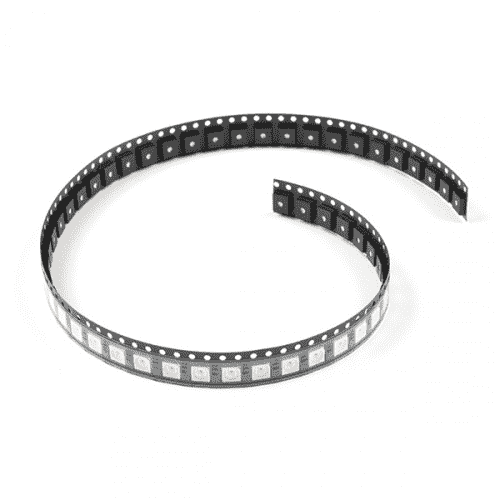
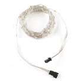
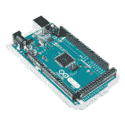
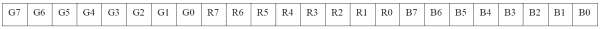
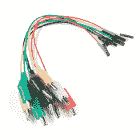
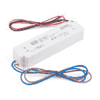
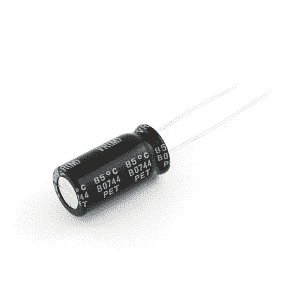
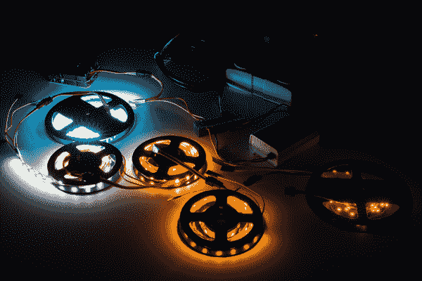

# WS2812 分线连接指南

> 原文：<https://learn.sparkfun.com/tutorials/ws2812-breakout-hookup-guide>

## 介绍

可寻址的 WS2812 和 [WS2812B](https://www.sparkfun.com/products/13667) 是不起眼的 RGB LEDs，下面隐藏着集成控制电路。我们喜欢这个小 IC/LED 组合的简单性。它是许多产品的核心。

[](https://www.sparkfun.com/products/16346) 

将**添加到您的[购物车](https://www.sparkfun.com/cart)中！**

 **### [](https://www.sparkfun.com/products/16346)

[In stock](https://learn.sparkfun.com/static/bubbles/ "in stock") COM-16346

WS2812B(或“NeoPixel”)可能看起来像一个普通的 5050 尺寸(5x5mm)的 SMD LED，但实际上有一个集成的控制电路…

$25.951[Favorited Favorite](# "Add to favorites") 9[Wish List](# "Add to wish list")****[](https://www.sparkfun.com/products/16347) 

将**添加到您的[购物车](https://www.sparkfun.com/cart)中！**

 **### [](https://www.sparkfun.com/products/16347)

[28 available](https://learn.sparkfun.com/static/bubbles/ "28 available") COM-16347

WS2812B(或“NeoPixel”)可能看起来像一个普通的 5050 尺寸的 SMD LED，但实际上有一个集成的控制电路 e…

$508.50[Favorited Favorite](# "Add to favorites") 2[Wish List](# "Add to wish list")**** ****举几个例子，WS2812B 包含在简单的 [WS2812B 分线板](https://www.sparkfun.com/products/11820)中。

[](https://www.sparkfun.com/products/13282) 

将**添加到您的[购物车](https://www.sparkfun.com/cart)中！**

 **### [SparkFun RGB LED 分线点- WS2812B](https://www.sparkfun.com/products/13282)

[In stock](https://learn.sparkfun.com/static/bubbles/ "in stock") BOB-13282

这是 WS2812B RGB LED 的分线板。WS2812B(或“NeoPixel”)实际上是一个带有 WS2811 的 RGB LED

$4.502[Favorited Favorite](# "Add to favorites") 21[Wish List](# "Add to wish list")** **### 可缝合发光二极管

[LilyPad Pixel](https://www.sparkfun.com/products/11891) 与分线板共用相同的电路，但它位于一个圆形的紫色 LilyPad 板上。这些非常适合缝制到衣服或其他织物上，并嵌入到电子纺织品项目中。

[](https://www.sparkfun.com/products/13264) 

将**添加到您的[购物车](https://www.sparkfun.com/cart)中！**

 **### [LilyPad 像素板](https://www.sparkfun.com/products/13264)

[In stock](https://learn.sparkfun.com/static/bubbles/ "in stock") DEV-13264

我们知道你喜欢为你的电子纺织品添加颜色，将 LilyPad Pixel Board 添加到你的项目中只会让它变得更好。这…

$5.95 $2.68[Favorited Favorite](# "Add to favorites") 13[Wish List](# "Add to wish list")** **### LED 灯条

WS2812B 是各种 LED 灯带的核心和灵魂。这些条有密封的和未密封的: [5 米密封的](https://www.sparkfun.com/products/12028)、[1 米密封的](https://www.sparkfun.com/products/12027)、[5 米裸露的](https://www.sparkfun.com/products/12026)和[1 米裸露的](https://www.sparkfun.com/products/12025)。

[](https://www.sparkfun.com/products/retired/12028) 

### [【LED RGB 条形可寻址密封(5m)](https://www.sparkfun.com/products/retired/12028)

[Retired](https://learn.sparkfun.com/static/bubbles/ "Retired") COM-12028

一去不复返的日子，你必须担心硅防水分裂和打破你！这些是密封的地址…

1 **Retired**[Favorited Favorite](# "Add to favorites") 14[Wish List](# "Add to wish list")[](https://www.sparkfun.com/products/retired/12025) 

### [【LED RGB 条形可寻址，裸露(1m)](https://www.sparkfun.com/products/retired/12025)

[Retired](https://learn.sparkfun.com/static/bubbles/ "Retired") COM-12025

这些是裸露的可寻址 1 米长的 5V RGB LED 灯条，每米装有 60 个 WS2812s。因为这些都是裸露的 LED

7 **Retired**[Favorited Favorite](# "Add to favorites") 13[Wish List](# "Add to wish list")[](https://www.sparkfun.com/products/retired/12026) 

### [【LED RGB 条形可寻址，裸露(5m)](https://www.sparkfun.com/products/retired/12026)

[Retired](https://learn.sparkfun.com/static/bubbles/ "Retired") COM-12026

这些是裸可寻址的 5 米长 5V RGB LED 灯条，每米装有 60 个 WS2812s。因为这些都是裸露的 LED

2 **Retired**[Favorited Favorite](# "Add to favorites") 13[Wish List](# "Add to wish list")[](https://www.sparkfun.com/products/retired/12027) 

### [【LED RGB 条形可寻址密封(1m)](https://www.sparkfun.com/products/retired/12027)

[Retired](https://learn.sparkfun.com/static/bubbles/ "Retired") COM-12027

一去不复返的日子，你必须担心硅耐候分裂和打破你！这些是密封的地址…

8 **Retired**[Favorited Favorite](# "Add to favorites") 12[Wish List](# "Add to wish list")

寻找更小、更高密度的条带，还是在条带侧面发光的条带？WS2812B 也可采用更小的封装制造，如下所示。

[](https://www.sparkfun.com/products/retired/14730) 

### [](https://www.sparkfun.com/products/retired/14730)

[Retired](https://learn.sparkfun.com/static/bubbles/ "Retired") COM-14730

这些是 1 米长的超薄可寻址 5V RGB LED 灯条，装有 60 个 SK6812s。SK6812 LEDs 非常类似于…

**Retired**[Favorited Favorite](# "Add to favorites") 6[Wish List](# "Add to wish list")[](https://www.sparkfun.com/products/retired/14731) 

### [](https://www.sparkfun.com/products/retired/14731)

[Retired](https://learn.sparkfun.com/static/bubbles/ "Retired") COM-14731

这些是侧光式可寻址 1 米长的 5V RGB LED 灯条，装有 60 个 SK6812s。

2 **Retired**[Favorited Favorite](# "Add to favorites") 2[Wish List](# "Add to wish list")[](https://www.sparkfun.com/products/retired/14732) 

### [](https://www.sparkfun.com/products/retired/14732)

[Retired](https://learn.sparkfun.com/static/bubbles/ "Retired") COM-14732

这些是 1 米长的超薄可寻址 5V RGB LED 灯条，装有 144 个巨大的 SK6812s。

3 **Retired**[Favorited Favorite](# "Add to favorites") 6[Wish List](# "Add to wish list")**Note:** While APA102's are not compatible with the WS2812's, the APA104's are compatible with the WS2812B's!

[](https://www.sparkfun.com/products/15205) 

将**添加到您的[购物车](https://www.sparkfun.com/cart)中！**

 **### [](https://www.sparkfun.com/products/15205)

[32 available](https://learn.sparkfun.com/static/bubbles/ "32 available") COM-15205

这些是密封的可寻址 1 米长的 5V RGB LED 灯条，每米装有 60 个 APA104s。

$26.95[Favorited Favorite](# "Add to favorites") 3[Wish List](# "Add to wish list")****[](https://www.sparkfun.com/products/retired/15206) 

### [](https://www.sparkfun.com/products/retired/15206)

[Retired](https://learn.sparkfun.com/static/bubbles/ "Retired") COM-15206

这些是裸露的可寻址 1 米长的 5V RGB LED 灯条，每米装有 60 个 APA104s。

**Retired**[Favorited Favorite](# "Add to favorites") 4[Wish List](# "Add to wish list")** **### 圣诞树小彩灯

仙女灯用电线把每个 LED 连接起来。与 LED 灯带中使用的柔性 PCB 相比，这些更具柔性。如果你需要连接许多可寻址的 led，这些可以更容易弯曲，非常适合可穿戴项目。只要把金属丝缝在你的布料上就可以压住仙女灯了。这些很容易缠绕在物体上作为装饰或道具。

[](https://www.sparkfun.com/products/16792) 

将**添加到您的[购物车](https://www.sparkfun.com/cart)中！**

 **### [【仙女灯】可寻址 RGB(5m)](https://www.sparkfun.com/products/16792)

[30 available](https://learn.sparkfun.com/static/bubbles/ "30 available") PRT-16792

这些可寻址的 RGB LED 灯串因其相似的外观而被亲切地称为“仙女灯”,是一种很好的方式…

$21.503[Favorited Favorite](# "Add to favorites") 5[Wish List](# "Add to wish list")** **### 矩阵、环和棒

根据项目的不同，它们也可以以矩阵、环或棒的形式安装在 PCB 上。这对于制作字幕或向项目添加独特的动画非常有用！

[](https://www.sparkfun.com/products/retired/12664) 

### [neo pixel Ring-16 x ws 2812 5050 RGB LED](https://www.sparkfun.com/products/retired/12664)

[Retired](https://learn.sparkfun.com/static/bubbles/ "Retired") COM-12664

这是 Adafruit 的 16 LED NeoPixel 戒指，这是一个小型的可链接 1.75 英寸(44.5 毫米)外径板，配备 5050 WS28…

3 **Retired**[Favorited Favorite](# "Add to favorites") 26[Wish List](# "Add to wish list")[](https://www.sparkfun.com/products/12661) 

将**添加到您的[购物车](https://www.sparkfun.com/cart)中！**

 **### [neo pixel Stick-8 x ws 2812 5050 RGB LED](https://www.sparkfun.com/products/12661)

[In stock](https://learn.sparkfun.com/static/bubbles/ "in stock") COM-12661

这是 Adafruit 的 NeoPixel 棒，这是一个小型的可链接板，带有八个 5050 WS2812 RGB LEDs。

$5.955[Favorited Favorite](# "Add to favorites") 18[Wish List](# "Add to wish list")****[](https://www.sparkfun.com/products/retired/12662) 

### [neo pixel neo matrix 8x8-64 RGB LED](https://www.sparkfun.com/products/retired/12662)

[Retired](https://learn.sparkfun.com/static/bubbles/ "Retired") COM-12662

这是 Adafruit 的 NeoPixel NeoMatrix，它是一个大型主板，64 个 WS2812 RGB LEDs 排列成 8×8 矩阵。

**Retired**[Favorited Favorite](# "Add to favorites") 14[Wish List](# "Add to wish list")[](https://www.sparkfun.com/products/retired/12665) 

### [neo pixel Ring-24x ws 2812 5050 RGB LED](https://www.sparkfun.com/products/retired/12665)

[Retired](https://learn.sparkfun.com/static/bubbles/ "Retired") COM-12665

这是 Adafruit 的 24 LED NeoPixel 环，这是一个小型可链接的 2.6 英寸(66 毫米)外径板，配备 5050 WS2812 …

**Retired**[Favorited Favorite](# "Add to favorites") 19[Wish List](# "Add to wish list")[](https://www.sparkfun.com/products/retired/13304) 

### [柔性 LED 矩阵- WS2812B (8x32 像素)](https://www.sparkfun.com/products/retired/13304)

[Retired](https://learn.sparkfun.com/static/bubbles/ "Retired") COM-13304

这款 8x32 像素的大尺寸 WS2812B(或“NeoPixel”)柔性 LED 矩阵是一种很好的方式，可以在增加色彩的同时…

6 **Retired**[Favorited Favorite](# "Add to favorites") 28[Wish List](# "Add to wish list")[](https://www.sparkfun.com/products/retired/14037) 

### [皮莫尔尼独角兽帽](https://www.sparkfun.com/products/retired/14037)

[Retired](https://learn.sparkfun.com/static/bubbles/ "Retired") DEV-14037

Pimoroni Unicorn 帽子是 Raspberry Pi 的“盾牌”,它由 64 个(8×8)可寻址的 RGB LEDs 组成，这些 led 是由像素组成的

1 **Retired**[Favorited Favorite](# "Add to favorites") 16[Wish List](# "Add to wish list")** **### 暖白色、冷白色和琥珀色

寻找更自然的白色而不是混合 RGB？还有暖白色、冷白色和琥珀色的 WS2812。使用三色条为您的项目添加环境照明或任务照明。！

[](https://www.sparkfun.com/products/retired/13898) 

### [](https://www.sparkfun.com/products/retired/13898)白色三色 LED 条形可寻址密封(1m)

[Retired](https://learn.sparkfun.com/static/bubbles/ "Retired") COM-13898

这些是密封的、可寻址的 1 米长 5V 白色三色 led 灯条，包装有 60 个 SK6812 5050 LEDs。每一个…

2 **Retired**[Favorited Favorite](# "Add to favorites") 4[Wish List](# "Add to wish list")

### 通孔封装

最后，如果您需要通孔形式的 WS2812B LEDs，它们也可以作为通孔封装提供。灯泡的尺寸可以是 8 毫米或 5 毫米。led 可以是漫射或透明的，这取决于它们的制造方式:[漫射 8 毫米(5 件装)](https://www.sparkfun.com/products/12877)、[漫射 5 毫米(5 件装)](https://www.sparkfun.com/products/12986)和[透明 5 毫米(5 件装)](https://www.sparkfun.com/products/12999)。

[](https://www.sparkfun.com/products/12986) 

将**添加到您的[购物车](https://www.sparkfun.com/cart)中！**

 **### [【LED-RGB 可寻址，PTH，5mm 扩散(5 个装)](https://www.sparkfun.com/products/12986)

[In stock](https://learn.sparkfun.com/static/bubbles/ "in stock") COM-12986

我们知道这些看起来像我们的其他 led，但他们不是！这些是带有 WS2812(或“NeoPi ”)的 PTH 可寻址 RGB LEDs

$3.508[Favorited Favorite](# "Add to favorites") 22[Wish List](# "Add to wish list")****[](https://www.sparkfun.com/products/12999) 

将**添加到您的[购物车](https://www.sparkfun.com/cart)中！**

 **### [【LED-RGB 可寻址，PTH，5mm 清晰(5 个装)](https://www.sparkfun.com/products/12999)

[In stock](https://learn.sparkfun.com/static/bubbles/ "in stock") COM-12999

我们知道这看起来像我们的许多其他 led，但它不是！这是一个带 WS2812(或“新像素”)的 PTH 可寻址 RGB LED

$3.503[Favorited Favorite](# "Add to favorites") 21[Wish List](# "Add to wish list")****[](https://www.sparkfun.com/products/12877) 

将**添加到您的[购物车](https://www.sparkfun.com/cart)中！**

 **### [【LED-RGB 可寻址，PTH，8mm 扩散(5 个装)](https://www.sparkfun.com/products/12877)

[15 available](https://learn.sparkfun.com/static/bubbles/ "15 available") COM-12877

我们知道这看起来像我们的许多其他 led，但它不是！这是一个带 WS2812(或“新像素”)的 PTH 可寻址 RGB LED

$3.504[Favorited Favorite](# "Add to favorites") 23[Wish List](# "Add to wish list")****** ******WS2812B 的特别之处在于其控制方式。嵌入 LED 的 IC 通过一个非常独特的单线接口进行通信。在一些库的帮助下，它们真的很容易控制。此外，它们可以链接——一个 LED 的输出可以连接到另一个 LED 的输入，以创建数百个 LED 的条带。链接在一起的板子越多，你的动画就越精美！

在本教程中，我们将让您熟悉 WS2812 和 WS2812B 的工作原理。我们将介绍一些你可能想要连接到分线板、LilyPad 或条带的方法。我们将用一些示例 Arduino 代码来结束本教程。

### 所需材料

#### 基于 WS2812 的 LED 板或带

陈述显而易见的事实:您需要一个基于 WS2812 的板或带。越多越开心！在示例连接中，我们将把五个分线板连接在一起，但是该示例应该适用于其他基于 WS2812 的产品。无论你有多少，只要你认为你的项目需要，就去拿，这是不够的。

#### 微控制器

除了这个节目的明星，你还需要一个微控制器。可以发送一系列 1 和 0 来控制发光二极管的东西。我们的首选是经典的 [Arduino Uno](https://www.sparkfun.com/products/11224) ，但是任何 [Arduino 板](https://www.sparkfun.com/categories/242)都可以。

[](https://www.sparkfun.com/products/11113) 

将**添加到您的[购物车](https://www.sparkfun.com/cart)中！**

 **### [Arduino Pro Mini 328-5V/16 MHz](https://www.sparkfun.com/products/11113)

[In stock](https://learn.sparkfun.com/static/bubbles/ "in stock") DEV-11113

SparkFun 对 Arduino 的极简设计方法。这是一个 5V Arduino 运行 16MHz 引导加载程序。

$10.95137[Favorited Favorite](# "Add to favorites") 166[Wish List](# "Add to wish list")****[](https://www.sparkfun.com/products/12640) 

将**添加到您的[购物车](https://www.sparkfun.com/cart)中！**

 **### [Pro 微 5V/16MHz](https://www.sparkfun.com/products/12640)

[Out of stock](https://learn.sparkfun.com/static/bubbles/ "out of stock") DEV-12640

在 SparkFun，我们拒绝放弃“足够好”。这就是我们增加 Arduino 兼容微控制器产品线的原因…

$19.5080[Favorited Favorite](# "Add to favorites") 87[Wish List](# "Add to wish list")****[](https://www.sparkfun.com/products/11061) 

将**添加到您的[购物车](https://www.sparkfun.com/cart)中！**

 **### [Arduino Mega 2560 R3](https://www.sparkfun.com/products/11061)

[In stock](https://learn.sparkfun.com/static/bubbles/ "in stock") DEV-11061

Arduino 是一个开源的物理计算平台，它基于一个简单的 i/o 板和一个开发环境

$48.9559[Favorited Favorite](# "Add to favorites") 77[Wish List](# "Add to wish list")****[](https://www.sparkfun.com/products/11224) 

将**添加到您的[购物车](https://www.sparkfun.com/cart)中！**

 **### [Arduino Uno - R3 贴片](https://www.sparkfun.com/products/11224)

[In stock](https://learn.sparkfun.com/static/bubbles/ "in stock") DEV-11224

这是新的 Arduino Uno R3。除了以前主板的所有功能外，Uno 现在使用 ATmega16U2 代替…

$26.9525[Favorited Favorite](# "Add to favorites") 31[Wish List](# "Add to wish list")******************Limitation on AVR-based Microcontrollers :** If you are using an AVR-based microcontroller for large LED installations, there is a limitation with the number of WS2812s LEDs used. This is dependent on the microcontroller's memory and the size of the program. For an ATmega328P-based microcontroller (i.e. RedBoard Programmed with Arduino, Arduino Uno, Arduino Pro Mini, etc.), it can be up to ~300-400 LEDs. Check out Katerborg's note about using WS2812's with different Arduinos:

[Katerborg: Powering Lots of LEDs from Arduino](http://www.eerkmans.nl/powering-lots-of-leds-from-arduino/)
If you want to get really crazy, [hackaday](https://hackaday.com/) demonstrates how to power 1000 NeoPixels with the Arduino’s limited RAM.

[Hackaday: Driving 1000 Neopixels With 1K Of Arduino RAM](http://hackaday.com/2014/05/19/driving-1000-neopixels-with-1k-of-arduino-ram/)

或者，您可以尝试根据您喜欢的微控制器修改示例代码。当使用大量 WS2812 LEDs 时，Teensy 开发板是一个极好的选择。

[](https://www.sparkfun.com/products/13305) 

将**添加到您的[购物车](https://www.sparkfun.com/cart)中！**

 **### [少女 LC](https://www.sparkfun.com/products/13305)

[Out of stock](https://learn.sparkfun.com/static/bubbles/ "out of stock") DEV-13305

Teensy LC 是一个 32 位微控制器板，为您提供了一个简单的选择，开始与 Teensy 的智慧…

$12.9517[Favorited Favorite](# "Add to favorites") 35[Wish List](# "Add to wish list")****[](https://www.sparkfun.com/products/14057) 

### [Teensy 3.6](https://www.sparkfun.com/products/14057)

[Out of stock](https://learn.sparkfun.com/static/bubbles/ "out of stock") DEV-14057

Teensy 3.6 更大，更快，能够进行更复杂的项目，特别是其板载微型 SD 卡端口和升级…

15[Favorited Favorite](# "Add to favorites") 39[Wish List](# "Add to wish list")[](https://www.sparkfun.com/products/14055) 

### [Teensy 3.5](https://www.sparkfun.com/products/14055)

[Out of stock](https://learn.sparkfun.com/static/bubbles/ "out of stock") DEV-14055

Teensy 3.5 更大，更快，能够进行更多的项目，特别是其板载微型 SD 卡端口。

8[Favorited Favorite](# "Add to favorites") 20[Wish List](# "Add to wish list")******Note:** Depending on the amount of WS2812 LEDs that are being used with the Teensy, you may need to use the octows2811 adapter board:

[PJRC: OctoWS2811 LED Library](https://www.pjrc.com/teensy/td_libs_OctoWS2811.html)

#### 电线

你还需要一些**方法来连接电路板和 Arduino 之间的**。你可以结合使用[公接头](https://www.sparkfun.com/products/116)和试验板([无焊](https://www.sparkfun.com/products/11317)或[可焊](https://www.sparkfun.com/products/12070))。或者你可以只带几根[连接线](https://www.sparkfun.com/products/11375)或 [3 针 JST-SM 引线连接器](https://www.sparkfun.com/products/14575)。

[](https://www.sparkfun.com/products/116) 

将**添加到您的[购物车](https://www.sparkfun.com/cart)中！**

 **### [破开头球——直击](https://www.sparkfun.com/products/116)

[In stock](https://learn.sparkfun.com/static/bubbles/ "in stock") PRT-00116

一排标题-打破适应。40 个引脚，可切割成任何尺寸。用于定制 PCB 或通用定制接头。

$1.7520[Favorited Favorite](# "Add to favorites") 133[Wish List](# "Add to wish list")****[](https://www.sparkfun.com/products/12070) 

将**添加到您的[购物车](https://www.sparkfun.com/cart)中！**

 **### [SparkFun 可焊电路板](https://www.sparkfun.com/products/12070)

[In stock](https://learn.sparkfun.com/static/bubbles/ "in stock") PRT-12070

这是 SparkFun 可焊接试验板。一个裸露的 PCB，尺寸与我们的常规试验板完全相同，连接方式相同…

$5.5017[Favorited Favorite](# "Add to favorites") 58[Wish List](# "Add to wish list")****[](https://www.sparkfun.com/products/14575) 

将**添加到您的[购物车](https://www.sparkfun.com/cart)中！**

 **### [LED 条形尾纤连接器(3 针)](https://www.sparkfun.com/products/14575)

[In stock](https://learn.sparkfun.com/static/bubbles/ "in stock") CAB-14575

这些 3 针 JST-SM 尾纤连接器与 LED 灯条和其他只需要两条线路和一根引线的应用完美匹配

$1.50[Favorited Favorite](# "Add to favorites") 6[Wish List](# "Add to wish list")****[](https://www.sparkfun.com/products/11317) 

将**添加到您的[购物车](https://www.sparkfun.com/cart)中！**

 **### [【试验板】半透明不干胶(红色)](https://www.sparkfun.com/products/11317)

[In stock](https://learn.sparkfun.com/static/bubbles/ "in stock") PRT-11317

**描述* *:任何人都无法在透明塑料试验板上进行改进。我是说，那很甜蜜，对吧？如果它是…

$5.501[Favorited Favorite](# "Add to favorites") 20[Wish List](# "Add to wish list")******** ********#### 工具

为了获得与分线板良好、牢固、可靠的电气连接，你需要将焊接到引脚上。这意味着你至少需要一把[基本烙铁](https://www.sparkfun.com/products/9507)、[焊料](https://www.sparkfun.com/products/9163)和[通用焊接配件](https://www.sparkfun.com/categories/49)。如果这是你第一次焊接，查看我们的[如何焊接教程](https://learn.sparkfun.com/tutorials/how-to-solder-through-hole-soldering)寻求帮助。

[](https://www.sparkfun.com/products/9325) 

将**添加到您的[购物车](https://www.sparkfun.com/cart)中！**

 **### [无铅焊料- 100 克线轴](https://www.sparkfun.com/products/9325)

[In stock](https://learn.sparkfun.com/static/bubbles/ "in stock") TOL-09325

这是带有水溶性树脂芯的无铅焊料的基本线轴。0.031 英寸规格，100 克。这是一个好主意…

$9.957[Favorited Favorite](# "Add to favorites") 33[Wish List](# "Add to wish list")****[](https://www.sparkfun.com/products/9507) 

将**添加到您的[购物车](https://www.sparkfun.com/cart)中！**

 **### [烙铁- 30W(美国，110V)](https://www.sparkfun.com/products/9507)

[33 available](https://learn.sparkfun.com/static/bubbles/ "33 available") TOL-09507

这是一个非常简单的固定温度，快速加热，30W 110/120 VAC 烙铁。我们真的很喜欢使用更贵的 iro…

$10.957[Favorited Favorite](# "Add to favorites") 21[Wish List](# "Add to wish list")**** ****### 推荐阅读

这些板子并不太难用。如果你以前使用过 Arduino，你将准备好使用 WS2812。如果你不确定这个“Arduino”是什么，或者你不熟悉下面的主题，可以考虑阅读他们的教程:

[](https://learn.sparkfun.com/tutorials/how-to-solder-through-hole-soldering) [### 如何焊接:通孔焊接](https://learn.sparkfun.com/tutorials/how-to-solder-through-hole-soldering) This tutorial covers everything you need to know about through-hole soldering.[Favorited Favorite](# "Add to favorites") 70[](https://learn.sparkfun.com/tutorials/binary) [### 二进制的](https://learn.sparkfun.com/tutorials/binary) Binary is the numeral system of electronics and programming...so it must be important to learn. But, what is binary? How does it translate to other numeral systems like decimal?[Favorited Favorite](# "Add to favorites") 51[](https://learn.sparkfun.com/tutorials/how-to-power-a-project) [### 如何为项目提供动力](https://learn.sparkfun.com/tutorials/how-to-power-a-project) A tutorial to help figure out the power requirements of your project.[Favorited Favorite](# "Add to favorites") 67[](https://learn.sparkfun.com/tutorials/how-to-use-a-breadboard) [### 如何使用试验板](https://learn.sparkfun.com/tutorials/how-to-use-a-breadboard) Welcome to the wonderful world of breadboards. Here we will learn what a breadboard is and how to use one to build your very first circuit.[Favorited Favorite](# "Add to favorites") 79[](https://learn.sparkfun.com/tutorials/what-is-an-arduino) [### 什么是 Arduino？](https://learn.sparkfun.com/tutorials/what-is-an-arduino) What is this 'Arduino' thing anyway? This tutorials dives into what an Arduino is and along with Arduino projects and widgets.[Favorited Favorite](# "Add to favorites") 50

## WS2812 硬件概述

**Note:** Make sure to not confuse the WS2812-based IC with the APA102 addressable LEDs. The APA102 LEDs are very similar to WS2812s with a few caveats: APA102s can be controlled with a standard SPI interface, and they have an extremely high PWM frequency. The APA102 requires the [FastLED library](https://github.com/FastLED/FastLED) to control. The FastLED library does support the WS2812 chipset. Try checking out the [Lumenati Hookup Guide](https://learn.sparkfun.com/tutorials/lumenati-hookup-guide) that uses the APA102-based LEDs for more information.

基于 WS2812 的 LED 远不止看上去那么简单。它可能看起来像一个普通的 5050 大小(5x5mm)的 LED，但实际上也有一个集成电路嵌入其中。如果你真的仔细看，你可以看到隐藏在那里的微小黑色芯片，以及连接芯片和 LED 的微小金线。下面是放大的 WS2812 和 WS2812B 的图像。

| [](https://cdn.sparkfun.com/assets/learn_tutorials/1/0/5/11821-02.jpg) | [](https://cdn.sparkfun.com/assets/learn_tutorials/1/0/5/WS2812_Breakout_Hookup_Guide-01_rotate.jpg) |
| *相当俏皮的看着 WS2812 的内脏。* | *ws 2812 b 的另一个绝妙视角。* |

LED 本身就像任何 RGB(红/绿/蓝)LED。每种颜色的亮度可以使用[脉宽调制](https://learn.sparkfun.com/tutorials/pulse-width-modulation)调整到 256 种不同水平中的一种。这意味着有 16，777，216 种可能的颜色组合。你可以生产任何颜色，从白色到黑色(关闭)，或鲑鱼到锡耶纳。

### 分线板引脚排列

分线板将多功能 LED 安装到 PCB 上，并断开控制 LED 所需的几个引脚。

| [](https://cdn.sparkfun.com/assets/2/3/0/d/3/51f04880ce395f714a000000.png) | [](https://cdn.sparkfun.com/assets/learn_tutorials/1/0/5/Ws2812B_PinsRev.jpg) |
| *退役 WS2812 分线板的引脚排列。* | *WS2812B 分线板的引脚排列。* |

四个独特的引脚被打破:

*   " **5V** " -输入电压会因 IC 版本的规格而异:
    *   **ws 2812**——这应该是一个在 **5V** 和 **7V** 之间的**调节过的**电源电压。超过 5 伏会损坏 LED，低于 5 伏要么会降低亮度，要么就是不亮。
    *   **ws 2812 b**——这应该是一个在 **3.3V** 和 **5V** 左右的**调节过的**供电电压。
*   **GND** -公共地 0V 参考电源电压。
*   **DI** -来自微控制器(或另一个 WS2812/WS2812B 像素)的数据进入此引脚。
*   **DO** -数据从该引脚移出，连接到另一个像素的输入，或者如果它是链中的最后一个链接，则保持悬空。

我们建议将数据线(DI 和 DO)的输入电压与[逻辑电平](https://learn.sparkfun.com/tutorials/logic-levels)匹配。因此，如果您为 WS2812B 分线板提供 5V 电源，您将连接逻辑电平为 5V 的 DI 和 DO。

### 数据传输接口

**Note:** This stuff is ugly, and not critical to understand if you just want to use the breakout board. (That's what libraries are for, right?!) It's interesting to talk about, because the interface is so unique.

微控制器和 WS2812 之间的通信接口很奇怪。这是一根线，但它不像标准的 UART [串行接口](https://learn.sparkfun.com/tutorials/serial-communication)。这个接口是非常特定于时间的。逻辑 0 和逻辑 1 都需要方波脉冲，脉冲的长度决定了它是什么。

[](https://cdn.sparkfun.com/assets/b/a/2/9/c/51f04d33ce395f687c000001.png)*Timing diagram for a single bit of value 0 or 1.*

数据以包含 24 位(每种颜色 8 位)的序列发送，随后是至少 50 秒的低电平“复位”脉冲。

[](https://cdn.sparkfun.com/assets/8/4/8/6/7/51f04dd6ce395f3843000000.png)*A sequence of 24 timed-bits sets the color for each channel. 8-bits per channel. Green first, then red, then blue.*

特定颜色的值越大，就越亮。如果每种颜色都设置为 0，LED 将关闭。如果每种颜色都设置为 max-255-LED 将尽可能亮和白。

这都是说界面**很有时间针对性**。要运行 led，你需要一个实时处理器，比如 Arduino 像那些在[树莓派](https://www.sparkfun.com/products/11546)或 [pcDuino](https://www.sparkfun.com/products/11712) 上的微处理器不能给你一个可靠的定时脉冲。即使有一个比特差不到一微秒，那也可能意味着紫色和栗色的区别。

## LilyPad 像素

想把 WS2812 LEDs 嵌入你的衣服吗？我们对此情有独钟！ [LilyPad 像素板](https://www.sparkfun.com/products/11891)是 WS2812 分线点的电子纺织品版本。功能和引脚完全相同，但引脚的位置略有不同，以便于螺纹走线。

[](https://cdn.sparkfun.com/assets/learn_tutorials/1/0/5/Lilypad_Pixel_13264-02.jpg)

除了焊接这些板，你可以使用[导线](https://learn.sparkfun.com/tutorials/sewing-with-conductive-thread)将它们连接到其他 LilyPad 板。你可以控制单个发光二极管，或将它们连接在一起，在你的衣服上创造出多种颜色。本教程中的示例使用 WS2812 分线板，但是您可以用 LilyPad 像素替换任何分线板。

有关 LilyPad 像素板的更多信息，请查看另一个教程。

[](https://learn.sparkfun.com/tutorials/lilypad-pixel-board-hookup-guide) [### LilyPad 像素板连接指南

#### 2015 年 9 月 16 日](https://learn.sparkfun.com/tutorials/lilypad-pixel-board-hookup-guide) Add changing colors to your wearable projects using LilyPad Pixel Boards.[Favorited Favorite](# "Add to favorites") 5

## 可寻址 LED 灯条

如果你需要大量的 WS2812 leds，这些可寻址的 LED 灯条可能适合你。

[](https://cdn.sparkfun.com/assets/7/7/9/f/c/5257268d757b7f38388b4567.png)*The LED strips come on a reel as shown above.*

WS2812 可寻址 LED 灯条有几种风格，因尺寸和密封剂而异。你可以得到 1 米或 5 米长，高密度，或侧面发射。对于每段长度的条带，它们可以被防水密封剂覆盖，也可以裸露在外。下面是从目录中列出的一些[。](https://www.sparkfun.com/categories/286)

*   [5m 密封](https://www.sparkfun.com/products/12028)
*   [1m 密封](https://www.sparkfun.com/products/12027)
*   [5m 裸露](https://www.sparkfun.com/products/12026)
*   [1m 光秃秃的](https://www.sparkfun.com/products/12025)
*   [1 米裸露，骨瘦如柴](https://www.sparkfun.com/products/14730)
*   [1 米裸露、纤薄、高密度](https://www.sparkfun.com/products/14732)
*   [1 米裸露、瘦小、侧光](https://www.sparkfun.com/products/14731)
*   [1m 密封，白色三色](https://www.sparkfun.com/products/14731)
*   [5M 仙女串灯](https://www.sparkfun.com/products/16792)

每条灯带通常每米包含 **60 个发光二极管**，它们之间的间距约为 1.65 厘米。具有较小 IC 封装的高密度带每米包含 **144 个发光二极管**，它们之间的间距约为 0.69 厘米。防水条的等级为 [IP65](http://en.wikipedia.org/wiki/IP_Code) -防尘并防止喷水。

[](https://cdn.sparkfun.com/assets/e/6/c/e/0/525e51c9757b7ff07b8b456a.png)

### [连接到长条](#pinout)

LED 灯条的每一端都由一组三种颜色的电线终结:红色、绿色和黄色。两根线用于供电，第三根线将数据传输到带内或带外:

| 电线颜色 | 功能 | ws 2812 的注意事项 | ws 2812 b 和兼容 led 的注意事项 | 替换兼容 APA104 的电线颜色 | 可寻址仙女灯的备用电线颜色 |
| 红色 | Vcc | WS2812 电源。应该是一个**稳压的**电源**在 5V 和 7V** 之间。 | WS2812B 电源。应该是一个在 3.3V 和 5V 之间的**稳压**电源**。** | 红色 | 红色条纹 |
| 格林（姓氏）；绿色的 | 数据输入/输出 | 串行数据输入/输出。看纸条上的箭头和标签，检查是哪一个。 | 串行数据输入/输出。看纸条上的箭头和标签，检查是哪一个。 | 格林（姓氏）；绿色的 | 清楚的 |
| 黄色 | GND | 地面。0V。 | 地面。0V。 | 怀特（姓氏） | 清楚的 |

每个引线都由一个三针 JST SM 连接器端接，您可以用它将**串条连接在一起**。通常，可寻址 led 使用极化 JST SM 连接器，其母外壳插座(带公引脚)连接到 DIN 侧，公外壳插座(带母引脚插座)连接到 DOUT 侧。

| [](https://www.sparkfun.com/products/14575) | [](https://www.sparkfun.com/products/14575) |
| *母外壳，通常为 WS2812 的输入侧* | *外螺纹外壳，通常为 ws 2812*的输出侧 |

**Heads up!** Depending on the manufacturer, the color wires can vary. Additionally, the female housing may be connected to the output side and vice versa. Just make sure to follow the wires to the LED strip's pad to ensure that they are properly connected.

对于一个串中的第一个条，您可以连接到一个匹配的连接器，或者剪切并剥去电线，然后将它们连接到您的控制设备。要重复使用剩余的 LED 灯带，请检查 LED 灯带引线连接器，以便轻松连接切割的灯带:

[](https://www.sparkfun.com/products/14575) 

将**添加到您的[购物车](https://www.sparkfun.com/cart)中！**

 **### [LED 条形尾纤连接器(3 针)](https://www.sparkfun.com/products/14575)

[In stock](https://learn.sparkfun.com/static/bubbles/ "in stock") CAB-14575

这些 3 针 JST-SM 尾纤连接器与 LED 灯条和其他只需要两条线路和一根引线的应用完美匹配

$1.50[Favorited Favorite](# "Add to favorites") 6[Wish List](# "Add to wish list")******Note:** For protyping on a breadboard, you could use M/M or F/M jumper wires to connect to the JST-SM connector. If you are using a LilyPad or micro:bit, you can also connect using the alligator clips with male or female header.

[](https://www.sparkfun.com/products/14303) 

将**添加到您的[购物车](https://www.sparkfun.com/cart)中！**

 **### [【带辫子的鳄鱼夹(10 个装)](https://www.sparkfun.com/products/14303)

[In stock](https://learn.sparkfun.com/static/bubbles/ "in stock") CAB-14303

这是一种 10 条装的电线，一端带有鳄鱼夹，另一端带有插头。

$7.504[Favorited Favorite](# "Add to favorites") 13[Wish List](# "Add to wish list")****[](https://www.sparkfun.com/products/9140) 

将**添加到您的[购物车](https://www.sparkfun.com/cart)中！**

 **### [跳线高级 6" M/F 装 10 根](https://www.sparkfun.com/products/9140)

[In stock](https://learn.sparkfun.com/static/bubbles/ "in stock") PRT-09140

这是一个 SparkFun 独家！这些都是 155 毫米长，26 美国线规跳线终止作为男性到女性。用这些来跳离…

$4.501[Favorited Favorite](# "Add to favorites") 16[Wish List](# "Add to wish list")****[](https://www.sparkfun.com/products/8431) 

将**添加到您的[购物车](https://www.sparkfun.com/cart)中！**

 **### [跳线高级 6 "米/米装 10 根](https://www.sparkfun.com/products/8431)

[In stock](https://learn.sparkfun.com/static/bubbles/ "in stock") PRT-08431

这是一个 SparkFun 独家！这些是 155 毫米长、26 AWG 跳线，两端都有公接头。用这些来跳离…

$4.502[Favorited Favorite](# "Add to favorites") 11[Wish List](# "Add to wish list")****[](https://www.sparkfun.com/products/15186) 

将**添加到您的[购物车](https://www.sparkfun.com/cart)中！**

 **### [【鳄鱼夹】带母头(10 个装)](https://www.sparkfun.com/products/15186)

[In stock](https://learn.sparkfun.com/static/bubbles/ "in stock") CAB-15186

这是一种 10 条装的电线，一端带有鳄鱼夹，另一端带有母接头。

$7.50[Favorited Favorite](# "Add to favorites") 9[Wish List](# "Add to wish list")******** ********## 可寻址通孔 LED

如果您需要通孔形式的 WS2812 LEDs，它们也可以作为通孔封装提供。

[](https://cdn.sparkfun.com/assets/learn_tutorials/1/0/5/12877-Action.jpg)*Diffused 8mm addressable LEDs connected on a breadboard.*

灯泡的尺寸可以是 8 毫米或 5 毫米。led 可以是漫射的或透明的，这取决于它们的制造方式。

*   [扩散 8 毫米(5 包)](https://www.sparkfun.com/products/12877)
*   [扩散 5 毫米(5 包)](https://www.sparkfun.com/products/12986)
*   [透明 5 毫米(5 件装)](https://www.sparkfun.com/products/12999)

### 通孔 LED 引脚排列

WS2812 可寻址通孔 led 的数据表不清楚引脚排列。作为参考，您可以参考灯泡的扁平边缘和端子的长度，如下所示。

| [](https://cdn.sparkfun.com/assets/learn_tutorials/1/0/5/12999-02_Pinout.jpg) | [](https://cdn.sparkfun.com/assets/learn_tutorials/1/0/5/12986-02_Pinout.jpg) |
| *清晰可寻址 5mm LED* | *扩散寻址 5mm LED* |

**Note:** Just like the WS2812 breakout boards, we recommend adding a **0.1 μF** capacitor between each WS2812 LED's VDD and GND.

## 硬件连接

这些发光二极管的优点是它们非常容易连接在一起。另外，只需要微控制器的一个引脚就可以控制一整排 led。在这个例子中，我们将五个 led 连接在一起，但你应该可以安全地增加到十倍甚至更多。

### 焊接/缝纫/布线某物

这些产品的第一个组装步骤是在 LED 和控制板之间建立可靠的电气连接。你需要将接头或电线焊接到分线板上。或者用[导电线](https://www.sparkfun.com/products/10867)缝上你的 LilyPad 像素。或者[剥离并拼接一些导线](https://learn.sparkfun.com/tutorials/working-with-wire/how-to-strip-a-wire)来连接 LED 灯条。

[](https://learn.sparkfun.com/tutorials/how-to-solder-through-hole-soldering) [### 如何焊接:通孔焊接

#### 2013 年 9 月 19 日](https://learn.sparkfun.com/tutorials/how-to-solder-through-hole-soldering) This tutorial covers everything you need to know about through-hole soldering.[Favorited Favorite](# "Add to favorites") 70[](https://learn.sparkfun.com/tutorials/lilypad-basics-e-sewing) [### LilyPad 基础:电子缝纫

#### 2016 . 12 . 17](https://learn.sparkfun.com/tutorials/lilypad-basics-e-sewing) Learn how to use conductive thread with LilyPad components.[Favorited Favorite](# "Add to favorites") 16[](https://learn.sparkfun.com/tutorials/working-with-wire) [### 使用导线

#### 2013 年 2 月 8 日](https://learn.sparkfun.com/tutorials/working-with-wire) How to strip, crimp, and work with wire.[Favorited Favorite](# "Add to favorites") 50

如果你要把这些板粘到试验板或其他原型板上，[直阳接头](https://www.sparkfun.com/products/116)可能是最好的选择。

[](https://cdn.sparkfun.com/assets/6/0/4/7/f/51f18c0bce395f8620000000.png)*The older WS2812 breakouts linked together on a breadboard. Hidden under each is a white wire that connects DO of one to DI of the next.*

如果你要做一大条木板，你可能需要选择[绞线](https://www.sparkfun.com/products/11375)路线。

[](https://cdn.sparkfun.com/assets/b/8/1/7/2/51f18b71ce395f3b20000002.png)*Link WS2812-based boards together in a chain, by connecting DIs to DOs (don't forget power too). Sorry, the fancy green boards aren't available :(.*

### 选择一个电源

WS2812 和 WS2812B 需要大约 5V 电压才能工作。WS2812 应在大约 **4V 至 7V** 之间的任何地方运行，而 WS2812B 应在大约 **3.3V 至 5V** 之间的任何地方运行。大多数电路板上都有 5V 电压。例如，Arduino 板上的 5V 接头是 led 的理想电源。

还要考虑你的 LED 灯条会产生多少电流。当每个 LED 全亮时，每个分线板可以拉动大约 **60mA(每个颜色通道 20mA)**。即使只有十个分线板串在一起，你也可能会看到 600 毫安以上的电流。呀！下面是几个可以为几个可寻址 led 供电的电源。您可能需要额外的适配器或电缆来连接。

[](https://www.sparkfun.com/products/15312) 

将**添加到您的[购物车](https://www.sparkfun.com/cart)中！**

 **### [【墙上适配器电源- 5VDC，2A(桶形插孔)](https://www.sparkfun.com/products/15312)

[In stock](https://learn.sparkfun.com/static/bubbles/ "in stock") TOL-15312

这是一个高品质的开关“壁式电源”交流到 DC 5V 2000 毫安桶形插座壁式电源，专为…

$6.502[Favorited Favorite](# "Add to favorites") 13[Wish List](# "Add to wish list")****[](https://www.sparkfun.com/products/13831) 

将**添加到您的[购物车](https://www.sparkfun.com/cart)中！**

 **### [壁式适配器电源- 5.1V DC 2.5A (USB Micro-B)](https://www.sparkfun.com/products/13831)

[In stock](https://learn.sparkfun.com/static/bubbles/ "in stock") TOL-13831

这是一个高品质的开关“壁式”交流到 DC 5.1V 2500ma USB 微型 B 壁式电源，专为…

$8.9521[Favorited Favorite](# "Add to favorites") 47[Wish List](# "Add to wish list")****[](https://www.sparkfun.com/products/11456) 

将**添加到您的[购物车](https://www.sparkfun.com/cart)中！**

 **### [USB 壁式充电器- 5V，1A(黑色)](https://www.sparkfun.com/products/11456)

[In stock](https://learn.sparkfun.com/static/bubbles/ "in stock") TOL-11456

近来，USB 越来越多地被作为一种电源连接标准来实现，但是你并不总是在 han 上有一台计算机…

$4.502[Favorited Favorite](# "Add to favorites") 10[Wish List](# "Add to wish list")****** ******如果你把很多这些东西串在一起，确保你的电源能提供必要的电流。如果您最终使用外部电源，请确保将电源接地也连接到 Arduino 接地。这是我们目录中的几个选项。请务必按照推荐产品中所列，为您的购物车添加额外的适配器。

[](https://www.sparkfun.com/products/retired/14601) 

### [指 LED 开关电源-5v 直流，5A](https://www.sparkfun.com/products/retired/14601)

[Retired](https://learn.sparkfun.com/static/bubbles/ "Retired") TOL-14601

这是一款 40W 单输出开关电源，来自 Mean Well，专为 LED 应用而设计

**Retired**[Favorited Favorite](# "Add to favorites") 8[Wish List](# "Add to wish list")[](https://www.sparkfun.com/products/retired/14098) 

### [指井开关电源-5v 直流，20A](https://www.sparkfun.com/products/retired/14098)

[Retired](https://learn.sparkfun.com/static/bubbles/ "Retired") TOL-14098

这是一款来自 Mean Well 的 100W 单输出开关电源。这种电源非常可靠，能够输出很高的电压

**Retired**[Favorited Favorite](# "Add to favorites") 19[Wish List](# "Add to wish list")[](https://www.sparkfun.com/products/retired/14602) 

### [表示 LED 开关电源-5v 直流，8A 表示 ](https://www.sparkfun.com/products/retired/14602)

[Retired](https://learn.sparkfun.com/static/bubbles/ "Retired") TOL-14602

这是一款 40W 单输出开关电源，来自 Mean Well，专为 LED 应用而设计

1 **Retired**[Favorited Favorite](# "Add to favorites") 7[Wish List](# "Add to wish list")

### 连接 Arduino

这种连接相当简单。您可以使用 Arduino 的 **5V** 和 **GND** 引脚为分线板供电。然后，您只需选择一个空闲的 I/O 引脚向 LED 发送数据。让我们使用**的第 4 针**。要将更多分线点连接在一起，只需将一个分线点的输出引脚连接到下一个分线点的输入引脚。确保每个分线点也能获得一些能量。

[](https://cdn.sparkfun.com/assets/5/7/c/3/9/51f1a42fce395f8520000001.png)

### 保护您的 WS2812！

除了上述连接之外，我们建议在尽可能靠近可寻址 led 的位置添加一个电容和电阻，以帮助您充分利用基于 WS2812 的设备来实现长条状。下面是一个可寻址 LED 灯条的例子。请阅读以下内容，了解有关建议值的更多信息！

[](https://cdn.sparkfun.com/assets/learn_tutorials/1/0/5/Arduino-Protection-Addressable-LEDs-WS2812-APA-Fritzing_bb.jpg)

#### 添加一个大的平滑电容器

在将 WS2812 连接到电源之前，在电源和地之间连接一个大电容。一个在 [100 F](https://www.sparkfun.com/products/96) 和 [1000 F](https://www.sparkfun.com/products/8982) 之间的瓶盖应该是好的。

[](https://www.sparkfun.com/products/8982)

这个帽子将有助于平滑你的电源。WS2812 的电流消耗变化很大，随着电流消耗的增加和减少，它将由你的电源来补偿。这个盖子将作为一个“能量水库”来储存能量，以防供应下降。

尝试将此帽**与 Vcc 和 GND 引脚平行放置，尽可能靠近您的 ws 2812**。

#### 在数据信号上增加一个串联电阻

在 Arduino 的数据输出和 WS2812 的数据输入之间放置一个小电阻将有助于保护数据引脚。一个 220 到 470ω之间的[电阻](https://www.sparkfun.com/products/10969)应该很好。尝试将电阻尽可能靠近 WS2812 放置。

[](https://www.sparkfun.com/products/8377)*A 330Ω resistor that could be used between the Arduino's I/O pin and the WS2812's data input pin.*

#### 保持电线短！

电线不完全导电。它们将不可避免地引起一些电压损失，特别是当它们很长的时候。尽量使电源、Arduino 和 WS2812 之间的电线尽可能短，以尽量减少这种损耗。

### 为大型负载和菊花链 LED 灯供电

有关菊花链 LED 灯条的更多信息，请查看有关避免压降的部分。

| [](https://learn.sparkfun.com/tutorials/mean-well-led-switching-power-supply-hookup-guide#daisychain) |
| [中沿菊花链 LED 条的电压降表示 LED 开关电源连接良好指南:为大型负载和菊花链 LED 条供电](https://learn.sparkfun.com/tutorials/mean-well-led-switching-power-supply-hookup-guide#daisychain) |

## 添加固件

**注意:**此示例假设您在桌面上使用的是最新版本的 Arduino IDE。如果这是你第一次使用 Arduino，请回顾我们关于[安装 Arduino IDE 的教程。](https://learn.sparkfun.com/tutorials/installing-arduino-ide)如果您之前没有安装 Arduino 库，请查看我们的[安装指南。](https://learn.sparkfun.com/tutorials/installing-an-arduino-library)

对于我们的示例代码，我们将利用 Adafruit 的奇妙的[新像素库](https://github.com/adafruit/Adafruit_NeoPixel)。点击以下链接下载示例代码和 NeoPixel 库的副本。

[Arduino Example and NeoPixel Library (ZIP)](https://cdn.sparkfun.com/assets/0/4/a/f/8/51f1806cce395fcd20000004.zip)

该库位于“Adafruit_NeoPixel”文件夹中，示例代码位于“WS2812_Breakout_Example”文件夹中。

安装好库后，在 Arduino 中打开**ws 2812 _ Breakout _ example . ino**。在你上传代码之前，确保你调整了草图顶部附近的`PIN`和`LED_COUNT`定义。这些定义了第一个像素连接到哪个引脚，以及总共连接了多少个 led。然后上传，享受表演！

[](https://cdn.sparkfun.com/assets/2/b/a/0/d/51f18ce2ce395f6620000004.png)

### 使用新像素库

#### 设置

设置您的草图以使用该库需要几行代码。首先，**调用代码顶部附近的构造函数**(在`setup()`之前，你可能希望它是一个全局变量)。

```
language:c
#define PIN 4
#define LED_COUNT 8

// Create an instance of the Adafruit_NeoPixel class called "leds".
// That'll be what we refer to from here on...
Adafruit_NeoPixel leds = Adafruit_NeoPixel(LED_COUNT, PIN, NEO_GRB + NEO_KHZ800); 
```

该函数调用中的`PIN`和`LED_COUNT`参数应分别设置为您已连接到第一个分线点的【DIN】引脚的 **Arduino 引脚**和您已链接的分线板总数**。**

 **剩下的设置是在靠近`setup()`函数开始的地方调用`leds.begin()`函数。

#### 设置 LED

使用 Adafruit NeoPixel 库设置 LED 分为两步。首先，你必须使用`leds.setPixelColor(position, color)`命令设置像素颜色。该函数中的颜色参数可以是 24 位 RGB 颜色代码，也可以是每种颜色的三个独立字节。例如:

```
language:c
leds.setPixelColor(3, 0xFF00FF);    // Set fourth LED to full red, no green, full blue
leds.setPixelColor(3, 0xFF, 0x00, 0xFF)  // Also set fourth LED to full red, no green, full blue 
```

设置一个像素的颜色并不等同于该像素实际上打开了。为此，您需要调用`leds.show()`。请注意，当调用此功能*时，之前设置的任何* LED 将会打开。

### 代码的其余部分

当你掌握了使用 NeoPixel 库的窍门后，草图的其余部分就可以找到放大像素颜色的方法了。在这个示例代码中有一些有趣的函数，它们创建了经典的“cylon”Larson 扫描器，或者画一条彩虹。我们希望你能把它们改编成更有创意的动画。

包含的“WS2812_Definitions.h”文件定义了一个庞大的标准颜色列表。在那里你会发现从海军蓝到 T2 棕到 T4 白的任何东西。

玩得开心！

### 快速替代库

寻找替代库？尝试查看 FastLED 库，了解更多高级功能。该库还支持其他 LED 芯片组。

[FastLED GitHub Repo](https://github.com/FastLED/FastLED)

## 资源和更进一步

有关 WS2812 和 WS2812B 的更多信息，请查看以下资源:

*   [分线板示意图(PDF)](http://cdn.sparkfun.com/datasheets/BreakoutBoards/ws2812b_Breakout_v11.pdf)
*   [分线板鹰文件(ZIP)](http://cdn.sparkfun.com/datasheets/BreakoutBoards/ws2812b_Breakout_v11.zip)
*   [分线板 GitHub 回购](https://github.com/sparkfun/WS2811-Breakout)
*   数据表
    *   [WS2812 (PDF)](http://cdn.sparkfun.com/datasheets/Components/LED/WS2812.pdf)
    *   [WS2812B (PDF)](https://cdn.sparkfun.com/datasheets/BreakoutBoards/WS2812B.pdf)
    *   【WS2812 与 WS2812B 的区别(PDF)
*   [示例代码和新像素库(ZIP)](https://cdn.sparkfun.com/assets/0/4/a/f/8/51f1806cce395fcd20000004.zip)
*   [Adafruit 新像素库 GitHub Repo](https://github.com/adafruit/Adafruit_NeoPixel)
*   [FastLED 库 GitHub Repo](https://github.com/FastLED/FastLED)

现在您已经掌握了 WS2812 分线板的要点，您将如何在项目中使用它？需要一些灵感吗？查看这些教程:

*   [使用 open segment](https://learn.sparkfun.com/tutorials/using-opensegment)-open segment 是一个非常大的 4 位 7 段显示器。如果你在玩了 WS2812 LEDs 后感到兴奋，这是另一个有趣的组件。
*   [开始使用 LilyPad MP3 播放器](https://learn.sparkfun.com/tutorials/getting-started-with-the-lilypad-mp3-player) -如果你喜欢电子纺织品(或者即使你不喜欢，这个东西也很棒)，试试 LilyPad MP3 播放器。将 LilyPad MP3 播放器与 WS2812 结合起来，制作一场漂亮的 LED 音乐秀。
*   [设计 PCB:高级 SMD](https://learn.sparkfun.com/tutorials/designing-pcbs-advanced-smd) -如果您想为 ws 2812 LED/芯片设计自己的定制 PCB，请查看本教程。它将引导你使用自由软件设计你自己的电路板的每一个步骤。您可以使用我们的[零件库](https://github.com/sparkfun/SparkFun-Eagle-Libraries)中的 WS2812 footprint 开始。

[](https://learn.sparkfun.com/tutorials/building-large-led-installations) [### 建造大型 LED 装置](https://learn.sparkfun.com/tutorials/building-large-led-installations) Learn what it takes to build large LED installations from planning to power requirements to execution.[Favorited Favorite](# "Add to favorites") 20[](https://learn.sparkfun.com/tutorials/interactive-led-music-visualizer) [### 交互式 LED 音乐可视化器](https://learn.sparkfun.com/tutorials/interactive-led-music-visualizer) Use an Arduino and the SparkFun Sound Detector to create visualizations on Addressable RGB LED strips.[Favorited Favorite](# "Add to favorites") 27[](https://learn.sparkfun.com/tutorials/led-cloud-connected-cloud) [### LED 云-连接云](https://learn.sparkfun.com/tutorials/led-cloud-connected-cloud) Make an RGB colored cloud light! You can also control it from your phone, or hook up to the weather 31[](https://learn.sparkfun.com/tutorials/addressable-led-strip-hookup-guide) [### 可寻址 LED 灯条连接指南](https://learn.sparkfun.com/tutorials/addressable-led-strip-hookup-guide) Add blinking lights to any holiday decoration with our Holiday Lights Kit using WS2812-based addressable LEDs 10[](https://learn.sparkfun.com/tutorials/mean-well-led-switching-power-supply-hookup-guide) [### 平均良好的 LED 开关电源连接指南](https://learn.sparkfun.com/tutorials/mean-well-led-switching-power-supply-hookup-guide) In this tutorial, we will be connecting a Mean Well LED switching power supply to an addressable LED strip controlled by an Arduino.[Favorited Favorite](# "Add to favorites") 3

使用 WS2812 可寻址 led 查看这些项目，了解更多创意:

[](https://www.sparkfun.com/news/2269 "January 5, 2017: Using slow shutter-speed photography to capture sound waveforms") [### 英语日报:声波印刷

January 5, 2017](https://www.sparkfun.com/news/2269 "January 5, 2017: Using slow shutter-speed photography to capture sound waveforms")[Favorited Favorite](# "Add to favorites") 1[](https://www.sparkfun.com/news/2368 "April 25, 2017: Build an indoor visual weather display with LEDs and the Particle Photon! ") [### 背光 LED 山景

April 25, 2017](https://www.sparkfun.com/news/2368 "April 25, 2017: Build an indoor visual weather display with LEDs and the Particle Photon! ")[Favorited Favorite](# "Add to favorites") 7[](https://www.sparkfun.com/news/2401 "October 4, 2017: Adding some cyberpunk dystopia style to a costume shop parasol") [### 硬件驼峰日:银翼杀手阳伞

October 4, 2017](https://www.sparkfun.com/news/2401 "October 4, 2017: Adding some cyberpunk dystopia style to a costume shop parasol")[Favorited Favorite](# "Add to favorites") 1[](https://www.sparkfun.com/news/2424 "June 29, 2017: Utilizing an X-Band Motion Sensor to not only detect movement but trigger music too!") [### Enginursday: X 波段动作触发音乐

June 29, 2017](https://www.sparkfun.com/news/2424 "June 29, 2017: Utilizing an X-Band Motion Sensor to not only detect movement but trigger music too!")[Favorited Favorite](# "Add to favorites") 2[](https://www.sparkfun.com/news/2604 "February 13, 2018: Angela installs some custom infinity mirrors in novelty heart-themed shoes for Valentine's fun.") [### 时尚黑客:无限镜心高跟鞋

February 13, 2018](https://www.sparkfun.com/news/2604 "February 13, 2018: Angela installs some custom infinity mirrors in novelty heart-themed shoes for Valentine's fun.")[Favorited Favorite](# "Add to favorites") 1[](https://www.sparkfun.com/news/2683 "May 8, 2018: I built an alternative clock using a 3D printer and laser cutter.") [### 谢妮 LED 钟

May 8, 2018](https://www.sparkfun.com/news/2683 "May 8, 2018: I built an alternative clock using a 3D printer and laser cutter.")[Favorited Favorite](# "Add to favorites") 5[](https://www.sparkfun.com/news/2723 "July 2, 2018: We tend to over-simplify the act of dropping an LED into a circuit. But do you know what all of those specs in the data sheet mean?") [### ATP:led 电路设计

July 2, 2018](https://www.sparkfun.com/news/2723 "July 2, 2018: We tend to over-simplify the act of dropping an LED into a circuit. But do you know what all of those specs in the data sheet mean?")[Favorited Favorite](# "Add to favorites") 0[](https://www.sparkfun.com/news/2742 "July 31, 2018: This visually pleasing project has endless possibilities for customization and design. ") [### DIY 桌面灯光雕塑

July 31, 2018](https://www.sparkfun.com/news/2742 "July 31, 2018: This visually pleasing project has endless possibilities for customization and design. ")[Favorited Favorite](# "Add to favorites") 6[](https://www.sparkfun.com/news/2754 "August 16, 2018: I was recently approached by music producer Decadon to add lights to an already custom guitar to make it even more one-of-a-kind. Let's check out some of the challenges I faced.") [### enginursday:Decadon 的 LED 吉他

August 16, 2018](https://www.sparkfun.com/news/2754 "August 16, 2018: I was recently approached by music producer Decadon to add lights to an already custom guitar to make it even more one-of-a-kind. Let's check out some of the challenges I faced.")[Favorited Favorite](# "Add to favorites") 1[](https://www.sparkfun.com/news/2770 "September 13, 2018: I attended my first Dragon Con; here is some of the wearable tech I saw there.") [### Dragon Con 上的可穿戴技术，第 1 部分

September 13, 2018](https://www.sparkfun.com/news/2770 "September 13, 2018: I attended my first Dragon Con; here is some of the wearable tech I saw there.")[Favorited Favorite](# "Add to favorites") 1[](https://www.sparkfun.com/news/2771 "September 20, 2018: Let's take a look at some of the amazing costumes and props from Dragon Con!") [### 龙大会上的可穿戴技术:第二部分

September 20, 2018](https://www.sparkfun.com/news/2771 "September 20, 2018: Let's take a look at some of the amazing costumes and props from Dragon Con!")[Favorited Favorite](# "Add to favorites") 0[](https://www.sparkfun.com/news/2822 "November 15, 2018: I recently figured out how to make a custom-shaped screen using an ESP32 and DMX512 over ArtNet. Let's check it out.") [### 发光的吉他，双人舞部分

November 15, 2018](https://www.sparkfun.com/news/2822 "November 15, 2018: I recently figured out how to make a custom-shaped screen using an ESP32 and DMX512 over ArtNet. Let's check it out.")[Favorited Favorite](# "Add to favorites") 7[](https://www.sparkfun.com/news/2869 "March 12, 2019: Creating a custom project to show off some nice edge-lit acrylic.") [### DIY 侧光亚克力显示器

March 12, 2019](https://www.sparkfun.com/news/2869 "March 12, 2019: Creating a custom project to show off some nice edge-lit acrylic.")[Favorited Favorite](# "Add to favorites") 8[](https://www.sparkfun.com/news/2870 "February 12, 2019: An edge-lit nightlight to protect the littles while they sleep. ") [### 你真聪明！

February 12, 2019](https://www.sparkfun.com/news/2870 "February 12, 2019: An edge-lit nightlight to protect the littles while they sleep. ")[Favorited Favorite](# "Add to favorites") 4

或者使用 APA102 查看该项目，了解更多边缘照明创意:

[](https://www.sparkfun.com/news/3101 "October 10, 2019: We collected over two hundred retired testbeds and turned them into art! Join us as we highlight this project and tell some of the stories behind these dusty old circuit boards.") [### 今日英语:十年的试验台

October 10, 2019](https://www.sparkfun.com/news/3101 "October 10, 2019: We collected over two hundred retired testbeds and turned them into art! Join us as we highlight this project and tell some of the stories behind these dusty old circuit boards.")[Favorited Favorite](# "Add to favorites") 1************************************************************