# 集成电路

> 原文：<https://learn.sparkfun.com/tutorials/integrated-circuits>

## 介绍

集成电路是现代电子学的基石。它们是大多数电路的心脏和大脑。它们是无处不在的黑色小“芯片”，你几乎可以在每个电路板上找到。除非你是某种疯狂的模拟电子奇才，否则你很可能在你构建的每个电子项目中都至少有一个 IC，所以从里到外了解它们是很重要的。

[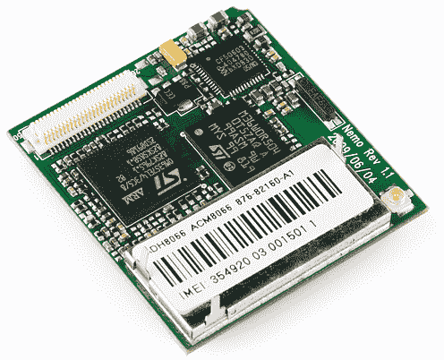](https://cdn.sparkfun.com/assets/d/8/a/b/5/51dc69f2ce395fab63000000.png)*Integrated circuits are the little black "chips", found all over embedded electronics.*

一个 IC 就是一个电子元件的集合——[电阻](https://learn.sparkfun.com/tutorials/resistors)、[晶体管](https://learn.sparkfun.com/tutorials/transistors)、[电容](https://learn.sparkfun.com/tutorials/capacitors)等。-全部塞进一个微小的芯片，并连接在一起，以实现一个共同的目标。它们种类繁多:单电路逻辑门、运算放大器、555 定时器、电压调节器、电机控制器、微控制器、微处理器、FPGAs...这个清单还在继续。

### 本教程涵盖的内容

*   集成电路的构成
*   常见 IC 封装
*   识别集成电路
*   常用 IC

### 推荐阅读

集成电路是电子学中更基本的概念之一。不过，它们确实建立在一些以前的知识之上，所以如果你不熟悉这些主题，可以考虑先阅读它们的教程...

 [### 什么是电路？](https://learn.sparkfun.com/tutorials/what-is-a-circuit) Every electrical project starts with a circuit. Don't know what a circuit is? We're here to help.[Favorited Favorite](# "Add to favorites") 82 [### 电阻](https://learn.sparkfun.com/tutorials/resistors) A tutorial on all things resistors. What is a resistor, how do they behave in parallel/series, decoding the resistor color codes, and resistor applications.[Favorited Favorite](# "Add to favorites") 57 [### 二极管](https://learn.sparkfun.com/tutorials/diodes) A diode primer! Diode properties, types of diodes, and diode applications.[Favorited Favorite](# "Add to favorites") 70 [### 极性](https://learn.sparkfun.com/tutorials/polarity) An introduction to polarity in electronic components. Discover what polarity is, which parts have it, and how to identify it.[Favorited Favorite](# "Add to favorites") 52 [### 电容器](https://learn.sparkfun.com/tutorials/capacitors) Learn about all things capacitors. How they're made. How they work. How they look. Types of capacitors. Series/parallel capacitors. Capacitor applications.[Favorited Favorite](# "Add to favorites") 84 [### 晶体管](https://learn.sparkfun.com/tutorials/transistors) A crash course in bi-polar junction transistors. Learn how transistors work and in which circuits we use them.[Favorited Favorite](# "Add to favorites") 84

## 集成电路内部

当我们想到集成电路时，脑海中浮现的就是小黑芯片。但是那个黑盒子里面是什么？

[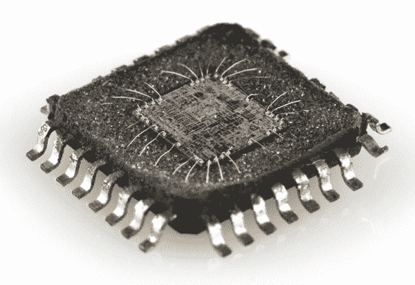](https://cdn.sparkfun.com/assets/7/a/6/9/c/51c0d009ce395feb33000000.jpg)*The guts of an integrated circuit, visible after [removing the top](https://www.sparkfun.com/news/384).*

IC 的真正“肉”是半导体晶片、铜和其他材料的复杂分层，它们相互连接形成电路中的晶体管、电阻器或其他元件。这些晶片的切割和成形组合被称为**冲模**。

[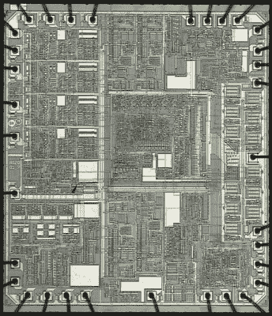](https://cdn.sparkfun.com/assets/e/f/1/b/8/51c0d009ce395ff933000000.jpg)*An overview of an IC die.*

虽然 IC 本身很小，但它所包含的半导体晶片和铜层却薄得令人难以置信。各层之间的联系非常复杂。这是上面骰子的放大部分:

[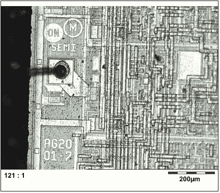](https://cdn.sparkfun.com/assets/b/0/2/6/4/51c0d456ce395f0334000000.jpg)

IC 芯片是最小形式的电路，小到无法焊接或连接。为了使连接到 IC 的工作更容易，我们封装了芯片。IC 封装将精密、微小的芯片变成了我们都熟悉的黑色芯片。

## 集成电路封装

封装就是封装集成电路芯片，并将其展开成我们更容易连接的器件。芯片上的每个外部连接都通过一根细小的金线连接到封装上的**焊盘**或**引脚**。引脚是集成电路上的银白色突出端子，用于连接电路的其他部分。这些对我们来说至关重要，因为它们将连接到电路中的其他元件和电线。

有许多不同类型的封装，每种封装都有独特的尺寸、安装类型和/或引脚数。

[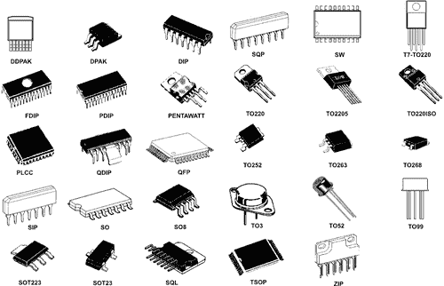](https://cdn.sparkfun.com/assets/c/7/a/1/9/51e0633cce395f867b000000.jpg)

### 极性标记和引脚编号

所有 IC 都经过[极化](https://learn.sparkfun.com/tutorials/polarity/integrated-circuit-polarity)，每个引脚在位置和功能上都是独一无二的。这意味着该包必须有某种方式来传达哪个引脚是哪个引脚。大多数 IC 将使用**缺口**或**圆点**来指示哪个管脚是第一管脚。(有时两者都有，有时非此即彼。)

[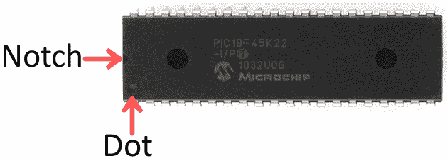](https://cdn.sparkfun.com/assets/8/7/3/1/6/51c1ee09ce395f421f000000.png)

一旦你知道了第一个管脚的位置，当你在芯片上逆时针移动时，剩余的管脚号会依次增加。

[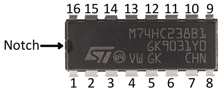](https://cdn.sparkfun.com/assets/f/0/a/1/f/51c206efce395f0f0d000003.png)

### 安装风格

封装类型的主要特征之一是它们安装到电路板上的方式。所有封装都属于两种安装类型之一:通孔(PTH)或表面贴装(SMD 或 SMT)。**通孔**封装通常更大，更容易操作。它们被设计成穿过电路板的一侧并焊接到另一侧。

**表面贴装**封装的尺寸从小型到微型不等。它们都被设计成位于电路板的一侧并被焊接到表面上。SMD 封装的引脚要么从侧面伸出，垂直于芯片，要么有时在芯片底部排列成矩阵。这种外形的 IC 不太“适合手工组装”。他们通常需要[特殊工具](https://learn.sparkfun.com/tutorials/electronics-assembly)来协助这个过程。

### 双列直插式封装

DIP 是双列直插式封装的缩写，是你会遇到的最常见的通孔 IC 封装。这些小芯片有两排平行的引脚，从一个长方形的黑色塑料外壳中垂直伸出。

[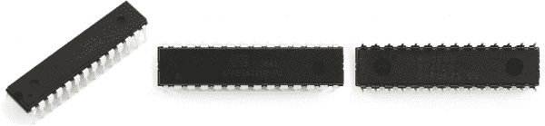](https://cdn.sparkfun.com/assets/8/b/d/d/d/51dc7161ce395f8303000000.png)*The 28-pin [ATmega328](https://www.sparkfun.com/products/9061) is one of the more popular DIP-packaged microcontrollers (thanks, Arduino!).*

DIP IC 上的每个引脚间距为 0.1 英寸(2.54 毫米)，这是一个标准间距，非常适合安装到[试验板](https://learn.sparkfun.com/tutorials/how-to-use-a-breadboard)和其他原型板中。DIP 封装的整体尺寸取决于其引脚数，引脚数可能在 4 到 64 之间。

每行引脚之间的区域完全隔开，允许 DIP ICs 跨在试验板的中心区域。这为每个引脚在电路板上提供了自己的一行，并确保它们不会互相短路。

[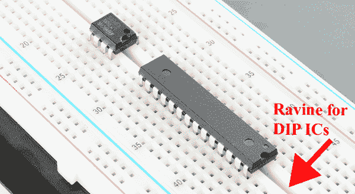](https://cdn.sparkfun.com/assets/1/5/4/e/9/51c1e4eece395f1c1f000000.png)

除了用于试验板，DIP ICs 还可以**焊接到 PCB**上。它们被插入电路板的一侧，并在另一侧焊接到位。有时候，与其直接焊接到集成电路上，不如用**插座**芯片。使用插座允许 DIP IC 被移除和交换，如果它碰巧“让它的蓝烟冒出来”

[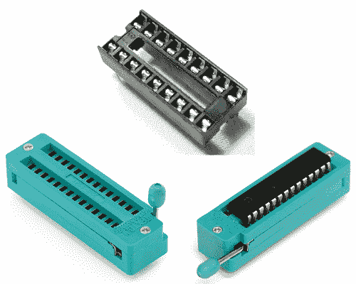](https://cdn.sparkfun.com/assets/b/f/b/4/9/51e0773dce395f8560000000.jpg)*A regular [DIP socket](https://www.sparkfun.com/products/7940) (top) and a [ZIF socket](https://www.sparkfun.com/products/9175) with and without an IC.*

### 表面贴装(SMD/SMT)封装

如今，表贴封装种类繁多。为了使用表面贴装封装 IC，你通常需要为它们定制一个印刷电路板( [PCB](https://learn.sparkfun.com/tutorials/pcb-basics) )，它有一个匹配的铜图案，它们焊接在上面。

这里有一些更常见的 SMD 封装类型，其手工可焊性从“可行”到“可行，但只能使用特殊工具”到“只能使用非常特殊的自动工具”。

#### 小型封装(SOP)

小型 IC (SOIC)封装是表贴 DIP 的近亲。这就是你将所有的针向外弯曲，然后缩小到原来的尺寸。手稳、眼紧，这些封装是最容易手工焊接的 SMD 器件之一。在 SOIC 封装上，每个引脚之间的间距通常为 0.05 英寸(1.27 毫米)。

SSOP(收缩小外形封装)是 SOIC 封装的更小版本。其他类似的 IC 封装包括 TSOP(薄型小外形封装)和 TSSOP(薄型收缩小外形封装)。

[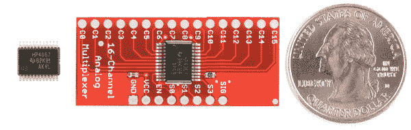](https://cdn.sparkfun.com/assets/9/e/4/5/6/51c32e10ce395fdc13000000.png)*A 16-Channel Multiplexer ([CD74HC4067](https://www.sparkfun.com/products/299)) in a 24-pin SSOP package. Mounted on a board in the middle (quarter added for size-comparison).*

许多更简单的、面向单一任务的 IC，如 [MAX232](https://www.sparkfun.com/products/589) 或[多路复用器](https://www.sparkfun.com/products/299)以 SOIC 或 SSOP 的形式出现。

#### 方形扁平封装

将 IC 引脚向四个方向张开，你会得到一个看起来像方形扁平封装的东西(QFP)。QFP 集成电路每侧可能有 8 个引脚(总共 32 个)到 70 个以上(总共 300 多个)。QFP 集成电路上的管脚间距通常在 0.4 毫米到 1 毫米之间。标准 QFP 封装的较小变体包括薄型(TQFP)、超薄型(VQFP)和薄型(LQFP)封装。

[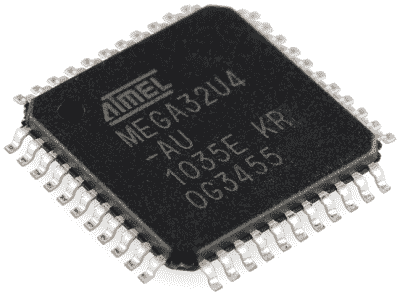](https://cdn.sparkfun.com/assets/8/3/6/3/b/51dc6e21ce395f0807000000.png)*The [ATmega32U4](https://www.sparkfun.com/products/11181) in a 44-pin (11 on each side) TQFP package.*

如果你打磨掉 QFP IC 的引脚，你会得到看起来像是**四方扁平无引脚(QFN)** 封装的东西。QFN 封装上的连接是 IC 底角边缘上的微小裸露焊盘。有时它们环绕，并且在侧面和底部都暴露，其他封装只暴露芯片底部的焊盘。

[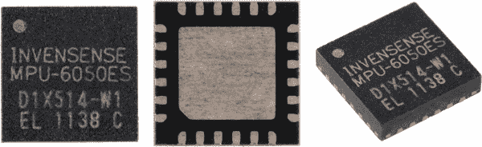](https://cdn.sparkfun.com/assets/b/4/a/1/7/51dc6f5bce395fc963000006.png)*The multitalented  IMU sensor comes in a relatively tiny QFN package, with 24 total pins hiding on the bottom edge of the IC.*

薄型(TQFN)、超薄型(VQFN)和微引脚(MLF)封装是标准 QFN 封装的较小变体。甚至还有双无引脚(DFN)和薄双无引脚(TDFN)封装，这种封装只在两面有引脚。

许多微处理器、传感器和其他现代集成电路都采用 QFP 或 QFN 封装。流行的 [ATmega328](https://www.sparkfun.com/products/9261) 微控制器以 TQFP 封装和 QFN 型(MLF)形式提供，而像 [MPU-6050](https://www.sparkfun.com/products/10937) 这样的微型[加速度计](https://learn.sparkfun.com/tutorials/accelerometer-basics) / [陀螺仪](https://learn.sparkfun.com/tutorials/gyroscope)则以微型 QFN 形式提供。

#### 球栅阵列

最后，对于真正先进的 IC，还有球栅阵列(BGA)封装。这些是非常复杂的小封装，其中小焊球排列在 IC 底部的二维网格中。有时候焊球直接贴在芯片上！

[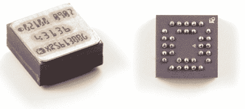](https://cdn.sparkfun.com/assets/0/8/7/c/4/51dc6d9bce395f2103000000.png)

BGA 封装通常是为高级微处理器保留的，像那些在 [pcDuino](https://www.sparkfun.com/products/11712) 或 [Raspberry Pi](https://www.sparkfun.com/products/11546) 上的微处理器。

如果你会手工焊接 BGA 封装的 IC，那就把自己当成焊接大师吧。通常，将这些封装放在 PCB 上需要自动程序，包括取放机和回流焊炉。

## 常见 IC

集成电路在电子领域以多种形式普遍存在，很难面面俱到。这里有几个你可能在教育电子产品中遇到的比较常见的 IC。

### 逻辑门、定时器、移位寄存器等。

逻辑门是更多集成电路本身的组成部分，可以封装到它们自己的集成电路中。一些逻辑门 ic 可能在一个封装中包含几个门，比如这个四输入与门:

[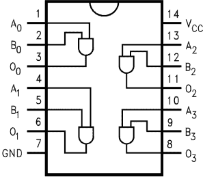](https://cdn.sparkfun.com/assets/5/b/9/9/b/51dc7fb8ce395f1d1c000000.png)

逻辑门可以连接到 ic 内部，以创建定时器、计数器、锁存器、移位寄存器和其他基本逻辑电路。这些简单电路大多采用 DIP 封装，SOIC 和 SSOP 也是如此。

### 微控制器、微处理器、FPGAs 等。

微控制器、微处理器和 FPGAs 都将数千、数百万甚至数十亿个晶体管封装在一个微小的芯片中，它们都是集成电路。这些组件在功能、复杂性和大小方面存在很大的差异；从 8 位微控制器，如 [Arduino](https://www.sparkfun.com/products/11021) 中的 [ATmega328](https://www.sparkfun.com/products/9061) ，到复杂的 64 位多核微处理器，在您的计算机中组织活动。

这些元件通常是电路中最大的集成电路。简单的微控制器可以在从 DIP 到 QFN/QFP 的封装中找到，引脚数在 8 到 100 之间。随着这些组件变得越来越复杂，包也变得越来越复杂。FPGA 和复杂的[微处理器](https://www.sparkfun.com/products/11712)可以有上千个管脚，并且只在 QFN、LGA 或 BGA 等高级封装中提供。

### 传感器

现代数字传感器，如温度传感器、[加速度计](https://learn.sparkfun.com/tutorials/accelerometer-basics)和[陀螺仪](https://learn.sparkfun.com/tutorials/gyroscope)都集成在一个集成电路中。

这些 IC 通常比微控制器或电路板上的其他 IC 小，引脚数在 3 到 20 个范围内。DIP 传感器 IC 越来越罕见，因为现代元件通常出现在 QFP、QFN 甚至 BGA 封装中。

## 资源和更进一步

集成电路存在于几乎所有的电路中。既然您已经熟悉了 ICs，为什么不看看这些相关的概念教程呢:

*   [PCB 基础知识](https://learn.sparkfun.com/tutorials/pcb-basics)-IC 必须以某种方式连接到电路。通常我们会将 IC 焊接到印刷电路板(PCB)上。查看这个教程，了解更多关于这些小绿板的信息。
*   [串行通信](https://learn.sparkfun.com/tutorials/serial-communication)、[串行外设接口(SPI)](https://learn.sparkfun.com/tutorials/serial-peripheral-interface-spi) 和[I²C](https://learn.sparkfun.com/tutorials/i2c)——这三个都是 IC 之间用来相互通信的通信协议。

或者，看看这些技能教程。这些都是每个初露头角的电子黑客应该学习的实用技能！

*   [如何焊接](https://learn.sparkfun.com/tutorials/how-to-solder-through-hole-soldering) -除非你使用集成电路试验板，否则你可能需要焊接它们。
*   [8 针 SOIC 至 DIP 适配器连接导轨](https://learn.sparkfun.com/tutorials/8-pin-soic-to-dip-adapter-hookup-guide) -将 8 针 SOIC 封装焊接至分线板的示例。
*   [SSOP-16 至 DIP 适配器连接指南](https://learn.sparkfun.com/tutorials/ssop-16-to-dip-adapter-hookup-guide) -将 16 针 SOIC 封装焊接至分线板的另一个例子。
*   设计 PCB-或者，如果你已经熟悉 PCB，为什么不试着做一个呢！本教程介绍如何使用免费软件(Eagle)设计 PCB。
*   [设计 PCB 尺寸](https://learn.sparkfun.com/tutorials/designing-pcbs-smd-footprints) -本教程将带您了解使用 Eagle CAD 设计 IC PCB 尺寸所需的步骤。
*   [在 Eagle 中制作自定义足迹](https://learn.sparkfun.com/tutorials/making-custom-footprints-in-eagle) -在 EAGLE 中制作带有图片的自定义足迹。

 [### 如何焊接:通孔焊接](https://learn.sparkfun.com/tutorials/how-to-solder-through-hole-soldering) This tutorial covers everything you need to know about through-hole soldering.[Favorited Favorite](# "Add to favorites") 70 [### 设计 PCB:高级 SMD](https://learn.sparkfun.com/tutorials/designing-pcbs-advanced-smd) Advanced Eagle layout for PCBs with SMD devices.[Favorited Favorite](# "Add to favorites") 25 [### 设计 PCB:SMD 尺寸](https://learn.sparkfun.com/tutorials/designing-pcbs-smd-footprints) How to design new SMD parts in Eagle PCB[Favorited Favorite](# "Add to favorites") 21 [### 在 EAGLE 中制作定制脚印](https://learn.sparkfun.com/tutorials/making-custom-footprints-in-eagle) This tutorial will show you how to make custom, 1:1 footprint for any IC in EAGLE.[Favorited Favorite](# "Add to favorites") 14 [### 8 针 SOIC 至 DIP 适配器连接指南](https://learn.sparkfun.com/tutorials/8-pin-soic-to-dip-adapter-hookup-guide) Assembly and application of the 8-pin SOIC-to-DIP adapter.[Favorited Favorite](# "Add to favorites") 1 [### SSOP-16 至 DIP 适配器连接指南](https://learn.sparkfun.com/tutorials/ssop-16-to-dip-adapter-hookup-guide) Using the SSOP-16 to DIP adapter board.[Favorited Favorite](# "Add to favorites") 1

## 有兴趣学习更多基础主题吗？

查看我们的 **[工程要点](https://www.sparkfun.com/engineering_essentials)** 页面，了解电气工程相关基础主题的完整列表。

带我去那里！

