# I2C

> 原文：<https://learn.sparkfun.com/tutorials/i2c>

## 介绍

在本教程中，您将了解 I ² C 通信协议的所有内容，为什么您会想要使用它，以及它是如何实现的。

[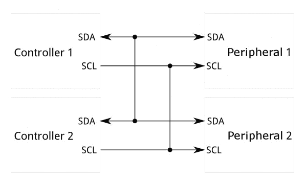](https://cdn.sparkfun.com/assets/learn_tutorials/8/2/I2C-Block-Diagram.jpg)

集成电路间(I ² C)协议是一种旨在允许多个“外围”数字集成电路(“芯片”)与一个或多个“控制器”芯片通信的协议。与串行外设接口(SPI)一样，它仅用于单个器件内的短距离通信。和异步串行接口(如 RS-232 或 UARTs)一样，只需要两根信号线就可以交换信息。

### 推荐阅读

阅读本教程之前，了解以下内容会有所帮助:

 [### 串行通信](https://learn.sparkfun.com/tutorials/serial-communication) Asynchronous serial communication concepts: packets, signal levels, baud rates, UARTs and more 100 [### 串行外设接口(SPI)](https://learn.sparkfun.com/tutorials/serial-peripheral-interface-spi) SPI is commonly used to connect microcontrollers to peripherals such as sensors, shift registers, and SD cards.[Favorited Favorite](# "Add to favorites") 91 [### 二进制的](https://learn.sparkfun.com/tutorials/binary) Binary is the numeral system of electronics and programming...so it must be important to learn. But, what is binary? How does it translate to other numeral systems like decimal?[Favorited Favorite](# "Add to favorites") 51 [### 移位寄存器](https://learn.sparkfun.com/tutorials/shift-registers) An introduction to shift registers and potential uses.[Favorited Favorite](# "Add to favorites") 45 [### 逻辑电平](https://learn.sparkfun.com/tutorials/logic-levels) Learn the difference between 3.3V and 5V devices and logic levels.[Favorited Favorite](# "Add to favorites") 82

## 为什么用 I2C？

为了弄清楚为什么人们可能想要通过 I ² C 进行通信，你必须首先将它与其他可用选项进行比较，看看它有什么不同。

### 串口 UART 端口有什么问题？

[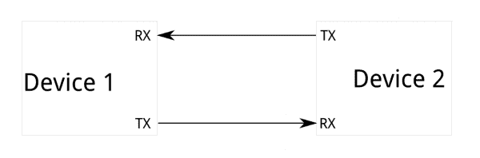](https://cdn.sparkfun.com/assets/5/c/a/3/0/51adfda8ce395f935d000000.png)

因为串行端口是**异步**(不传输时钟数据)，使用它们的设备必须提前就数据速率达成一致。两台设备的时钟必须接近相同的速率，并且保持相同的速率——两端时钟速率之间的差异过大会导致数据失真。

异步串行端口需要硬件开销——两端的 UART 相对复杂，如果需要，很难用软件精确实现。每帧数据中至少有一个起始和停止位，这意味着每发送 8 位数据需要 10 位传输时间，这会降低数据速率。

异步串行端口的另一个核心缺陷是，它们天生适合于两个(且只能是两个)设备之间的通信。虽然*可以将多个设备*连接到单个串行端口，但 **[总线争用](https://learn.sparkfun.com/tutorials/serial-communication#common-pitfalls)** (两个设备试图同时驱动同一条线路)总是一个问题，必须小心处理，以防止损坏相关设备，通常是通过外部硬件。

最后，数据速率是一个问题。虽然异步串行通信没有理论上的限制，但大多数 UART 设备只支持一组固定的波特率，最高的波特率通常在每秒 230400 位左右。

### SPI 怎么了？

[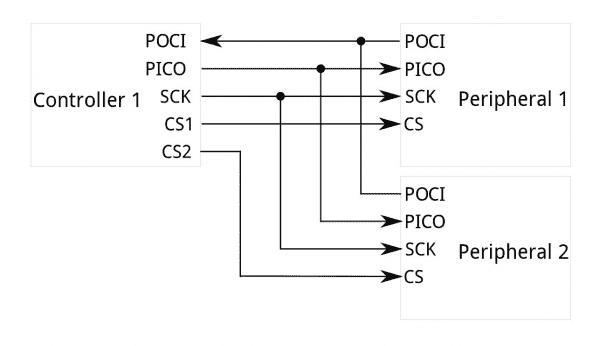](https://cdn.sparkfun.com/assets/learn_tutorials/8/2/SPI-Block_Diagram_Updated.png)

SPI 最明显的缺点是所需的引脚数量。用 SPI 总线将单个控制器连接到单个外设[^(【1】)](https://learn.sparkfun.com/tutorials/i2c#controller-peripheral)需要四条线；每增加一个外围设备，控制器上就需要增加一个片选 I/O 引脚。引脚连接的快速增长使得它在许多设备必须连接到一个控制器的情况下变得不理想。此外，在 PCB 布局紧凑的情况下，每个器件的大量连接会使信号路由更加困难。

SPI 总线上只允许一个控制器，但支持任意数量的外设(仅受连接到总线的器件的驱动能力和可用片选引脚数量的限制)。

SPI 适用于高数据速率**全双工**(同时发送和接收数据)连接，支持某些设备高达 10MHz(因此，每秒 1000 万比特)的时钟速率，并且速度可以很好地调整。两端的硬件通常是一个非常简单的移位寄存器，易于软件实现。

### 输入 I²C——两全其美！

I ² C 只需要两根线，就像异步串行一样，但是那两根线可以支持多达 1008 个外围设备。另外，与 SPI 不同，I ² C 可以支持多控制器系统，允许一个以上的控制器[^(【1】)](https://learn.sparkfun.com/tutorials/i2c#controller-peripheral)与总线上的所有外设[^(【1】)](https://learn.sparkfun.com/tutorials/i2c#controller-peripheral)进行通信(虽然控制器设备不能通过总线相互通话，必须轮流使用总线线路)。

数据速率介于异步串行和 SPI 之间；大多数 I ² C 设备可以 100kHz 或 400kHz 进行通信。跟 I ² C 有一些开销；对于要发送的每 8 位数据，必须传输一位额外的元数据(“ACK/NACK”位，我们将在后面讨论)。

实现 I ² C 所需的硬件比 SPI 复杂，但没有异步串行复杂。它可以相当简单地用软件实现。

[[1] **Note:**](https://learn.sparkfun.com/tutorials/i2c#controller-peripheral) You may be familiar with the terms "master" and "slave" to represent the relationship between devices on an I²C bus. The terms are considered obsolete and are now replaced with the terms "controller" and "peripheral," respectively.

| 废弃名称 | 替换名称 |
| 掌握 | 控制器 |
| 奴隶 | 外围的 |

The naming convention may vary depending on manufacturer, programming language, companies, or organizations (e.g. main/secondary, initiator-responder, source/replica, etc.). For more information, check out the following links.

*   [维基百科:术语关注点](https://en.wikipedia.org/wiki/Master/slave_(technology)#Terminology_concerns)
*   [OSHWA:重新定义 SPI 信号名称的解决方案](https://www.oshwa.org/a-resolution-to-redefine-spi-signal-names)

## I2C 简史

I ² C 最初是飞利浦在 1982 年为各种飞利浦芯片开发的。最初的规范只允许 100kHz 的通信，并且只提供 7 位地址，将总线上的设备数量限制在 112 个(有几个保留的地址，永远不会用于有效的 I ² C 地址)。1992 年，第一个公共规范发布，增加了 400kHz 快速模式以及扩展的 10 位地址空间。很多时候(例如，在许多 Arduino 兼容板上的 ATMega328 设备中)，设备对 I ² C 的支持到此结束。指定了三种附加模式:

*   快速模式增强版，1MHz
*   高速模式，3.4MHz
*   超快速模式，5MHz

除了“香草”I ² C，英特尔在 1995 年推出了一个变种叫“**系统管理总线”(SMBus)** 。SMBus 是一种更严格控制的格式，旨在最大限度地提高 PC 主板上支持 IC 之间通信的可预测性。SMBus 最显著的区别是它限制速度在 10kHz 到 100kHz，而 I ² C 可以支持 0kHz 到 5MHz 的设备。SMBus 包括一个时钟超时模式，该模式使低速操作不合法，尽管许多 SMBus 设备都会支持它，以最大限度地提高与嵌入式 I ² C 系统的互操作性。

## 硬件层面的 I2C

### 信号

每条 I ² C 总线由两个信号组成:SDA 和 SCL。SDA(串行数据)是数据信号，SCL(串行时钟)是时钟信号。时钟信号总是由电流总线控制器产生；一些外围设备有时会强制时钟为低电平，以延迟控制器发送更多数据(或者在控制器尝试输出数据之前需要更多时间来准备数据)。这被称为“**时钟拉伸**，在协议页面上有描述。

与 UART 或 SPI 连接不同，I ² C 总线驱动器是[“开漏”](http://en.wikipedia.org/wiki/Open_collector)，这意味着它们可以将相应的信号线拉低，但不能将其驱动为高。因此，当一个器件试图将线路拉高，而另一个器件试图将其拉低时，不会发生总线争用，从而消除了驱动器损坏或系统功耗过大的可能性。每条信号线上有一个[上拉电阻](https://learn.sparkfun.com/tutorials/pull-up-resistors)，用于在没有器件将其置为低电平时将信号恢复为高电平。

[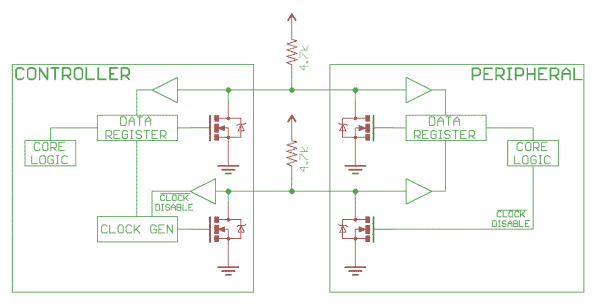](https://cdn.sparkfun.com/assets/learn_tutorials/8/2/I2C_Schematic.jpg)*Notice the two pull-up resistors on the two communication lines.*

电阻的选择因总线上的器件而异，但一个好的经验法则是从 **[4.7k &欧姆开始；](https://www.sparkfun.com/products/10969)电阻器，必要时调低**。I ² C 是一个相当健壮的协议，可以用于短距离布线(2-3 米)。对于长时间运行或具有大量器件的系统，较小的电阻更好。

[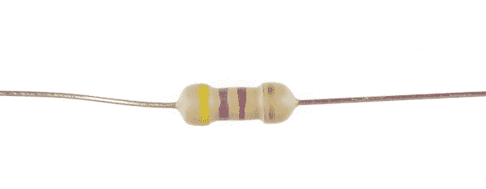](https://cdn.sparkfun.com/assets/learn_tutorials/8/2/4_7kOhm_resistor.jpg)

SparkFun 目录中提供的大多数 I ² C 器件通常包括用于 SCL 和 SDA 引脚的上拉电阻。如果同一条总线上有许多 I ² C 器件，您可能需要通过断开一些器件上的上拉电阻来调整上拉电阻的等值。根据连接到总线的设备和设计，您可以在同一总线上包含大约 **7x I ² C 设备。但是，如果您有任何问题，您可以使用业余爱好刀[切断连接到中心跳线焊盘的两条走线](https://learn.sparkfun.com/tutorials/how-to-work-with-jumper-pads-and-pcb-traces)或使用烙铁去除三个跳线焊盘上的焊料，以断开某些电路板上的电阻。如图所示，左侧 GPS 板的设计使用走线来连接上拉电阻的跳线焊盘。右侧 GPS 板的设计使用焊料连接上拉电阻的跳线焊盘。**

| [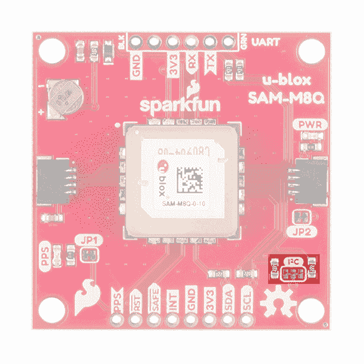](https://cdn.sparkfun.com/assets/learn_tutorials/8/2/15210-SparkFun_GPS_Breakout_-_Chip_Antenna__SAM-M8Q__Qwiic_pull_up_resistor_trace.jpg) | [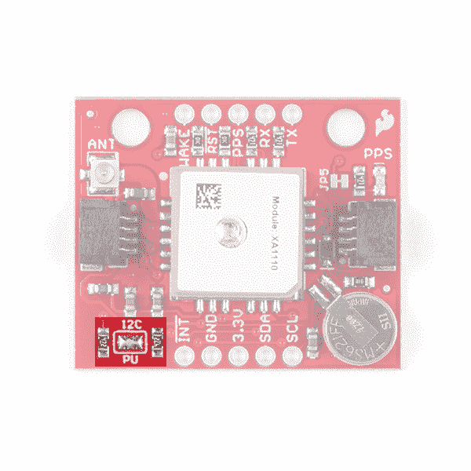](https://cdn.sparkfun.com/assets/learn_tutorials/8/2/14414-SparkFun_GPS_Breakout_-_XA1110__Qwiic__pull_up_resistor_solder_jumper.jpg) |
| *追踪 SAM-M8Q 上的连接跳线垫* | *在 XA1110 上焊接连接跳线焊盘* |

如果您的设计需要更长的线路，您可以使用[专用 IC 来扩展信号，如 PCA9615](https://learn.sparkfun.com/tutorials/qwiic-differential-i2c-bus-extender-pca9615-hookup-guide) 。

 [### Qwiic 差分 I2C 总线扩展器(PCA9615)连接指南

#### 2018 年 5 月 31 日](https://learn.sparkfun.com/tutorials/qwiic-differential-i2c-bus-extender-pca9615-hookup-guide) Learn how to extend the range of your I2C communication bus with the Qwiic differential I2C bus extender (PCA9615 ) breakout board.[Favorited Favorite](# "Add to favorites") 9

### 信号逻辑电平

由于总线上的器件实际上不会将信号驱动至高电平，I ² C 允许在连接具有不同 I/O 电压的器件时具有一定的灵活性。一般来说，在一个器件的电压高于另一个器件的系统中，可以通过 I ² C 连接两个器件，中间不需要任何电平转换电路。诀窍是将上拉电阻连接到两个电压中较低的一个。这仅在某些情况下有效，即两个系统电压中较低的电压超过较高电压系统的高电平输入电压，例如 5V Arduino 和 3.3V 加速度计。根据 Arduino 或 I ² C 设备的设计，我们建议使用逻辑电平转换器，以保持一致性并避免损坏总线上的任何设备。

如果两个系统之间的电压差太大(比如 5V 和 2.5V)，SparkFun 提供了一个[简单 I ² C 电平转换板——例如 PCA9306 电平转换器分线点](https://www.sparkfun.com/products/15439)。该专用电平转换器板还包括一条使能线，可用于禁用与选定器件的通信。这在多个具有相同地址的设备连接到一个控制器的情况下很有用——Wii 双截棍就是一个很好的例子。还有可以使用的[双向逻辑电平转换器](https://www.sparkfun.com/products/12009)。

[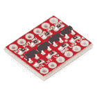](https://www.sparkfun.com/products/12009) 

将**添加到您的[购物车](https://www.sparkfun.com/cart)中！**

 **### [SparkFun 逻辑电平转换器-双向](https://www.sparkfun.com/products/12009)

[In stock](https://learn.sparkfun.com/static/bubbles/ "in stock") BOB-12009

SparkFun 双向逻辑电平转换器是一个小型设备，可以安全地将 5V 信号降压至 3.3V，并升压 3。…

$3.50116[Favorited Favorite](# "Add to favorites") 146[Wish List](# "Add to wish list")****[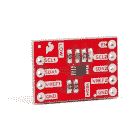](https://www.sparkfun.com/products/15439) 

将**添加到您的[购物车](https://www.sparkfun.com/cart)中！**

 **### [SparkFun 关卡翻译器分会场- PCA9306](https://www.sparkfun.com/products/15439)

[In stock](https://learn.sparkfun.com/static/bubbles/ "in stock") BOB-15439

不同的部分有时使用不同的电压电平进行通信。这款 PCA9306 电平转换器是制作…

$4.951[Favorited Favorite](# "Add to favorites") 22[Wish List](# "Add to wish list")**** ****## 草案

通过 I ² C 的通信比 UART 或 SPI 解决方案更复杂。信号必须遵守总线上设备的特定协议，以识别其为有效的 I ² C 通信。幸运的是，大多数设备会为您处理所有复杂的细节，让您专注于希望交换的数据。

### 基础

消息分为两种类型的帧:地址帧，其中控制器指示消息要发送到的外设；以及一个或多个数据帧，即从控制器传递到外设或从外设传递到控制器的 8 位数据消息。SCL 变为低电平后，数据被置于 SDA 线上，SCL 线变为高电平后，数据被采样。时钟沿和数据读/写之间的时间由总线上的器件定义，并且因芯片而异。

[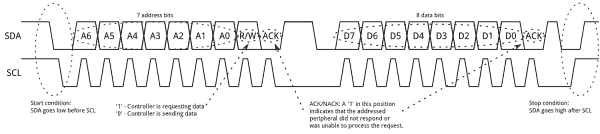](https://cdn.sparkfun.com/assets/learn_tutorials/8/2/I2C_Basic_Address_and_Data_Frames.jpg)*Click on image for a closer view.*

#### 开始条件

为了启动地址帧，控制器器件将 SCL 拉高，并将 SDA 拉低。这使所有外围设备注意到传输即将开始。如果两个控制器希望同时获得总线的所有权，先将 SDA 拉低的器件将赢得竞争，获得总线控制权。可以发出重复的启动命令，启动新的通信序列，而无需将总线控制权让给其他控制器；我们以后再谈这个。

#### 地址帧

在任何新的通信序列中，地址帧总是第一个。对于 7 位地址，地址首先输出最高有效位(MSB ),然后是 R/W 位，指示这是读(1)还是写(0)操作。

帧的第 9 位是 NACK/ACK 位。所有帧(数据或地址)都是如此。一旦发送了帧的前 8 位，接收设备就可以控制 SDA。如果接收器件在第 9 个时钟脉冲之前没有拉低 SDA 线，则可以推断接收器件没有接收到数据或者不知道如何解析消息。在这种情况下，交换停止，由系统控制器决定如何进行。

#### 数据帧

地址帧发出后，就可以开始传输数据了。控制器将继续以固定的时间间隔产生时钟脉冲，数据将由控制器或外设放入 SDA，具体取决于 R/W 位是表示读操作还是写操作。数据帧的数量是任意的，大多数外设会自动递增内部寄存器，这意味着后续的读或写操作将来自下一个寄存器。

#### 停止条件

一旦发送完所有数据帧，控制器将产生一个停止条件。停止条件由 SDA *上的 0->1(低至高)转换定义，在 SCL 上的*0->1 转换之后，SCL 保持高电平。在正常数据写入操作期间，当 SCL 为高时，SDA 上的值应该**而不是**改变，以避免错误的停止条件。

### 高级协议主题

#### 10 位地址

在 10 位寻址系统中，传输外设地址需要两帧。第一帧由代码 b11110xyz 组成，其中“x”是外设地址的 MSB，y 是外设地址的位 8，z 是读/写位，如上所述。第一帧的 ACK 位将由所有匹配地址前两位的外设置位。

[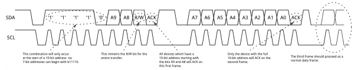](https://cdn.sparkfun.com/assets/learn_tutorials/8/2/10-bit_I2C_Addresses.jpg)*Click on image for a closer view.*

与正常的 7 位传输一样，另一次传输立即开始，这次传输包含地址的 7:0 位。此时，被寻址的外设应以 ACK 位响应。否则，故障模式与 7 位系统相同。

请注意，10 位地址设备可以与 7 位地址设备共存，因为地址的前导部分“11110”不是任何有效 7 位地址的一部分。

#### 重复开始条件

有时，允许一个控制器一次交换几个信息，而不允许总线上的其它控制器干扰，这是很重要的。为此，定义了重复开始条件。

[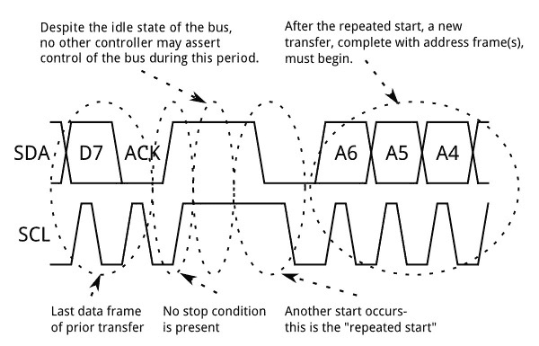](https://cdn.sparkfun.com/assets/learn_tutorials/8/2/I2C_Repeated_Start_Conditions.jpg)

为了重复启动，当 SCL 为低电平时，SDA 可以变为高电平，当 SCL 为高电平时，SDA 再次变为低电平，而 SCL 为高电平。因为总线上没有停止条件，所以之前的通信没有真正完成，当前控制器保持对总线的控制。

此时，下一条消息可以开始传输。这种新消息的语法与任何其他消息相同——地址帧后跟数据帧。允许任何次数的重复启动，控制器将保持对总线的控制，直到它发出停止条件。

#### 时钟拉伸

有时，控制器的数据速率会超过外设提供数据的能力。这可能是因为数据尚未准备好(例如，外设尚未完成模数转换)，或者是因为之前的操作尚未完成(例如，EEPROM 尚未完成对非易失性存储器的写入，需要完成写入后才能处理其他请求)。

[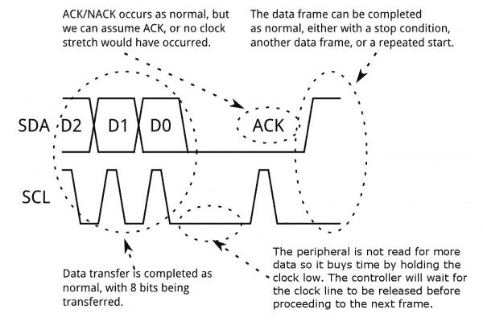](https://cdn.sparkfun.com/assets/learn_tutorials/8/2/I2C_Clock_Stretching.jpg)

在这种情况下，一些外围设备将执行所谓的“时钟拉伸”。名义上，**所有的**时钟都是由控制器驱动的——外设只需响应控制器的时钟脉冲，将数据放到总线上或从总线上取走数据。在数据传输过程中的任何时候，控制器释放 SCL 线后，被寻址的外设都可以保持低电平。控制器需要抑制额外的时钟脉冲或数据传输，直到外设释放 SCL 线。

**Tip:** If you are looking for examples that use clock stretching, try looking at the CCS811 used with Arduino and Python for ideas! The library and examples in the following tutorials adjust the clock signal for the device.

 [### CCS811 空气质量突破连接指南

#### 2017 年 4 月 27 日](https://learn.sparkfun.com/tutorials/ccs811-air-quality-breakout-hookup-guide) This tutorial shows you how to get data from a CCS811 breakout board with the I2C interface.[Favorited Favorite](# "Add to favorites") 4

## 有兴趣学习更多基础主题吗？

查看我们的 **[工程要点](https://www.sparkfun.com/engineering_essentials)** 页面，了解电气工程相关基础主题的完整列表。

带我去那里！

## Qwiic 连接系统

[SparkFun Qwiic Connect 系统](https://www.sparkfun.com/qwiic)由 Nate 在 [SparkX](https://www.sparkfun.com/sparkx) 开发，于 [2017](https://www.sparkfun.com/news/2349) 发布。如果你不熟悉，Qwiic Connect 系统是一个由 I ² C 传感器、致动器、屏蔽、电缆等组成的生态系统，它使原型制作更快，更不容易出错。

[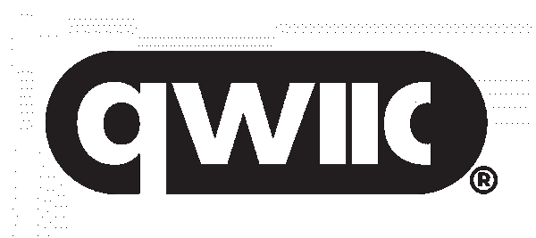](https://www.sparkfun.com/qwiic)

所有支持 Qwiic 的电路板都使用一个 1 mm 间距的 4 引脚 JST 连接器，这样就省去了在电路板之间焊接和剥线所需的额外步骤。该连接器减少了所需的 PCB 空间，极化连接意味着您不会接错。电路板可以菊花链在一起，允许多个设备连接在同一总线上。欲了解更多信息，请查看 [Qwiic 的常见问题解答](https://www.sparkfun.com/qwiic#faqs)或下面的视频！

[https://www.youtube.com/embed/x0RDEHqFIF8/?autohide=1&border=0&wmode=opaque&enablejsapi=1](https://www.youtube.com/embed/x0RDEHqFIF8/?autohide=1&border=0&wmode=opaque&enablejsapi=1)

### 无焊接

Qwiic 电缆(4 针 JST)可以轻松地从开发板插入传感器、屏蔽、附件板等，使设置新原型的工作变得容易。

### 极化连接器

没有必要担心意外交换试验板上的 SDA 和 SCL 线。Qwiic 连接器是极化的，所以你知道你每次都可以正确接线，从一开始就是正确的。

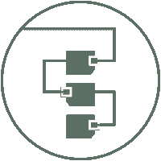

### 可菊花链连接

是时候利用 I ² C 总线的力量了！大多数 Qwiic 板上有两个或更多的连接器，允许连接多个设备。

## 资源和更进一步

I ² C 是一个相对复杂的接口，有很多资源可以帮助你处理它。以下是一些信息更丰富的。

*   维基百科关于 I ² C 的文章——不太好，但不是一个可怕的起点。
    *   [术语关注点](https://en.wikipedia.org/wiki/Master/slave_(technology)#Terminology_concerns)
*   [标准文档](http://www.nxp.com/documents/user_manual/UM10204.pdf) -飞利浦半导体几年前更名为恩智浦；这是 I ² C 的官方标准文件
*   [I ² C 底漆](http://www.i2c-bus.org/i2c-bus/)——I²C 及相关技术的官方底漆。
*   用于 I ² C 的 Linux 工具——一套很好的工具，用于在嵌入式 Linux 环境中使用 I ² C 和相关总线，比如 pcDuino 或 Raspberry Pi。
*   [开源硬件协会:重新定义 SPI 信号名称的解决方案](https://www.oshwa.org/a-resolution-to-redefine-spi-signal-names)
*   [Qwiic 连接系统](https://www.sparkfun.com/qwiic)

要长距离使用 I ² C，请查看专用 PCA9615 差分 I ² C 总线扩展器。

 [### Qwiic 差分 I2C 总线扩展器(PCA9615)连接指南

#### 2018 年 5 月 31 日](https://learn.sparkfun.com/tutorials/qwiic-differential-i2c-bus-extender-pca9615-hookup-guide) Learn how to extend the range of your I2C communication bus with the Qwiic differential I2C bus extender (PCA9615 ) breakout board.[Favorited Favorite](# "Add to favorites") 9

或者查看我们的 SPI 和 I2C 教程，品尝树莓派。

 [### 树莓派 SPI 和 I2C 教程

#### 2015 . 10 . 29](https://learn.sparkfun.com/tutorials/raspberry-pi-spi-and-i2c-tutorial) Learn how to use serial I2C and SPI buses on your Raspberry Pi using the wiringPi I/O library for C/C++ and spidev/smbus for Python.[Favorited Favorite](# "Add to favorites") 24

你的下一个项目需要一些灵感吗？查看一些相关教程:

 [### Qwiic 距离传感器(VL53L1X，VL53L4CD)连接指南](https://learn.sparkfun.com/tutorials/qwiic-distance-sensor-vl53l1x-vl53l4cd-hookup-guide) The Qwiic Distance Sensor - VL53L1X is a time of flight sensor that is capable of several modes, as well as having a range of 4M. It's cousin VL53L4CD is also a time of flight sensor with similar characteristics but it has a range of about 1.3M. Let's hook it up and find out just how far away that thing over there is.[Favorited Favorite](# "Add to favorites") 3 [### SparkFun Qwiic Micro (SAMD21E)连接指南](https://learn.sparkfun.com/tutorials/sparkfun-qwiic-micro-samd21e-hookup-guide) An introduction to the Qwiic Micro SAMD21E. Level up your Arduino-skills with the powerful SAMD21 ARM Cortex M0+ processor 3 [### RFID 初学者教程](https://learn.sparkfun.com/tutorials/rfid-beginners-tutorial) In this tutorial we'll revisit some RFID basics and practice by making a remote work logger using an RFID reader and a GPS module. You'll scan a card and get ID, location, and time. All the perfect data to punch in and punch out from the middle of Nowhere 12 [### MicroMod GNSS 载板(ZED-F9P)连接指南](https://learn.sparkfun.com/tutorials/micromod-gnss-carrier-board-zed-f9p-hookup-guide) Easily switch between Processor Boards using the MicroMod ecosystem and get precision down to the diameter of a dime with the ZED-F9P from u-blox using the MicroMod GNSS Carrier Board 0

寻找更多灵感？看看这些博客帖子中的一些想法:

 [### 根据皮特-斯皮和 I2C 的说法

October 15, 2012](https://www.sparkfun.com/news/980 "October 15, 2012: Check out today's edition of According to Pete.")[Favorited Favorite](# "Add to favorites") 0 [### 通过引用库来传递软件 I2C 流

March 27, 2018](https://www.sparkfun.com/news/2647 "March 27, 2018: It's not pretty but we've come up with a way to make I2C based libraries even more flexible. Now you can pass a software I2C port into a library!")[Favorited Favorite](# "Add to favorites") 0 [### 所有的港口！和 I2C 多路复用

April 5, 2017](https://www.sparkfun.com/news/2354 "April 5, 2017: Want to talk to multiple I2C sensors but have only one address? No problem.")[Favorited Favorite](# "Add to favorites") 1 [### 新连接器系统

April 3, 2017](https://www.sparkfun.com/news/2349 "April 3, 2017: We're pleased to announce our new Qwiic system.")[Favorited Favorite](# "Add to favorites") 2 [### 通用化 Arduino 库

October 3, 2016](https://www.sparkfun.com/news/2194 "October 3, 2016: When writing a library, pass in I2C ports to make the library more useful on different platforms.")[Favorited Favorite](# "Add to favorites") 4 [### 英语日:I2 注意事项

April 20, 2017](https://www.sparkfun.com/news/2366 "April 20, 2017: In this Enginursday, we'll explore some of the problems that can creep up when connecting I2C devices")[Favorited Favorite](# "Add to favorites") 5 [### SparkFun 的 Qwiic 连接系统的 Python

July 9, 2019](https://www.sparkfun.com/news/2958 "July 9, 2019: A new package is available that incorporates all Qwiic modules capable of Python.")[Favorited Favorite](# "Add to favorites") 2****