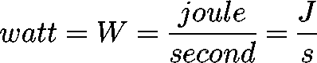
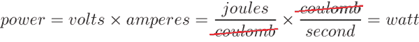
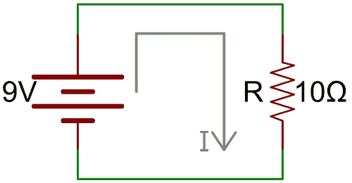
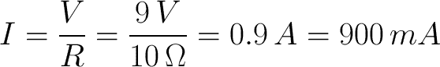
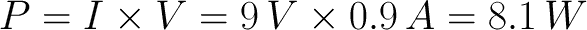
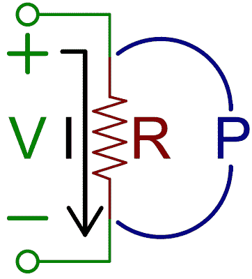
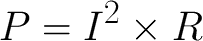
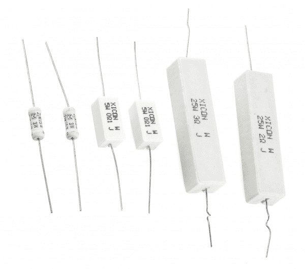
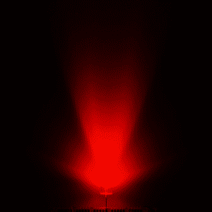
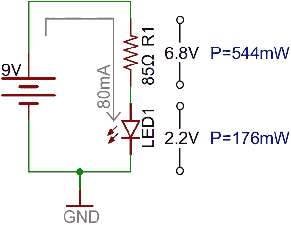

# 电力

> 原文：<https://learn.sparkfun.com/tutorials/electric-power>

## 以巨大的力量...

我们为什么在乎权力？功率是对能量随时间转移的度量，而能量需要花钱。电池不是免费的，从你的电源插座出来的东西也不是免费的。所以，权力衡量的是你钱包里的硬币流失的速度！

此外，能源是...能量。它有许多潜在的有害形式——热、辐射、声音、核等等。-，更大的功率意味着更多的能量。所以，在玩电子产品的时候，了解你使用的是哪种电源是很重要的。幸运的是，在玩 [Arduinos](https://learn.sparkfun.com/tutorials/what-is-an-arduino) 的时候，点亮 led，旋转小马达，忘记你用了多少电仅仅意味着消耗一个电阻或者熔化一个 IC。然而，[本大叔的建议](http://en.wikipedia.org/wiki/Uncle_Ben#.22With_great_power_comes_great_responsibility.22)不仅仅适用于超级英雄。

### 本教程涵盖的内容

*   权力的定义
*   电能传输的例子
*   瓦特，功率的[国际单位制](https://learn.sparkfun.com/tutorials/metric-prefixes-and-si-units)
*   使用电压、电流和电阻计算功率
*   最大额定功率

### 推荐阅读

功率是电子学中最基本的概念之一。但是在学习 power 之前，您应该先阅读一些其他教程。如果您不熟悉这些主题，请考虑先查看这些教程:

*   [什么是电](https://learn.sparkfun.com/tutorials/what-is-electricity)
*   [电压、电流、电阻和欧姆定律](https://learn.sparkfun.com/tutorials/voltage-current-resistance-and-ohms-law)
*   [什么是电路](https://learn.sparkfun.com/tutorials/what-is-a-circuit)
*   [如何使用万用表](https://learn.sparkfun.com/tutorials/how-to-use-a-multimeter)

## 什么是电力？

[https://www.youtube.com/embed/p8JQTLkV5C8?ecver=2](https://www.youtube.com/embed/p8JQTLkV5C8?ecver=2)

力量有很多种——物理的、社会的、超级的、[气味屏蔽](http://www.youtube.com/watch?v=dTvtFp_iPKc)、[爱](http://www.youtube.com/watch?v=-NMph943tsw)——但在本教程中，我们将集中讨论电力。那么什么是电力呢？

在普通物理学术语中，*功率*被定义为能量转移(或转化)的**速率。**

所以，首先，什么是能量，它是如何转移的？很难简单地陈述，但能量基本上是指*某物*带动*某物*的能力。能量有很多种形式:机械能、电能、化学能、电磁能、热能等等。

能量永远不能被创造或消灭，只能转化为另一种形式。我们在电子学中所做的很多事情都是在不同形式的能量和电能之间进行转换。点亮 led 将电能转化为电磁能。旋转马达将电能转化为机械能。嗡嗡嗡的蜂鸣器产生声能。用 9V 碱性电池给电路供电将化学能转化为电能。所有这些都是**能量转移**的形式。

| 转换的能源类型 | 转换者 |
| 机械的 | 电动机 |
| 电磁的 | 发光二极管 |
| 热 | 电阻器 |
| 化学的 | 电池 |
| 风 | 风车 |

*Example electric components, which transfer electric energy to another form.*

特别是电能，开始是电*势*能——我们亲切地称之为[电压](https://learn.sparkfun.com/tutorials/voltage-current-resistance-and-ohms-law/voltage)。当[电子流](https://learn.sparkfun.com/tutorials/what-is-electricity/flowing-charges)通过该势能时，它就转化为电能。在大多数有用的电路中，电能转化为其他形式的能量。电能是通过结合**传输多少**电能和**传输多快**来测量的。

### 生产者和消费者

电路中的每个元件不是**消耗**就是**产生**电能。消费者将电能转换成另一种形式。例如，当 LED 点亮时，电能转化为电磁能。在这种情况下，灯泡**消耗**电能。当能量从其他形式从*转移到*电能时，就产生了**电能。向电路供电的电池是**发电机**的一个例子。**

## 瓦特数

能量是用焦耳(J)来衡量的。因为功率是在一定时间内能量的量度，所以我们可以用**焦耳每秒**来测量。焦耳每秒的国际单位制单位是**瓦特**，缩写为 *W* 。

在“瓦特”前面加上一个标准的国际单位制前缀是很常见的:微瓦(W)、毫瓦(MW)、千瓦(kW)、兆瓦(mW)和[吉瓦](http://www.youtube.com/watch?v=iGlrobvb-ao) (GW)，根据具体情况都很常见。

| 前缀名称 | 前缀缩写 | 重量 |
| 毫微瓦 | 西北(North-West) | 10 ^(-9) |
| 微瓦 | W | 10 ^(-6) |
| 毫瓦 | 毫瓦 | 10 ^(-3) |
| 瓦 | W | 10 ⁰ |
| 千瓦 | 千瓦 | 10 ³ |
| 百万瓦特 | 兆瓦 | 10 ⁶ |
| 千兆瓦 | 十亿瓦特(gigawatt) | 10 ⁹ |

像 Arduino 这样的微控制器通常在 W 或 mW 范围内运行。笔记本电脑和台式电脑在标准瓦特功率范围内运行。一所房子的能耗通常在千瓦范围内。大型体育场可能以兆瓦级运行。千兆瓦开始用于大型发电站和时间机器。

## 计算能力

电功率是能量转移的速率。它的单位是焦耳每秒(J/s) -一瓦特(W)。给定我们知道的几个基本电学术语，我们如何计算电路中的功率？我们有一个非常标准的测量方法，涉及势能，伏特(V)，它是用每单位电荷的焦耳数(库仑)(J/C)来定义的。电流是另一个我们最喜欢的电学术语，它以安培(A) -库仑每秒(°C/s)为单位来测量电荷流量。把两者放在一起，我们得到了什么？！动力！

要计算电路中任何特定元件的功率，用流经该元件的电流乘以该元件上的电压降。

### 例如

下面是一个简单的(虽然不是所有的功能)电路:一个 9V 电池连接在一个 10 &ohm;电阻上。

我们如何计算电阻上的功率？首先我们必须找到流经它的电流。很容易...[欧姆定律](https://learn.sparkfun.com/tutorials/voltage-current-resistance-and-ohms-law/ohms-law)！

好的，900 毫安(0.9A)电流通过电阻，电阻上的电压为 9V。那么电阻上施加的是什么样的功率呢？

电阻器将电能转化为热能。所以这个电路每秒将 8.1 焦耳的电能转化为热量。

### 计算电阻电路中的功率

在纯阻性电路中计算功率时，只需知道三个值(电压、电流和/或电阻)中的两个即可。

通过将欧姆定律(V=IR 或 I=V/R)代入我们的传统功率方程，我们可以创建两个新方程。第一，纯粹就电压和电阻而言:

所以，在我们之前的例子中，9V ² /10 &欧姆；(V ² /R)是 8.1W，我们永远不用计算流经电阻的电流。

第二个功率方程可以仅由电流和电阻构成:

* * *

为什么我们会关心电阻上的功耗下降？或任何其他组件。记住，动力是能量从一种类型向另一种类型的转移。当来自电源的电能撞击电阻器时，能量转化为热量。可能比电阻器所能承受的热量更多。这让我们想到...额定功率。

## 额定功率

所有的电子元件都将能量从一种类型转移到另一种类型。一些能量转移是需要的:发光二极管发光，马达旋转，电池充电。其他能量转移是不希望的，但也是不可避免的。这些不必要的能量转移就是**功率损耗**，它通常以热量的形式出现。过多的功率损耗——组件过热——会变得*非常不理想。*

即使能量转移是组件的主要目标，仍然会有其他形式的能量损失。举例来说，发光二极管和马达仍然会产生热量，作为其他能量转移的副产品。

大多数元件都有一个最大功耗额定值，让它们在该值下工作非常重要。这将帮助你避免我们亲切地称之为“让魔法烟灭”的情况。

### 电阻器额定功率

电阻是一些更臭名昭著的功率损耗元凶。当你在一个电阻上降低一些电压时，你也会在电阻上感应出电流。更高的电压，意味着更大的电流，意味着更大的功率。

还记得我们的第一个[功率计算示例](calculating-power#ResistorPower)吗，我们发现如果 9V 电压降在 10 &欧姆的电阻上；电阻器，该电阻器将消耗 8.1 瓦。对于大多数电阻器来说，8.1 瓦是一个*瓦特数。大多数电阻器的额定值从&frac 18；W (0.125W)到 W (0.5W)。如果你在一个标准的 50 瓦电阻上降低 80 瓦，准备一个灭火器.*

*If you've seen resistors before, you've probably seen these. Top is a ½W resistor and below that a ¼W. These aren't built to dissipate very much power.*

有专门用于处理大功率下降的电阻。这些被特别称为**功率电阻**。

*These large resistors are built to dissipate lots of power. From left to right: two 3W 22k&ohm; resistors, two 5W 0.1&ohm; resistors, and 25W 3&ohm; and 2&ohm; resistors.*

如果你发现自己在挑选一个电阻值。记住它的额定功率。除非你的目标是加热某样东西(加热元件基本上都是高功率电阻)，否则尽量减少电阻的功率损耗。

#### 例如

当您试图确定 LED 限流电阻的值时，电阻额定功率可能会发挥作用。比方说，你想用 9V 电池以最大亮度点亮一个 [10mm 超高亮红色 LED](https://www.sparkfun.com/products/8862) 。

该 LED 的最大正向电流为 80mA，正向电压约为 2.2V。因此，要向 LED 提供 80mA 电流，您需要一个 85 &ohm;电阻。

电阻上的压降为 6.8V，流经电阻的 80mA 电流意味着电阻上的功耗为 0.544W (6.8V*0.08A)。一个半瓦的电阻是不会喜欢的！它可能不会融化，但会变热。为了安全起见，可以使用 1W 电阻(或者省电，使用专用 LED 驱动器)。

* * *

电阻肯定不是必须考虑最大额定功率的唯一元件。任何具有电阻特性的元件都会产生热功率损耗。使用通常承受高功率的元件，例如电压调节器、[二极管](https://learn.sparkfun.com/tutorials/diodes)、放大器和电机驱动器，意味着要特别注意功率损耗和热应力。

## 资源和更进一步

## 有兴趣学习更多基础主题吗？

查看我们的 **[工程要点](https://www.sparkfun.com/engineering_essentials)** 页面，了解电气工程相关基础主题的完整列表。

带我去那里！

现在你已经熟悉了电力的概念，看看这些相关的教程吧！

*   如何为你的项目提供动力 -你知道什么是“动力”。但是如何将它应用到您的项目中呢？
*   灯对电气工程师来说是一个有用的工具。对于许多项目来说，理解光与电子的关系是一项基本技能。
*   [什么是 Arduino](https://learn.sparkfun.com/tutorials/what-is-an-arduino) -我们在本教程中多次讨论了 Arduino。如果你仍然不清楚这是什么，看看这篇教程吧！
*   二极管 -无论是将交流电转换成 DC，还是仅仅点亮电源指示灯，二极管都是为项目供电的一个特别方便的组件。
*   电阻器是最基本的电子元件，几乎每个电路中都需要电阻器。
*   [MP3 播放器屏蔽音乐盒](https://learn.sparkfun.com/tutorials/mp3-player-shield-music-box) -说说能量转移！这个项目结合了电、运动和声音，制作了一个以*神秘博士*为主题的音乐盒。