# 极性

> 原文：<https://learn.sparkfun.com/tutorials/polarity>

## 什么是极性？

在电子学领域，**极性**表示电路元件是否**对称**。一个无极性的元件——一个没有极性的*部件——可以以任何方向连接，并且仍然以它应该的方式工作。对称元件很少有两个以上的端子，元件上的每个端子都是等效的。你可以在任何方向连接一个非极化组件，它的功能是一样的。*

一个**极化的**元件——一个具有极性的*部件——只能在一个方向上连接到一个电路。一个极化元件可能有两个、二十个甚至两百个引脚，每个引脚都有独特的功能和/或位置。如果一个极化元件被错误地连接到一个电路上，充其量它也不会像预期的那样工作。在最坏的情况下，一个不正确连接的极化组件将会冒烟，产生火花，成为一个非常不可靠的部件。*

[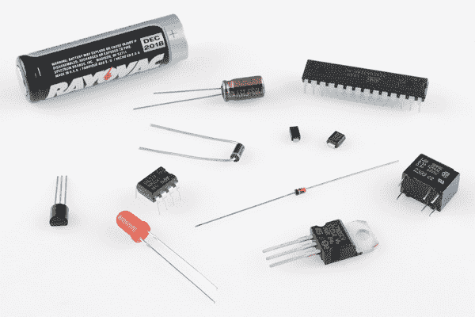](https://cdn.sparkfun.com/assets/5/4/1/e/0/5193d2adce395f3d7a000001.jpg)*An assortment of polarized components: batteries, integrated circuits, transistors, voltage regulators, electrolytic capacitors, and diodes, among others.*

极性是一个非常重要的概念，尤其是在物理构建电路时。无论您是将器件插入试验板、焊接到 PCB，还是将其缝合到电子纺织品项目中，能够识别极化元件并以正确的方向连接它们都至关重要。这就是我们来这里的目的！在本教程中，我们将讨论哪些元件有极性和没有极性，如何识别元件极性，以及如何测试一些元件的极性。

### 考虑读书

如果你还没有晕头转向，通读本教程的其余部分可能是安全的。极性是一个建立在一些低级电子概念基础上的概念，并强化了其他一些概念。如果你还没有，在你通读本教程之前，考虑看看下面的一些教程。

 [### 什么是电路？](https://learn.sparkfun.com/tutorials/what-is-a-circuit) Every electrical project starts with a circuit. Don't know what a circuit is? We're here to help.[Favorited Favorite](# "Add to favorites") 82 [### 电压、电流、电阻和欧姆定律](https://learn.sparkfun.com/tutorials/voltage-current-resistance-and-ohms-law) Learn about Ohm's Law, one of the most fundamental equations in all electrical engineering.[Favorited Favorite](# "Add to favorites") 132 [### 如何使用试验板](https://learn.sparkfun.com/tutorials/how-to-use-a-breadboard) Welcome to the wonderful world of breadboards. Here we will learn what a breadboard is and how to use one to build your very first circuit.[Favorited Favorite](# "Add to favorites") 79 [### 如何使用万用表](https://learn.sparkfun.com/tutorials/how-to-use-a-multimeter) Learn the basics of using a multimeter to measure continuity, voltage, resistance and current.[Favorited Favorite](# "Add to favorites") 67

## 二极管和 LED 极性

**Note:** We will be referring to the flow of current that is relative to the positive charges (i.e. [conventional current](https://learn.sparkfun.com/tutorials/voltage-current-resistance-and-ohms-law#current)) in a circuit.

二极管只允许电流向一个方向流动，它们的 T2 总是被极化。二极管有两个端子。正极称为*阳极*，负极称为*阴极*。

[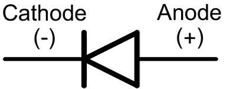](https://cdn.sparkfun.com/assets/learn_tutorials/7/5/backwardsDiode.png)*The diode circuit symbol, with the anode and cathode marked.*

通过二极管的电流只能从阳极流向阴极，这就解释了二极管连接方向正确的重要性。实际上，每个二极管的阳极或阴极引脚都应该有某种指示。通常二极管在阴极引脚附近会有一条**线，它与二极管电路符号中的垂直线相匹配。**

下面是二极管的几个例子。顶部的二极管是一个 [1N4001](http://www.sparkfun.com/products/8589) 整流器，在阴极附近有一个灰色的环。在那下面，一个 [1N4148](http://www.sparkfun.com/products/8588) 信号二极管用一个黑环标记阴极。底部是一对表面贴装二极管，每个二极管用一条线来标记哪个引脚是阴极。

[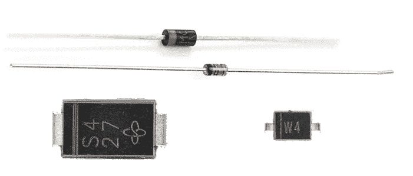](https://cdn.sparkfun.com/assets/1/e/8/1/4/518aca69ce395f6437000002.png)*Notice the lines on each device, denoting the Cathode side, which match the line in the symbol above.*

### 发光二极管

LED 代表[发光*二极管*有一些标识符可用于查找 LED 上的正极和负极引脚。你可以试着找到**较长的腿**，它应该指示正极，阳极引脚。](https://learn.sparkfun.com/tutorials/light-emitting-diodes-leds)

或者，如果有人修剪了支腿，尝试在 LED 外壳上找到平边。最靠近**平边**的引脚将是负极引脚。

[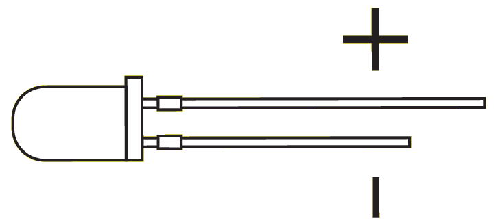](https://cdn.sparkfun.com/assets/0/c/5/d/a/518d2d78ce395f2675000000.png)

也可能有其他指标。SMD 二极管有一系列阳极/阴极标识符。有时候，最简单的方法就是使用一个万用表来测试极性。将万用表转到二极管设置(通常由二极管符号指示)，并将每个探针接触其中一个 LED 端子。如果 LED 亮起，则正探针接触阳极，负探针接触阴极。如果它不亮，试着交换探针。

[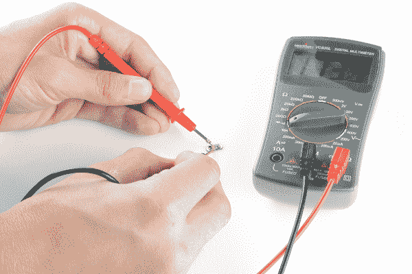](https://cdn.sparkfun.com/assets/learn_tutorials/7/5/GreyMultimeterLED.png)*The polarity of a tiny, yellow, surface-mount LED is tested with a multimeter. If the positive lead touches the anode and negative touches the cathode, the LED should light up.*

* * *

二极管肯定不是唯一的极化元件。如果连接不正确，有大量的零件将无法工作。接下来，我们将讨论一些其他常见的极化元件，从集成电路开始。

## 集成电路极性

集成电路(IC)可能有八个或八十个引脚，IC 上的每个引脚都有独特的功能和位置。IC 的极性保持一致非常重要。如果连接不正确，它们很有可能会冒烟、融化和毁坏。

通孔 IC 通常采用双列直插式封装(DIP ),即两排引脚，每排引脚的间距为 0.1 英寸，足以横跨试验板的中心。DIP ICs 通常有一个**凹口**来指示众多引脚中哪个是第一个。如果没有凹口，IC 可能在引脚 1 附近的外壳上有一个蚀刻的**点**。

*An IC with both a dot and a notch to indicate polarity. Sometimes you get both, sometimes you only get one or the other.*

对于所有 IC 封装，引脚数随着逆时针远离引脚 1 而依次增加。

[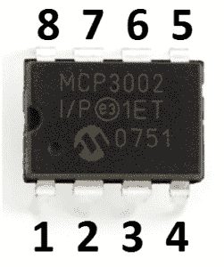](https://cdn.sparkfun.com/assets/7/0/7/6/0/518ad5ebce395f2138000002.png)

表面贴装 IC 可能来自 QFN、SOIC、SSOP 或其他一些国家。这些 IC 通常在引脚 1 附近有一个**点**。

[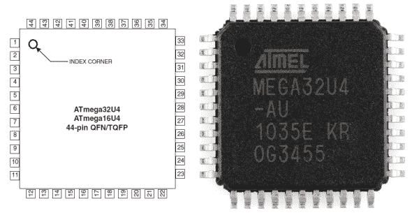](https://cdn.sparkfun.com/assets/3/5/4/1/8/518ad8c5ce395fca37000003.png)*An [ATmega32U4](https://www.sparkfun.com/products/11181) in a TQFP package, next to the datasheet pinout.*

## 电解电容器

并非所有的[电容器](https://learn.sparkfun.com/tutorials/capacitors)都被极化，但是当它们被极化时，*非常重要的一点是不要混淆它们的极性。*

陶瓷电容器-小的(1 F 及以下)，通常是黄色的家伙-是**不**极化。你可以把它们放在任何一个地方。

[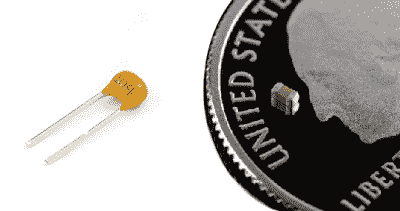](https://cdn.sparkfun.com/assets/0/c/8/a/d/518bd819ce395f174f000000.png)*[Through-hole](https://www.sparkfun.com/products/8375) and [SMD](https://www.sparkfun.com/products/11245) 0.1µF ceramic capacitors. These are NOT polarized.*

电解帽([他们有电解液](http://www.youtube.com/watch?v=-Vw2CrY9Igs))，看起来像小锡罐，**被极化**。盖的负极引脚通常由沿罐的**“-”标记**和/或**彩色条**指示。它们也可能有一条更长的正腿。

下面是 [10 F](https://www.sparkfun.com/products/523) (左)和一个 [1mF](https://www.sparkfun.com/products/8982) 电解电容，每个电容都有一个破折号来标记负极脚，还有一个较长的正极脚。

[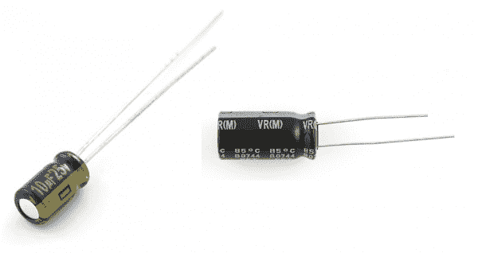](https://cdn.sparkfun.com/assets/9/4/2/8/8/518d258ace395f9a51000000.png)

对电解电容长时间施加负电压会导致短暂但灾难性的故障。他们会发出“砰”的一声，瓶盖的顶部会膨胀或裂开。从那时起，瓶盖就像死了一样，就像短路一样。

## 其他极化组件

### 电池和电源

在电路中获得正确的极性始于并止于正确连接[电源](https://learn.sparkfun.com/tutorials/how-to-power-a-project)。无论您的项目是从[壁式电源](https://www.sparkfun.com/products/298)还是[脂电池](../battery-technologies/lithium-polymer)获得电力，确保您不会意外地将它们反向连接，并意外地将 **-** 9V 或 **-** 4.2V 应用到您的项目是至关重要的。

任何更换过电池的人都知道如何找到它们的极性。大多数电池会用“+”或“-”符号表示正极和负极。其他时候，红线代表正极，黑线代表负极。

[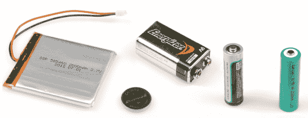](https://cdn.sparkfun.com/assets/b/3/0/7/7/518bc702ce395fb64e000000.jpg)*An assortment of batteries. [Lithium polymer](../battery-technologies/lithium-polymer), [coin cell](../battery-technologies/coin-cell), [9V alkaline](../battery-technologies/alkaline), [AA alkaline](../battery-technologies/alkaline), and [AA NiMH](../battery-technologies/nickel-metal-hydride). Each has some way to represent positive or negative terminals.*

电源通常有一个标准化的[连接器](https://learn.sparkfun.com/tutorials/connector-basics)，它本身通常应该有极性。例如，[桶形千斤顶](https://www.sparkfun.com/products/119)有两个导体:外导体和内导体；内部/中心导体通常是正极端子。其他连接器，如 [JST](https://www.sparkfun.com/products/8613) ，是**键控**，所以你不能把它们反过来连接。

为了防止电源极性反转，您可以使用二极管或 MOSFET 添加[反极性保护](https://learn.sparkfun.com/tutorials/diodes#reversePolarity)。

### 晶体管、MOSFETs 和稳压器

这些(传统的)三端极化元件被集中在一起，因为它们具有相似的封装类型。通孔[晶体管](https://learn.sparkfun.com/tutorials/transistors)、MOSFETs 和稳压器通常采用 TO-92 或 TO-220 封装，如下所示。要找出哪个引脚是哪个引脚，请查找 TO-92 封装上的平边或 TO-220 上的金属散热片，并将其与数据手册中的引脚排列进行匹配。

[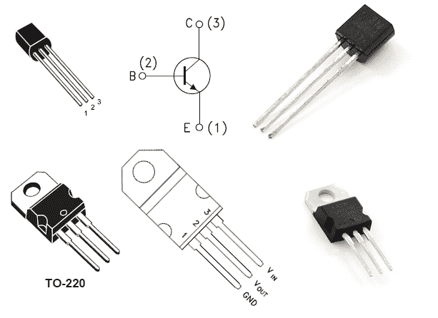](https://cdn.sparkfun.com/assets/9/4/3/4/1/518d2bfdce395fa672000000.png)*Above, a [2N3904 transistor](https://www.sparkfun.com/products/521) in a TO-92 package, note the curved and straight edges. A [3.3V regulator](https://www.sparkfun.com/products/526) in a TO-220 package, note the metal heatsink on the back.*

### 等等。

这只是极化组件的冰山一角。即使是非极化元件，如[电阻](https://learn.sparkfun.com/tutorials/resistors)，也可以采用极化封装。一个电阻组——由大约五个预先安排好的电阻组成——就是这样一个例子。

*A polarized resistor pack. An [array of five 330&ohm; resistors](https://www.sparkfun.com/products/10855), all tied together at one end. The dot represents the first, common pin.*

幸运的是，每个极化元件都应该有某种方式来告诉你哪个引脚是哪个引脚。务必始终**阅读数据表**，并检查表壳是否有圆点或其他标记。

## 资源和更进一步

既然你知道什么是极性，以及如何识别它，为什么不看看这些相关的教程:

*   [连接器基础知识](https://learn.sparkfun.com/tutorials/connector-basics) -许多连接器都有自己的极性。通常这是一个很好的方法来确保你不会把电源或其他信号反过来。
*   [二极管](https://learn.sparkfun.com/tutorials/diodes) -我们元件极性的光辉典范。本教程进一步深入探讨了二极管的工作原理，以及现有的二极管类型。
*   [LilyPad 设计套件实验 1](https://learn.sparkfun.com/tutorials/ldk-experiment-1-lighting-up-a-basic-circuit) -电路不仅仅存在于试验板和电路板上，你也可以将它们缝进衬衫和其他纺织品中！查看 LilyPad 设计工具包教程，了解如何开始使用。了解极性对于正确连接这些发光二极管非常重要。

## 有兴趣学习更多基础主题吗？

查看我们的 **[工程要点](https://www.sparkfun.com/engineering_essentials)** 页面，了解电气工程相关基础主题的完整列表。

带我去那里！

