# 什么是电？

> 原文：<https://learn.sparkfun.com/tutorials/what-is-electricity>

## 入门指南

电就在我们身边——为我们的手机、电脑、电灯、烙铁和空调等技术提供动力。在我们的现代世界，很难逃避它。即使当你试图逃离电，它仍然在自然界中工作，从雷暴中的闪电到我们体内的突触。但是电到底是什么*？这是一个非常复杂的问题，随着你深入挖掘和问更多的问题，真的没有一个确定的答案，只有电如何与我们的环境相互作用的抽象表示。*

[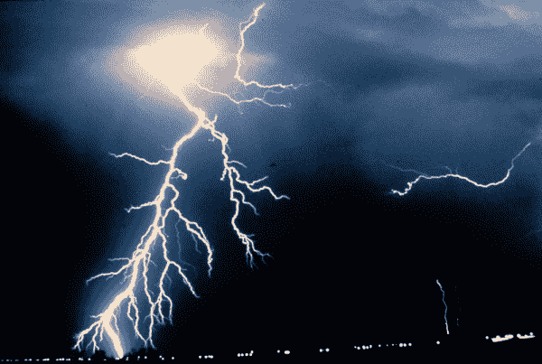](https://cdn.sparkfun.com/assets/9/8/d/5/4/519f9719ce395faa3c000000.jpg)

电是一种自然现象，在自然界中普遍存在，并有多种不同的形式。在本教程中，我们将关注电流:为我们的电子设备供电的东西。我们的目标是了解电流如何从电源通过电线流动，点亮 led，旋转电机，并为我们的通信设备供电。

电被简单地定义为**电荷流，**但是在这个简单的陈述背后还有很多东西。费用从何而来？我们如何移动它们？他们搬到哪里去了？电荷是如何引起机械运动或使物体发光的？这么多问题！为了开始解释什么是电，我们需要超越物质和分子，放大到构成我们生活中相互作用的一切的原子。

本教程建立在对物理学的一些基本理解之上，[力](http://en.wikipedia.org/wiki/Force)、[能量](http://en.wikipedia.org/wiki/Energy)、[原子](http://en.wikipedia.org/wiki/Atoms)，特别是【场】(http://en . Wikipedia . org/wiki/Field _(physics))。我们将忽略这些物理概念中的每一个的基础，但是参考其他资源也可能有所帮助。

## 走向原子化

为了理解电的基本原理，我们需要从关注原子开始，原子是生命和物质的基本组成部分之一。原子以一百多种不同的化学元素形式存在，如氢、碳、氧和铜。许多类型的原子可以结合起来形成分子，分子构成了我们可以看得见摸得着的物质。

原子很小，最大长度约为 300 皮米(即 3 X10-10 或 0.0000000003 米)。一枚铜币(如果它实际上是由 100%铜制成的)里面会有 3.2x10 ^(22) 个铜原子(320 亿个原子)。

甚至原子也不够小，不足以解释电的工作原理。我们需要再深入一层，看看原子的组成部分:质子、中子和电子。

### 原子的积木

原子是由三种不同的粒子组合而成的:电子、质子和中子。每个原子都有一个中心原子核，在那里质子和中子密集地聚集在一起。围绕原子核的是一组轨道电子。

[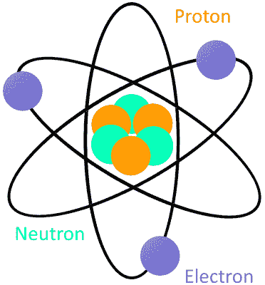](https://cdn.sparkfun.com/assets/0/4/e/8/2/519fa09dce395f8b08000000.png)*A very simple atom model. It's not to scale but helpful for understanding how an atom is built. A core nucleus of protons and neutrons is surrounded by orbiting electrons.*

每个原子中至少要有一个质子。一个原子中的质子数很重要，因为它决定了原子代表什么化学元素。例如，只有一个质子的原子是氢，有 29 个质子的原子是铜，有 94 个质子的原子是钚。这个质子数被称为原子的原子序数。

质子的原子核伙伴中子有一个重要的用途；它们将质子保留在原子核中，并确定原子的同位素。它们对我们理解电学并不重要，所以在本教程中我们不用担心它们。

电子对电的运作至关重要(注意到它们名字中的一个共同主题了吗？)在最稳定、最平衡的状态下，原子的电子数与质子数相同。如下面的[波尔原子模型](http://en.wikipedia.org/wiki/Bohr_model)所示，一个有 29 个质子的原子核(使其成为铜原子)被等量的电子包围着。

[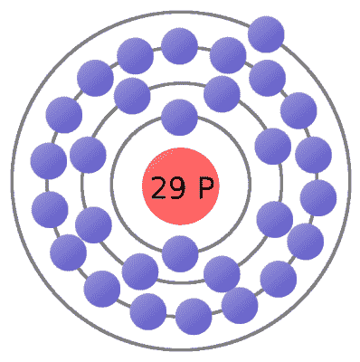](https://cdn.sparkfun.com/assets/9/5/4/c/f/519fbf5cce395f953c000000.png)*As our understanding of atoms has evolved, so too has our method for modeling them. The Bohr model is a very useful atom model as we explore electricity.*

原子的电子并不都永远束缚在原子上。原子外层轨道上的电子叫做价电子。在足够的外力作用下，价电子可以脱离原子轨道，成为自由电子。自由电子允许我们移动电荷，这就是电的意义。说到费用...

## 流动电荷

正如我们在本教程开始时提到的，电被定义为电荷的流动。电荷是物质的一种属性，就像质量、体积或密度一样。这是可以衡量的。正如你可以量化某物的质量，你也可以测量它的电荷。电荷的关键概念是它有两种类型:**正(+)或负(-)** 。

为了移动电荷，我们需要**电荷载体**，这就是我们关于原子粒子——特别是电子和质子——的知识派上用场的地方。电子总是带负电荷，而质子总是带正电荷。中子(名副其实)是中性的，它们没有电荷。电子和质子都携带相同的 T2 数量的电荷，只是类型不同。

[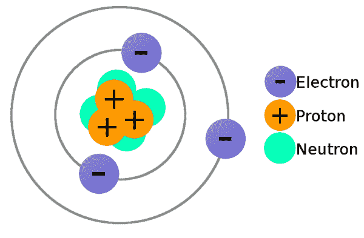](https://cdn.sparkfun.com/assets/3/4/1/a/3/51a65d7bce395f156c000000.png)*A lithium atom (3 protons) model with the charges labeled.*

电子和质子的电荷很重要，因为它为我们提供了对它们施加作用力的手段。静电力！

### 静电力

静电力(也叫[库仑定律](https://en.wikipedia.org/wiki/Coulomb%27s_law))是电荷之间作用的力。它说明同种电荷相互排斥，而异性电荷相互吸引。**异性相吸，同性相斥**。

作用在两个电荷上的力的总量取决于它们之间的距离。两个电荷离得越近，力就越大(要么推在一起，要么拉开)。

由于静电力，电子会推开其他电子，被质子吸引。这种力是将原子结合在一起的“胶水”的一部分，但它也是我们需要让电子(和电荷)流动的工具！

### 使电荷流动

我们现在有了让电荷流动的所有工具。原子中的**电子**可以充当我们的**电荷载体**，因为每个电子都带负电荷。如果我们能从原子中释放出一个电子并迫使它运动，我们就能创造电。

考虑铜原子的原子模型，它是电荷流的首选元素源之一。在平衡状态下，铜的原子核中有 29 个质子，围绕它旋转的电子数量相等。电子在离原子核不同距离的轨道上运行。离原子核较近的电子比那些在较远轨道上的电子感受到更强的中心引力。原子最外层的电子被称为**价电子**，它们需要最少的力才能从原子中释放出来。

[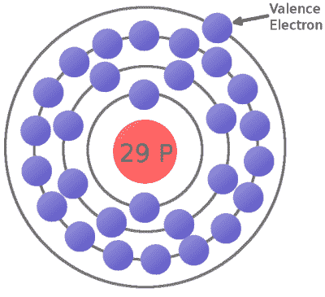](https://cdn.sparkfun.com/assets/6/e/6/0/2/51a67853ce395fa26b000000.png)*This is a copper atom diagram: 29 protons in the nucleus, surrounded by bands of circling electrons. Electrons closer to the nucleus are hard to remove while the valence (outer ring) electron requires relatively little energy to be ejected from the atom.*

对价电子施加足够的静电力——要么用另一个负电荷推动它，要么用一个正电荷吸引它——我们可以将电子从围绕原子的轨道上弹出，产生一个自由电子。

现在考虑一根铜线:充满无数铜原子的物质。当我们的**自由电子**漂浮在原子之间的空间中时，它会受到该空间中周围电荷的牵引和推动。在混乱中，自由电子最终会找到一个新的原子来抓住它；在这样做的时候，那个电子的负电荷从原子中排出另一个价电子。现在，一个新的电子正在自由空间中漂移，试图做同样的事情。这种连锁效应可以持续下去，从而产生一种叫做**电流**的电子流。

[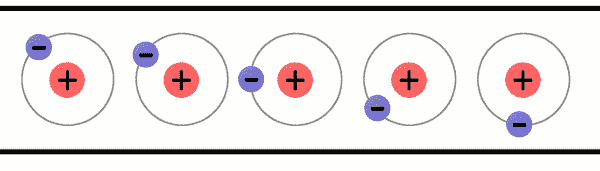](https://cdn.sparkfun.com/assets/9/5/6/1/4/519fcd42ce395f804c000000.gif)*A very simplified model of charges flowing through atoms to make current.*

### 传导性

一些元素类型的原子比其他类型的原子更容易释放电子。为了获得尽可能好的电子流，我们想使用不太紧地抓住价电子的原子。元素的电导率衡量电子与原子结合的紧密程度。

具有高导电性的元素具有非常易移动的电子，被称为**导体**。这些是我们想用来制造电线和其他有助于电子流的元件的材料。像铜、银和金这样的金属通常是我们良好导体的首选。

电导率低的元素称为**绝缘体**。绝缘体有一个非常重要的作用:它们阻止电子流动。常见的绝缘体包括玻璃、橡胶、塑料和空气。

## 静电或电流

在我们深入讨论之前，让我们先讨论电的两种形式:静电或电流。在与电子打交道时，电流会更常见，但了解静电也很重要。

### 静电

当被绝缘体隔开的物体上积聚了相反的电荷时，就产生了静电。静电(如“静止的”)电存在，直到两组相反的电荷能够找到彼此之间的路径来平衡系统。

[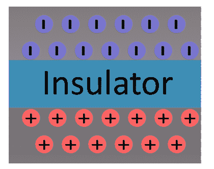](https://cdn.sparkfun.com/assets/d/9/1/2/4/51a79b81ce395f8a10000000.png)

当电荷找到平衡的方法时，就会发生静电放电。电荷的吸引力变得如此之大，以至于它们可以穿过最好的绝缘体(空气、玻璃、塑料、橡胶等)。).静电放电可能是有害的，这取决于电荷通过的介质以及电荷转移到的表面。当移动的电子与空气中的电子碰撞时，通过空气间隙均衡的电荷会导致可见的电击，电子被激发并以光的形式释放能量。

[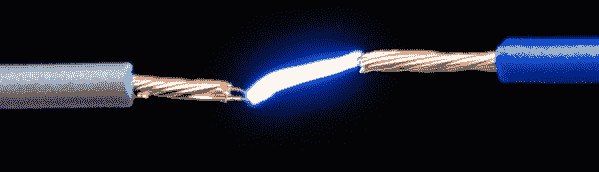](https://cdn.sparkfun.com/assets/9/6/8/6/6/51a4e10fce395f1525000000.jpg)*[Spark gap igniters](https://www.sparkfun.com/products/11218) are used to create a controlled static discharge. Opposite charges build up on each of the conductors until their attraction is so great charges can flow through the air.*

静电放电最引人注目的例子之一是**闪电**。当一个云系统相对于另一群云或地球的地面聚集了足够的电荷时，电荷会试图平衡。当云放电时，大量的正电荷(有时是负电荷)从地面到云穿过空气，造成我们都熟悉的可见效应。

当我们在头上摩擦气球让头发竖起来时，或者当我们穿着毛绒拖鞋在地板上拖来拖去并电击家猫时(当然是不小心)，静电也很常见。在每种情况下，摩擦不同类型的材料产生的摩擦都会转移电子。失去电子的物体带正电，而获得电子的物体带负电。这两个物体变得相互吸引，直到它们能找到平衡的方法。

在处理电子产品时，我们一般不用处理静电。当我们这样做时，通常是为了保护我们敏感的电子元件免受静电放电的影响。针对静电的预防措施包括佩戴 ESD(静电放电)腕带，或者在电路中添加特殊组件来防止非常高的电荷峰值。

### 电流

电流是电的一种形式，它使我们所有的电子小发明成为可能。当电荷能够不断流动时，这种形式的电就存在了。与电荷聚集并保持静止的静电相反，电流是动态的，电荷总是在运动。在本教程的剩余部分，我们将重点关注这种形式的电。

#### 电路

为了流动，电流需要一个[电路](https://learn.sparkfun.com/tutorials/what-is-a-circuit):一个闭合的、永无止境的导电材料回路。电路可以是简单的首尾相连的导线，但有用的电路通常包含导线和其他控制电流的元件。制作电路的唯一规则是**中不能有任何绝缘间隙**。

如果你有一根充满铜原子的导线，并想诱导电子流通过它，*所有的*自由电子需要在某个地方以相同的方向流动。铜是很好的导体，非常适合电荷流动。如果一个铜线电路断开，电荷就不能在空气中流动，这也将阻止任何朝向中间的电荷去任何地方。

另一方面，如果导线首尾相连，电子都有一个相邻的原子，并且都可以向同一个方向流动。

* * *

我们现在明白了电子是如何流动的，但是首先我们如何让它们流动呢？那么，一旦电子在流动，它们如何产生点亮灯泡或旋转马达所需的能量呢？为此，我们需要了解电场。

## 电场

我们已经掌握了电子流过物质来发电的方法。这就是电的全部。嗯，几乎全部。现在我们需要一个源来诱导电子流。最常见是，电子流的来源来自电场。

### 什么是场？

一个*场*是我们用来模拟物理相互作用的工具，其中**不涉及任何可观察到的接触**。场看不见，因为它们没有物理外观，但它们的效果是非常真实的。

我们潜意识里都特别熟悉一个领域:[地球引力场](http://en.wikipedia.org/wiki/Earth%27s_gravity)，一个大质量物体吸引其他物体的效应。地球的重力场可以用一组指向地球中心的向量来模拟；不管你在表面的什么地方，你都会感觉到有一股力量把你推向它。

[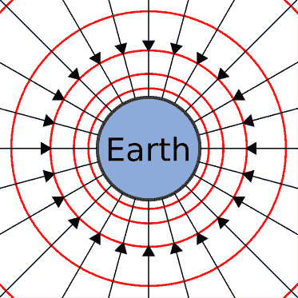](https://cdn.sparkfun.com/assets/5/1/a/e/9/51a4ee19ce395f2625000000.png)

磁场的强度并不是在磁场中的所有点都是一致的。你离场的源头越远，场的影响就越小。当你离地球中心越远，地球引力场的大小就越小。

当我们继续探索电场时，特别要记住地球的引力场是如何工作的，这两个场有许多相似之处。重力场对有质量的物体施加一个力，电场对有电荷的物体施加一个力。

### 电场

电场是理解电流如何开始和继续流动的一个重要工具。电场**描述了电荷之间空间的拉力或推力**。与地球的引力场相比，电场有一个主要的区别:虽然地球的电场通常只吸引其他质量的物体(因为所有物体都是*，所以*的质量要小得多)，但电场在吸引电荷的同时也会推开电荷。

电场的方向总是被定义为一个正的测试电荷如果落在电场中会移动的方向。测试电荷必须无限小，以防止其电荷影响磁场。

我们可以从构建正负电荷的电场开始。如果你在负电荷附近放下一个正的测试电荷，测试电荷会被吸引向负的电荷。因此，对于一个负电荷，我们画出电场箭头**指向所有方向**。同样的测试电荷落在另一个**正电荷**附近会导致向外排斥，这意味着我们画出**箭头指向正电荷的**。

[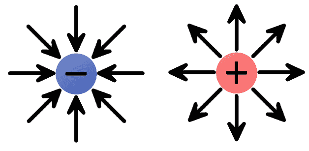](https://cdn.sparkfun.com/assets/2/d/5/0/0/519fd3c7ce395f974c000000.png)*The electric fields of single charges. A negative charge has an inward electric field because it attracts positive charges. The positive charge has an outward electric field, pushing away like charges.*

电荷群可以结合起来形成更完整的电场。

[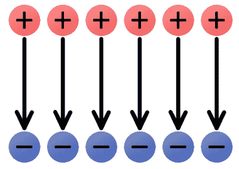](https://cdn.sparkfun.com/assets/3/b/d/a/0/519fd76ece395f4b4c000000.png)

上面的均匀电场远离正电荷，指向负电荷。想象一个微小的正测试电荷落在电场中；它应该沿着箭头的方向。正如我们所见，电通常涉及电子的流动——负电荷——它逆着电场流动。

电场为我们提供了感应电流所需的推力。电路中的电场就像一个电子泵:一个巨大的负电荷源，可以推动电子，电子将通过电路流向正电荷团。

## 电势(能量)

当我们利用电力为我们的电路、小发明和小玩意供电时，我们实际上是在转换能量。电子电路必须能够储存能量，并将其转化为其他形式，如热、光或运动。电路储存的能量称为电势能。

### 能量？势能？

为了理解势能，我们需要从总体上理解能量。能量被定义为一个物体对另一个物体做*功*的能力，这意味着将那个物体移动一段距离。能量以多种形式出现在**中**，有些我们能看到(如机械的)，有些我们看不到(如化学的或电的)。无论能量以何种形式存在，它都以两种 T4 状态之一存在:动能或势能。

一个物体在运动时有动能。一个物体的动能取决于它的质量和速度。**势能**，另一方面，当一个物体静止时，是一个**储存的能量**。它描述了如果物体开始运动，它能做多少功。这是一种我们通常可以控制的能量。当一个物体开始运动时，它的势能就转化为动能。

[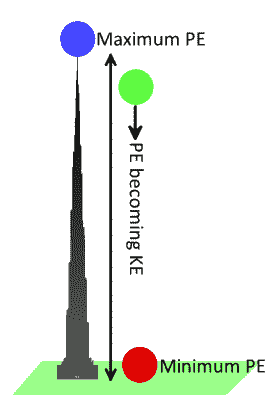](https://cdn.sparkfun.com/assets/2/9/2/3/a/51a7c325ce395f341d000001.png)

让我们回到使用重力作为例子。一个静止在哈利法塔顶部的保龄球有很多潜在的(储存的)能量。一旦下落，球在重力场的作用下加速向地面运动。当球加速时，势能转化为动能(运动产生的能量)。最终，球的所有能量都从势能转化为动能，然后传递给它碰到的任何物体。当球在地面上时，它的势能很低。

### 电势能

就像引力场中的质量有引力势能一样，电场中的电荷有**电势能**。电荷的电势能描述了它储存了多少能量，当静电力使其运动时，该能量可以变成动能，电荷可以做功。

就像坐在塔顶的保龄球，一个正电荷靠近另一个正电荷有很高的势能；如果任其自由移动，电荷会被同类电荷排斥。放在负电荷附近的正测试电荷将具有低势能，类似于地面上的保龄球。

[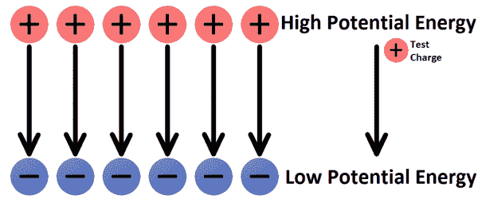](https://cdn.sparkfun.com/assets/2/3/5/1/e/51a4f1a7ce395f4125000000.png)

为了给任何东西注入势能，我们必须通过移动它一段距离来做功。以保龄球为例，功来自于逆着重力场把它抬上 163 层楼。类似地，必须做功，将正电荷推向电场的箭头方向(要么朝向另一个正电荷，要么远离负电荷)。电荷越往上，你要做的工作就越多。同样，如果你试图逆着电场将负电荷*从正电荷*处拉走，你必须做功。

对于位于电场中的任何电荷，其电势取决于电荷的类型(正或负)、数量及其在电场中的位置。电势能的单位是焦耳( *J* )。

### 电势

电势建立在电势*能量*的基础上，以帮助定义电场中储存了多少**能量。这是另一个帮助我们模拟电场行为的概念。电势是*而不是*电势能！**

在电场中的任何一点，电势等于该点的**电势能除以**电荷量。它把电荷量从等式中去掉，给我们留下一个概念，电场的特定区域可以提供多少势能。电势的单位是焦耳每库仑( *J/C* ，我们将其定义为**伏特** (V)。

在任何电场中，都有两点电势是我们非常感兴趣的。有一个高电位点，正电荷可能具有最高的势能，有一个低电位点，电荷可能具有最低的势能。

我们在评估电力时讨论的最常见的术语之一是**电压**。电压是电场中两点之间的电位差。电压让我们知道电场的推力有多大。

* * *

有了潜能和势能，我们就有了制造电流所需的所有要素。我们开始吧！

## 电在行动！

在学习了粒子物理学、场论和势能之后，我们现在知道了足够的知识来使电流流动。让我们绕一圈！

首先，我们将回顾发电所需的成分:

*   电的定义是**电荷流**。通常我们的电荷将由自由流动的电子携带。
*   带负电荷的**电子**松散地束缚在导电材料的原子上。只要轻轻一推，我们就能从原子中释放出电子，并使它们朝大体一致的方向流动。
*   由导电材料制成的闭合电路为电子持续流动提供了路径。
*   电荷由一个电场推动。我们需要一个电势(电压)源，它将电子从一个低势能点推向更高的势能点。

### 短路

电池是将化学能转化为电能的普通能源。它们有两个端子，连接到电路的其余部分。在一端有过多的负电荷，而在另一端所有的正电荷都聚集在一起。这是一个等待动作的电势差！

[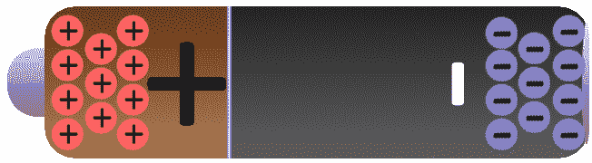](https://cdn.sparkfun.com/assets/4/2/5/5/c/51a78f3ece395fa011000003.png)

如果我们将装满导电铜原子的导线连接到电池，电场将影响铜原子中带负电荷的自由电子。同时受到负极的推动和正极的拉动，铜中的电子将从一个原子移动到另一个原子，产生电荷流，我们称之为电流。

[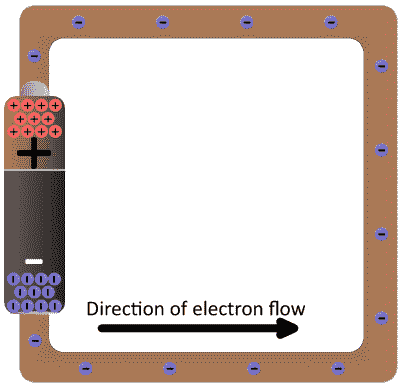](https://cdn.sparkfun.com/assets/8/4/1/0/e/51a79424ce395f9a11000000.png)

电流流过一秒钟后，电子实际上移动了*非常*一厘米的一小部分。然而，电流产生的能量是*巨大的*，特别是因为在这个电路中没有任何东西来减缓流动或消耗能量。将纯导体直接跨接在能源上是一个**坏主意**。能量在系统中快速移动，并在电线中转化为热量，这可能会很快转化为熔化的电线或火。

### 点亮灯泡

与其浪费所有的能量，更不用说破坏电池和电线，让我们建立一个电路做一些有用的事情！一般来说，电路会把电能转换成其他形式——光、热、运动等。如果我们用电线把灯泡和电池连接起来，我们就有了一个简单的功能电路。

[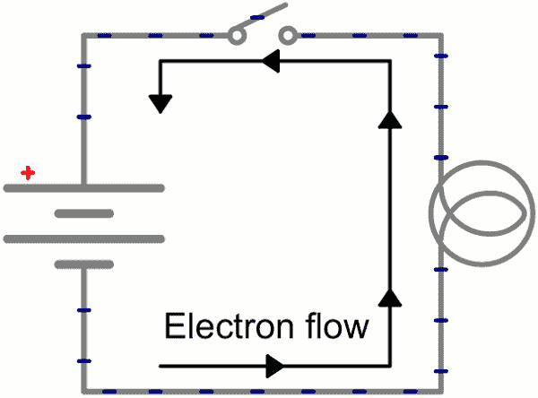](https://cdn.sparkfun.com/assets/a/0/9/4/0/51a52b62ce395f2f25000001.gif)*Schematic: A battery (left) connecting to a lightbulb (right), the circuit is completed when the switch (top) closes. With the circuit closed, electrons can flow, pushed from the negative terminal of the battery through the lightbulb, to the positive terminal.*

当电子以蜗牛般的速度移动时，电场几乎会立即影响整个电路(我们说的是光速)。整个电路中的电子，无论是在最低电位、最高电位，还是就在灯泡旁边，都会受到电场的影响。当开关闭合，电子受到电场作用时，电路中的所有电子似乎同时开始流动。离灯泡最近的电荷将在电路中前进一步，开始将电能转化为光能(或热能)。

## 资源和更进一步

在本教程中，我们只发现了众所周知的冰山一角的一小部分。仍然有大量的概念没有被发现。从这里开始，我们建议你直接进入我们的[电压、电流、电阻和欧姆定律](https://learn.sparkfun.com/tutorials/voltage-current-resistance-and-ohms-law)教程。既然你已经知道了电场(电压)和流动的电子(电流)的所有知识，你就可以理解支配它们相互作用的定律了。

## 有兴趣学习更多基础主题吗？

查看我们的 **[工程要点](https://www.sparkfun.com/engineering_essentials)** 页面，了解电气工程相关基础主题的完整列表。

带我去那里！

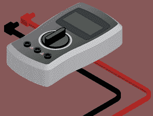

欲了解更多关于电的信息和可视化解释，请访问[这个网站](https://www.saveonenergy.com/how-electricity-works/)。

以下是我们推荐阅读的一些初级概念教程:

*   [什么是电路？](https://learn.sparkfun.com/tutorials/what-is-a-circuit)
*   [电力](https://learn.sparkfun.com/tutorials/electric-power)
*   [串联和并联电路](https://learn.sparkfun.com/tutorials/series-and-parallel-circuits)

或者，也许你想学些实用的东西？在这种情况下，请查看一些基本技能教程:

*   [如何使用万用表](https://learn.sparkfun.com/tutorials/how-to-use-a-multimeter)
*   [使用焊线](https://learn.sparkfun.com/tutorials/working-with-wire)
*   [用导电线缝制](https://learn.sparkfun.com/tutorials/sewing-with-conductive-thread)