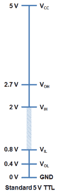
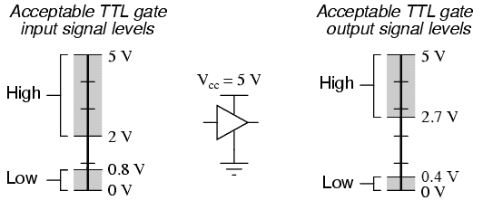
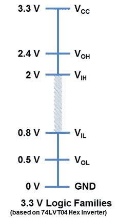
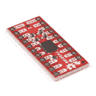
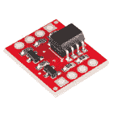
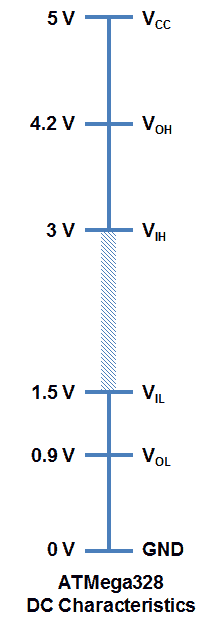

# 逻辑电平

> 原文：<https://learn.sparkfun.com/tutorials/logic-levels>

## 介绍

我们生活在一个模拟信号的世界。然而，在数字电子设备中，只有两种状态——开或关。利用这两种状态，设备可以编码、传输和控制大量数据。从最广泛的意义上来说，逻辑电平描述了信号可能具有的任何特定的离散状态。在数字电子学中，我们通常把我们的研究限制在两种逻辑状态——二进制 1 和二进制 0。

### 本教程涵盖的内容

*   什么是逻辑水平？
*   数字电子技术中逻辑电平的通用标准是什么？
*   不同技术之间的接口。
*   电平移动
*   降压-升压稳压器

### 推荐阅读

本教程建立在基础电子学知识的基础上。如果您还没有，请考虑阅读这些教程:

 [### 什么是电路？](https://learn.sparkfun.com/tutorials/what-is-a-circuit) Every electrical project starts with a circuit. Don't know what a circuit is? We're here to help.[Favorited Favorite](# "Add to favorites") 82 [### 电压、电流、电阻和欧姆定律](https://learn.sparkfun.com/tutorials/voltage-current-resistance-and-ohms-law) Learn about Ohm's Law, one of the most fundamental equations in all electrical engineering.[Favorited Favorite](# "Add to favorites") 132 [### 二进制的](https://learn.sparkfun.com/tutorials/binary) Binary is the numeral system of electronics and programming...so it must be important to learn. But, what is binary? How does it translate to other numeral systems like decimal?[Favorited Favorite](# "Add to favorites") 51

## 什么是逻辑水平？

简单来说，逻辑电平就是信号可以存在的特定电压或状态。我们经常把数字电路中的两种状态称为开或关。用二进制表示，开转换成二进制 1，关转换成二进制 0。在 Arduino 中，我们分别称这些信号为高电平或低电平。在过去的 30 年里，电子领域发展了多种不同的技术来定义不同的电压电平。

### 逻辑 0 或逻辑 1

数字电子设备依靠二进制逻辑来存储、处理和传输数据或信息。二进制逻辑指的是两种状态之一——开或关。这通常被翻译成二进制 1 或二进制 0。二进制 1 也称为高信号，二进制 0 称为低信号。

信号的强度通常由其电压水平来描述。如何定义逻辑 0(低)或逻辑 1(高)？芯片制造商通常在他们的规格表中定义这些。最常见的标准是 TTL 或晶体管-晶体管逻辑。

## 低电平有效和高电平有效

使用 IC 和微控制器时，您可能会遇到低电平有效的引脚和高电平有效的引脚。简单地说，这只是描述了如何激活引脚。如果它是一个低电平有效引脚，您必须通过将其接地来“拉低”该引脚。对于高电平有效引脚，将其连接到高电压(通常为 3.3V/5V)。

例如，假设您有一个[移位寄存器](https://learn.sparkfun.com/tutorials/shift-registers)，它有一个芯片使能引脚 CE。如果在数据手册中看到 CE 引脚上有一条线，像这样， CE ，那么该引脚是低电平有效。为了启用芯片，需要将 CE 引脚拉至 GND。然而，如果 CE 引脚上没有线条，则它是高电平有效，需要拉高才能使能该引脚。

许多 IC 会混合使用低电平有效和高电平有效引脚。一定要仔细检查上面有横线的管脚名称。线是用来表示非(也叫杠)。当某样东西没有被改变时，它会变成相反的状态。因此，如果高电平有效输入未被输入，则它现在是低电平有效。就这么简单！

## TTL 逻辑电平

我们使用的大多数系统都依赖 3.3V 或 5 V TTL 电平。TTL 是晶体管-晶体管逻辑的首字母缩写。它依靠双极晶体管构建的电路来实现开关和保持逻辑状态。晶体管基本上是电控开关的别称。对于任何逻辑系列，都有许多阈值电压电平需要了解。以下是标准 5V TTL 电平的示例:

TTL 设备将提供高信号的最小输出电压电平。

V [IH] -被视为高电平的最小输入电压电平。

V [OL] -设备为低信号提供的最大输出电压电平。

V [IL] -最大输入电压电平仍被视为低电平。

您会注意到，最小输出高电压(V [OH] )为 2.7 V。基本上，这意味着驱动高电平的器件的输出电压将始终至少为 2.7 V。最小输入高电压(V [IH] )为 2 V，或者基本上任何至少为 2 V 的电压将作为逻辑 1(高电平)读入 TTL 器件。

您还会注意到，一个器件的输出与另一个器件的输入之间存在 0.7 V 的缓冲。这有时被称为[噪声容限](http://en.wikipedia.org/wiki/Noise_margin)。

同样，最大输出低电压(V [OL] )为 0.4 V。这意味着试图发送逻辑 0 的器件将始终低于 0.4 V。最大输入低电压(V [IL] )为 0.8 V。因此，任何低于 0.8 V 的输入信号在读入器件时仍将被视为逻辑 0(低)。

如果电压介于 0.8 V 和 2 V 之间，会发生什么情况？你的猜测和我的一样好。老实说，这个电压范围是不确定的，会导致无效状态，通常称为浮空。如果器件上的输出引脚在此范围内“浮动”,则无法确定信号会产生什么结果。它可能会在高低之间任意波动。

这是查看通用 TTL 器件输入/输出容差的另一种方式。

## 3.3 V CMOS 逻辑电平

随着技术的进步，我们已经创造出需要更低功耗和更低基极电压(V [cc] = 3.3 V 而不是 5 V)的器件。3.3 V 器件的制造技术也略有不同，尺寸更小，系统总成本更低。

为了保证一般的兼容性，你会注意到大部分的电压电平几乎都和 5 V 器件一样。3.3 V 器件可以与 5V 器件接口，无需任何额外元件。例如，来自 3.3 V 器件的逻辑 1(高)至少为 2.4 V。对于 5V 系统，这仍将被解释为逻辑 1(高)，因为它高于 2 V 的 V [IH]

不过，需要注意的是，当从 5 V 接口到 3.3 V 器件时，要确保 3.3 V 器件能够耐受 5 V 电压。你感兴趣的规格是*最大*输入电压。在某些 3.3 V 器件上，任何高于 3.6 V 的电压都会对芯片造成永久性损坏。你可以用一个简单的[分压器](https://learn.sparkfun.com/tutorials/voltage-dividers)(比如 1K &欧姆；以及 2K &欧姆；)将 5 V 信号降低到 3.3 V 电平，或者使用我们的[逻辑电平移位器](https://www.sparkfun.com/products/12009)。

 

将**添加到您的[购物车](https://www.sparkfun.com/cart)中！**

### [SparkFun 逻辑电平转换器-双向](https://www.sparkfun.com/products/12009)

[In stock](https://learn.sparkfun.com/static/bubbles/ "in stock") BOB-12009

SparkFun 双向逻辑电平转换器是一个小型设备，可以安全地将 5V 信号降压至 3.3V，并升压 3。…

$3.50116[Favorited Favorite](# "Add to favorites") 146[Wish List](# "Add to wish list")**** 

将**添加到您的[购物车](https://www.sparkfun.com/cart)中！**

### [【spark fun 电平移位器- 8 通道(TXS0108E)](https://www.sparkfun.com/products/19626)

[In stock](https://learn.sparkfun.com/static/bubbles/ "in stock") BOB-19626

SparkFun 8 通道电平转换器采用德州仪器公司的 TXS0108E 8 位双向逻辑电平转换器

$4.95[Favorited Favorite](# "Add to favorites") 12[Wish List](# "Add to wish list")**** 

将**添加到您的[购物车](https://www.sparkfun.com/cart)中！**

### [斯帕克芬光电隔离器突破](https://www.sparkfun.com/products/9118)

[In stock](https://learn.sparkfun.com/static/bubbles/ "in stock") BOB-09118

这是为[光隔离]设计的板(http://en . Wikipedia . org/wiki/Opto-isolator)。此板有助于连接…

$5.5014[Favorited Favorite](# "Add to favorites") 22[Wish List](# "Add to wish list")**** 

将**添加到您的[购物车](https://www.sparkfun.com/cart)中！**

### [SparkFun 关卡翻译器分会场- PCA9306](https://www.sparkfun.com/products/15439)

[In stock](https://learn.sparkfun.com/static/bubbles/ "in stock") BOB-15439

不同的部分有时使用不同的电压电平进行通信。这款 PCA9306 电平转换器是制作…

$4.951[Favorited Favorite](# "Add to favorites") 22[Wish List](# "Add to wish list")******** ********## Arduino 逻辑电平

查看 atmega 328(Arduino Uno T1 和 spark fun T2 red board T3 背后的主要微控制器)的数据表，您可能会注意到电压水平略有不同。

Arduino 是建立在一个稍微更强大的平台上的。最明显的区别是电压的无效区域仅在 1.5 V 和 3.0 V 之间，Arduino 的噪声容限更大，对于低信号的阈值也更高。这使得构建接口和与其他硬件一起工作变得更加简单。

## 有兴趣学习更多基础主题吗？

查看我们的 **[工程要点](https://www.sparkfun.com/engineering_essentials)** 页面，了解电气工程相关基础主题的完整列表。

带我去那里！

## 资源和更进一步

既然你已经掌握了电子学中一个最常见概念的要点，接下来还有很多新东西要学！

您想了解 Arduino 等微控制器如何读取分压器产生的模拟电压吗？你可以通过我们的[模数转换器](http://learn.sparkfun.com/tutorials/analog-to-digital-conversion)教程做到这一点。

 [### 模数转换

#### 2013 年 2 月 7 日](https://learn.sparkfun.com/tutorials/analog-to-digital-conversion) The world is analog. Use analog to digital conversion to help digital devices interpret the world.[Favorited Favorite](# "Add to favorites") 58

通过我们的[脉冲宽度调制](https://learn.sparkfun.com/tutorials/pulse-width-modulation)教程，了解如何使用不同的电压水平来控制其他设备。

 [### 脉宽灯

#### 2013 年 2 月 27 日](https://learn.sparkfun.com/tutorials/pulse-width-modulation) An introduction to the concept of Pulse Width Modulation.[Favorited Favorite](# "Add to favorites") 46

您可能也对使用[分压器电路](https://learn.sparkfun.com/tutorials/voltage-dividers)和逻辑电平转换器从一个逻辑电平切换到下一个逻辑电平感兴趣。

 [### 串行通信](https://learn.sparkfun.com/tutorials/serial-communication) Asynchronous serial communication concepts: packets, signal levels, baud rates, UARTs and more 100 [### 分压器](https://learn.sparkfun.com/tutorials/voltage-dividers) Turn a large voltage into a smaller one with voltage dividers. This tutorial covers: what a voltage divider circuit looks like and how it is used in the real world.[Favorited Favorite](# "Add to favorites") 70 [### TXB0104 换档杆连接指南](https://learn.sparkfun.com/tutorials/txb0104-level-shifter-hookup-guide) How to use the TXB0104 chip.[Favorited Favorite](# "Add to favorites") 4 [### 双向逻辑电平转换器连接指南](https://learn.sparkfun.com/tutorials/bi-directional-logic-level-converter-hookup-guide) An overview of the Bi-Directional Logic Level Converter, and some example circuits to show how it works.[Favorited Favorite](# "Add to favorites") 23 [### Arduino 和光子连接指南的 Qwiic 屏蔽](https://learn.sparkfun.com/tutorials/qwiic-shield-for-arduino--photon-hookup-guide) Get started with our Qwiic ecosystem with the Qwiic shield for Arduino or Photon.[Favorited Favorite](# "Add to favorites") 5 [### 单电源逻辑电平转换器连接指南](https://learn.sparkfun.com/tutorials/single-supply-logic-level-converter-hookup-guide) The Single Supply Logic Converter allows you to bi-directionally translate signals from a 5V or 3.3V microcontroller without the need for a second power supply! The board provides an output for both 5V and 3.3V to power your sensors. It is equipped with a PTH resistor footprint for the option to adjust the voltage regulator on the low side of the TXB0104 for 2.5V or 1.8V devices.[Favorited Favorite](# "Add to favorites") 0 [### PCA9306 逻辑电平转换器连接指南(v2)](https://learn.sparkfun.com/tutorials/pca9306-logic-level-translator-hookup-guide-v2) A quick primer to get you going with the PCA9306 Logic Level Converter - a dedicated I2C translator.[Favorited Favorite](# "Add to favorites") 1

或者添加一个晶体管或继电器来控制在更高电压下工作的设备，就像下面列出的教程一样！

 [### LED 灯条连接](https://learn.sparkfun.com/tutorials/led-light-bar-hookup) A quick overview of SparkFun's LED light bars, and some examples to show how to hook them up.[Favorited Favorite](# "Add to favorites") 10 [### 晶体管](https://learn.sparkfun.com/tutorials/transistors) A crash course in bi-polar junction transistors. Learn how transistors work and in which circuits we use them.[Favorited Favorite](# "Add to favorites") 84 [### 牛肉继电器控制连接指南](https://learn.sparkfun.com/tutorials/beefcake-relay-control-hookup-guide) This is a guide for assembling and basic use of the Beefcake Relay Control board[Favorited Favorite](# "Add to favorites") 5 [### 物联网实验指南](https://learn.sparkfun.com/tutorials/internet-of-things-experiment-guide) The SparkFun ESP8266 Thing Dev Board is a powerful development platform that lets you connect your hardware projects to the Internet. In this guide, we show you how to combine some simple components to remotely log temperature data, send yourself texts and control lights from afar.[Favorited Favorite](# "Add to favorites") 11

### 参考

*   [电压:3.3 比 5](http://jeelabs.org/2010/12/16/voltage-3-3-vs-5/)
*   [逻辑器件从 3.3 V 电源迁移到 2.5 V 电源](http://www.ti.com/lit/an/scea005/scea005.pdf)
*   [逻辑阈值电压电平](http://www.interfacebus.com/voltage_threshold.html)
*   [晶体管-晶体管逻辑](http://en.wikipedia.org/wiki/Transistor%E2%80%93transistor_logic)
*   [3V 窍门](http://www.newark.com/pdfs/techarticles/microchip/3_3vto5vAnalogTipsnTricksBrchr.pdf)
*   [5 V TTL 和 CMOS 输入和输出电压电平](http://engr.sjsu.edu/~bjfurman/courses/ME106/ME106pdf/TTL-CMOS_logic-levels.pdf)
*   要更“深入”地了解为什么选择 3.3 V 作为下一个最低电压电平，请查看此[论坛讨论](http://www.societyofrobots.com/robotforum/index.php?topic=15573.0)。********