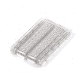

# 如何使用试验板

> 原文：<https://learn.sparkfun.com/tutorials/how-to-use-a-breadboard>

## 介绍

在学习如何构建电路时，试验板是最基础的部分之一。在本教程中，您将了解到什么是试验板，为什么称之为试验板，以及如何使用试验板。完成后，你应该对试验板的工作原理有一个基本的了解，并且能够在试验板上构建一个基本电路。

## 寻找适合你的船？

我们掩护你！

 

将**添加到您的[购物车](https://www.sparkfun.com/cart)中！**

 **### [【试验板-不干胶(白色)](https://www.sparkfun.com/products/12002)

[In stock](https://learn.sparkfun.com/static/bubbles/ "in stock") PRT-12002

这是你的尝试和真正的白色无焊试验板。它有 2 条电源总线，10 列，30 行，总共 400 个连接…

$5.5048[Favorited Favorite](# "Add to favorites") 93[Wish List](# "Add to wish list")**** 

将**添加到您的[购物车](https://www.sparkfun.com/cart)中！**

 **### 

[In stock](https://learn.sparkfun.com/static/bubbles/ "in stock") PRT-12615

**描述* *:这是您经过考验的真正全尺寸无焊试验板！它有 2 条分开的电源总线、10 列和 63 个…

$6.5031[Favorited Favorite](# "Add to favorites") 51[Wish List](# "Add to wish list")**** 

将**添加到您的[购物车](https://www.sparkfun.com/cart)中！**

 **### 

[In stock](https://learn.sparkfun.com/static/bubbles/ "in stock") PRT-12614

**描述* *:这是一块巨大的无焊试验板！它有 7 条电源总线，40 列，63 行，总共有 322 条…

$21.5026[Favorited Favorite](# "Add to favorites") 60[Wish List](# "Add to wish list")**** 

将**添加到您的[购物车](https://www.sparkfun.com/cart)中！**

 **### [试验板——经典](https://www.sparkfun.com/products/112)

[In stock](https://learn.sparkfun.com/static/bubbles/ "in stock") PRT-00112

你第一次接触电气工程-面包板。谁知道会带来这么大的挫败感？这是你的…

$10.9517[Favorited Favorite](# "Add to favorites") 28[Wish List](# "Add to wish list")**** 

将**添加到您的[购物车](https://www.sparkfun.com/cart)中！**

 **### [【试验板】半透明不干胶(透明)](https://www.sparkfun.com/products/9567)

[In stock](https://learn.sparkfun.com/static/bubbles/ "in stock") PRT-09567

**描述* *:有没有想过这些东西里面是什么？这块透明的面包板可能会启发。超越极限…

$5.5015[Favorited Favorite](# "Add to favorites") 37[Wish List](# "Add to wish list")**** 

将**添加到您的[购物车](https://www.sparkfun.com/cart)中！**

 **### [【试验板】半透明不干胶(红色)](https://www.sparkfun.com/products/11317)

[In stock](https://learn.sparkfun.com/static/bubbles/ "in stock") PRT-11317

**描述* *:任何人都无法在透明塑料试验板上进行改进。我是说，那很甜蜜，对吧？如果它是…

$5.501[Favorited Favorite](# "Add to favorites") 20[Wish List](# "Add to wish list")**** 

将**添加到您的[购物车](https://www.sparkfun.com/cart)中！**

 **### [【试验板-迷你模块化(黑色)](https://www.sparkfun.com/products/12047)

[In stock](https://learn.sparkfun.com/static/bubbles/ "in stock") PRT-12047

这个黑色的迷你试验板是你的小项目原型的好方法！有了 170 个并列点，就有足够的空间…

$4.50[Favorited Favorite](# "Add to favorites") 21[Wish List](# "Add to wish list")**** 

将**添加到您的[购物车](https://www.sparkfun.com/cart)中！**

 **### [【试验板-迷你模块化(红色)](https://www.sparkfun.com/products/12044)

[In stock](https://learn.sparkfun.com/static/bubbles/ "in stock") PRT-12044

这个红色迷你试验板是你的小项目原型的好方法！有了 170 个并列点，就有足够的空间来建立…

$4.50[Favorited Favorite](# "Add to favorites") 12[Wish List](# "Add to wish list")****************************[See all of our breadboard options](https://www.sparkfun.com/categories/302)************ ************* * *

### 推荐阅读

在了解试验板之前，您可能想了解一些教程和概念:

 [### 连接器基础](https://learn.sparkfun.com/tutorials/connector-basics) Connectors are a major source of confusion for people just beginning electronics. The number of different options, terms, and names of connectors can make selecting one, or finding the one you need, daunting. This article will help you get a jump on the world of connectors.[Favorited Favorite](# "Add to favorites") 62 [### 什么是电路？](https://learn.sparkfun.com/tutorials/what-is-a-circuit) Every electrical project starts with a circuit. Don't know what a circuit is? We're here to help.[Favorited Favorite](# "Add to favorites") 82 [### 电压、电流、电阻和欧姆定律](https://learn.sparkfun.com/tutorials/voltage-current-resistance-and-ohms-law) Learn about Ohm's Law, one of the most fundamental equations in all electrical engineering.[Favorited Favorite](# "Add to favorites") 132 [### 使用导线](https://learn.sparkfun.com/tutorials/working-with-wire) How to strip, crimp, and work with wire.[Favorited Favorite](# "Add to favorites") 50 [### 如何阅读原理图](https://learn.sparkfun.com/tutorials/how-to-read-a-schematic) An overview of component circuit symbols, and tips and tricks for better schematic reading. Click here, and become schematic-literate today 112 [### 如何使用万用表](https://learn.sparkfun.com/tutorials/how-to-use-a-multimeter) Learn the basics of using a multimeter to measure continuity, voltage, resistance and current.[Favorited Favorite](# "Add to favorites") 67

* * *

## 历史

如果你想在 20 世纪 60 年代之前建造一个电路，你可能会使用一种叫做[绕线](http://en.wikipedia.org/wiki/Wire_wrap)的技术。绕线是将电线绕在连接到[性能板](http://en.wikipedia.org/wiki/Perfboard)(又名[原板](https://www.sparkfun.com/products/8619))的导电柱上的过程。正如你所看到的，这个过程会很快变得相当复杂。尽管这种方法今天仍在使用，但有一样东西使原型制作变得容易得多，那就是试验板！

*A wire-wrap circuit (image courtesy of Wikipedia user Wikinaut)*

### 名称又能代表什么呢

当你在脑海中想象一块面包板时，你可能会想象一大块木头和一大块刚出炉的面包。你也不会差太远。

*Bread on a breadboard*

那么，为什么我们称这种电子“电路构建器”为试验板呢？许多年前，当电子产品又大又笨重时，人们会抓起最近的试验板、几个钉子或图钉，开始在板上连接电线，给自己一个构建电路的平台。

*Circuit on an "original" breadboard (image courtesy of [mischka](http://www.instructables.com/member/mischka/) and their awesome [literal breadboard tutorial](http://www.instructables.com/id/Use-a-real-Bread-Board-for-prototyping-your-circui/))*

从那以后，电子元件变得更小了，我们也想出了更好的方法来连接电路，让世界各地的人们都高兴地拿回了他们的试验板。然而，我们被这个令人困惑的名字困住了。从技术上讲，这些仍然是试验板，但这次讨论将在现代的“无焊”试验板上进行。

* * *

## 为什么要使用试验板？

电子试验板(与制作三明治的类型相反)实际上是指**无焊试验板**。这些都是制作临时电路和原型的好工具，而且完全不需要焊接。

**原型制作**是通过创建一个初步模型来测试一个想法的过程，从这个模型可以开发或复制其他形式，这是试验板最常见的用途之一。如果你不确定一个电路在一组给定的参数下会有什么反应，最好是建立一个原型并测试它。

对于刚接触电子和电路的人来说，试验板通常是最好的起点。这就是试验板的真正魅力所在——它们既可以容纳最简单的电路，也可以容纳非常复杂的电路。正如您将在本教程后面看到的，如果您的电路超出了当前的试验板，可以连接其他电路来适应各种尺寸和复杂性的电路。

试验板的另一个常见用途是测试新部件，如集成电路(IC)。当你试图弄清楚一个部件是如何工作的，并不断地重新布线时，你不想每次都要焊接你的连接。

如前所述，你并不总是希望你建立的电路是永久性的。当试图重现客户的问题时，SparkFun 的技术支持团队通常会使用试验板来构建、测试和分析电路。他们可以连接客户拥有的部件，一旦他们获得电路设置并找出问题，他们就可以将所有部件拆开并放在一边，以备下次需要进行故障排除时使用。

*A circuit built on a solderless breadboard*

* * *

## 实验板的解剖

*The major features of a Breadboard*

解释试验板工作原理的最佳方式是将其拆开，看看里面有什么。使用较小的试验板更容易看到它们是如何工作的。

### 端子板

这里我们有一个试验板，它的背胶已被移除。你可以在试验板的底部看到许多水平排列的金属条。

*A [SparkFun Mini Breadboard](https://www.sparkfun.com/products/11659) from the top (left) and the same breadboard flipped over with the adhesive back removed (right).*

金属排的顶部有隐藏在塑料孔下的小夹子。每个金属条和插座之间的标准间距为 0.1 英寸(2.54 毫米)。这些夹子允许你将电线或元件的脚插入试验板上暴露的孔中，然后将它固定住。

*A single strip of conductive metal removed from the above breadboard.*

一旦插入，该元件将与该行中放置的任何其他元件电连接。这是因为金属排是导电的，允许电流从金属条上的任何一点流出。

请注意，这条带子上只有五个片段。这在几乎所有试验板上都很典型。因此，试验板的一个特定部分最多只能连接五个元件。这排有十个孔，为什么只能连接五个元件？您还会注意到，在试验板的中间，每一水平行都被一个深谷或裂缝隔开。这个深谷将给定行的两侧彼此隔离，并且它们没有电连接。我们稍后将讨论这样做的目的，但是，现在，只需知道给定行的每一侧都与另一侧断开连接，在每一侧为组件留出五个位置。

*An [LED](https://learn.sparkfun.com/tutorials/light-emitting-diodes-leds) inserted into a breadboard. Notice how each leg of the LED is placed on either side of the ravine. This prevents the connections to the LED from being [shorted](https://learn.sparkfun.com/tutorials/what-is-a-circuit/short-and-open-circuits).*

### 电源轨

现在我们已经了解了试验板中的连接方式，让我们来看看一个更大、更典型的试验板。除了水平行，试验板通常有所谓的电源轨，沿侧面垂直延伸。

*A [medium-size breadboard](https://www.sparkfun.com/products/9567) with the adhesive back removed to expose the power rails.*

这些电源轨是与水平运行的电源轨相同的金属条，除了它们通常 [*](#power) 都是连接的。构建电路时，您往往会在许多不同的地方需要电源。电源轨让您可以在电路中任何需要的地方轻松获得电源。通常它们会贴上“+”和“-”的标签，并有红色和蓝色或黑色的条纹，以表示正反两面。

重要的是要知道，任何一边的电源轨都没有连接，所以如果你想在两边使用相同的电源，你需要用一些跳线连接两边。请记住，这些标记只是作为参考。没有规定说你必须把电源插到“+”轨，把地插到“-”轨，尽管保持一切井然有序是个好习惯。

*Two jumper [wires](https://learn.sparkfun.com/tutorials/working-with-wire/how-to-strip-a-wire) used to connect the power rails on both sides. Always attach the ‘+’ to ‘+’ and the ‘-’ to ‘-’.*

### 倾斜支架

前面我们提到了隔离试验板两侧的沟壑。这条峡谷有一个非常重要的用途。许多[集成电路](https://learn.sparkfun.com/tutorials/integrated-circuits)，通常被称为 IC，或者简称为芯片，是专门为安装在试验板上而制造的。为了最小化它们在试验板上占用的空间，它们采用了所谓的[双列直插封装](http://en.wikipedia.org/wiki/Dual_in-line_package)，或 DIP。

这些蘸薯条(萨尔萨任何人？)的腿从两边伸出来，完美地贴合在那个峡谷上。由于 IC 上的每个引脚都是唯一的，所以我们不希望两端相互连接。这就是棋盘中间的分隔派上了用场。因此，我们可以将元件连接到 IC 的每一侧，而不会影响另一侧引脚的功能。

*Two DIP ICs, the [LM358](https://www.sparkfun.com/products/9456) (top), a very common op-amp, and the ever-popular [ATmega328 microcontroller](https://www.sparkfun.com/products/9061) (bottom).*

### 行和列

你可能已经注意到，许多试验电路板在不同的行和列上都标有**数字**和**字母**。这些除了在构建电路时帮助指导您之外，没有任何其他用途。电路会很快变得复杂，只要一个元件的一条腿放错位置，整个电路就会发生故障或根本不工作。如果您知道您要连接的行号，将电线插入该编号比目测要简单得多。

这些在使用说明书时也很有帮助，比如在 [SparkFun Inventor's Kit](http://cdn.sparkfun.com/datasheets/Kits/SFE03-0012-SIK.Guide-300dpi-01.pdf) 中找到的那本。许多书籍和指南都有电路图，供您在构建电路时参考。请记住，您正在构建的电路不必与书中的电路位于试验板上完全相同的位置。事实上，它甚至不需要看起来相似。只要所有的电气连接都做好了，你就可以随心所欲地构建你的电路！

### 捆绑柱

一些试验板放在一个平台上，平台上有接线柱。这些接线柱允许您将各种不同的电源连接到试验板上。我们将在下一节的[中详细介绍这些内容。](https://learn.sparkfun.com/tutorials/how-to-use-a-breadboard/providing-power-to-a-breadboard)

|  |  |
| *香蕉线缆接线柱* | *经典试验板上的接线柱* |

### 其他功能

在构建电路时，你不能局限于一个试验板上。一些电路需要更多的空间。许多面包板在侧面有小块和槽，有些甚至在顶部和底部也有。这些允许你连接多个试验板在一起，形成最终的原型表面。

*Four SparkFun mini breadboards connected together.*

一些试验板也有背胶，你可以把它们粘在许多不同的表面上。如果您想将试验板安装在外壳或其他项目机箱的内部，这些功能会派上用场。

**Note:** Some larger breadboards will often isolate one half of the breadboard’s power rails form the other half (think top and bottom half, not the sides). This is convenient if you have two different voltages with which you need to power your circuit, such as 3.3V and 5V. However, if you’re unaware whether the power rails are or aren’t isolated, it can often lead to issues while building your circuit. It’s always a good idea to use a multimeter to check for the absence or presence of [continuity](https://learn.sparkfun.com/tutorials/how-to-use-a-multimeter/continuity) in your breadboard’s power rails.

* * *

## 向试验板供电

当涉及到为你的试验板供电时，有许多选择。

### 从其他电力来源借款

如果你正在使用一个开发板，比如 Arduino T1，那么你可以简单地从 Arduino 的母头获取能量。Arduino 有多个电源和接地引脚，您可以将它们连接到电源轨或试验板上的其他行。

*Connecting the Ground (GND) pin from an Arduino to a row on a mini breadboard. Now any leg or wire connected to that row will also be connected to Ground.*

Arduino 通常从电脑上的 USB 端口或外部电源获得电力，如[电池组](https://www.sparkfun.com/products/9835)或[壁式电源](https://www.sparkfun.com/products/8269)。

### 捆绑柱

如前所述，一些试验板有接线柱，允许您连接外部电源。

使用接线柱的第一步是用一些跳线将其连接到试验板。虽然看起来这些接线柱与试验板相连，但事实并非如此。如果是的话，你将被限制在你能提供电力和不能提供电力的地方。正如我们所看到的，试验板应该是完全可定制的，所以接线柱没有什么不同是有道理的。

这样，我们必须将电线连接到接线柱，以便将它们连接到试验板。为此，拧开接线柱，直到穿过接线柱的孔露出来。将跳线的[剥了皮的](https://learn.sparkfun.com/tutorials/working-with-wire/how-to-strip-a-wire)端滑入孔中，并拧紧接线柱，直到跳线连接牢固。

通常，您只需将接线柱的电源线和地线连接到试验板。如果需要备用电源，可以用第三根。

现在，您的接线柱已连接到试验板，但仍然没有电源。您可以使用许多不同的方法将电源连接到接线柱，从而连接到试验板。

### 台式电源

许多电子实验室都有[台式电源](https://www.sparkfun.com/products/9291)，可以为电路提供大范围的电压和电流。使用[香蕉连接器](https://learn.sparkfun.com/tutorials/connector-basics/temporary-connectors#banana)，您可以从电源向接线柱供电。

*A breadboard being powered through the binding posts from [banana cables](https://www.sparkfun.com/products/507).*

或者，您可以使用[鳄鱼夹](https://www.sparkfun.com/products/509)、 [IC 钩](https://www.sparkfun.com/products/506)或任何其他带有香蕉连接的电缆，将您的试验板连接到许多不同的电源。

使用接线柱的另一种方法是将[桶形插孔](https://learn.sparkfun.com/tutorials/connector-basics/power-connectors)焊接到一些电线上，然后将它们连接到接线柱上。这是一个更高级的技术，它需要一些中级焊接技能。

*The barrel jack is soldered to two wires that share the same holes on the binding posts as the wires going to the breadboard. If your breadboard doesn't have binding posts, you could just plug the wires from the barrel jack directly into the power rails.*

### 试验板电源

为试验板供电的另一种方法是使用多种试验板电源中的一种。SparkFun 携带了许多套件和电路板，你可以用它们直接给你的试验板充电。有些可以让你把一个[壁灯](https://www.sparkfun.com/products/8269)直接插到试验板上。其他的则允许你通过 USB 接口直接从电脑上获取电源。而且，几乎所有这些器件都具有调节电压的能力，为您提供构建电路时所需的全部常见电压。

*A SparkFun [USB Breadboard Power Supply](https://www.sparkfun.com/products/8376) that pulls power from your computer's USB and has the option to choose between 3.3V and 5V.*

* * *

## 构建您的第一个试验电路板电路

既然我们已经熟悉了试验板的内部结构以及如何为它们供电，那么我们该怎么做呢？我们将从一个简单的电路开始。

### 你需要什么

这是该电路的零件清单。如果你有其他电子零件，请随意使用它们并改变电路。请记住，通常有多种方法来构建任何给定的电路。有些甚至有几十种不同的方法来建造它们。************