# 按钮和开关基础知识

> 原文：<https://learn.sparkfun.com/tutorials/button-and-switch-basics>

## 介绍

开关是最基本也是最容易被忽视的电路元件之一。

[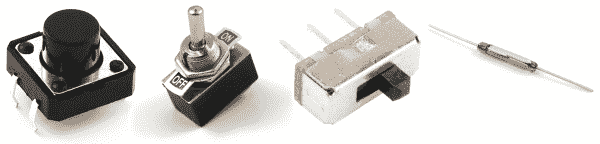](https://cdn.sparkfun.com/assets/c/5/d/3/d/517eb719ce395f8f17000000.png)

开关不需要任何花哨的方程来评估。他们所做的只是在开路和短路之间进行选择。简单。但是没有按钮和开关我们怎么生活呢！？没有用户输入的 blinky 电路有什么用？还是一个没有死亡开关的致命机器人？如果没有你永远不要按的红色大按钮，我们的世界会变成什么样？

### 本教程涵盖的内容

*   瞬时开关与维持开关
*   SPST、SPDT、DPDT 等做什么？都刻薄？
*   常闭按钮和常开按钮的区别
*   许多漂亮的按钮图片
*   重要的开关额定值
*   开关应用

### 推荐阅读

在深入本教程之前，请确保您已经掌握了最基本的电子知识。如果您不熟悉以下概念，请考虑先阅读他们的教程。然后回来，我们会有一些有趣的按钮谈话。

*   [什么是电路？](https://learn.sparkfun.com/tutorials/what-is-a-circuit)——特别要知道[开路和闭路](https://learn.sparkfun.com/tutorials/what-is-a-circuit/short-and-open-circuits)的区别
*   [电压、电流、电阻和欧姆定律](https://learn.sparkfun.com/tutorials/voltage-current-resistance-and-ohms-law)
*   [功率](https://learn.sparkfun.com/tutorials/electric-power)
*   [如何使用万用表](https://learn.sparkfun.com/tutorials/how-to-use-a-multimeter)
*   [二进制](https://learn.sparkfun.com/tutorials/binary)

## 希望探索不同的交换机？

我们掩护你！

[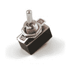](https://www.sparkfun.com/products/9276) 

将**添加到您的[购物车](https://www.sparkfun.com/cart)中！**

### [拨动开关](https://www.sparkfun.com/products/9276)

[In stock](https://learn.sparkfun.com/static/bubbles/ "in stock") COM-09276

这是一个重型 SPST 拨动开关-你的基本开关。额定电压为 2A 250 伏或 4A 125 伏。包括一个面板…

$2.104[Favorited Favorite](# "Add to favorites") 79[Wish List](# "Add to wish list")****[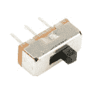](https://www.sparkfun.com/products/9609) 

将**添加到您的[购物车](https://www.sparkfun.com/cart)中！**

### [SPDT 滑动开关](https://www.sparkfun.com/products/9609)

[In stock](https://learn.sparkfun.com/static/bubbles/ "in stock") COM-09609

这是一个简单的 SPDT 滑动开关-非常适合用作开/关按钮，或者只是作为一个通用的控制开关。别针是 spa…

$0.95[Favorited Favorite](# "Add to favorites") 34[Wish List](# "Add to wish list")****[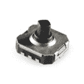](https://www.sparkfun.com/products/10063) 

将**添加到您的[购物车](https://www.sparkfun.com/cart)中！**

### [5 向触觉开关](https://www.sparkfun.com/products/10063)

[In stock](https://learn.sparkfun.com/static/bubbles/ "in stock") COM-10063

一个 5 路触觉开关允许在一个非常小的封装操纵杆一样的界面。这些都是表面贴装，但很容易出售…

$2.10[Favorited Favorite](# "Add to favorites") 32[Wish List](# "Add to wish list")****[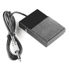](https://www.sparkfun.com/products/retired/11192) 

### [脚踏开关](https://www.sparkfun.com/products/retired/11192)

[Retired](https://learn.sparkfun.com/static/bubbles/ "Retired") COM-11192

用这个金属脚踏开关把踏板踩到底。这是同一种脚踏板，你可能会发现开关电源…

2 **Retired**[Favorited Favorite](# "Add to favorites") 20[Wish List](# "Add to wish list")************[See all buttons and switches](https://www.sparkfun.com/categories/145)

* * *******  ******## 什么是开关？

开关是控制电路断开或闭合的部件。它们允许对电路中的电流进行控制(无需实际进入电路并手动切割或拼接电线)。开关是任何需要用户交互或控制的电路中的关键元件。

开关只能处于两种状态之一:打开或关闭。在 **off** 状态下，开关看起来像电路中的开路。实际上，这看起来像一个**开路**，阻止电流流动。

在 **on** 状态下，开关就像一根完全导电的导线。一个短。这个**闭合电路**，开启系统并允许电流不受阻碍地流过系统的其余部分。

[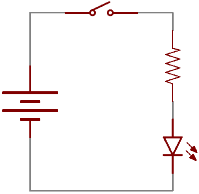](https://cdn.sparkfun.com/assets/1/5/1/f/5/517afd67ce395f2f49000003.gif)*A circuit diagram with an LED, resistor, and a switch. When the switch is closed, current flows and the LED can illuminate. Otherwise no current flows, and the LED receives no power.*

有成千上万的开关:拨动式、旋转式、直拨式、按钮式、摇杆式、薄膜式、...这个清单还在继续。每种类型的交换机都有一套独特的特征来区别于其他类型的交换机。诸如什么动作触发了开关，或者开关可以控制多少电路之类的特征。接下来，我们将了解一些更基本的开关特性。

## 定义特征

### 驱动方法

为了从一种状态改变到另一种状态，开关必须**启动**。也就是说，必须执行某种物理动作来“翻转”开关的状态。开关的启动方法是其更具定义性的特征之一。

[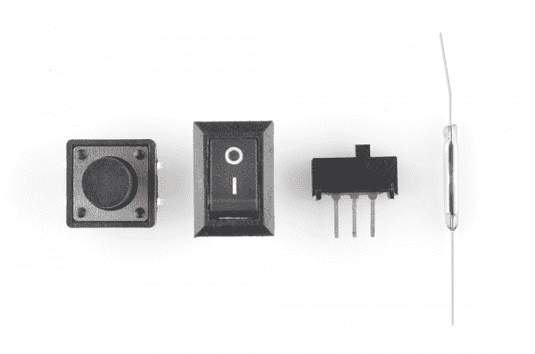](https://cdn.sparkfun.com/assets/2/6/5/7/e/5181896ece395fba47000000.jpg)*Some examples of switch types. [Push button](https://www.sparkfun.com/products/9190), [rocker](https://www.sparkfun.com/products/10727), [slide](https://www.sparkfun.com/products/9609), and [magnetic](https://www.sparkfun.com/products/8642).*

开关驱动可以来自推、滑、摇、转、扔、拉、转动钥匙、加热、磁化、踢、啪嗒、舔，...可能导致开关内部机械联动装置接触或脱离的任何物理相互作用。

### 瞬时与持续

所有开关都属于两个不同的类别之一:瞬时开关或保持开关。

**保持**开关——就像你墙上的灯开关——保持在一种状态，直到被激活进入一种新的状态，然后保持在那种状态，直到再次被激活。这些开关也可能被称为**拨动**或**开/关**开关。

**瞬时**开关只有在启动时才会保持激活状态。如果它们没有被启动，它们就保持在“关闭”状态。你可能有一个瞬间开关(或 50)就在你面前...键盘上的按键！

语义预警！我们称之为“按钮”的大多数开关都属于瞬时开关。激活一个按钮通常意味着以某种方式按下它，这只是*感觉*像一个瞬间控制。有一个[维护按钮](https://www.sparkfun.com/products/9808)，但是对于本教程当我们谈到“按钮”时，认为“瞬时下推开关”。

### 安装风格

与大多数元件一样，开关的端接方式总是归结为表面贴装(SMD)或通孔(PTH)。通孔开关通常尺寸较大。有些可能被设计成适合一个[试验板](https://learn.sparkfun.com/tutorials/how-to-use-a-breadboard)以便于原型制作。

[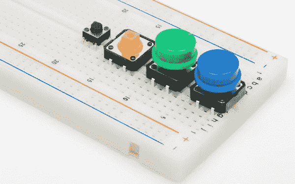](https://cdn.sparkfun.com/assets/d/7/f/d/b/517ebaf2ce395f1f18000002.jpg)*These [Tactile buttons](https://www.sparkfun.com/products/10302) are through-hole and fit perfectly in a breadboard. Great for prototyping!*

SMD 开关比 PTH 开关更小。它们平放在印刷电路板上。SMD 开关通常需要轻柔的触摸，它们不能像通孔开关那样承受很大的开关力。

[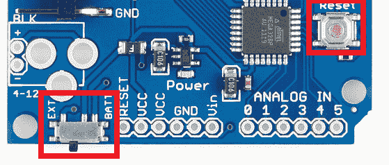](https://cdn.sparkfun.com/assets/e/c/a/0/5/517eba4ece395f2418000002.png)*The [Arduino Pro](https://www.sparkfun.com/products/10915) has two SMD switches: a [slide switch](https://www.sparkfun.com/products/10860) for power control, and a [push-button](https://www.sparkfun.com/products/8720) for reset control.*

面板安装开关——设计在外壳外面——也是一种流行的安装方式。当开关藏在外壳里时，很难扳动它。面板安装开关有各种终端类型:PTH、SMD 或用于焊接电线的重型焊片。

[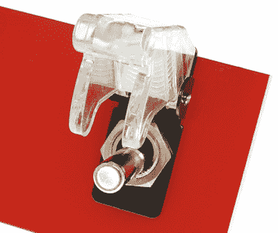](https://cdn.sparkfun.com/assets/e/6/b/6/e/517ec466ce395f246c000000.jpg)*A panel mounted [illuminated toggle switch](https://www.sparkfun.com/products/11314).*

* * *

另一个更重要的开关特性是开关的内部电路布置，它确实值得单独写一页。你在找 SPST 吗？DPST？4PDT？什么-什么-现在？

## 杆和投掷，开放和封闭

一个开关必须至少有两个端子，一个用于电流(可能)流入，另一个用于电流(可能)流出。不过，这只是描述了最简单的开关。通常，一个开关有两个以上的引脚。那么，所有这些终端如何与交换机的内部工作相匹配呢？这就是知道一个开关有多少个电极和多少个开关的关键所在。

开关上的**极** [*](#not-pulls) 的数量决定了开关可以控制多少个独立的电路。所以一个单极开关只能影响一个电路。一个四极开关可以分别控制四个不同的电路。

开关的**投掷**-计数定义了开关的每个电极可以连接到多少个位置。例如，如果一个开关有两个掷，开关中的每个电路(极)可以连接到两个端子中的一个。

知道了一个开关有多少个极和多少个投，就可以更具体的分类了。通常你会看到开关被定义为“单刀单掷”、“单刀双掷”、“双刀双掷”，它们通常分别缩写为 SPST、SPDT 和 DPDT。

#### SPST

单刀单掷( **SPST** )开关再简单不过了。它有一个输出和一个输入。开关要么闭合，要么完全断开。SPSTs 非常适合开关切换。它们也是一种非常常见的[瞬时](momentary-switches)开关。SPST 开关应该只需要**两个端子**。

[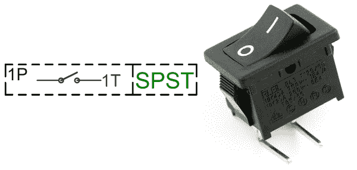](https://cdn.sparkfun.com/assets/6/d/9/2/e/517ed955ce395f471d000000.png)*The circuit symbol for an SPST switch in the off position and a [through-hole, right-angle, maintained, SPST, rocker switch](https://www.sparkfun.com/products/8837).*

#### SPDT

另一种常见的开关类型是 **SPDT** 。SPDTs 有三个端子:一个公共引脚和两个竞争连接到公共引脚的引脚。SPDTs 非常适合在两个电源之间进行选择、交换输入，或者处理两个电路试图到达一个地方的任何事情。大多数简单的滑动开关都是 SPDT 式的。SPDT 开关通常应该有**三个端子**。(旁注:在紧要关头，只要让其中一个开关断开，一个 SPDT 实际上可以变成一个 SPST)。

[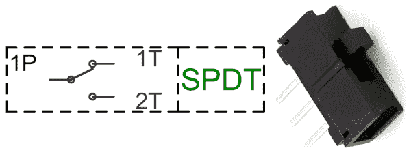](https://cdn.sparkfun.com/assets/2/7/c/c/c/517edaface395f581d000001.png)*An SPDT switch circuit symbol, and an [SPDT slide switch](https://www.sparkfun.com/products/102).*

#### DPDT

在 SPDT 上增加另一个极点就形成了一个双刀双掷( **DPDT** )开关。基本上是两个 SPDT 开关，它们可以控制两个独立的电路，但总是由一个执行器一起切换。DPDTs 应该有**六个端子**。

[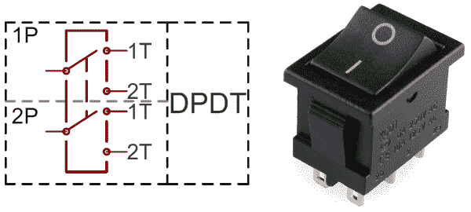](https://cdn.sparkfun.com/assets/6/e/d/9/0/517edbabce395fd51d000000.png)*A DPDT circuit symbol, and a 6-terminal [DPDT rocker switch](https://www.sparkfun.com/products/11139).*

#### XPYT

具有两个以上电极或开关的开关并不常见，但它们确实存在(尽管它们形状怪异，难以连接)。一旦我们越过了一两个极点/投掷点，我们就开始在缩写里粘上数字。例如，这里有一个 4PDT 开关，它可以控制四个独立的电路，每个电路有两个位置:

*A massive 4PDT circuit symbol, and an physically massive [4PDT toggle switch](https://www.sparkfun.com/products/11153).*

* * *

*只要记住:是“杠”，不是“拉”。经验丰富的工程师只是*喜欢*作弄那些只寻找“单拉双掷”开关的可怜笨蛋。(不是从经验或其他方面来说...我的意思是，在我的辩护中，我没有在书上读到过，只是听到教授含糊不清地念出来。卑鄙。)

### 常开/常闭

当瞬时开关未启动时，它处于“正常”状态。根据按钮的构造，其正常状态可以是开路或短路。当一个按钮打开直到被启动时，称为**常开**(缩写为*号*)。当你启动一个 NO 开关时，你就闭合了电路，这就是为什么这些开关也被称为“按压式”开关。

相反，如果一个按钮除非被启动，否则通常表现为短路，它被称为**常闭** ( *NC* )开关。数控开关为“一推即断”；启动开关会产生开路。

在这两种类型中，你可能更容易遇到常开瞬时开关。

## 瞬时开关

瞬时开关是指只有在被启动(按压、保持、磁化等)时才会保持接通状态的开关。).大多数情况下，瞬时开关最适用于间歇性用户输入的情况；重置或键盘按钮之类的东西。

### 瞬时开关的例子

#### 按钮

按钮开关是经典的瞬时开关。一般来说，当你按下这些开关时，它们会有很好的触觉反馈。它们有各种各样的味道:大的，小的，彩色的，发光的(当 LED 通过按钮发光时)。它们可能端接为通孔、表面安装甚至面板安装。

[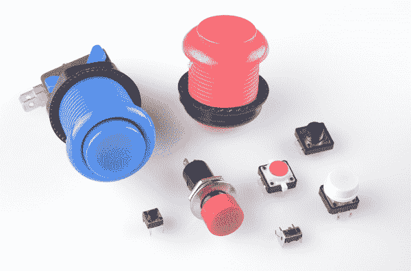](https://cdn.sparkfun.com/assets/b/6/1/a/0/518189efce395f1f45000000.jpg)*An assortment of tactile push-button switches. Starting top-left, clockwise: [blue](https://www.sparkfun.com/products/9337) and [pink](https://www.sparkfun.com/products/9177) arcade buttons, [12mm push button](https://www.sparkfun.com/products/9190), [white capped button](https://www.sparkfun.com/products/10302), [orange illuminated](https://www.sparkfun.com/products/10441), [right-angle](https://www.sparkfun.com/products/10791), [panel-mount](https://www.sparkfun.com/products/9807), and a [mini push button](https://www.sparkfun.com/products/97).*

#### 按钮矩阵

大型瞬时按钮阵列，如您的键盘或更小的分组，如小键盘，通常将其所有开关排列成一个大矩阵。面板上的每个按钮都被分配了一行和一列。这需要在微控制器端进行一些额外的按键处理，但却释放了一大块 I/O 引脚。

[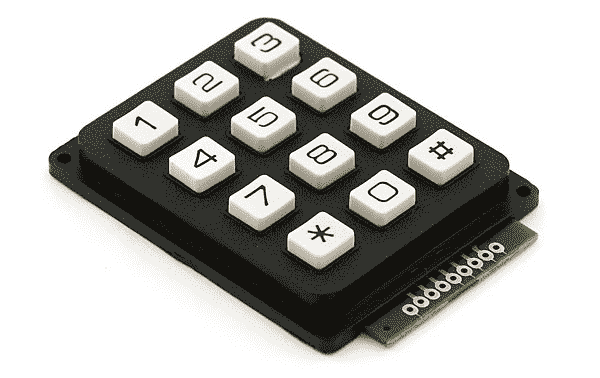](https://cdn.sparkfun.com/assets/6/9/4/d/c/517ee389ce395f1c1d000000.jpg)

#### 等等。

瞬时开关并不总是必须通过下推来启动。它可以是侧向推动，就像一把操纵杆的运动动作。

[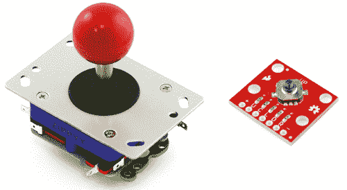](https://cdn.sparkfun.com/assets/a/2/f/9/8/5182a714ce395fed1d000000.png)*An [arcade joystick](https://www.sparkfun.com/products/9182) uses four [microswitches](https://www.sparkfun.com/products/9414) to sense up, down, left and right movements. The tiny little surface-mount [5-way tactile switch](https://www.sparkfun.com/products/11187) is an SP5T directional switch (up, down, left, right, and press-down).*

另一方面，当暴露在磁场中时，[簧片开关](https://www.sparkfun.com/products/8642)打开或关闭。这些对于制作非接触式开关非常有用。

[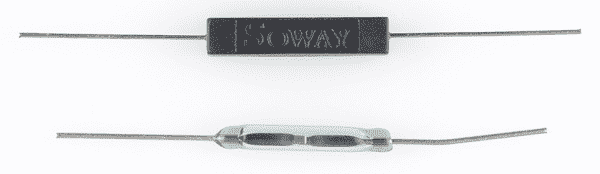](https://cdn.sparkfun.com/assets/a/2/0/d/7/51818ba1ce395fab44000000.jpg)*A couple of reed switches: [non-insulated](https://www.sparkfun.com/products/8642) (bottom) and [insulated](https://www.sparkfun.com/products/10601)*.

## 维护的开关

被维护的开关保持其状态，直到它被激活进入新的状态。只要看看最近的一面墙，就能找到一个被维护的开关的例子——控制你的灯的那个东西！维护型开关非常适合于“一劳永逸”的 it 应用，如打开和关闭电源。

### 维护开关的示例

#### 滑动开关

需要一个真正基本的、简洁的开关或选择器开关。滑动开关可能适合你！这些开关有一个从开关上突出来的小块，它可以滑过身体进入两个(或更多)位置中的一个。

你通常会在 SPDT 或 DPDT 配置中找到滑动开关。公共端子通常在中间，两个选择位置在外侧。

[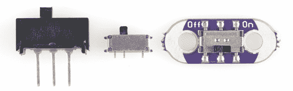](https://cdn.sparkfun.com/assets/a/1/e/f/b/5182bd5ece395fa91d000000.jpg)*Some examples of slide switches: a [mini PTH slide switch](https://www.sparkfun.com/products/102), an [SMD right-angle switch](https://www.sparkfun.com/products/10860), and an [SMD DPDT slide switch](https://www.sparkfun.com/products/597) mounted on a [LilyPad](https://www.sparkfun.com/products/9350).*

#### 拨动开关

当你听到拨动开关时，想想“发射泽导弹！”。拨动开关有一根长杆，它以摇摆的方式移动。当它们移动到一个新的位置时，拨动开关会发出令人满意的“咔嗒”声。

[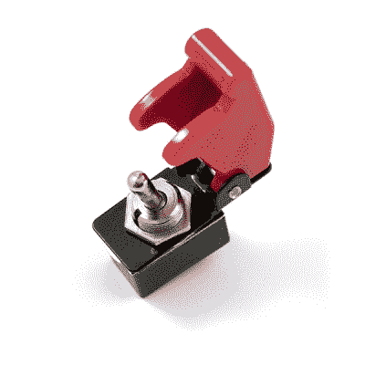](https://cdn.sparkfun.com/assets/a/2/0/9/e/517eee88ce395f521d000000.jpg)*[Missle-launch covers](https://www.sparkfun.com/products/9278) are a must when using [toggle switches](https://www.sparkfun.com/products/9276).*

拨动开关通常是 [SPST](https://www.sparkfun.com/products/9276) (两端子)或 SPDT(三端子)，尽管你也可以在[其他](https://www.sparkfun.com/products/11137) [口味](https://www.sparkfun.com/products/11153)中找到它们。通常，你可以在通孔、表面贴装或最常见的面板贴装中找到它们。

#### DIP 开关

DIP 开关是在与通孔 DIP IC 相同的模具中设计的通孔开关。它们可以放置在[试验板](https://learn.sparkfun.com/tutorials/how-to-use-a-breadboard)上，就像通孔 IC 一样，横跨中心区域。

[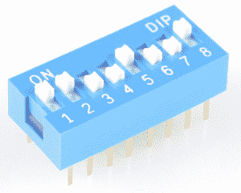](https://www.sparkfun.com/products/8034)*An [8-position DIP switch](https://www.sparkfun.com/products/8034), handy for configuring 8 somethings.*

这些开关通常由八个或更多独立的 SPST 开关组成，带有微小的滑动杠杆。它们在过去的计算时代被广泛使用，但对于通过硬件配置设备仍然很有用。

#### 闭锁按钮

按钮并不都是瞬间的。[一些按钮](https://www.sparkfun.com/products/9808)会锁定到位，保持它们的状态，直到再次按下锁定回到开始的位置。例如，这些可以在吉他效果踏板上的踏脚开关中找到。

[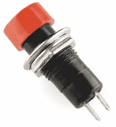](https://www.sparkfun.com/products/9808)

#### 等等。

我们几乎还没有开始讨论现有的种类繁多的可维护交换机。还有[拉链头开关](https://www.sparkfun.com/products/11136)，它给你的项目增添了一份真正优雅的格调。[按键开关](https://www.sparkfun.com/products/14947)，当你不想让任何人打开你的杀人机器人时。[旋转开关](https://www.sparkfun.com/products/10064)——就像万用表上的那些——提供了一个独特的输入设备，尤其是当你需要大量投掷的时候。

[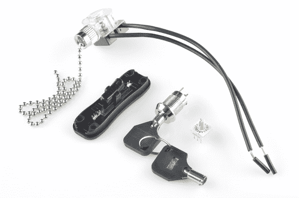](https://cdn.sparkfun.com/assets/0/9/3/8/1/5182bf0ece395f7420000001.jpg)

当然，哪个疯狂的科学家能没有一个大的闸刀开关而生存？

## 开关应用

### 开/关控制

开关应用中最明显的是简单的开和关控制。每次你走进一个黑暗的房间时，你所执行的控制类型。通过简单地将 SPST **开关与电源线串联**就可以实现开/关开关。通常会保留开/关开关，如拨动开关或滑动开关，但瞬时开/关开关也有其用途。

[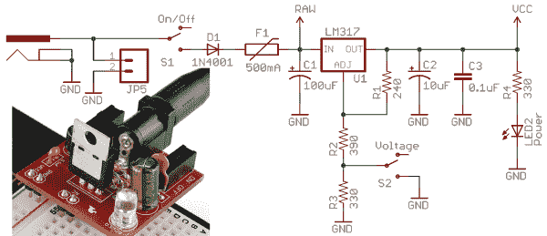](https://cdn.sparkfun.com/assets/6/5/f/1/0/5182b590ce395f7b1d000000.png)*On this [Breadboard Power Supply](https://www.sparkfun.com/products/114), an SPDT switch is used to turn the circuit on and off. (A second SPDT switch is used to select the adjustable voltage regulator's output value by adjusting a [voltage divider](https://learn.sparkfun.com/tutorials/voltage-dividers).)*

当实现这样的开关时，请记住，您的项目消耗的所有电流都将通过该开关。理想情况下，开关是完美的导体，但实际上它的两个触点之间有少量电阻。由于该电阻，所有开关都被额定为它们能够承受的最大电流量。超过一个开关的最大电流额定值，你会看到熔化的塑料和魔法烟。

例如，这个 [SPDT 滑动开关](https://www.sparkfun.com/products/102)非常适合控制小项目中的电流(如[西蒙斯](https://www.sparkfun.com/products/9276)或[节拍器](https://www.sparkfun.com/products/9236))，但不要试图用它来控制结实的电机控制器或 100 个 led 灯串。为此，考虑使用类似于 [4A 拨动开关](https://www.sparkfun.com/products/9276)或 [6A 灯开关](https://www.sparkfun.com/products/11477)的东西。

### 用户输入

当然，用户输入是开关更常见的应用之一。例如，如果您想将一个开关连接到微控制器的输入引脚，只需一个这样的简单电路:

当开关断开时，MCU 引脚通过电阻连接到 5V。当开关闭合时，引脚直接连接到 GND。该电路中的电阻是一个[上拉电阻](https://learn.sparkfun.com/tutorials/pull-up-resistors)，用于将输入偏置为高电平，并在开关闭合时防止对地短路。

## 资源和更进一步

好了，这大概涵盖了开关的基本知识。接下来，您可以探索其他一些概念性教程:

*   [上拉电阻](https://learn.sparkfun.com/tutorials/pull-up-resistors) -上拉电阻是大多数瞬时按钮电路的补充。它们确保电源和接地不会短路，并确保 I/O 线不会悬空。
*   晶体管 -这些可以被用作电子控制开关。
*   继电器-另一种电子控制开关。非常适合开关大功率电路。
*   加速度计基础知识 -运动感应加速度计-就像大多数智能手机和新的视频游戏控制器中的加速度计一样-正在快速取代这些无聊的开关作为人类输入设备。
*   [如何为项目供电](https://learn.sparkfun.com/tutorials/how-to-power-a-project) -你的开关将开启和关闭哪种电源？

或者查看我们的一些项目教程，为您自己的项目寻找一些灵感。开关是如此广泛地被使用，我们可能会链接我们所有的项目。但是这里有几个非常巧妙的利用开关来做他们的事情:

*   [MP3 播放器屏蔽音乐盒](https://learn.sparkfun.com/tutorials/mp3-player-shield-music-box)——这个项目(内部更大)使用了一种非传统的开关——簧片开关——来触发它的动作。
*   [不确定的 7 立方](https://learn.sparkfun.com/tutorials/the-uncertain-7-cube) -嗯，这个项目实际上没有任何开关，但这就是它如此特别的原因！这个项目是加速度计如何取代开关作为输入设备的一个很好的例子。
*   [反应计时器](https://learn.sparkfun.com/tutorials/reaction-timer) -使用巨大的圆顶按钮来创建一个有趣的反应游戏。

 [### MP3 播放器屏蔽音乐盒](https://learn.sparkfun.com/tutorials/mp3-player-shield-music-box) Music Box Project based on the Dr. Who TARDIS.[Favorited Favorite](# "Add to favorites") 8 [### 不确定的 7 立方](https://learn.sparkfun.com/tutorials/the-uncertain-7-cube) The Uncertain 7-Cube is a non-committal, less-than-helpful, but also entirely honest fortune teller. Simply ask it a yes or no question, give it a nudge, and the 7-Cube will dutifully inform you that it doesn’t have all the facts and doesn’t feel comfortable making a guess.[Favorited Favorite](# "Add to favorites") 3 [### 反应速度测量器](https://learn.sparkfun.com/tutorials/reaction-timer) Demonstrate mental chronometry with this simple reaction timer 11

或者看看这篇博文，了解更多想法。

 [### 机器人格斗场控制系统的设计

July 9, 2015](https://www.sparkfun.com/news/1874 "July 9, 2015: This post highlights my method of creating the control system for our AVC battle arena.")[Favorited Favorite](# "Add to favorites") 1 [### 让我们“电气化”一个韩国桌游

June 19, 2019](https://www.sparkfun.com/news/2947 "June 19, 2019: Today we take a look into creating a version of the classic Korean board game, Yut Nori, into an electronic format.")[Favorited Favorite](# "Add to favorites") 1******