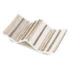
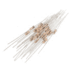
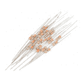
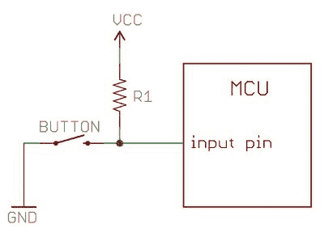

# 电阻

> 原文：<https://learn.sparkfun.com/tutorials/resistors>

## 采取一种立场，抵制的立场

电阻器-最普遍的电子元件。它们几乎是每个电路中的关键部分。它们在我们最喜欢的方程式中扮演着重要的角色，欧姆定律。

在本期节目中，我们将介绍:

*   什么是电阻器？！
*   电阻器装置
*   电阻器电路符号
*   串联和并联电阻
*   电阻的不同变化
*   彩色编码解码
*   表面贴装电阻解码
*   电阻应用示例

### 考虑读书...

本教程中的一些概念建立在以前的电子学知识之上。在进入本教程之前，考虑先阅读(至少略读)以下内容:

*   [什么是电？](https://learn.sparkfun.com/tutorials/what-is-electricity)
*   [电压、电流、电阻和欧姆定律](https://learn.sparkfun.com/tutorials/voltage-current-resistance-and-ohms-law)
*   [什么是电路](https://learn.sparkfun.com/tutorials/what-is-a-circuit)
*   [串联与并联电路](https://learn.sparkfun.com/tutorials/series-and-parallel-circuits)
*   [如何使用万用表](https://learn.sparkfun.com/tutorials/how-to-use-a-multimeter/) -具体查看[测量电阻](https://learn.sparkfun.com/tutorials/how-to-use-a-multimeter/measuring-resistance)部分。
*   [公制前缀](https://learn.sparkfun.com/tutorials/metric-prefixes-and-si-units)

* * *

## 想亲身体验电阻吗？

我们掩护你！

 

将**添加到您的[购物车](https://www.sparkfun.com/cart)中！**

 **### [【电阻器套件- 1/4W(共 500)](https://www.sparkfun.com/products/10969)

[Out of stock](https://learn.sparkfun.com/static/bubbles/ "out of stock") COM-10969

电阻是个好东西，事实上，在许多电路设计中，电阻是至关重要的。唯一的问题似乎是…

$8.95180[Favorited Favorite](# "Add to favorites") 185[Wish List](# "Add to wish list")**** 

将**添加到您的[购物车](https://www.sparkfun.com/cart)中！**

 **### [电阻器 10K 欧姆 1/4 瓦 PTH - 20 包(粗引线)](https://www.sparkfun.com/products/14491)

[In stock](https://learn.sparkfun.com/static/bubbles/ "in stock") PRT-14491

这些是普通的 1/4 瓦、+/- 5%容差 PTH 电阻。通常用于试验板和其他原型制作…

$1.25[Favorited Favorite](# "Add to favorites") 12[Wish List](# "Add to wish list")**** 

将**添加到您的[购物车](https://www.sparkfun.com/cart)中！**

 **### [电阻器 330 欧姆 1/4 瓦 PTH - 20 包(粗引线)](https://www.sparkfun.com/products/14490)

[In stock](https://learn.sparkfun.com/static/bubbles/ "in stock") PRT-14490

这些是普通的 1/4 瓦、+/- 5%容差 PTH 电阻。通常用于试验板和其他原型制作…

$1.05[Favorited Favorite](# "Add to favorites") 10[Wish List](# "Add to wish list")**** 

将**添加到您的[购物车](https://www.sparkfun.com/cart)中！**

 **### [电源电阻套件- 10W (25 个装)](https://www.sparkfun.com/products/13053)

[In stock](https://learn.sparkfun.com/static/bubbles/ "in stock") KIT-13053

神圣的瓦特，蝙蝠侠！这款电源电阻套件包含 5 种不同的 10 瓦电阻值，包括 1 欧姆、2 欧姆…

$6.502[Favorited Favorite](# "Add to favorites") 16[Wish List](# "Add to wish list")****************[See all resistors](https://www.sparkfun.com/categories/324)******** ********&nbsp

&nbsp

## 电阻器基础知识

电阻器是电子元件，具有特定的、永不改变的电阻。电阻器的电阻**限制了通过电路的电子流**。

它们是**被动**组件，意味着它们只消耗能量(而不能产生能量)。电阻器通常被添加到电路中，它们补充了**有源**元件，如运算放大器、微控制器和其他[集成电路](https://learn.sparkfun.com/tutorials/integrated-circuits)。通常电阻器用于限制电流，[分压](https://learn.sparkfun.com/tutorials/voltage-dividers)，以及[上拉 I/O 线](https://learn.sparkfun.com/tutorials/pull-up-resistors)。

## 电阻器装置

电阻器的电阻以**欧姆**为单位测量。欧姆的符号是希腊文的大写字母ω:&ohm；。1 &欧姆的(有点迂回的)定义；是两点之间的电阻，在该点上，1 伏特(1V)的外加势能产生 1 安培(1A)的电流。

随着国际单位制的发展，更大或更小的欧姆值可以与前缀匹配，如千、兆或吉，以使大值更容易读取。看到千欧(k &欧姆的电阻是很常见的；)和兆欧(M &欧姆；)范围(很少见到毫欧(m &欧姆；)电阻)。比如一个 4700&欧姆；电阻相当于一个 4.7k &欧姆；电阻器，和一个 5，600，000 &欧姆；电阻可以写成 5600k&欧姆；或者(更常见的为)5.6M &欧姆；。

## 示意图符号

所有电阻器都有**两个端子**，电阻器两端各有一个连接。在原理图上建模时，电阻器将显示为以下两个符号之一:

*Two common resistor schematic symbols. R1 is an American-style 1k&ohm; resistor, and R2 is an international-style 47k&ohm; resistor.*

电阻器的端子是从波形曲线(或矩形)延伸的每条线。这些是连接电路其余部分的东西。

电阻器电路符号通常会同时使用电阻值和名称进行增强。该值以欧姆为单位显示，显然对于评估和实际构建电路至关重要。电阻器的名称通常是数字前面的一个 *R* 。电路中的每个电阻都应该有一个唯一的名称/编号。例如，下面是 555 定时器电路中的几个电阻:

*In this circuit, resistors play a key role in setting the frequency of the 555 timer's output. Another resistor (R3) limits the current through an LED.*

* * *

## 电阻器的类型

电阻器有多种形状和尺寸。它们可以是通孔或表面安装的。它们可能是标准的静态电阻、一组电阻或特殊的可变电阻。

## 端接和安装

电阻有两种终端类型:通孔或表面贴装。这些类型的电阻通常缩写为 PTH(电镀通孔)或 SMD/SMT(表面贴装技术或器件)。

**通孔**电阻器带有长而柔韧的引线，可以插入[试验板](https://learn.sparkfun.com/tutorials/how-to-use-a-breadboard)或手工焊接到原型板或[印刷电路板(PCB)](https://learn.sparkfun.com/tutorials/pcb-basics) 。这些电阻通常更适用于试验板、原型制作，或者任何不想焊接 0.6 毫米长的 SMD 电阻的情况。长引线通常需要调整，这些电阻必然比表贴电阻占用更多空间。

最常见的通孔电阻采用轴向封装。轴向电阻的大小与其额定功率有关。一个普通的欧姆电阻大约 9.2 毫米宽，而一个更小的欧姆电阻大约 6.3 毫米长。

*A half-watt (½W) resistor (above) sized up to a quarter-watt (¼W).*

表面贴装电阻通常是微小的黑色矩形，两端带有更小的闪亮银色导电边缘。这些电阻旨在位于 PCB 顶部，焊接在配套的焊盘上。因为这些电阻非常小，所以它们通常由一个[机器人](https://learn.sparkfun.com/tutorials/electronics-assembly/pick-and-place)放置到位，并被送进一个烤箱，在那里焊料熔化并固定它们。

*A tiny 0603 330&ohm; resistor hovering over shiny George Washington's nose on top of a [U.S. quarter](http://en.wikipedia.org/wiki/Quarter_(United_States_coin).*

SMD 电阻有标准尺寸；通常是 0805 (0.08 英寸长 0.05 英寸宽)、0603 或 0402。它们非常适合大规模电路板生产，或者在空间非常宝贵的设计中。他们需要一只稳定、精确的手来手工焊接。

## 电阻器成分

电阻器可以由多种材料制成。最常见的是，现代电阻器由碳、金属或金属氧化物薄膜制成。在这些电阻器中，一层导电材料薄膜(尽管仍是电阻性的)被绝缘材料螺旋包裹并覆盖。大多数标准的、无装饰的通孔电阻将由碳膜或金属膜构成。

*Peek inside the guts of a few carbon-film resistors. Resistance values from top to bottom: 27&ohm;, 330&ohm; and a 3.3M&ohm;. Inside the resistor, a carbon film is wrapped around an insulator. More wraps means a higher resistance. Pretty neat!*

其他通孔电阻器可以是线绕的或者由超薄金属箔制成。这些电阻通常是更昂贵的高端元件，因为它们具有独特的特性，如更高的额定功率或最大温度范围。

表面贴装电阻通常是厚的或薄膜的。厚膜通常更便宜，但不如薄膜精确。在这两种类型的电阻器中，电阻金属合金薄膜夹在陶瓷基底和玻璃/环氧树脂涂层之间，然后连接到终端导电边缘。

## 特殊电阻封装

还有各种其它专用电阻。电阻可能是预布线的五个左右的电阻阵列。这些阵列中的电阻可以共用一个引脚，或者设置为分压器。

*An array of five 330&ohm; resistors, all tied together at one end.*

## 可变电阻器(即电位计)

电阻也不一定是静态的。可变电阻器，被称为**变阻器**，是可以在特定值范围内调节的电阻器。与变阻器类似的是**电位器**。Pots 在内部串联连接两个电阻，并调节它们之间的中间抽头，形成一个可调的[分压器](https://learn.sparkfun.com/tutorials/voltage-dividers)。这些可变电阻通常用于输入，如音量旋钮，需要可调。

*A smattering of potentiometers. From top-left, clockwise: [a standard 10k trimpot](https://www.sparkfun.com/products/9288), [2-axis joystick](https://www.sparkfun.com/products/9032), [softpot](https://www.sparkfun.com/products/9074), [slide pot](https://www.sparkfun.com/products/11620), [classic right-angle](https://www.sparkfun.com/products/9939), and a [breadboard friendly 10k trimpot](https://www.sparkfun.com/products/9806).*

* * *

## 解码电阻标记

虽然它们可能不会直接显示其值，但大多数电阻器都有标记，以显示其电阻值。PTH 电阻使用颜色编码系统(这确实为电路增添了一些特色)，SMD 电阻有自己的值标记系统。

## 解码色带

通孔、轴向电阻器通常使用色带系统来显示它们的值。这些电阻中的大多数都有四个颜色带环绕在电阻周围，但也有五个和六个颜色带的电阻。

### 四波段电阻

在标准四带电阻中，前两个带表示电阻值的两个最高有效数字。第三个带是一个权重值，**将两个有效数字乘以 10 的幂。**

最后一个带表示电阻的**容差**。容差解释了电阻器的*实际*电阻与其标称值相比的多少。没有完美的电阻，不同的制造工艺会导致更好或更差的容差。比如一个 1k 的&欧姆；具有 5%容差的电阻器实际上可以是 0.95k &欧姆之间的任何值；以及 1.05k &欧姆；。

你怎么知道哪个乐队是第一个和最后一个？最后，公差带通常与价值带明显分开，通常是银或金。

### 五波段和六波段电阻

五带电阻在前两个带和**乘法器带**之间有第三个有效数字带。五频段电阻还具有更宽的容差范围。

六带电阻基本上是五带电阻，末端有一个额外的带，用于指示温度系数。这表示当温度以摄氏度为单位变化时，电阻值的预期变化。一般来说，这些温度系数值非常小，在 ppm 范围内。

### 解码电阻色带

解码电阻色带时，请查阅如下电阻颜色代码表。对于前两个波段，找到该颜色对应的数字值。此处所示的 4.7k &ohm;电阻器开始时有黄色和紫色色带，其数字值为 4 和 7 (47)。4.7k &欧姆的第三波段；是红色的，表示 47 要乘以 10 ² (或者 100)。47 乘以 100 就是 4700！

*4.7k&ohm; resistor with four color bands*

如果你想记住色带代码，一个记忆装置可能会有帮助。有一些(有时令人生厌)助记符可以帮助记住电阻颜色代码。一个很好的例子，说明了 *b* lack 和 *b* rown 的区别是:

"**B**ig **b**rown **r**abbits **o**ften **y**ield **g**reat **b**ig **v**ocal **g**roans **w**hen **g**ingerly **s**napped."

或者，如果你记得“罗伊·g·BIV”，减去*靛蓝*(可怜的靛蓝，没人记得靛蓝)，在经典彩虹色序的前面加上黑色和棕色，后面加上灰色和白色。

### 电阻器颜色代码表

*Having trouble seeing? Click the image for a better view!*

### 电阻色码计算器

如果你宁愿跳过数学(我们不会评判！)，只需使用一个方便的计算器，尝试其中一个！

#### 四波段电阻

| 波段 1 | 波段 2 | 波段 3 |  | 四级 |
| 值 1 (MSV) | 价值 2 | 重量 |  | 容忍 |
 <select name="band1" value="1" onchange="calcFourResistance(this)" style="width: 150px; color: white; background: #583030;"><option value="0" style="color: white; background: black;">【黑色(0)</option> <option value="1" style="color: white; background: #583030;" selected="selected">棕色(1)</option> <option value="2" style="color: white; background: red;">红色(2)</option> <option value="3" style="color: black; background: orange;">橙色(3)</option> <option value="4" style="color: black; background: yellow;">黄色(4)</option> <option value="5" style="color: white; background: green;">绿色(5)</option> <option value="6" style="color: white; background: blue;">蓝色(6)</option> <option value="7" style="color: white; background: purple;">紫色(7)</option> <option value="8" style="color: white; background: gray;">灰色(8)</option> <option value="9" style="color: black; background: white;">白色(9)</option></select> | <select name="band2" value="0" onchange="calcFourResistance(this)" style="width: 150px; color: white; background: black;"><option value="0" style="color: white; background: black;" selected="selected">【黑色(0)</option> <option value="1" style="color: white; background: #583030;">棕色(1)</option> <option value="2" style="color: white; background: red;">红色(2)</option> <option value="3" style="color: black; background: orange;">橙色(3)</option> <option value="4" style="color: black; background: yellow;">黄色(4)</option> <option value="5" style="color: white; background: green;">绿色(5)</option> <option value="6" style="color: white; background: blue;">蓝色(6)</option> <option value="7" style="color: white; background: purple;">紫色(7)</option> <option value="8" style="color: white; background: gray;">灰色(8)</option> <option value="9" style="color: black; background: white;">白色(9)</option></select> | <select name="band3" value="2" onchange="calcFourResistance(this)" style="width: 150px; color: white; background: red;"><option value="0" style="color: white; background: black;" selected="selected">黑色(1)</option> <option value="1" style="color: white; background: #583030;">棕色(10)</option> <option value="2" style="color: white; background: red;" selected="selected">红色(100)</option> <option value="3" style="color: black; background: orange;">橙色(1k)</option> <option value="4" style="color: black; background: yellow;">黄色(10k)</option> <option value="5" style="color: white; background: green;">绿色(100k)</option> <option value="6" style="color: white; background: blue;">蓝色(1M)</option> <option value="7" style="color: white; background: purple;">紫色(10M)</option> <option value="8" style="color: white; background: gray;">灰色(100M)</option> <option value="9" style="color: black; background: white;">白色(1G)</option></select> |     | <select name="band4" value="0" onchange="calcFourResistance(this)" style="width: 150px; color: black; background: gold; size:5;"><option value="10" style="color: black; background: gold;">【黄金 5%】</option><option value="11" style="color: black; background: silver;">【白银 10%】</option></select> |

 ### 电阻: <text id="resistorValue">1 k &欧姆；5%</text>  #### 五波段和六波段电阻

**Note:** Calculate your six band resistor here, but be sure to append the temperature coefficient to the final value of the resistor.

| 波段 1 | 波段 2 | 波段 3 | 四级 |  | 第五波段 |
| 值 1 (MSV) | 价值 2 | 价值 3 | 重量 |  | 容忍 |
 <select name="bandFive1" value="1" onchange="calcFiveResistance(this)" style="width: 125px; color: white; background: #583030;"><option value="0" style="color: white; background: black;">【黑色(0)</option> <option value="1" style="color: white; background: #583030;" selected="selected">棕色(1)</option> <option value="2" style="color: white; background: red;">红色(2)</option> <option value="3" style="color: black; background: orange;">橙色(3)</option> <option value="4" style="color: black; background: yellow;">黄色(4)</option> <option value="5" style="color: white; background: green;">绿色(5)</option> <option value="6" style="color: white; background: blue;">蓝色(6)</option> <option value="7" style="color: white; background: purple;">紫色(7)</option> <option value="8" style="color: white; background: gray;">灰色(8)</option> <option value="9" style="color: black; background: white;">白色(9)</option></select> | <select name="bandFive2" value="0" onchange="calcFiveResistance(this)" style="width: 125px; color: white; background: black;"><option value="0" style="color: white; background: black;" selected="selected">【黑色(0)</option> <option value="1" style="color: white; background: #583030;">棕色(1)</option> <option value="2" style="color: white; background: red;">红色(2)</option> <option value="3" style="color: black; background: orange;">橙色(3)</option> <option value="4" style="color: black; background: yellow;">黄色(4)</option> <option value="5" style="color: white; background: green;">绿色(5)</option> <option value="6" style="color: white; background: blue;">蓝色(6)</option> <option value="7" style="color: white; background: purple;">紫色(7)</option> <option value="8" style="color: white; background: gray;">灰色(8)</option> <option value="9" style="color: black; background: white;">白色(9)</option></select> | <select name="bandFive3" value="3" onchange="calcFiveResistance(this)" style="width: 125px; color: white; background: black;"><option value="0" style="color: white; background: black;" selected="selected">【黑色(0)</option> <option value="1" style="color: white; background: #583030;">棕色(1)</option> <option value="2" style="color: white; background: red;">红色(2)</option> <option value="3" style="color: black; background: orange;">橙色(3)</option> <option value="4" style="color: black; background: yellow;">黄色(4)</option> <option value="5" style="color: white; background: green;">绿色(5)</option> <option value="6" style="color: white; background: blue;">蓝色(6)</option> <option value="7" style="color: white; background: purple;">紫色(7)</option> <option value="8" style="color: white; background: gray;">灰色(8)</option> <option value="9" style="color: black; background: white;">白色(9)</option></select> | <select name="bandFive4" value="2" onchange="calcFiveResistance(this)" style="width: 125px; color: white; background: red;"><option value="0" style="color: white; background: black;" selected="selected">黑色(1)</option> <option value="1" style="color: white; background: #583030;">棕色(10)</option> <option value="2" style="color: white; background: red;" selected="selected">红色(100)</option> <option value="3" style="color: black; background: orange;">橙色(1k)</option> <option value="4" style="color: black; background: yellow;">黄色(10k)</option> <option value="5" style="color: white; background: green;">绿色(100k)</option> <option value="6" style="color: white; background: blue;">蓝色(1M)</option> <option value="7" style="color: white; background: purple;">紫色(10M)</option> <option value="8" style="color: white; background: gray;">灰色(100M)</option> <option value="9" style="color: black; background: white;">白色(1G)</option></select> |     | <select name="bandFive5" value="10" onchange="calcFiveResistance(this)" style="width: 125px; color: black; background: gold; size:5;"><option value="10" style="color: black; background: gold;">金色(5%)</option> <option value="11" style="color: black; background: silver;">银色(10%)</option> <option value="1" style="color: white; background: #583030;">棕色(1%)</option> <option value="2" style="color: white; background: red;">红色(2%)</option> <option value="5" style="color: white; background: green;">绿色(0.5%)</option> <option value="6" style="color: white; background: blue;">蓝色(0.25%)</option> <option value="7" style="color: white; background: purple;">紫色(0.1%)</option> <option value="8" style="color: white; background: gray;">灰色(0.05%)</option></select> |

 ### 电阻: <text id="resistorFiveValue">1 k &欧姆；5%</text>  ## 解码表面贴装标记

SMD 电阻，如 0603 或 0805 封装的电阻，有自己的显示方式。这些电阻有几种常见的标记方法。它们通常会有三到四个字符——数字或字母——印在盒子上面。

如果你看到的三个字符都是*数字*，你可能看到的是一个 **E24** 标记的电阻。这些标记实际上与 PTH 电阻器上使用的色带系统有一些相似之处。前两个数字代表数值的前两个最高有效数字，最后一个数字代表数值。

在上面的示例图中，电阻被标记为 *104* 、 *105* 、 *205* 、 *751* 和 *754* 。标有 *104* 的电阻应为 100k &欧姆；(10x10 ⁴ )， *105* 将是 1M &欧姆；(10x10 ⁵ ),而 *205* 是 2M &欧姆；(20x10 ⁵ )。 *751* 为 750 &欧姆；(75x10 ¹ )，而 *754* 为 750k &欧姆；(75x10 ⁴ )。

另一个常见的编码系统是 **E96** ，它是所有编码系统中最神秘的。E96 电阻器将标有三个字符-开头两个数字，结尾一个字母。这两个数字告诉你值的前三个位*，对应于这个查找表中一个不太明显的值。*

| 密码 | 价值 | 
 | 密码 | 价值 | 
 | 密码 | 价值 | 
 | 密码 | 价值 | 
 | 密码 | 价值 | 
 | 密码 | 价值 |
| 01 | One hundred | 
 | Seventeen | One hundred and forty-seven | 
 | Thirty-three | Two hundred and fifteen | 
 | forty-nine | Three hundred and sixteen | 
 | Sixty-five | Four hundred and sixty-four | 
 | Eighty-one | Six hundred and eighty-one |
| 02 | One hundred and two | 
 | Eighteen | One hundred and fifty | 
 | Thirty-four | Two hundred and twenty-one | 
 | Fifty | Three hundred and twenty-four | 
 | Sixty-six | Four hundred and seventy-five | 
 | Eighty-two | Six hundred and ninety-eight |
| 03 | One hundred and five | 
 | Nineteen | One hundred and fifty-four | 
 | Thirty-five | Two hundred and twenty-six | 
 | Fifty-one | Three hundred and thirty-two | 
 | Sixty-seven | Four hundred and eighty-seven | 
 | Eighty-three | Seven hundred and fifteen |
| 04 | One hundred and seven | 
 | Twenty | One hundred and fifty-eight | 
 | Thirty-six | Two hundred and thirty-two | 
 | fifty-two | Three hundred and forty | 
 | sixty-eight | Four hundred and ninety-nine | 
 | Eighty-four | Seven hundred and thirty-two |
| 05 | One hundred and ten | 
 | Twenty-one | One hundred and sixty-two | 
 | Thirty-seven | Two hundred and thirty-seven | 
 | Fifty-three | Three hundred and forty-eight | 
 | sixty-nine | Five hundred and eleven | 
 | eighty-five | Seven hundred and fifty |
| 06 | One hundred and thirteen | 
 | Twenty-two | One hundred and sixty-five | 
 | Thirty-eight | Two hundred and forty-three | 
 | Fifty-four | Three hundred and fifty-seven | 
 | Seventy | Five hundred and twenty-three | 
 | Eighty-six | Seven hundred and sixty-eight |
| 07 | One hundred and fifteen | 
 | Twenty-three | One hundred and sixty-nine | 
 | Thirty-nine | Two hundred and forty-nine | 
 | Fifty-five | Three hundred and sixty-five | 
 | Seventy-one | Five hundred and thirty-six | 
 | Eighty-seven | Seven hundred and eighty-seven |
| 08 | One hundred and eighteen | 
 | Twenty-four | One hundred and seventy-four | 
 | Forty | Two hundred and fifty-five | 
 | fifty-six | Three hundred and seventy-four | 
 | seventy-two | Five hundred and forty-nine | 
 | Eighty-eight | Eight hundred and six |
| 09 | One hundred and twenty-one | 
 | Twenty-five | One hundred and seventy-eight | 
 | Forty-one | Two hundred and sixty-one | 
 | Fifty-seven | Three hundred and eighty-three | 
 | Seventy-three | Five hundred and sixty-two | 
 | eighty-nine | Eight hundred and twenty-five |
| Ten | One hundred and twenty-four | 
 | Twenty-six | One hundred and eighty-two | 
 | forty-two | Two hundred and sixty-seven | 
 | Fifty-eight | Three hundred and ninety-two | 
 | Seventy-four | Five hundred and seventy-six | 
 | Ninety | Eight hundred and forty-five |
| Eleven | One hundred and twenty-seven | 
 | Twenty-seven | One hundred and eighty-seven | 
 | Forty-three | Two hundred and seventy-four | 
 | Fifty-nine | Four hundred and two | 
 | Seventy-five | Five hundred and ninety | 
 | Ninety-one | Eight hundred and sixty-six |
| Twelve | One hundred and thirty | 
 | Twenty-eight | One hundred and ninety-one | 
 | forty-four | Two hundred and eighty | 
 | Sixty | Four hundred and twelve | 
 | Seventy-six | Six hundred and four | 
 | Ninety-two | Eight hundred and eighty-seven |
| Thirteen | One hundred and thirty-three | 
 | Twenty-nine | One hundred and ninety-six | 
 | Forty-five | Two hundred and eighty-seven | 
 | Sixty-one | Four hundred and twenty-two | 
 | Seventy-seven | Six hundred and nineteen | 
 | Ninety-three | Nine hundred and nine |
| Fourteen | One hundred and thirty-seven | 
 | Thirty | Two hundred | 
 | Forty-six | Two hundred and ninety-four | 
 | Sixty-two | Four hundred and thirty-two | 
 | seventy-eight | Six hundred and thirty-four | 
 | Ninety-four | Nine hundred and thirty-one |
| Fifteen | One hundred and forty | 
 | Thirty-one | Two hundred and five | 
 | Forty-seven | Three hundred and one | 
 | Sixty-three | Four hundred and forty-two | 
 | Seventy-nine | Six hundred and forty-nine | 
 | Ninety-five | Nine hundred and fifty-three |
| Sixteen | One hundred and forty-three | 
 | Thirty-two | Two hundred and ten | 
 | Forty-eight | Three hundred and nine | 
 | Sixty-four | Four hundred and fifty-three | 
 | Eighty | Six hundred and sixty-five | 
 | Ninety-six | Nine hundred and seventy-six |

末尾的字母代表一个乘数，与这张表上的某个数字相匹配:

| 信 | 乘数 |  | 信 | 乘数 |  | 信 | 乘数 |
| Z | Zero point zero zero one |  | A | one |  | D | One thousand |
| y 或 R | Zero point zero one |  | b 或 H | Ten |  | E | ten thousand |
| x 或 S | Zero point one |  | C | One hundred |  | F | One hundred thousand |

所以一个 *01C* 电阻就是我们的好朋友，10k &欧姆；(100x100)， *01B* 为 1k &欧姆；(100x10)，而 *01D* 为 100k &欧姆；。这些很容易，其他代码可能不容易。*上图的 85A* 为 750 &欧姆；(750x1)而 *30C* 其实是 20k &欧姆；。

* * *

## 额定功率

电阻的额定功率是更隐蔽的值之一。不过，这一点很重要，在选择电阻类型时会提到。

功率是能量转化为其他物质的速率。计算方法是将两点间的电压差乘以两点间的电流，单位是瓦特(W)。例如，灯泡将电能转化为光。但是电阻器只能将通过它的电能转化为 T2 热 T3。热通常不是电子产品的好玩伴；过热会导致冒烟、产生火花和着火！

每个电阻都有特定的最大额定功率。为了防止电阻过热，必须确保电阻上的功率低于其最大额定值。电阻的额定功率以瓦特为单位，通常在 0.125W 到 1W 之间。额定功率超过 1W 的电阻器通常被称为功率电阻器，专门用于其功率耗散能力。

## 查找电阻的额定功率

电阻的额定功率通常可以通过观察其封装尺寸来推断。标准通孔电阻通常具有 100 W 或 100 W 的额定值.更特殊用途的功率电阻可能会在电阻上列出其额定功率。

*These power resistors can handle a lot more power before they blow. From top-right to bottom-left there are examples of 25W, 5W and 3W resistors, with values of 2&ohm;, 3&ohm; 0.1&ohm; and 22k&ohm;. Smaller power-resistors are often used to sense current.*

表面贴装电阻的额定功率通常也可以通过其尺寸来判断。0402 和 0603 型电阻的额定值通常为 1/16W，0805 型电阻的额定值为 1/10W。

## 测量电阻上的功率

功率通常通过电压和电流相乘来计算(P = IV)。但是，通过应用欧姆定律，我们也可以使用电阻值来计算功率。如果我们知道流过电阻的电流，我们可以将功率计算为:

或者，如果我们知道电阻两端的电压，功率可以计算如下:

* * *

## 串联和并联电阻

在电子设备中，电阻总是成对出现，通常是串联或并联电路。当电阻串联或并联时，它们会产生一个**总电阻**，可以使用两个等式之一进行计算。如果您需要创建一个特定的电阻值，了解电阻值如何组合会很方便。

## 串联电阻器

串联时，电阻值简单地相加。

*N resistors in series. The total resistance is the sum of all series resistors.*

因此，举例来说，如果你只需要 12.33 千欧的*和 12.33 千欧的*；电阻，找出一些比较常见的 12k &欧姆的电阻值；和 330 &欧姆；，并把它们串联起来。

## 并联电阻

找出并联电阻的电阻并不容易。并联的 *N* 个电阻的总电阻是所有反向电阻之和的倒数。这个等式可能比最后一句话更有意义:

*N resistors in parallel. To find the total resistance, invert each resistance value, add them up, and then invert that.*

(电阻的倒数实际上叫做**电导**，所以说得更简洁一点:并联电阻的*电导*是其各自电导之和)。

作为这个等式的一个特例:如果**只有两个并联的**电阻，它们的总电阻可以用这个稍微不那么倒置的等式来计算:

作为该等式的一个更特殊的情况，如果你有两个**相等**的并联电阻，总电阻是它们阻值的一半。例如，如果两个 10k &欧姆；电阻并联，其总电阻为 5k &欧姆；。

两个电阻并联的一种简单说法是使用并联运算符: **||** 。例如，如果 R [1] 与 R [2] 并联，概念方程可以写成 R [1] ||R [2] 。更干净，隐藏所有那些讨厌的分数！

## 电阻网络

作为计算总电阻的特别介绍，电子学老师喜欢让他们的学生发现疯狂、复杂的电阻网络。

一个简单的电阻网络问题可能是这样的:“在这个电路中，从端子 *A* 到 *B* 的电阻是多少？”

要解决这个问题，从电路的后端开始，向两个端子简化。在这种情况下，R [7] ，R [8] 和 R [9] 都是串联的，可以加在一起。这三个电阻与 R [6] 并联，所以这四个电阻可以变成一个电阻 R[6]| |(R[7]+R[8]+R[9])。制作我们的电路:

现在，最右边的四个电阻可以进一步简化。R [4] ，R [5] 和我们的 R [6] - R [9] 的集合体都是串联的，可以添加。然后那些串联电阻都和 R [3] 并联。

这只是在 *A* 和 *B* 端子之间的三个串联电阻。把它们加起来！所以那条电路的总电阻为:R[1]+R[2]+R[3]| |(R[4]+R[5]+R[6]| |(R[7]+R[8]+R[9])。

* * *

## 示例应用

电阻存在于几乎所有的电子电路中。这里有几个电路示例，它们严重依赖于我们的电阻朋友。

## [LED 限流](#current-limiting)

电阻器是确保[led](https://learn.sparkfun.com/tutorials/light-emitting-diodes-leds)在通电时不会爆炸的关键。通过将电阻器**与 LED**串联，流经这两个组件的电流可以被限制在安全值。

在确定限流电阻的尺寸时，寻找 LED 的两个特征值:典型正向电压和最大正向电流的**。典型的正向电压是使 LED 发光所需的电压，它根据 LED 的颜色而变化(通常在 1.7V 和 3.4V 之间)。基本 led 的最大正向电流通常在 20mA 左右；通过 LED 的持续电流应始终等于或小于该额定电流。**

一旦掌握了这两个值，就可以用下面的等式来估算限流电阻:

V [S] 是源电压——通常是电池或电源电压。V [F] 和 I [F] 是 LED 的正向电压和流经它的期望电流。

例如，假设您有一个 9V 电池为 LED 供电。如果您的 LED 是红色的，它可能有大约 1.8V 的正向电压。如果您想将电流限制在 10mA，请使用大约 720 &ohm;的串联电阻。

## 分压器

[分压器](https://learn.sparkfun.com/tutorials/voltage-dividers)是一个电阻电路，将大电压变成小电压。仅使用两个串联电阻，就可以产生输入电压的一小部分的输出电压。

这是分压电路:

两个电阻 R [1] 和 R [2] 串联，一个电压源(V 中的 T4)跨接在它们之间。从 V [out] 到 GND 的电压可以计算为:

例如，如果 R [1] 为 1.7k &欧姆；R [2] 为 3.3k &欧姆；，5V 的输入电压可以在 V [out] 端变成 3.3V。

分压器对于读取电阻传感器非常方便，比如[光电池](https://www.sparkfun.com/products/9088)、[柔性传感器](https://www.sparkfun.com/products/8606)和[力敏电阻](https://www.sparkfun.com/products/9375)。分压器的一半是传感器，另一半是静态电阻。两个组件之间的输出电压连接到微控制器(MCU)上的[模数转换器](https://learn.sparkfun.com/tutorials/analog-to-digital-conversion)，以读取传感器的值。

*Here a resistor R[1] and a photocell create a voltage divider to create a variable voltage output.*

## 上拉电阻

当您需要将微控制器的输入引脚偏置到已知状态时，可以使用[上拉电阻](https://learn.sparkfun.com/tutorials/pull-up-resistors)。电阻器的一端连接到 MCU 的引脚，另一端连接到高压(通常为 5V 或 3.3V)。

如果没有上拉电阻，MCU 上的输入可能会保持*浮动*。不保证浮动引脚是高电平(5V)还是低电平(0V)。

当与按钮或[开关](https://learn.sparkfun.com/tutorials/switch-basics)输入接口时，通常使用上拉电阻。当开关断开时，上拉电阻可以偏置输入引脚。当开关闭合时，它将保护电路免受[短路](https://learn.sparkfun.com/tutorials/what-is-a-circuit/short-and-open-circuits)。

在上面的电路中，当开关打开时，MCU 的输入引脚通过电阻连接到 5V。当开关闭合时，输入引脚直接连接到 GND。

上拉电阻的值通常不需要任何特定值。但它应该足够高，以便在其上施加 5V 左右的电压时不会损失太多功率。通常 10k 左右的值&ohm;效果很好。

* * *

## 购买电阻器

不要限制电阻的流量。我们有你无法抗拒的套件、包、单件和工具。

### 我们的建议:

 

将**添加到您的[购物车](https://www.sparkfun.com/cart)中！**

 **### [【电阻器套件- 1/4W(共 500)](https://www.sparkfun.com/products/10969)

[Out of stock](https://learn.sparkfun.com/static/bubbles/ "out of stock") COM-10969

电阻是个好东西，事实上，在许多电路设计中，电阻是至关重要的。唯一的问题似乎是…

$8.95180[Favorited Favorite](# "Add to favorites") 185[Wish List](# "Add to wish list")**** 

将**添加到您的[购物车](https://www.sparkfun.com/cart)中！**

 **### [电阻器 10K 欧姆 1/4 瓦 PTH - 20 包(粗引线)](https://www.sparkfun.com/products/14491)

[In stock](https://learn.sparkfun.com/static/bubbles/ "in stock") PRT-14491

这些是普通的 1/4 瓦、+/- 5%容差 PTH 电阻。通常用于试验板和其他原型制作…

$1.25[Favorited Favorite](# "Add to favorites") 12[Wish List](# "Add to wish list")**** 

将**添加到您的[购物车](https://www.sparkfun.com/cart)中！**

 **### [电阻器 330 欧姆 1/4 瓦 PTH - 20 包(粗引线)](https://www.sparkfun.com/products/14490)

[In stock](https://learn.sparkfun.com/static/bubbles/ "in stock") PRT-14490

这些是普通的 1/4 瓦、+/- 5%容差 PTH 电阻。通常用于试验板和其他原型制作…

$1.05[Favorited Favorite](# "Add to favorites") 10[Wish List](# "Add to wish list")**** 

将**添加到您的[购物车](https://www.sparkfun.com/cart)中！**

 **### [电源电阻套件- 10W (25 个装)](https://www.sparkfun.com/products/13053)

[In stock](https://learn.sparkfun.com/static/bubbles/ "in stock") KIT-13053

神圣的瓦特，蝙蝠侠！这款电源电阻套件包含 5 种不同的 10 瓦电阻值，包括 1 欧姆、2 欧姆…

$6.502[Favorited Favorite](# "Add to favorites") 16[Wish List](# "Add to wish list")****************[Click Here to View More Resistors in the Catalog](https://www.sparkfun.com/categories/324)

#### 工具:

 

将**添加到您的[购物车](https://www.sparkfun.com/cart)中！**

 **### [-数字万用表基础](https://www.sparkfun.com/products/12966)

[In stock](https://learn.sparkfun.com/static/bubbles/ "in stock") TOL-12966

数字万用表(DMM)是每个电子爱好者的必备工具。斯帕克芬数字万用表，高…

$16.50 $9.9023[Favorited Favorite](# "Add to favorites") 57[Wish List](# "Add to wish list")**** 

将**添加到您的[购物车](https://www.sparkfun.com/cart)中！**

 **### [电阻引线弯曲工具](https://www.sparkfun.com/products/13114)

[Out of stock](https://learn.sparkfun.com/static/bubbles/ "out of stock") TOL-13114

这一小块有缺口的塑料是一个电阻引线弯曲工具。有时被称为“成型”工具，这个小…

$5.503[Favorited Favorite](# "Add to favorites") 55[Wish List](# "Add to wish list")**** 

将**添加到您的[购物车](https://www.sparkfun.com/cart)中！**

 **### [SparkFun 电阻图贴纸](https://www.sparkfun.com/products/10108)

[In stock](https://learn.sparkfun.com/static/bubbles/ "in stock") SWG-10108

这个方便的电阻代码标签可以让你破译电阻上的彩色编码带，并确定其价值。这意味着…

$0.95 $0.67[Favorited Favorite](# "Add to favorites") 21[Wish List](# "Add to wish list")****** ******* * *

## 资源和更进一步

现在你已经是一个初露头角的电阻专家了，不如探索一些更基本的电子概念吧！电阻当然不是我们在电子产品中使用的唯一基本元件，还有:

*   [电容器](https://learn.sparkfun.com/tutorials/capacitors)
*   [二极管](https://learn.sparkfun.com/tutorials/diodesn)
*   [晶体管](https://learn.sparkfun.com/tutorials/transistors)
*   [集成电路](https://learn.sparkfun.com/tutorials/integrated-circuits)

或者您想进一步探索电阻应用？

*   [分压器](https://learn.sparkfun.com/tutorials/voltage-dividers)
*   [上拉电阻](https://learn.sparkfun.com/tutorials/pull-up-resistors)

## 有兴趣学习更多基础主题吗？

查看我们的 **[工程要点](https://www.sparkfun.com/engineering_essentials)** 页面，了解电气工程相关基础主题的完整列表。

带我去那里！

**********************