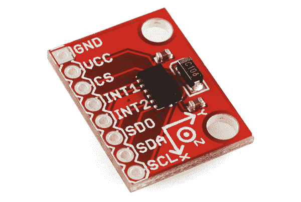
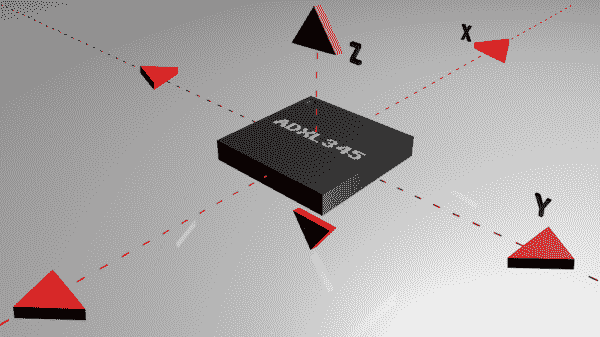
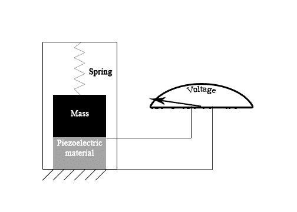
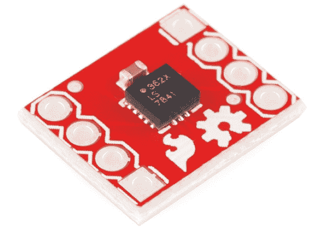
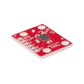
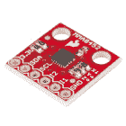
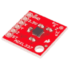

# 加速度计基础知识

> 原文：<https://learn.sparkfun.com/tutorials/accelerometer-basics>

## 什么是加速度计？

加速度计是测量加速度的装置，加速度是物体的 T2 速度的变化率。它们的单位是米每秒平方(m/s ² )或者重力(G)。对于我们地球上的人来说，一个 G 力相当于 9.8 米/秒 ² ，但这确实会随着海拔高度的变化而略有不同(并且由于引力的变化，在不同的星球上会有不同的值)。加速度计可用于检测系统中的振动或定向应用。

*[ADXL345 Breakout Board](https://www.sparkfun.com/products/9836)*

### 推荐阅读

如果您对以下任何主题都不熟悉，您可能希望在开始使用加速度计之前先阅读这些内容。

 [### 串行外设接口(SPI)](https://learn.sparkfun.com/tutorials/serial-peripheral-interface-spi) SPI is commonly used to connect microcontrollers to peripherals such as sensors, shift registers, and SD cards.[Favorited Favorite](# "Add to favorites") 91 [### 模数转换](https://learn.sparkfun.com/tutorials/analog-to-digital-conversion) The world is analog. Use analog to digital conversion to help digital devices interpret the world.[Favorited Favorite](# "Add to favorites") 58 [### 脉宽灯](https://learn.sparkfun.com/tutorials/pulse-width-modulation) An introduction to the concept of Pulse Width Modulation.[Favorited Favorite](# "Add to favorites") 46 [### 逻辑电平](https://learn.sparkfun.com/tutorials/logic-levels) Learn the difference between 3.3V and 5V devices and logic levels.[Favorited Favorite](# "Add to favorites") 82 [### I2C](https://learn.sparkfun.com/tutorials/i2c) An introduction to I2C, one of the main embedded communications protocols in use today.[Favorited Favorite](# "Add to favorites") 128

* * *

## 加速度计的工作原理

加速度计是检测静态或动态加速度力的机电设备。静态力包括重力，而动态力可以包括振动和运动。

*Axes of measurement for a triple axis accelerometer*

加速度计可以测量一个、两个或三个轴的加速度。随着开发成本的降低，三轴单元变得越来越普遍。

通常，加速度计内部包含电容板。其中一些是固定的，而另一些则连接到微小的弹簧上，当加速力作用在传感器上时，弹簧会向内移动。随着这些板彼此相对移动，它们之间的[电容](https://learn.sparkfun.com/tutorials/capacitors)发生变化。根据电容的这些变化，可以确定加速度。

其他加速度计可以以压电材料为中心。这些微小的晶体结构在受到机械应力(例如加速度)时会输出电荷。

*An example of the inside of a piezoelectric accelerometer*

* * *

## 如何连接到加速度计

对于大多数加速度计，工作所需的基本连接是电源和通信线路。一如既往，请阅读数据手册，确保连接正确。

### 通信接口

加速度计将通过模拟、数字或脉宽调制连接接口进行通信。

*   **模拟** -带有模拟接口的加速度计通过不同的电压水平显示加速度。这些值通常在地电压和电源电压之间波动。微控制器上的 [ADC](https://learn.sparkfun.com/tutorials/analog-to-digital-conversion) 可用于读取该值。这些通常比数字加速度计便宜。

*   **数字** -带有数字接口的加速度计可以通过 [SPI](https://learn.sparkfun.com/tutorials/serial-peripheral-interface-spi) 或 [I ² C](https://learn.sparkfun.com/tutorials/i2c) 通信协议进行通信。与模拟加速度计相比，它们往往功能更多，受噪声影响更小。

*   **脉冲宽度调制(PWM)** -通过[脉冲宽度调制(PWM)](https://learn.sparkfun.com/tutorials/pulse-width-modulation) 输出数据的加速度计输出具有已知周期的方波，但其占空比随加速度的变化而变化。

### 力量

加速度计通常是低功耗器件。所需电流通常在微安( )或毫安范围内，电源电压为 5V 或更低。电流消耗可以根据设置(例如，省电模式与标准操作模式)而变化。这些不同的模式使得加速度计非常适合电池供电的应用。

确保正确的[逻辑电平](https://sparkle.sparkfun.com/sparkle/learn_tutorials/62#tab-attributes)匹配，尤其是数字接口。

* * *

## 如何选择加速度计

选择使用哪种加速度计时，需要考虑几个重要特性，包括电源要求和通信接口，如前所述。需要考虑的其他特性如下。

### 范围

大多数加速度计可以测量可选范围的力。这些范围从 1 克到 250 克不等。通常，范围越小，加速度计的读数就越敏感。例如，为了测量桌面上的微小振动，使用小量程加速度计将比使用 250g 量程(更适合火箭)提供更详细的数据。

*The [ADXL362 Triple Axis Accelerometer](https://www.sparkfun.com/products/11446) can measure ±2g, ±4g, and ±8g.*

### 附加功能

一些加速度计包括敲击检测(适用于低功耗应用)、自由落体检测(用于[主动硬盘保护](http://en.wikipedia.org/wiki/Active_hard-drive_protection))、温度补偿(在[航位推算](http://en.wikipedia.org/wiki/Dead_reckoning)情况下提高精度)和 0g 范围感测等功能，这些是购买加速度计时需要考虑的其他功能。加速度计对这些类型特征的需求将由加速度计的应用来决定。

还有 IMU([惯性测量单元](http://en.wikipedia.org/wiki/Inertial_measurement_unit))可用，可以将加速度计、陀螺仪，有时甚至磁力计集成到单个 IC 封装或电路板中。这样的例子包括 [MPU6050](https://www.sparkfun.com/products/11028) 和 [MPU9150](https://www.sparkfun.com/products/11486) 。这些通常用于[运动跟踪应用](https://dev.qu.tu-berlin.de/projects/sf-razor-9dof-ahrs/wiki/Tutorial)和[无人机导航系统](https://www.sparkfun.com/news/947)，其中物体的位置和方向非常重要。

* * *

## 购买加速度计

现在，您已经了解了 x、y 和 z 的基本知识，看看我们推荐的加速度计。

### 我们的建议:

 

### [【spark fun 三轴加速度计突破- MMA8452Q (Qwiic)](https://www.sparkfun.com/products/retired/14587)

[Retired](https://learn.sparkfun.com/static/bubbles/ "Retired") SEN-14587

这种分线板使得在您的项目中使用微型 MMA8452Q 加速度计通过 I2C 进行通信变得非常容易。

1 **Retired**[Favorited Favorite](# "Add to favorites") 10[Wish List](# "Add to wish list") 

将**添加到您的[购物车](https://www.sparkfun.com/cart)中！**

### [SparkFun 三轴加速度计分线点- ADXL377](https://www.sparkfun.com/products/12803)

[In stock](https://learn.sparkfun.com/static/bubbles/ "in stock") SEN-12803

ADXL377 是一款小型、薄型、低功耗、完整的三轴加速度计，提供经过信号调理的模拟电压输出，具有

$25.953[Favorited Favorite](# "Add to favorites") 12[Wish List](# "Add to wish list")**** 

### [SparkFun 三轴加速度计突破- MMA8452Q](https://www.sparkfun.com/products/retired/12756)

[Retired](https://learn.sparkfun.com/static/bubbles/ "Retired") SEN-12756

这款分线板可以让您在项目中轻松使用微型 MMA8452Q 加速度计。MMA8452Q 是一款智能低功耗……

10 **Retired**[Favorited Favorite](# "Add to favorites") 21[Wish List](# "Add to wish list") 

### [SparkFun 三轴加速度计分线点- ADXL337](https://www.sparkfun.com/products/retired/12786)

[Retired](https://learn.sparkfun.com/static/bubbles/ "Retired") SEN-12786

ADXL337 是一款小型、薄型、低功耗、完整的三轴加速度计，具有经过信号调理的模拟电压输出，可用于测量。

1 **Retired**[Favorited Favorite](# "Add to favorites") 11[Wish List](# "Add to wish list")*****For a more in-depth look at choosing an accelerometer, take a look at our [**buying guide**](https://www.sparkfun.com/pages/accel_gyro_guide) to find the right fit for your project.*[View Accelerometer Buying Guide](https://www.sparkfun.com/pages/accel_gyro_guide)

* * *

## 资源和更进一步

现在，您应该已经掌握了在自己的项目中实现加速度计所需的所有基本工具和技能。

请查看以下链接，了解有关加速度计的更多信息:

*   [加速度计购买指南](https://www.sparkfun.com/pages/accel_gyro_guide)
*   [MMA8452Q 加速度计分线连接指南](https://learn.sparkfun.com/tutorials/mma8452q-accelerometer-breakout-hookup-guide)
*   [不确定的七立方](https://learn.sparkfun.com/tutorials/the-uncertain-7-cube)
*   [布林肯大礼帽](https://learn.sparkfun.com/tutorials/das-blinken-top-hat)**