# 安装 Arduino IDE

> 原文：<https://learn.sparkfun.com/tutorials/installing-arduino-ide>

## 介绍

本教程将带你下载、安装和测试 Arduino 软件(也称为 Arduino IDE，集成开发环境的简称)。在跳转到您的操作系统页面之前，请确保您已经准备好了所有合适的设备。

[](http://arduino.cc/en/Main/Software)

### 所需材料

要跟随本教程，您将需要以下材料。你可能不需要所有的东西，这取决于你拥有什么。将它添加到您的购物车，通读指南，并根据需要调整购物车。

*   电脑(Windows、Mac 或 Linux)
*   兼容 Arduino 的微控制器(本指南中的任何东西都可以)
*   USB A-to-B 电缆，或其他合适的方法将 Arduino 兼容的微控制器连接到计算机(如果您不确定应该购买哪种电缆，请查看此 [USB 购买指南](https://www.sparkfun.com/pages/USB_Guide))。

[](https://www.sparkfun.com/products/11021) 

将**添加到您的[购物车](https://www.sparkfun.com/cart)中！**

### [Arduino Uno - R3](https://www.sparkfun.com/products/11021)

[In stock](https://learn.sparkfun.com/static/bubbles/ "in stock") DEV-11021

这是新的 Arduino Uno R3。除了以前主板的所有功能外，Uno 现在使用 ATmega16U2 代替…

$27.95138[Favorited Favorite](# "Add to favorites") 162[Wish List](# "Add to wish list")****[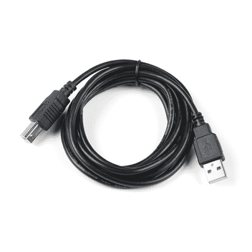](https://www.sparkfun.com/products/512) 

将**添加到您的[购物车](https://www.sparkfun.com/cart)中！**

### [USB 线 A 到 B - 6 脚](https://www.sparkfun.com/products/512)

[In stock](https://learn.sparkfun.com/static/bubbles/ "in stock") CAB-00512

这是标准的 USB 2.0 电缆。这是最常见的 A 到 B 公/公型外围电缆，就是通常的那种…

$4.501[Favorited Favorite](# "Add to favorites") 13[Wish List](# "Add to wish list")**** ****### 推荐阅读

如果你是 Arduino 的新手，你会想看看这个教程来熟悉每个人最喜欢的微控制器平台。

[](https://learn.sparkfun.com/tutorials/what-is-an-arduino) [### 什么是 Arduino？

#### 2013 年 2 月 26 日](https://learn.sparkfun.com/tutorials/what-is-an-arduino) What is this 'Arduino' thing anyway? This tutorials dives into what an Arduino is and along with Arduino projects and widgets.[Favorited Favorite](# "Add to favorites") 50**Note:** There are several variants that use the Arduino Uno R3 footprint. Depending on the design, you may need to install additional drivers for your USB-to-serial converter before you are able to able to upload code to your microcontroller. For example, the [RedBoard uses an FTDI](https://www.sparkfun.com/products/13975) while the [RedBoard Plus uses the CH340](https://www.sparkfun.com/products/18158).

| [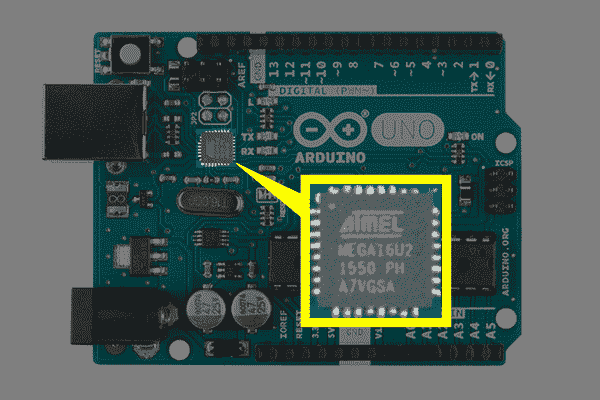](https://cdn.sparkfun.com/assets/learn_tutorials/6/1/11021-Arduino-Uno-ATmega16U2_USB-to-Serial-Highlighted.jpg) | [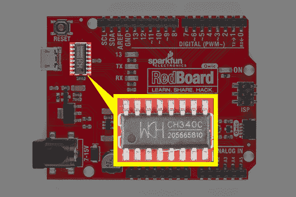](https://cdn.sparkfun.com/assets/learn_tutorials/6/1/15123-RedBoard-Qwiic-CH340_USB-to-Serial-Highlighted.jpg) | [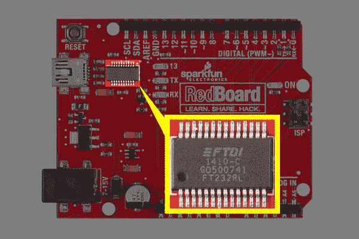](https://cdn.sparkfun.com/assets/learn_tutorials/6/1/13975-Arduino-RedBoard-FTDI_USB-to-Serial-Highlighted.jpg) |
| 
Arduino Uno R3 上的 Atmega16U2 | *RedBoard
上的 FTDI* | 
红板 Qwiic 上的 CH340 |

Both use different drivers compared to the Arduino Uno R3\. Make sure to look closely at your board and its respective hookup guide to determine USB-to-serial converter that is on board. You will probably have either an FTDI or CH340 populated on the board.

[](https://learn.sparkfun.com/tutorials/how-to-install-ftdi-drivers) [### 如何安装 FTDI 驱动程序](https://learn.sparkfun.com/tutorials/how-to-install-ftdi-drivers) How to install drivers for the FTDI Basic on Windows, Mac OS X, and Linux.[Favorited Favorite](# "Add to favorites") 12[](https://learn.sparkfun.com/tutorials/how-to-install-ch340-drivers) [### 如何安装 CH340 驱动程序](https://learn.sparkfun.com/tutorials/how-to-install-ch340-drivers) How to install CH340 drivers (if you need them) on Windows, Mac OS X, and Linux.[Favorited Favorite](# "Add to favorites") 9Other boards using a different architecture like the [RedBoard Turbo (SAMD21)](https://www.sparkfun.com/products/14812) have a built-in USB communication, eliminating the need to have a separate piece of hardware. For more information, check out the blog post on drivers: [What Drives your SparkFun Inventor's Kit?](https://www.sparkfun.com/news/2979).

如果您准备好开始，请单击左侧栏中与您的操作系统匹配的链接，或者您可以在此处跳转到您的操作系统。

*   [窗户](https://learn.sparkfun.com/tutorials/installing-arduino#windows)
*   [Mac](https://learn.sparkfun.com/tutorials/installing-arduino#mac)
*   [Linux](https://learn.sparkfun.com/tutorials/installing-arduino#linux)

## 下载 Arduino IDE

你可以从他们的网站下载 Arduino IDE。他们有[安装说明](https://www.arduino.cc/en/Guide/HomePage)，但是我们也会检查安装过程。确保您下载的版本与您的操作系统相匹配。

[Click for Arduino IDE Download Page](http://arduino.cc/en/Main/Software)

安装过程相当简单，但会因操作系统而异。这里有一些提示可以帮助你。

**Troubleshooting Tips**

*   我们建议使用装有完整桌面操作系统的电脑，如 Windows 7/10 ( **避免** Windows 8，如果可以的话)、Mac OSX 和某些风格的 Linux(查看 [Arduino FAQ 页面了解兼容性](https://www.arduino.cc/en/Main/FAQ#toc12))。

*   如果你不是技术或电脑高手，但你有自己的电脑选择，我强烈建议你使用一台 **Windows 7、10 或 11** 电脑。使用这些操作系统，您通常会遇到最少的问题，如果有的话。

*   我们确实 **而不是** 建议使用 Chromebook、上网本、平板电脑、手机或 Arduino Web IDE。您将负责解决任何驱动程序或 Arduino Web IDE 问题。

*   截至撰写本教程时(2018 年 12 月 14 日更新)，Arduino IDE 的最新稳定版本是 1.8.5 版。我们建议使用该版本的 Arduino IDE 你可以在这里下载以前的版本。

*   安装了 Raspbian 的 Raspberry Pi 用户应该使用 **Linux ARM** 下载。我们不建议使用命令行安装。它将安装 Arduino 的最老版本，这在安装新的板卡定义或库时毫无用处。

*   关于其他故障排除技巧，这里有一个来自 Arduino 的[故障排除指南。](https://www.arduino.cc/en/Guide/Troubleshooting)

## Windows 操作系统

本页将向您展示如何在 Windows 操作系统(Windows 10、Windows 7、Vista 和 XP)上安装和测试 Arduino 软件。

前往 Arduino [下载页面](http://arduino.cc/en/Main/Software)并下载最新版本的 Arduino Windows 软件(如果您尚未下载的话)。

[Click for Arduino IDE Download Page](http://arduino.cc/en/Main/Software)

### 安装程序

Arduino 的 Windows 版本提供了两个选项:安装程序或 zip 文件。**安装程序**是两个选项中较简单的一个，只需下载并运行可执行文件就可以开始安装。

[](https://cdn.sparkfun.com/assets/learn_tutorials/8/4/4/Win_10-_Installation_Diagram.png)*Windows install steps. Click the image to get a bigger view.*

当安装过程中提示您安装驱动程序时，请选择“安装”。这将为 Arduino 特定的主板(如 Uno、Nano 等)安装驱动程序。)你将来可能会用到。

### 活力

如果你选择下载 Arduino 的 **zip 文件**版本，你需要自己解压文件。不要忘记你把文件解压到哪个文件夹！您需要运行文件夹中的可执行 Arduino 文件来启动 Arduino IDE。

下载完成后，解压并打开 Arduino 文件夹，确认里面确实有一些文件和子文件夹。文件结构很重要，所以不要移动任何文件，除非你真的知道你在做什么。

**Note:** On Windows 10, there is an option to install Arduino through their app store. we do not recommend installing the Arduino IDE from the app store. You may run into issues because the OS will automatically update to the most recent release of the Arduino IDE, which may have unknown bugs.

### 连接您的 Arduino

通过使用 USB 电缆(如果您使用的是 Arduino Pro，则使用 FTDI 电缆)将 Arduino 板连接到电脑，为 Arduino 通电。您应该会看到标有“开”的 LED 灯亮起。([此图](https://learn.sparkfun.com/tutorials/what-is-an-arduino/whats-on-the-board)显示了 UNO 上电源 LED 的位置)。

### Windows 上 Arduino Uno 的驱动程序

 要安装 Arduino Uno 的驱动程序，您需要将主板插入电脑的 USB 端口。一旦板被连接，你将需要等待 Windows 开始它的驱动程序安装过程。几分钟后，尽管尽了最大努力，该过程仍可能失败。

打开搜索，输入**设备管理器**，点击`ENTER`。

[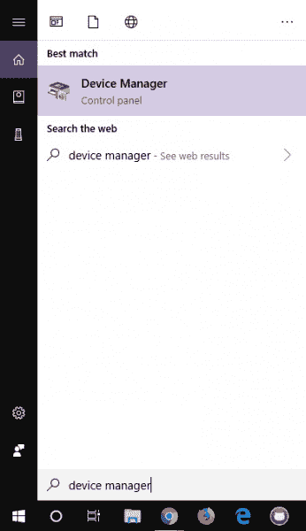](https://cdn.sparkfun.com/assets/learn_tutorials/9/0/8/Windows-Searching_for_device_manager.jpg)**Note:** Searching is the easiest method to open the Device Manager. However, there is more than one method of opening the device manager. The longer method is to click on the **Start Menu** > **Windows System** > **System and Security** > **System** > **Device Manager**.

在端口(COM & LPT)树下查找。您应该会看到一个名为“ **Arduino UNO (COMxx)** 的开放端口。如果没有 COM & LPT 段，在**其他设备**下查找**未知设备**。右键点击“ **Arduino UNO (COMxx)** ”或“**未知设备**”端口，选择“**更新驱动软件**”选项。

[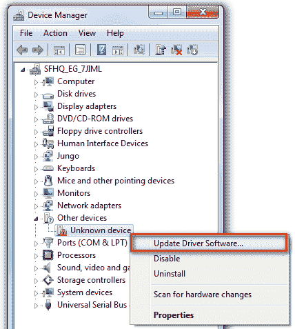](https://cdn.sparkfun.com/assets/learn_tutorials/6/1/Device_Manager_Unknown_Device.png)

接下来，选择“**在我的电脑上浏览驱动程序软件**”选项

[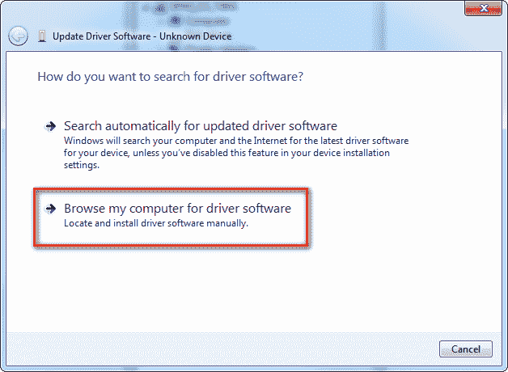](https://cdn.sparkfun.com/assets/learn_tutorials/6/1/Unknown_Device_Browse_my_computer_for_driver_software.png)

最后，导航到 Arduino IDE 文件夹。这应该是你解压 Arduino IDE 的地方(例如，它应该类似于下面的路径，只是版本号不同:*C:\ Program Files \ Arduino-1 . 8 . 5 \ drivers*)。根据您使用的 Windows 版本，您可以选择位于“**驱动程序**”文件夹中的名为“ **Arduino.inf** ”的 Uno 驱动程序文件(不是“FTDI USB 驱动程序”子目录)。如果看不到**&ast；。inf** 文件，很可能只是隐藏。您可以选择“**包含子文件夹**”选项来代替“**驱动程序**”文件夹。

[](https://cdn.sparkfun.com/assets/learn_tutorials/6/1/Arduino_Select_Driver.png)

Windows 将从那里完成驱动程序安装！您的计算机将使用 COM 端口枚举。根据计算机中当前保存的内容，您可能会看到一个 COM 端口号。上传的时候尽量记住数字是多少。如果没有，您可以随时导航回设备管理器并重启 Arduino，以确定您的 Arduino 枚举的编号。

[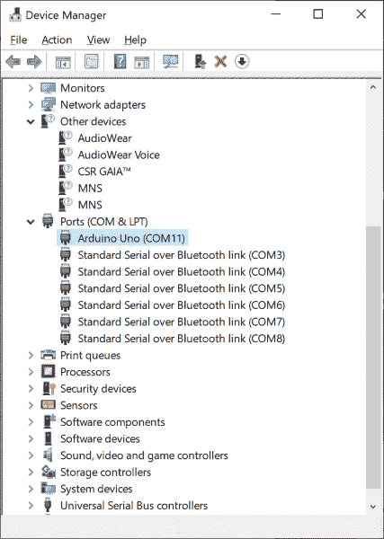](https://cdn.sparkfun.com/assets/learn_tutorials/6/1/Arduino_Uno_COM_Port_Device_Manager.png)

对于 Arduino 板的早期版本(例如 Arduino Duemilanove、Nano 或 Diecimila ),请查看本页了解具体说明。

[Arduino.cc - Guide: Windows](http://arduino.cc/en/Guide/Windows)

### Windows 上 RedBoard 的驱动程序

 根据您的主板，主板上可能有不同的 USB 转串行转换器。如果你使用的是 RedBoard，你将需要进入[如何安装 FTDI 驱动程序](https://learn.sparkfun.com/tutorials/how-to-install-ftdi-drivers)教程。如果你正在使用或 RedBoard Qwiic，你将需要去[如何安装 CH340 驱动程序](https://learn.sparkfun.com/tutorials/how-to-install-ch340-drivers)教程。请务必仔细查看您的主板及其相应的连接指南，以确定主板上的 USB 转串行转换器。

[](https://learn.sparkfun.com/tutorials/how-to-install-ftdi-drivers) [### 如何安装 FTDI 驱动程序

#### 2013 年 6 月 4 日](https://learn.sparkfun.com/tutorials/how-to-install-ftdi-drivers) How to install drivers for the FTDI Basic on Windows, Mac OS X, and Linux.[Favorited Favorite](# "Add to favorites") 12[](https://learn.sparkfun.com/tutorials/how-to-install-ch340-drivers) [### 如何安装 CH340 驱动程序

#### 2019 年 8 月 6 日](https://learn.sparkfun.com/tutorials/how-to-install-ch340-drivers) How to install CH340 drivers (if you need them) on Windows, Mac OS X, and Linux.[Favorited Favorite](# "Add to favorites") 9

### 发射眨眼！

在完成软件安装的适当步骤后，我们现在准备用 Arduino 板测试您的第一个程序！启动 Arduino 应用程序。如果您断开了板的连接，请将其插回。

[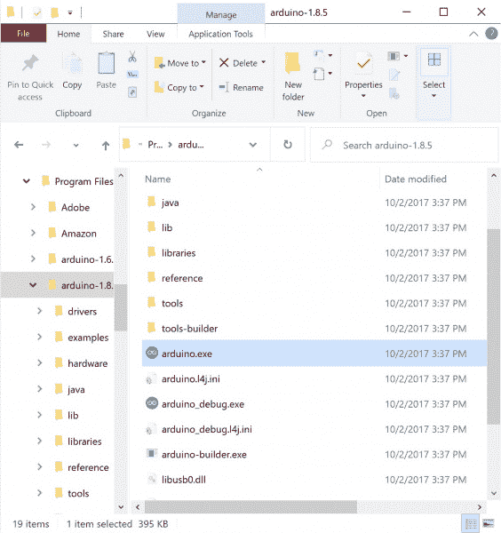](https://cdn.sparkfun.com/assets/learn_tutorials/6/1/Arduino_IDE_Executable.jpg)**Note:** Depending on your method of installing the Arduino IDE, the application may be on your desktop or the program folder.

打开眨眼示例草图，方法是进入:**文件** > **示例** > **01。基础知识** > **眨眼**。

[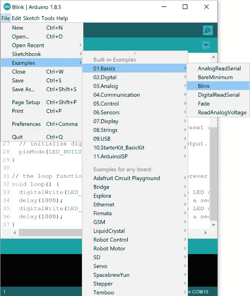](https://cdn.sparkfun.com/assets/learn_tutorials/6/1/Arduino_Blink_Example.jpg)

选择您正在使用的 Arduino 板卡类型:**工具** > **板卡** > **Arduino Uno** 。

[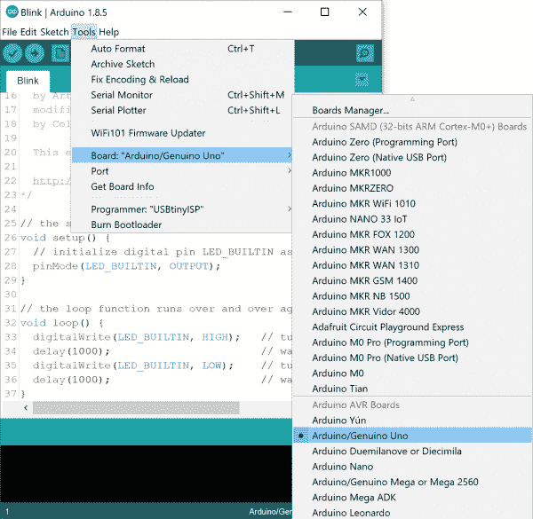](https://cdn.sparkfun.com/assets/learn_tutorials/6/1/Arduino_Board_Selection.jpg)**Note:** As you move to other architectures, you may need to select a different board definition depending on your development board. For the Arduino Uno R3 and RedBoard development boards with ATmega328P, you can simply select **Arduino Uno**. Certain Arduino IDE versions may have you select **Arduino/ Genuino Uno**.

选择你的 Arduino 所连接的串口/COM 端口:**工具** > **端口** > **COMxx** 。在这种情况下是 *COM11* 。

[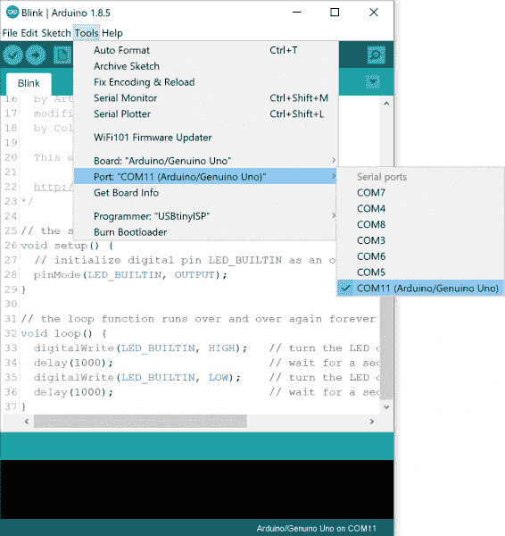](https://cdn.sparkfun.com/assets/learn_tutorials/6/1/Arduino_IDE_Select_COM_Port.jpg)**Note:** If you're not sure which serial device is your Arduino, take a look at the available ports, then unplug your Arduino and look again. The one that disappeared is your Arduino.

连接 Arduino 板，打开闪烁草图，按下“**上传**按钮。

[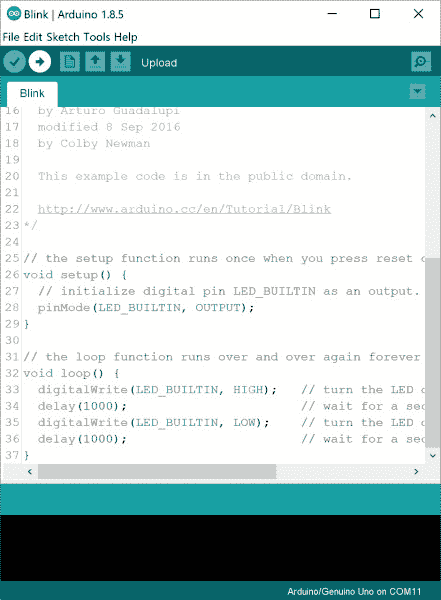](https://cdn.sparkfun.com/assets/learn_tutorials/6/1/Arduino_IDE_Upload_Button.jpg)

一秒钟后，你应该会看到一些 led 在你的 Arduino 上闪烁，然后在闪烁草图的状态栏中出现“**完成上传**”的消息。

[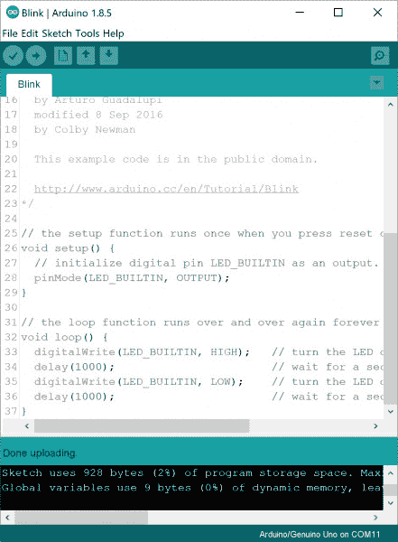](https://cdn.sparkfun.com/assets/learn_tutorials/6/1/Arduino_IDE_Done_Uploading.jpg)

如果一切正常，Arduino 上的板载 LED 现在应该会闪烁！你刚刚编写了你的第一个 Arduino！

**Note:** Depending on the architecture and development board, the built-in LED may be defined on a different pin. You may need to adjust `LED_BUILTIN` or pin `13` to a different value before uploading.

### 解决纷争

Arduino 的本指南提供了更多详细信息和故障排除技巧。

## 苹果个人计算机

本页将向您展示如何在运行 OSX 的 Mac 电脑上安装和测试 Arduino 软件。

前往 Arduino [下载页面](http://arduino.cc/en/Main/Software)并下载最新版本的 Arduino Windows 软件(如果您尚未下载的话)。

[Click for Arduino IDE Download Page](http://arduino.cc/en/Main/Software)

下载完成后，你的 Mac 应该会自动解压缩内容。这大概会在你的**下载**文件夹里。

[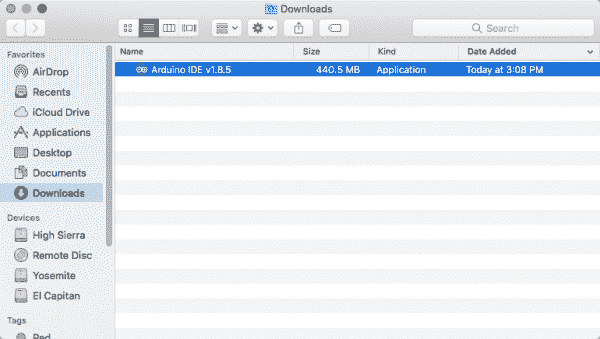](https://cdn.sparkfun.com/assets/learn_tutorials/6/1/Unzip_Arduino_IDE_Mac.png)

您可以将程序留在**下载**文件夹中，或者将其移动到您的应用程序文件夹中。

[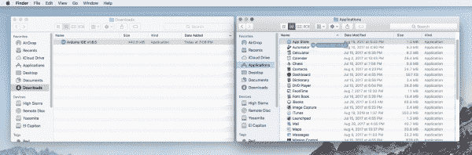](https://cdn.sparkfun.com/assets/learn_tutorials/6/1/Arduino_IDE_Applications_Folder_Mac.png)

### 连接您的 Arduino

通过使用 USB 电缆(如果您使用的是 Arduino Pro，则使用 FTDI 电缆)将 Arduino 板连接到电脑，为 Arduino 通电。您应该会看到标有“开”的 LED 灯亮起。([此图](https://learn.sparkfun.com/tutorials/what-is-an-arduino/whats-on-the-board)显示了 UNO 上电源 LED 的位置)。

### Mac 上 Arduino Uno 的驱动程序

 对于 Arduino Uno，您不需要为 Mac 安装驱动程序！你可以往下跳，试着上传一个眨眼的草图！

### Mac 上 RedBoard 的驱动程序

 根据您的主板，主板上可能有不同的 USB 转串行转换器。如果你使用的是 RedBoard，你将需要进入[如何安装 FTDI 驱动程序](https://learn.sparkfun.com/tutorials/how-to-install-ftdi-drivers)教程。如果你正在使用或 RedBoard Qwiic，你将需要去[如何安装 CH340 驱动程序](https://learn.sparkfun.com/tutorials/how-to-install-ch340-drivers)教程。请务必仔细查看您的主板及其相应的连接指南，以确定主板上的 USB 转串行转换器。

[](https://learn.sparkfun.com/tutorials/how-to-install-ftdi-drivers) [### 如何安装 FTDI 驱动程序

#### 2013 年 6 月 4 日](https://learn.sparkfun.com/tutorials/how-to-install-ftdi-drivers) How to install drivers for the FTDI Basic on Windows, Mac OS X, and Linux.[Favorited Favorite](# "Add to favorites") 12[](https://learn.sparkfun.com/tutorials/how-to-install-ch340-drivers) [### 如何安装 CH340 驱动程序

#### 2019 年 8 月 6 日](https://learn.sparkfun.com/tutorials/how-to-install-ch340-drivers) How to install CH340 drivers (if you need them) on Windows, Mac OS X, and Linux.[Favorited Favorite](# "Add to favorites") 9

### 发射眨眼！

在完成软件安装的适当步骤后，我们现在准备用 Arduino 板测试您的第一个程序！

无论程序在哪里，都可以启动 Arduino 应用程序。如果您断开了板的连接，请将其插回。

[](https://cdn.sparkfun.com/assets/learn_tutorials/6/1/Unzip_Arduino_IDE_Mac.png)

打开眨眼示例草图，方法是进入:**文件** > **示例** > **01。基础知识** > **眨眼**。

[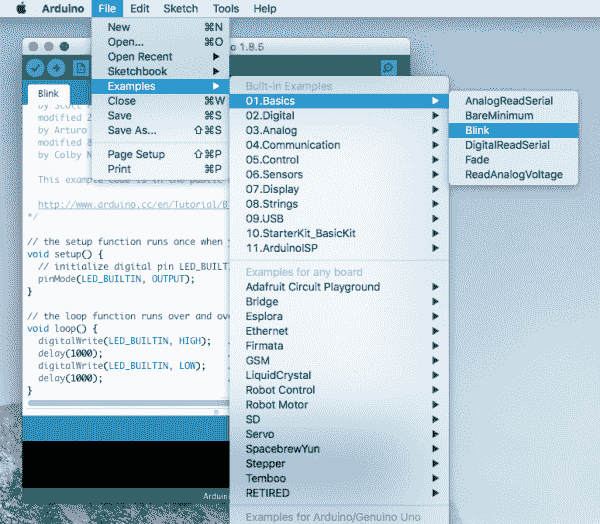](https://cdn.sparkfun.com/assets/learn_tutorials/6/1/Arduino_Blink_Sketch_Mac.png)

选择您正在使用的 Arduino 板卡类型:**工具** > **板卡** > **Arduino Uno** 。

[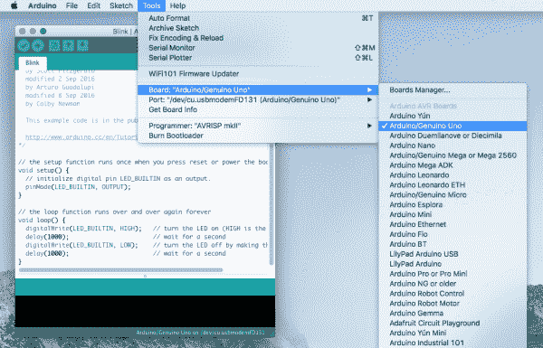](https://cdn.sparkfun.com/assets/learn_tutorials/6/1/Arduino_IDE_Board_Select_Mac.png)**Note:** As you move to other architectures, you may need to select a different board definition depending on your development board. For the Arduino Uno R3 and RedBoard development boards with ATmega328P, you can simply select **Arduino Uno**. Certain Arduino IDE versions may have you select **Arduino/ Genuino Uno**.

选择你的 Arduino 所连接的串口:**工具** > **端口** > **xxxxxx** 。它可能看起来像“*/dev/tty . usbmodemfd 131*”或“*/dev/tty . USB serial-131*”，但可能有不同的编号。在本例中，它是 */dev/cu.usbmodemFD131* 。

[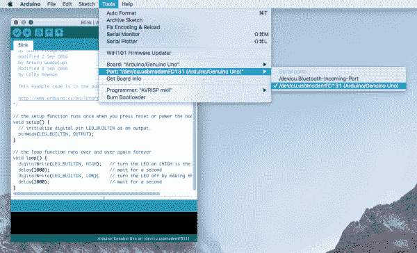](https://cdn.sparkfun.com/assets/learn_tutorials/6/1/Arduino_IDE_COM_Port_Select_Mac.png)**Note:** If you're not sure which serial device is your Arduino, take a look at the available ports, then unplug your Arduino and look again. The one that disappeared is your Arduino.

连接 Arduino 板并打开闪烁草图后，按下“**上传**按钮。

[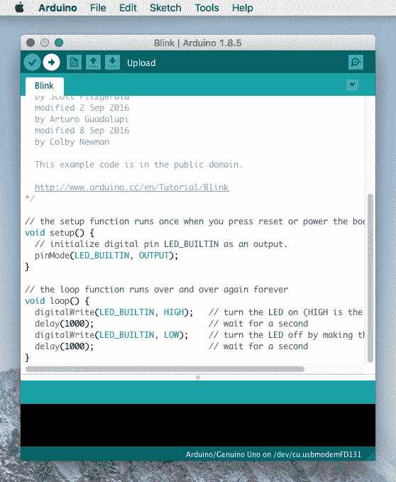](https://cdn.sparkfun.com/assets/learn_tutorials/6/1/Arduino_IDE_Upload_Button_Mac.png)

一秒钟后，你应该会看到一些 led 在你的 Arduino 上闪烁，然后在闪烁草图的状态栏中出现“**完成上传**”的消息。

[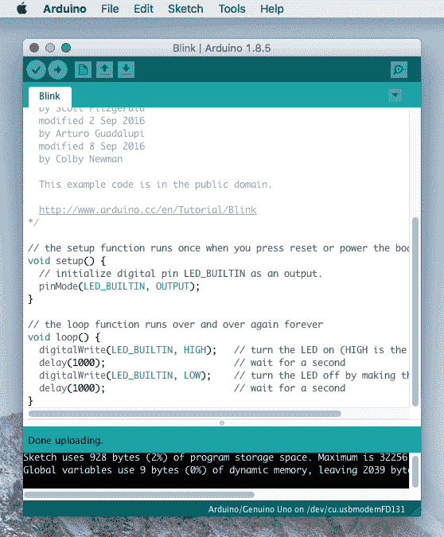](https://cdn.sparkfun.com/assets/learn_tutorials/6/1/Arduino_IDE_Done_Uploading_Mac.png)

如果一切正常，Arduino 上的板载 LED 现在应该会闪烁！你刚刚编写了你的第一个 Arduino！

**Note:** Depending on the architecture and development board, the built-in LED may be defined on a different pin. You may need to adjust `LED_BUILTIN` or pin `13` to a different value before uploading.

### 解决纷争

如果您遇到问题，请查看 Arduino 的故障排除指南。

## Linux 操作系统

如果你是一个 Linux 用户，你可能知道有许多不同版本的 Linux。不出所料，安装 Arduino 对于这些发行版中的许多来说都略有不同。幸运的是，Arduino 社区在为大多数流行版本提供指导方面做得非常出色。点击下面包含您的 Linux 风格的链接:

*   [ArchLinux](http://playground.arduino.cc/Linux/ArchLinux)
*   Debian
*   [软呢帽](http://playground.arduino.cc/Linux/Fedora)
*   [巴布亚](http://playground.arduino.cc/Linux/Gentoo)
*   [MEPIS](http://playground.arduino.cc/Linux/MEPIS)
*   [薄荷](http://playground.arduino.cc/Linux/Mint)
*   [openSUSE](http://playground.arduino.cc/Linux/OpenSUSE)
*   [小狗](http://playground.arduino.cc/Linux/Puppy)
*   [阴部](http://playground.arduino.cc/Linux/Pussy)
*   [休闲服](http://playground.arduino.cc/Linux/Slackware)
*   [Ubuntu](http://playground.arduino.cc/Linux/Ubuntu)
*   [华硕 Eee PC 上的 Xandros (Debian 衍生物)](http://playground.arduino.cc/Linux/Xandros)

如果以上指导对你不起作用，或者你看不到你的发行版，试试这个[包罗万象的指南](http://playground.arduino.cc/Linux/All)。

当您的系统设置正确时，您可以前往[下载页面](http://arduino.cc/en/Main/Software)下载最新版本的 Arduino for Linux(有 32 位和 64 位版本可用)。

[Click for Arduino IDE Download Page](http://arduino.cc/en/Main/Software)**Note:** Raspberry Pi users with Raspbian installed should use the **Linux ARM** download. Do not use the command line installation process. For more information, please refer to this [blog post from Arduino](https://playground.arduino.cc/Linux/Raspbian).

### 连接您的 Arduino

通过使用 USB 电缆(如果您使用的是 Arduino Pro，则使用 FTDI 电缆)将 Arduino 板连接到电脑，为 Arduino 通电。您应该会看到标有“开”的 LED 灯亮起。([此图](https://learn.sparkfun.com/tutorials/what-is-an-arduino/whats-on-the-board)显示了 UNO 上电源 LED 的位置)。

### 活力

**Note:** You'll need to know if your Linux distribution is running on 32-bit or 64-bit when downloading the Arduino IDE. Type the following command in the serial terminal to determine what version your OS is running on.

```
uname -a
```

If you receive an output with `x86_64`, this indicates that it is a 64-bit OS.

一旦你下载了压缩文件版本的 Arduino，你需要自己解压文件。不要忘记你把文件解压到哪个文件夹！一旦下载完毕，[打开一个串行终端](https://learn.sparkfun.com/tutorials/terminal-basics/command-line-windows-mac-linux)并导航到使用`cd`命令和文件夹路径解压的 Arduino 程序文件夹。在这种情况下，我们为 Ubuntu 发行版下载了 Arduino IDE v1.8.5，64 位版本。根据下载的版本，路径和文件夹可能会有所不同。您可能需要使用`ls`命令来导航。

```
language:bash
cd /Downloads/arduino-1.8.5-linux64/arduino-1.8.5 
```

进入 Arduino 程序文件夹后，您需要在终端窗口中输入以下命令进行安装。

```
language:bash
./install.sh 
```

此时，您的终端窗口可能如下所示。

[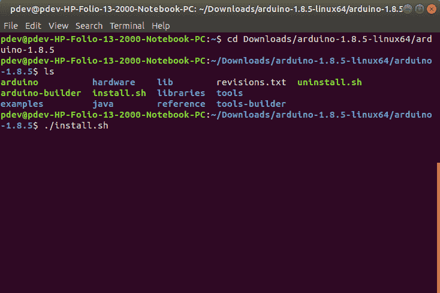](https://cdn.sparkfun.com/assets/learn_tutorials/6/1/Arduino-Install_Linux.png)

完成后，Arduino IDE 将安装在桌面上！

### Linux 上 RedBoard 的驱动程序

 对于 Arduino Uno，您不需要安装 Linux 驱动程序！您可能需要更改 COM 端口权限，这将在下面进一步解释。你可以往下跳，试着上传一个眨眼的草图！

### Linux 上 RedBoard 的驱动程序

 根据您的主板，主板上可能有不同的 USB 转串行转换器。如果你使用的是 RedBoard，你将需要进入[如何安装 FTDI 驱动程序](https://learn.sparkfun.com/tutorials/how-to-install-ftdi-drivers)教程。如果你正在使用或 RedBoard Qwiic，你将需要去[如何安装 CH340 驱动程序](https://learn.sparkfun.com/tutorials/how-to-install-ch340-drivers)教程。请务必仔细查看您的主板及其相应的连接指南，以确定主板上的 USB 转串行转换器。

[](https://learn.sparkfun.com/tutorials/how-to-install-ftdi-drivers) [### 如何安装 FTDI 驱动程序

#### 2013 年 6 月 4 日](https://learn.sparkfun.com/tutorials/how-to-install-ftdi-drivers) How to install drivers for the FTDI Basic on Windows, Mac OS X, and Linux.[Favorited Favorite](# "Add to favorites") 12[](https://learn.sparkfun.com/tutorials/how-to-install-ch340-drivers) [### 如何安装 CH340 驱动程序

#### 2019 年 8 月 6 日](https://learn.sparkfun.com/tutorials/how-to-install-ch340-drivers) How to install CH340 drivers (if you need them) on Windows, Mac OS X, and Linux.[Favorited Favorite](# "Add to favorites") 9

### 发射眨眼！

在完成软件安装的适当步骤后，我们现在准备用 Arduino 板测试您的第一个程序！

启动 Arduino 应用程序。如果您断开了板的连接，请将其插回。

打开眨眼示例草图，方法是进入:**文件** > **示例** > **01。基础知识** > **眨眼**。

[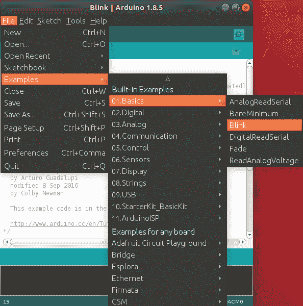](https://cdn.sparkfun.com/assets/learn_tutorials/6/1/Arduino_IDE_Blink_Linux.png)

选择您正在使用的 Arduino 板卡类型:**工具** > **板卡** > **Arduino Uno** 。

[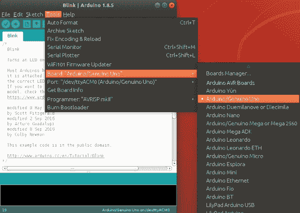](https://cdn.sparkfun.com/assets/learn_tutorials/6/1/Arduino_Board_Selection_Linux.png)**Note:** As you move to other architectures, you may need to select a different board definition depending on your development board. For the Arduino Uno R3 and RedBoard development boards with ATmega328P, you can simply select **Arduino Uno**. Certain Arduino IDE versions may have you select **Arduino/ Genuino Uno**.

选择你的 Arduino 所连接的串行端口:**工具** > **端口** > **xxxxxx** (它可能看起来像“ */dev/ttyACM0* ”但可能有不同的编号)

[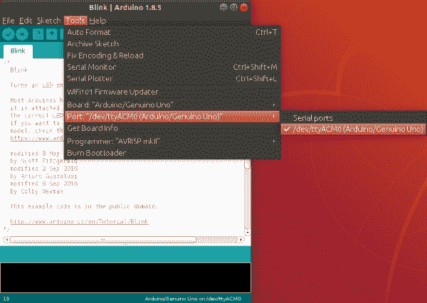](https://cdn.sparkfun.com/assets/learn_tutorials/6/1/Arduino_COM_Port_Linux.png)**Note:** If you're not sure which serial device is your Arduino, take a look at the available ports, then unplug your Arduino and look again. The one that disappeared is your Arduino.

连接 Arduino 板并打开闪烁草图后，按下“**上传**按钮。

[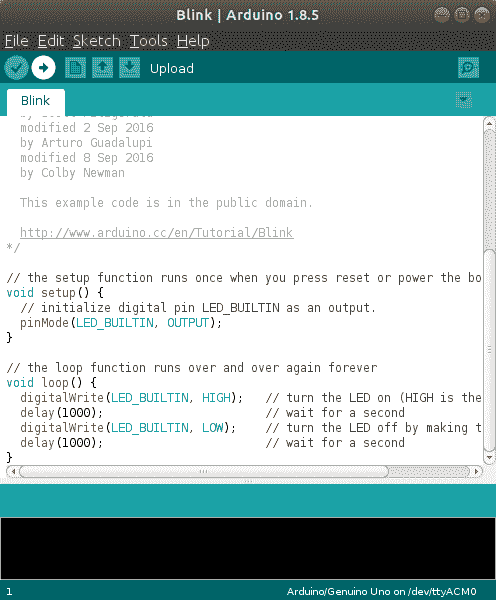](https://cdn.sparkfun.com/assets/learn_tutorials/6/1/Arduino_Upload_Button_Linux.png)

一秒钟后，你应该会看到一些 led 在你的 Arduino 上闪烁，然后在闪烁草图的状态栏中出现“**完成上传**”的消息。

[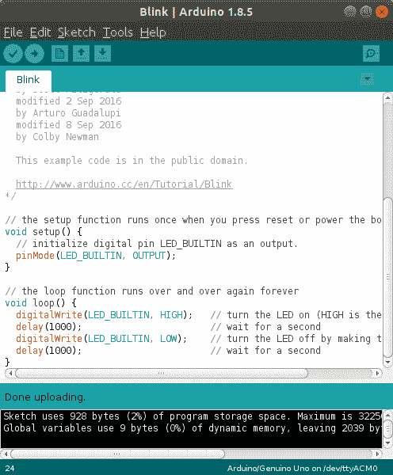](https://cdn.sparkfun.com/assets/learn_tutorials/6/1/Arduino_Done_Uploading_Linux.png)**Troubleshooting Tip:** Having trouble uploading? If you receive the following error when uploading, this could be [due to a few reasons](https://support.arduino.cc/hc/en-us#upload). Most likely there is something with the user permissions if you have not used the Arduino Uno on your computer before.

```
avrdude: ser_open(): can't open device "/dev/ttyACM0" Permission denied Problem uploading to board.
```

You'll see the output at the bottom of the Arduino IDE.

[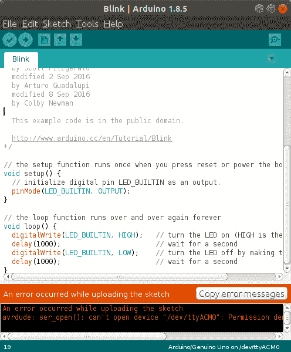](https://cdn.sparkfun.com/assets/learn_tutorials/6/1/Arduino_COM_Port_Permissions_Error_Linux.png)
Try adjusting the permissions by opening a terminal window.

```
ls -l /dev/ttyACM*
```

You'll get something similar to the following output.

```
crw-rw---- 1 root dialout 188, 0 Jul 30 14:14 /dev/ttyACM0
```

Then type the following command where the *<username>* is your Linux account user. Make sure to enter your password to change the settings.

```
sudo usermod -a -G dialout *<username>*
```

You'll probably see something similar to the output below with a different username. In this case, our username was "pdev."

[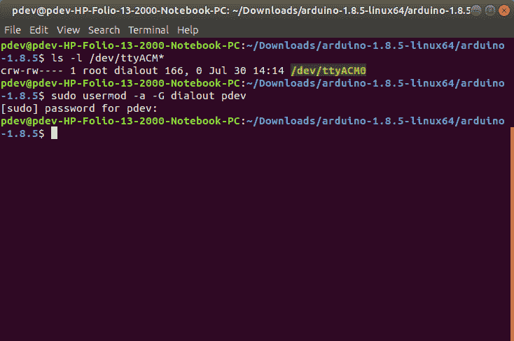](https://cdn.sparkfun.com/assets/learn_tutorials/6/1/Arduino_COM_Port_Permissions_Terminal.png)
You'll need to restart your Linux for the changes to take effect. Since we are already in the terminal window, type the following command to restart your computer. Of course, you can use the GUI as well to restart if you prefer.

```
sudo reboot
```

如果一切正常，Arduino 上的板载 LED 现在应该会闪烁！你刚刚编写了你的第一个 Arduino！

**Note:** Depending on the architecture and development board, the built-in LED may be defined on a different pin. You may need to adjust `LED_BUILTIN` or pin `13` to a different value before uploading.

### 解决纷争

Arduino Playground Linux 部分是解决 Arduino 安装问题的绝佳资源。

## Arduino 主板管理器的主板插件

在 Arduino v1.6.4+中，新的电路板管理器功能可以轻松地将第三方电路板(如 [SparkFun RedBoard、数字沙箱和 RedBot](https://github.com/sparkfun/Arduino_Boards#sparkfun-arduino-boards) )添加到 Arduino IDE 中。

[GitHub: SparkFun Arduino Boards](https://github.com/sparkfun/Arduino_Boards#sparkfun-arduino-boards)

首先，高亮显示并复制(`CTRL` + `C` / `CMD` + `C`)董事会管理器 URL 的以下文本。你需要这个来配置 Arduino。

```
language:bash
https://raw.githubusercontent.com/sparkfun/Arduino_Boards/main/IDE_Board_Manager/package_sparkfun_index.json 
```

[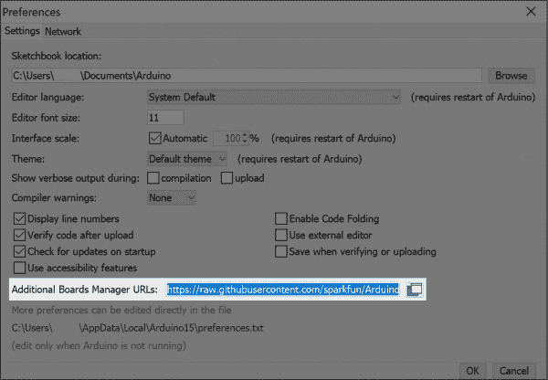](https://cdn.sparkfun.com/assets/learn_tutorials/6/1/SparkFun_Arduino_Additional_Board_Manager_URLs_GitHub_JSON.jpg)**Heads Up:** GitHub has recently [moved away](https://github.com/github/renaming) from having default branches as "`master`" and changed the default to "`main`". SparkFun has followed this move as well. If you're unable to see a particular board inside of Arduino it may be that you are using the older "`master`" link. As a result, you will only see the previous changes on the old `master` branch. Please change to the '`main`' json url listed above and all should be well.

打开 Arduino:

*   *配置板卡管理器*
    *   对于 Windows 和 Linux，进入**文件>首选项>附加董事会管理器 URL**并粘贴(`CTRL` + `V` / `CMD` + `V`)链接
    *   对于苹果电脑，进入 **Arduino >首选项>附加董事会管理器 URL**并粘贴(`CTRL` + `V` / `CMD` + `V`)链接
*   点击**工具>板>板管理器...**
*   从下拉菜单中选择类型为“**贡献的**”。
*   点击 **SparkFun AVR 板**，然后点击**安装**。

就是这样！板子都装好了。这也让你可以通过 Arduino 内置的库管理器工具访问我们所有的库文件。寻找更多关于添加其他定制板的信息？查看下面的[教程来安装其他 Arduino 内核](https://learn.sparkfun.com/tutorials/installing-board-definitions-in-the-arduino-ide)。

[](https://learn.sparkfun.com/tutorials/installing-board-definitions-in-the-arduino-ide) [### 在 Arduino IDE 中安装电路板定义

#### 2020 年 9 月 9 日](https://learn.sparkfun.com/tutorials/installing-board-definitions-in-the-arduino-ide) How do I install a custom Arduino board/core? It's easy! This tutorial will go over how to install an Arduino board definition using the Arduino Board Manager. We will also go over manually installing third-party cores, such as the board definitions required for many of the SparkFun development boards.[Favorited Favorite](# "Add to favorites") 3

## 资源和更进一步

现在，您已经在系统上安装了 Arduino 软件，并成功地用 Arduino 板对其进行了测试，您已经为进入嵌入式电子世界做好了准备。如果你想了解一些 [**概念**](https://learn.sparkfun.com/tutorials/tags/concepts) ，这将帮助你[构建你的项目](https://learn.sparkfun.com/tutorials/tags/projects)，看看下面的一些教程:

[](https://learn.sparkfun.com/tutorials/installing-an-arduino-library) [### 安装 Arduino 库](https://learn.sparkfun.com/tutorials/installing-an-arduino-library) How do I install a custom Arduino library? It's easy! This tutorial will go over how to install an Arduino library using the Arduino Library Manager. For libraries not linked with the Arduino IDE, we will also go over manually installing an Arduino library.[Favorited Favorite](# "Add to favorites") 22[](https://learn.sparkfun.com/tutorials/how-to-power-a-project) [### 如何为项目提供动力](https://learn.sparkfun.com/tutorials/how-to-power-a-project) A tutorial to help figure out the power requirements of your project.[Favorited Favorite](# "Add to favorites") 67[](https://learn.sparkfun.com/tutorials/choosing-an-arduino-for-your-project) [### 为您的项目选择 Arduino](https://learn.sparkfun.com/tutorials/choosing-an-arduino-for-your-project) Examining the diverse world of Arduino boards and understanding the differences between them before choosing one for a project.[Favorited Favorite](# "Add to favorites") 18
[](https://learn.sparkfun.com/tutorials/serial-communication) [### 串行通信](https://learn.sparkfun.com/tutorials/serial-communication) Asynchronous serial communication concepts: packets, signal levels, baud rates, UARTs and more 100[](https://learn.sparkfun.com/tutorials/serial-peripheral-interface-spi) [### 串行外设接口(SPI)](https://learn.sparkfun.com/tutorials/serial-peripheral-interface-spi) SPI is commonly used to connect microcontrollers to peripherals such as sensors, shift registers, and SD cards.[Favorited Favorite](# "Add to favorites") 91[](https://learn.sparkfun.com/tutorials/logic-levels) [### 逻辑电平](https://learn.sparkfun.com/tutorials/logic-levels) Learn the difference between 3.3V and 5V devices and logic levels.[Favorited Favorite](# "Add to favorites") 82[](https://learn.sparkfun.com/tutorials/i2c) [### I2C](https://learn.sparkfun.com/tutorials/i2c) An introduction to I2C, one of the main embedded communications protocols in use today.[Favorited Favorite](# "Add to favorites") 128[](https://learn.sparkfun.com/tutorials/installing-an-arduino-bootloader) [### 安装 Arduino 引导程序](https://learn.sparkfun.com/tutorials/installing-an-arduino-bootloader) This tutorial will teach you what a bootloader is and why you would need to install or reinstall it. We will also go over the process of burning a bootloader by flashing a hex file to an Arduino microcontroller.[Favorited Favorite](# "Add to favorites") 25[](https://learn.sparkfun.com/tutorials/analog-vs-digital) [### 模拟与数字](https://learn.sparkfun.com/tutorials/analog-vs-digital) This tutorial covers the concept of analog and digital signals, as they relate to electronics.[Favorited Favorite](# "Add to favorites") 66[](https://learn.sparkfun.com/tutorials/data-types-in-arduino) [### Arduino 中的数据类型](https://learn.sparkfun.com/tutorials/data-types-in-arduino) Learn about the common data types and what they signify in the Arduino programming environment.[Favorited Favorite](# "Add to favorites") 38[](https://learn.sparkfun.com/tutorials/processor-interrupts-with-arduino) [### Arduino 处理器中断](https://learn.sparkfun.com/tutorials/processor-interrupts-with-arduino) What is an interrupt? In a nutshell, there is a method by which a processor can execute its normal program while continuously monitoring for some kind of event, or interrupt. There are two types of interrupts: hardware and software interrupts. For the purposes of this tutorial, we will focus on hardware interrupts.[Favorited Favorite](# "Add to favorites") 9[](https://learn.sparkfun.com/tutorials/how-to-solder-through-hole-soldering) [### 如何焊接:通孔焊接](https://learn.sparkfun.com/tutorials/how-to-solder-through-hole-soldering) This tutorial covers everything you need to know about through-hole soldering.[Favorited Favorite](# "Add to favorites") 70[](https://learn.sparkfun.com/tutorials/working-with-wire) [### 使用导线](https://learn.sparkfun.com/tutorials/working-with-wire) How to strip, crimp, and work with wire.[Favorited Favorite](# "Add to favorites") 50[](https://learn.sparkfun.com/tutorials/how-to-use-a-multimeter) [### 如何使用万用表](https://learn.sparkfun.com/tutorials/how-to-use-a-multimeter) Learn the basics of using a multimeter to measure continuity, voltage, resistance and current.[Favorited Favorite](# "Add to favorites") 67[](https://learn.sparkfun.com/tutorials/how-to-work-with-jumper-pads-and-pcb-traces) [### 如何使用跳线焊盘和 PCB 走线](https://learn.sparkfun.com/tutorials/how-to-work-with-jumper-pads-and-pcb-traces) Handling PCB jumper pads and traces is an essential skill. Learn how to cut a PCB trace, add a solder jumper between pads to reroute connections, and repair a trace with the green wire method if a trace is damaged.[Favorited Favorite](# "Add to favorites") 11

或者查看一些专注于 Arduino 的科学视频中的冒险。

[SparkFun: Adventures in Science](https://www.youtube.com/playlist?list=PLBcrWxTa5CS0u-rQNkGtLMg1yA7h56r6_)

## 寻找合适的 Arduino？

查看我们的 **[Arduino 对比指南](https://www.sparkfun.com/standard_arduino_comparison_guide)** ！我们已经编译了我们携带的每个 Arduino 开发板，因此您可以快速比较它们，找到最适合您需求的开发板。

带我去那里！

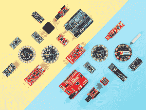

如果你更想直接进入**构建**什么的话，可以在 learn 上查看这些项目链接，也可以在其他地方找到基于 Arduino 的项目:

*   [Arduino 项目中心](https://create.arduino.cc/projecthub)
*   [工作台:SparkFun](https://edu.workbencheducation.com/partners/sparkfun)
*   [指令:Arduino](https://www.instructables.com/circuits/arduino/projects/)
*   [Hackster.io: Arduino](https://edu.workbencheducation.com/partners/sparkfun)
*   [ITP 物理计算维基](http://itp.nyu.edu/physcomp/Tutorials/Tutorials)
*   [制作:项目](http://makeprojects.com/c/Arduino)

或者我们任何一个标有 [Arduino](https://learn.sparkfun.com/tutorials/tags/arduino) 的教程。

[](https://learn.sparkfun.com/tutorials/qwiic-keypad-hookup-guide) [### Qwiic 键盘连接指南](https://learn.sparkfun.com/tutorials/qwiic-keypad-hookup-guide) If you are tired of taking up GPIO pins, wiring a bunch of pull up resistors, and using firmware that scans the keys taking up valuable processing time... check out the new Qwiic Keypad.[Favorited Favorite](# "Add to favorites") 0[](https://learn.sparkfun.com/tutorials/picobuck-hookup-guide-v12) [### PicoBuck 连接指南 v12](https://learn.sparkfun.com/tutorials/picobuck-hookup-guide-v12) The PicoBuck board is a high-efficiency three-channel constant-current LED driver.[Favorited Favorite](# "Add to favorites") 7[](https://learn.sparkfun.com/tutorials/qwiic-pro-micro-usb-c-atmega32u4-hookup-guide) [### Qwiic Pro 微型 USB-C (ATmega32U4)连接指南](https://learn.sparkfun.com/tutorials/qwiic-pro-micro-usb-c-atmega32u4-hookup-guide) An overview of the ATmega32U4-based Qwiic Pro Micro USB-C, how to install it, and how to use it with Arduino.[Favorited Favorite](# "Add to favorites") 2[](https://learn.sparkfun.com/tutorials/sparkfun-explorable-hookup-guide) [### SparkFun 可探索连接指南](https://learn.sparkfun.com/tutorials/sparkfun-explorable-hookup-guide) Check out our latest LoRaWAN development board with Bluetooth capabilities! With this guide, we'll get you passing data to The Things Network in no time.[Favorited Favorite](# "Add to favorites") 3****