# 创建一个保湿盒控制盒

> 原文：<https://learn.sparkfun.com/tutorials/creating-a-humidor-control-box>

## 概观

在本教程中，我将介绍 SparkFun 雪茄盒的设计和制作过程。保湿器是任何一种具有恒定湿度的盒子或房间，用于储存雪茄、香烟、烟斗烟草，或者在这种情况下是传感器。我将介绍如何设计一个 3D 软件模型，并使用 CNC 路由器制作它。

[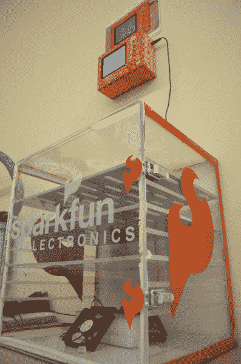](//cdn.sparkfun.com/assets/d/f/6/4/2/513f7015ce395f2848000000.JPG)*The finished project*

### 要求

我意识到下面的清单包括一些非常昂贵的物品，可能在每个人的家里/商店里都不太常见。我仍然想向不熟悉这些工具的人展示它们的用途。以下是我将使用的工具:

*   Creo Parametric 2.0(以前为 Pro Engineer，免费用于教育目的-软件)
*   视觉磨坊 5(软件)
*   Mach 2 数控系统(软件)
*   K2 数控机床(硬件)

### 背景

如果你还不知道，CNC 路由器是一种计算机控制的路由器，能够切割非常复杂的形状。CNC 代表[计算机数字控制](http://en.wikipedia.org/wiki/Numerical_control)。数控机床与计算机相连，并被赋予非常精确的三维坐标，机床应该向该坐标移动。使用马达和编码器的组合，这种机器能够切割出你能画出的几乎任何东西。有很多内容要讲，所以让我们开始吧。

## 3D 设计

我们的生产部门来找我，需要制造一个雪茄盒。他们需要一个更好的系统，在回流焊炉出来后对我们需要的几块电路板进行重新加湿。

我是一个非常视觉化的人。在开始制作之前，我想看看我到底设计了什么，以及它是如何组合在一起的。这样做，就很容易看到我的错误在哪里，并改正它们。

为了这个项目，我为它设计了雪茄盒和控制箱。控制盒允许我们的制作团队选择将哪块板子放入保湿盒，它会记录板子在里面的时间。它还确保湿度保持在所需的百分比。然而，在本教程中，我不会涉及太多的雪茄盒。我用激光切割丙烯酸树脂并用环氧树脂把它粘合成一个盒子的形状。当它干燥后，我在前门上加了一些密封条来密封它，并在所有的接缝处填堵以确保它的气密性。那里没发生太多事！

制作控制盒真的很有趣。我决定在所有的边缘切割“牙齿”,这样它就会像一个 3D 拼图一样组合在一起。在 Sparkfun，我们使用 Creo Parametric 2.0 进行 3D 建模。我们的 [Arduino 和试验板支架](https://www.sparkfun.com/products/11235)与我们所有的[零售蛤壳包装一起设计。](https://www.sparkfun.com/products/9890)我在高中时学过这个程序，在我一路走来用过的所有建模软件中，它是我的最爱。在我开始之前，我想告诉你这个教程只是触及了 Creo 特性的表面。我只打算介绍几个要点和特性，当然，要做到这一点，方法不止一种。开始设计吧！

(1)在下图中，我们将开始绘制控制箱的顶部面板。标有“前”、“上”和“右”的区域是我们的工作区。我们想要选择一个精确描述我们想要绘制的表面的。由于该面板将位于盒子的顶部，因此我将选择“顶部”平面。可能最常用的功能是“拉伸”命令。这使我们能够以我们想要的形状创建材料(或移除材料)。概括一下，我们选择“顶部”平面，然后单击“挤出”。

[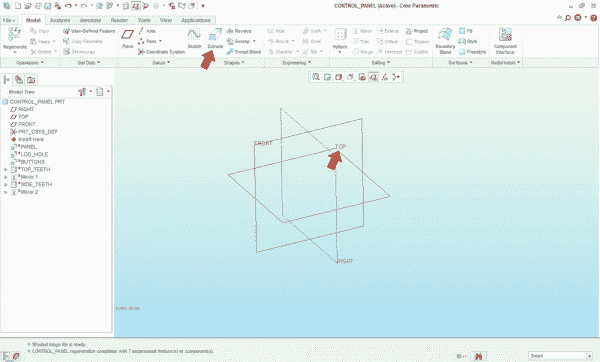](//cdn.sparkfun.com/assets/3/3/c/b/1/513f6a31ce395f1144000000.jpg)*(1) Choose Plane*

(2)这就把我们带到了草图。草绘器是我们绘制所需特征的地方。使用矩形命令，我将绘制一个矩形。我决定，我希望面板是 8 英寸宽，6 英寸高。绘制矩形时，尺寸会自动添加。我要做的就是把它们变成我想要的。一旦他们是正确的，我点击确定。

[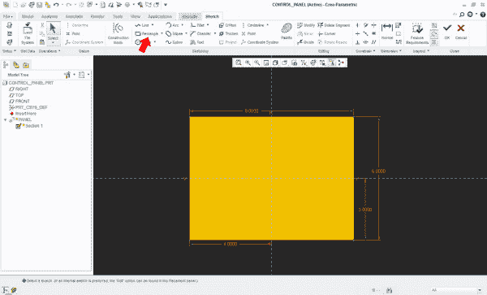](//cdn.sparkfun.com/assets/5/9/6/1/a/513f6a31ce395f1c44000000.jpg)*(2) Draw Rectangle*

(3)如果计算机接受了这个形状，它会给它增加深度。这就是我们从 2D 绘画转向 3D 模型的地方。因为我是从 0.35 英寸厚的胶合板上切割下来的，所以我将在所示的框中输入该值，然后单击“确定”。

[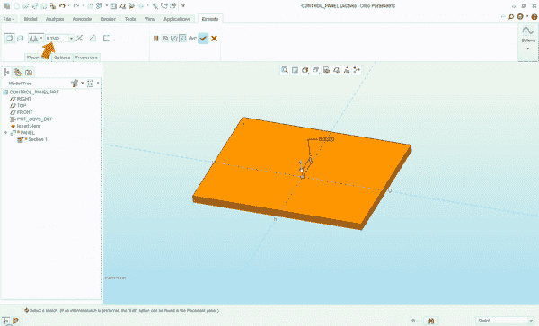](//cdn.sparkfun.com/assets/8/d/0/8/3/513f6a31ce395f0948000000.jpg)*(3) Time to go 3D!*

(4)接下来，我想为 LCD 和几个按钮切一个孔。我将选择要在其上创建 2D 绘图的曲面。在这种情况下，我将选择面板的顶部。为此，我将再次单击“拉伸”命令。请记住:挤出可以添加或移除材料。

[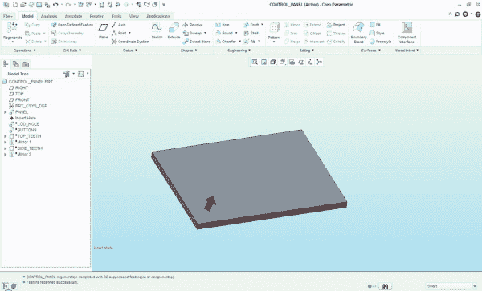](//cdn.sparkfun.com/assets/c/7/0/1/b/513f6a31ce395f6244000000.jpg)*(4) Select the surface to cut through*

(5)测量完 LCD 屏幕的尺寸后，我将使用矩形命令在我想要的地方画出孔。现在我想为按钮添加孔。我希望按钮在屏幕的右侧，我希望它们完美地排列在一起。我将用所谓的中心线来表示。您可以将中心线视为参考线或辅助线。在这幅图中，它们是紫色的虚线。到了创建 3D 模型的时候，计算机会忽略这些线，所以不管你有多少条线，也不管它们放在哪里。Creo 将在我点击的地方创建中心线，它将“捕捉”到一个垂直位置，确保按钮与面板完美对齐。

[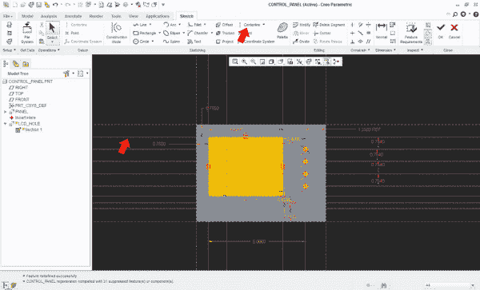](//cdn.sparkfun.com/assets/0/a/5/f/8/513f6a31ce395fab44000000.jpg)*(5) Drawing the cut-outs*

(6)默认情况下，挤压命令添加材料。因为我们想做一个剪切，我们用左边的“改变方向”按钮告诉计算机从我们画洞的地方剪切，同时用右边的“移除材料”按钮告诉它移除材料。结果就是我们想要的，一个 LCD 孔和几个按钮孔。我将对其他按钮重复此过程。

[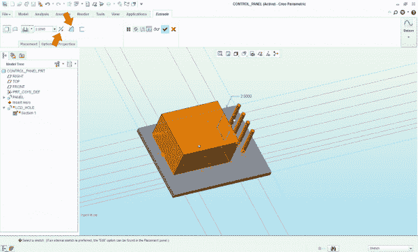](//cdn.sparkfun.com/assets/3/1/8/5/d/513f6a32ce395fcb45000000.jpg)*(6) Not what we want*[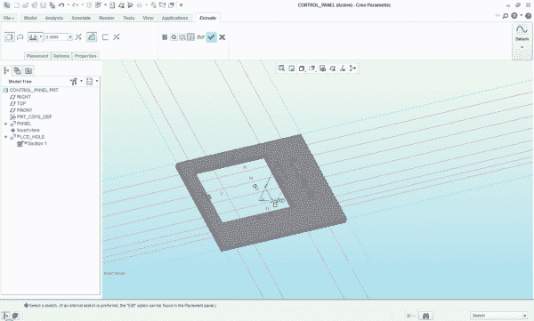](//cdn.sparkfun.com/assets/5/4/6/4/e/513f6a32ce395f3348000000.jpg)*(6) After a few changes to the settings, it is correct*

(7)现在是为边缘创建“牙齿”的时候了。像以前一样，我选择面板的顶部曲面，然后单击“挤出”。在草图编辑器中，我将绘制一个小矩形来表示我想要切掉的一颗牙齿。尺寸的红色表示我已经锁定了该尺寸。这阻止了我或计算机改变那个特定的维度。现在，我只打算画一个。我将在下一步告诉你为什么。

[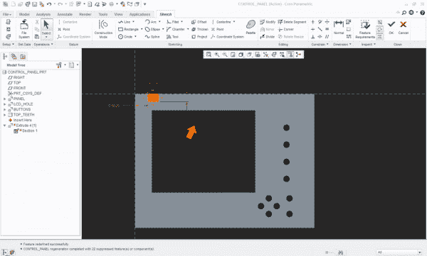](//cdn.sparkfun.com/assets/4/6/d/6/b/513f6a31ce395f3e48000000.jpg)*(7) We only need to draw one tooth*

(8)现在画 7 个切口不会花太多时间，但是如果我们需要在一个圆形齿轮上画 1000 个齿呢？那要花很长时间。为了节省时间，我将使用“模式”命令。这允许我复制一个我以前画过的特征。如果你看下图中的红色箭头，从左到右:

*   方向-告诉计算机您想要以直线模式，而不是圆形。
*   1 平面-如果你非常仔细地看，面板的右侧有一条橙色的线，这是我选择移动的方向。
*   7–我想复印的份数。
*   1.0625–每个副本之间的间距。黑点代表计算机将添加特征的位置。

[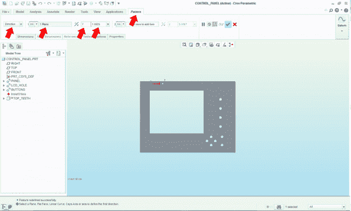](//cdn.sparkfun.com/assets/d/e/6/4/7/513f6a32ce395f3848000000.jpg)*(8) Setting up the pattern*

瞧啊。我们已经为我们的盒子创建了顶部 8 个齿！

[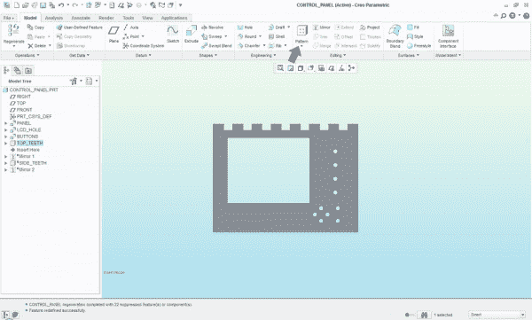](//cdn.sparkfun.com/assets/5/b/4/c/1/513f6a32ce395f2b46000000.jpg)*(8) The pattern looks correct*

(9)由于面板的顶部和底部都使用相同的图案，我们可以使用“镜像”命令轻松实现。我将再次打开平面并选择“前”平面，因为它穿过面板的中心。现在计算机会把我们画的单个牙齿复制到面板的底部。

[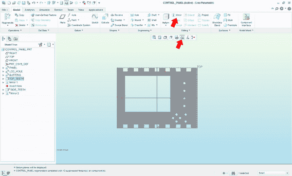](//cdn.sparkfun.com/assets/9/5/2/4/4/513f6a32ce395fe447000000.jpg)*(9) The Mirror command can save a great amount of time*

(10)我将对面板左侧和右侧的齿重复最后几个步骤。最后，我们完成了盒子的一部分！

[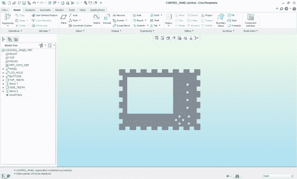](//cdn.sparkfun.com/assets/a/4/d/2/1/513f6a32ce395fff47000001.jpg)*(10) The finished face plate of the controller*

## 3D 装配

(1)使用与上面相同的技术，我继续制作盒子的侧壁和底部。现在我们有了盒子的 6 个独立部分，让我们把它们放在一起！在一个新文件中，我将使用“汇编”命令导入控制面板。

[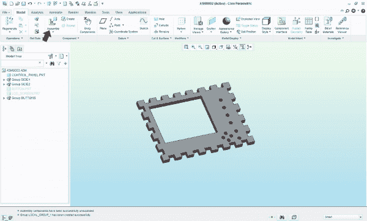](//cdn.sparkfun.com/assets/7/b/d/1/8/513f6a32ce395f1248000000.jpg)*(1)Assembling the box*

(2)接下来，我将告诉计算机我不想移动这个棋子。我将围绕它构建所有其他部分，所以让它保持静止是件好事。通过右键单击模型树中的零件，我可以选择“固定位置”。我的问题已经解决了，所以会显示取消解决的选项。

[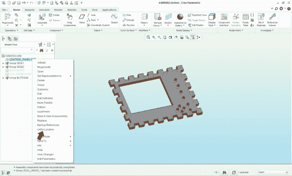](//cdn.sparkfun.com/assets/0/9/6/a/a/513f6a32ce395ff658000000.jpg)*(2) Fixing the location prevents it from moving*

(3)接下来，我将添加盒子的另一部分。使用之前的装配命令，我将引入我想要的零件。如果你看图，‘巧合’这个词出现了好几次。这或多或少是告诉计算机“让这两个表面接触或对齐”的方式。简单来说，我选择哪些表面应该对齐，计算机会将它们“粘合”在一起。

[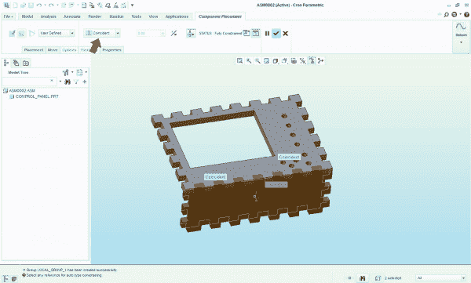](//cdn.sparkfun.com/assets/9/1/f/9/e/513f6a32ce395ff347000000.jpg)*(3)Adding more parts to the assembly*

(4)重复这个过程四次以上，我们就得到一个完整的盒子！现在，我们可以检查所有的边，看看我们是否在任何特征的长度或位置上犯了任何错误。

[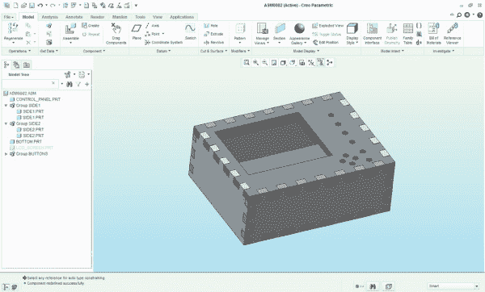](//cdn.sparkfun.com/assets/0/3/0/2/4/513f6a32ce395fe147000000.jpg)*(4) The assembled box*

(5)让我们继续添加 LCD 屏幕和按钮，只是为了好玩。

*(5) Added the LCD and buttons*

(6)我们现在可以使用“分解视图”命令来查看盒子，就像它被拆开了一样。

*(6)The exploded view with temporarily split apart the assembly*

(7)现在，I box 已经设计、组装和检查完毕，我们可以准备在 CNC 路由器上切割文件了。在 Creo 中，我们想要创建一个新的绘图。

[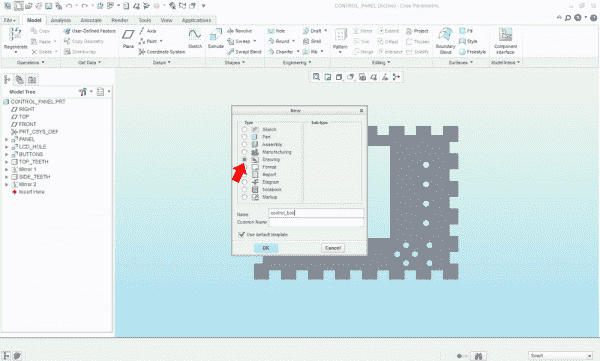](//cdn.sparkfun.com/assets/7/7/9/d/d/513f6a32ce395fbe44000000.jpg)*(7) Creating a new drawing*

(8)因为此时我们只关心每个部分的 2D 特征，所以这些部分可以平放在屏幕上。

[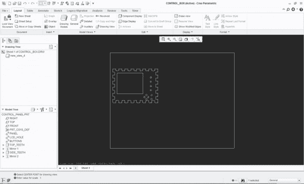](//cdn.sparkfun.com/assets/8/8/6/7/4/513f6a33ce395fd347000000.jpg)*(8) The 3D model is no longer needed*

(9)在添加了所有视图之后，我们将整个盒子展示在我们面前。

[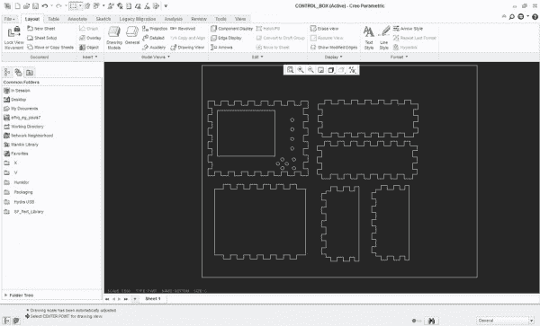](//cdn.sparkfun.com/assets/b/a/4/7/e/513f6a32ce395fdb47000000.jpg)*(9) Each part in a 2D view*

(10)最后，我们想将此图导出为. dxf 文件。许多不同类型的程序都支持这种类型的文件，所以这是一个很好的选择。

[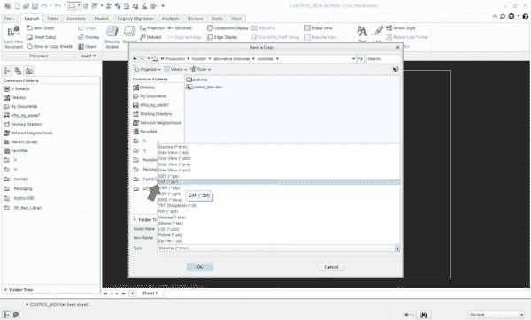](//cdn.sparkfun.com/assets/f/a/5/d/b/513f6a32ce395fe847000000.jpg)*(10) Exporting the drawing for later use*

## 创建刀具路径

我正在使用一个名为 Visual Mill 的程序来创建盒子的刀具路径。刀具轨迹是数控机床切割盒子所遵循的区域。

首先，我将打开。我们保存的 dxf 文件。然后我们需要选择我们将要使用的立铣刀的尺寸。

[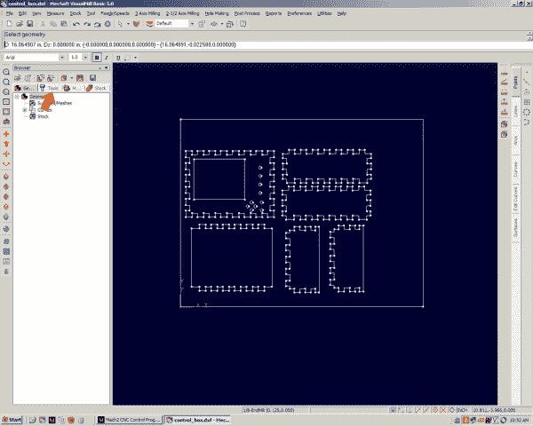](//cdn.sparkfun.com/assets/f/d/a/1/e/513f6d99ce395fbd47000000.jpg)*(1) Open the file, choose the bit*

(2)我将使用 1/8 英寸的立铣刀。如果需要，我们可以输入我们工具的具体特性。一切看起来都很好，所以我会选择确定。

[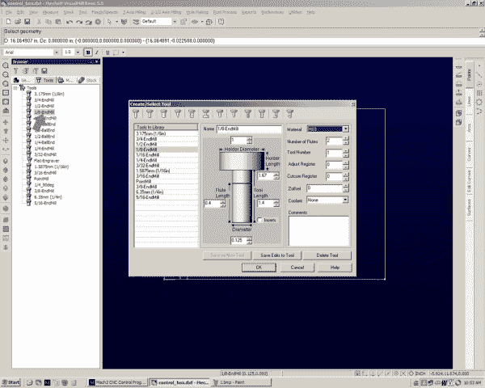](//cdn.sparkfun.com/assets/6/a/3/c/8/513f6d99ce395fc747000001.jpg)*(2) Select the ⅛” bit*

(3)接下来，我将选择我们想要剪切的所有内容。选定的线变成黄色，这样用户就可以知道它们被选中了。我们想做一个“侧面”类型的切割。轮廓切割将切割零件的内侧或外侧，并保持中心完整。

[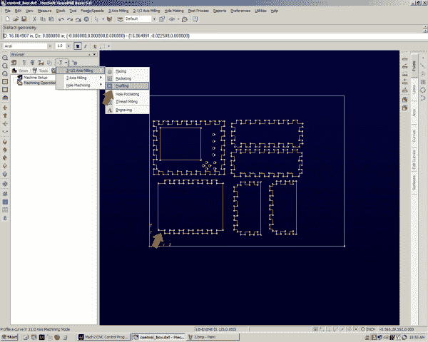](//cdn.sparkfun.com/assets/8/4/5/1/2/513f6d99ce395f1244000003.jpg)*(3) Select lines, choose cut type*

(4)接下来，我们必须定义几个选项。我们将“公差”设置为 0.001 英寸，以获得良好的精度。“切割方向”告诉计算机顺时针或逆时针切割。对于木材,“传统”切割效果很好。这将使工具上的刀刃旋转到材料中(想象一下当汽车慢慢向前爬行时，汽车轮胎在路面上旋转)，并防止木材剥落而不是被切割。最后，“切割开始侧”告诉计算机在选定线的内侧或外侧切割。我们想在外面切。

*(4) Setting cut parameters*

(5)在下一个选项卡上，我们定义切割深度。这就是为什么我在前面的教程中说我们只关心零件的 2D 特征。“总切割深度”告诉计算机；是的，你猜对了，我们要切多深。因为木头有 0.35 英寸厚，所以我们用 0.36 英寸来确定。“粗加工深度”和“精加工深度”是允许用户非常精确地控制 CNC 在给定时间切除多少的方法。既然我们砍的是木头不是金属，就不需要太担心这个。我已经告诉机器切削深度为 0.09 英寸。这意味着需要 4 次通过才能穿过。

[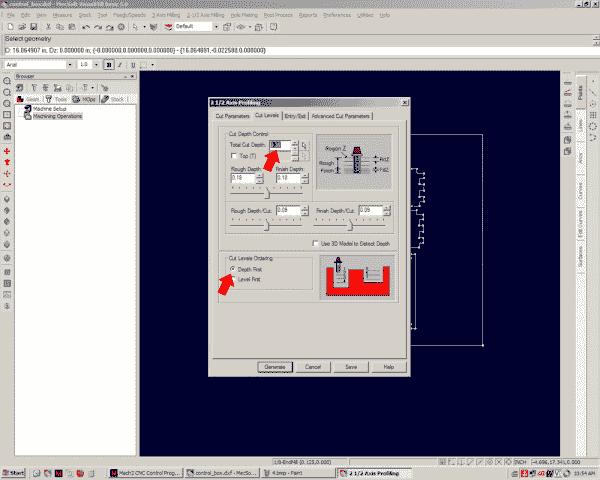](//cdn.sparkfun.com/assets/1/f/c/7/5/513f6d99ce395f4548000000.jpg)*(5) Setting the cut depth and step distance*

(6)最后，该选项框是进近和接合动作。因为我的钻头是中心切削钻头，所以我可以进行所谓的切入切削。有些钻头可以直接钻入材料，而有些则不能。这是因为一些刀具的齿没有一直延伸到钻头的中心。然而，这些刀具可以以 45 度左右的角度向下切割(称为斜面切割)。我们可以将所有这些值设置为零。这将使磨机移动到位，并直线下降(投入)。把它想象成推土机切入地面(斜坡切割)和挖掘机在一个地方挖掘(切入切割)。“切割转移”告诉 CNC 从一个点移动到另一个点时要提升多高。由于我使用的胶合板有些翘曲，我将使用 0.25 英寸，以确保机器在移动时不会意外切入木材的高点。

[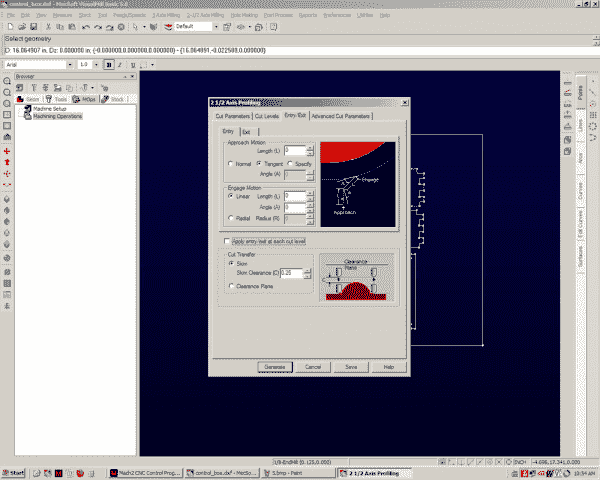](//cdn.sparkfun.com/assets/b/f/4/c/7/513f6d9ace395fc947000000.jpg)*(6) Telling the CNC how we want it to move*

(7)这里我们可以看到已经创建的刀具轨迹。如果你观察浅蓝色的线，你可以准确地看到立铣刀将要切削的位置。嗯……等一下，有些事情看起来不对劲。刀具轨迹在零件的内部。如果我们运行这个，面板会太小！

[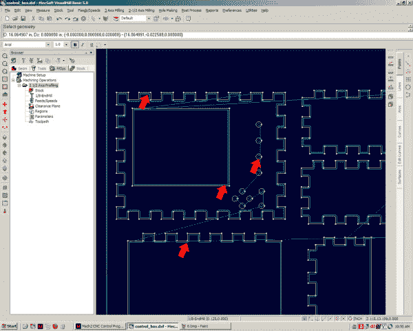](//cdn.sparkfun.com/assets/c/7/d/f/6/513f6d9ace395f2148000001.jpg)*(7) Incorrect tool path*

(8)简单易行！我只需编辑刀轨，并将“切割开始侧”从左改为右。这将在正确的一侧生成刀具轨迹。

[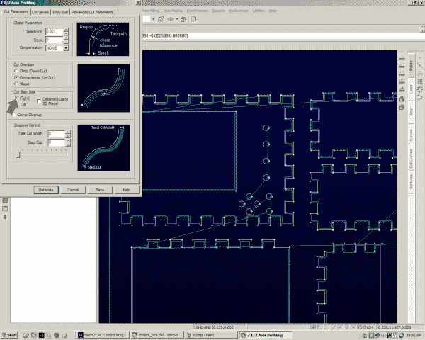](//cdn.sparkfun.com/assets/9/8/6/2/a/513f6d9ace395f3145000000.jpg)*(8) Change the start side to correct the problem*

(9)固定面板刀具路径的井。切割痕迹在零件的外侧，这是我们想要的，但是看看 LCD 孔和按钮孔。现在他们在外面。如果我们现在运行 CNC，它们会太大。所以我想我们不能同时选择所有的东西。我将为轮廓做一个工具路径，为 LCD +按钮做一个工具路径。

[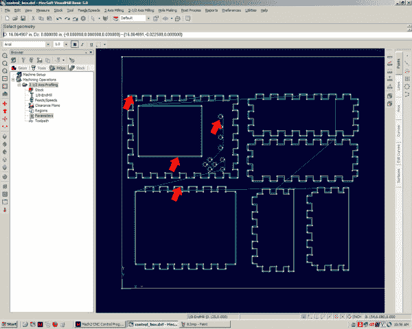](//cdn.sparkfun.com/assets/6/8/5/3/e/513f6d9ace395f1044000000.jpg)*(9) We’ll need 2 separate paths for this*

(10)那里！现在一切看起来都应该如此。刀具轨迹位于我们要切割的零件的外部和内部。这些绿线表示机器将提升钻头并移动到新区域的位置。

[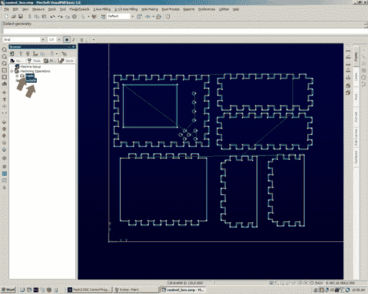](//cdn.sparkfun.com/assets/c/1/c/f/7/513f6d9ace395f0446000000.jpg)*(10) Everything looks correct now*

(11)现在我们可以将刀具轨迹导出为 g 代码。g 代码是一种格式，计算机以这种格式告诉 CNC 向哪里移动，一次一个点。CNC 沿直线从一点移动到下一点。你可以想象一个圆，有很多很多的坐标。我们使用的 CNC 控制器程序名为 Mach2，因此我将告诉它导出为 mach 2。

[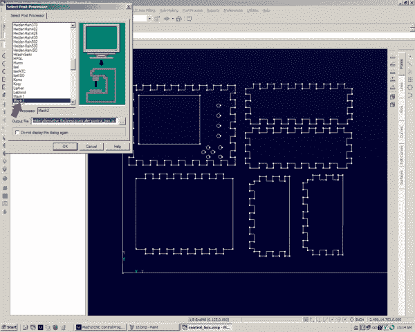](//cdn.sparkfun.com/assets/1/e/6/6/d/513f6d9ace395f0244000002.jpg)*(11) Exporting the tool paths*

(12)我们马上就要到了！这是 Mach2(见下文)，该程序读取 g 代码并向 CNC 机床发送脉冲命令。我将解释我突出显示的区域。

g 代码–这是加载到程序中的 g 代码。N10 代表 1 号线。G 命令告诉计算机，我们要将切割钻头移动到某个位置，而不切割任何东西。如果愿意，一个人可以在一个文本文件中写下整个刀具轨迹。不过，这可能需要一段时间。查看 wiki 页面上的 g 代码，获得所有代码的完整列表！

位置–这是 CNC 电机上的编码器报告的切割钻头中心的当前位置。这里使用 x、Y 和 Z 轴(我们有一个 3 轴 CNC ),但没有使用第四轴。

用户设置–点动设置设置运动的速度限制。如果我想手动移动数控头到某一点，我可以使用键盘。如果我点击一次箭头键，CNC 头将移动步长框中设置的距离，在本例中为 0.001”。如果我按住 shift 键并按下箭头键，只要我按住该键，CNC 就会快速移动。“慢进给速度”限制了 CNC 在快速移动过程中的移动速度。

单位/分钟——这显示了磨机运行的速度。当我切割木头时，通常是每分钟 15-30 英寸。

速度控制——我没有在 Visual Mill 中向您展示这一点，主要是因为我很少调整它，但有几个速度设置用于不同的事情。我们可以设置切割材料的速度、切割钻头上下运动的速度、CNC 进行非切割运动的速度等。速度控制让我们可以同时手动加速或减速所有这些设置。

视觉化——这个区域显示了 3 件事。蓝色的线是铣刀将要切掉的部分，绿色的线显示铣刀已经切掉的部分(我们还没有切掉任何部分)，黄色的十字准线显示立铣刀中心的位置。

这里的一些其他功能在我们的 CNC 上是不可用的。例如，雾和洪水按钮控制是否冷却剂被喷洒在我们的一部分。我们的 CNC 上没有冷却液，所以我们不使用这个功能。

[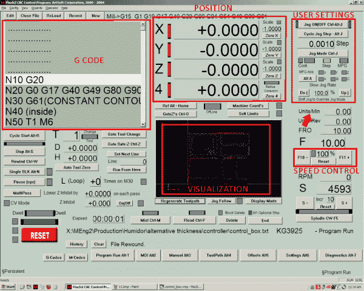](https://cdn.sparkfun.com/assets/2/7/b/1/5/513f6d9ace395f8648000000.jpg)*(12) The CNC control layout*

## 该剪了

(1)一旦机器安装完毕，就该将木材放置到位了。我将使用一些普通的 3/8”胶合板。因为会有大量的力从立铣刀推入木材，所以将木材固定到工作台非常重要。我们的 CNC 有一个网格图案的螺纹孔，允许任何尺寸和形状的零件(好吧，几乎任何尺寸和形状)安全地安装到床上。

[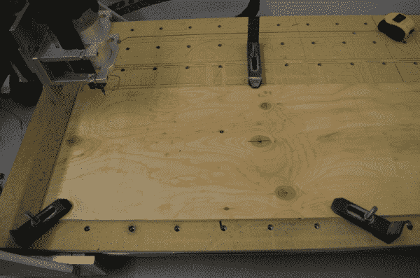](//cdn.sparkfun.com/assets/d/c/b/0/d/513f7015ce395f3848000001.JPG)*(1) It is very important that the piece does not move*

(2)接下来我们需要告诉机器木材的位置。因为我们可以把木头放在床上的任意位置，我们需要确保机器知道从哪里开始切割。我们通过将钻头的中心放在胶合板的左下角，并点击“零 X”和“零 Y”按钮来实现这一点，这两个按钮显示在我在上一节中标记的位置框中。因为我们的胶合板比它需要的要大，所以我们的定位不需要精确。靠近底角的任何地方都可以。

[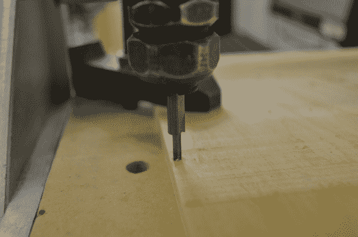](//cdn.sparkfun.com/assets/2/6/a/6/c/513f7015ce395f2b48000000.JPG)*(2) Setting the (0,0) position*

(3)完成所有设置后，我们可以点击“循环开始”按钮，惊奇地观察零件被切割出来的过程。你将不得不相信我的话，因为你只能看到一张照片。但是相信我，看起来真的很有趣！

[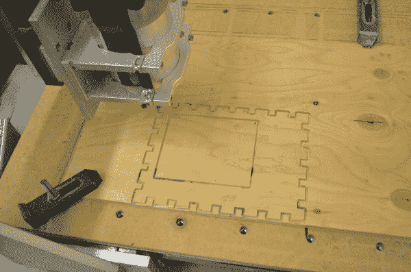](//cdn.sparkfun.com/assets/8/1/e/8/6/513f7015ce395f3348000001.JPG)*(3) One piece of the box*

盒子被切割出来后，我给它上色，然后把碎片拼在一起。我把所有的电子元件都加了进去，然后粘了上去。

[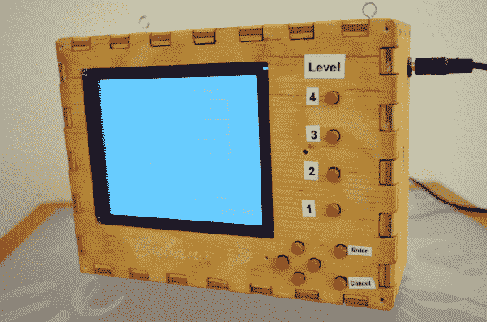](//cdn.sparkfun.com/assets/c/1/6/9/6/513f8767ce395f1644000000.JPG)*(4) The finished box*

## 资源和更进一步

哇，多么疯狂的旅程！我们从计算机生成的模型一直到成品。当然，我可以买一个雪茄盒，但是那有什么意思呢？那是什么？你不想用制图软件画零件？看看这个[箱式发电机！](http://boxmaker.rahulbotics.com/)

查看另一个 [Creo 示例。](http://www.youtube.com/watch?v=CYeX5YsOF4o)