# 电子组件

> 原文：<https://learn.sparkfun.com/tutorials/electronics-assembly>

## 台阶

SparkFun 有一些非常另类的组装电子产品的方法。我们收集了过去十年 DIY PCBA(印刷电路板组装)的一些步骤和经验。我们已经发展到了这样一个地步，有些事情在你家的地下室里做是没有意义的，但是如果你想知道我们是怎么做的(一个月制作超过 80，000 个小部件)，请继续阅读。

我们将从生产的最前端开始。这意味着设计已经过审查、原型制作、审核，并“进入红色电路板”(一旦绿色原型准备好生产，我们就将 PCB 制成红色)。现在我们只需要建造这个东西！

如果你对电子学完全陌生，你可能想检查一下 [PCB 基础知识](http://learn.sparkfun.com/tutorials/pcb-basics)。

 [### PCB 基础知识

#### 2012 年 12 月 14 日](https://learn.sparkfun.com/tutorials/pcb-basics) What exactly IS a PCB? This tutorial will breakdown what makes up a PCB and some of the common terms used in the PCB world.[Favorited Favorite](# "Add to favorites") 50

SparkFun 的电子组装通常要经过七个步骤:

*   粘贴模版印刷
*   安置
*   回流
*   手动装配
*   检验和测试
*   洗涤
*   包装

这里有一个简短的视频向你展示所有的步骤，一个非常愚蠢的视频:

[https://www.youtube.com/embed/VNW4dmqbr9o/?autohide=1&border=0&wmode=opaque&enablejsapi=1](https://www.youtube.com/embed/VNW4dmqbr9o/?autohide=1&border=0&wmode=opaque&enablejsapi=1)

现在我们来看一下每一步...

## 镂花涂装

[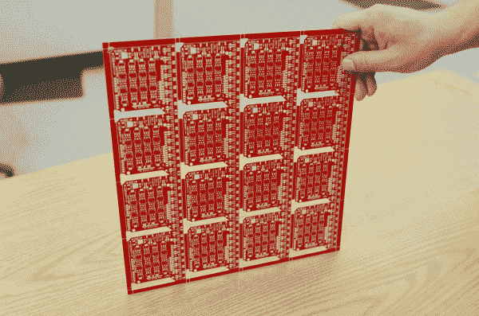](//cdn.sparkfun.com/assets/d/9/0/1/7/513e66face395f525e000000.JPG)*16 copies of the [EL Escudo Dos](https://www.sparkfun.com/products/10878)*

锡膏模版印刷很像丝网印刷 t 恤。你有一个面具，你把它放在你想涂墨水的东西上面。在我们的例子中，我们使用金属模板将锡膏涂到 PCB(印刷电路板)的特定部分。

在 SparkFun，我们从 PCB 面板开始。面板是一个更大的板，设计重复几次，使处理更容易。在这种情况下，我们有 16 份 [EL Escudo Dos](https://www.sparkfun.com/products/10878) 副本。我们制作这些更大的面板，这样我们可以同时在多块板上刻模板。然而，你也可以一次只刻一块板。

[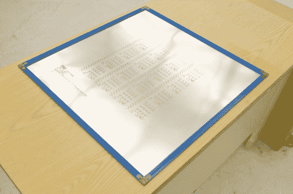](//cdn.sparkfun.com/assets/7/7/6/6/3/513e66face395fa75f000000.JPG)*Solder paste stencil, also called a ‘foil’.*

在每个将要放置元件的焊盘上涂上少量焊膏。为了使这一过程更快，将一张模板铺在板上，用金属刮板将糊状物涂抹在模板上。

[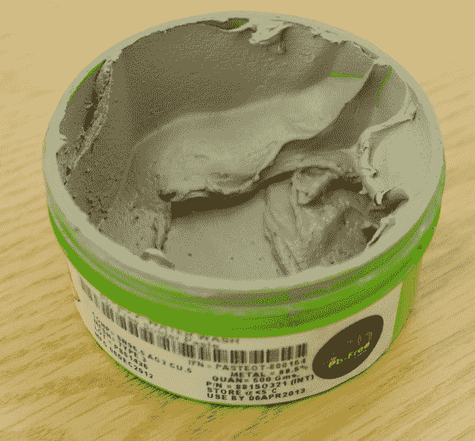](//cdn.sparkfun.com/assets/f/2/3/c/6/513e672cce395f525e000001.JPG)

这是焊锡膏在野外的样子。它是金属合金的混合物:96.5%的锡(Sn)，3%的银(Ag)，和 0.5%的铜(Cu)。大多数牙膏都有有效期，应该存放在阴凉的地方。这与添加到金属中的焊剂有关，因此产生了糊状物的稠度。焊剂改变了液态金属的表面张力，有助于金属流入接缝。

我们使用[无铅焊膏](https://www.sparkfun.com/products/10605)，但是如果你不打算在欧洲销售你的产品，那么[含铅焊膏](https://www.sparkfun.com/products/10448)会稍微宽容一些，也更容易使用。

我们在 [Eagle PCB](http://www.cadsoftusa.com/) 中设计所有电路板。该软件输出 PCB 制造商用来创建实际 PCB 的各种层文件。也有两层(顶部粘贴和底部粘贴)我们发送给我们的[模板制造商](http://www.soldermask.com/)。他们使用高功率 CO [2] 激光从薄不锈钢板上切割出模板。

[https://www.youtube.com/embed/Cc0UDire1P4/?autohide=1&border=0&wmode=opaque&enablejsapi=1](https://www.youtube.com/embed/Cc0UDire1P4/?autohide=1&border=0&wmode=opaque&enablejsapi=1)

模版印刷可以手工完成。在上面的视频中，Abe 快速演示了如何排列模板和涂抹焊膏。查看这个[精彩的演示](https://learn.sparkfun.com/curriculum/48)，获取更多关于模版印刷的照片和信息。

[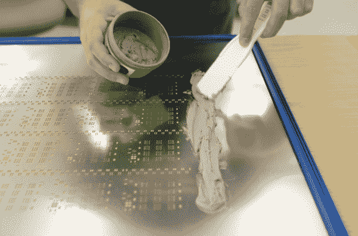](//cdn.sparkfun.com/assets/f/d/8/b/f/513e672cce395f8c60000000.JPG)

把浆糊滴到蜡纸上并不神奇。我们喜欢使用当地五金店现成的油灰刀。

这是 SparkFun 的喷码机。安装机器的工作量很大，但是对于非常大的批量(大于 500 件)，这使得印刷变得稍微容易一些。

[https://www.youtube.com/embed/OyP3ulPGeZc/?autohide=1&border=0&wmode=opaque&enablejsapi=1](https://www.youtube.com/embed/OyP3ulPGeZc/?autohide=1&border=0&wmode=opaque&enablejsapi=1)

## 拾取和放置

[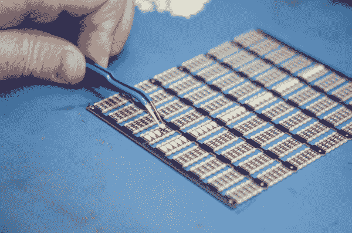](//cdn.sparkfun.com/assets/9/6/9/8/c/513e681cce395fdb62000001.JPG)

一旦电路板被涂上浆糊，元件就被放在上面。这可以用手工或机器来完成。使用[镊子](https://www.sparkfun.com/products/10602)是放置组件的好方法。有一个常见的谬论，你需要大型、昂贵的机器来制造电子产品。不是真的！人类放置元件的速度非常快，液态金属的表面张力使得大多数元件在回流期间会移动到它们的正确位置。但是人类的耐力是有限的。几个小时后，快速放置组件变得更加困难。组件的小尺寸也容易使眼睛疲劳。

**You don’t need a pick and place machine to make electronics; you need a pick and place machine to build *a lot* of electronics.**

SparkFun 从手工放置所有组件开始，现在仍然如此！但是，如果我们有超过 100 个单元要制造，我们就使用一台取放机来制造大量的电路板。

拾取和放置(PNP)机是一种机器人装配设备，它使用真空将元件从一片胶带上提起，将其旋转到正确的方向，然后将其放置在电路板上。装配一台机器需要几个小时，但是一旦一切运转起来，就非常快了。

在大型工厂中，传送带通常将电路板直接从自动焊膏沉积机运送到取放机；在 SparkFun，我们在生产车间手动移动电路板。

[https://www.youtube.com/embed/yI5I9Q7tf84/?autohide=1&border=0&wmode=opaque&enablejsapi=1](https://www.youtube.com/embed/yI5I9Q7tf84/?autohide=1&border=0&wmode=opaque&enablejsapi=1)

*Bob shows us SparkFun’s new MYDATA PNP machine. It's pretty awesome.*

## 回流

在取放后，焊膏必须回流以形成牢固的焊点。电路板被放在传送带上，传送带缓慢地通过一个大烤箱，使电路板暴露在足够的热量下熔化焊料(大约 250 摄氏度！).当电路板通过烤箱时，它会遇到不同的温度区域，使其以可控的速度升温和降温。

[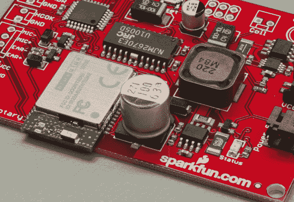](//cdn.sparkfun.com/assets/b/3/0/4/d/513e685fce395f3162000001.JPG)

这里我们有臭名昭著的[便携式旋转电话](https://www.sparkfun.com/products/287)的控制板，元件放在焊膏上。这浆糊很粘，就像黄油粘在盘子上一样。当电路板缓慢通过回流焊炉时，元件保持不动。

[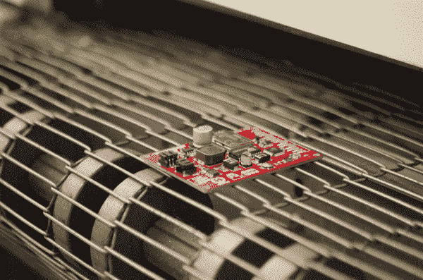](//cdn.sparkfun.com/assets/c/a/5/0/d/513e6860ce395f2c60000000.JPG)*A populated board as it slowly enters the reflow oven*

回流炉有点像披萨炉。电路板的温度被升高到 250 摄氏度(约 480 华氏度)，在这一点上，糊状物变成液态金属。当电路板离开回流焊炉时，它会迅速冷却，将所有元件焊接到位。

[https://www.youtube.com/embed/N_195d7bP9M/?autohide=1&border=0&wmode=opaque&enablejsapi=1](https://www.youtube.com/embed/N_195d7bP9M/?autohide=1&border=0&wmode=opaque&enablejsapi=1)

视频展示了一个 DIY 烤面包机烤箱，展示了回流焊的各个阶段。开始时，你可以看到各种焊盘上的锡膏灰点。这种浆糊可能是手工涂抹的，而不是用模版印刷的；在视频的后面，你会明白为什么马虎的因素并不那么重要。大约 1 点 05 分，第一个里程碑过去了:糊状物中的焊剂变得更加流动，并开始形成水坑。金属焊料还没有熔化。大约在 3:10，焊料开始熔化，熔化的焊料的表面张力使熔化的焊料形成尽可能小的物体:以焊盘为中心的一滴。

你还可以看到焊料回流时移动部件的程度。一些零件最终被放错了地方，以后需要返工。然而，这种收缩和移动器件的趋势意味着小的不对准和杂散焊料往往会在很大程度上成为自我纠正的问题。然而，对于非常小的零件，如果零件的一端比另一端拉得更紧，结果可能是零件竖起来；这被称为*墓碑*，它会导致电路板出现功能缺陷。

[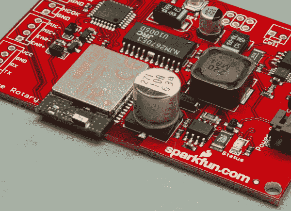](//cdn.sparkfun.com/assets/8/4/c/7/2/513e6860ce395f4062000000.JPG)

触摸起来很酷，现在该板已将所有 SMD 元件完全焊接到 PCB 上。现在，电路板已经准备好进行下一步了！

### 你怎么做双面纸板？

我们的一些组件(例如 Arduino Fio T1)在电路板的两面都有零件。在这种情况下，具有最少和最小元件的一面首先被印刷和回流。一旦电路板离开回流焊炉，就在第二面上印刷、放置和回流焊。金属的表面张力很高，能把所有东西固定住。在拥有更大、更复杂组件的工厂中，电路板的各个部分可能会在拾取和放置步骤中粘合到位，以确保元件在回流过程中不会移动。

## 手工焊接

[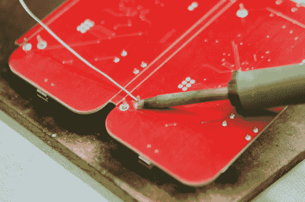](//cdn.sparkfun.com/assets/5/4/a/2/0/513e90eece395f5f62000000.JPG)

回流后，技术人员拿起电路板，手动焊接任何 PTH(电镀通孔)元件。在较大的生产设施中，通孔元件的焊接可以使用一种称为[波峰焊接](http://www.google.com/#hl=en&q=wave+soldering)的技术来完成，其中电路板通过熔化焊料的驻波，焊料粘附在元件引线和电路板上任何暴露的金属上。

[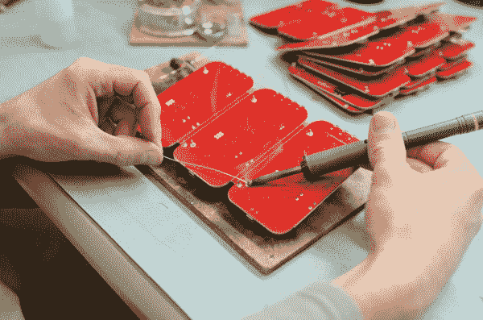](//cdn.sparkfun.com/assets/c/1/a/6/a/513e90eece395f3162000002.JPG)

由于 SparkFun 的不同设计和数量的高度混合，我们发现尽可能多地推动 SMD(表面贴装器件)和手工焊接任何 PTH 元件更容易。我们在生产车间使用 Hakko FX-888D 烙铁。他们的工作令人惊叹，但较低的成本 [Atten 937b](https://www.sparkfun.com/products/10707) 非常适合入门级焊接。

[https://www.youtube.com/embed/f95i88OSWB4/?autohide=1&border=0&wmode=opaque&enablejsapi=1](https://www.youtube.com/embed/f95i88OSWB4/?autohide=1&border=0&wmode=opaque&enablejsapi=1)

*Here's Dave showing us how to do basic soldering.*

## 检验和测试

[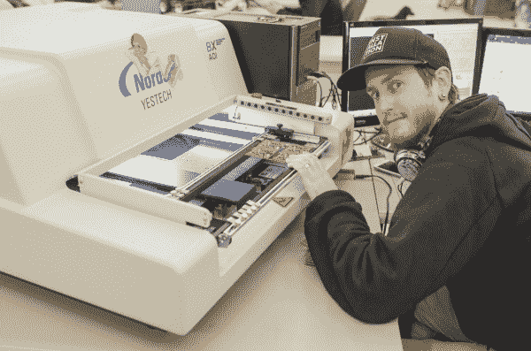](//cdn.sparkfun.com/assets/7/5/4/3/e/513e9368ce395f6e62000000.JPG)

下一步是*光学检查*。光学检查可以发现零件的任何问题(错误的电阻器、缺失的盖子等)。).AOI(自动光学检测)机是*快*。你看了[的视频](http://www.youtube.com/watch?v=VNW4dmqbr9o)，对吧？这非常接近实时。AOI 使用一系列不同角度的高倍摄像机来观察焊接连接的不同部分(有时称为*圆角*)。好的和坏的焊脚反射光不同，因此 AOI 使用不同颜色的发光二极管照亮和检查每个连接，非常准确，高速。挺甜蜜的。

你的电路板需要光学检查吗？大概不会。直到我们一个月做了 30，000+板，发现所有的错误变得越来越难，我们才得到一个。

[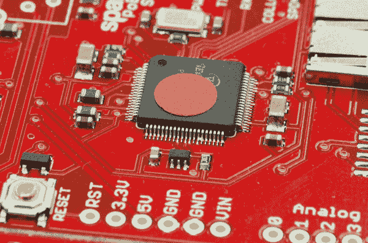](//cdn.sparkfun.com/assets/a/f/2/c/1/513e9368ce395f5260000000.JPG)*Can you see the problem?*

我们通过我们的自动光学检查(AOI)机器运行大多数的董事会。光学检查确保所有正确的元件都在电路板上的正确位置，具有正确的焊脚，相邻引脚之间没有跳线。

[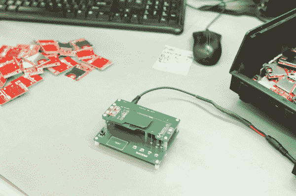](//cdn.sparkfun.com/assets/1/b/7/a/b/513e945bce395f1960000001.JPG)

一旦电路板被检查过，它就被测试以确保它做了它应该做的事情。

想象一下，如果测试一块电路板需要 15 秒钟。如果要测试 10 块板呢？大约 3 分钟。1500 呢？这是超过 6 个小时的令人麻木的测试。我们花了大量的时间来尽可能快地编写测试程序和程序。

为了加快这一过程，我们的技术人员使用测试夹具，有时称为 *pogo bed* 以实现快速测试。[弹簧针](https://www.sparkfun.com/products/8870)使用弹簧加载的头部来创建到板上各种点的临时电连接，用于电源和数据。一旦板或面板被装载到 pogo 床上，我们运行各种测试，以确保板完全电气功能。这可能包括测试稳压器的电压输出、某些引脚上的预期电压，以及向被测电路板发送各种命令以确保其正确响应。在需要编程或校准的电路板上，需要采取额外的步骤来加载代码和验证输出。

较大的设施可能会在给电路板供电之前，使用飞针或钉床固定装置来测试电路板上每个连接的连续性。这些较大的固定装置适用于更复杂、更昂贵的产品，但经常需要花费数万美元来制造。

## 洗涤

制造过程的各个步骤都会在电路板上留下残留物。如果你曾经组装过我们的套件，你会知道焊接会在电路板上留下少量的助焊剂。经过几个月的时间，这种焊剂残渣变得粘粘的，看起来很可怕，并且会变成微酸性，导致焊点变弱。为了防止这种情况(并给顾客最好看的纸板),我们对生产的每块纸板都进行清洗。

[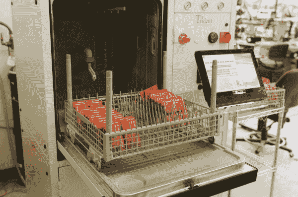](//cdn.sparkfun.com/assets/1/2/8/d/9/513e9590ce395f8c60000001.JPG)

为了再次清洗电路板，我们将一批批电路板放入所谓的“洗碗机”中。这种高温、高压、全不锈钢洗碗机使用去离子水去除制造过程中的任何残留物。

零件清洗机使用闭环系统。洗涤完成后，废水被收集在洗衣机下方的水池中，并自动测试电导率。如果电导率非常低(如果电阻非常高)，则洗涤阶段完成，废水通过非常高质量的过滤器再循环。

没错！我们把你昂贵的电子产品完全浸入水中。秘密在于水的类型。去离子水是不含任何离子的非常纯净的水。当你把手机扔进厕所时，水不会杀死你的手机，而是离子让电短路设备的各个部分。因为去离子水不含离子，所以它对人体的毒性相当大。虽然处理去离子水是安全的，但饮用去离子水可能会对你的身体造成严重损害，因为它会迫使你的身体在摄入时释放离子。因为 DI 水有这么渴(哈！)对于离子来说，洗碗机内部完全由不锈钢制成。任何其他金属都会很快分解。

[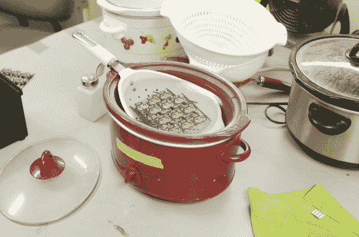](//cdn.sparkfun.com/assets/0/8/b/8/3/513e99abce395f2762000000.JPG)

没有昂贵的洗衣机？一个便宜的装有去离子水的茶壶和一把牙刷就能流畅地工作！如果你只是清洁几块电路板，用棉签蘸点异丙醇会非常有效。

[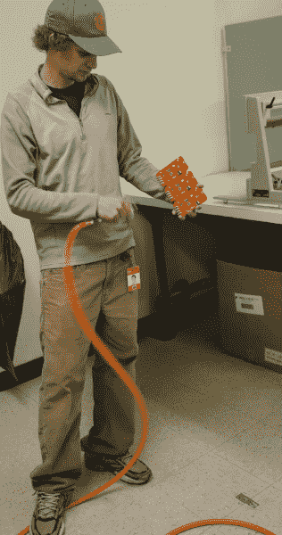](//cdn.sparkfun.com/assets/e/e/7/0/3/513e9a25ce395fe362000000.JPG)

风扇或压缩空气可以很好地去除残留的水分。

## 包装

[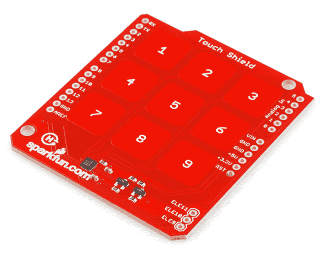](//cdn.sparkfun.com/assets/1/1/d/5/8/513e9b20ce395f775e000000.png)

董事会即将到达其旅程的终点！

[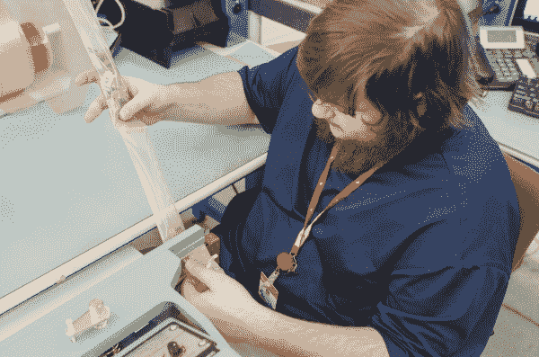](//cdn.sparkfun.com/assets/b/8/f/2/8/513e9a96ce395f6162000000.JPG)

一旦这批电路板清洁干燥后，它们将被包装，每块电路板都被单独热封到 ESD 塑料中。

[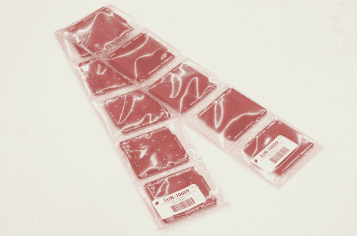](//cdn.sparkfun.com/assets/d/6/6/a/3/513e9a94ce395f1e5f000000.JPG)

因为提货和包装订单需要尽可能快，所以我们确保每件产品都为运输部门“准备好提货”。对于大多数产品，我们将创建一个由 10 件产品组成的链，每端都有一个条形码标签。条形码标签包含产品名称、SKU 和批次标识符，有助于我们跟踪任何问题。

产品包装完成后，会被送到运输车间。我们记录离开的库存，扣除所有的*在制品*零件，并将新的数量添加到我们的店面库存中。然后，该产品开始了一个全新的旅程。我们改天再来看这个教程。

## 资源和更进一步

感谢您在 SparkFun 查看我们如何制造电子产品。既然你已经读了一点，我们建议你查看更多的教程:

*   [印刷课程](https://learn.sparkfun.com/curriculum/48)
*   [连接器基础知识](http://learn.sparkfun.com/tutorials/connector-basics)
*   [如何使用万用表](http://learn.sparkfun.com/tutorials/how-to-use-a-multimeter)
*   [导电线](https://learn.sparkfun.com/tutorials/sewing-with-conductive-thread)

或者在 SparkFun 查看一些与生产和制造部件相关的博客帖子！

 [### 小熊杰瑞

July 8, 2014](https://www.sparkfun.com/news/1535 "July 8, 2014: Few funding campaigns pull heartstrings while actually doing measurable good. Jerry, impressively, is doing both.")[Favorited Favorite](# "Add to favorites") 0 [### 当你搞砸了 2000 个订单时该怎么办

August 20, 2014](https://www.sparkfun.com/news/1575 "August 20, 2014: A $58,000 lesson in mid-volume manufacturing")[Favorited Favorite](# "Add to favorites") 0 [### 制作 SparkX 实验室

May 4, 2017](https://www.sparkfun.com/news/2372 "May 4, 2017: A tour of our humble R&D abode and some of the projects we've been cooking.")[Favorited Favorite](# "Add to favorites") 0 [### Enginursday:创新的试验台设计(第 1 部分，共 2 部分)

December 13, 2018](https://www.sparkfun.com/news/2838 "December 13, 2018: Join us as we give some insight into the progress made in SparkFun’s testbed design over the past eleven years, and an in-depth look at our most recent production testing tool, the Flying Jalapeno. ")[Favorited Favorite](# "Add to favorites") 3