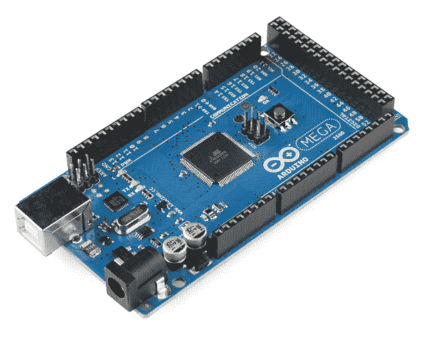

# 什么是 Arduino？

> 原文：<https://learn.sparkfun.com/tutorials/what-is-an-arduino>

## 介绍

Arduino 是一个用于构建电子项目的开源平台。Arduino 由一个物理可编程电路板(通常被称为[微控制器](http://en.wikipedia.org/wiki/Microcontroller)和一个运行在你的计算机上的[软件](http://arduino.cc/en/Main/Software)或 IDE(集成开发环境)组成，用于向物理电路板写入和上传计算机代码。

Arduino 平台在刚刚接触电子产品的人群中变得非常流行，这是有原因的。与大多数以前的可编程电路板不同，Arduino 不需要单独的硬件(称为编程器)来将新代码加载到电路板上，您只需使用 USB 电缆即可。此外，Arduino IDE 使用 C++的简化版本，这使得学习编程更加容易。最后，Arduino 提供了一个标准的外形，将微控制器的功能分解成一个更易于使用的包。

*This is an Arduino Uno*

Uno 是 Arduino 系列中最受欢迎的主板之一，也是初学者的绝佳选择。我们将在教程的后面讨论它上面有什么以及它能做什么。

*This is a screenshot of the Arduino IDE.*

信不信由你，这 10 行代码就是你让 Arduino 上的板载 LED 闪烁的全部内容。这些代码可能现在还不太有意义，但是，在阅读了本教程和我们网站上的更多 Arduino 教程后，我们会让你很快上手的！

### 你会学到的

在本教程中，我们将学习以下内容:

*   使用 Arduino 可以完成哪些项目
*   典型的 Arduino 板上有什么，为什么
*   不同种类的 Arduino 板
*   一些与 Arduino 配合使用的有用部件

### 推荐阅读

Arduino 对所有技能水平的人来说都是一个很好的工具。然而，如果你事先了解一些基本的电子学知识，你会有更好的时间来学习 Arduino。我们建议您在深入 Arduino 的奇妙世界之前，至少对这些概念有一个大致的了解。

*   [什么是电？](https://learn.sparkfun.com/tutorials/what-is-electricity)
*   [电压、电流、电阻和欧姆定律](https://learn.sparkfun.com/tutorials/voltage-current-resistance-and-ohms-law)
*   [什么是电路？](https://learn.sparkfun.com/tutorials/what-is-a-circuit)
*   [极性](https://learn.sparkfun.com/tutorials/polarity)
*   [集成电路](https://learn.sparkfun.com/tutorials/integrated-circuits)
*   [逻辑电平](https://learn.sparkfun.com/tutorials/logic-levels)
*   [数字逻辑](https://learn.sparkfun.com/tutorials/digital-logic)
*   [模拟与数字](https://learn.sparkfun.com/tutorials/analog-vs-digital)

## 寻找合适的 Arduino？

查看我们的 **[Arduino 对比指南](https://www.sparkfun.com/standard_arduino_comparison_guide)** ！我们已经编译了我们携带的每个 Arduino 开发板，因此您可以快速比较它们，找到最适合您需求的开发板。

带我去那里！

## 它是做什么的？

Arduino 硬件和软件是为艺术家、设计师、业余爱好者、黑客、新手以及任何对创建交互式对象或环境感兴趣的人设计的。Arduino 可以与按钮、led、马达、扬声器、GPS 单元、相机、互联网甚至你的智能手机或电视互动！这种灵活性加上 Arduino 软件是免费的，硬件板非常便宜，而且软件和硬件都很容易学习，这导致了一个庞大的用户社区，他们为大量基于 Arduino 的项目贡献代码和发布指令。

从[机器人](https://learn.sparkfun.com/tutorials/building-the-hub-ee-buggy)和[加热垫暖手毯](https://learn.sparkfun.com/tutorials/heating-pad-hand-warmer-blanket)到[诚实的算命机器](https://learn.sparkfun.com/tutorials/the-uncertain-7-cube)，甚至是[龙与地下城掷骰子挑战](http://www.sparkfun.com/tutorials/333)，Arduino 可以用作几乎任何电子项目背后的大脑。

_Wear your nerd cred on your sleev... err, arm. _

这只是冰山一角——如果你想知道在哪里可以找到更多 Arduino 项目的实例，这里有一些基于 Arduino 的项目的好资源，可以激发你的创造力:

*   [指令](http://www.instructables.com/tag/type-id/category-technology/channel-arduino/)
*   [Arduino 游乐场](http://playground.arduino.cc/)
*   [ITP 物理计算维基](http://itp.nyu.edu/physcomp/Tutorials/Tutorials)
*   [在谷仓里](http://www.ladyada.net/make/)
*   [制作:项目](http://makeprojects.com/c/Arduino)
*   当然，你可以在 learn.sparkfun.com 找到更多的 Arduino 教程。

## 黑板上有什么？

有许多种类的 Arduino 板([在下一页](https://learn.sparkfun.com/tutorials/what-is-an-arduino/the-arduino-family)解释)可用于不同的目的。一些主板看起来与下面的有点不同，但是大多数 Arduinos 都有这些组件中的大部分:

### 电源(USB /桶形插孔)

每个 Arduino 板都需要一种连接电源的方式。Arduino UNO 可以通过电脑的 USB 电缆供电，也可以通过端接在桶形插孔中的墙上电源([就像这个](https://www.sparkfun.com/products/8269))供电。在上图中，USB 接口标有 **(1)** ，桶形插孔标有 **(2)** 。

USB 连接也是您将代码加载到 Arduino 板上的方式。关于如何用 Arduino 编程的更多信息可以在我们的[安装和编程 Arduino](https://learn.sparkfun.com/tutorials/installing-arduino-ide) 教程中找到。

**注意:**不要使用高于 20 伏的电源，因为这样会使 Arduino 功率过大(从而损坏它)。大多数 Arduino 型号的推荐电压在 6 到 12 伏之间。

### 引脚(5V、3.3V、GND、模拟、数字、PWM、AREF)

Arduino 上的针脚是你连接电线以构建电路的地方(可能与[试验板](https://learn.sparkfun.com/tutorials/how-to-use-a-breadboard/)和一些[电线](https://learn.sparkfun.com/tutorials/working-with-wire)结合在一起)。它们通常有黑色的塑料“接头”,允许你将电线直接插入电路板。Arduino 有几种不同类型的引脚，每种引脚都标在板上，用于不同的功能。

*   **GND③**:是‘地’的简称。Arduino 上有几个 GND 引脚，任何一个都可以用于电路接地。
*   **5V (4) & 3.3V (5)** :如你所料，5V 引脚提供 5 伏电源，3.3V 引脚提供 3.3 伏电源。Arduino 使用的大多数简单组件都可以在 5 或 3.3 伏电压下运行。
*   **模拟(6)** :模拟输入标签下的引脚区域(UNO 上的 A0 到 A5)是模拟输入引脚。这些引脚可以读取来自模拟传感器(如[温度传感器](https://www.sparkfun.com/products/10988))的信号，并将其转换为我们可以读取的数字值。
*   **数字(7)** :模拟引脚对面是数字引脚(UNO 上的 0 到 13)。这些引脚可用于数字输入(如告知按钮是否被按下)和数字输出(如给 LED 供电)。
*   **PWM (8)** :您可能已经注意到一些数字引脚(UNO 上的 3、5、6、9、10 和 11)旁边的波浪号(~)。这些引脚充当普通的数字引脚，但也可以用于所谓的脉宽调制(PWM)。我们[有一个关于 PWM](https://learn.sparkfun.com/tutorials/pulse-width-modulation) 的教程，但是现在，把这些引脚想象成能够模拟模拟输出(就像一个 LED 的淡入淡出)。
*   **AREF (9)** :代表模拟参考。大多数情况下，您可以不使用此 pin。它有时用于设置外部基准电压(0 至 5 伏)作为模拟输入引脚的上限。

### 复原按钮

就像最初的任天堂一样，Arduino 有一个重置按钮 **(10)** 。按下它会暂时将 reset 引脚接地，并重新启动 Arduino 上加载的任何代码。如果您的代码没有重复，但是您想要多次测试它，这将非常有用。然而，与最初的任天堂不同，在 Arduino 上吹气通常不会解决任何问题。

### 电源 LED 指示灯

就在你电路板上“UNO”这个词的右下方，在“on”这个词旁边有一个小小的 LED**(11)**。每当您将 Arduino 插入电源时，此 LED 灯应会亮起。如果这个灯不亮，很有可能出问题了。是时候重新检查你的电路了！

### TX RX LEDs

TX 是发射的缩写，RX 是接收的缩写。这些标记在电子产品中出现得相当多，以指示负责[串行通信](https://learn.sparkfun.com/tutorials/serial-communication)的引脚。在我们的例子中，Arduino UNO 上有两个地方出现 TX 和 RX-一次出现在数字引脚 0 和 1 旁边，第二次出现在 TX 和 RX 指示灯 led 旁边 **(12)** 。每当我们的 Arduino 接收或传输数据时(比如当我们在板上加载新程序时)，这些 led 就会给我们一些漂亮的视觉指示。

### 主集成电路

所有金属腿的黑色东西是一个集成电路，或集成电路。把它想象成我们 Arduino 的大脑。Arduino 上的主 IC 因电路板类型而略有不同，但通常来自 ATMEL 公司的 ATmega 系列 IC。这可能很重要，因为在从 Arduino 软件加载新程序之前，您可能需要知道 IC 类型(以及您的主板类型)。这些信息通常可以在集成电路的顶部找到。如果您想了解各种 IC 之间的更多差异，阅读数据手册通常是个不错的主意。

### 稳压器

电压调节器 **(14)** 实际上不是你可以(或者应该)在 Arduino 上与之交互的东西。但是知道它在那里以及它的用途可能是有用的。电压调节器完全按照它说的做——它控制进入 Arduino 板的电压量。把它当成一种看门人；它会赶走可能损害电路的额外电压。当然，它有其局限性，所以不要将 Arduino 连接到任何高于 20 伏的电压。

## Arduino 家族

Arduino 制造了几种不同的板，每种板都有不同的功能。此外，作为开源硬件的一部分意味着其他人可以修改和生产 Arduino 板的衍生物，提供更多的外形和功能。如果你不确定哪一个适合你的项目，[查看本指南](https://www.sparkfun.com/arduino_guide)获得一些有用的提示。以下是一些非常适合 Arduino 新手的选项:

### [Arduino Uno (R3)](https://www.sparkfun.com/products/11021)

Uno 是您第一个 Arduino 的绝佳选择。它拥有您入门所需的一切，没有什么是您没有的。它有 14 个数字输入/输出引脚(其中 6 个可用作 PWM 输出)，6 个模拟输入，一个 USB 连接，一个电源插孔，一个复位按钮等。它包含支持微控制器所需的一切；只需用 USB 线将其连接到电脑，或者用交流到 DC 适配器或电池供电即可开始。

### [LilyPad Arduino](https://www.sparkfun.com/products/9266)

这是 LilyPad Arduino 主板！LilyPad 是由 Leah Buechley 开发的可穿戴电子纺织技术，由 Leah 和 SparkFun 合作设计。每个 LilyPad 都创造性地设计了大型连接垫和平坦的背部，以便用导电线将它们[缝进衣服](https://learn.sparkfun.com/tutorials/sewing-with-conductive-thread)。LilyPad 还有自己的输入、输出、电源和传感器板系列，也是专门为电子纺织品打造的。它们甚至可以水洗！

### [红纸板](https://www.sparkfun.com/products/11575)

在 SparkFun，我们使用许多 Arduinos，我们一直在寻找最简单、最稳定的一款。每个主板都有点不同，没有一个主板拥有我们想要的一切-所以我们决定制作自己的版本，结合所有我们喜欢的功能。

可以使用 Arduino IDE 通过 USB Mini-B 电缆对 RedBoard 进行编程。它可以在 Windows 8 上运行，无需更改你的安全设置(我们使用签名驱动，不像 UNO)。由于我们使用的 USB/FTDI 芯片，它更加稳定，而且背面完全平坦，更容易嵌入到您的项目中。只需插入电路板，从电路板菜单中选择“Arduino UNO ”,就可以上传代码了。您可以通过 USB 或桶形插孔为 RedBoard 供电。板载电源调节器可以处理 7 至 15 伏直流电压。

### [Arduino Mega (R3)](https://www.sparkfun.com/products/11061)

Arduino Mega 就像是 UNO 的老大哥。它有很多！)的数字输入/输出引脚(14 个可用作 PWM 输出)、16 个模拟输入、一个 USB 连接、一个电源插孔和一个复位按钮。它包含支持微控制器所需的一切；只需用 USB 线将其连接到电脑，或者用交流到 DC 适配器或电池供电即可开始。大量引脚使该板非常适合需要大量数字输入或输出(如大量 led 或按钮)的项目。

### Arduino Leonardo

Leonardo 是 Arduino 第一款使用内置 USB 的微控制器的开发板。这意味着它可以更便宜、更简单。此外，由于开发板直接处理 USB，因此提供了代码库，允许开发板模拟计算机键盘、鼠标等！

## 大家庭

虽然你的 Arduino 板确实很漂亮，但它本身不能做很多事情——你必须把它连接到某个东西上。在 learn 上有很多教程以及“它做什么”部分的链接，但我们很少谈论你可以轻松挂钩的一般*种类*的东西。在这一节中，我们将介绍基本的**传感器**以及 Arduino **屏蔽**，这是让您的项目变得有意义的两个最方便的工具。

### 传感器

通过一些简单的代码，Arduino 可以控制各种各样的**传感器**并与之交互——这些传感器可以测量[光线](https://www.sparkfun.com/products/9088)、[温度](https://www.sparkfun.com/products/10988)、[弯曲度](https://www.sparkfun.com/products/8606)、[压力](https://www.sparkfun.com/products/11207)、[接近度](https://www.sparkfun.com/products/242)、[加速度](https://www.sparkfun.com/products/9836)、[一氧化碳](https://www.sparkfun.com/products/9403)、[放射性](https://www.sparkfun.com/products/11345)、[湿度](https://www.sparkfun.com/products/9569)、[气压](https://www.sparkfun.com/products/9721)

*Just a few of the sensors that are easily compatible with Arduino*

### 盾

此外，还有这些被称为**屏蔽**的东西——基本上它们是预建的电路板，安装在你的 Arduino 上，提供额外的功能——[控制电机](https://www.sparkfun.com/products/9815)、[连接互联网](https://www.sparkfun.com/products/9026)、[提供蜂窝](https://www.sparkfun.com/products/9607)或[其他无线通信](https://www.sparkfun.com/products/11018)、[控制液晶显示屏](https://www.sparkfun.com/products/9363)、[等等](https://www.sparkfun.com/products/9595)。

*A partial selection of available shields to extend the power of your Arduino*

有关盾牌的更多信息，请查看:

*   [ShieldList.org](http://www.shieldlist.org/)
*   ShieldStravaganza！！！(一系列视频简要解释了我们在 SparkFun 的所有盾牌)[第一部分](https://www.sparkfun.com/news/1080)、[第二部分](http://www.sparkfun.com/news/1084)和[第三部分](http://www.sparkfun.com/news/1089)

## 资源和更进一步

现在，您已经了解了 Arduino 系列的所有信息，您可能希望在您的项目中使用哪个电路板，并且有大量的传感器和屏蔽可以帮助您的项目更上一层楼。这里有一些进一步的阅读材料，可以帮助你进一步了解电子世界。

## 寻找合适的 Arduino？

查看我们的 **[Arduino 对比指南](https://www.sparkfun.com/standard_arduino_comparison_guide)** ！我们已经编译了我们携带的每个 Arduino 开发板，因此您可以快速比较它们，找到最适合您需求的开发板。

带我去那里！

*   [Arduino IDE](#Arduino-IDE-tab)
*   [基本电气概念](#Electrical-Concepts-tab)
*   [Arduino 板卡引脚功能](#Board-Functionality-tab)
*   [Arduino 电路板比较指南](#Arduino-Boards-tab)
*   [Arduino 盾牌](#Arduino-Shields-tab)
*   [其他教程和项目](#Project-Guides-tab)

#### SparkFun 教程

 [### 安装 Arduino 库](https://learn.sparkfun.com/tutorials/installing-an-arduino-library) How do I install a custom Arduino library? It's easy! This tutorial will go over how to install an Arduino library using the Arduino Library Manager. For libraries not linked with the Arduino IDE, we will also go over manually installing an Arduino library.[Favorited Favorite](# "Add to favorites") 22 [### 安装 Arduino IDE](https://learn.sparkfun.com/tutorials/installing-arduino-ide) A step-by-step guide to installing and testing the Arduino software on Windows, Mac, and Linux.[Favorited Favorite](# "Add to favorites") 16 [### 在 Arduino IDE 中安装电路板定义](https://learn.sparkfun.com/tutorials/installing-board-definitions-in-the-arduino-ide) How do I install a custom Arduino board/core? It's easy! This tutorial will go over how to install an Arduino board definition using the Arduino Board Manager. We will also go over manually installing third-party cores, such as the board definitions required for many of the SparkFun development boards.[Favorited Favorite](# "Add to favorites") 3

#### Arduino 教程

*   [入门>简介:什么是 Arduino，我可以用它做什么？](https://www.arduino.cc/en/Guide/Introduction)
*   【Arduino 和 Genuino 产品入门
*   [Arduino 软件(IDE)](https://www.arduino.cc/en/Guide/Environment)
*   [Arduino 故障排除](https://www.arduino.cc/en/Guide/Troubleshooting)
*   Arduino:联系我们

#### Arduino 板卡比较指南

 [### 为您的项目选择 Arduino](https://learn.sparkfun.com/tutorials/choosing-an-arduino-for-your-project) Examining the diverse world of Arduino boards and understanding the differences between them before choosing one for a project.[Favorited Favorite](# "Add to favorites") 5 [### 标准 Arduino 比较指南](https://www.sparkfun.com/standard_arduino_comparison_guide) Arduino Comparison Guide Uno or Pro Mini? Bluetooth or wireless? When it comes to Arduinos, there are a lot of choices. We've compiled every Arduino development… [### RedBoard 对 Uno](https://learn.sparkfun.com/tutorials/redboard-vs-uno) In this tutorial we discuss the differences and similarities between the RedBoard and the Arduino Uno (SMD and PTH). The development platforms[Favorited Favorite](# "Add to favorites") 13

#### 【Arduino Shields 入门

 [### Arduino Shields v2](https://learn.sparkfun.com/tutorials/arduino-shields-v2) An update to our classic Arduino Shields Tutorial! All things Arduino shields. What they are and how to assemble them.[Favorited Favorite](# "Add to favorites") 5

#### 其他 Arduino 盾相关教程

 [### 比格犬骨黑色原斗篷连接指南](https://learn.sparkfun.com/tutorials/beaglebone-black-proto-cape-hookup-guide) Learn how to get started making your own capes for the BeaglBone Black using the BeagleBone Proto Cape.[Favorited Favorite](# "Add to favorites") 2 [### MP3 播放器防护罩连接指南 V15](https://learn.sparkfun.com/tutorials/mp3-player-shield-hookup-guide-v15) How to get your Arduino groovin' using the MP3 Player Shield.[Favorited Favorite](# "Add to favorites") 6 [### Teensy Arduino 屏蔽适配器连接指南](https://learn.sparkfun.com/tutorials/teensy-arduino-shield-adapter-hookup-guide) A basic introduction and assembly guide for the SparkFun Teensy Arduino Shield Adapter.[Favorited Favorite](# "Add to favorites") 3 [### Arduino 天气防护罩连接指南 V12](https://learn.sparkfun.com/tutorials/arduino-weather-shield-hookup-guide-v12) Read humidity, pressure and luminosity quickly and easily. Add wind speed, direction and rain gauge for full weather station capabilities.[Favorited Favorite](# "Add to favorites") 13[**Beginner**](#Basic) [**Intermediate**](#Med) [**Advanced**](#Adv)

***Click the buttons above** for tutorials relating to the board functionality based on topic difficulty.*

* * *

#### 初学者

 [### 串行通信](https://learn.sparkfun.com/tutorials/serial-communication) Asynchronous serial communication concepts: packets, signal levels, baud rates, UARTs and more 100 [### 模数转换](https://learn.sparkfun.com/tutorials/analog-to-digital-conversion) The world is analog. Use analog to digital conversion to help digital devices interpret the world.[Favorited Favorite](# "Add to favorites") 58 [### 逻辑电平](https://learn.sparkfun.com/tutorials/logic-levels) Learn the difference between 3.3V and 5V devices and logic levels.[Favorited Favorite](# "Add to favorites") 82 [### 模拟与数字](https://learn.sparkfun.com/tutorials/analog-vs-digital) This tutorial covers the concept of analog and digital signals, as they relate to electronics.[Favorited Favorite](# "Add to favorites") 66 [### Arduino 中的数据类型](https://learn.sparkfun.com/tutorials/data-types-in-arduino) Learn about the common data types and what they signify in the Arduino programming environment.[Favorited Favorite](# "Add to favorites") 38 [### 如何使用跳线焊盘和 PCB 走线](https://learn.sparkfun.com/tutorials/how-to-work-with-jumper-pads-and-pcb-traces) Handling PCB jumper pads and traces is an essential skill. Learn how to cut a PCB trace, add a solder jumper between pads to reroute connections, and repair a trace with the green wire method if a trace is damaged.[Favorited Favorite](# "Add to favorites") 11

#### 中级

 [### 串行外设接口(SPI)](https://learn.sparkfun.com/tutorials/serial-peripheral-interface-spi) SPI is commonly used to connect microcontrollers to peripherals such as sensors, shift registers, and SD cards.[Favorited Favorite](# "Add to favorites") 91 [### I2C](https://learn.sparkfun.com/tutorials/i2c) An introduction to I2C, one of the main embedded communications protocols in use today.[Favorited Favorite](# "Add to favorites") 128 [### Arduino 处理器中断](https://learn.sparkfun.com/tutorials/processor-interrupts-with-arduino) What is an interrupt? In a nutshell, there is a method by which a processor can execute its normal program while continuously monitoring for some kind of event, or interrupt. There are two types of interrupts: hardware and software interrupts. For the purposes of this tutorial, we will focus on hardware interrupts.[Favorited Favorite](# "Add to favorites") 9

#### 高级

 [### 安装 Arduino 引导程序](https://learn.sparkfun.com/tutorials/installing-an-arduino-bootloader) This tutorial will teach you what a bootloader is and why you would need to install or reinstall it. We will also go over the process of burning a bootloader by flashing a hex file to an Arduino microcontroller.[Favorited Favorite](# "Add to favorites") 25 [### 集成电路](https://learn.sparkfun.com/tutorials/integrated-circuits) An introduction to integrated circuits (ICs). Electronics' ubiquitous black chips. Includes a focus on the variety of IC packages.[Favorited Favorite](# "Add to favorites") 46 [### 读写串行 EEPROMs](https://learn.sparkfun.com/tutorials/reading-and-writing-serial-eeproms) EEPROM is a great way to add extra memory to your microcontroller project. Wait 'til you see how easy it is to use 14 [### 什么是电路？](https://learn.sparkfun.com/tutorials/what-is-a-circuit) Every electrical project starts with a circuit. Don't know what a circuit is? We're here to help.[Favorited Favorite](# "Add to favorites") 82 [### 电压、电流、电阻和欧姆定律](https://learn.sparkfun.com/tutorials/voltage-current-resistance-and-ohms-law) Learn about Ohm's Law, one of the most fundamental equations in all electrical engineering.[Favorited Favorite](# "Add to favorites") 132 [### 如何为项目提供动力](https://learn.sparkfun.com/tutorials/how-to-power-a-project) A tutorial to help figure out the power requirements of your project.[Favorited Favorite](# "Add to favorites") 67 [### 使用导线](https://learn.sparkfun.com/tutorials/working-with-wire) How to strip, crimp, and work with wire.[Favorited Favorite](# "Add to favorites") 50 [### 如何使用试验板](https://learn.sparkfun.com/tutorials/how-to-use-a-breadboard) Welcome to the wonderful world of breadboards. Here we will learn what a breadboard is and how to use one to build your very first circuit.[Favorited Favorite](# "Add to favorites") 79 [### 什么是电？](https://learn.sparkfun.com/tutorials/what-is-electricity) We can see electricity in action on our computers, lighting our houses, as lightning strikes in thunderstorms, but what is it? This is not an easy question, but this tutorial will shed some light on it 83 [### 电力](https://learn.sparkfun.com/tutorials/electric-power) An overview of electric power, the rate of energy transfer. We'll talk definition of power, watts, equations, and power ratings. 1.21 gigawatts of tutorial fun 54 [### 极性](https://learn.sparkfun.com/tutorials/polarity) An introduction to polarity in electronic components. Discover what polarity is, which parts have it, and how to identify it.[Favorited Favorite](# "Add to favorites") 52 [### 如何使用万用表](https://learn.sparkfun.com/tutorials/how-to-use-a-multimeter) Learn the basics of using a multimeter to measure continuity, voltage, resistance and current.[Favorited Favorite](# "Add to favorites") 67 [### LilyPad 基础:电子缝纫](https://learn.sparkfun.com/tutorials/lilypad-basics-e-sewing) Learn how to use conductive thread with LilyPad components.[Favorited Favorite](# "Add to favorites") 16

#### 初学者工具包指南

 [### 数字沙盒 Arduino 伴侣](https://learn.sparkfun.com/tutorials/digital-sandbox-arduino-companion) Let's take the same examples from the ArduBlock-based Digital Sandbox guide, and implement them using Arduino code.[Favorited Favorite](# "Add to favorites") 4 [### 带影子底盘的 RedBot 装配指南](https://learn.sparkfun.com/tutorials/assembly-guide-for-redbot-with-shadow-chassis) Assembly Guide for the RedBot Kit. This tutorial includes extra parts to follow to go along with the RedBot Inventor's Kit tutorial.[Favorited Favorite](# "Add to favorites") 13 [### SparkFun 发明家套件实验指南-4.0 版](https://learn.sparkfun.com/tutorials/sparkfun-inventors-kit-experiment-guide---v40) The SparkFun Inventor's Kit (SIK) Experiment Guide contains all of the information needed to build all five projects, encompassing 16 circuits, in the latest version of the kit, v4.0a.[Favorited Favorite](# "Add to favorites") 8

#### 其他 Arduino 相关教程

 [### 安装 Arduino IDE](https://learn.sparkfun.com/tutorials/installing-arduino-ide) A step-by-step guide to installing and testing the Arduino software on Windows, Mac, and Linux.[Favorited Favorite](# "Add to favorites") 16 [### LIDAR-Lite v3 连接指南](https://learn.sparkfun.com/tutorials/lidar-lite-v3-hookup-guide) A tutorial for connecting the Garmin LIDAR-Lite v3 or the LIDAR-Lite v3HP to an Arduino to measure distance.[Favorited Favorite](# "Add to favorites") 6 [### 运动控制的可穿戴 led 舞蹈背带](https://learn.sparkfun.com/tutorials/motion-controlled-wearable-led-dance-harness) Control LEDs based on your movement using an accelerometer! Make your LEDs breathe by fading in and out when laying on the floor, turn off the LEDs when moving to your side, or make the LEDs blink in a headstand 3 [### Pi AVR 程序员帽连接指南](https://learn.sparkfun.com/tutorials/pi-avr-programmer-hat-hookup-guide) In this tutorial, we will use a Raspberry Pi 3 and the Pi AVR Programmer HAT to program an ATMega328P target. We are going to first program the Arduino bootloader over SPI, and then upload an Arduino sketch over a USB serial COM port.[Favorited Favorite](# "Add to favorites") 3