# 分压器

> 原文：<https://learn.sparkfun.com/tutorials/voltage-dividers>

## 介绍

**分压器**是一个简单的电路，将大电压转换成小电压。仅使用两个串联电阻和一个输入电压，我们就可以产生一个输出电压，它是输入电压的一部分。分压器是电子学中最基本的电路之一。如果说学习[欧姆定律](https://learn.sparkfun.com/tutorials/voltage-current-resistance-and-ohms-law)就像学习 ABC，那么学习分压器就像学习如何拼写*猫*。

这些都是电位计的例子-可变电阻器，可用于创建一个可调分压器。我们很快会了解更多。

[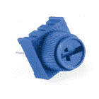](https://www.sparkfun.com/products/9806) 

将**添加到您的[购物车](https://www.sparkfun.com/cart)中！**

 **### [用旋钮微调 10K 欧姆](https://www.sparkfun.com/products/9806)

[In stock](https://learn.sparkfun.com/static/bubbles/ "in stock") COM-09806

这款 10K 可调电位器有一个内置的小旋钮，它是一款友好的实验板。

$1.056[Favorited Favorite](# "Add to favorites") 54[Wish List](# "Add to wish list")****[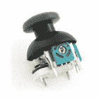](https://www.sparkfun.com/products/9032) 

将**添加到您的[购物车](https://www.sparkfun.com/cart)中！**

 **### [拇指操纵杆](https://www.sparkfun.com/products/9032)

[In stock](https://learn.sparkfun.com/static/bubbles/ "in stock") COM-09032

这是一个操纵杆，非常类似于 PS2 (PlayStation 2)控制器上的“模拟”操纵杆。定向运动更简单…

$4.505[Favorited Favorite](# "Add to favorites") 70[Wish List](# "Add to wish list")****[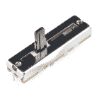](https://www.sparkfun.com/products/11620) 

将**添加到您的[购物车](https://www.sparkfun.com/cart)中！**

 **### [【滑锅-小(10k 线性锥度)](https://www.sparkfun.com/products/11620)

[In stock](https://learn.sparkfun.com/static/bubbles/ "in stock") COM-11620

一个简单的滑动电位计可以走很长的路。额定为 10kω和 0.1W。带有焊片连接。这个锅有一个 o…

$2.10[Favorited Favorite](# "Add to favorites") 24[Wish List](# "Add to wish list")****[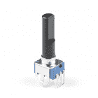](https://www.sparkfun.com/products/9288) 

将**添加到您的[购物车](https://www.sparkfun.com/cart)中！**

 **### [【旋转电位器-线性(10k 欧姆)](https://www.sparkfun.com/products/9288)

[In stock](https://learn.sparkfun.com/static/bubbles/ "in stock") COM-09288

可调电位计可以打开许多有趣的用户界面。转动锅，电阻就变了。连接 VC…

$1.05[Favorited Favorite](# "Add to favorites") 25[Wish List](# "Add to wish list")******** ********### 本教程涵盖的内容

*   分压器电路是什么样子。
*   输出电压如何依赖于输入电压和分压电阻。
*   分压器在现实世界中的表现。
*   现实生活中的分压器应用。

### 推荐阅读

本教程建立在基础电子学知识的基础上。如果您还没有，请考虑阅读这些教程:

*   [什么是电路？](https://learn.sparkfun.com/tutorials/what-is-a-circuit)
*   [串联和并联电路](https://learn.sparkfun.com/tutorials/series-and-parallel-circuits)
*   [电压、电流、电阻和欧姆定律](https://learn.sparkfun.com/tutorials/voltage-current-resistance-and-ohms-law)
*   [模拟 vs 数字](https://learn.sparkfun.com/tutorials/analog-vs-digital)
*   [如何使用万用表](https://learn.sparkfun.com/tutorials/how-to-use-a-multimeter)
*   [如何使用试验板](https://learn.sparkfun.com/tutorials/how-to-use-a-breadboard)
*   [模数转换](https://learn.sparkfun.com/tutorials/analog-to-digital-conversion)

## 理想分压器

分压器有两个重要部分:电路和方程式。

### 该电路

分压器包括在一系列两个电阻器上施加电压源。你可能会看到它以几种不同的方式绘制，但它们本质上应该总是相同的电路。

[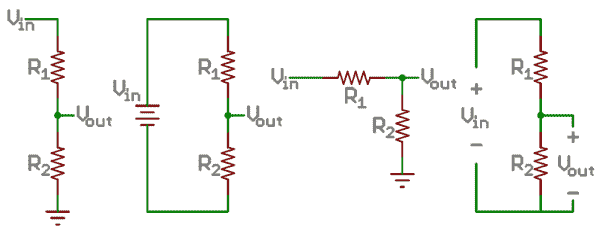](//cdn.sparkfun.com/assets/4/0/3/a/e/511948ffce395f7f47000000.png)*Examples of voltage divider schematics. Shorthand, longhand, resistors at same/different angles, etc.*

我们将最靠近输入电压的电阻(V[in]R[1]，最靠近地的电阻 R [2] 。R [2] 上的电压降称为 V [out] ，这是我们的电路存在的分压。

这就是电路的全部内容！V [out] 是我们的分压。这就是输入电压的一小部分。

### 方程式

分压器方程假设你知道上述电路的三个值:输入电压(V [in] )和两个电阻值(R [1] 和 R [2] )。给定这些值，我们可以使用该等式来计算输出电压(V [out] ):

[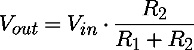](//cdn.sparkfun.com/assets/e/7/6/3/c/511968d9ce395f7c54000000.png)*Memorize that equation!*

该等式表明，输出电压**与**输入电压**和 R [1] 与 R[2]9**之比**成正比。如果你想知道这是从哪里来的，看看这个公式是从哪里推导出来的。但是现在，只要把它写下来并记住它！**

### 计算器

体验一下分压器等式的输入和输出吧！下面，你可以在中插入 V [和两个电阻的数字，看看它们产生什么样的输出电压。]

或者，如果你将 V [调整出]，你会看到 R [2] 处需要什么电阻值(给定 V [在]处，R [1] )。

### 简单化

使用分压器时，有几条原则需要牢记在心。这些简化使得评估分压电路变得更加容易。

[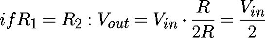](//cdn.sparkfun.com/assets/8/6/0/3/2/51197073ce395f5d6d000000.png)

首先，**如果 R2 和 R1 相等**，那么输出电压是输入电压的一半**。无论电阻值如何，都是如此。**

[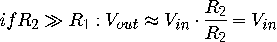](//cdn.sparkfun.com/assets/3/4/f/4/6/5119730dce395f2353000000.png)

如果 R [2] 比 R [1] 大得多(至少一个数量级)，那么输出电压将非常接近输入。R [1] 两端的电压将非常小。

[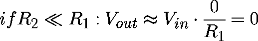](//cdn.sparkfun.com/assets/0/1/c/9/0/5119730dce395f7153000001.png)

相反，如果 R [2] 比 R [1] 小得多，输出电压与输入相比将会很小。大部分输入电压将跨越 R [1]

## 应用程序

分压器有大量的应用，它们是电气工程师最常用的电路之一。这里只是你会发现分压器的许多地方中的几个。

### 电位器

电位计是一种可变电阻器，可用于创建可调分压器。

[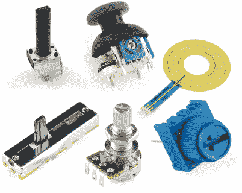](//cdn.sparkfun.com/assets/7/9/2/b/6/511ac70dce395f3245000000.png)*A smattering of potentiometers. From top-left, clockwise: [a standard 10k trimpot](https://www.sparkfun.com/products/9288), [2-axis joystick](https://www.sparkfun.com/products/9032), [softpot](https://www.sparkfun.com/products/9074), [slide pot](https://www.sparkfun.com/products/11620), [classic right-angle](https://www.sparkfun.com/products/9939), and a [breadboard friendly 10k trimpot](https://www.sparkfun.com/products/9806).*

电位计内部有一个电阻和一个游标，游标将电阻一分为二，并移动以调整两半电阻之间的比率。外部通常有三个引脚:两个引脚连接到电阻的两端，而第三个引脚连接到电位计的游标。

[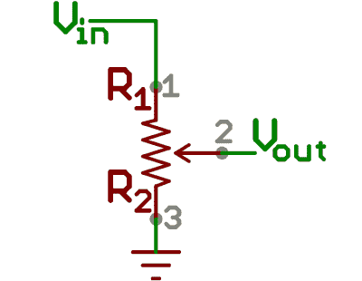](//cdn.sparkfun.com/assets/6/3/e/5/e/511ac8f5ce395f5846000000.png)*A potentiometer schematic symbol. Pins 1 and 3 are the resistor ends. Pin 2 connects to the wiper.*

如果外部引脚连接到电压源(一个接地，另一个连接到 V [in] )，中间引脚的输出(V [out] 将模拟分压器。朝一个方向把锅转到底，电压可能为零；转向另一侧，输出电压接近输入电压；游标在中间位置意味着输出电压是输入电压的一半。

电位计有多种封装，并且有自己的多种应用。它们可以用来产生一个参考电压，[调整无线电台](https://www.sparkfun.com/products/11043)，测量[操纵杆](https://www.sparkfun.com/products/9032)上的位置，或者在许多其他需要可变输入电压的应用中。

### 读取电阻传感器

现实世界中的许多传感器都是简单的电阻器件。光电池是一个可变电阻，它产生一个与它感应到的光量成比例的电阻。其他设备如[柔性传感器](https://www.sparkfun.com/products/8606?)、[力敏电阻](https://www.sparkfun.com/products/9375)和[热敏电阻](https://www.sparkfun.com/products/250)也是可变电阻。

事实证明，电压对于微控制器(那些带有[模数转换器](https://learn.sparkfun.com/tutorials/analog-to-digital-conversion) -至少是 ADC)来说非常容易测量。反抗？没有那么多。但是，通过在电阻式传感器上增加另一个电阻，我们可以创建一个分压器。一旦分压器的输出已知，我们就可以回过头来计算传感器的电阻。

例如，光电池的电阻在光亮处为 1kω，黑暗处约为 10kΩ。如果我们将其与中间某处的静态电阻(比如 5.6kΩ)相结合，我们就可以利用它们产生的分压器获得较宽的范围。

[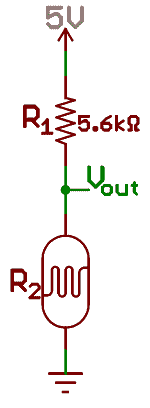](//cdn.sparkfun.com/assets/7/2/a/7/5/511acd39ce395f6746000000.png)*Photocell makes up half of this voltage divider. The voltage is measured to find the resistance of the light sensor.*

| **光照水平** | **R [2] (传感器)** | **R [1] (固定)** | **比率 R[2]/(R[1]+R[2])** | **V [出]** |
| 光 | 1 号机 | 五点六分 | Zero point one five | 0.76 伏 |
| 暗淡的 | 七号 | 五点六分 | Zero point five six | 2.78 伏 |
| 黑暗 | 10 号 | 五点六分 | Zero point six seven | 3.21 伏 |

从亮到暗约 2.45V 的摆幅。大多数 ADC 都有足够的分辨率！

### 电平移动

更复杂的传感器可能会使用更重的串行接口传输读数，如 [UART](../serial-communication) 、 [SPI](../serial-peripheral-interface-spi) 或 [I2C](https://learn.sparkfun.com/tutorials/i2c) 。这些传感器中的许多都在相对较低的电压下工作，以节省电能。不幸的是，这些低压传感器最终会与工作在较高系统电压下的微控制器接口，这种情况并不罕见。这就导致了[电平移动](https://learn.sparkfun.com/tutorials/retired---using-the-logic-level-converter)的问题，有包括分压在内的多种解决方案。

例如， [ADXL345 加速度计](https://www.sparkfun.com/products/9836)允许 3.3V 的最大输入电压，因此如果您试图将其与 Arduino 接口(假设工作电压为 5V)，则需要采取措施将 5V 信号降压至 3.3V。分压器！所需的只是一对电阻，其比值将 5V 信号分压至约 3.3V，1kω至 10kΩ范围内的电阻通常最适合此类应用；让我们

[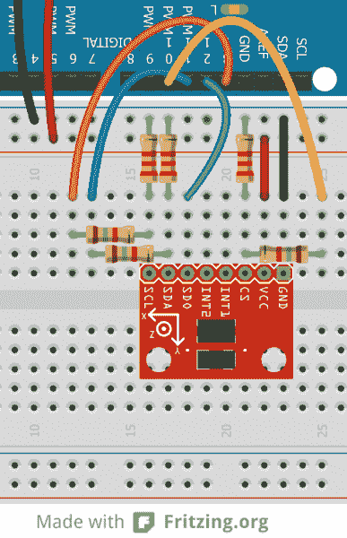](//cdn.sparkfun.com/assets/4/2/6/5/e/51422598ce395ff511000000.png)*3.3kΩ resistors (orange, orange, red) are the R[2]'s, 1.8kΩ resistors are the R[1]'s. An example of voltage dividers in a [breadboard](https://learn.sparkfun.com/tutorials/breadboards), level shifting 5V signals to 3.24V. (Click to see a larger view).*

请记住，这个解决方案只在一个方向有效。单独的分压器永远无法将较低的电压提升到较高的电压。

### 应用程序不要

虽然使用分压器降压可能很诱人，比如说，将 12V 电源降压到 5V，**分压器不应该用于向负载**供电。

负载所需的任何电流也必须流经 R [1] 。R [1] 上的电流和电压产生功率，以热量的形式耗散掉。如果该功率超过电阻器的额定值(通常在&frac 18；w 和 1W)，热量开始成为一个主要问题，可能会熔化不良电阻。

这还没有提到分压电源的效率有多低。基本上，不要使用分压器作为任何需要适度功率的电源。如果你需要降低一个电压来作为电源，看看电压调节器或开关电源。

## 额外学分:证明

如果你还没有得到你的分压器，在这一节中，我们将评估如何应用欧姆定律产生分压器方程。这是一个有趣的练习，但对于理解分压器的作用并不重要。如果你感兴趣，准备好享受欧姆定律和代数的乐趣吧。

### 评估电路

那么，如果你想测量 V [out] 的电压呢？如何应用欧姆定律建立一个公式来计算那里的电压？假设我们知道 V [在]、R [1] 和 R [2] 中的值，那么让我们根据这些值得到我们的 V [out] 等式。

让我们从引出电路中的电流开始——我 [1] 和我[2]——我们称之为通过各自电阻的电流。

[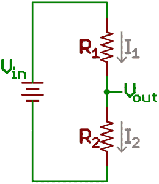](//cdn.sparkfun.com/assets/c/8/8/7/7/514208cbce395f1c12000000.png)

我们的目标是计算出 V [out] ，如果我们将欧姆定律应用于该电压会怎么样？很简单，只需要一个电阻和一个电流:

太棒了。我们知道 R [2] 的值，但是 I [2] 呢？这是一个未知的值，但我们确实知道一点。我们可以假设(这被证明是一个很大的假设)I [1] 等价于 I[2]。好吧，但这对我们有帮助吗？保持这种想法。我们的电路现在看起来像这样，其中 *I* 等于 I [1] 和 I [2] 。

[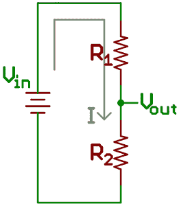](//cdn.sparkfun.com/assets/5/4/6/4/7/514208cace395fd711000000.png)

我们对中的 V [了解多少？嗯，]中的 V [是电阻 R [1] 和 R [2] 两端的电压。那些电阻是串联的。串联电阻加起来只有一个值，所以我们可以说:]

[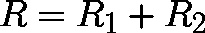](//cdn.sparkfun.com/assets/c/2/e/6/1/514208cace395f3510000000.png)

现在，我们可以将电路简化为:

[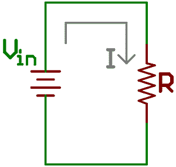](//cdn.sparkfun.com/assets/0/b/6/a/c/514208cace395fa10d000000.png)

最基本的欧姆定律！V [在] = I * R .其中，如果我们把那个 *R* 变回 *R [1] + R [2]* ，也可以写成:

[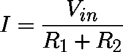](//cdn.sparkfun.com/assets/a/0/8/8/4/514208cace395f1c11000000.png)

由于 I 等于 I [2] ，将它代入我们的 V [out] 方程得到:

[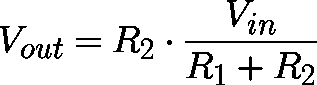](//cdn.sparkfun.com/assets/1/f/2/5/d/514208cace395f1d12000000.png)

朋友们，这就是分压方程！输出电压是输入电压的一部分，该部分是 R [2] 除以 R [1] 和 R [2] 之和。

## 有兴趣学习更多基础主题吗？

查看我们的 **[工程要点](https://www.sparkfun.com/engineering_essentials)** 页面，了解电气工程相关基础主题的完整列表。

带我去那里！

## 资源和更进一步

现在你已经掌握了电子学中最常见的电路之一的要点，接下来还有很多新东西要学！

您想了解 Arduino 等微控制器如何读取分压器产生的模拟电压吗？

*   [模数转换器](http://learn.sparkfun.com/tutorials/analog-to-digital-conversion)

借助分压器和 ADC 的强大功能，您可以在电子领域大有作为。查看这些其他伟大的教程。

*   一些种类的[加速度计](https://learn.sparkfun.com/tutorials/accelerometer-basics)和[陀螺仪](https://learn.sparkfun.com/tutorials/gyroscope)有一个模拟输出，必须在 ADC 上读取以获得可用值。
*   [脉宽调制(PWM)](https://learn.sparkfun.com/tutorials/pulse-width-modulation) 类似于模拟输出，与模拟输入相反。
*   INA169 的[允许您使用 ADC 检测电流。](https://learn.sparkfun.com/tutorials/ina169-breakout-board-hookup-guide)
*   使用[分压器](https://learn.sparkfun.com/tutorials/voltage-dividers)和 ADC，您可以读取各种传感器和可变组件，如[微调按钮、操纵杆、滑块和力敏电阻](https://learn.sparkfun.com/tutorials/resistors/types-of-resistors#trim)等等。
*   Arduino [map()](http://arduino.cc/en/Reference/map) 功能
*   Arduino [模拟引脚](http://arduino.cc/en/Tutorial/AnalogInputPins)
*   [Uh-Oh 电池指示器连接指南](https://learn.sparkfun.com/tutorials/uh-oh-battery-level-indicator-hookup-guide)使用分压器来告诉你电池电量是否过低。********