# 如何为项目提供动力

> 原文：<https://learn.sparkfun.com/tutorials/how-to-power-a-project>

## 概观

本教程将涵盖为您的电子项目供电的各种方式。它将详细介绍您可能需要考虑的电压和电流因素。如果你的项目是移动/远程的，或者，换句话说，不要坐在墙上电源插座旁边，这也会成为你必须考虑的额外因素。

如果这确实是您的第一个电子项目，您可以选择通读本教程，或者坚持使用推荐的项目电源或您选择的开发板。SparkFun Inventor 套件包含电源所需的 USB 电缆，适用于套件中的所有项目以及许多更高级的项目。如果你感到不知所措，这个工具包是最好的开始。

### 推荐阅读

在阅读本教程之前，您可能想看看以下相关教程:

*   [电压、电流、电阻和欧姆定律](https://learn.sparkfun.com/tutorials/voltage-current-resistance-and-ohms-law)
*   [电力](https://learn.sparkfun.com/tutorials/electric-power)
*   [电池技术](https://learn.sparkfun.com/tutorials/battery-technologies)
*   [连接器基础知识](https://learn.sparkfun.com/tutorials/connector-basics)
*   [如何使用数字万用表](https://learn.sparkfun.com/tutorials/how-to-use-a-multimeter)
*   电压调节器
*   [并联与串联电路](https://learn.sparkfun.com/tutorials/series-and-parallel-circuits)

## 为项目提供动力的方法

以下是为项目提供动力的一些最常用方法:

*   USB 电源
*   可变 DC 台式电源
*   交流至 DC 墙壁适配器(类似于计算机或笔记本电脑使用的适配器)
*   电池

[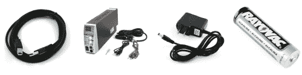](//cdn.sparkfun.com/assets/3/e/8/b/5/514345b8ce395fdb4b000001.jpg)*Four common ways to supply power to your project*

### 我应该选择哪个选项来启动我的项目？

这个问题的答案很大程度上取决于您的项目具体需求。

#### USB 电源

如果你开始使用 [SparkFun Inventor's Kit](http://www.sparkfun.com/products/11227) 或其他基本开发板，你可能只需要一根 USB 线。 [Arduino Uno](http://www.sparkfun.com/products/11021) 就是一个例子，它只需要一根 [USB A 到 B 线](http://www.sparkfun.com/products/512)来供电运行套件中的示例电路。这里是我们目录中的一些 USB 电缆，可以通过 USB 端口为您的项目供电。

 

将**添加到您的[购物车](https://www.sparkfun.com/cart)中！**

### [USB micro-B 线- 6 脚](https://www.sparkfun.com/products/10215)

[In stock](https://learn.sparkfun.com/static/bubbles/ "in stock") CAB-10215

USB 2.0 型到微型 USB 5 针。这是一种新的、更小的 USB 设备连接器。微型 USB 连接器大约是…

$5.5014[Favorited Favorite](# "Add to favorites") 21[Wish List](# "Add to wish list")**** 

将**添加到您的[购物车](https://www.sparkfun.com/cart)中！**

### [USB 线 A 到 B - 6 脚](https://www.sparkfun.com/products/512)

[In stock](https://learn.sparkfun.com/static/bubbles/ "in stock") CAB-00512

这是标准的 USB 2.0 电缆。这是最常见的 A 到 B 公/公型外围电缆，就是通常的那种…

$4.501[Favorited Favorite](# "Add to favorites") 13[Wish List](# "Add to wish list")**** 

将**添加到您的[购物车](https://www.sparkfun.com/cart)中！**

### [SparkFun USB 迷你-B 线- 6 脚](https://www.sparkfun.com/products/11301)

[In stock](https://learn.sparkfun.com/static/bubbles/ "in stock") CAB-11301

这是一条 USB 2.0 型到 Mini-B 型 5 针电缆。你知道，通常带有 USB 集线器、相机、MP3 的迷你 B 连接器…

$4.503[Favorited Favorite](# "Add to favorites") 20[Wish List](# "Add to wish list")**** 

将**添加到您的[购物车](https://www.sparkfun.com/cart)中！**

### [USB 3.1 线 A 到 C - 3 脚](https://www.sparkfun.com/products/14743)

[In stock](https://learn.sparkfun.com/static/bubbles/ "in stock") CAB-14743

USB C 棒极了。但是，在我们将所有的集线器、充电器和端口转换为 USB C 之前，这是您要使用的电缆…

$5.504[Favorited Favorite](# "Add to favorites") 9[Wish List](# "Add to wish list")******** ********#### 可变 DC 台式电源

如果你从事建设项目和定期测试电路的业务，强烈建议购买一个[可变 DC 台式电源](http://www.sparkfun.com/products/9291)。这将允许您根据项目需要将电压设置为特定值。它还为您提供了一些保护，因为您可以设置允许的最大电流。然后，如果您的项目中出现[短路](https://learn.sparkfun.com/tutorials/what-is-a-circuit/short-and-open-circuits)，工作台电源将会关闭，有望防止对项目中的某些组件造成损害。

[https://www.youtube.com/embed/uraPWaeAgYA/?autohide=1&border=0&wmode=opaque&enablejsapi=1](https://www.youtube.com/embed/uraPWaeAgYA/?autohide=1&border=0&wmode=opaque&enablejsapi=1)

这里有一些来自我们目录的[可变 DC 台式电源。](https://www.sparkfun.com/categories/307)

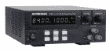 

### 电源-多量程 DC 84V，10A

[Retired](https://learn.sparkfun.com/static/bubbles/ "Retired") TOL-14926

B&K 精密公司的这款多量程 DC 电源能够替代您工作台上的几个电源

**Retired**[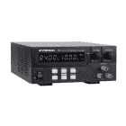](https://www.sparkfun.com/products/retired/14927) 

### [电源——多档 DC 42V，20A](https://www.sparkfun.com/products/retired/14927)

[Retired](https://learn.sparkfun.com/static/bubbles/ "Retired") TOL-14927

B&K 精密公司的这款多量程 DC 电源能够替代您工作台上的几个电源

**Retired**[Favorited Favorite](# "Add to favorites") 1[Wish List](# "Add to wish list")[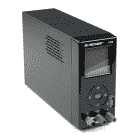](https://www.sparkfun.com/products/retired/14928) 

### [开关电源——DC 36V，3A](https://www.sparkfun.com/products/retired/14928)

[Retired](https://learn.sparkfun.com/static/bubbles/ "Retired") TOL-14928

B&K 精密公司的这款 DC 开关电源是一款紧凑型 108 瓦电源，从其主电源提供 1-36V 和 0-3A 的电流

**Retired**[Favorited Favorite](# "Add to favorites") 7[Wish List](# "Add to wish list")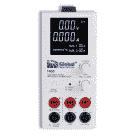 

### 开关电源- DC 20V，5A

[Retired](https://learn.sparkfun.com/static/bubbles/ "Retired") TOL-14929

B&K 精密公司的这款 DC 开关电源是一款紧凑型 100 瓦电源，从其三个…

3 **Retired**

#### 交流至 DC 墙壁适配器

一个特定的[交流到 DC 电源](http://www.sparkfun.com/products/298)经常在电路被验证后使用。如果您经常在项目中反复使用同一个开发板，这个选项也很棒。这些墙壁适配器通常有固定的电压和电流输出，因此务必确保您选择的适配器符合您要供电的项目的正确规格，并且不超过这些规格。这里有几个来自目录的[墙壁适配器，提供几安培。](https://www.sparkfun.com/categories/308)

 

将**添加到您的[购物车](https://www.sparkfun.com/cart)中！**

### [墙壁适配器电源- 12VDC，600mA(筒式插孔)](https://www.sparkfun.com/products/15313)

[In stock](https://learn.sparkfun.com/static/bubbles/ "in stock") TOL-15313

这是一个高质量的交流到 DC 的“壁式电源”，在高达 600 毫安时产生 12v 直流稳压输出。

$6.50[Favorited Favorite](# "Add to favorites") 8[Wish List](# "Add to wish list")****[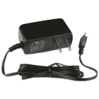](https://www.sparkfun.com/products/15311) 

将**添加到您的[购物车](https://www.sparkfun.com/cart)中！**

### [【墙上适配器电源- 5VDC，2A (USB Micro-B)](https://www.sparkfun.com/products/15311)

[In stock](https://learn.sparkfun.com/static/bubbles/ "in stock") TOL-15311

这是一个高品质的开关“壁式电源”AC 到 DC 5V 2000mA USB 微型 B 壁式电源，专为 S…

$6.50[Favorited Favorite](# "Add to favorites") 2[Wish List](# "Add to wish list")**** 

将**添加到您的[购物车](https://www.sparkfun.com/cart)中！**

### [墙壁适配器电源- 9VDC，650mA(筒式插孔)](https://www.sparkfun.com/products/15314)

[In stock](https://learn.sparkfun.com/static/bubbles/ "in stock") TOL-15314

这是一个高品质的开关“壁式”交流到 DC 9V 650 毫安壁式电源，专为 SparkFun Elect 制造…

$6.501[Favorited Favorite](# "Add to favorites") 12[Wish List](# "Add to wish list")**** 

将**添加到您的[购物车](https://www.sparkfun.com/cart)中！**

### [USB 壁式充电器- 5V，1A(黑色)](https://www.sparkfun.com/products/11456)

[In stock](https://learn.sparkfun.com/static/bubbles/ "in stock") TOL-11456

现在 USB 越来越多地被作为一种电源连接标准来实现，但是你并不总是在 han 上有一台计算机…

$4.502[Favorited Favorite](# "Add to favorites") 10[Wish List](# "Add to wish list")******** ********对于更多当前急需的项目，请从我们的目录中查看这些[电源。请务必从产品页面的推荐产品中选择适合您所在地区的线缆。](https://www.sparkfun.com/categories/307)

 

### [指 LED 开关电源-5v 直流，5A](https://www.sparkfun.com/products/retired/14601)

[Retired](https://learn.sparkfun.com/static/bubbles/ "Retired") TOL-14601

这是一款 40W 单输出开关电源，来自 Mean Well，专为 LED 应用而设计

**Retired**[Favorited Favorite](# "Add to favorites") 8[Wish List](# "Add to wish list")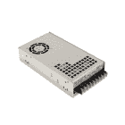 

### 平均井开关电源- 24VDC，18.8A

[Retired](https://learn.sparkfun.com/static/bubbles/ "Retired") TOL-16265

这意味着开关电源具有 24VDC、18.8A、451.2W 的输出

**Retired** 

### 平均井开关电源- 12VDC，12.5A

[Retired](https://learn.sparkfun.com/static/bubbles/ "Retired") TOL-16266

这意味着开关电源具有 12VDC、12.5A、150W 的输出。

**Retired**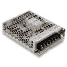 

### 平均井开关电源-5v 直流，18A

[Retired](https://learn.sparkfun.com/static/bubbles/ "Retired") TOL-16607

这是一款来自 Mean Well 的 100W 单输出开关电源。

**Retired**

#### 电池

如果您希望您的项目是移动的或位于远离电网交流电源的偏远位置，电池是您正在寻找的答案。电池有很多种，所以一定要看看本教程的后面部分，这样你就能准确地决定选择什么。常见的选择有[碱性](https://www.sparkfun.com/products/10218)、[可充电镍氢 AA 的](http://www.sparkfun.com/products/335)、[锂聚合物离子](http://www.sparkfun.com/products/8483)。这里有一些来自目录的[电池。](https://www.sparkfun.com/categories/54)

 

将**添加到您的[购物车](https://www.sparkfun.com/cart)中！**

### [锂离子电池- 2Ah](https://www.sparkfun.com/products/13855)

[In stock](https://learn.sparkfun.com/static/bubbles/ "in stock") PRT-13855

这是基于锂离子化学的非常薄、非常轻的电池。每个电池在 200 伏时输出一个标称的 3.7 伏电压…

$13.959[Favorited Favorite](# "Add to favorites") 43[Wish List](# "Add to wish list")****[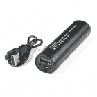](https://www.sparkfun.com/products/15204) 

### [低电流锂离子电池组- 2.5Ah (USB)](https://www.sparkfun.com/products/15204)

[Out of stock](https://learn.sparkfun.com/static/bubbles/ "out of stock") TOL-15204

我们采用了经典的便携式可充电锂离子电池组，并对设计进行了调整，使其适合低成本使用

3[Favorited Favorite](# "Add to favorites") 12[Wish List](# "Add to wish list")[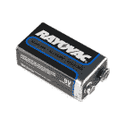](https://www.sparkfun.com/products/10218) 

将**添加到您的[购物车](https://www.sparkfun.com/cart)中！**

### [9V 碱性电池](https://www.sparkfun.com/products/10218)

[In stock](https://learn.sparkfun.com/static/bubbles/ "in stock") PRT-10218

这些是 Rayovac 的标准 9 伏碱性电池。想都别想给这些充电。与…一起使用它们

$2.251[Favorited Favorite](# "Add to favorites") 6[Wish List](# "Add to wish list")****[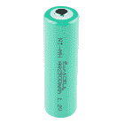](https://www.sparkfun.com/products/335) 

将**添加到您的[购物车](https://www.sparkfun.com/cart)中！**

### [2500 毫安镍氢电池——AA](https://www.sparkfun.com/products/335)

[In stock](https://learn.sparkfun.com/static/bubbles/ "in stock") PRT-00335

2500mAh 1.2V 镍金属氢化物可充电' AA '电池。【镍氢技术】(http://en . Wikipedia . org/wiki/Nickel _ metal _ hy…

$3.25[Favorited Favorite](# "Add to favorites") 10[Wish List](# "Add to wish list")****** ******如果你的项目需要电池提供一定的电压或稍大一点的电流，试着增加一个升压转换器或开关调节器。你可以从你的电池中取出变化的电压，输出一个设定的 5V 电压。根据你的项目所使用的电路板和元件，你可能会根据配置[输出 9V](https://learn.sparkfun.com/tutorials/buck-boost-hookup-guide) 或 [10V](https://learn.sparkfun.com/tutorials/sparkfun-5v1a-lipo-chargerbooster-hookup-guide#using-multiple-charger-boosters) 。你只需要确保获得必要的元件来构建你的电路，以便输出高于 5V 的电压。以下是我们产品目录中的几款[转换器。](https://www.sparkfun.com/categories/353)

 

将**添加到您的[购物车](https://www.sparkfun.com/cart)中！**

### [SparkFun LiPo 充电器/升压器- 5V/1A](https://www.sparkfun.com/products/14411)

[In stock](https://learn.sparkfun.com/static/bubbles/ "in stock") PRT-14411

SparkFun 5V/1A 脂肪充电器/升压器是一个从 5V 的锂聚合物电池产生一安培的可靠电路。…

$17.501[Favorited Favorite](# "Add to favorites") 32[Wish List](# "Add to wish list")****[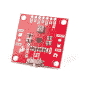](https://www.sparkfun.com/products/15208) 

将**添加到您的[购物车](https://www.sparkfun.com/cart)中！**

### 

[In stock](https://learn.sparkfun.com/static/bubbles/ "in stock") COM-15208

SparkFun 降压-升压转换器是一个方便的电源附件板，允许您微调您的项目的功率量

$10.952[Favorited Favorite](# "Add to favorites") 26[Wish List](# "Add to wish list")****[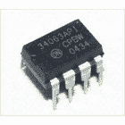](https://www.sparkfun.com/products/retired/317) 

### [升压/降压逆变开关稳压器](https://www.sparkfun.com/products/retired/317)

[Retired](https://learn.sparkfun.com/static/bubbles/ "Retired") COM-00317

直流到 DC 转换器/调节器 MC34063A。输入范围为 3V 至 40V，输出开关电流高达 1.5 安培。站起来，站起来…

**Retired**[Favorited Favorite](# "Add to favorites") 8[Wish List](# "Add to wish list")[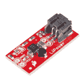](https://www.sparkfun.com/products/10255) 

将**添加到您的[购物车](https://www.sparkfun.com/cart)中！**

### [功率升压转换器](https://www.sparkfun.com/products/10255)

[Out of stock](https://learn.sparkfun.com/static/bubbles/ "out of stock") PRT-10255

LiPower 板基于功能极其丰富的 TPS61200 升压转换器。该板配置为与 Li 一起使用…

$17.505[Favorited Favorite](# "Add to favorites") 28[Wish List](# "Add to wish list")****** ******## 电压/电流考虑

### 项目 X 需要多少电压？

这很大程度上取决于电路，所以这个问题没有简单的答案。然而，像 Arduino Uno 这样的大多数微处理器开发板都有一个电压调节器。这允许我们提供高于调节电压的特定范围内的电压。开发板上的许多微处理器和 IC 运行在 3.3V 或 5V，但具有可以处理 6V 至 12V 任何电压的稳压器。

功率来自电源，然后由电压调节器严密调节，使得即使电流消耗可能在不同时间波动，每个芯片也以一致的电压供电。在 SparkFun，我们的许多产品都使用 [9V 电源](http://www.sparkfun.com/products/298)，工作电压范围为 3.3V 至 5V。不过，要验证什么电压是安全的，建议您查看开发板上稳压器的数据手册，了解制造商建议的电压范围。

### 项目 X 需要多少电流？

这个问题还取决于您使用的开发板和微处理器，以及您计划连接到它的电路。如果你的电源不能给你项目所需的电量，电路可能会以一种奇怪的、不可预测的方式开始工作。这也称为掉电。

与电压一样，建议查看数据手册，估计电路的不同部分可能需要什么。更好的做法是总结并假设电路需要更多的电流，而不是不提供足够的电流。如果您的电路包含需要大量电流的元件，如电机或大量的 [LED](https://www.sparkfun.com/leds) s，您可能需要一个大电源，甚至为微处理器和额外的电机提供单独的电源。否则，电力下降可能会导致微处理器重置，无法从您的电机提供足够的扭矩，或者您的 led 可能不会完全亮起。同样，与不能提供足够电流的电源相比，获得额定电流更高的电源而不使用额外的电流总是符合您的最佳利益的。

[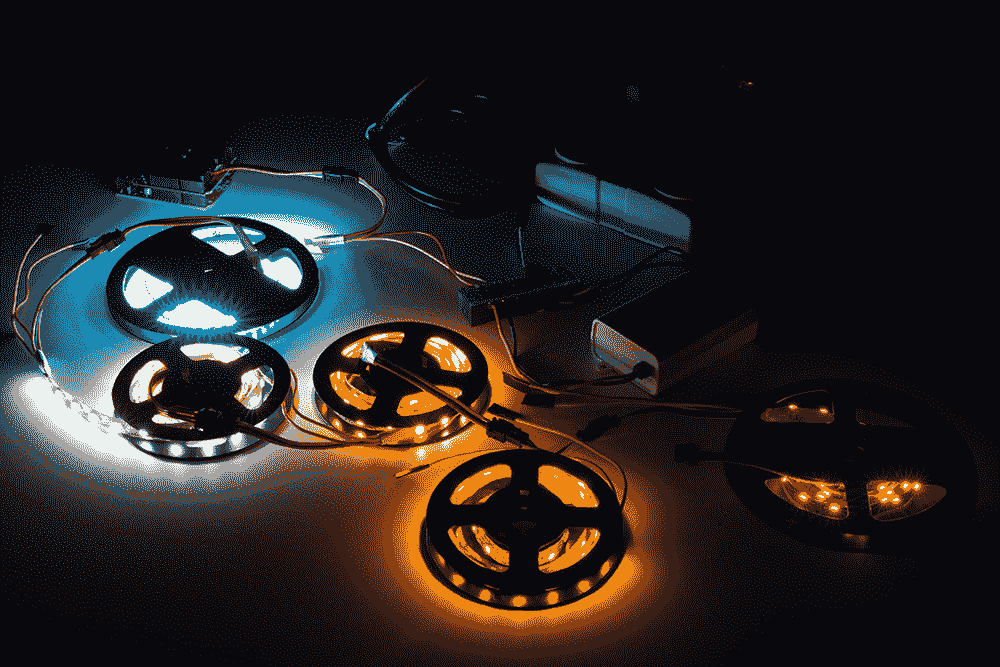](https://learn.sparkfun.com/tutorials/mean-well-led-switching-power-supply-hookup-guide#daisychain)*Brown-Outs with [Daisy Chained LED Strips](https://learn.sparkfun.com/tutorials/mean-well-led-switching-power-supply-hookup-guide#daisychain)*

### 不知道你的项目消耗了多少电流？

一旦你已经玩了一段时间的电路，它将更容易估计你的项目需要的电流量。然而，通过实验找出它的常见方法是，要么使用具有电流读数的可变 DC 台式电源，要么使用[数字万用表](http://www.sparkfun.com/products/9141)测量电路运行时流入电路的电流。这将使您大致了解为您的项目选择哪种电源。

如果你不知道如何用万用表测量电流，请看我们的[万用表教程](https://learn.sparkfun.com/tutorials/how-to-use-a-multimeter/measuring-current)。

 [### 如何使用万用表

#### 2015 年 1 月 9 日](https://learn.sparkfun.com/tutorials/how-to-use-a-multimeter) Learn the basics of using a multimeter to measure continuity, voltage, resistance and current.[Favorited Favorite](# "Add to favorites") 67

我们强烈建议在你的电子工具箱里放一个数字万用表。它非常适合测量电流或电压。

## 连接

### 如何将电池或电源连接到电路？

有许多方法可以将电源连接到您的项目。

[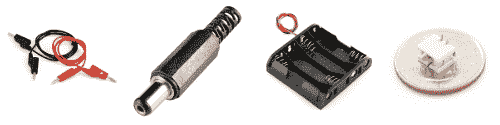](//cdn.sparkfun.com/assets/a/b/d/b/e/5115786ece395f9b23000000.jpg)*Common ways to connect a power to your circuit*

可变台式电源通常使用[香蕉插孔](https://learn.sparkfun.com/tutorials/connector-basics/temporary-connectors#banana)或[电线](https://learn.sparkfun.com/tutorials/working-with-wire)直接连接到电路。这些也类似于[万用表探针电缆](https://learn.sparkfun.com/tutorials/how-to-use-a-multimeter#probe-types)上的连接器。

 

将**添加到您的[购物车](https://www.sparkfun.com/cart)中！**

### [香蕉到 IC 钩线缆](https://www.sparkfun.com/products/506)

[Out of stock](https://learn.sparkfun.com/static/bubbles/ "out of stock") CAB-00506

这些是用于连接万用表、电源、示波器、信号发生器等的各种引线电缆。电缆…

$5.507[Favorited Favorite](# "Add to favorites") 10[Wish List](# "Add to wish list")****[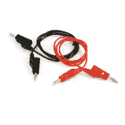](https://www.sparkfun.com/products/507) 

将**添加到您的[购物车](https://www.sparkfun.com/cart)中！**

### [香蕉到香蕉的电缆](https://www.sparkfun.com/products/507)

[Out of stock](https://learn.sparkfun.com/static/bubbles/ "out of stock") CAB-00507

这些是用于连接万用表、电源、示波器、信号发生器等的各种引线电缆。电缆…

$5.502[Favorited Favorite](# "Add to favorites") 5[Wish List](# "Add to wish list")****[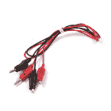](https://www.sparkfun.com/products/509) 

将**添加到您的[购物车](https://www.sparkfun.com/cart)中！**

### [香蕉对鳄索](https://www.sparkfun.com/products/509)

[Out of stock](https://learn.sparkfun.com/static/bubbles/ "out of stock") CAB-00509

这些是用于连接万用表、电源、示波器、信号发生器等的各种引线电缆。电缆…

$4.503[Favorited Favorite](# "Add to favorites") 18[Wish List](# "Add to wish list")****[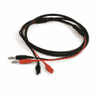](https://www.sparkfun.com/products/508) 

将**添加到您的[购物车](https://www.sparkfun.com/cart)中！**

### [香蕉对鳄鱼同轴电缆](https://www.sparkfun.com/products/508)

[Out of stock](https://learn.sparkfun.com/static/bubbles/ "out of stock") CAB-00508

这些是用于连接万用表、电源、示波器、信号发生器等的各种引线电缆。高品质…

$5.501[Favorited Favorite](# "Add to favorites") 6[Wish List](# "Add to wish list")******** ********许多项目都是在[试验板](https://learn.sparkfun.com/tutorials/how-to-use-a-breadboard)上构建的，在成为最终产品之前，先用[线](https://learn.sparkfun.com/tutorials/working-with-wire)作为原型。有很多方法可以给你的试验板电路供电，其中很多都涉及到这里提到的连接器。

 

将**添加到您的[购物车](https://www.sparkfun.com/cart)中！**

### [【试验板-不干胶(白色)](https://www.sparkfun.com/products/12002)

[In stock](https://learn.sparkfun.com/static/bubbles/ "in stock") PRT-12002

这是你的尝试和真正的白色无焊试验板。它有 2 条电源总线，10 列，30 行，总共 400 个连接…

$5.5048[Favorited Favorite](# "Add to favorites") 93[Wish List](# "Add to wish list")**** 

将**添加到您的[购物车](https://www.sparkfun.com/cart)中！**

### 

[In stock](https://learn.sparkfun.com/static/bubbles/ "in stock") PRT-11367

各种颜色的电线:你知道这是一个美丽的东西。六种不同颜色的硬纸板实芯焊丝…

$21.5037[Favorited Favorite](# "Add to favorites") 86[Wish List](# "Add to wish list")**** 

将**添加到您的[购物车](https://www.sparkfun.com/cart)中！**

### [跳线高级 6 "米/米装 10 根](https://www.sparkfun.com/products/8431)

[In stock](https://learn.sparkfun.com/static/bubbles/ "in stock") PRT-08431

这是一个 SparkFun 独家！这些是 155 毫米长、26 AWG 跳线，两端都有公接头。用这些来跳离…

$4.502[Favorited Favorite](# "Add to favorites") 11[Wish List](# "Add to wish list")**** 

将**添加到您的[购物车](https://www.sparkfun.com/cart)中！**

### [【试验板-迷你模块化(红色)](https://www.sparkfun.com/products/12044)

[In stock](https://learn.sparkfun.com/static/bubbles/ "in stock") PRT-12044

这个红色迷你试验板是你的小项目原型的好方法！有了 170 个并列点，就有足够的空间来建立…

$4.50[Favorited Favorite](# "Add to favorites") 12[Wish List](# "Add to wish list")******** ********一旦项目通过了原型阶段，它通常会在 [PCB](https://learn.sparkfun.com/tutorials/pcb-basics) 上结束。如果您计划制作一次或两次电路，可以将电路转移到原型板上，并手动连接电路以保护项目。如果你计划多次制作电路，你可能想研究用 CAD 软件(即 Eagle )设计电路的[，以节省项目布线的时间，或者如果你计划缩小整个电路的尺寸。](https://www.sparkfun.com/EAGLE)

[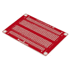](https://www.sparkfun.com/products/12070) 

将**添加到您的[购物车](https://www.sparkfun.com/cart)中！**

### [SparkFun 可焊电路板](https://www.sparkfun.com/products/12070)

[In stock](https://learn.sparkfun.com/static/bubbles/ "in stock") PRT-12070

这是 SparkFun 可焊接试验板。一个裸露的 PCB，尺寸与我们的常规试验板完全相同，连接方式相同…

$5.5017[Favorited Favorite](# "Add to favorites") 58[Wish List](# "Add to wish list")**** 

将**添加到您的[购物车](https://www.sparkfun.com/cart)中！**

### [spark fun snap able 原板](https://www.sparkfun.com/products/13268)

[In stock](https://learn.sparkfun.com/static/bubbles/ "in stock") PRT-13268

有时候，拥有一个又长又瘦、超级小或者只有一堆洞的原型板是件好事。SparkFun Sn…

$8.9519[Favorited Favorite](# "Add to favorites") 71[Wish List](# "Add to wish list")****[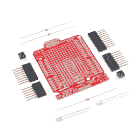](https://www.sparkfun.com/products/13820) 

将**添加到您的[购物车](https://www.sparkfun.com/cart)中！**

### [SparkFun 原盾套装](https://www.sparkfun.com/products/13820)

[19 available](https://learn.sparkfun.com/static/bubbles/ "19 available") DEV-13820

SparkFun ProtoShield 套件让你使用你能想到的任何电路定制你自己的 Arduino 盾牌，然后…

$12.503[Favorited Favorite](# "Add to favorites") 17[Wish List](# "Add to wish list")****[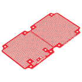](https://www.sparkfun.com/products/13317) 

将**添加到您的[购物车](https://www.sparkfun.com/cart)中！**

### [SparkFun 大红色方块原型板](https://www.sparkfun.com/products/13317)

[In stock](https://learn.sparkfun.com/static/bubbles/ "in stock") DEV-13317

SparkFun 大红色盒原型板是一个大的，定制的 PCB，是专门设计用于和 inst…

$8.951[Favorited Favorite](# "Add to favorites") 21[Wish List](# "Add to wish list")******** ********在消费电子和业余电子产品中，成品 PCB 上最常用的电源连接器之一是[筒式连接器](https://learn.sparkfun.com/tutorials/connector-basics/power-connectors)，也称为筒式插孔。它们的大小可以不同，但它们的功能都是相同的，并且提供了一种简单、可靠的方式来为您的项目提供动力。根据您的设计，您也可以从电脑或墙壁适配器的 USB 端口获取电源。

 

将**添加到您的[购物车](https://www.sparkfun.com/cart)中！**

### [SparkFun USB-C 突破](https://www.sparkfun.com/products/15100)

[In stock](https://learn.sparkfun.com/static/bubbles/ "in stock") BOB-15100

SparkFun USB-C 分线板在断开连接上的每个引脚时，提供的功率是以前 USB 板的 3 倍…

$4.955[Favorited Favorite](# "Add to favorites") 33[Wish List](# "Add to wish list")**** 

将**添加到您的[购物车](https://www.sparkfun.com/cart)中！**

### [DC 筒式插孔适配器-兼容试验板](https://www.sparkfun.com/products/10811)

[In stock](https://learn.sparkfun.com/static/bubbles/ "in stock") PRT-10811

这个 DC 电源插孔/连接器就像我们携带的另一个，除了它的终端与试验板友好的 pi…

$1.058[Favorited Favorite](# "Add to favorites") 59[Wish List](# "Add to wish list")****[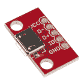](https://www.sparkfun.com/products/12035) 

将**添加到您的[购物车](https://www.sparkfun.com/cart)中！**

### [SparkFun 微博 USB 突围](https://www.sparkfun.com/products/12035)

[In stock](https://learn.sparkfun.com/static/bubbles/ "in stock") BOB-12035

这个简单的电路板将 micro-B USB 连接器的 VCC、GND、ID、D-和 D+引脚连接到 0.1 英寸间距的接头上。如果你想广告…

$2.9512[Favorited Favorite](# "Add to favorites") 38[Wish List](# "Add to wish list")**** 

将**添加到您的[购物车](https://www.sparkfun.com/cart)中！**

### [DC 筒式千斤顶适配器——母](https://www.sparkfun.com/products/10288)

[In stock](https://learn.sparkfun.com/static/bubbles/ "in stock") PRT-10288

此适配器允许您将筒式插孔连接器连接到裸线。一端有螺丝端子，另一端有一个 5.5…

$3.501[Favorited Favorite](# "Add to favorites") 24[Wish List](# "Add to wish list")******** ********电池通常装在一个装有电池的盒子里，并通过电线或筒状插孔连接电路。一些像锂聚合物离子电池的电池经常使用一个 [JST 连接器](http://www.sparkfun.com/products/9749)。这里有一些来自我们目录的。

 

将**添加到您的[购物车](https://www.sparkfun.com/cart)中！**

### [9V 电池座](https://www.sparkfun.com/products/10512)

[In stock](https://learn.sparkfun.com/static/bubbles/ "in stock") PRT-10512

这款 9V 电池盒可让您的电池卡紧并固定到位，这在您没有…

$3.503[Favorited Favorite](# "Add to favorites") 20[Wish List](# "Add to wish list")****[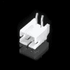](https://www.sparkfun.com/products/9749) 

将**添加到您的[购物车](https://www.sparkfun.com/cart)中！**

### [JST 直角连接器-通孔 2 针](https://www.sparkfun.com/products/9749)

[In stock](https://learn.sparkfun.com/static/bubbles/ "in stock") PRT-09749

这是一个 2 针通孔 PH 系列 JST 连接器。引脚间距为 2 毫米。我们真的很喜欢这种牢固的锁定感…

$1.052[Favorited Favorite](# "Add to favorites") 43[Wish List](# "Add to wish list")****[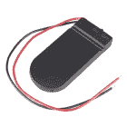](https://www.sparkfun.com/products/12618) 

将**添加到您的[购物车](https://www.sparkfun.com/cart)中！**

### [纽扣电池电池座-2 xcr 2032](https://www.sparkfun.com/products/12618)

[In stock](https://learn.sparkfun.com/static/bubbles/ "in stock") PRT-12618

这是一个简单的硬币电池盒，可以装入两个 CR2032 电池，并通过两个…

$2.101[Favorited Favorite](# "Add to favorites") 24[Wish List](# "Add to wish list")****[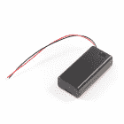](https://www.sparkfun.com/products/9547) 

将**添加到您的[购物车](https://www.sparkfun.com/cart)中！**

### [电池座 2xAA 带盖带开关](https://www.sparkfun.com/products/9547)

[In stock](https://learn.sparkfun.com/static/bubbles/ "in stock") PRT-09547

这款 2xAA 电池盒为您的电池供电项目画龙点睛。这个支架有一个可移动的滑动…

$1.60[Favorited Favorite](# "Add to favorites") 15[Wish List](# "Add to wish list")******** ********要了解更多关于不同电源连接器的信息，请参阅我们的[连接器教程](http://learn.sparkfun.com/tutorials/connector-basics/power-connectors)。

 [### 连接器基础

#### 2013 年 1 月 18 日](https://learn.sparkfun.com/tutorials/connector-basics) Connectors are a major source of confusion for people just beginning electronics. The number of different options, terms, and names of connectors can make selecting one, or finding the one you need, daunting. This article will help you get a jump on the world of connectors.[Favorited Favorite](# "Add to favorites") 62

## 远程/移动电源

### 我应该选择哪种电池？

当你给一个远程电路供电时，寻找一个能提供合适电压和电流的电池的问题仍然存在。电池寿命或容量是衡量电池总电量的指标。电池的容量通常以**安培-小时** (Ah)或毫安-小时(mAh)为单位，它告诉你一个充满电的电池在一个小时内可以提供多少安培。例如，一个 2000 毫安的电池可以为 2A(2000 毫安)供电一个小时。

当使你的项目移动时，电池的大小、形状和重量也是需要考虑的因素，特别是如果它是在像小型四轴直升机一样飞行的东西上。你可以通过访问这个[维基百科列表](http://en.wikipedia.org/wiki/List_of_battery_sizes)来大致了解这个品种。在我们的[电池技术教程](http://learn.sparkfun.com/tutorials/battery-technologies)中了解更多关于电池类型的信息。

 [### 电池技术

#### 2013 年 2 月 6 日](https://learn.sparkfun.com/tutorials/battery-technologies) The basics behind the batteries used in portable electronic devices: LiPo, NiMH, coin cells, and alkaline.[Favorited Favorite](# "Add to favorites") 50

### 串联和并联电池

您可以添加串联[或并联](https://learn.sparkfun.com/tutorials/series-and-parallel-circuits)的电池，以产生项目所需的电压和电流。当两个或更多的电池被放置在**系列**中时，电池的电压被加在一起。例如，铅酸汽车电池实际上是由六个单体铅酸电池串联在一起制成的；六个 2.1V 电池加起来产生 12.6V。当串联两个电池时，建议它们具有相同的化学性质。此外，要警惕电池串联充电，因为许多充电器仅限于单电池充电。

[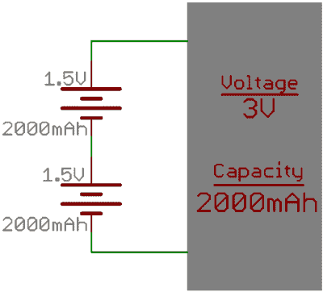](https://cdn.sparkfun.com/assets/9/9/8/6/a/51eef6b0ce395fe962000000.PNG)

当您将两个或更多电池并联**时，容量会增加。例如，并联的四节 AA 电池仍将产生 1.5V 的电压，但是电池的容量将增加四倍。**

[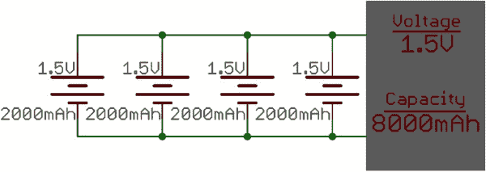](https://cdn.sparkfun.com/assets/a/3/d/d/6/51eef9cdce395f294b000000.jpg)

### 我的项目需要多大的电池容量？

一旦确定了电路正常消耗的电流量，这个问题就容易回答了。在下面的例子中，我们将使用估算。但是，建议您使用[数字万用表](http://learn.sparkfun.com/tutorials/how-to-use-a-multimeter)测量电路的电流消耗，以获得准确的结果。

作为一个例子，让我们从一个电路开始，估计它的电流输出，然后选择一个电池，并计算电路将在电池电源下运行多长时间。让我们选择一个 [ATmega 328 微控制器](https://www.sparkfun.com/products/10524)作为电路的大脑。正常情况下，功耗约为 20mA。现在让我们将三个[红色 LED](https://www.sparkfun.com/products/9590)和标准 [330 欧姆限流电阻](https://www.sparkfun.com/products/8377)连接到微控制器的数字 I/O 引脚。在这种配置中，每增加一个 LED 都会使电路多消耗大约 10mA 的电流。现在让我们将两个[微型金属马达](https://www.sparkfun.com/products/8910)也连接到微控制器。当打开时，每一个都使用大约 25mA。我们现在可能的总电流消耗是:

[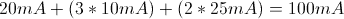](//cdn.sparkfun.com/assets/6/3/3/c/8/51438101ce395f9b09000000.gif)

让我们为此选择一个标准的碱性 AA 电池，因为它具有足够的电流容量(高达 1A)，具有体面的电池容量(通常在 1.5 Ah 至 2.5Ah 的范围内)，并且非常常见。我们假设这个例子的平均值是 2Ah。使用 AA 的缺点是它只有 1.5V 的输出，而且，由于我们的其他组件将在 5V 下运行，我们需要提高电压。我们可以使用这个 [5V 升压突破](https://www.sparkfun.com/products/10968)来获得我们需要的电压，或者我们可以使用三节 AA 电池串联来接近我们需要的电压。串联的三个 AA 给我们 4.5 V 的电压(1.5V 的 3 倍)。您也可以添加另一个电池，总电压为 6V，并将电压下调至电路所需的电压。

为了计算电池供电的电路持续时间，我们使用以下公式:

[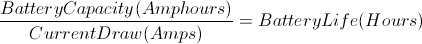](//cdn.sparkfun.com/assets/f/e/1/9/f/51438101ce395f9909000000.gif)

对于一个由 3 个 AA 并联供电的电路，该电路连接到一个具有恒定 100mA 电流消耗的电路，这可转换为:

[}{100mA} = \frac{6000mAh}{100mA} = 60h")](http://www.codecogs.com/eqnedit.php?latex=\frac{(3*2Ah)}{100mA}&space;=&space;\frac{6000mAh}{100mA}&space;=&space;60h)

在这种并联配置中，我们将理想地从这三个碱性 AA 获得 60 小时的电池寿命。然而，给电池“降额”是一个很好的做法，这意味着假设你将获得比理想电池寿命更短的电池寿命。保守地说，我们将获得 75%的理想电池寿命，因此我们的项目大约有 45 小时的电池寿命。

电池寿命也可能因实际电流消耗而异。这是 Energizer AA 电池的图表，显示了基于恒定电流消耗的预期电池寿命。

[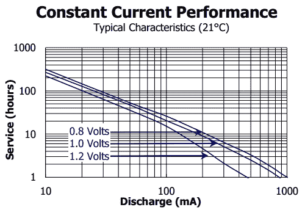](//dlnmh9ip6v2u.cloudfront.net/assets/e/1/e/3/d/511580dace395f1b23000000.jpg)*Energizer AA, Current vs Battery Life*

这只是您可以用来远程启动项目的众多配置之一。

**Looking for More Examples?** Check out the [Powering LilyPad LED Projects](https://learn.sparkfun.com/tutorials/powering-lilypad-led-projects#how-long-will-my-project-run-on-battery-power) for another example of calculating how much power your project will need for LEDs!

 [### 为 LilyPad LED 项目供电

#### 2016 . 12 . 17](https://learn.sparkfun.com/tutorials/powering-lilypad-led-projects) Learn how to calculate how many LEDs your LilyPad project can power and how long it will last.[Favorited Favorite](# "Add to favorites") 8

## 压力测试

既然您已经选择了电源和连接器，请确保测试您的项目并观察其行为。根据制造商的不同，电源可能会有不同的性能。确保在一定时间内测试墙壁适配器，以确保微控制器不会掉电，电源不会在负载下重置。对于某些使用电容式触摸传感器的项目，请务必进行测试，查看是否存在由高噪声电源引起的延迟。

如果您远程为项目供电，请确保始终使用电池进行测试。电池可以提供不同的输出，这取决于所连接的负载和电池的化学性质。这也可能导致微控制器掉电或停止供电。

## 资源和更进一步

现在，您应该知道为电路供电的最常见方式，以及如何根据项目的具体要求确定哪种方式最适合您。现在，您可以根据项目的电流、电压、连接器和移动性因素做出更好的判断。检查这些其他伟大的教程，以监测，控制，或电力您的项目！

 [### 电力](https://learn.sparkfun.com/tutorials/electric-power) An overview of electric power, the rate of energy transfer. We'll talk definition of power, watts, equations, and power ratings. 1.21 gigawatts of tutorial fun 54 [### LTC4150 库仑计数器连接指南](https://learn.sparkfun.com/tutorials/ltc4150-coulomb-counter-hookup-guide) A "Coulomb Counter" is like a gas gauge for your battery. Here's how to use it.[Favorited Favorite](# "Add to favorites") 4 [### 降压升压连接指南](https://learn.sparkfun.com/tutorials/buck-boost-hookup-guide) This tutorial shows you how to hook up and use the SparkFun Buck-Boost board.[Favorited Favorite](# "Add to favorites") 4 [### 安全 DIY 车库开门器](https://learn.sparkfun.com/tutorials/secure-diy-garage-door-opener) Did you know that most garage doors are at risk of a roll jam attack? Here we make a DIY garage door remote-control system that is much more secure than most commercial-ready products using the latest in ECC cryptography.[Favorited Favorite](# "Add to favorites") 12

或者看看下面的一些博客帖子来寻找灵感:

 [### 锂电池有什么好大惊小怪的？

February 23, 2015](https://www.sparkfun.com/news/1755 "February 23, 2015: The positives and negatives of shipping lithium batteries in the 21st century.")[Favorited Favorite](# "Add to favorites") 2 [### 每日英语:深度睡眠冒险

May 28, 2015](https://www.sparkfun.com/news/1842 "May 28, 2015: Exploring sleep modes in two WiFi-connected development boards: the ESP8266 Thing and the Photon.")[Favorited Favorite](# "Add to favorites") 6 [### 英语日:电池管理

March 23, 2017](https://www.sparkfun.com/news/2338 "March 23, 2017: This post explores how to use the power control features of the Battery Babysitter to make a product with the features we expect from portable embedded electronics.")[Favorited Favorite](# "Add to favorites") 1 [### 可穿戴设备和角色扮演的电源解决方案

June 19, 2018](https://www.sparkfun.com/news/2713 "June 19, 2018: Let's take a look at different power solutions for your garments and props!")[Favorited Favorite](# "Add to favorites") 3 [### 今日英语:十年的试验台

October 10, 2019](https://www.sparkfun.com/news/3101 "October 10, 2019: We collected over two hundred retired testbeds and turned them into art! Join us as we highlight this project and tell some of the stories behind these dusty old circuit boards.")[Favorited Favorite](# "Add to favorites") 1********************************************************************