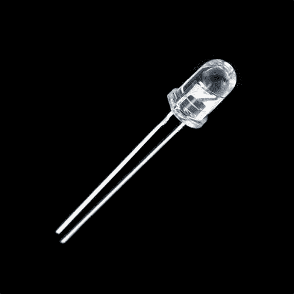
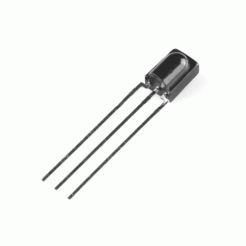
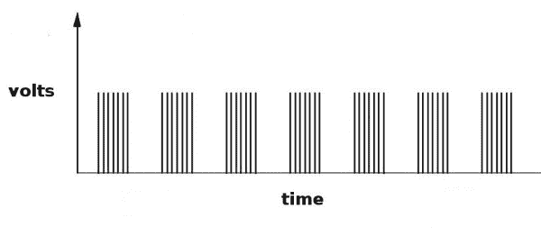
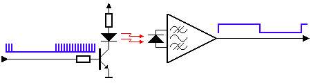

# 红外通信

> 原文：<https://learn.sparkfun.com/tutorials/ir-communication>

## 介绍

IR，即[红外线](http://en.wikipedia.org/wiki/Infrared)，通信是一种常见、廉价且易于使用的无线通信技术。红外光与可见光非常相似，[，除了它的波长稍长](https://learn.sparkfun.com/tutorials/light/infrared-light)。这意味着红外线是人眼无法察觉的，非常适合无线通信。例如，当您按下电视遥控器上的按钮时，红外 LED 每秒钟重复打开和关闭 38，000 次，以将信息(如音量或频道控制)传输到电视上的红外照片传感器。

 

将**添加到您的[购物车](https://www.sparkfun.com/cart)中！**

### [LED -红外 950nm](https://www.sparkfun.com/products/9349)

[In stock](https://learn.sparkfun.com/static/bubbles/ "in stock") COM-09349

这是一个非常简单、清晰的红外 LED。这些器件工作在 940-950 纳米之间，适用于通用红外系统，包括

$1.052[Favorited Favorite](# "Add to favorites") 17[Wish List](# "Add to wish list")**** 

将**添加到您的[购物车](https://www.sparkfun.com/cart)中！**

### [红外接收二极管- TSOP38238](https://www.sparkfun.com/products/10266)

[In stock](https://learn.sparkfun.com/static/bubbles/ "in stock") SEN-10266

使用这个简单的红外接收器对你的下一个项目进行红外遥控。具有低功耗和易于使用的 p…

$2.10[Favorited Favorite](# "Add to favorites") 19[Wish List](# "Add to wish list")**** ****本教程将首先解释常见红外通信协议的内部工作原理。然后我们将看两个例子，它们将允许您使用 Arduino 发送和接收 IR 数据。在第一个示例中，我们将使用 TSOP382 红外光电传感器从普通遥控器读取输入的红外数据。下一个示例将向您展示如何通过红外 LED 传输数据来控制普通设备，例如您的家庭立体声音响。

### 所需软件

所有复杂的信号处理都由 Ken Shirriff 编写的强大的 Arduino 库来处理，并允许您轻松地发送和接收 IR 数据。关于红外 Arduino 库如何工作的更多细节，请参见[肯·希尔里夫的博客:Arduino 的多协议红外远程库](http://www.righto.com/2009/08/multi-protocol-infrared-remote-library.html)。此外，本教程中使用的代码示例可以在库中的 examples 目录中找到。

### 推荐阅读

以下是我们将在本教程中涉及的一些概念。

 [### 如何焊接:通孔焊接](https://learn.sparkfun.com/tutorials/how-to-solder-through-hole-soldering) This tutorial covers everything you need to know about through-hole soldering.[Favorited Favorite](# "Add to favorites") 70 [### 安装 Arduino 库](https://learn.sparkfun.com/tutorials/installing-an-arduino-library) How do I install a custom Arduino library? It's easy! This tutorial will go over how to install an Arduino library using the Arduino Library Manager. For libraries not linked with the Arduino IDE, we will also go over manually installing an Arduino library.[Favorited Favorite](# "Add to favorites") 22 [### 光](https://learn.sparkfun.com/tutorials/light) Light is a useful tool for the electrical engineer. Understanding how light relates to electronics is a fundamental skill for many projects.[Favorited Favorite](# "Add to favorites") 24 [### 脉宽灯](https://learn.sparkfun.com/tutorials/pulse-width-modulation) An introduction to the concept of Pulse Width Modulation.[Favorited Favorite](# "Add to favorites") 46 [### 发光二极管](https://learn.sparkfun.com/tutorials/light-emitting-diodes-leds) Learn the basics about LEDs as well as some more advanced topics to help you calculate requirements for projects containing many LEDs.[Favorited Favorite](# "Add to favorites") 67 [### 如何阅读原理图](https://learn.sparkfun.com/tutorials/how-to-read-a-schematic) An overview of component circuit symbols, and tips and tricks for better schematic reading. Click here, and become schematic-literate today 112

## 红外通信基础

红外线辐射是我们看不见的光，这使得它非常适合交流。红外辐射源就在我们周围。太阳、灯泡或任何发热的物体在红外光谱中都很亮。使用电视遥控器时，红外 LED 用于向电视传输信息。那么，电视中的红外接收器如何在所有环境红外信号中挑选出遥控器的信号呢？答案是红外信号被调制。调制信号就像给你的数据分配一个模式，这样接收器就知道要监听。

红外通信的一种常见调制方案是 38kHz 调制。很少有自然源具有 38kHz 信号的规律性，因此以该频率发送数据的红外发射器将在环境红外中脱颖而出。38kHz 调制 IR 数据是最常见的，但也可以使用其他频率。

当您按下遥控器上的一个键时，红外发射 LED 将快速闪烁几分之一秒，将编码数据传输到您的设备。

*Each pulse is turned on and off at a frequency of 38kHz*

如果你将一个[示波器](http://en.wikipedia.org/wiki/Oscilloscope)接到电视遥控器的红外 LED 上，你会看到一个类似上面的信号。这种调制信号正是接收系统所看到的。然而，接收设备的目的是解调信号并输出可由微控制器读取的二进制波形。当您从上面的波形读取 TSOP382 的 OUT 引脚时，您会看到类似这样的内容:

通过控制传输调制信号之间的间隔，波形可以由微控制器上的输入引脚读取，并解码为串行比特流。

下面是红外发射器接收器对如何工作的概念图。

*Thanks to [SBProjects.com](http://www.sbprojects.com/knowledge/ir/index.php) for the gif and excellent IR resource!*

Arduino 或其他微控制器可以连接到系统的任何一端，以传输数据(左侧)或接收数据(右侧)。

## 硬件连接

对于本教程中的硬件，您需要以下材料。你可能不需要所有的东西，这取决于你拥有什么。将它添加到您的购物车，通读指南，并根据需要调整购物车。****