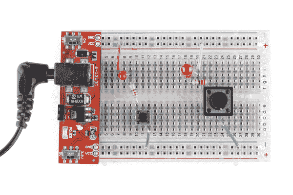
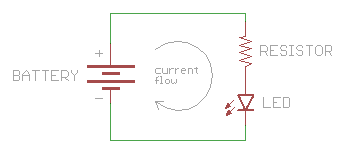
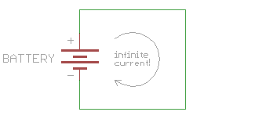
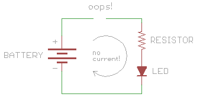

# 什么是电路？

> 原文：<https://learn.sparkfun.com/tutorials/what-is-a-circuit>

## 概观

欢迎来到电路 101！学习电子学时，你首先会遇到的事情之一是电路的概念。本教程将解释什么是电路，并进一步详细讨论**电压**。

*A simple circuit, involving a [button](https://learn.sparkfun.com/tutorials/switch-basics), an [LED](https://learn.sparkfun.com/tutorials/light-emitting-diodes-leds), and a [resistor](https://learn.sparkfun.com/tutorials/resistors), built two different ways.*

### 推荐阅读

有几个概念您应该很好地理解，以帮助您从本教程中获得最大收益。

*   [什么是电？](https://learn.sparkfun.com/tutorials/what-is-electricity)
*   [电力](https://learn.sparkfun.com/tutorials/electric-power)
*   [电压、电流、电阻和欧姆定律](https://learn.sparkfun.com/tutorials/voltage-current-resistance-and-ohms-law)
*   [交流电与直流电(DC)](https://learn.sparkfun.com/tutorials/alternating-current-ac-vs-direct-current-dc)
*   [极性](https://learn.sparkfun.com/tutorials/polarity)

## 电路基础

### 电压及其工作原理

你可能听说过电池或墙上插座有一定数量的**伏特**。这是对电池产生的**电位**的测量，或连接到墙上插座的公用电网。

所有这些电压都在那里等着你使用，但有一个问题:**为了让电做功，它需要能够移动**。这有点像一个吹大的气球。如果你掐掉它，里面有空气，如果它被释放，*可以做一些事情，但它实际上不会做任何事情，直到你把它放出来。*

与空气从气球中出来不同，电流只能通过能够导电的材料流动，如铜线。如果您将电线连接到电池或墙上插座(**警告:**墙上插座的电压很危险，不要这样做！)，你将会给电一条可循的路径。但是，如果电线没有连接到其他任何东西，电力将无处可去，仍然不会移动。

什么使电运动？电想从高电压流向低电压。这和气球一模一样:气球里的加压空气想从气球内部(压力较高)流到气球外部(压力较低)。如果你在高电压和低电压之间建立一条导电通路，电流就会沿着这条通路流动。如果你在路径中插入一些有用的东西，比如 LED，流动的电流会为你做一些工作，比如点亮 LED。万岁。

那么，你在哪里找到更高的电压和更低的电压呢？这里有一些真正有用的东西需要知道:**每个电源都有两面**。你可以在电池上看到这一点，电池两端有金属盖，或者你的墙上插座有两个(或更多)孔。在电池和其他[【直流】](https://learn.sparkfun.com/tutorials/alternating-current-ac-vs-direct-current-dc/direct-current-dc)电压源中，这些侧(通常称为**端子**)被命名为**正极**(或“+”)，以及**负极**(或“-”)。

为什么每个电源都有两面性？这又回到了“电势”的概念，你需要一个电压差来让电流流动。听起来很傻，但是没有两样东西是不一样的，你就不可能有不一样。在任何电源中，正极的电压都会比负极高，这正是我们想要的。事实上，当我们测量电压时，我们通常说负端是 0 伏，而正端是电源可以提供的电压。

电源就像水泵。泵总是有两面，一个把东西吹出的出口，一个把东西吸入的入口。电池、发电机和太阳能电池板的工作原理是一样的。它们内部的一些东西正在努力将电流移向插座(正极)，但所有离开设备的电流都会产生一个空洞，这意味着负极需要引入电流来取代它。 [*](#franklin)

到目前为止我们学到了什么？

*   电压是电势，但电流需要流动才能做任何有用的事情。
*   电需要一个路径来流过，这个路径必须是一个电导体，比如铜线。
*   电流将从高电压流向低电压。
*   DC 电压源总是有两端，称为正极和负极，正极的电压高于负极。

### 最简单的电路

我们终于准备好让电力为我们服务了！如果我们连接电压源的正极，通过发光二极管(LED)等做一些工作的东西，然后回到电压源的负极；电，或者说**电流**，会流动。我们可以在路径中放置一些东西，当电流流过时，这些东西会做一些有用的事情，比如发光二极管。

这种总是需要电流流动并做一些有用的事情的圆形路径被称为电路。电路是一条起点和终点都在同一个地方的路径，这正是我们正在做的事情。

[点击此链接](http://www.falstad.com/circuit/#%24+1+5.0E-6+10.20027730826997+50+5.0+50%0Av+224+288+224+160+0+0+40.0+5.0+0.0+0.0+0.5%0Aw+224+288+448+288+0%0A162+448+160+448+224+1+2.1024259+1.0+0.0+0.0%0Ar+448+224+448+288+0+330.0%0Aw+224+160+304+160+0%0As+304+160+368+160+0+0+false%0Aw+448+160+368+160+0%0Ax+266+186+397+190+0+18+switch+%28click+me%29%0Ax+475+198+510+202+0+18+LED%0Ax+485+263+544+267+0+18+resistor%0Ax+138+228+193+232+0+18+battery%0Ax+204+209+215+213+0+18+%2B%0Ax+207+247+213+251+0+18+-%0A)查看流经简单电路的电流模拟。这个模拟需要 Java 来运行。

* * *

本杰明·富兰克林最初写道，电流从电压源的正极流向负极。然而，富兰克林无法知道[电子实际上是向相反的方向](http://www.allaboutcircuits.com/vol_1/chpt_1/7.html)流动的——在原子层面上，它们从负极出来，循环回到正极。因为在真相被发现之前，工程师们跟随富兰克林的领导达数百年之久，我们至今仍在使用“错误的”约定。实际上，这个细节并不重要，只要每个人都使用相同的惯例，我们都可以构建工作良好的电路。

## 短路和开路

### 什么是“负荷”？

我们想建造电路的原因是为了让电为我们做有用的事情。我们的方法是在电路中放置一些东西，利用电流点亮、制造噪音、运行程序等等。

这些东西被称为**负载**，因为它们“加载”电源，就像你在搬运东西时“加载”一样。同样，你可能负载过重，也可能负载过重，这会降低电流。但与你不同的是，也有可能电路负载过小——这可能会让太多的电流流过(想象一下，如果你没有负重跑得太快)，这可能会烧坏你的零件甚至电源。

在下一个教程中，你会学到所有关于电压、电流和负载的知识:[电压、电流、电阻和欧姆定律](http://learn.sparkfun.com/tutorials/voltage-current-resistance-and-ohms-law)。但是现在，让我们来了解电路的两种特殊情况:**短路**，和**开路**。当你对自己的电路进行故障排除时，了解这些会有很大的帮助。

### 短路

不要这样做，但是如果你把一根电线直接从电源的正极连接到负极，你会造成所谓的**短路**。这是一个非常糟糕的主意。

这似乎是最好的可能电路，为什么它是一个坏主意？请记住，电流想要从较高的电压流向较低的电压，如果你在电流中加入负载，你可以做一些有用的事情，比如点亮 LED。

如果电流中有负载，流过电路的电流将被限制在器件消耗的电流之内，这通常是一个很小的量。但是，如果你不放任何东西进去限制电流的流动，就不会有任何东西来减缓电流，它会试图无限大！

你的电源不能提供无限大的电流，但会尽可能的提供，可能很多。这可能会导致你的电线烧毁，损坏电源，耗尽你的电池，或其他令人兴奋的事情。大多数情况下，您的电源会内置某种安全机制，以在短路时限制最大电流，但并非总是如此。这就是为什么所有的家庭和建筑都有断路器，以防止电线短路时引发火灾。

一个密切相关的问题是意外地让太多的电流流过电路的一部分，导致一部分烧毁。这不是一个很短的电路，但也很接近了。当您使用不正确的**电阻器**值时，最常发生这种情况，这会让太多的电流流过另一个组件，如 LED。

底线:**如果你注意到东西突然变热或者某个部件突然烧坏，立即关掉电源，寻找可能的短路。**

### 断路

与短路相对的是**开路**。这是一个回路没有完全连接的电路(因此这根本不是一个真正的电路)。

不像上面的短路，这个“电路”不会伤害任何东西，但是你的电路也不行。如果你是电路新手，通常很难找到断点在哪里，尤其是如果你使用的是隐藏了所有导线的[试验板](https://learn.sparkfun.com/tutorials/how-to-use-a-breadboard)。

如果你的电路不工作，最可能的原因是开路。这通常是由于连接断开或电线松动。(短路可能会从电路的其他部分窃取所有功率，所以一定要查找这些情况。)

**提示:**如果你不容易找到你的电路哪里开路，一个 **[万用表](https://learn.sparkfun.com/tutorials/how-to-use-a-multimeter)** 会是非常有用的工具。如果你设置它来测量电压，你可以用它来检查供电电路中不同点的电压，并最终找到电压无法通过的点。

## 资源和更进一步

你刚刚学习了电路的最基本形式。随着你不断学习，你会遇到更复杂的电路，有多个回路和更多的电子元件。但是所有的电路，不管有多复杂，都会遵循和你刚刚学过的基本单回路电路一样的规则。

## 有兴趣学习更多基础主题吗？

查看我们的 **[工程要点](https://www.sparkfun.com/engineering_essentials)** 页面，了解电气工程相关基础主题的完整列表。

带我去那里！

您的电子产品之旅才刚刚开始，以下是一些建议的后续探索主题:

*   [试验板](https://learn.sparkfun.com/tutorials/how-to-use-a-breadboard)是有用的工具，可以让你使用跳线快速构建临时电路。我们一直在使用它们。你也可能想掌握[与电线](https://learn.sparkfun.com/tutorials/working-with-wire)的工作，以帮助你建立你的电路。
*   一个[万用表](https://learn.sparkfun.com/tutorials/how-to-use-a-multimeter)可以让你测量电压、电流和电阻，在试图排除故障电路时是一个很大的帮助。
*   电路有各种不同的大小、形状和配置。查看[串联与并联电路](https://learn.sparkfun.com/tutorials/series-and-parallel-circuits)教程，了解更上一层楼的电路。

以下是一些关于构建电路时最常用元件的教程。

*   了解电路的一个好方法是开始制作一些电路。我们的 [LED 教程](https://learn.sparkfun.com/tutorials/light-emitting-diodes-leds)将展示如何点亮一个或多个 LED。
*   [电阻](https://learn.sparkfun.com/tutorials/resistors)是电路中使用最广泛的元件之一。
*   [电容](https://learn.sparkfun.com/tutorials/capacitors)在大多数电路中也有。二极管也是如此。