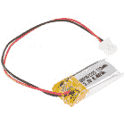
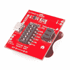
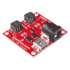
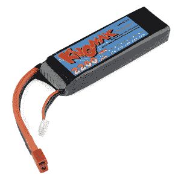

# 电池技术

> 原文：<https://learn.sparkfun.com/tutorials/battery-technologies>

## 电池选项

有许多不同的电池技术可用。有一些非常棒的资源可以用来了解[电池化学](http://batteryuniversity.com/learn/article/whats_the_best_battery)背后的本质细节。维基百科特别好，而且[包罗万象](http://en.wikipedia.org/wiki/List_of_battery_types)。本教程重点介绍嵌入式系统和 DIY 电子产品中最常用的电池。

### 推荐阅读

在阅读本教程之前，您可能需要了解一些概念和知识:

 [### 什么是电路？](https://learn.sparkfun.com/tutorials/what-is-a-circuit) Every electrical project starts with a circuit. Don't know what a circuit is? We're here to help.[Favorited Favorite](# "Add to favorites") 82 [### 电压、电流、电阻和欧姆定律](https://learn.sparkfun.com/tutorials/voltage-current-resistance-and-ohms-law) Learn about Ohm's Law, one of the most fundamental equations in all electrical engineering.[Favorited Favorite](# "Add to favorites") 132 [### 什么是电？](https://learn.sparkfun.com/tutorials/what-is-electricity) We can see electricity in action on our computers, lighting our houses, as lightning strikes in thunderstorms, but what is it? This is not an easy question, but this tutorial will shed some light on it 83 [### 交流电与直流电(DC)](https://learn.sparkfun.com/tutorials/alternating-current-ac-vs-direct-current-dc) Learn the differences between AC and DC, the history, different ways to generate AC and DC, and examples of applications.[Favorited Favorite](# "Add to favorites") 53

## 想探索不同的电池吗？

我们掩护你！

 

将**添加到您的[购物车](https://www.sparkfun.com/cart)中！**

### [锂离子电池- 400mAh](https://www.sparkfun.com/products/13851)

[In stock](https://learn.sparkfun.com/static/bubbles/ "in stock") PRT-13851

这是一种基于锂离子化学的非常小、非常轻的电池，具有目前最高的能量密度…

$5.5010[Favorited Favorite](# "Add to favorites") 41[Wish List](# "Add to wish list")**** 

将**添加到您的[购物车](https://www.sparkfun.com/cart)中！**

### [纽扣电池- 20mm (CR2032)](https://www.sparkfun.com/products/338)

[In stock](https://learn.sparkfun.com/static/bubbles/ "in stock") PRT-00338

CR2032 锂金属 3V 250mAh 纽扣电池。非常适合为低功耗处理器供电或连续几周闪烁 LED 灯…

$2.10[Favorited Favorite](# "Add to favorites") 33[Wish List](# "Add to wish list")**** 

将**添加到您的[购物车](https://www.sparkfun.com/cart)中！**

### [锂离子电池- 18650 电芯(2600mAh)](https://www.sparkfun.com/products/12895)

[In stock](https://learn.sparkfun.com/static/bubbles/ "in stock") PRT-12895

不，这不是某种奇怪的 AA 电池，这实际上是一个 18650 锂离子电池。这些圆形的高容量电池…

$6.50[Favorited Favorite](# "Add to favorites") 20[Wish List](# "Add to wish list")**** 

将**添加到您的[购物车](https://www.sparkfun.com/cart)中！**

### [9V 碱性电池](https://www.sparkfun.com/products/10218)

[In stock](https://learn.sparkfun.com/static/bubbles/ "in stock") PRT-10218

这些是 Rayovac 的标准 9 伏碱性电池。想都别想给这些充电。与…一起使用它们

$2.251[Favorited Favorite](# "Add to favorites") 6[Wish List](# "Add to wish list")****************[See all batteries](https://www.sparkfun.com/categories/54)

* * *********  ********## 术语

这里有一些谈论电池时经常用到的术语。

**容量** -对于给定电池所能储存的电量，电池有不同的额定值。当电池充满电时，容量就是它所包含的电量。相同类型的电池通常会根据它们在一段时间内能够输出的电流量来进行评级。比如有 [1000mAh](https://www.sparkfun.com/products/339) (毫安时)和 [2000mAh](https://www.sparkfun.com/products/8483) 电池。

**标称电池电压** -充电时电池输出的平均电压。电池的标称电压取决于其背后的化学反应。一个铅酸汽车电池会输出 12V。锂纽扣电池将输出 3V。

这里的关键词是“标称”，电池上的实际测量电压会随着放电而降低。充满电的 LiPo 电池将产生大约 4.23V，而当放电时，其电压可能接近 2.7V

**形状** -电池有多种尺寸和形状。术语“AA”指细胞的特定形状和类型。还有一种[大型品种](http://en.wikipedia.org/wiki/List_of_battery_sizes)。

**一次电池与二次电池**——一次电池与**一次性电池**同义。一旦完全耗尽，原电池就不能再充电(可靠/安全)。二次电池更广为人知的名字是**可充电**。这些电池需要另一个电源来完全充电，但是在它们的使用寿命中可以多次完全充电/放电。总的来说，原电池的放电率较低，所以寿命较长，但是没有充电电池经济。

**Common batteries, their chemistry, and their nominal voltage**

| 电池形状 | 化学 | 标称电压 | 可充电？ |
| AA、AAA、C 和 D | 碱性或锌碳 | 1.5V | 不 |
| 9V | 碱性或锌碳 | 9V | 不 |
| 硬币电池 | 锂 | 3V | 不 |
| 银色扁平包装 | 锂聚合物 | 3.7V | 是 |
| AA、AAA、C、D(可充电) | NiMH 还是 NiCd | 1.2V | 是 |
| 车用蓄电池 | 六电池铅酸 | 12.6 伏 | 是 |

**能量密度** -结合电池的容量、形状和大小，可以计算出电池的能量密度。不同的技术允许不同的密度。例如，锂电池通常比碱性电池或硬币电池在给定的体积内容纳更多的液体。

**内放电率** -你试过启动一辆坐了 6 个月的车吗？电池放在架子上或不用时会放电。电池随时间放电的速率称为内部放电速率。

**安全**——因为电池储存电能，所以基本上是非常微小的爆炸物。为了防止伤害，电池被设计得尽可能安全。大多数电池技术被设计成在误用的情况下安全放电。如果你没有正确连接碱性电池，它可能会变热，但不会着火。大多数锂聚合物电池内置有安全电路，以防止电池损坏和不安全使用。

关于术语和技术概述的完整列表，维基百科是一个[极好的资源](http://en . Wikipedia . org/wiki/Battery _(electricity))。

## 锂聚合物

锂聚合物(通常缩写为 LiPo)电池对于嵌入式电子设备非常有用。他们提供市场上现成的最高密度。因为手机主要使用这种类型的电池，所以很容易找到价格合理的电池。它们需要特殊充电，所以一定要使用合适的充电器。SparkFun 提供各种 3.7V 锂聚合物电池，其中许多列在下面。您选择的电池容量将取决于项目的预期运行时间、尺寸限制和其他因素。

 

将**添加到您的[购物车](https://www.sparkfun.com/cart)中！**

### [聚合物锂离子电池- 40mAh](https://www.sparkfun.com/products/13852)

[In stock](https://learn.sparkfun.com/static/bubbles/ "in stock") PRT-13852

这是一种基于新型聚合物锂离子化学的极小且重量轻的电池。这是最高的能量…

$4.95[Favorited Favorite](# "Add to favorites") 13[Wish List](# "Add to wish list")**** 

将**添加到您的[购物车](https://www.sparkfun.com/cart)中！**

### [锂离子电池-1Ah](https://www.sparkfun.com/products/13813)

[In stock](https://learn.sparkfun.com/static/bubbles/ "in stock") PRT-13813

基于锂离子化学的超薄超轻电池。每个电池在 1000 毫安时输出 3.7V 的标称电压！

$10.958[Favorited Favorite](# "Add to favorites") 75[Wish List](# "Add to wish list")**** 

将**添加到您的[购物车](https://www.sparkfun.com/cart)中！**

### [锂离子电池- 850mAh](https://www.sparkfun.com/products/13854)

[In stock](https://learn.sparkfun.com/static/bubbles/ "in stock") PRT-13854

这是基于锂离子化学的非常薄、非常轻的电池。每个电池在 850℃时输出 3.7V 的标称电压…

$10.952[Favorited Favorite](# "Add to favorites") 17[Wish List](# "Add to wish list")**** 

将**添加到您的[购物车](https://www.sparkfun.com/cart)中！**

### [锂离子电池- 400mAh](https://www.sparkfun.com/products/13851)

[In stock](https://learn.sparkfun.com/static/bubbles/ "in stock") PRT-13851

这是一种基于锂离子化学的非常小、非常轻的电池，具有目前最高的能量密度…

$5.5010[Favorited Favorite](# "Add to favorites") 41[Wish List](# "Add to wish list")**** 

将**添加到您的[购物车](https://www.sparkfun.com/cart)中！**

### [锂离子电池- 2Ah](https://www.sparkfun.com/products/13855)

[In stock](https://learn.sparkfun.com/static/bubbles/ "in stock") PRT-13855

这是基于锂离子化学的非常薄、非常轻的电池。每个电池在 200 伏时输出一个标称的 3.7 伏电压…

$13.959[Favorited Favorite](# "Add to favorites") 43[Wish List](# "Add to wish list")**** 

将**添加到您的[购物车](https://www.sparkfun.com/cart)中！**

### [锂离子电池- 110mAh](https://www.sparkfun.com/products/13853)

[In stock](https://learn.sparkfun.com/static/bubbles/ "in stock") PRT-13853

这是一种基于锂离子化学的非常小、非常轻的电池。这是最高的能量密度电流…

$5.503[Favorited Favorite](# "Add to favorites") 22[Wish List](# "Add to wish list")**** 

### [【E-Textiles 电池- 110mAh (2C 放电)](https://www.sparkfun.com/products/13112)

[Out of stock](https://learn.sparkfun.com/static/bubbles/ "out of stock") PRT-13112

这是一种基于聚合物锂离子化学的非常小、非常轻的电池。这是最高的能量密度…

6[Favorited Favorite](# "Add to favorites") 26[Wish List](# "Add to wish list")************ ************### 标称电压

单个脂肪细胞的**额定电压为 3.7V** 。充满电后，你会看到电池上的电压接近 4.3V，但在正常使用下会很快降至 3.7V。当耗尽时，电池电压约为 3V。这意味着，如果您直接从电池运行，您的项目将需要处理各种电压。如果您需要 5V 电压，您需要将两个 LiPos 串联起来，以创建一个 7.4V 的包，并将其调节至 5V。

*Image from [ProTalk.net](http://prototalk.net/forums/showthread.php?t=22)*

### 连接器

在小型电子世界中，大多数 LiPo 电池采用各种 2 针连接器端接。在 SparkFun，我们使用 **JST 连接器**。这可以防止电池插错。连接器是摩擦配合的，所以通常使用钳子[轻轻取出电池](//cdn.sparkfun.com/assets/f/e/2/a/b/5114447cce395f7a7a000005.jpg)。

### 充电和放电

有许多低成本的充电器被用来给 LiPo 电池充电。他们通常使用 USB 给电池充电。**不要试图在没有充电器的情况下给 LiPos 充电。LiPo 电池可能会因过度充电而受损，因此请使用专门设计的 LiPo 充电器，如下所示:**

 

将**添加到您的[购物车](https://www.sparkfun.com/cart)中！**

### [SparkFun LiPo 充电器/升压器- 5V/1A](https://www.sparkfun.com/products/14411)

[In stock](https://learn.sparkfun.com/static/bubbles/ "in stock") PRT-14411

SparkFun 5V/1A 脂肪充电器/升压器是一个从 5V 的锂聚合物电池产生一安培的可靠电路。…

$17.501[Favorited Favorite](# "Add to favorites") 32[Wish List](# "Add to wish list")**** 

将**添加到您的[购物车](https://www.sparkfun.com/cart)中！**

### [SparkFun LiPo 充电器基本款- Micro-USB](https://www.sparkfun.com/products/10217)

[In stock](https://learn.sparkfun.com/static/bubbles/ "in stock") PRT-10217

如果你需要给 LiPo 电池充电，这个简单的充电器就能做到，而且很快！斯帕克芬脂肪充电器基本…

$9.9526[Favorited Favorite](# "Add to favorites") 56[Wish List](# "Add to wish list")**** 

将**添加到您的[购物车](https://www.sparkfun.com/cart)中！**

### [SparkFun 可调脂肪充电器](https://www.sparkfun.com/products/14380)

[In stock](https://learn.sparkfun.com/static/bubbles/ "in stock") PRT-14380

SparkFun 可调 LiPo 充电器是一款单电池锂聚合物(LiPo)和锂离子电池充电器。因为这是…

$13.504[Favorited Favorite](# "Add to favorites") 22[Wish List](# "Add to wish list")**** 

将**添加到您的[购物车](https://www.sparkfun.com/cart)中！**

### [SparkFun USB LiPoly 充电器-单节电池](https://www.sparkfun.com/products/12711)

[In stock](https://learn.sparkfun.com/static/bubbles/ "in stock") PRT-12711

如果你需要给 LiPo 电池充电，这个简单的充电器就能做到，而且很快！SparkFun USB 脂肪充电器是…

$17.958[Favorited Favorite](# "Add to favorites") 33[Wish List](# "Add to wish list")******** ********在给锂离子电池充电之前，请确保您了解电池的容量和充电器提供的充电电流。更多信息可以在下面的教程中找到:[设置充电电流](https://learn.sparkfun.com/tutorials/lipo-usb-charger-hookup-guide#setting-the-charge-current)。

*Image from the [Adjustable LiPo Charger Hookup Guide](https://learn.sparkfun.com/tutorials/adjustable-lipo-charger-hookup-guide#hardware-assembly)*

脂肪电池也会因放电过度而受损。为了防止这种情况，几乎所有的 LiPo 电池都有一个内置在电池顶部的小型安全电路，如果电压下降到某个阈值以下(通常为 **3V** )，它就会关闭电池。保护电路板通常在连接电线的黄色 Kapton 胶带下面。

*LiPo Battery Protection Circuit under the Yellow Kapton Tape*

脂肪电池的内部放电率非常低。这使得它们成为对电力要求低且需要运行许多天或几个月的项目的良好候选。

**尊重能量密度:**这些电池装一个冲头，可以源源不断地提供多安培。短路保护会在检测到短路时关闭电池，但在项目中使用这些电池时，请运用常识。

**Note:** Certain datasheets provided by the manufacturer have units as C[5]A for the rated capacity. This is a standard that is used when measuring LiPo batteries. For example, a 850mAh LiPo battery with a rated capacity of 0.2C[5]A indicates that the capacity (C) was obtained by multiplying the capacity 850mA with 0.2 over a period of 5 hours. This current value was used with a load until the LiPo battery reached a minimum voltage during that period of time.

我们建议几乎所有便携式应用都使用 LiPo。它们相当坚固，安全使用时可提供强大的电源。

### 其他类型的锂离子电池

#### 圆形高容量锂离子电池

这些电池主要用于手电筒类型的应用，但易于使用和安装，并有很多果汁。

*   **标称电压** -这些电池的标称电压也为 **3.7V** ，但与扁平的 LiPo 电池不同，这些圆形电池没有**和**内置保护电路。在对这些电池进行充电和放电时，必须特别小心，以免损坏它们。关于保护电路的更多信息可在[这里](https://www.digikey.com/en/maker/blogs/lithium-ion-cell-protection)找到。

*   **连接器** -这些电池可以通过特定的电池座轻松集成到项目中:

     

    将**添加到您的[购物车](https://www.sparkfun.com/cart)中！**

### [电池座- 1x18650(引线)](https://www.sparkfun.com/products/12899)

    [In stock](https://learn.sparkfun.com/static/bubbles/ "in stock") PRT-12899

    这是一个非常简单的 18650 电池座。当有人想到 18650 细胞时，他们往往会想到闪光灯…

    $1.15[Favorited Favorite](# "Add to favorites") 15[Wish List](# "Add to wish list")**** 

    将**添加到您的[购物车](https://www.sparkfun.com/cart)中！**

### 电池座- 18650 (PTH)

    [In stock](https://learn.sparkfun.com/static/bubbles/ "in stock") PRT-13113

    这是一个 PCB 固定夹，用于固定 18650 锂离子电池。每个电池座都是单独出售的，你需要…

    $0.95[Favorited Favorite](# "Add to favorites") 9[Wish List](# "Add to wish list")**** 

    ### 电池座- 1x18650(电路板安装)

    [Retired](https://learn.sparkfun.com/static/bubbles/ "Retired") PRT-14963

    Keystone Electronics 18650 电池座是 3.7V、高能量、低重量移动电子、工业和…

    **Retired** 

    ### 电池盒- 2x18650(电路板安装)

    [Retired](https://learn.sparkfun.com/static/bubbles/ "Retired") PRT-14964

    Keystone Electronics 18650 电池座是 3.7V、高能量、低重量移动电子、工业和…

    **Retired******
*****   **充电和放电** -由于这些电池上没有保护电路，用户必须考虑过充或欠充的可能性，以使电池不会损坏。我们推荐像这样的通用充电器:

     

    将**添加到您的[购物车](https://www.sparkfun.com/cart)中！**

### [特能 T4s 智能万能充电器- 4 节](https://www.sparkfun.com/products/14457)

    [Only 14 left!](https://learn.sparkfun.com/static/bubbles/ "only 14 left!") TOL-14457

    Tenergy 的 4-Bay T4s 智能通用充电器是一款自动智能充电器，可兼容几乎所有类型的充电器

    $32.50[Favorited Favorite](# "Add to favorites") 7[Wish List](# "Add to wish list")******

#### 高放电锂离子电池

高放电锂离子电池是为任何需要大功率小电池的遥控、机器人或便携式项目供电的好方法。

*   **标称电压** -这些电池的标称电压为 **7.4V** ，与圆形电池一样，*T5【而非 具有内置保护电路。在对这些电池进行充电和放电时，必须特别小心，以免损坏它们。关于保护电路的更多信息可在[这里](https://www.digikey.com/en/maker/blogs/lithium-ion-cell-protection)找到。*

*   **连接器** -充电连接器是一个 3 针 JST-XH 充电插头。放电是通过院长的连接器放电导线。

*   **充电和放电**-由于这些电池上没有保护电路，用户必须考虑过充或欠充的可能性，以使电池不会损坏。因为这是典型的双电池电池组，所以需要一个特殊的充电器。该电池与单电池充电器不兼容。我们推荐像这样的专用充电器:

     

    将**添加到您的[购物车](https://www.sparkfun.com/cart)中！**

### [SkyRC IMAX B6 V2 专业天平充电器/放电器](https://www.sparkfun.com/products/16793)

    [Out of stock](https://learn.sparkfun.com/static/bubbles/ "out of stock") PRT-16793

    SkyRC B6 V2 是一个 DC 输入高性能，微处理器控制的充电/放电/DC/DC 转换器与电池管理…

    $37.501[Favorited Favorite](# "Add to favorites") 5[Wish List](# "Add to wish list")**** 

    ### [电能五合一智能电池电度表](https://www.sparkfun.com/products/retired/15348)

    [Retired](https://learn.sparkfun.com/static/bubbles/ "Retired") TOL-15348

    Tenergy 5 合 1 智能电池电量计让您离成为无所不知、无所不能的电池向导又近了一步…

    1 **Retired**[Favorited Favorite](# "Add to favorites") 9[Wish List](# "Add to wish list")**

## 镍金属氢化物

镍金属氢化物(通常缩写为 NiMH)电池是一种成熟的可充电技术。这些电池通常比其他化学电池成本低，但密度比 LiPo 电池低。镍氢电池对充电曲线的要求没有那么严格，这降低了充电器的成本。镍氢电池通常出现在低成本的电子设备中，如牙刷和无绳剃须刀，在这些设备中，输出电压不是很重要(你会发现你的牙刷运行得更慢，但仍能继续工作)。

 

将**添加到您的[购物车](https://www.sparkfun.com/cart)中！**

### [2500 毫安镍氢电池——AA](https://www.sparkfun.com/products/335)

[In stock](https://learn.sparkfun.com/static/bubbles/ "in stock") PRT-00335

2500mAh 1.2V 镍金属氢化物可充电' AA '电池。【镍氢技术】(http://en . Wikipedia . org/wiki/Nickel _ metal _ hy…

$3.25[Favorited Favorite](# "Add to favorites") 10[Wish List](# "Add to wish list")** **每个电池输出**标称值为 1.2V** 。这与输出 1.5V 的相同大小的碱性电池非常相似。组合四节 AA 镍氢电池将得到一个 4.8V 的电池组，它应该可以运行大多数 5V 系统，但随着电池组放电，电压会下降。

### 充电和放电

镍氢电池本身没有放电保护电路。放电保护电路防止电池放电到某一电压电平以下，以防止电池损坏。更多关于镍氢电池和过放电的信息可以在[这里](https://en.wikipedia.org/wiki/Nickel%E2%80%93metal_hydride_battery)找到。

因为镍氢电池与普通的消费电池相似，所以通常用插在墙上的充电器给镍氢电池充电。对于已经设计使用 AA 型电池的设备，我们推荐使用镍氢电池。

## 硬币电池

[硬币电池](https://www.sparkfun.com/products/338)电池非常适合非常小的低功耗项目。这些电池很便宜！如果你需要很多，就大量购买。他们非常适合测试[led](https://learn.sparkfun.com/tutorials/light-emitting-diodes-leds)。你会发现这些类型的电池藏在[遥控器](https://www.sparkfun.com/products/10280)、[电子茶烛](https://www.google.com/search?q=tea+candles)和许多更小的一次性设备里。

 

将**添加到您的[购物车](https://www.sparkfun.com/cart)中！**

### [纽扣电池- 20mm (CR2032)](https://www.sparkfun.com/products/338)

[In stock](https://learn.sparkfun.com/static/bubbles/ "in stock") PRT-00338

CR2032 锂金属 3V 250mAh 纽扣电池。非常适合为低功耗处理器供电或连续几周闪烁 LED 灯…

$2.10[Favorited Favorite](# "Add to favorites") 33[Wish List](# "Add to wish list")** **这些电池**不能**充电。有一些更复杂的[可充电版本](https://www.sparkfun.com/products/10319)，但绝大多数硬币电池一旦使用就要扔掉。

硬币电池背后的化学和技术各不相同。有些是碱性的，有些是锂。碱性纽扣电池的标称电压为 1.5V。另一方面，锂纽扣电池的标称电压为 3V。

纽扣电池有几种不同的尺寸，每种都有一个特殊的编码名称来表示尺寸和化学成分。碱性纽扣电池都以“L”开头，而锂纽扣电池都以“C”开头。例如，流行的 [CR2032](https://www.sparkfun.com/products/338) 是直径 20 毫米、高 3.2 毫米的锂电池(标称电压 3V)。一个 [LR1154(又名 LR44)](https://www.sparkfun.com/products/11305) 是一个碱性电池(1.5V)，直径 11 毫米，高 5.4 毫米。

硬币电池非常适合为 ATtiny 或其他小型[微控制器和 LED](https://tindie.com/shops/miceuz/chirp-plant-watering-alarm/) 项目供电。

## 碱的

我们都是伴随着这种一次性电池长大的。这些电池已经存在了几十年，所以你会发现他们无处不在！还有大量用于 AA 和 9V 电池的[电池座](https://www.sparkfun.com/search/results?term=battery+holder&what=products)和配件。

这些电池价格便宜，使用安全，随处可得，但遗憾的是，它们不能充电。碱性化学使这些电池特别安全。

AAs 和 AAAs 是最常见的碱性电池，标称输出**1.2V**(但第一次使用时在 1.5V 左右)。因为 AAs 输出 1.2V，所以您需要将它们以 3 个或 4 个为一组进行组合，以运行 3.3V 或 5V 系统。9V 电池明明标称 9V。

 

将**添加到您的[购物车](https://www.sparkfun.com/cart)中！**

### [松下碱性电池- AA](https://www.sparkfun.com/products/15201)

[15 available](https://learn.sparkfun.com/static/bubbles/ "15 available") PRT-15201

这些是来自松下的标准 1.5V AA 碱性电池。

$0.55[Favorited Favorite](# "Add to favorites") 2[Wish List](# "Add to wish list")** **带有[连接线](https://www.sparkfun.com/products/9518)的 9V 电池是让项目便携的一个很好的快速方法，但是不要期望电池能持续很长时间！虽然它输出 9 伏电压，但 9V 电池的容量相当低。

 

将**添加到您的[购物车](https://www.sparkfun.com/cart)中！**

### [9V 碱性电池](https://www.sparkfun.com/products/10218)

[In stock](https://learn.sparkfun.com/static/bubbles/ "in stock") PRT-10218

这些是 Rayovac 的标准 9 伏碱性电池。想都别想给这些充电。使用它们与…

$2.251[Favorited Favorite](# "Add to favorites") 6[Wish List](# "Add to wish list")** **我们经常对初学者使用这种类型的电池。他们通常对这种类型的电池很熟悉，并且很容易找到它们。如果他们把电池装反了，电池可能会发热，但不会造成什么损害。一旦学生过了基础阶段，我们通常会让用户过渡到 LiPos，因为它们可以持续更长时间，并且可以充电。

## 资源和更进一步

现在，您对电池技术有了更多的了解，您应该查看以下附加教程和项目:

 [### 连接器基础](https://learn.sparkfun.com/tutorials/connector-basics) Connectors are a major source of confusion for people just beginning electronics. The number of different options, terms, and names of connectors can make selecting one, or finding the one you need, daunting. This article will help you get a jump on the world of connectors.[Favorited Favorite](# "Add to favorites") 62 [### 如何为项目提供动力](https://learn.sparkfun.com/tutorials/how-to-power-a-project) A tutorial to help figure out the power requirements of your project.[Favorited Favorite](# "Add to favorites") 67 [### 如何使用万用表](https://learn.sparkfun.com/tutorials/how-to-use-a-multimeter) Learn the basics of using a multimeter to measure continuity, voltage, resistance and current.[Favorited Favorite](# "Add to favorites") 67 [### LilyPad 基础:为您的项目提供动力](https://learn.sparkfun.com/tutorials/lilypad-basics-powering-your-project) Learn the options for powering your LilyPad projects, LiPo battery safety and care, and how to calculate and consider power constraints on your projects.[Favorited Favorite](# "Add to favorites") 8

## 有兴趣学习更多基础主题吗？

查看我们的 **[工程要点](https://www.sparkfun.com/engineering_essentials)** 页面，了解电气工程相关基础主题的完整列表。

带我去那里！

********************************************