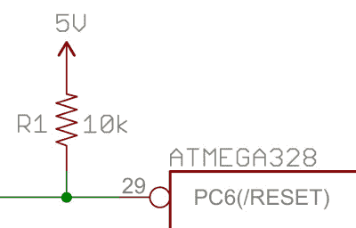
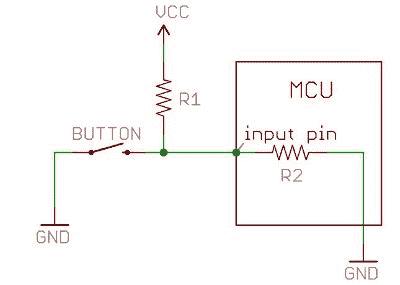
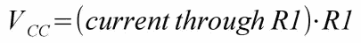
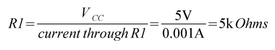

# 上拉电阻

> 原文：<https://learn.sparkfun.com/tutorials/pull-up-resistors>

## 介绍

[](//cdn.sparkfun.com/assets/0/5/9/0/8/513901dfce395f671a000000.jpg)

[上拉电阻](http://en.wikipedia.org/wiki/Pull-up_resistor)在使用微控制器(MCU)或任何数字逻辑器件时非常常见。本教程将解释何时何地使用上拉电阻，然后我们将做一个简单的计算来说明上拉电阻的重要性。

### 推荐阅读

继续之前您应该熟悉的概念:

*   [什么是电路？](http://learn.sparkfun.com/tutorials/what-is-a-circuit)
*   [电阻器](https://learn.sparkfun.com/tutorials/resistors)
*   [电压、电流、电阻](http://learn.sparkfun.com/tutorials/voltage-current-resistance-and-ohms-law)
*   [数字逻辑](https://learn.sparkfun.com/tutorials/logic-levels)
*   输入/输出

## 什么是上拉电阻

假设您有一个 MCU，其中一个引脚配置为输入。如果引脚上没有连接任何东西，而你的程序读取引脚的状态，它是高电平(拉至 VCC)还是低电平(拉至地电平)？很难说。这种现象被称为*浮动*。为了防止这种未知状态，上拉或下拉电阻将确保引脚处于高电平或低电平状态，同时使用少量电流。

为了简单起见，我们将集中讨论上拉，因为它们比下拉更常见。它们的工作原理相同，只是上拉电阻连接到高压(通常为 3.3V 或 5V，通常称为 VCC)，下拉电阻接地。

上拉通常与按钮和开关一起使用。

[](//cdn.sparkfun.com/assets/6/f/b/c/7/511568b6ce395f1b40000000.jpg)

使用上拉电阻，当按钮未被按下时，输入引脚将读取高电平状态。换句话说，少量电流在 VCC 和输入引脚之间流动(不接地)，因此输入引脚的读数接近 VCC。当按下按钮时，它将输入引脚直接接地。电流通过电阻流向地，因此输入引脚读取低电平状态。请记住，如果没有电阻，你的按钮会将 VCC 接地，这是非常糟糕的，也称为[短路](https://learn.sparkfun.com/tutorials/what-is-a-circuit/short-and-open-circuits)。

那么应该选择什么值的电阻呢？

简单明了的答案是，上拉电阻需要 10kΩ左右的电阻值。

**电阻值低的称为强上拉(流过的电流多)，电阻值高的称为弱上拉(流过的电流少)。**

[](//cdn.sparkfun.com/assets/f/1/4/a/b/511568b7ce395f613f000004.jpg)

上拉电阻值需要满足两个条件:

1.  *按下*按钮时，输入引脚被拉低。电阻器 R1 的值控制着你想从 VCC 通过按钮流到地面的电流量。

2.  *按钮未按下*时，输入引脚拉高。上拉电阻值控制输入引脚上的电压。

对于条件 1，您不希望电阻值太低。电阻越低，按下按钮时消耗的能量越多。一般情况下，您希望电阻值较大(10kΩ)，但不希望电阻值过大，以免与条件 2 相冲突。一个 4M &ohm;的电阻可能作为上拉电阻，但是它的电阻太大(或者太弱)以至于不能 100%的工作。

条件 2 的一般规则是使用比输入引脚的输入阻抗(R2)小一个数量级(1/10)的上拉电阻(R1)。微控制器上的输入引脚的阻抗可以在 100k-1mω之间变化。对于这个讨论，阻抗只是电阻的一种奇特的说法，在上图中由 R2 表示。因此，当按钮未被按下时，极少量的电流从 VCC 通过 R1 流入输入引脚。上拉电阻 R1 和输入引脚阻抗 R2 [对](http://learn.sparkfun.com/tutorials/voltage-dividers)进行分压，该电压需要足够高，以使输入引脚[读取高状态](https://learn.sparkfun.com/tutorials/logic-levels/what-is-a-logic-level)。

例如，如果上拉 R1 使用一个 1mω电阻，输入引脚的阻抗 R2 约为 1mω(形成一个分压器)，则输入引脚上的电压约为 VCC 的一半，微控制器可能不会记录该引脚处于高电平状态。在 5V 系统中，如果电压为 2.5V，MCU 在输入引脚上读取什么？它是高还是低？MCU 不知道，您可能会读取高电平或低电平。对于 R1，10k 至 100kΩ的电阻应该可以避免大多数问题。

由于上拉电阻非常常见，许多 MCU，如 Arduino 平台上的 ATmega328 微控制器，都具有内部上拉电阻，可以使能和禁用。要在 Arduino 上启用内部上拉，您可以在 setup()函数中使用以下代码行:

```
pinMode(5, INPUT_PULLUP); // Enable internal pull-up resistor on pin 5 
```

需要指出的另一点是，上拉电阻越大，引脚对电压变化的响应越慢。这是因为为输入引脚供电的系统本质上是一个与上拉电阻耦合的电容，从而形成一个 RC 滤波器，RC 滤波器需要一些时间来充电和放电。如果信号变化非常快(如 USB)，高值上拉电阻会限制引脚可靠改变状态的速度。这就是为什么你会经常在 USB 信号线上看到 1k 到 4.7KΩ的电阻。

所有这些因素都会影响上拉电阻的使用。

## 计算上拉电阻值

[](//cdn.sparkfun.com/assets/6/f/b/c/7/511568b6ce395f1b40000000.jpg)

假设您想在上面的电路中将按钮按下时的电流限制在 1mA 左右，其中 Vcc = 5V。您应该使用什么电阻值？

使用[欧姆定律](http://learn.sparkfun.com/tutorials/voltage-current-resistance-and-ohms-law/ohms-law)很容易说明如何计算上拉电阻:

[](//cdn.sparkfun.com/assets/a/5/0/2/6/5113d140ce395f777e000000.gif)

参考上面的示意图，欧姆定律现在是:

[](//cdn.sparkfun.com/assets/9/5/c/3/2/51391363ce395f2d25000000.jpg)

用一些简单的代数重新排列上述等式，以求解电阻:

[](//cdn.sparkfun.com/assets/4/4/e/d/9/51391364ce395ffb24000000.jpg)

请记住，在计算之前，将所有单位转换为伏特、安培和欧姆(例如，1mA = 0.001 安培)。解决方案是使用 5kω电阻。

## 资源和更进一步

现在，您应该熟悉什么是上拉电阻及其工作原理。要了解有关电子元件及其应用的更多信息，请查看以下其他教程:

*   [如何使用试验板](https://learn.sparkfun.com/tutorials/how-to-use-a-breadboard)
*   [开关基础知识](https://learn.sparkfun.com/tutorials/switch-basics)
*   [分压器](https://learn.sparkfun.com/tutorials/voltage-dividers)
*   [电容器](https://learn.sparkfun.com/tutorials/capacitors)
*   什么是 Arduino？