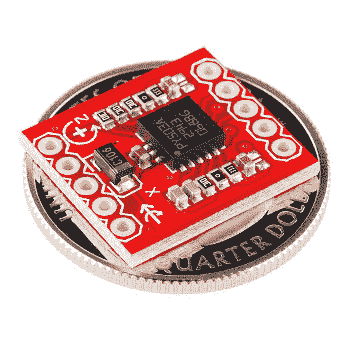
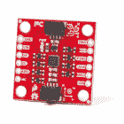
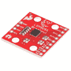
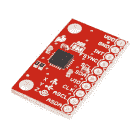
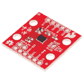
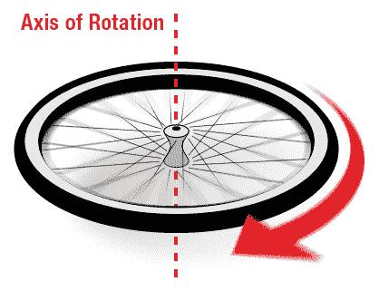
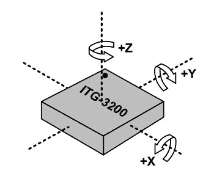
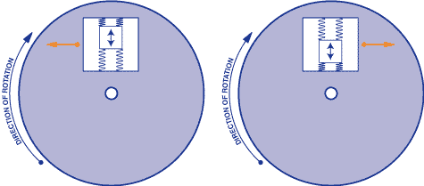
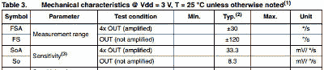

# 陀螺仪

> 原文：<https://learn.sparkfun.com/tutorials/gyroscope>

## 什么是陀螺仪

陀螺仪或陀螺仪是测量或保持旋转运动的设备。 [MEMS](http://en.wikipedia.org/wiki/Microelectromechanical_systems) (微机电系统)陀螺仪是测量角速度的小型廉价传感器。角速度的单位是每秒度数(/s)或每秒转数(RPS)。角速度是旋转速度的简单度量。

*The [LPY503](https://www.sparkfun.com/products/11341) gyro on a breakout board.*

类似于上面的陀螺仪，可以用来确定方向，在大多数自主导航系统中都可以找到。例如，如果你想让一个机器人保持平衡，陀螺仪可以用来测量平衡位置的旋转，并向电机发送修正值。

 

将**添加到您的[购物车](https://www.sparkfun.com/cart)中！**

 **### [【spark fun 9 DOF IMU Breakout-ICM-20948(Qwiic)](https://www.sparkfun.com/products/15335)

[In stock](https://learn.sparkfun.com/static/bubbles/ "in stock") SEN-15335

SparkFun 9DoF IMU 分线板将 ICM-20948 的所有令人惊叹的功能集成到一个支持 Qwiic 的分线板中。

$18.505[Favorited Favorite](# "Add to favorites") 32[Wish List](# "Add to wish list")**** 

### [spark fun 9 DOF IMU Breakout-LSM 9 ds 1](https://www.sparkfun.com/products/retired/13284)

[Retired](https://learn.sparkfun.com/static/bubbles/ "Retired") SEN-13284

SparkFun LSM9DS1 Breakout 是一款多功能的单芯片运动传感系统。它包含一个三轴加速度计，三轴陀螺仪…

11 **Retired**[Favorited Favorite](# "Add to favorites") 42[Wish List](# "Add to wish list") 

将**添加到您的[购物车](https://www.sparkfun.com/cart)中！**

 **### [【spark fun 三轴加速度计和陀螺仪转接- MPU-6050](https://www.sparkfun.com/products/11028)

[Out of stock](https://learn.sparkfun.com/static/bubbles/ "out of stock") SEN-11028

MPU-6050 是运动处理技术的重要组成部分！通过结合 MEMS 三轴陀螺仪和三轴加速度计…

$32.508[Favorited Favorite](# "Add to favorites") 32[Wish List](# "Add to wish list")**** 

### [SparkFun 6 自由度突围- LSM6DS3](https://www.sparkfun.com/products/retired/13339)

[Retired](https://learn.sparkfun.com/static/bubbles/ "Retired") SEN-13339

LSM6DS3 是一款加速度计和陀螺仪传感器，内置 8kb FIFO 缓冲器和嵌入式处理中断功能……

1 **Retired**[Favorited Favorite](# "Add to favorites") 16[Wish List](# "Add to wish list")**** ****### 本教程中的概念

在开始阅读本教程之前，如果您不熟悉其中的一些概念，您可能需要仔细阅读。

*   [逻辑电平](https://learn.sparkfun.com/tutorials/logic-levels)
*   [SPI 通信](http://learn.sparkfun.com/tutorials/serial-peripheral-interface-spi)
*   [I2C 通信](https://learn.sparkfun.com/tutorials/i2c)
*   [模数转换](http://learn.sparkfun.com/tutorials/analog-to-digital-conversion)

## 陀螺仪是如何工作的

当物体绕轴旋转时，它们有所谓的角速度。纺车可以用每秒转数(RPS)或每秒度数(/s)来衡量。

Note that the z axis of the gyro below aligns with the axis of rotation on the wheel.

如果将传感器连接到上面所示的滚轮上，就可以测量陀螺仪 z 轴的角速度。其他两个轴不会测量任何旋转。

想象一下，如果轮子每秒钟旋转一次。它的角速度是每秒 360 度。车轮的旋转方向也很重要。绕轴是顺时针，还是逆时针？

类似于上图( [ITG-3200](https://www.sparkfun.com/products/9793) )的三轴 MEMS 陀螺仪可以测量绕三个轴的旋转:x、y 和 z。一些陀螺仪有单轴和双轴两种，但单芯片三轴陀螺仪越来越小、越来越便宜，也越来越受欢迎。

陀螺仪通常用在旋转速度不是很快的物体上。飞机(希望)不会旋转。相反，它们在每个轴上旋转几度。通过检测这些微小的变化，陀螺仪有助于稳定飞机的飞行。另外，请注意，飞机的加速度或线速度不会影响陀螺仪的测量。陀螺仪只测量角速度。

[MEMS](http://en.wikipedia.org/wiki/Microelectromechanical_systems) 陀螺如何检测角速度？

Internal operational view of a MEMS gyro sensor

MEMS 中的陀螺仪传感器非常小(1 到 100 微米，相当于一根头发的大小)。当陀螺仪旋转时，一个小的谐振质量随着角速度的变化而移动。这种运动被转换成非常低电流的电信号，可以被主机微控制器放大和读取。

## 如何连接陀螺仪

使用陀螺仪的主要硬件连接是*电源*和*通信接口*。一如既往，请参考传感器数据表，了解所有规格和示例连接的信息。

### 通信接口

陀螺仪可以有一个*数字*或*模拟*通信接口。

*   带有*数字*接口的陀螺仪通常使用 [SPI](https://learn.sparkfun.com/tutorials/serial-peripheral-interface-spi) 或 [I2C](https://learn.sparkfun.com/tutorials/i2c) 通信协议。使用这些接口可以轻松连接到主机微控制器。数字接口的一个限制是最大采样速率。I2C 的最大采样率为 400 赫兹。另一方面，SPI 的采样速率可以高得多。

*   带有*模拟*接口的陀螺仪通过变化的电压来表示旋转速度，通常在地电压和电源电压之间。微控制器上的 [ADC](http://learn.sparkfun.com/tutorials/analog-to-digital-conversion) 可用于读取信号。模拟陀螺仪可能更便宜，有时更精确，这取决于如何读取模拟信号。

### 力量

MEMS 陀螺仪通常是低功耗器件。工作电流在毫安级，有时在微安级。陀螺仪的电源电压通常为 5V 或更低。数字陀螺仪可以有可选的逻辑电压，也可以在电源电压下工作。对于任何数字接口，[记得连接 5V 至 5V 线和 3.3V 至 3.3V 线](https://learn.sparkfun.com/tutorials/logic-levels)。此外，具有数字接口的陀螺仪可以具有低功耗和休眠模式，因此可以用于电池供电的应用。有时，这比模拟陀螺仪更有优势。

## 如何选择陀螺仪

在确定使用哪种类型的陀螺仪时，需要考虑许多规格。以下是几个比较重要有用的例子:

### 范围

测量范围或满量程范围是陀螺仪可以读取的最大角速度。想想你在衡量什么。你需要测量一个非常慢的电唱机的转速，还是一个非常快的纺车的转速？

### 灵敏度

灵敏度以每秒每度毫伏(mV/ /s)为单位。不要让这个值的怪异维度吓到你。它决定了给定角速度下电压的变化量。例如，如果陀螺仪的指定灵敏度为 30mV/ /s，而您看到输出变化为 300mV，则您以 10°/s 的速度旋转陀螺仪。

需要记住的一条好规则是:随着灵敏度的增加，范围减小。例如，查看 [LPY503 陀螺仪数据表](http://www.sparkfun.com/datasheets/Sensors/IMU/lpy503al.pdf)或任何具有可选范围的陀螺仪:

请注意，范围越大，灵敏度越差，分辨率越低。

### 偏见

与任何传感器一样，您测量的值会包含一些误差或偏差。通过测量陀螺仪静止时的输出，可以看出陀螺仪的偏差。虽然您认为陀螺仪静止时会看到 0，但输出中总会有微小的非零误差。这些误差有时被称为偏置漂移或偏置不稳定性。传感器的温度会极大地影响偏置。为了帮助减少这种误差，大多数陀螺仪都内置温度传感器。因此，您可以读取传感器的温度，并校正任何温度相关的变化。为了校正这些误差，必须校准陀螺仪。这通常是通过保持陀螺仪不动并将代码中的所有读数归零来实现的。

## 更进一步

到现在为止，你应该知道陀螺仪是如何工作的，并且已经有了在自己的项目中使用陀螺仪的良好基础。

查看这些使用陀螺仪的教程:

*   [模拟陀螺+ Arduino](http://playground.arduino.cc/Main/Gyro)
*   [陀螺选购指南](http://www.sparkfun.com/pages/accel_gyro_guide)
*   [平衡机器人](http://blog.tkjelectronics.dk/2012/03/the-balancing-robot/)****