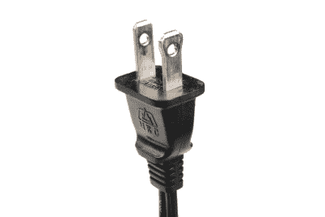
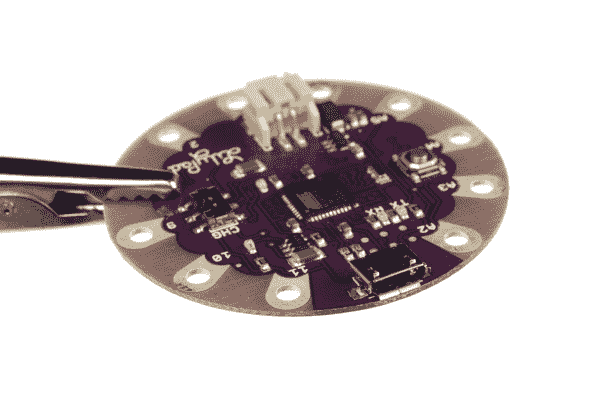
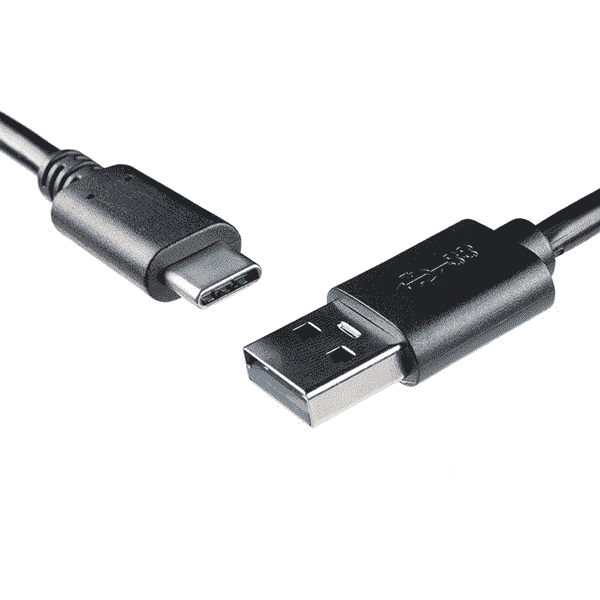
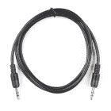
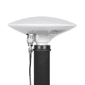
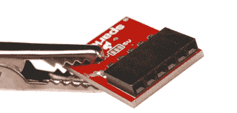
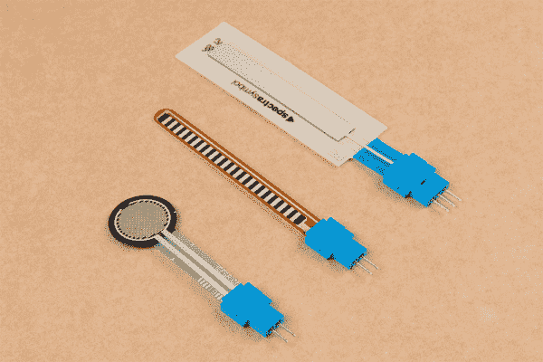
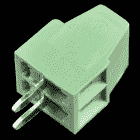
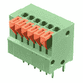

# 连接器基础

> 原文：<https://learn.sparkfun.com/tutorials/connector-basics>

## 介绍

连接器用于将电路的子部分连接在一起。通常，在将来某个时候可能需要断开子部分的地方使用连接器:电源输入、外围设备连接或可能需要更换的板。

### 本教程涵盖的内容

在本教程中，我们将回顾:

*   基本连接器术语
*   将连接器分为不同的类别
*   谈论这些类别中的连接器之间的差异。
*   展示如何识别极化连接器
*   谈论哪些连接器最适合某些应用

### 推荐阅读

在开始学习本教程之前，您可能会发现这些概念很有用:

 [### 什么是电路？](https://learn.sparkfun.com/tutorials/what-is-a-circuit) Every electrical project starts with a circuit. Don't know what a circuit is? We're here to help.[Favorited Favorite](# "Add to favorites") 82 [### 电压、电流、电阻和欧姆定律](https://learn.sparkfun.com/tutorials/voltage-current-resistance-and-ohms-law) Learn about Ohm's Law, one of the most fundamental equations in all electrical engineering.[Favorited Favorite](# "Add to favorites") 132 [### 如何为项目提供动力](https://learn.sparkfun.com/tutorials/how-to-power-a-project) A tutorial to help figure out the power requirements of your project.[Favorited Favorite](# "Add to favorites") 67 [### 使用导线](https://learn.sparkfun.com/tutorials/working-with-wire) How to strip, crimp, and work with wire.[Favorited Favorite](# "Add to favorites") 50 [### 极性](https://learn.sparkfun.com/tutorials/polarity) An introduction to polarity in electronic components. Discover what polarity is, which parts have it, and how to identify it.[Favorited Favorite](# "Add to favorites") 52

## 连接器术语

在开始讨论一些常用的连接器之前，让我们先来探讨一下用来描述连接器的术语。

### 性别

**性别** -连接器的性别是指它是插入还是被插入，通常分别是男性还是女性(孩子们，向你们的父母寻求更详细的解释)。不幸的是，存在这样的情况，当连接器看起来是母的时，它可能被称为“公的”；在示例部分，我们将在讨论单个组件类型时指出其中的几个，并解释为什么会这样。

*Male (left) and female 2.0mm PH series JST connectors. In this case, gender is determined by the individual conductor.*

### 极性

**极性** -大多数连接器只能在一个方向连接。这种特性被称为极性，有一些方法可以防止它们被错误连接的连接器被称为**极化**，或者有时**键控**。

*A polarized North American wall plug. By having two different widths for the plug blades, the plug will only go into the outlet one way.*

### 接触

**触点** -触点是连接器的业务部分。它们是相互接触的金属部件，形成电连接。这也是问题发生的地方:触点可能变脏或氧化，或者将触点保持在一起所需的弹性可能随着时间而褪色。

*The contacts on this connector are clearly visible.*

### 投

**间距** -许多连接器由重复排列的触点阵列组成。连接器的间距是从一个触点的中心到下一个触点的中心的距离。这一点很重要，因为有许多系列的触点看起来非常相似，但间距可能不同，因此很难知道您是否购买了正确的配套连接器。

*The pitch of the pins on the headers on a standard Arduino is .1".*

### 交配周期

**配合周期** -连接器的寿命是有限的，连接和断开会使它们磨损。数据表通常以**交配周期**的形式呈现该信息，并且不同技术之间差异很大。USB 连接器可能具有几千或几万个周期的寿命，而设计用于消费电子产品内部的板对板连接器可能限于几十个周期。为应用选择具有合适寿命的连接器非常重要。

### 增加

挂载 -这一个有可能让人迷惑。术语“安装”可以指几件事:连接器在使用中的安装方式(面板安装、自由悬挂、板安装)，连接器相对于其附件的角度(直角或直角)，或其机械连接方式(焊片、表面安装、通孔)。我们将在每个连接器的示例部分对此进行更多的讨论。

*A comparison of three different methods of mounting the same barrel connector: (left to right) board mount, inline cable mount, and panel mount.*

### 应变消除

**应变消除** -当连接器安装到电路板或电缆上时，电气连接往往有些脆弱。典型地，提供某种应变消除，以将作用在连接器上任何力传递到比脆弱的电连接更机械可靠的物体上。同样，稍后会有一些很好的例子。

*This 1/8" headphone jack comes with a strain relief "boot" slid over the cable to prevent forces on the cable from being transmitted directly to the electrical joints.*

## USB 连接器

USB 连接器有两种类型:主机和外设。在 USB 标准中，两者是有区别的，电缆和设备上的连接器反映了这一点。但是，所有 USB 连接器都有一些共同点:

*   **极化**-USB 连接器名义上只能单向插入。可能会强行插入错误的连接器，但是*会*导致设备损坏。
*   **四个触点** -所有 USB 连接器都至少有四个触点(虽然有些可能有五个，而 [USB 3.0+](http://en.wikipedia.org/wiki/USB_3.0) 连接器甚至更多)。这些是电源、接地和两条数据线(D+和 D-)。USB 连接器设计用于传输 5V、高达 500mA 的电压。
*   **屏蔽** - USB 连接器被屏蔽，从而提供不属于电路一部分的金属外壳。这对于在有大量电“噪声”的环境中保持信号完整非常重要。
*   **强大的电源连接** -电源引脚必须在数据线之前连接，以避免试图通过数据线为设备供电。所有 USB 连接器的设计都考虑到了这一点。
*   **模压应力消除** -所有 USB 电缆在连接器处都有塑料包覆成型，以防止电缆上的应力可能会损坏电气连接。

*A [USB extension cable](https://www.sparkfun.com/products/517), with some of the common features of USB connectors labeled.*

### USB-A 连接器

**USB-A 母**是标准的“主机”连接器类型。这可以在计算机、集线器或任何需要插入外围设备的设备上找到。也可以找到另一端带有母 A 连接器和公 A 连接器的延长电缆。

***Female USB-A** ports on the side of a laptop. The blue connector is USB 3.0 compliant.*

**USB-A 插头**是标准的“外设”连接器类型。大多数 USB 电缆都有一个端接在 USB-A 插头上，许多设备(如键盘和鼠标)都有一个内置电缆端接在 USB-A 插头上。也有可能找到 USB-A 公连接器，可安装在电路板上，用于 USB 记忆棒等设备。

*Two types of **Male USB-A** connectors, on a [SparkFun Cerberus cable](https://www.sparkfun.com/products/11515) and an [AVR Stick](https://www.sparkfun.com/products/9147) development board.*

### USB-B 连接器

**USB-B 母**是外设的标配。它体积庞大，但非常坚固，因此在尺寸不是问题的应用中，它是为 USB 连接提供可移动连接器的首选方式。为了获得最大的可靠性，它通常是一个通孔板安装连接器，但也有面板安装选项。

*Arduino boards, including this [Uno](https://www.sparkfun.com/products/11224), have long used the female **USB-B** connector, due to its low cost and durability.*

**USB-B 插头**几乎只出现在电缆的末端。USB-B 电缆无处不在且价格低廉，这也有助于 USB-B 连接的普及。

*USB-B male* connector on the end of a [SparkFun Cerberus cable](https://www.sparkfun.com/products/11515).

### USB 迷你连接器

**USB-Mini** 连接是第一个为更小设备减少 USB 连接器尺寸的标准尝试。USB-Mini 插座通常用于较小的外围设备(MP3 播放器、老式手机、小型外置硬盘)，通常是一种表面贴装连接器，以坚固性换取尺寸。USB-Mini 正在慢慢被淘汰，取而代之的是 USB-Micro 连接器。

***USB-Mini female** connector on a [Protosnap Pro Mini](https://www.sparkfun.com/products/10889).*

**USB 迷你插头**是另一种仅支持线缆的连接器。与 USB-B 一样，它非常常见，几乎在任何地方都可以找到便宜的电缆。

***USB-Mini male** connector on the end of a [SparkFun Cerberus cable](https://www.sparkfun.com/products/11515).*

### USB 微型连接器

USB-Micro 是 USB 连接器家族的新成员。与 USB-Mini 一样，主要关注的是尺寸的减小，但 USB-Micro 增加了第五个引脚用于低速信号传输，允许它用于 USB-OTG(移动)应用，其中设备可能希望根据情况作为主机或外设运行。

USB-Micro 母接口出现在许多新型外设上，如数码相机和 MP3 播放器。采用 USB-micro 作为所有新手机和平板电脑的标准充电端口意味着充电器和数据线变得越来越普遍，USB-Micro 有可能在未来几年取代 USB-Mini 成为小尺寸 USB 连接器的选择。

***USB-Micro female** connector on a [LilyPad Arduino USB](https://www.sparkfun.com/products/11190) board.*

**USB-Micro 公**也是一种仅支持线缆的连接器。通常有两种类型的具有 USB 微型插头端的电缆:一种用于将具有 USB 微型端口作为外围设备的设备连接到 USB 主机设备，另一种用于将 USB 微型插座端口适配到 USB-A 插座端口，以用于具有 USB OTG 功能的设备中。

***USB-Micro male** connector on the [SparkFun Cerberus cable](https://www.sparkfun.com/products/11515).**[Adapter pigtail](https://www.sparkfun.com/products/11604) for using USB-OTG capable devices having only a USB-Micro port with standard USB peripherals. Note that not all devices supporting USB-OTG will work with this pigtail.*

### USB 3.0 微型 B 电缆

**USB 3.0 micro-B 电缆**看起来与 USB 2.0 micro-B 连接器相似，但它们包括用于两个差分对和一个接地的额外引脚。

*[USB 3.0 Type A to Micro-B Cable](https://www.sparkfun.com/products/14724)*

### USB 3.1 C 电缆

**[USB C](https://en.wikipedia.org/wiki/USB-C)** 将 24 针装入 USB 连接器。不同于以前的版本，这个版本是可逆的！USB C 电缆的设计还允许 500mA 以上的电流用于耗电设备。

*[USB 3.1 Cable A to C](https://www.sparkfun.com/products/14743)***Heads up!** Depending on the cable, not all of the pins are broken out for USB C. Some cables may be limited to the USB 2.0 specification with 4 pins as opposed to the full USB 3.1 specification. The [reversible USB A to C cables](https://www.sparkfun.com/products/15424) and [SuzyQable](https://www.sparkfun.com/products/14746) are a few examples. Depending on the USB port that is used, you may also be limited in the amount of current that can be provided to your device.

### 可逆 USB

随着技术和制造的进步，USB 连接器可以以任何方式插入！以下是目录中的可逆 A 型和微型 b 型连接器示例。

|  |  |
|  |  |
| *[可逆式 A 型连接器末端](https://www.sparkfun.com/products/15424)* | *[可逆式微型 B 连接器端](https://www.sparkfun.com/products/15427)* |

* * *

如果您正在寻找 USB 连接器或电缆，请查看我们的 [USB 购买指南](https://www.sparkfun.com/pages/USB_Guide)或[目录](https://www.sparkfun.com/categories/386)。

 

将**添加到您的[购物车](https://www.sparkfun.com/cart)中！**

 **### [GPIB-USB 控制器](https://www.sparkfun.com/products/549)

[15 available](https://learn.sparkfun.com/static/bubbles/ "15 available") BOB-00549

使用这个独特的设备下载数据和控制 GPIB 总线使示波器，逻辑分析仪，函数发生器，电源…

$299.957[Favorited Favorite](# "Add to favorites") 7[Wish List](# "Add to wish list")**** 

将**添加到您的[购物车](https://www.sparkfun.com/cart)中！**

 **### [spark fun USB A 型母突围](https://www.sparkfun.com/products/12700)

[In stock](https://learn.sparkfun.com/static/bubbles/ "in stock") BOB-12700

这个简单的板将母 USB 型连接器的 VCC、GND、D-和 D+引脚连接到 0.1 英寸间距的接头上。如果你想…

$4.956[Favorited Favorite](# "Add to favorites") 26[Wish List](# "Add to wish list")**** 

将**添加到您的[购物车](https://www.sparkfun.com/cart)中！**

 **### [SparkFun USB-C 突破](https://www.sparkfun.com/products/15100)

[In stock](https://learn.sparkfun.com/static/bubbles/ "in stock") BOB-15100

SparkFun USB-C 分线板在断开连接上的每个引脚时，提供的功率是以前 USB 板的 3 倍…

$4.955[Favorited Favorite](# "Add to favorites") 33[Wish List](# "Add to wish list")**** 

将**添加到您的[购物车](https://www.sparkfun.com/cart)中！**

 **### [SparkFun USB MicroB 插头转接](https://www.sparkfun.com/products/10031)

[In stock](https://learn.sparkfun.com/static/bubbles/ "in stock") BOB-10031

我们不知道你连接的是什么 USB 设备，但如果你想访问某个设备上的 microUSB 端口，你可能需要…

$4.9512[Favorited Favorite](# "Add to favorites") 25[Wish List](# "Add to wish list")******** ********* * *

## 音频连接器

另一类常见的连接器是用于视听应用的连接器——RCA 和唱机。虽然这些不能真正被认为是同一个系列，因为各种 USB 连接器，我们会认为它们是一脉相承的。

### “电话”型连接器

你可能会马上认出这个 1/8 英寸的连接器是一副耳机末端的插头。这些连接器实际上有三种常见的尺寸:1/4 英寸(6.35 毫米)、1/8 英寸(3.5 毫米)和 2.5 毫米。尺寸连接器在专业音频和音乐社区中有很多用途-大多数电吉他和放大器上都有 1/4 英寸的尖端套筒(TS)插孔。1/8 "塞环套管(TRS)非常常用于连接耳机或 MP3 播放器或电脑上的音频输出信号。一些手机将提供 2.5 毫米的尖-环-环-套(TRRS)插孔，用于连接耳机，耳机还包括用于免提通信的麦克风。以下是 SparkFun 在目录中提供的几个音频插孔。

 

将**添加到您的[购物车](https://www.sparkfun.com/cart)中！**

 **### [音频线 TRRS - 1ft](https://www.sparkfun.com/products/14163)

[In stock](https://learn.sparkfun.com/static/bubbles/ "in stock") CAB-14163

这是一条一英尺长的白色音频电缆，两端各有两个 TRRS 连接器。TRRS 连接器是…

$1.60[Favorited Favorite](# "Add to favorites") 3[Wish List](# "Add to wish list")**** 

将**添加到您的[购物车](https://www.sparkfun.com/cart)中！**

 **### [音频线 TRS-1m](https://www.sparkfun.com/products/18983)

[In stock](https://learn.sparkfun.com/static/bubbles/ "in stock") CAB-18983

这种电缆两端都有一个标准的 TRS 3.5 毫米插头，可以轻松连接到任何 3.5 毫米插孔。

$1.95[Favorited Favorite](# "Add to favorites") 0[Wish List](# "Add to wish list")**** 

将**添加到您的[购物车](https://www.sparkfun.com/cart)中！**

 **### [音频线对鳄鱼夹-2.5 毫米](https://www.sparkfun.com/products/17983)

[In stock](https://learn.sparkfun.com/static/bubbles/ "in stock") CAB-17983

这是一根音频到鳄鱼电缆，一根 8 英寸长的 22 AWG 线，一端有两个鳄鱼夹，另一端有一个 2.5 毫米的单声道插头…

$0.95[Favorited Favorite](# "Add to favorites") 2[Wish List](# "Add to wish list")**** 

### [音频适配器——3.5 毫米转 1/4 英寸立体声](https://www.sparkfun.com/products/retired/11150)

[Retired](https://learn.sparkfun.com/static/bubbles/ "Retired") COM-11150

这是你的标准音频插孔“biggifier”将一根 3.5 毫米的电缆插入一侧，现在它将神奇地适合一个 1/4 英寸的插孔。的…

**Retired**[Favorited Favorite](# "Add to favorites") 0[Wish List](# "Add to wish list")************[Click Here for More Audio Jacks](https://www.sparkfun.com/categories/342)

这些连接器和电缆的常见可用性使它们成为通用连接应用的良好候选，例如，早在 USB 之前，[德州仪器图形计算器](http://en.wikipedia.org/wiki/TI-85)就使用 2.5 毫米 TRS 连接器作为串行编程连接器。应该记住，尖端-套管连接器类型不是为输送电力而设计的；在插入过程中，尖端和套管可能会瞬间短路，这可能会损坏电源。缺乏屏蔽使它们不适合高速数据，但低速串行数据可以通过这些连接器传输。

*[Headphone-type TRS phone plug, 1/8"](https://www.sparkfun.com/products/11143). Typically, tip and ring will carry the stereo audio signals while sleeve will be connected to ground.**1/8" phone plug. Note the lack of a ring contact on this connector.**[1/8" board mount headphone jack](https://www.sparkfun.com/products/8032) with pins corresponding pin connections labeled. When no jack is inserted, an internal switch connects the tip and ring pins to the adjacent unmarked pins, allowing insertion detection.*

下面是 SparkFun 在目录中携带的几个音频插座。

 

将**添加到您的[购物车](https://www.sparkfun.com/cart)中！**

 **### [SparkFun TRRS 3.5mm 插孔突破](https://www.sparkfun.com/products/11570)

[In stock](https://learn.sparkfun.com/static/bubbles/ "in stock") BOB-11570

TRRS 接口是音频类型的接口，你可以在一些电话、MP3 播放器和开发板上看到。TRRS 站在…

$4.506[Favorited Favorite](# "Add to favorites") 32[Wish List](# "Add to wish list")**** 

将**添加到您的[购物车](https://www.sparkfun.com/cart)中！**

 **### [音频插孔 3.5mm](https://www.sparkfun.com/products/8032)

[In stock](https://learn.sparkfun.com/static/bubbles/ "in stock") PRT-08032

薄型 3.5 毫米立体声音频插孔。

$1.604[Favorited Favorite](# "Add to favorites") 26[Wish List](# "Add to wish list")**** 

将**添加到您的[购物车](https://www.sparkfun.com/cart)中！**

 **### [【音频插孔- 1/4”立体声(直角)](https://www.sparkfun.com/products/11144)

[In stock](https://learn.sparkfun.com/static/bubbles/ "in stock") COM-11144

这是一种 1/4 英寸的立体声插孔，你可能会在家庭立体声和扩音系统中找到。开关触点让您可以检测何时…

$1.051[Favorited Favorite](# "Add to favorites") 17[Wish List](# "Add to wish list")************[Click Here for More Audio Sockets](https://www.sparkfun.com/categories/388)

### RCA 连接器

作为几十年来人们熟悉的家庭立体声连接器，RCA 连接器是由 RCA 在 20 世纪 40 年代为家庭留声机推出的。它正在慢慢被视听领域的 HDMI 等连接所取代，但连接器和电缆的无处不在使其成为家庭构建系统的良好候选。过不了多久就过时了。

母 RCA 连接器通常出现在设备上，尽管也可能出现带有母插孔的延长线或转换线。大多数 RCA 接口都连接到四种信号类型之一:分量视频(PAL 或 NTSC，取决于设备的销售地点)、复合视频、立体声音频或 S/PDIF 音频。

*[Female RCA connector](https://www.sparkfun.com/products/8631), for video signals. Typically, NTSC or PAL video signal connectors will be yellow.*

公 RCA 连接器通常出现在电缆上。

*[Male RCA plugs](https://www.sparkfun.com/products/8919). Red and white are usually for audio applications, with red denoting the "right" audio channel.*

## 电源连接器

虽然许多连接器除了传输数据之外还传输电源，但有些连接器专门用于为设备提供电源连接。这些因应用和大小而有很大不同，但我们在这里只关注一些最常见的。

### 筒式连接器

筒式连接器通常出现在低成本消费电子产品上，这些电子产品可以通过庞大的交流墙壁适配器插入墙壁电源。墙壁适配器随处可得，具有各种额定功率和电压，使得筒式连接器成为小型项目连接电源的常用方式。

母筒式连接器或“插孔”有多种类型:PCB 安装型(表面安装型或通孔安装型)、电缆安装型或面板安装型。其中一些连接器将有一个额外的触点，允许应用程序检测电源是否插入桶形插孔，从而允许设备在使用外部电源时绕过电池并节省电池寿命。

*[Female barrel connector](https://www.sparkfun.com/products/119). When no plug is inserted, the "insertion detection" pin will be shorted to the "sleeve" pin.*

公筒形连接器或“插头”通常只出现在电线端接类型中，尽管有多种方法将插头连接到电线末端。也可以将插头预先连接到电缆上。

*[Unattached male barrel plug](https://www.sparkfun.com/products/11476), for attachment to any power supply. Note that the sleeve connection is designed to be crimped onto the wire for extra strain relief.***Heads up!** There are [varying opinions on the gender](https://en.wikipedia.org/wiki/Coaxial_power_connector#Connector_construction_and_terminology) of the jack and plug for these low power coax connectors. Depending on where your get these connectors, the jack can be referred to "male" barrel connector due to the pin in the center and vice versa for the plug. Make sure to check out the product image and specs to find what you are looking for!

筒式连接器仅提供两种连接，通常称为“销”或“尖端”和“套管”。订购时，筒形连接有三个区分特征-内径(插孔内引脚的直径)、外径(插头外侧套管的直径)和极性(套管电压是高于还是低于尖端电压)。

**套筒直径**最常见的是 5.5 毫米或 3.5 毫米

**销钉直径**视套筒直径而定；一个 5.5 毫米的套管将有一个 2.5 毫米或 2.1 毫米的引脚。不幸的是，这意味着为 2.5 毫米插针设计的插头将适合 2.1 毫米插孔，但这种连接至多是断断续续的。3.5 毫米的套管插头通常与 1.3 毫米的插头相匹配。

**极性**是最后要考虑的方面；最常见的情况是，套管被视为 0V，而尖端相对于套管为正电压。许多设备会有一个小图，指示设备预期的极性；应注意遵守这一点，因为不正确的电源可能会损坏设备。

两种套管尺寸的插头通常都是 9.5 毫米长，但更长和更短的确实存在。所有 SparkFun 产品使用的都是负 5.5mm 的套筒和正 2.1mm 的插针；我们建议尽可能坚持这个标准，因为这似乎是在野外发现的最常见的味道。

*Common polarity diagrams for AC adaptors with barrel plugs. Positive polarity (tip positive, sleeve 0V) is most common. Diagram courtesy Wikipedia user [Three-quarter-ten](http://commons.wikimedia.org/wiki/User:Three-quarter-ten).*

### “Molex”连接器

大多数计算机硬盘驱动器、光盘驱动器和其他内部外围设备通过通常称为“Molex”的连接器获得电源。更准确地说，这是一个 Molex 系列 8981 连接器——Molex 实际上是在 20 世纪 50 年代最初设计这种连接器的公司的名称——但常见的用法在某种程度上掩盖了这一事实。

Molex 连接器设计用于承载大量电流:每个引脚高达 11A。对于可能需要大量电力的项目，例如 CNC 机器或 3D 打印机，为项目供电的一种非常常见的方法是使用台式 PC 电源，并通过 Molex 连接器连接各种系统电路。

Molex 连接器的公/母术语有点奇怪。母接头通常位于电缆的末端，它会滑入包围公接头上公插脚的塑料外壳内。通常，连接器仅是压配合的，并且非常非常紧——它们仅用于连接和断开几次，因此，对于经常改变连接的系统来说是一个不好的选择。

*[Male Molex connector](https://www.sparkfun.com/products/15700). The gender of the pins inside the connector is what signifies the gender of the connector as a whole.**Female Molex connector on a [project power supply](https://www.sparkfun.com/products/15664).*

### IEC 连接器

与 Molex 连接器一样，这是一个通用组件名称与单个特定项目同义的情况。IEC 连接器通常是指台式机电源上常见的电源插座。严格来说，那是一个 [IEC 60320-1](http://en.wikipedia.org/wiki/Iec_connector) C13(母)和 C14(公)连接器。

*C14 male IEC power inlet, on a [DC project power supply](https://www.sparkfun.com/products/11296). Note that, as with the Molex connector, the gender of the connector is defined by the pins within the hood.**C13 female IEC power connector, on a fairly standard [AC power supply cable](https://www.sparkfun.com/products/14935). Cables with this end can be found all around the world, usually with the dominant local AC connector at the other end.*

IEC 连接器几乎专门用于交流电源输入。在一个项目中使用这种电缆的好处是，IEC 到墙壁的电缆非常普遍*和*在大多数国际地区都有本地化的墙壁插头！

### JST 连接器

在 SparkFun，我们经常提到“2.0mm JST 连接器”。这是对特定产品的另一种概括——JST 是一家生产高质量连接器的日本公司，我们选择的 2.0 毫米 JST 连接器是 PH 系列两位极化连接器。

SparkFun 的所有单芯锂聚合物离子电池都标配了这种类型的 JST 连接器，我们的许多电路板都包括这种连接器(或其尺寸)作为电源输入。它的优点是紧凑、耐用、不易反向连接。另一个特点是 JST 连接器很难断开，这可能是一个优点也可能是一个缺点，这取决于你如何看待它(尽管小心地使用一个[对角切割器](http://cdn.sparkfun.com/assets/f/e/2/a/b/5114447cce395f7a7a000005.jpg)可能会有所帮助！)一旦交配成功。虽然这使得它在使用过程中不太可能出现故障，但这也意味着断开电池充电可能会损坏电池连接器。

*2-Pin JST male connector on a [LilyPad Arduino USB](https://www.sparkfun.com/products/11190) board. Again, as with the Molex, the pins inside the hood determine the gender of the connector.**[Male and female 2-pin JST connectors](https://www.sparkfun.com/products/9914).*

有两个以上位置的 PH 系列连接器；SparkFun 甚至出售它们。然而，我们最常见的应用是双位电池连接。

## SMA 天线连接器

接下来是对令人困惑的 [SMA 连接器](http://en.wikipedia.org/wiki/SMA_connector)命名惯例的解释。如果你不明白为什么大会是这样的，你可以看看这 4 张图片，然后继续。否则，享受阅读的乐趣吧！

### 射频连接器惯例

SparkFun 在一些需要 50 欧姆阻抗连接到外部天线的电路板上使用 SMA 类型的连接器( [GPS](https://www.sparkfun.com/categories/17) 、[蓝牙](https://www.sparkfun.com/categories/115)、蜂窝、[北欧](https://www.sparkfun.com/products/705)和 [XBee](https://www.sparkfun.com/categories/111) )。然而，这些板中的一些使用不同性别和极性的 SMA 连接器。因此，我们需要不同的天线来匹配特定性别或极性的射频连接。

有 4 种不同类型的 SMA 连接器组合使用性别，是指中心引脚和极性，是指…..呃，这就是让人困惑的地方。[维基百科](http://en.wikipedia.org/wiki/SMA_connector#Reverse_polarity_SMA)试图解释。但是据我所知，SMA 连接器有一个原始的“旧”设计。

### SMA 连接器

最初的 SMA 设计需要两种兼容连接器:

|  |  |
| ***SMA 公**
中心销，内螺纹* | ***SMA 母**
中心孔，外螺纹* |

上述两个连接器被设计为一起使用，但这种配置存在一个问题，FCC 开始向 Part 15 兼容发展。这意味着所有 SMA RF 连接器都在改变性别(中心引脚)。对于我们这些需要将天线与射频设备配对的人来说，这真的很烦人。联邦通信委员会改变性别是为了防止家庭用户在拧天线时损坏射频设备(比如家庭 WiFi)。如果所有天线都是母的，就没有办法损坏中央连接器。

然而，有一个一致性；所有天线、电缆或任何东西被连接到一个潜在的固定物体上，使用外螺纹或内螺纹设计，所有固定设备使用外螺纹设计。这适用于所有 SparkFun 产品。我们所有的天线不是 SMA 公的就是 RP-SMA 母的。我们所有的董事会不是 SMA 女性就是 RP-SMA 男性。

### RP-SMA 连接器

符合第 15 部分的唯一变化是中心销，因此颠倒了连接的极性，形成了“新”标准；反向极化形状记忆合金(RP-SMA)。RP(反向极性)以其“螺纹性别”命名，并有一个异性引脚。

接下来的两张照片被认为是反向偏振(RP-SMA)。

|  |  |
| ***RP-SMA 公**
中心孔，“公”内螺纹* | ***RP-SMA 母**
中心销，“母”外螺纹* |

如果板没有 u.FL 连接器来连接外部天线，SparkFun RF 板和天线将结合使用旧的(SMA)和新的(RP-SMA):

*   蜂窝和 GPS(分别为 900/1700/1800MHz 和 1.57542GHz)通常使用旧的约定:SMA 公头用于天线，SMA 母头用于模块。

*   任何 2.4GHz(蓝牙、ZigBee、WiFi 和 Nordic)通常都使用新的约定:RP-SMA 在天线上为公，RP-SMA 在模块上为母。

真的，可以忽略性别描述符。如果您有一个 RP-SMA 板或模块，您需要一个 RP-SMA 天线等等用于 SMA。很简单，对吧？！请确保天线频率与您的主板相匹配。

为了以防万一，如果你碰巧发现新旧混合，我们出售一个 [SMA 公接头对 RP-SMA 公接头](https://www.sparkfun.com/products/9233)和一个 [RP-SMA 母接头对 RP-SMA 公接头](https://www.sparkfun.com/products/9232)，这将匹配天线和接头的大多数组合。

 

将**添加到您的[购物车](https://www.sparkfun.com/cart)中！**

 **### [RPSMA 公母适配器](https://www.sparkfun.com/products/9232)

[In stock](https://learn.sparkfun.com/static/bubbles/ "in stock") WRL-09232

这是一个将 RP-SMA 板转换为 SMA 天线的适配器。该适配器将连接到我们的任何 2.4GHz 无线广播…

$2.10[Favorited Favorite](# "Add to favorites") 5[Wish List](# "Add to wish list")**** 

将**添加到您的[购物车](https://www.sparkfun.com/cart)中！**

 **### [SMA 公对 RPSMA 公适配器](https://www.sparkfun.com/products/9233)

[In stock](https://learn.sparkfun.com/static/bubbles/ "in stock") WRL-09233

这是一个内螺纹(外螺母)适配器，将连接到我们的任何无线板或接口电缆，并允许您…

$2.101[Favorited Favorite](# "Add to favorites") 6[Wish List](# "Add to wish list")**** ****希望你没有彻底糊涂！

* * *

如果您正在寻找射频连接器或天线，请查看我们的[射频连接器购买指南](https://www.sparkfun.com/pages/RF_Conn_Guide)或[目录](https://www.sparkfun.com/categories/78)。

 

将**添加到您的[购物车](https://www.sparkfun.com/cart)中！**

 **### [GNSS 多频段 L1/L2 勘测天线(TNC) - TOP106](https://www.sparkfun.com/products/17751)

[In stock](https://learn.sparkfun.com/static/bubbles/ "in stock") GPS-17751

TOPGNSS 的 TOP106 是经过认证的 GNSS/GPS 测量天线，能够接收 GPS 的 L1/L2 波段，GLONASS，加利…

$133.9511[Favorited Favorite](# "Add to favorites") 17[Wish List](# "Add to wish list")**** 

将**添加到您的[购物车](https://www.sparkfun.com/cart)中！**

 **### 

[In stock](https://learn.sparkfun.com/static/bubbles/ "in stock") GPS-15192

ANN-MB-00 GNSS 多波段天线与其他 GNSS/GPS 天线相比极为独特，因为它设计用于接收…

$72.951[Favorited Favorite](# "Add to favorites") 26[Wish List](# "Add to wish list")**** 

将**添加到您的[购物车](https://www.sparkfun.com/cart)中！**

 **### [【SMA-75 MHz-1 GHz 伸缩天线】【ant 500】](https://www.sparkfun.com/products/13002)

[In stock](https://learn.sparkfun.com/static/bubbles/ "in stock") WRL-13002

这款 ANT500 是一款拉杆天线，设计工作频率范围为 75 MHz 至 1 GHz，总长度可从…

$42.952[Favorited Favorite](# "Add to favorites") 22[Wish List](# "Add to wish list")**** 

将**添加到您的[购物车](https://www.sparkfun.com/cart)中！**

 **### [SparkFun GPS-RTK 航位推算套件](https://www.sparkfun.com/products/18294)

[In stock](https://learn.sparkfun.com/static/bubbles/ "in stock") KIT-18294

SparkFun GPS-RTK 航位推算套件为您提供了 GPS 实时运动学和 u-b…

$349.95[Favorited Favorite](# "Add to favorites") 0[Wish List](# "Add to wish list")******** ********* * *

## 引脚接头连接器

插头连接器包括几种不同的连接方式。通常，一侧是焊接到 PCB 上的一系列引脚，它们可以与 PCB 表面成直角(通常称为“直的”)，也可以与电路板表面平行(容易混淆地称为“直角”引脚)。这种连接器具有多种间距，并且可以具有任意数量的单排引脚。

*Right-angle female header pin connection on an [FTDI basic](https://www.sparkfun.com/products/9716) board.*

最常见的引脚接头是 0.1 英寸(2.54 毫米)的单排或双排连接器。这是与[标准试验板](https://learn.sparkfun.com/tutorials/how-to-use-a-breadboard/all)兼容的间距。这些有[公](https://www.sparkfun.com/products/116)和[母](https://www.sparkfun.com/products/115)两种版本，是用于将 Arduino 板和屏蔽连接在一起的连接器。用户可以轻松地将跳线连接到试验板。

*0.1" pin header connectors, male and female, on an Arduino Uno board.*

其他音高也不少见；例如， [XBee 无线模块](https://www.sparkfun.com/products/8664)使用的是同一个连接器的[2.0 毫米间距](https://www.sparkfun.com/products/8272)版本。下图是焊接在电路板上的 SMD 2.00mm 间距母接头的俯视图。如您所见，标准试验板兼容接头旁边的两排电镀通孔间距为 0.1 英寸(2.54 毫米)。

*[XBee Explorer USB](https://www.sparkfun.com/products/11812) with SMD 2.00mm pitch headers soldered on the board.*

该器件的一个常见变体是“机器引脚”版本。虽然标准型号是由冲压和折叠的金属板制成的，但机器销连接器是通过将金属加工成所需的形状而制成的。其结果是一个更坚固的连接器，具有更好的连接和更长的寿命，使其更加昂贵。

*[Female machine pin headers](https://www.sparkfun.com/products/743). Note that these are designed to be snapped apart into smaller sections, while standard 0.1" female header pin connectors are not. It's also important to note that not all non-machine pin header connectors will mate with the machine pin variety.*

连接到这些引脚接头的电缆通常有两种类型:带有**压接**连接器的单根电线或带有**绝缘位移**连接器的带状电缆。这些可以简单地夹在带状电缆的末端，从而与带状电缆中的每一根导线建立连接。一般来说，电缆只有母型，并期望公型引脚与之匹配。

*[Six-position crimp-type cable](https://www.sparkfun.com/products/10366). Each wire is individually stripped, a connector crimped to it, and then the connectors are inserted into the plastic frame.**[2x5 insulation displacement connectors (IDC) on a ribbon cable](https://www.sparkfun.com/products/8535). This type of cable can be quickly assembled because it does not require stripping of individual connectors. It also has polarizing tabs on each end, to prevent incorrect insertion in the mating board-side connector.*

柔性电路也可以使用间距为标准 0.1 英寸的焊片。为了与半导体材料接触，这些翼片通过柔性衬底被钉在一起。

*Solder tab stapled on a flexible sensor.*

根据您的项目应用和技能，有几种连接到焊片的方法。用户可以将焊片插入试验板或直接焊接到引脚上，但是，随着时间的推移，当过度弯曲时，薄焊片可能会断裂，并可能在试验板插座中变得松动。由于半导体材料，柔性传感器也可能对热敏感。作为替代方案，安费诺 FCI 敲弯连接器设计有更粗的引线和兼容试验板的插座，连接更加可靠。

*[Amphenol FCI Clincher connectors](https://www.sparkfun.com/categories/tags/clincher-connector) crimped on flexible sensors for a more reliable connection.*

## 临时连接器

### 螺丝端子

在某些情况下，可能需要将裸露的未端接导线连接到电路。螺丝端子为此提供了一个很好的解决方案。它们也适用于连接应该能够支持多种不同连接设备的情况。

螺丝端子的缺点是它们很容易松开，留下一根裸露的电线在电路中来回摆动。少量的热胶水可以解决这个问题，并且稍后很容易去除。

螺丝端子通常设计用于窄范围的电线规格，太小的电线可能和太大的电线一样是个大问题。SparkFun 提供四种类型的螺丝端子——2.54 毫米(0.1 英寸试验板标准)、3.5 毫米、5 毫米和 10 毫米间距版本。

 

将**添加到您的[购物车](https://www.sparkfun.com/cart)中！**

 **### 螺丝端子 5mm 间距(2 针)

[In stock](https://learn.sparkfun.com/static/bubbles/ "in stock") PRT-08432

带 5 毫米节距销的螺钉端子。有 2 个或 3 个位置，有滑动锁在一起的非常酷的功能…

$1.051[Favorited Favorite](# "Add to favorites") 14[Wish List](# "Add to wish list")**** 

将**添加到您的[购物车](https://www.sparkfun.com/cart)中！**

 **### 螺距 3.5mm 的螺丝端子(2 针)

[In stock](https://learn.sparkfun.com/static/bubbles/ "in stock") PRT-08084

将端子 3.5 毫米节距销与滑动锁紧装置拧在一起，形成您需要的任何尺寸。额定高达 125V @ 6A，并可接受…

$1.05[Favorited Favorite](# "Add to favorites") 23[Wish List](# "Add to wish list")**** 

将**添加到您的[购物车](https://www.sparkfun.com/cart)中！**

 **### [【螺丝端子 2.54mm 螺距(2 针)](https://www.sparkfun.com/products/10571)

[In stock](https://learn.sparkfun.com/static/bubbles/ "in stock") PRT-10571

这些是带有 2.54 毫米间距引脚的简单双位螺丝端子。额定高达 150 伏@ 6A，这个终端可以接受 30 至 18A…

$0.953[Favorited Favorite](# "Add to favorites") 18[Wish List](# "Add to wish list")**** 

### [端子台- 3 位(15A，600V)](https://www.sparkfun.com/products/retired/13060)

[Retired](https://learn.sparkfun.com/static/bubbles/ "Retired") PRT-13060

这种 3 位螺丝端子板提供了一种将电线连接到单一连接点的简单方法。这些块允许…

1 **Retired**[Favorited Favorite](# "Add to favorites") 10[Wish List](# "Add to wish list")************[Click Here for More Screw Terminals](https://www.sparkfun.com/categories/383)

大多数螺丝端子是高度模块化的，通过简单地将两个或多个较小的部分连接在一起，它们可以很容易地以相同的间距延伸。

*[3.5mm pitch screw terminals](https://www.sparkfun.com/products/8235), showing the insertion point of the wire to be connected, the retention screw which holds the wire in place, and the modular connectors on the sides of the individual units allowing multiple pieces to be ganged together.*

### 弹簧端子

螺丝端子的替代品包括弹簧端子(也称为“推入式”、“笼夹式”或“戳入式”连接器)。弹簧端子的工作方式与螺丝端子相似。然而，不是拧紧螺丝来连接金属丝，而是用弹簧将金属片夹在一起。

弹簧端子提供了螺丝端子的替代产品。它们在有大量振动的环境中(即汽车应用)或电线因温度循环而膨胀/收缩时工作得更好。此外，当用户拧紧螺丝端子时，与张力变化相反，张力被自动调整到线规格(假设它在可接受的线厚度内)。下面是 SparkFun 在目录中提供的几个弹簧端子连接器。

 

将**添加到您的[购物车](https://www.sparkfun.com/cart)中！**

 **### [【弹簧端子- PCB 安装座(3 针)】](https://www.sparkfun.com/products/8074)

[In stock](https://learn.sparkfun.com/static/bubbles/ "in stock") PRT-08074

这些是小型弹簧端子。用小臂打开孔，插入电线，松开小臂，电线就会被拉起…

$1.60[Favorited Favorite](# "Add to favorites") 10[Wish List](# "Add to wish list")**** 

将**添加到您的[购物车](https://www.sparkfun.com/cart)中！**

 **### [【弹簧端子- PCB 安装(2 针)】](https://www.sparkfun.com/products/8073)

[In stock](https://learn.sparkfun.com/static/bubbles/ "in stock") PRT-08073

这些是小型弹簧端子。用小臂打开孔，插入电线，松开小臂，电线就会被拉起…

$1.50 $0.38[Favorited Favorite](# "Add to favorites") 14[Wish List](# "Add to wish list")**** 

将**添加到您的[购物车](https://www.sparkfun.com/cart)中！**

 **### [【弹簧端子- PCB 安装座(4 针)](https://www.sparkfun.com/products/8075)

[In stock](https://learn.sparkfun.com/static/bubbles/ "in stock") PRT-08075

这些是小型弹簧端子。用小臂打开孔，插入电线，松开小臂，电线就会被拉起…

$1.60[Favorited Favorite](# "Add to favorites") 10[Wish List](# "Add to wish list")**** 

### [【弹簧端子- PCB 安装座(6 针)】](https://www.sparkfun.com/products/retired/8077)

[Retired](https://learn.sparkfun.com/static/bubbles/ "Retired") PRT-08077

这些是小型弹簧端子。用小臂打开孔，插入电线，松开小臂，电线就会被拉起…

**Retired**[Favorited Favorite](# "Add to favorites") 9[Wish List](# "Add to wish list") 

### [扬声器端子- 4 弹簧](https://www.sparkfun.com/products/retired/11145)

[Retired](https://learn.sparkfun.com/static/bubbles/ "Retired") COM-11145

您可能会认出这些是家庭立体声扬声器常用的接口。它们正好是很好的春茶…

**Retired**[Favorited Favorite](# "Add to favorites") 10[Wish List](# "Add to wish list")****** ******某些主板(如 [gamer:bit](https://www.sparkfun.com/products/14215) 、 [LumiDrive](https://www.sparkfun.com/products/14779) 和 [Qwiic MP3 Trigger](https://www.sparkfun.com/products/15165) 等)装有弹簧端子，以便于访问 I/O 引脚。

*A ball-point pen pressing down on the tab of the [gamer:bit's poke-home connector](https://learn.sparkfun.com/tutorials/microarcade-kit-experiment-guide/experiment-2-button-reaction-timer) to connect a piece of wire.*

### 香蕉连接器

大多数电力测试设备(万用表、电源)都有一个非常简单的连接器，称为“香蕉插孔”。这些插头与“香蕉插头”相匹配，香蕉插头是卷曲的弹性金属插头，用于连接单一电源。它们通常采用可堆叠的配置，可以轻松连接到任何类型的电线。它们能够承载几安培的电流，而且价格低廉。

*[Stackable banana plug](https://www.sparkfun.com/products/507). Note that there are two different ways to plug in an additional banana plug.**[Extech variable bench supply](https://www.sparkfun.com/products/9291) with banana jacks on the front.*

### 弹簧夹

由于显而易见的原因而得名，鳄鱼夹适用于测试接线柱或裸线的连接。它们往往体积庞大，容易导致附近的裸露金属短路，并且握持力相当差，容易受到损害。它们主要用于调试期间的低成本连接。

*A ["third hand" tool](https://www.sparkfun.com/products/9317), which uses alligator clips to hold work pieces, holding a [wire terminated with an alligator clip for electrical test](https://www.sparkfun.com/products/509). Note the plastic boot surrounding the alligator clip, to make it less likely to short to other connections.*

### 集成电路夹(或集成电路钩)

对于更精细的探测操作，市场上有各种 IC 夹。这些引脚的尺寸允许用户将它们夹在 IC 的引脚上，而不接触相邻的引脚；其中一些非常精密，甚至可以夹在精密的 SMD 元件引脚上。这些更小的夹子可以在[逻辑分析仪](https://www.sparkfun.com/products/8938)以及[测试引线](https://www.sparkfun.com/products/501)上找到，这对于原型制作或电路故障排除非常有用。

*A [large IC clip on the end of a wire](https://www.sparkfun.com/products/506). This clip is still small enough to be connected to a single leg on a through-hole chip without causing a problem for adjacent pins.*

## 其他连接器

### RJ 型模块化连接器

**注册插孔**连接器是电信设备接入本地交换机的标准。人们通常听到的与它们相关的名称(RJ45、RJ12 等)不一定是正确的，因为 RJ 指示符是基于位置数量、实际存在的导体数量和布线模式的组合。例如，虽然标准以太网电缆的两端通常被称为“RJ45”，但 RJ45 实际上不仅意味着 8 位、8 导线模块化插孔，还意味着它是为以太网而有线连接的。

这些模块化连接器非常有用，因为它们结合了现成的可用性、多导体、适度的灵活性、低成本和适度的载流能力。虽然最初并不打算传输大量电力，但这些电缆可以用于从一个设备到另一个设备传输数据和数百毫安的电流。应注意确保为此类应用提供的插孔不要连接到传统的以太网端口，否则会造成损坏。

*A standard 8p8c (8-position, 8-conductor) ["RJ45" modular jack](https://www.sparkfun.com/products/643). Be aware that if you intend to use this type of jack to pass DC signals and power, you must avoid using connectors with [built-in signal transformers](https://www.sparkfun.com/products/8534).*

### D-sub 型连接器

D-超小型连接器因其外壳形状而得名，是计算世界的经典标准。这种连接器有四种常见类型:DA-15、DB-25、DE-15 和 DE-9。引脚号表示提供的连接数量，字母组合表示外壳的尺寸。因此，DE-15 和 DE-9 具有相同的外壳尺寸，但连接数量不同。

*[Female DE-9 board-mount connector](https://www.sparkfun.com/products/429). Gender is defined by the pins or sockets associated with each signal, not the connector as a whole, making this connector female despite the fact that it effectively inserts into the shell of the mating connector.*

DB-25 和 DE-9 对硬件黑客最有用；许多台式计算机仍然包括至少一个 DE-9 串行端口，通常还有一个 DB-25 并行端口。端接于 [DE-9](https://www.sparkfun.com/products/65?) 和 [DB-25](https://www.sparkfun.com/products/64?) 连接器的电缆也很常见。与上面的模块化连接器一样，这些连接器可用于在两个设备之间提供电源和点对点通信。同样，由于这些电缆的常见用途*不*包括电力传输，因此谨慎地改变电缆的用途非常重要，因为插入标准端口的非标准设备很容易造成损坏。

## 资源和更进一步

现在，您应该清楚哪些连接器最适合某些应用，哪些连接器对您的下一个项目有用。请查看其他链接，了解更多关于连接器的信息。

*   [庞大的连接器和引脚数据库](http://pinouts.ru/) -你从来不想知道的任何连接器的一切。这是一个关于连接器基本信息的好网站，但通常很少提及接口细节。
*   关于注册插孔连接器的维基百科文章 -更多关于注册插孔(RJ)连接器的混乱世界，它经常被误解和误用。
*   关于 D-超小型连接器的维基百科文章 -与注册的插孔连接器一样，关于 D-超小型标准的错误信息比比皆是。维基百科有一篇关于它的很棒的文章。
*   [Mouser 电子产品目录](http://www.mouser.com/catalogviewer.aspx) -浏览电子产品供应商目录通常是寻找未知连接器名称的绝佳起点；Mouser 的增强版在线目录和印刷版一样好，剪纸更少！

## 有兴趣学习更多基础主题吗？

查看我们的 **[工程要点](https://www.sparkfun.com/engineering_essentials)** 页面，了解电气工程相关基础主题的完整列表。

带我去那里！

如果您想探索更多 SparkFun 教程，请查看以下其他产品:

 [### 串行通信](https://learn.sparkfun.com/tutorials/serial-communication) Asynchronous serial communication concepts: packets, signal levels, baud rates, UARTs and more 100 [### 串行外设接口(SPI)](https://learn.sparkfun.com/tutorials/serial-peripheral-interface-spi) SPI is commonly used to connect microcontrollers to peripherals such as sensors, shift registers, and SD cards.[Favorited Favorite](# "Add to favorites") 91 [### 什么是 Arduino？](https://learn.sparkfun.com/tutorials/what-is-an-arduino) What is this 'Arduino' thing anyway? This tutorials dives into what an Arduino is and along with Arduino projects and widgets.[Favorited Favorite](# "Add to favorites") 50 [### 逻辑电平](https://learn.sparkfun.com/tutorials/logic-levels) Learn the difference between 3.3V and 5V devices and logic levels.[Favorited Favorite](# "Add to favorites") 82 [### 电力](https://learn.sparkfun.com/tutorials/electric-power) An overview of electric power, the rate of energy transfer. We'll talk definition of power, watts, equations, and power ratings. 1.21 gigawatts of tutorial fun 54 [### I2C](https://learn.sparkfun.com/tutorials/i2c) An introduction to I2C, one of the main embedded communications protocols in use today.[Favorited Favorite](# "Add to favorites") 128 [### 交流电与直流电(DC)](https://learn.sparkfun.com/tutorials/alternating-current-ac-vs-direct-current-dc) Learn the differences between AC and DC, the history, different ways to generate AC and DC, and examples of applications.[Favorited Favorite](# "Add to favorites") 53 [### 关于使用 U.FL 的三个快速提示](https://learn.sparkfun.com/tutorials/three-quick-tips-about-using-ufl) Quick tips regarding how to connect, protect, and disconnect U.FL connectors.[Favorited Favorite](# "Add to favorites") 14

或者看看这些相关博文:

 [### 有标题还是没有标题？

February 3, 2016](https://www.sparkfun.com/news/2027 "February 3, 2016: Some surprising findings about a recent product release ")[Favorited Favorite](# "Add to favorites") 4 [### 连接器的狂野世界

March 9, 2017](https://www.sparkfun.com/news/2328 "March 9, 2017: The market for connectors is enormous. Let's discuss how to find the connector that works for you.")[Favorited Favorite](# "Add to favorites") 7 [### 新连接器系统

April 3, 2017](https://www.sparkfun.com/news/2349 "April 3, 2017: We're pleased to announce our new Qwiic system.")[Favorited Favorite](# "Add to favorites") 2********************************************