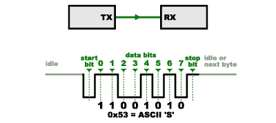
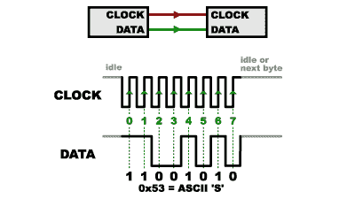
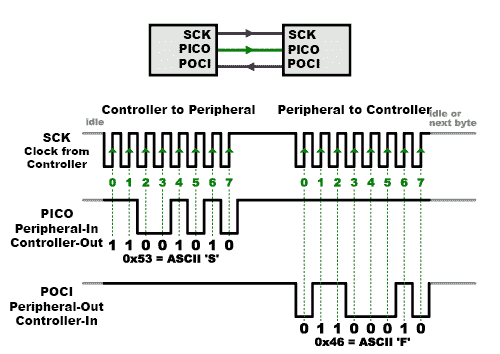
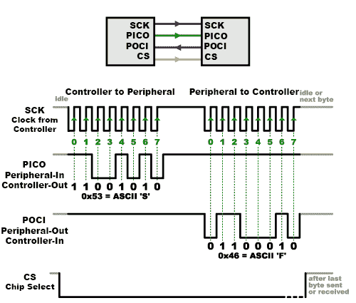
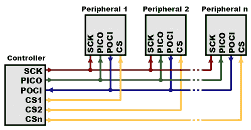
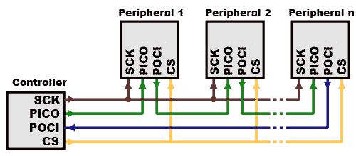
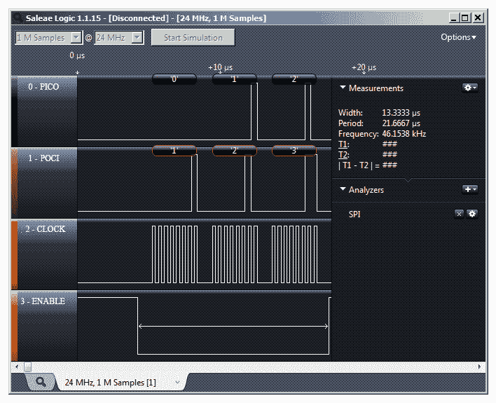

# 串行外设接口(SPI)

> 原文：<https://learn.sparkfun.com/tutorials/serial-peripheral-interface-spi>

## 介绍

串行外设接口(SPI)是一种接口总线，通常用于在微控制器和小型外设(如移位寄存器、传感器和 SD 卡)之间发送数据。它使用单独的时钟和数据线，以及一条选择线来选择您希望通话的设备。

### 推荐阅读

阅读本教程之前，了解以下内容会有所帮助:

 [### 串行通信](https://learn.sparkfun.com/tutorials/serial-communication) Asynchronous serial communication concepts: packets, signal levels, baud rates, UARTs and more 100 [### 二进制的](https://learn.sparkfun.com/tutorials/binary) Binary is the numeral system of electronics and programming...so it must be important to learn. But, what is binary? How does it translate to other numeral systems like decimal?[Favorited Favorite](# "Add to favorites") 51 [### 移位寄存器](https://learn.sparkfun.com/tutorials/shift-registers) An introduction to shift registers and potential uses.[Favorited Favorite](# "Add to favorites") 45 [### 逻辑电平](https://learn.sparkfun.com/tutorials/logic-levels) Learn the difference between 3.3V and 5V devices and logic levels.[Favorited Favorite](# "Add to favorites") 82

## 串口有什么问题？

常见的串行端口，即带有 TX 和 RX 线的那种，被称为“异步”(非同步)，因为无法控制何时发送数据，也无法保证两端以完全相同的速率运行。由于计算机通常依赖于所有东西都同步到一个“时钟”(连接到驱动所有东西的计算机的主晶体)，当两个时钟略有不同的系统试图相互通信时，这可能是一个问题。

为了解决这个问题，异步串行连接向每个字节添加额外的开始和停止位，帮助接收器在数据到达时与数据同步。双方还必须事先就传输速度(如每秒 9600 比特)达成一致。传输速率的微小差异不是问题，因为接收器会在每个字节的开头重新同步。

(顺便说一下，如果你注意到上图中的“11001010”不等于 0x53，那么你对细节的关注值得称赞。串行协议通常首先发送最低有效位，因此最小的位在最左边。下面的 nybble 实际上是 0011 = 0x3，上面的 nybble 是 0101 = 0x5。)

异步串行工作得很好，但在每个字节发送的额外起始和停止位以及发送和接收数据所需的复杂硬件方面有很多开销。正如您在自己的项目中可能已经注意到的，如果两端的速度不同，接收到的数据将是垃圾。这是因为接收器在非常特定的时间对比特进行采样(上图中的箭头)。如果接收器正在查看错误的时间，它将看到错误的位。

## 同步解决方案

SPI 的工作方式略有不同。这是一种“同步”数据总线，这意味着它使用单独的数据线路和“时钟”来保持两端完全同步。时钟是一个振荡信号，告诉接收器何时对数据线上的位进行采样。这可以是时钟信号的上升(低到高)或下降(高到低)沿；数据手册将指定使用哪一种。当接收器检测到该边沿时，它会立即查看数据线以读取下一位(见下图中的箭头)。因为时钟是与数据一起发送的，所以指定速度并不重要，尽管器件会有最高的工作速度(我们稍后将讨论如何选择合适的时钟边沿和速度)。

SPI 如此受欢迎的一个原因是接收硬件可以是一个简单的[移位寄存器](https://www.sparkfun.com/products/733)。这是一个更简单(也更便宜！)硬件，而非异步串行所需的全功能 UART(通用异步接收器/发送器)。

## 接收数据

**Note:** You may not recognize the PICO/POCI labels for SPI pins. SparkFun has joined with other members of OSHWA in a resolution to move away from using "Master" and "Slave" to describe signals between the controller and the peripheral. Check out [this page](https://www.sparkfun.com/spi_signal_names) for more on our reasoning behind this change. The terms are considered obsolete and are now replaced with the terms "controller" and "peripheral," respectively.

| 废弃名称 | 替换名称 |
| 掌握 | 控制器 |
| 奴隶 | 外围的 |
| 军事情报部门组织(Military Intelligence Service Organization) | POCI |
| MOSI | 微微 |
| 圣人 | 特许测量员 |

The naming convention may vary depending on manufacturer, programming language, companies, or organizations. For more information, check out the following links.

*   [维基百科:术语关注点](https://en.wikipedia.org/wiki/Master/slave_(technology)#Terminology_concerns)
*   [OSHWA:重新定义 SPI 信号名称的解决方案](https://www.oshwa.org/a-resolution-to-redefine-spi-signal-names)

你可能会对自己说，self，这对于单向通信来说听起来很棒，但是你如何以相反的方向发回数据呢？这就是事情变得稍微复杂的地方。

在 SPI 中，只有一端产生时钟信号(串行时钟通常称为 CLK 或 SCK)。产生时钟的一侧称为“控制器”，另一侧称为“外设”。总是只有一个控制器(几乎总是微控制器)，但可以有多个外设(稍后会详细介绍)。

当数据从控制器发送到外设时，它是在一条称为 PICO 的数据线上发送的，即“外设输入/控制器输出”。如果外围设备需要向控制器发回一个响应，控制器将继续产生一个预先安排好的时钟周期数，外围设备将把数据放到第三条数据线上，称为 POCI，表示“外围设备输出/控制器输入”。

注意我们在上面的描述中说了“预先安排”。因为控制器总是产生时钟信号，所以它必须预先知道外设何时需要返回数据以及将返回多少数据。这与异步串行非常不同，在异步串行中，随机数量的数据可以在任何时候向两个方向发送。实际上，这不是问题，因为 SPI 通常用于与具有特定命令结构的传感器通信。例如，如果你向一个设备发送“读取数据”的命令，你知道该设备将总是向你发送例如两个字节作为回报。(在您可能希望返回可变数量的数据的情况下，您可以总是返回一个或两个指定数据长度的字节，然后让控制器检索全部数量。)

请注意，SPI 是“全双工”的(具有单独的发送和接收线路)，因此，在某些情况下，您可以同时发送和接收数据*(例如，请求新的传感器读数，同时从之前的传感器中检索数据)。您的器件数据手册会告诉您这是否可能。*

## 芯片选择(CS)

最后一条线你应该知道，称为芯片选择的 CS。这告诉外设它应该唤醒并接收/发送数据，并且当多个外设存在时也用于选择你想要与之通话的一个。

CS 线通常保持高电平，将外设从 SPI 总线断开。(这种逻辑被称为“低电平有效”，你会经常看到它用于使能和复位线。)就在数据发送到外设之前，线路被拉低，从而激活外设。当您使用完外设后，该线再次变为高电平。在[移位寄存器](https://www.sparkfun.com/products/733)中，这对应于“锁存”输入，它将接收到的数据传输到输出线。

将多个外设连接到 SPI 总线有两种方式:

1.  一般来说，每个外设都需要一条单独的 CS 线。要与特定的外设通话，您需要将该外设的 CS 线设置为低电平，并将其他外设保持为高电平(您不希望两个外设同时激活，否则它们可能都试图在同一条 POCI 线上通话，从而导致数据混乱)。大量外围设备将需要大量 CS 线路；如果你的输出越来越少，有[二进制解码芯片](https://www.sparkfun.com/products/9577)可以乘以你的 CS 输出。

2.  另一方面，有些器件喜欢以菊花链形式连接在一起，一个器件的 POCI(输出)连接到下一个器件的微微(输入)。在这种情况下，一条 CS 线连接到所有外设。一旦所有数据发送完毕，CS 线就会上升，导致所有芯片同时被激活。这通常用于菊花链移位寄存器和[可寻址 LED 驱动器](https://www.sparkfun.com/products/10444)。

请注意，对于这种布局，数据从一个外设溢出到下一个外设，因此要将数据发送到任何一个外设，您需要传输足够的数据到达所有的*。此外，请记住，您传输的第一个*数据将在最后一个*外设中结束。*

 *这种布局通常用于仅输出的情况，例如驱动 led，而不需要接收任何数据。在这些情况下，您可以断开控制器的 POCI 线。但是，如果数据确实需要返回控制器，可以通过闭合菊花链环路(上图中的蓝线)来实现。请注意，如果这样做，从外设 1 返回的数据将需要在返回控制器之前通过*所有*外设，因此请确保发送足够多的接收命令来获取您需要的数据。

## SPI 编程

许多微控制器内置 SPI 外设，可以处理发送和接收数据的所有细节，并且速度非常快。SPI 协议也足够简单，您(是的，您！)可以编写自己的例程，以正确的顺序操作 I/O 线来传输数据。(一个很好的例子是在[维基百科 SPI 页面](http://en.wikipedia.org/wiki/Serial_Peripheral_Interface_Bus)。)

如果您使用的是 Arduino，有两种方式可以与 SPI 设备通信:

1.  您可以使用 [shiftIn()](http://arduino.cc/en/Reference/ShiftIn) 和 [shiftOut()](http://arduino.cc/en/Reference/ShiftOut) 命令。这些是基于软件的命令，适用于任何一组引脚，但会有些慢。

2.  或者您可以使用 [SPI 库](http://arduino.cc/en/Reference/SPI)，它利用了微控制器内置的 SPI 硬件。这比上面的命令要快得多，但是它只对某些管脚有效。

设置界面时，您需要选择一些选项。这些选项必须与您正在通话的设备的选项相匹配；查看器件的数据手册，了解其要求。

*   该接口可以先发送最高有效位(MSB)数据，或先发送最低有效位(LSB)数据。在 Arduino SPI 库中，这由 [setBitOrder()](http://arduino.cc/en/Reference/SPISetBitOrder) 函数控制。

*   外设将在时钟脉冲的上升沿或下降沿读取数据。此外，时钟在高电平或低电平时可以被认为是“空闲”的。在 Arduino SPI 库中，这两个选项都由 [setDataMode()](http://arduino.cc/en/Reference/SPISetDataMode) 函数控制。

*   SPI 可以以极高的速度工作(每秒数百万字节)，这对某些器件来说可能太快了。为了适应这种设备，您可以调整数据速率。在 Arduino SPI 库中，速度由 [setClockDivider()](http://arduino.cc/en/Reference/SPISetClockDivider) 函数设置，该函数将控制器时钟(大多数 Arduino 为 16MHz)分频至 8MHz (/2)至 125kHz (/128)之间的频率。

*   如果使用 SPI 库，必须使用提供的 SCK、皮科和 POCI 引脚，因为硬件是硬连线到这些引脚的。还有一个专用的 CS 引脚可供您使用(至少必须将其设为输出，以便 SPI 硬件工作)，但请注意，您也可以使用任何其他可用的输出引脚将 CS 连接到外设。

*   在较旧的 Arduinos 上，你需要自己控制 CS 引脚，在数据传输之前将其中一个引脚设为低电平，之后设为高电平。较新的 Arduinos(如 Due)可以自动控制每个 CS 引脚，作为数据传输的一部分；更多信息参见 [Due SPI 文档页面](http://arduino.cc/en/Reference/DueExtendedSPI)。

## 有兴趣学习更多基础主题吗？

查看我们的 **[工程要点](https://www.sparkfun.com/engineering_essentials)** 页面，了解电气工程相关基础主题的完整列表。

带我去那里！

## 资源和更进一步

### 提示和技巧

*   由于信号速度较高，SPI 只能用于短距离数据传输(最远几英尺)。如果需要发送更远的数据，[降低时钟速度](http://arduino.cc/en/Reference/SPISetClockDivider)，考虑使用[专用驱动芯片](http://www.ti.com/lit/an/slyt441/slyt441.pdf)。

*   如果事情不像你想象的那样运行，逻辑分析仪是一个非常有用的工具。像[salae USB 逻辑分析仪](https://www.sparkfun.com/products/8938)这样的智能分析仪甚至可以解码用于显示或记录的数据字节。

### SPI 的优势:

*   它比异步串行快

*   接收硬件可以是简单的移位寄存器

*   它支持多种外设

### SPI 的缺点:

*   它比其他通信方式需要更多的信号线(电线)

*   通信必须事先定义好(你不能想什么时候发送就什么时候发送)

*   控制器必须控制所有通信(外围设备不能直接相互通信)

*   通常每个外设都需要单独的 CS 线，如果需要大量外设，这可能会有问题。

### 进一步阅读

查看 SPI 上的 [Wikipedia 页面，其中包含许多关于 SPI 和其他同步接口的有用信息。](http://en.wikipedia.org/wiki/Serial_Peripheral_Interface_Bus)

[本页](https://www.pjrc.com/better-spi-bus-design-in-3-steps/)介绍了在您的嵌入式设备中设置 SPI 网络的更正确的方法，特别是与 [Arduino](https://learn.sparkfun.com/tutorials/what-is-an-arduino) 微控制器一起使用时。

很多 SparkFun 产品都有 SPI 接口。例如，[条形图分组套件](https://www.sparkfun.com/products/10936)有一个易于使用的 SPI 接口，您可以使用它来打开或关闭 30 个 led 中的任何一个。

其他通信选项:

 [### 串行通信](https://learn.sparkfun.com/tutorials/serial-communication) Asynchronous serial communication concepts: packets, signal levels, baud rates, UARTs and more 100 [### 模数转换](https://learn.sparkfun.com/tutorials/analog-to-digital-conversion) The world is analog. Use analog to digital conversion to help digital devices interpret the world.[Favorited Favorite](# "Add to favorites") 58 [### I2C](https://learn.sparkfun.com/tutorials/i2c) An introduction to I2C, one of the main embedded communications protocols in use today.[Favorited Favorite](# "Add to favorites") 128 [### AST-CAN485 连接指南](https://learn.sparkfun.com/tutorials/ast-can485-hookup-guide) The AST CAN485 is a miniature Arduino in the compact form factor of the ProMini. In addition to all the usual features it has on-board CAN and RS485 ports enabling quick and easy interfacing to a multitude of industrial devices.[Favorited Favorite](# "Add to favorites") 10

既然您是 SPI 专家，下面是一些练习新技能的教程:

 [### MP3 播放器屏蔽音乐盒](https://learn.sparkfun.com/tutorials/mp3-player-shield-music-box) Music Box Project based on the Dr. Who TARDIS.[Favorited Favorite](# "Add to favorites") 8 [### 使用串行 7 段显示器](https://learn.sparkfun.com/tutorials/using-the-serial-7-segment-display) How to quickly and easily set up the Serial 7-Segment Display and the Serial 7-Segment Display Shield.[Favorited Favorite](# "Add to favorites") 14 [### SparkFun BME280 分线连接指南](https://learn.sparkfun.com/tutorials/sparkfun-bme280-breakout-hookup-guide) A guide for connecting the BME280 sensor to a microcontroller, and for using the SparkFun Arduino library.[Favorited Favorite](# "Add to favorites") 1 [### 树莓派 SPI 和 I2C 教程](https://learn.sparkfun.com/tutorials/raspberry-pi-spi-and-i2c-tutorial) Learn how to use serial I2C and SPI buses on your Raspberry Pi using the wiringPi I/O library for C/C++ and spidev/smbus for Python.[Favorited Favorite](# "Add to favorites") 24*