# 使用 GitHub

> 原文：<https://learn.sparkfun.com/tutorials/using-github>

## 什么是回购？

*回购*是**库**的简称。可以把 repo 想象成一个文件文件夹，所有对文件的修改都会被记录下来。如果一个文件有问题，你可以及时返回，找出你做了什么改变。回购最常见的用途是管理大型代码项目，但回购跟踪适用于硬件领域的各种应用，包括 PCB 布局、固件、数据表和文档。

例如，让我们想象有人创建了一个 Arduino 草图来演示如何读取模拟传感器。

```
language:c
byte myValue = 0;
myValue = analogRead(A0); 
```

这段代码可以做一些改进( [analogRead](http://arduino.cc/en/Reference/analogRead) 返回一个 int 而不是一个 byte！).如果代码只是某个人网站上的一个文件，你就必须给他们发一封电子邮件，提出改进建议。这有点乏味，当一个项目超过几行代码时，电子邮件就不是一种可行的项目协作方式。 [GitHub](http://www.github.com) 允许一个人管理他们自己的项目(也称为修订或版本控制)，它也允许许多人在大型项目上一起工作(源代码管理)。

#### 这个饭桶是什么东西？

[Git](http://en.wikipedia.org/wiki/Git) 是一款软件管理工具，专为超大型编码项目(如 Linux)设计。因为我们在 SparkFun 做的大部分工作是在较小的项目上，所以我们只使用了它的一小部分功能。Git 使用命令行界面， [GitHub](http://www.github.com) 的创建是为了给 Git 一个看起来更光滑的网络界面。此外，GitHub 发布了一个 [GitHub 桌面 GUI，用于 Windows](http://windows.github.com/) (图形用户界面)，使得转移 repos 更加容易。

我们将在本教程中介绍一些内容:

*   **下载 ZIP** -如何从 GitHub 获取东西
*   **管理** -如何在 GitHub 上管理自己的东西
*   **拉请求** -如何改进 GitHub 上的某些东西
*   **Wiki 和问题**-GitHub 上有更多内容，包括 Wiki 和问题跟踪

## 下载 ZIP

只需要从一个公共的 GitHub 项目中获取一些代码？以下是如何从 GitHub 获取一些东西:

[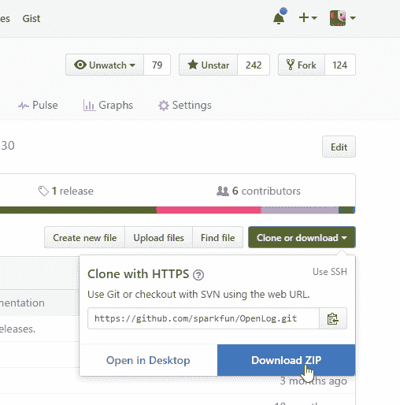](https://cdn.sparkfun.com/assets/learn_tutorials/1/1/DownloadZip2.jpg)

每个项目都有一个易于使用的“下载 ZIP”按钮，它会给你项目的全部内容。如果你只需要拿了就走，这很有用。然而，如果你打算回馈社会，这不是正确的方式。

[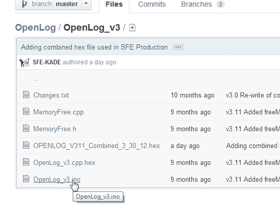](//cdn.sparkfun.com/assets/3/4/6/e/2/50e09aa9ce395fc07d000001.jpg)*Right-clicking won’t work*

**注意:**如果您正在浏览一个项目，并看到一个您想要获取的文件，右键单击并选择另存为并不能获取该文件。您将得到一个 HTML 文件，而不是您可能期望的原始文件。您应该使用 ZIP 下载按钮，或者将 repo 克隆到本地文件夹。继续读！我们会告诉你怎么做。

## 管理回购

首先，你需要[在 GitHub 上创建一个账户](https://github.com/join)。别担心，对于普通用户是免费的。

[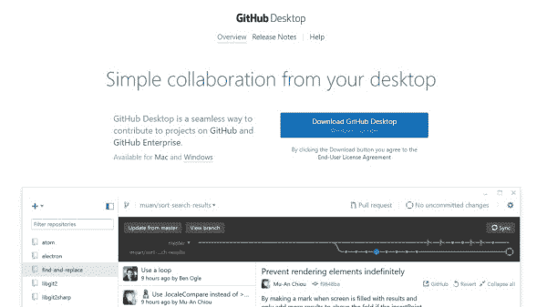](https://cdn.sparkfun.com/assets/learn_tutorials/1/1/Github_Desktop_Download.jpg)

有很多针对 Mac 和 Linux 的 Git 客户端，但是本教程将重点介绍 Windows。如果你是 Windows 或 Mac 用户，我强烈建议你试试 GitHub 桌面 GUI。下面的教程将集中在这个客户端，所以请下载并安装软件。

在安装过程中，它会要求您提供登录信息、姓名和电子邮件地址等信息。所有这些信息都将与您所做的提交相关联。

在安装过程中，它可能会要求您扫描您的计算机上的 repos。我建议你*不要*这样做。扫描可能会花很长时间，因为你正在阅读本教程，你可能不会有任何回复。

一旦图形用户界面启动，你可能不会有任何本地回购。我们去 SparkFun GitHub 账户上买一个吧。我们来抢一下 [GitHub 教程](https://github.com/sparkfun/Github_Tutorial)回购。登录 GitHub 后，点击“Fork”按钮。

[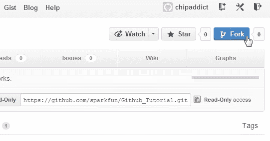](//cdn.sparkfun.com/assets/9/b/a/2/0/50e09aa8ce395f177d000000.jpg)

我们现在已经创建了一个“分支”或此回购的副本，位于您的 GitHub 帐户中。注意窗口左上角的文字“**chip addict/Github _ Tutorial**”和下面的文字“**分叉自 sparkfun/Github_Tutorial** ”。这表明您的帐户上有这个项目(您的帐户名会有所不同)。

[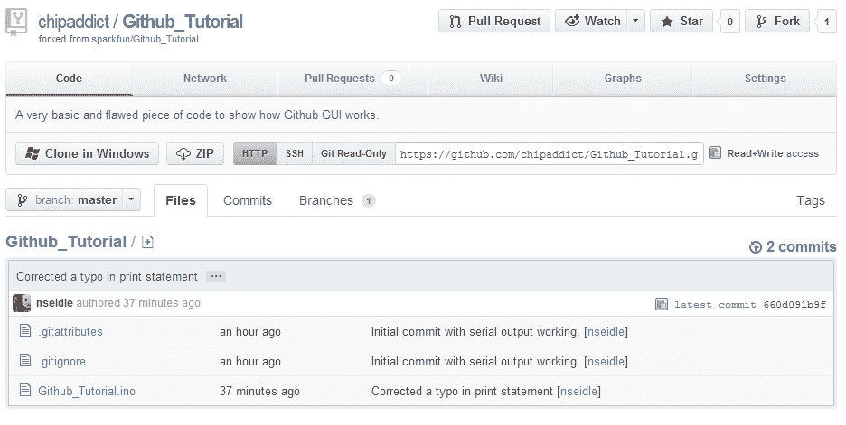](//cdn.sparkfun.com/assets/a/9/a/c/8/50e09b1ece395fa308000000.jpg)

现在，您可以在不影响原始项目的情况下对此回购进行大量更改。如果有人有一些接近您需要的示例代码，但需要对您的计划进行大量修改，这将很有帮助。

现在你已经有了自己的项目在线副本，点击“克隆或下载”按钮，然后点击“在桌面打开”按钮。如果您没有登录，它可能会将您带到 GitHub Windows 页面。

[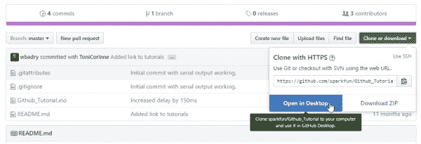](https://cdn.sparkfun.com/assets/learn_tutorials/1/1/Fork_Repo_Open_in_Desktop.jpg)

Windows 可能会询问您是否允许链接启动和使用 GitHub 软件。这是可以的。GitHub GUI 将打开并开始下载。

因为我们刚刚签署了回购协议，所以没有任何变化。以前版本的 GitHub 桌面 GUI 有一个时间线点。如果你点击顶部的任何一个点，我们可以回到过去，看看随着时间的推移发生了什么变化。否则，左侧会有一个标签，列出变更和历史记录。您可以看到被更改的文件和添加到文件中的内容(绿色)。

[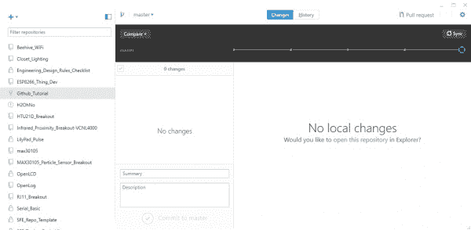](https://cdn.sparkfun.com/assets/learn_tutorials/1/1/GitHub_desktop_repo_open.jpg)

嘿谢谢瓦利德！他建议对自述文件进行修改，并添加了一个指向本教程的链接。聪明。

[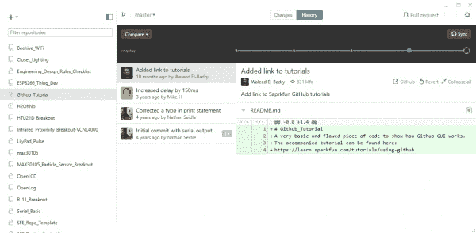](https://cdn.sparkfun.com/assets/learn_tutorials/1/1/GitHub_desktop_repo_open_history.jpg)

更早以前，我们可以看到有一个注释“**纠正了打印语句**中的一个错别字，下面我们可以看到修改过的代码行——红色被删除，绿色被添加。我们可以做很多有趣的事情，比如“恢复提交”和“回滚提交”，但是现在，让我们看看修订跟踪是如何工作的。

[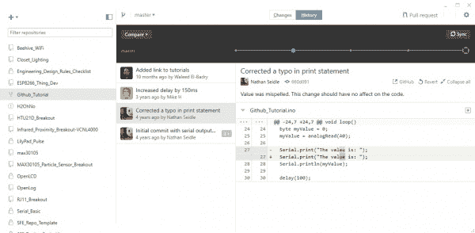](https://cdn.sparkfun.com/assets/learn_tutorials/1/1/GitHub_desktop_repo_open_history2.jpg)

对于旧版本，点击右上角的齿轮并选择'**选项...**’。对于最新版本，这个文件将位于'**>**克隆库...**’。**

**[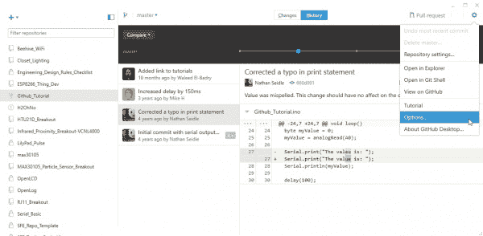](https://cdn.sparkfun.com/assets/learn_tutorials/1/1/GitHub_desktop_tools_options.jpg)

您将能够在“**克隆路径**”下找到存储库的位置。我将它改为将我的存储库存储在一个 [Dropbox 文件夹](http://www.dropbox.com)中。我将 Dropbox 与 GitHub 结合使用，这样我就可以在不同设备上进行项目，一旦项目达到一定的稳定性，就可以将代码上传到 GitHub。

[](https://cdn.sparkfun.com/assets/learn_tutorials/1/1/GitHub_desktop_tools_options_clone_path.jpg)

你现在应该知道你的回购储存在哪里。导航到该目录并打开 *Github_Tutorial.ino* 文件。从 Arduino IDE 或 Windows 记事本中，让我们将变量声明从**字节**更正为**整型**。保存修改并返回 GitHub GUI。

[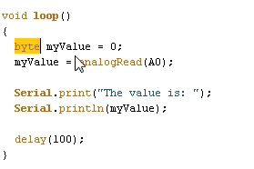](//cdn.sparkfun.com/assets/0/2/4/c/2/50e09b1dce395f797d000000.jpg)

GitHub 发现一个文件被修改了！对于旧版本，您应该在 changes 按钮上看到一个点。否则，您会注意到在**变更**选项卡中有项目。

[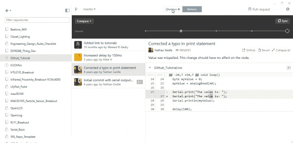](https://cdn.sparkfun.com/assets/learn_tutorials/1/1/Uncomitted_Changes.jpg)

您将看到主屏幕也发生了变化，显示了 git 已经检测到的变化:

[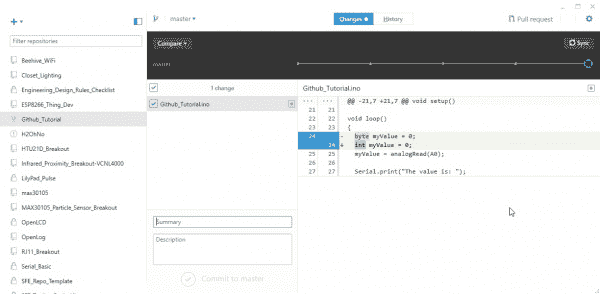](https://cdn.sparkfun.com/assets/learn_tutorials/1/1/Uncomitted_Changes-2.jpg)

哇！我们所做的小改动现在被很好地突出显示了。

现在我们来谈谈回购是如何运作的。你有一个**本地工作副本**，一个**本地回购**，一个**全球回购**。

### 本地工作副本

本地工作副本:你通常在本地计算机上用本地副本编写代码、布局 PCB 和编写文档。一整天你都可以使用 GitHub 窗口将这些更改“提交”到本地 repo。你一天中所做的改变*并不*为世人所知，只为你本地计算机上的本地回购协议所知。

[](https://cdn.sparkfun.com/assets/learn_tutorials/1/1/Uncomitted_Changes-3.jpg)

### 本地回购

**本地回购:**现在让我们提交对本地回购所做的更改。在提交之前，我们必须对我们更改的内容进行评论。彻底描述你做了什么，然后点击“**提交给主人**”。

一般来说，试着经常提交小的改变。如果你在两次提交之间等待了 4 个月，你将很难记住为什么你修改了 5 行子函数。

按下提交后，会出现同步按钮。

[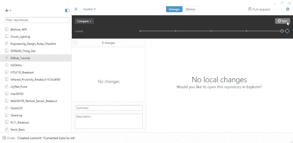](https://cdn.sparkfun.com/assets/learn_tutorials/1/1/Uncomitted_Changes-4.jpg)

我们现在*没有未提交的更改*，但是我们**有**有*未同步的提交*。这意味着我们已经提交了对本地回购的更改，但我们还没有将这些更改推送到(同步)我们的全球回购。

### 全球回购

**全局回购:**按“同步”。这将把我们在本地回购中所做的更改推送到 GitHub 和我们的账户上。

[](https://cdn.sparkfun.com/assets/learn_tutorials/1/1/Uncomitted_Changes-5.jpg)

干得好，鲍勃！我们已经成功地在 GitHub 的全球回购中推出了这些经过修正的代码。现在上网看看你的回购。

[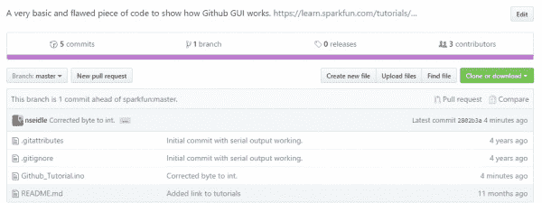](https://cdn.sparkfun.com/assets/learn_tutorials/1/1/Committed_Changes-1.jpg)

我们可以看到我们提交的注释，以及这个分支相对于原始 sparkfun repo 的状态:"*这个分支比 sparkfun:master* 早 1 次提交"。

GitHub web 界面类似于 Windows GUI，但是增加了许多高级选项。使用 web 更改项目的属性；使用 GUI 进行本地回购和全局同步的例行提交。

### 超越免费

GitHub 有多种定价模式，但有一个免费版本，它拥有所有的功能和尽可能多的公共存储库(耶[开源硬件](http://www.oshwa.org/)！)但是如果你想要私人回购，你就得付费。SparkFun 为组织级别付费，因为我们热爱 GitHub，在我们的 web 开发中广泛使用它们，在我们的公共硬件项目中使用 GitHub。我们通常为一个新项目创建一个私人回购协议，并在临近产品发布日期时将其公开。

[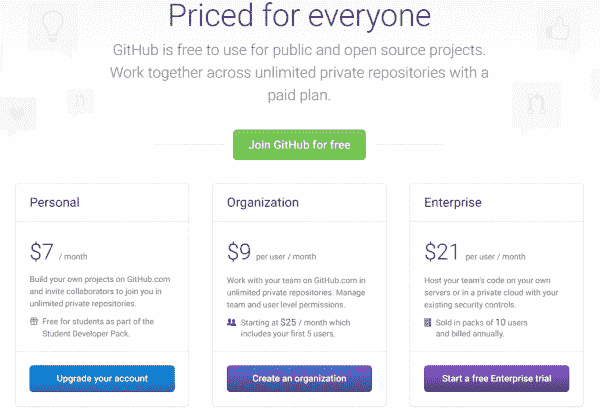](https://cdn.sparkfun.com/assets/learn_tutorials/1/1/Github_Pricing.jpg)

这一节到此为止。派生回购或创建回购的这些步骤应该允许您创建代码项目、PCB 布局(我们一直将 Eagle 文件上传到 GitHub)、文档、图像甚至二进制文件。

在这一节中，我们发现了一个 bug 并纠正了它，但是我们还没有让原始项目知道这个错误。下一节将介绍如何通过拉请求将更正和改进发送回原始项目。

## 拉取请求

存储库对于管理和跟踪代码随时间的变化非常有用。但是当你在一个项目中与多人合作时，真正的力量开始发挥作用。当人们有多种改进时，我们如何将它们结合起来？拉请求允许贡献者反馈给主项目。

我们对我们版本的 *Github_Tutorial* 项目做了一些改进。现在，让我们单击“拉请求”按钮，让项目所有者了解我们所做的改进。

[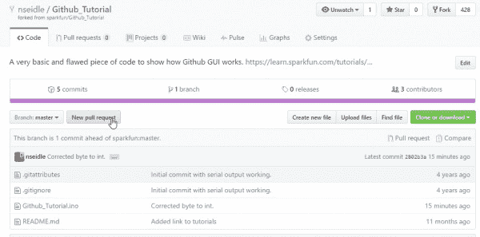](https://cdn.sparkfun.com/assets/learn_tutorials/1/1/Pull_Request-1.jpg)

我们在这里描述我们所做的更改，以便主项目的所有者(在这个例子中是 SparkFun 的所有者)知道会发生什么。和大多数评论一样，尽可能的详细。您所做的更改对您来说是显而易见的，但对于拥有数千行代码和数十个拉请求的项目所有者来说，这可能会变得令人困惑。

[](https://cdn.sparkfun.com/assets/learn_tutorials/1/1/Pull_Request-2.jpg)

一旦你写好了关于你提议的改变的注释，点击'**创建拉动式请求**'。一旦我们发送了拉请求，主项目的所有者就会得到通知。请不要犹豫向 SparkFun 发送本教程的拉请求。我们希望收到您的来信！

[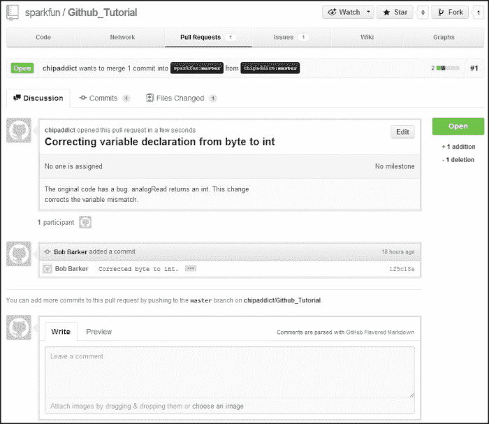](//cdn.sparkfun.com/assets/d/b/7/5/e/50e0b7b1ce395fe32a000000.jpg)

这是项目所有者可以审查提交的代码(有时称为补丁)的地方。GitHub 提供了一个很棒的讨论系统，让补丁可以被讨论。您甚至可以对单独的代码行进行注释。

从所有者的角度来看，这里是拉请求的样子。所有者可以选择合并此拉取请求或对其进行讨论。

[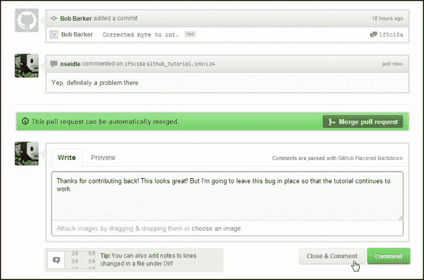](//cdn.sparkfun.com/assets/5/2/9/7/e/50e0b7b3ce395fb029000000.jpg)

一般来说，创建更小、更简单的拉请求。这将使项目负责人更容易理解。接受包含 5 或 10 个变更的拉请求更容易，但是如果您已经完全重写了 400 行代码，这将是一个巨大的任务。

## 问题和维基

### 提出问题

GitHub 还内置了一些额外的工具。**问题跟踪**允许人们发布给定项目的问题。这有点像一个票务系统或技术支持，但能够对特定的代码行进行评论。

这是一个制造问题的例子。没什么特别的，但它允许合作者之间进行良好的对话。你可以在 **Github_Tutorial** 项目[这里](https://github.com/sparkfun/Github_Tutorial/issues?state=open)看到所有开放的问题。

[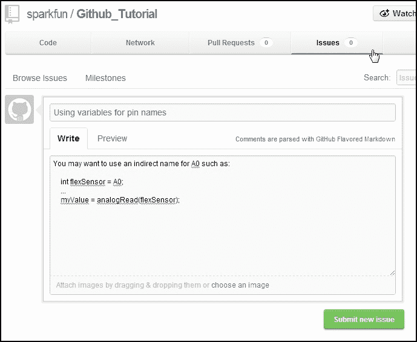](//cdn.sparkfun.com/assets/7/c/9/0/8/50e0b4bece395f3a3a000000.jpg)

### GitHub Wiki

每个回购也有一个 [Wiki](http://en.wikipedia.org/wiki/Wiki) 可供使用。这对于文档、关于你的项目的常见问题等很方便。

[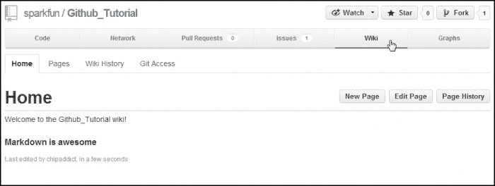](//cdn.sparkfun.com/assets/5/e/2/4/5/50e0b4bece395f353a000003.jpg)

Node.js 有一个在回购中使用维基的好例子。

[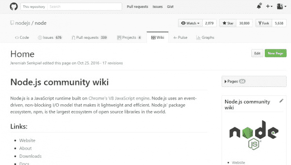](https://cdn.sparkfun.com/assets/learn_tutorials/1/1/github_wiki.jpg)

在 SparkFun，我们不经常使用 GitHub wiki，而是利用我们自己的教程系统关注[连接指南](https://learn.sparkfun.com/tutorials)。也就是说，对于您的个人项目来说，GitHub Wiki 是一个非常好的、灵活的地方，可以存放给定项目或产品的文档。合作者也可以帮助维护和改进文档。

尝试在你的下一个项目中使用 Git 和 GitHub。不可否认，这是一条学习曲线，但它会让与人合作变得容易得多。

## 资源和更进一步

既然你已经控制了回购，我们建议你看看这些教程:

*   准备好升级你的游戏了吗？帮助我们让世界变得更美好！阅读如何[使用 GitHub 来帮助我们](https://learn.sparkfun.com/tutorials/using-github-to-share-with-sparkfun)改进我们的库和硬件。
*   检查 [MAX30105 回购](https://github.com/sparkfun/MAX30105_Particle_Sensor_Breakout)看看我们如何设置它。对于 [Arduino 库](https://github.com/sparkfun/SparkFun_MAX3010x_Sensor_Library)也有一个单独的回购。**