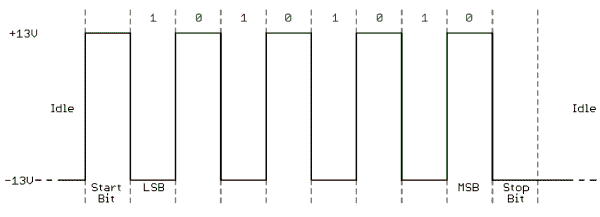

# 串行通信

> 原文：<https://learn.sparkfun.com/tutorials/serial-communication>

## 介绍

嵌入式电子学就是将电路(处理器或其他集成电路)相互连接起来，以创建一个共生系统。为了让这些独立的电路交换信息，它们必须共享一个公共的通信协议。为了实现这种数据交换，已经定义了数百种通信协议，一般来说，每种协议都可以分为两类:并行或串行。

### 并行与串行

并行接口同时传输多个位。它们通常需要跨越八根、十六根或更多导线的数据传输总线。数据以 1 和 0 的巨大碰撞波传输。

*An 8-bit data bus, controlled by a clock, transmitting a byte every clock pulse. 9 wires are used.*

串行接口传输数据，一次一位。这些接口可以在少至一根电线上运行，通常不会超过四根。

*Example of a serial interface, transmitting one bit every clock pulse. Just 2 wires required!*

把两个接口想象成一串汽车:并行接口是 8+车道的大型高速公路，而串行接口更像是两车道的乡村公路。在一段时间内，巨型高速公路可能会让更多的人到达目的地，但农村的双车道公路服务于它的目的，只需要建设资金的一小部分。

平行交流当然有它的好处。它快速、简单，并且相对容易实现。但是它需要更多的输入/输出(I/O)线。如果你曾经不得不将一个项目从基本的 Arduino Uno T1 转移到大型的 T2 T3，你就会知道微处理器上的 I/O 线是非常珍贵和稀少的。因此，我们经常选择串行通信，牺牲潜在的速度来换取引脚面积。

### 异步串行

多年来，为了满足嵌入式系统的特殊需求，人们精心设计了数十种串行协议。USB(通用*串行*总线)和以太网是两个比较著名的计算串行接口。其他非常常见的串行接口包括 SPI、I ² C 以及我们今天要讨论的串行标准。这些串行接口可以分为两类:同步或异步。

同步串行接口总是将其数据线与时钟信号配对，因此同步串行总线上的所有器件共享一个公共时钟。这使得串行传输更加直接，通常速度更快，但它也要求通信设备之间至少有一条额外的线路。同步接口的例子包括 SPI 和 I ² C。

*异步*意味着数据的传输**不需要外部时钟信号**的支持。这种传输方法非常适合减少所需的导线和 I/O 引脚，但这意味着我们需要付出额外的努力来可靠地传输和接收数据。我们将在本教程中讨论的串行协议是最常见的异步传输形式。事实上，这很常见，当大多数人说“串行”时，他们指的是这个协议(在本教程中你可能会注意到)。

我们将在本教程中讨论的无时钟串行协议广泛应用于嵌入式电子设备中。如果你想在你的项目中添加 GPS 模块、蓝牙、XBee、串行液晶显示器或许多其他外部设备，你可能需要拿出一些串行 fu。

### 推荐阅读

本教程建立在一些低级电子概念的基础上，包括:

 [### 二进制的](https://learn.sparkfun.com/tutorials/binary) Binary is the numeral system of electronics and programming...so it must be important to learn. But, what is binary? How does it translate to other numeral systems like decimal?[Favorited Favorite](# "Add to favorites") 51 [### 逻辑电平](https://learn.sparkfun.com/tutorials/logic-levels) Learn the difference between 3.3V and 5V devices and logic levels.[Favorited Favorite](# "Add to favorites") 82 [### 模拟与数字](https://learn.sparkfun.com/tutorials/analog-vs-digital) This tutorial covers the concept of analog and digital signals, as they relate to electronics.[Favorited Favorite](# "Add to favorites") 66 [### 如何阅读原理图](https://learn.sparkfun.com/tutorials/how-to-read-a-schematic) An overview of component circuit symbols, and tips and tricks for better schematic reading. Click here, and become schematic-literate today 112 [### 十六进制的](https://learn.sparkfun.com/tutorials/hexadecimal) How to interpret hex numbers, and how to convert them to/from decimal and binary.[Favorited Favorite](# "Add to favorites") 32 [### 美国信息交换标准代码](https://learn.sparkfun.com/tutorials/ascii) A brief history of how ASCII came to be, how it's useful to computers, and some helpful tables to convert numbers to characters.[Favorited Favorite](# "Add to favorites") 28

如果你对这些概念不太熟悉，可以考虑看看这些链接。

现在，让我们继续一系列的旅程...

## 连载规则

异步串行协议有许多内置的规则-机制，有助于确保可靠和无错误的数据传输。这些机制是为了避免外部时钟信号，它们是:

*   数据位，
*   同步位，
*   奇偶校验位，
*   和波特率。

通过各种各样的信号机制，您会发现没有一种方法可以串行发送数据。该协议是高度可配置的。关键部分是确保**串行总线上的两个设备被配置为使用完全相同的协议**。

#### 波特率

波特率指定了**数据通过串行线路发送的速度。它通常以比特每秒(bps)为单位来表示。如果你反转波特率，你就可以知道传输一个比特需要多长时间。该值决定了发送器将串行线保持在高/低状态的时间，或者接收设备对其线路进行采样的周期。**

波特率可以是合理范围内的任何值。唯一的要求是两个器件以相同的速率工作。更常见的波特率之一是 **9600 bps** ，尤其是对于速度不太重要的简单数据。其他“标准”波特率是 1200、2400、4800、19200、38400、57600 和 115200。

波特率越高，发送/接收数据就越快，但数据传输速度是有限制的。你通常不会看到超过 115200 的速度——这对大多数微控制器来说是很快的。太高的话，你会在接收端看到误差，因为时钟和采样周期跟不上。

#### 构建数据

传输的每个数据块(通常是一个字节)实际上是在一个比特的*包*或*帧*中发送的。帧是通过将同步和奇偶校验位添加到数据中而创建的。

*A serial frame. Some symbols in the frame have configurable bit sizes.*

让我们深入了解每一个框架的细节。

#### 数据块

每个串行数据包的真正内容是它所携带的数据。我们含糊不清地称这个数据块为*块*，因为它的大小并没有明确说明。每个数据包中的数据量可以设置为 5 到 9 位之间的任意值。当然，标准的数据大小是基本的 8 位字节，但其他大小也有其用途。7 位数据块可能比 8 位数据块更有效，尤其是如果您只是传输 7 位 ASCII 字符的话。

在对字符长度达成一致后，两个串行设备还必须对其数据的**字节顺序**达成一致。数据是从最高有效位(msb)发送到最低有效位，还是相反？如果没有特别说明，你通常可以假设数据是先传输**最低有效位(LSB)**。

#### 同步位

同步位是与每个数据块一起传输的两个或三个特殊位。它们是**起始位**和**停止位**。顾名思义，这些位标志着数据包的开始和结束。总是只有一个起始位，但是终止位的数量可以配置为一个或两个(尽管通常是一个)。

起始位总是由从 1 到 0 的空闲数据线指示，而停止位将通过保持该线为 1 而转变回空闲状态。

#### 奇偶校验位

奇偶校验是一种非常简单的低级错误检查形式。它有两种味道:奇数或偶数。为了产生奇偶校验位，将数据字节的所有 5-9 位相加，总和的均匀性决定了该位是否置位。例如，假设奇偶校验被设置为偶数，并且被添加到像`0b01011101`这样的数据字节，其具有奇数个`1`的(5)，奇偶校验位将被设置为`1`。相反，如果奇偶校验模式设置为奇数，奇偶校验位将为`0`。

奇偶性是*可选的*，并没有很广泛的使用。它有助于在嘈杂的介质中传输数据，但也会稍微减慢数据传输速度，并要求发送方和接收方实施错误处理(通常，接收失败的数据必须重新发送)。

#### 9600 8N1(示例)

9600 8N1 - 9600 波特，8 个数据位，无奇偶校验，1 个停止位-是更常用的串行协议之一。那么，一两个 9600 个 8N1 的数据会是什么样子呢？举个例子吧！

传输 [ASCII](http://www.asciitable.com/) 字符‘O’和‘K’的设备必须创建两个数据包。 *O* (那是大写)的 ASCII 值是 79，分解成 8 位二进制值`01001111`，而 *K* 的二进制值是`01001011`。剩下的就是添加同步位。

虽然没有明确说明，但假设数据是从最低有效位开始传输的。请注意，当从右向左读取时，这两个字节是如何发送的。

由于我们以 9600 bps 的速率传输，保持这些位为高电平或低电平所需的时间为 1/(9600 bps)或 104s/位。

对于传输的每一字节数据，实际上有 10 位被发送:一个起始位、8 个数据位和一个停止位。因此，在 9600 bps 的速率下，我们实际上每秒发送 9600 位或 960 (9600/10)字节。

* * *

现在，您已经知道如何构造串行数据包，我们可以继续讨论硬件部分。在这里，我们将看到这些 1 和 0 以及波特率是如何在信号级实现的！

## 布线和硬件

串行总线仅由两条线组成，一条用于发送数据，另一条用于接收数据。因此，串行设备应该有两个串行引脚:接收器 **RX** 和发送器 **TX** 。

需要注意的是，这些 *RX* 和 *TX* 标签是针对设备本身的。因此，来自一个器件的 RX 应该进入另一个器件的 TX，反之亦然。如果你习惯于把 VCC 和 VCC、GND 和 GND、MOSI 和 MOSI 等联系在一起，那就太奇怪了。，不过想想也有道理。发送方应该与接收方对话，而不是与另一个发送方对话。

两个设备可以发送和接收数据的串行接口是**全双工**或**半双工**。全双工意味着两台设备可以同时发送和接收。半双工通信意味着串行设备必须轮流发送和接收。

一些串行总线可能只需要发送和接收设备之间的一个连接。例如，我们的[串行使能液晶显示器](https://www.sparkfun.com/products/10097)是所有的耳朵，并没有真正有任何数据中继回控制设备。这就是所谓的**单工**串行通信。你所需要的只是从主设备的 TX 到听众的 RX 线的一根电线。

#### 硬件实现

我们已经从概念的角度讨论了异步串行。我们知道我们需要哪些电线。但是串行通信实际上是如何在信号级实现的呢？实际上，在很多方面。串行信号有各种各样的标准。让我们来看几个更流行的串行硬件实现:逻辑电平(TTL)和 RS-232。

当微控制器和其他低级集成电路串行通信时，它们通常在 TTL(晶体管-晶体管逻辑)级进行。 **TTL 串行**信号存在于微控制器的电压供应范围之间——通常是 0V 到 3.3V 或 5V。VCC 电平(3.3V、5V 等)的信号。)表示空闲线路、值为 1 的位或停止位。0V (GND)信号表示值为 0 的起始位或数据位。

RS-232 可以在一些更古老的计算机和外围设备上找到，就像 TTL 串行颠倒过来一样。RS-232 信号的范围通常在-13V 到 13V 之间，尽管该规范允许从+/- 3V 到+/- 25V 的任何范围。在这些信号上，低电压(-5V，-13V 等。)表示空闲线路、停止位或值为 1 的数据位。高电平 RS-232 信号表示起始位或 0 值数据位。这与 TTL 串行有点相反。

在这两种串行信号标准中，TTL 更容易在嵌入式电路中实现。然而，低电压水平更容易受到长传输线损耗的影响。RS-232 或 RS-485 等更复杂的标准更适合长距离串行传输。

当您将两个串行设备连接在一起时，确保它们的信号电压匹配非常重要。你不能直接连接 TTL 串行设备和 RS-232 总线。你必须[转换那些信号](http://www.sparkfun.com/tutorials/215)！

* * *

接下来，我们将探讨微控制器用来将并行总线上的数据转换为串行接口数据的工具。UARTs！

## UARTs

这个串行难题的最后一块是找到既能创建串行数据包又能控制这些物理硬件线路的东西。进入 UART。

通用异步接收器/发送器(UART)是负责实现串行通信的电路模块。本质上，UART 充当并行和串行接口之间的中介。UART 的一端是一条由大约八条数据线(加上一些控制引脚)组成的总线，另一端是两条串行线——RX 和 TX。

*Super-simplified UART interface. Parallel on one end, serial on the other.*

UARTs 确实作为独立 IC 存在，但它们更常见于微控制器内部。你必须检查你的微控制器的数据表，看看它是否有任何 UARTs。有些没有，有些有一个，有些有很多。例如，基于“老忠实”ATmega328 的 Arduino Uno 只有一个 UART，而基于 ATmega2560 的 Arduino Mega 有四个 UART。

正如首字母缩略词中的 *R* 和 *T* 所指示的，UARTs 负责发送和接收串行数据。在发送端，UART 必须创建数据包——附加同步和奇偶校验位——并以精确的时序(根据设定的波特率)将数据包发送出 TX 线路。在接收端，UART 必须根据期望的波特率对 RX 线路进行采样，挑选出同步位，并输出数据。

*Internal UART block diagram (courtesy of the Exar ST16C550 datasheet)*

更高级的 UARTs 可能会将接收到的数据扔进一个**缓冲器**中，在微控制器来取数据之前，数据会一直留在那里。UARTs 通常会以先进先出(FIFO)的方式释放其缓冲数据。缓冲区可以小到几个比特，也可以大到几千个字节。

#### 软件 UARTs

如果微控制器没有 UART(或者没有足够的 UART)，串行接口可以被**位碰撞**——直接由处理器控制。这是像[软件系列](http://arduino.cc/en/Reference/SoftwareSerial)这样的 Arduino 库采用的方法。位碰撞是处理器密集型的，通常不如 UART 精确，但在紧要关头也能工作！

## 常见陷阱

这就是串行通信的全部内容。我想留给大家一些任何经验水平的工程师都容易犯的常见错误:

#### RX-to-TX，TX-to-RX

看起来很简单，但是我知道我犯了不止一次这样的错误。尽管您非常希望它们的标签匹配，但始终要确保串行设备之间的 RX 和 TX 线交叉。

*[FTDI Basic](https://www.sparkfun.com/products/9716) programming a [Pro Mini](https://www.sparkfun.com/products/11113). Note RX and TX's crossed!*

与受人尊敬的埃贡·斯宾格勒博士警告的相反，**穿过溪流**。

#### 波特率不匹配

波特率就像串行通信的语言。如果两个设备不以相同的速度说话，数据可能会被误解或完全丢失。如果接收设备在其接收线上看到的都是垃圾，请检查以确保波特率匹配。

*Data transmitted at 9600 bps, but received at 19200 bps. Baud mismatch = garbage.*

#### 总线竞争

串行通信设计为仅允许两个设备通过一条串行总线进行通信。如果一个以上的设备试图在同一条串行线上传输，您可能会遇到总线争用。敦敦敦....

例如，如果您将 GPS 模块连接到 Arduino，您只需将该模块的 TX 线连接到 Arduino 的 RX 线上。但是，Arduino RX 引脚已经连接到 USB 到串行转换器的 TX 引脚，每当您对 Arduino 进行编程或使用*串行监视器*时，都会用到该引脚。这就产生了一种潜在的情况，即 GPS 模块和 FTDI 芯片都试图同时在同一条线路上进行传输。

*Two transmitters sending to a single receiver sets up the possibility for bus contention.*

两台设备同时在同一条线路上传输数据是很糟糕的！在“最好”的情况下，两个设备都不会发送它们的数据。在最坏的情况下，两个设备的传输线都会失效(尽管这种情况很少发生，而且通常会受到保护)。

将多个接收设备连接到单个发送设备可能是安全的。不太符合规格，可能会被一个老练的工程师所反对，但它会工作。例如，如果您将串行 LCD 连接到 Arduino，最简单的方法可能是将 LCD 模块的 RX 线连接到 Arduino 的 TX 线。Arduino 的 TX 已经连接到 USB 编程器的 RX 线，但仍然只有一个设备控制传输线。

从固件的角度来看，像这样分布 TX 线仍然是危险的，因为你不能挑选哪个设备听到什么传输。LCD 将最终接收到不属于它的数据，这可能会命令它进入未知状态。

一般来说——一条串行总线，两个串行设备！

## 有兴趣学习更多基础主题吗？

查看我们的 **[工程要点](https://www.sparkfun.com/engineering_essentials)** 页面，了解电气工程相关基础主题的完整列表。

带我去那里！

## 资源和更进一步

有了串行通信这一闪亮的新知识，就有许多新概念、项目和技术可以探索。

您想了解更多关于其他通信标准的信息吗？也许是同步的？查看以下通信协议。

 [### 串行外设接口(SPI)](https://learn.sparkfun.com/tutorials/serial-peripheral-interface-spi) SPI is commonly used to connect microcontrollers to peripherals such as sensors, shift registers, and SD cards.[Favorited Favorite](# "Add to favorites") 91 [### I2C](https://learn.sparkfun.com/tutorials/i2c) An introduction to I2C, one of the main embedded communications protocols in use today.[Favorited Favorite](# "Add to favorites") 128 [### AST-CAN485 连接指南](https://learn.sparkfun.com/tutorials/ast-can485-hookup-guide) The AST CAN485 is a miniature Arduino in the compact form factor of the ProMini. In addition to all the usual features it has on-board CAN and RS485 ports enabling quick and easy interfacing to a multitude of industrial devices.[Favorited Favorite](# "Add to favorites") 10

许多技术大量使用串行通信:

*   [GPS 基础知识](http://learn.sparkfun.com/tutorials/gps-basics)
*   [探索 XBees 和 XCTU](https://learn.sparkfun.com/tutorials/retired---exploring-xbees-and-xctu)

或者你可能想看连续剧？

*   如果您需要转换串行通信的逻辑电平，请查看我们的[逻辑电平转换器教程](https://learn.sparkfun.com/tutorials/retired---using-the-logic-level-converter)。
*   [使用串行液晶显示器](https://learn.sparkfun.com/tutorials/serial-graphic-lcd-hookup)
*   [串行终端基础知识](https://learn.sparkfun.com/tutorials/terminal-basics)
*   [Enginursday: RS-232 与 TTL 和反相 TTL](https://www.sparkfun.com/news/2461)
*   [OpenLog 连接指南](https://learn.sparkfun.com/tutorials/openlog-hookup-guide)