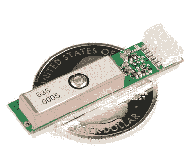
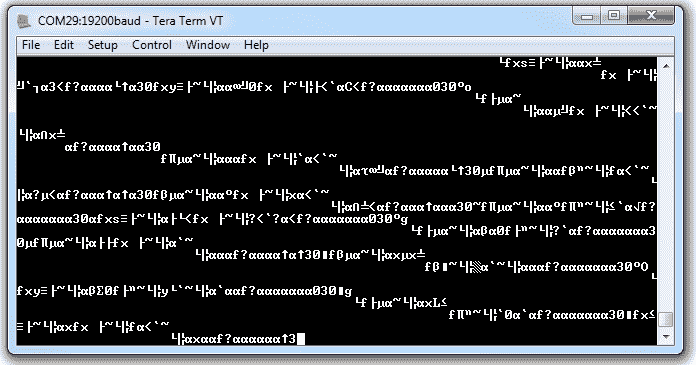

# GPS 基础知识

> 原文：<https://learn.sparkfun.com/tutorials/gps-basics>

## 全球定位系统的基础

你可能已经使用或受益于 GPS 接收机。它们存在于大多数智能手机和许多新汽车中，并被用于跟踪全球的商业活动。这些微小的设备可以立即给出你的准确位置和时间，几乎在地球上的任何地方，而且是免费的！你所需要的只是一个全球定位系统接收器，而且接收器越来越便宜，越来越小。

[](https://www.sparkfun.com/products/11571)*A common GPS receiver or GPS module.*

不要认为这些微小、廉价的模块是理所当然的。有几十年的工程技术可以随时随地给你准确的位置。自 70 年代末以来，已经发射了数十颗 GPS 卫星，它们都包含极其精确的原子钟，并且发射一直持续到今天。卫星通过专用的射频频率不断向地球发送数据。我们的口袋大小的 GPS 接收器有微型处理器和天线，直接接收卫星发送的数据，并在飞行中计算你的位置和时间。简直太神奇了。

### 推荐阅读

本教程建立在一些概念之上，您可能需要在开始之前了解或准备这些概念:

[](https://learn.sparkfun.com/tutorials/serial-communication) [### 串行通信](https://learn.sparkfun.com/tutorials/serial-communication) Asynchronous serial communication concepts: packets, signal levels, baud rates, UARTs and more 100[](https://learn.sparkfun.com/tutorials/connector-basics) [### 连接器基础](https://learn.sparkfun.com/tutorials/connector-basics) Connectors are a major source of confusion for people just beginning electronics. The number of different options, terms, and names of connectors can make selecting one, or finding the one you need, daunting. This article will help you get a jump on the world of connectors.[Favorited Favorite](# "Add to favorites") 62[](https://learn.sparkfun.com/tutorials/binary) [### 二进制的](https://learn.sparkfun.com/tutorials/binary) Binary is the numeral system of electronics and programming...so it must be important to learn. But, what is binary? How does it translate to other numeral systems like decimal?[Favorited Favorite](# "Add to favorites") 51[](https://learn.sparkfun.com/tutorials/logic-levels) [### 逻辑电平](https://learn.sparkfun.com/tutorials/logic-levels) Learn the difference between 3.3V and 5V devices and logic levels.[Favorited Favorite](# "Add to favorites") 82[](https://learn.sparkfun.com/tutorials/terminal-basics) [### 串行终端基础知识](https://learn.sparkfun.com/tutorials/terminal-basics) This tutorial will show you how to communicate with your serial devices using a variety of terminal emulator applications.[Favorited Favorite](# "Add to favorites") 46

### 建议观看

[https://www.youtube.com/embed/6m0xGwkYYy0/?autohide=1&border=0&wmode=opaque&enablejsapi=1](https://www.youtube.com/embed/6m0xGwkYYy0/?autohide=1&border=0&wmode=opaque&enablejsapi=1)

## GPS 是如何工作的？

GPS 接收器使用卫星和地面站的星座来计算地球上几乎任何地方的位置和时间。

*Notice the moving point on the globe and the number of visible satellites.*

在任何时候，至少有 24 颗活跃的卫星在地球上空 12，000 英里的轨道上运行。卫星的位置是以这样一种方式构建的，即你所在位置上方的天空最多包含 12 颗卫星。12 颗可见卫星的主要目的是通过无线电频率(范围从 1.1 到 1.5 GHz)将*信息传输回地球。有了这些信息和一些数学知识，一个基于地面的*接收器*或 GPS 模块可以计算出它的位置和时间。*

### GPS 接收器如何计算其位置和时间？

从每颗卫星发送到地球的数据包含一些不同的信息，这些信息可以让你的 GPS 接收机精确地计算出它的位置和时间。每颗 GPS 卫星上的一个重要设备是一个极其精确的原子钟。原子钟上的时间连同卫星的轨道位置和到达天空不同点的时间一起被发送到地球。换句话说，GPS 模块从每个可见卫星接收时间戳，以及每个卫星在天空中的位置数据(以及其他数据)。从这些信息中，GPS 接收器现在知道了到视野中每个卫星的距离。**如果 GPS 接收机的天线能看到至少 4 颗卫星，就能准确计算出自己的位置和时间。**这也被称为[锁或固定](http://learn.sparkfun.com/tutorials/gps-basics/gps-glossary)。

你全都明白了吗？如果没有，或者如果你想知道更多，请查看丹·多伯斯坦的《全球定位系统基础知识 第一卷中更详细的解释。第一卷已经免费发布，但是你必须支持作者阅读第二卷。

*An artist's rendition of the control segment.*

全球定位系统还有一部分我们没有谈到。除了卫星和 GPS 接收器，还有可以与卫星网络和一些 GPS 接收器通信的地面站。这个系统的正式名称是控制部分，它可以提高 GPS 接收机的精度。使用控制段提高精度的常见系统有 [WAAS](http://www8.garmin.com/aboutGPS/waas.html) 和 [DGPS](http://en.wikipedia.org/wiki/Differential_GPS) 。WAAS 在大多数 GPS 接收机上是常见的，并且将精度提高到大约 5 米。DGPS 需要一种特殊类型的 GPS 接收器，并获得厘米级的精度。DGPS 单元也很昂贵，并且往往更大，因为它们需要额外的天线。

## GPS 精度

GPS 精度取决于许多变量，最显著的是信噪比(噪声接收)、卫星位置、天气和障碍物，如建筑物和山脉。这些因素会在你感知的位置上产生误差。信号噪声通常会产生大约 1 到 10 米的误差。山脉、建筑物和其他可能阻碍接收器和卫星之间路径的东西会导致三倍于信号噪声的误差。GPS 接收器必须能够锁定 4 颗卫星才能确定位置。它得到的第一个锁允许接收器获得[历书](http://gps.about.com/od/glossary/g/GPS_Almanac.htm)信息，从而知道它应该监听哪些其他卫星。虽然有可能从少于 4 颗卫星获得位置，但是该位置的误差幅度可能相当大。当你能清楚地看到远离任何障碍物的晴朗天空，并且在四颗以上的卫星下时，你能最准确地读出你的位置。为了克服这些错误，创建了几个不同的助手。

### 辅助 GPS

这些辅助设备之一是[辅助 GPS](http://en.wikipedia.org/wiki/Assisted_GPS) 或 AGPS。当 GPS 信号很弱或无法接收时，这种方法使用无线(地面)网络来帮助卫星和接收器之间的中继。AGPS 可以从两个方面提供帮助。第一是向接收器提供适当的历书数据和精确的时间。第二种方法利用地面基站更高的计算能力和良好的卫星信号来解释接收器正在接收的破碎或片段化的信息，以向接收器提供更准确的位置读数。AGPS 主要是通过安装在蜂窝塔上的 GPS 接收器来完成的。当与这些接收器通信时，GPS 可以更快地锁定卫星，并接收更准确的信息。这种方法被用于移动电话中的 GPS，也是为什么它们有时比 GPS 接收器本身更精确。但是 AGPS 出现在[的设备不仅仅是手机；它甚至可以在相机和一些车辆上使用。在 GPS 信号可能难以穿过密集的建筑物迷宫的城市中，这是最有益的。](http://en.wikipedia.org/wiki/List_of_devices_with_Assisted_GPS)

### 差分 GPS

另一种方法是[差分 GPS](http://en.wikipedia.org/wiki/Differential_GPS) 或 DGPS。DGPS 也使用地面或固定 GPS 站来确定位置，但不同之处在于它发现了卫星和地面位置读数之间的差异。这些地面站可能距离接收机 200 海里，需要注意的是，离地面站越远，精度越差。DGPS 是由地面站广播一个信号来完成的，该信号指示实际的[伪距](http://en.wikipedia.org/wiki/Pseudorange)和测量的伪距之间的误差。这个值的计算方法是将光速乘以信号从卫星传播到接收器所需的时间。例如，DGPS 的一种形式是[广域增强系统](http://en.wikipedia.org/wiki/WAAS)或 WAAS。

[](https://cdn.sparkfun.com/assets/6/c/9/1/a/52af5b6c757b7f28528b4573.GIF)*(Image Courtesy of ASMA)*

最初由美国联邦航空局开发，用于帮助飞机 GPS，WAAS 使用专门建造的地面站系统。WAAS 有一套地面站测量必须满足的特定精度标准。横向和纵向，WAAS 必须在 95%的时间内精确到 7.6 米以内。这些地面站将测量结果发送到主站，主站每 5 秒或更快地将校正值发送到 WAAS 卫星。从卫星上，一个信号被广播回地球上的接收器，在那里校正被用来提高 GPS 的精度。在某些位置，WAAS 能够提供横向 1 米和纵向 1.5 米的精度。虽然 WAAS 只出现在北美，但类似的系统在世界其他许多地方都有。

**Note:** Looking for other techniques to increase your accuracy? Check out the [tutorial on GPS RTK](https://learn.sparkfun.com/tutorials/what-is-gps-rtk).

[](https://learn.sparkfun.com/tutorials/what-is-gps-rtk) [### 什么是 GPS RTK？

#### 2018 年 9 月 14 日](https://learn.sparkfun.com/tutorials/what-is-gps-rtk) Learn about the latest generation of GPS and GNSS receivers to get 14mm positional accuracy 9

## 消息格式

GPS 数据通过[串行接口](https://learn.sparkfun.com/tutorials/serial-communication)以不同的信息格式显示。有标准和非标准(专有)消息格式。几乎所有的 GPS 接收器都输出 [NMEA](http://en.wikipedia.org/wiki/NMEA_0183) 的数据。NMEA 标准被格式化成称为句子的数据行。每个句子包含以逗号分隔格式组织的各种数据位(即由逗号分隔的数据)。下面是 NMEA 从一个带卫星[锁定](http://learn.sparkfun.com/tutorials/gps-basics/gps-glossary) (4+卫星，精确位置)的 GPS 接收器发出的句子:

```
language:bash
$GPRMC,235316.000,A,4003.9040,N,10512.5792,W,0.09,144.75,141112,,*19
$GPGGA,235317.000,4003.9039,N,10512.5793,W,1,08,1.6,1577.9,M,-20.7,M,,0000*5F
$GPGSA,A,3,22,18,21,06,03,09,24,15,,,,,2.5,1.6,1.9*3E 
```

例如， **GPGGA** 语句包含以下内容:

*   **时间** : 235317.000 是格林威治标准时间的 23 点 53 分 17.000 秒
*   **经度** : 4003.9040，N 是以度为单位的纬度，十进制分，北
*   **纬度** : 10512.5792，W 是经度，以度为单位，十进制分，西经
*   **看到的卫星数量** : 08
*   **海拔** : 1577 米

数据用逗号分隔，以便于计算机和微控制器阅读和解析。该数据以称为[更新速率](http://learn.sparkfun.com/tutorials/gps-basics/gps-glossary)的间隔在串行端口上发出。大多数接收器每秒更新一次信息(1Hz)，但更先进的接收器每秒能够更新多次。现代接收机可以达到 5 到 20Hz。

## 读取 GPS 数据

大多数 GPS 模块都有一个[串行端口](https://learn.sparkfun.com/tutorials/serial-communication)，这使得它们非常适合连接到微控制器或计算机。

### 连接到微控制器

[](https://cdn.sparkfun.com/assets/learn_tutorials/9/GPS_Breakout.png)*[EM-506 GPS](https://www.sparkfun.com/products/12751) and [GP-735 GPS](https://www.sparkfun.com/products/13670) with [GPS Breakout](https://www.sparkfun.com/products/11818)*

一旦 GPS 模块通电，即使没有锁定，NMEA 数据(或另一种消息格式)也会以特定的[波特率](http://learn.sparkfun.com/tutorials/serial-communication/rules-of-serial#baud)和[更新速率](http://learn.sparkfun.com/tutorials/gps-basics/gps-glossary)从串行发送引脚(TX)发送出去。要让微控制器读取 NMEA 数据，只需将 GPS 的 TX 引脚连接到微控制器的 RX(接收)引脚。为了[配置](http://learn.sparkfun.com/tutorials/gps-basics/configuring-a-gps-receiver)GPS 模块，您还需要将 GPS 的 RX 引脚连接到微控制器的 TX 引脚。

微控制器解析 NMEA 数据是很常见的。解析就是从 NMEA 语句中删除大块的数据，这样微控制器就可以对这些数据做一些有用的事情。

例如，微控制器可能只需要读取 GPS 的高度。

```
language:bash
$GPGGA,235317.000,4003.9039,N,10512.5793,W,1,08,1.6,1577.9,M,-20.7,M,,0000*5F 
```

微控制器可以解析 GPGGA 语句，最终只得到海拔高度(以米为单位)，而不是处理所有这些文本。

```
language:bash
1577 
```

一旦微控制器可以获取所需的数据，就可以操纵这些信息在微控制器上创建其他交互。

Arduino 平台可以在 T2 微型 GPS 库的帮助下轻松解析 NMEA 数据。查看 [GPS Shield 入门指南](https://learn.sparkfun.com/tutorials/gps-shield-hookup-guide)，了解如何将 Arduino 连接到 GPS 模块并解析 NMEA 语句的示例。

### 连接到计算机

直接查看 NMEA 数据的一个简单方法是将 GPS 模块连接到计算机上。对于连接，只需用 FTDI basic 为 GPS 供电(本例中为 5V 和 GND)，然后将 GPS 的 TX 引脚连接到 FTDI Basic 上的 RX 引脚。

[](https://cdn.sparkfun.com/assets/learn_tutorials/9/GPS_FTDI.png)*[EM-506 GPS](https://www.sparkfun.com/products/12751) - [GPS Breakout](https://www.sparkfun.com/products/11818) - [5V FTDI Breakout](https://www.sparkfun.com/products/9716)**[GP-735 GPS](https://www.sparkfun.com/products/13670) - [GPS Breakout](https://www.sparkfun.com/products/11818) - [5V FTDI Breakout](https://www.sparkfun.com/products/9716)*

接下来，以与您的 GPS 模块相同的波特率打开一个[串行终端程序](https://learn.sparkfun.com/tutorials/terminal-basics)。即使全球定位系统没有锁定*而不是*，你也会看到 NMEA 的句子蒸蒸日上。

```
language:bash
$GPRMC,235316.000,A,4003.9040,N,10512.5792,W,0.09,144.75,141112,,*19
$GPGGA,235317.000,4003.9039,N,10512.5793,W,1,08,1.6,1577.9,M,-20.7,M,,0000*5F
$GPGSA,A,3,22,18,21,06,03,09,24,15,,,,,2.5,1.6,1.9*3E 
```

## 配置 GPS 接收器

要配置 GPS 接收器，了解您的 GPS 正在使用的[芯片组](http://learn.sparkfun.com/tutorials/gps-basics/gps-glossary)的类型非常重要。GPS 芯片组包含一个强大的处理器，负责用户界面、所有计算以及天线的模拟电路。芯片组还允许将数据发送到 GPS 接收器，以配置更新速率、波特率、句子选择等参数。

为了通过[串行接口](http://learn.sparkfun.com/tutorials/serial-communication)向 GPS 接收器发送命令，你需要一个命令集或参考手册。在深入研究给定模块的命令集之前，一定要向供应商核实一下。许多芯片组供应商提供的软件允许您通过串行端口轻松地通信和配置 GPS 模块。

以下是一些常见芯片组的数据表和命令集。

*   SiRF 芯片组
    *   [SiRF NMEA 参考手册](https://cdn.sparkfun.com/datasheets/Sensors/GPS/NMEA%20Reference%20Manual1.pdf)
    *   [SiRF 二进制参考手册](https://cdn.sparkfun.com/datasheets/Sensors/GPS/SiRF_Binary_Protocol.pdf)
    *   [SiRF 演示软件](https://cdn.sparkfun.com/datasheets/Sensors/GPS/setupSiRFDemo3.87.zip)
*   U-Blox 芯片组
    *   [u-blox6 NMEA 和 UBX 参考手册](http://cdn.sparkfun.com/datasheets/Sensors/GPS/760.pdf)
    *   [u-center 演示软件](https://cdn.sparkfun.com/datasheets/Sensors/GPS/u-centerSetup-7.0.2.1.zip)
*   SkyTraq 芯片组
    *   [Skytraq 参考手册](http://cdn.sparkfun.com/datasheets/Sensors/GPS/AN0003_v1.4.19.pdf)
    *   [SkyTraq 演示软件](http://cdn.sparkfun.com/datasheets/Sensors/GPS/GPS%20Viewer%20-%20Customer%20Release.exe)

一些芯片组允许替代协议，如 SiRF 二进制(SiRF 芯片组)、UBX (ublox 芯片组)或专有消息。这些协议包含相同的信息，但使用二进制(而不是 ASCII)进行通信，以获得更快的通信速度。

当与 GPS 接收器通信时，大多数命令需要通过校验和来终止。在大多数情况下，你需要对你的每个句子进行异或运算。下面是一个简单的 [XOR 在线计算器](http://www.hhhh.org/wiml/proj/nmeaxor.html)。


## 准备好动手操作 GPS 了吗？

我们为您准备了一个页面！我们将带您了解 GPS 的基本工作原理、所需的硬件以及项目教程，帮助您入门。

带我去那里！

## GPS 词汇表

*   **精度**-GPS 的精度有多高？嗯，可能会有一点不同，但你通常可以在 30 秒内找到你在哪里，在世界上的任何地方，误差在+/-5 米之内。太神奇了！+/–的存在是因为精确度可能因模块、一天中的时间、接收的清晰度等而异。大多数模块在启用 WAAS 的情况下可以达到+/-3 米，但如果你需要亚米或厘米级的精度，它会变得非常昂贵，并需要一种名为 DGPS 的东西。

    总的来说，要获得 GPS 的最佳精度，你必须处于天空和移动的清晰视野中。

    [](//cdn.sparkfun.com/assets/a/6/f/4/d/50edf68dce395fbe05000000.jpg)*Logged and plotted GPS waypoints around the old SparkFun headquarters. Each track represents a different type of GPS module.*

    如果你注意到 SparkFun 大楼周围的示例轨道，GPS 位置会在“锁定开始”和“锁定结束”来回跳动。这是 GPS 模块不移动的时候。GPS 有一些误差(大约 5 米)，你可以在不动的时候看到它。一旦模块开始移动，轨迹就相对准确，GPS 就能‘猜测’你的轨迹。然而，请注意，在通往位于两座高楼之间的[城市峡谷](http://learn.sparkfun.com/tutorials/gps-basics/gps-glossary)的道路上，准确性可能会受到影响。记住，全球定位系统信号是从不一定在你头上的卫星上发射的；有些可以接近地平线。此外，射频信号可能会被建筑物/物体反射，产生所谓的[多径干扰](http://en.wikipedia.org/wiki/Multipath_interference)。请记住，全球定位系统在看到天空全景时效果最好。

*   **天线**——记住，那个小小的 GPS 模块正在接收来自大约 12000 英里以外的卫星的信号，不仅在你的头顶，而且在天空的任何地方。为了获得最佳性能，您需要在天线和大部分天空之间有一条清晰的路径。天气，云，暴风雪，不应该影响信号，但树木，建筑物，山脉，你头上的屋顶，都会产生不必要的干扰，你的 GPS 精度将受到影响。

    有许多天线可供选择，但以下是一些最常见的天线。

    [](https://www.sparkfun.com/products/10890)*The smallest and most common form of antenna is the ceramic patch antenna.*

    这种天线外形小巧、便宜、紧凑，但与其他类型的天线相比，其接收信号较低。该天线需要面朝上，能够清楚地看到天空，以获得良好的信号，即天线朝上时的[增益](http://learn.sparkfun.com/tutorials/gps-basics/gps-glossary)最大。

    [](//cdn.sparkfun.com/assets/6/3/7/5/f/50f8899fce395f1b3f000000.jpg)*Some GPS modules use helical antennas.*

    这种天线比陶瓷贴片占用更多的空间，但天线的形状允许在任何方向上有更好的信号，代价是在任何一个特定方向上的增益稍低。

    [](https://www.sparkfun.com/products/10920)[](//cdn.sparkfun.com/assets/6/f/a/d/5/50f98486ce395ff35f000002.jpg)*Some modules can be used with a SMA antenna attachment.*

    SMA 附件使您能够将天线安装在与主电路不同的位置。如果你的主系统不能很好地观察天空，这可能是有益的。例如，在建筑物内部或在汽车中。

*   **波特率** - GPS 接收器以特定的比特率从发送引脚(TX)发送串行数据。最常见的是 1Hz 接收机的 9600bps，但 57600bps 越来越常见。更多信息请查看接收器的数据手册。

*   **通道**-GPS 模块运行的通道数量将影响您首次定位的时间(TTFF)。由于该模块不知道哪些卫星在视野内，它一次可以检查的频率/频道越多，找到定位的速度就越快。在模块获得锁定或修复后，一些模块将关闭额外的通道块以节省功率。如果你不介意为锁定多等一会儿，12 或 14 个通道将很好地工作。

*   **芯片组**-GPS 芯片组负责从执行计算、为天线提供模拟电路、电源控制到用户界面的所有工作。工作量很大，但这正是这些微型 GPS 单元正在做的事情。芯片组与天线类型无关，因此您可以为带有特定芯片组的 GPS 模块配备一系列不同的天线。常见的芯片组有 ublox、SiRF 和 SkyTraq，它们都包含非常强大的处理器，能够实现快速采集和高可靠性。芯片组之间的差异通常取决于功耗、采集时间和硬件可访问性之间的平衡。

*   [](http://en.wikipedia.org/wiki/DGPS)**-差分 GPS 或 DGPS 是一种特定类型的 GPS 接收机。DGPS 接收机有额外的天线，不仅能接收卫星信号，还能直接接收地面站的信号。DGPS 设备通常需要两根天线。这些比你的标准 GPS 设备大得多，也贵得多，但是可以提供厘米级的定位精度。**

***   **增益** -增益是天线在任何给定方向的效率。这适用于发射天线和接收天线。

    *   **锁定或固定** -当 GPS 接收器锁定或固定时，至少有 4 颗卫星处于良好的视野中，您可以获得准确的位置和时间。

    *   [](http://en.wikipedia.org/wiki/NMEA_0183)**-这是大多数 GPS 模块使用的通用数据格式。NMEA 数据以句子形式显示，并从 GPS 模块串行发射(TX)引脚发送出去。NMEA 句子包含了所有有用的数据，(位置，时间等等。).**

    ***   能量 - GPS 模块并不耗电，但它们需要一些能量来处理来自卫星的数据并获得锁定。平均而言，一个带锁的普通 GPS 模块在 3.3V 时消耗约 30mA。此外，将[启动时间](http://learn.sparkfun.com/tutorials/gps-basics/gps-glossary)保持为低，可以节省电力。

    *   **PPS** -每秒脉冲数。这是某些 GPS 模块上的输出引脚。通常，当此引脚每秒切换一次时，您可以将系统时钟与 GPS 时钟同步。

    *   **启动时间(热、温、冷)** -一些 GPS 模块有一个超级电容器或备用电池，以便在断电后将以前的卫星数据保存在易失性存储器中。这有助于降低后续上电时的 TTFF。此外，更快的启动时间意味着更少的总功耗。

    *   **冷启动** -如果长时间关闭模块电源，备份电容消失，数据将会丢失。在下一次加电时，GPS 将需要下载新的历书和星历数据。

    *   **热启动** -取决于你的备用电源持续多长时间，你可以热启动，这意味着一些历书和星历数据被保留，但它可能需要一点额外的时间来获得锁定。

    *   **热启动**:热启动意味着所有卫星都是最新的，并且接近于它们在先前通电状态下的相同位置。通过热启动，GPS 可以立即锁定。

        *   [](http://en.wikipedia.org/wiki/Trilateration)**-利用多个参考点计算位置的数学方法。为了让 GPS 接收器计算准确的位置和时间，它需要在天空中至少 4 颗卫星的良好视野中。这被称为 GPS 锁定或定位。我们都知道如何使用三角测量来计算使用两个参考点(x，y)到一个对象的距离。然而，使用 GPS，我们需要确定 4 个值，即纬度、经度、海拔和时间。**

    ***   **TTFF**——第一次修正的时间。开机后，使用至少 4 颗卫星精确计算您的位置和时间所需的时间。如果你在一个天空视野不好的地方，TTFF 可能会很长。

    *   **更新速率**-GPS 模块的更新速率是它计算和报告其位置的频率。大多数设备的标准是 1Hz(每秒一次)。[无人机](http://en.wikipedia.org/wiki/UAV)和其他快速交通工具可能需要增加更新率。5 甚至 10Hz 的更新速率在低成本模块中变得可用。请记住，更高的更新率意味着有更多的 NMEA 句子飞出模块。

    *   [](http://en.wikipedia.org/wiki/Wide_Area_Augmentation_System)**——WAAS，或称广域增强系统，是一个地面基站网络(位于北美)，它将校正数据传回卫星。WAAS 的定位精度接近 5 米。其他国家也有类似的系统，比如欧洲的系统叫 [EGNOS](http://en.wikipedia.org/wiki/Egnos) ，日本的系统叫 [MSAS](http://en.wikipedia.org/wiki/Multi-functional_Satellite_Augmentation_System) ，印度有 [GAGAN](http://en.wikipedia.org/wiki/GAGAN) 。大多数 GPS 接收机默认启用 WAAS，并支持 EGNOS、MSAS 和 GAGAN。******** 

 ******## 解决纷争

### 锁定问题

米卡勒·哈特的 [TinyGPS++库](http://arduiniana.org/libraries/tinygpsplus/)非常适合让你快速使用 GPS。然而，如果你在城市峡谷之间，在混凝土建筑内，或者在所有无线信号都无法到达/来自外部世界的黑暗深渊中，情况可能就不一样了。我们发现的问题是，当 GPS 在室内使用时，在 SparkFun 大楼的情况下，很难获得 GPS 锁定。我们有许多混凝土、金属大梁和一个大型太阳能电池板，它对 GPS 信号造成了严重破坏(几乎所有的手机运营商都是如此)。

[https://www.google.com/maps/embed?pb=!1m14!1m8!1m3!1d844.5521908536164!2d-105.185107!3d40.090779000000005!3m2!1i1024!2i768!4f13.1!3m3!1m2!1s0x876bf04331a2646b%3A0xdb4c46ec940e31c!2zNDDCsDA1JzI2LjAiTiAxMDXCsDExJzA1LjQiVw!5e1!3m2!1sen!2sus!4v1553585973705](https://www.google.com/maps/embed?pb=!1m14!1m8!1m3!1d844.5521908536164!2d-105.185107!3d40.090779000000005!3m2!1i1024!2i768!4f13.1!3m3!1m2!1s0x876bf04331a2646b%3A0xdb4c46ec940e31c!2zNDDCsDA1JzI2LjAiTiAxMDXCsDExJzA1LjQiVw!5e1!3m2!1sen!2sus!4v1553585973705)

*Google map of our roof.*

如果您在使用库时遇到查看 GPS 数据的问题或输出不完整，您可能需要移动到不同的位置来查看更多卫星。有时将 GPS 模块移动几步到不同的位置或建筑物的周边会有所帮助。要检查可见卫星的数量，您可以观察 GPGAA 语句的第 6 和第 7 个字段[,看看您是否有任何锁定问题。以下是 GPS 模块没有卫星锁时的 GPGGA 句子示例。如您所见，输出表明数据是无效的，因为没有 GPS 定位，也没有可见的卫星。](http://aprs.gids.nl/nmea/#gga)

```
language:bash
$GPGGA,105317.709,8960.0000,N,00000.0000,E,0,0,,137.0,M,13.0,M,,*4C 
```

### 波特率不匹配

如果您正在从 GPS 模块的串行 UART 向您的[串行监视器](https://learn.sparkfun.com/tutorials/terminal-basics/serial-terminal-overview)传送数据，并且您所看到的是“垃圾”,如下图所示，请检查以确保波特率设置正确。根据 GPS 模块的不同，波特率会有所不同。请务必查看 GPS 模块的数据表，以确保波特率相同。

[](https://cdn.sparkfun.com/assets/c/e/2/d/a/50d247c5ce395fdc6b000000.png)

*Baud rate mismatch (aka garbage) as described in this [Common Pitfalls](https://learn.sparkfun.com/tutorials/serial-communication#common-pitfalls) section.*

## 资源和更进一步

现在，您应该对 GPS 设备的工作原理以及如何将其应用到您的下一个项目中有了清晰的了解。更多伟大的项目想法，请查看这些其他 SparkFun 教程。

[](https://learn.sparkfun.com/tutorials/gyroscope) [### 陀螺仪](https://learn.sparkfun.com/tutorials/gyroscope) Gyroscopes measure the speed of rotation around an axis and are an essential part in determines ones orientation in space.[Favorited Favorite](# "Add to favorites") 22[](https://learn.sparkfun.com/tutorials/how-to-power-a-project) [### 如何为项目提供动力](https://learn.sparkfun.com/tutorials/how-to-power-a-project) A tutorial to help figure out the power requirements of your project.[Favorited Favorite](# "Add to favorites") 67[](https://learn.sparkfun.com/tutorials/how-to-use-a-breadboard) [### 如何使用试验板](https://learn.sparkfun.com/tutorials/how-to-use-a-breadboard) Welcome to the wonderful world of breadboards. Here we will learn what a breadboard is and how to use one to build your very first circuit.[Favorited Favorite](# "Add to favorites") 79[](https://learn.sparkfun.com/tutorials/accelerometer-basics) [### 加速度计基础知识](https://learn.sparkfun.com/tutorials/accelerometer-basics) A quick introduction to accelerometers, how they work, and why they're used.[Favorited Favorite](# "Add to favorites") 29[](https://learn.sparkfun.com/tutorials/electric-power) [### 电力](https://learn.sparkfun.com/tutorials/electric-power) An overview of electric power, the rate of energy transfer. We'll talk definition of power, watts, equations, and power ratings. 1.21 gigawatts of tutorial fun 54

你的下一个项目需要一些灵感吗？查看一些相关教程:

[](https://learn.sparkfun.com/tutorials/copernicus-ii-hookup-guide) [### 哥白尼 II 连接指南](https://learn.sparkfun.com/tutorials/copernicus-ii-hookup-guide) A guide for how to get started with the Copernicus II GPS module.[Favorited Favorite](# "Add to favorites") 2[](https://learn.sparkfun.com/tutorials/basic-autonomous-kit-for-sphero-rvr-assembly-guide) [### Sphero RVR 装配指南的基本自主套件](https://learn.sparkfun.com/tutorials/basic-autonomous-kit-for-sphero-rvr-assembly-guide) Get your Basic Autonomous Kit for Sphero RVR all hooked up with this guide 1[](https://learn.sparkfun.com/tutorials/micromod-update-tool-hookup-guide) [### MicroMod 更新工具连接指南](https://learn.sparkfun.com/tutorials/micromod-update-tool-hookup-guide) Follow this guide to learn how to use the MicroMod Update Tool to interact directly with the UART on the MicroMod Asset Tracker's SARA-R5\. Using this board you can talk directly to the module using u-blox's m-center software as well as update the firmware using EasyFlash.[Favorited Favorite](# "Add to favorites") 0[](https://learn.sparkfun.com/tutorials/sparkfun-rtk-express-hookup-guide) [### SparkFun RTK 快速连接指南](https://learn.sparkfun.com/tutorials/sparkfun-rtk-express-hookup-guide) Learn how to use the enclosed RTK Express product to achieve millimeter level geospatial coordinates.[Favorited Favorite](# "Add to favorites") 2

或者看看这些博客帖子。

[](https://www.sparkfun.com/news/1023 "December 27, 2012: Check out my intro to Python tutorial and GPS tracking program. ") [### Python 和 GPS 追踪教程

December 27, 2012](https://www.sparkfun.com/news/1023 "December 27, 2012: Check out my intro to Python tutorial and GPS tracking program. ")[Favorited Favorite](# "Add to favorites") 3[](https://www.sparkfun.com/news/1099 "March 28, 2013: I'm going to Chernobyl, and I'm taking a GPS/Radiation logger that I built with me.") [### 切尔诺贝利和雷格尔号

March 28, 2013](https://www.sparkfun.com/news/1099 "March 28, 2013: I'm going to Chernobyl, and I'm taking a GPS/Radiation logger that I built with me.")[Favorited Favorite](# "Add to favorites") 0[](https://www.sparkfun.com/news/1862 "June 24, 2015: Join us for the next episode, with special guest appearance by the Hackster DeLorean!") [### SparkFun Live: GPS 速度计

June 24, 2015](https://www.sparkfun.com/news/1862 "June 24, 2015: Join us for the next episode, with special guest appearance by the Hackster DeLorean!")[Favorited Favorite](# "Add to favorites") 0[](https://www.sparkfun.com/news/2442 "July 31, 2017: Let's gaze upward and look at how some of those nifty satellites can give us position data.") [### 科学探险:全球定位系统如何工作

July 31, 2017](https://www.sparkfun.com/news/2442 "July 31, 2017: Let's gaze upward and look at how some of those nifty satellites can give us position data.")[Favorited Favorite](# "Add to favorites") 4[](https://www.sparkfun.com/news/2977 "August 6, 2019: GPS has been getting updates not just 20,000 km overhead, but here on Earth, as well.") [### 我到底在哪里？SparkFun 全球定位系统模块指南

August 6, 2019](https://www.sparkfun.com/news/2977 "August 6, 2019: GPS has been getting updates not just 20,000 km overhead, but here on Earth, as well.")[Favorited Favorite](# "Add to favorites") 2

&nbsp


&nbsp******