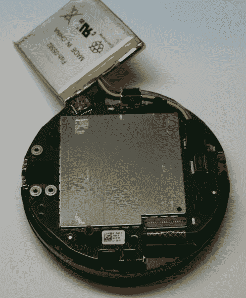
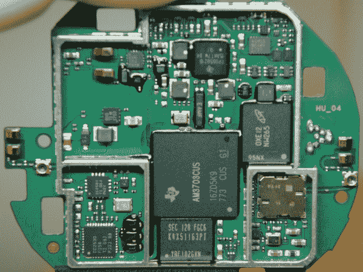
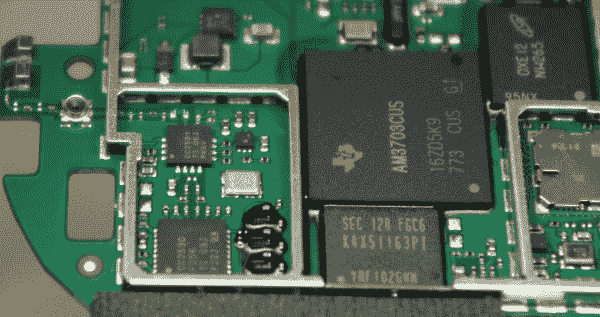

# 嵌套恒温器拆卸

> 原文：<https://learn.sparkfun.com/tutorials/nest-thermostat-teardown->

## 介绍

不久前，我读到了关于 Nest T1 的报道，这是一款新颖的恒温器，有彩色显示屏和一些有趣的“学习”技术，可以尽可能合理地让你的家保持温暖或凉爽。我有没有提到野兽有红外接近，红外运动，湿度，万磁王卷轴，和一个迷你 USB 连接器？哦。确实如此。

这是很棒的，但这是有代价的。预购是 249 美元+运费，但我是一个新技术的吸盘，所以我排队。在我下预购订单几周后，我收到了一封来自 Nest 的垃圾邮件，提供免费的专业安装。那太好了，但是我并不打算让我的巢重见天日——我想把它拆开，看看它是如何工作的。于是我突发奇想，回复了邮件:

*嗨马特，*

这个提议是个好主意！作为客户，我非常感激，但我不需要安装，谢谢！我迫不及待地想找到我的小窝，在里面乱逛。根据里面的内容，它可能值得在主页上发布。你介意吗？

*来自你在 SparkFun 的朋友，**-内森*

令我感到惊讶和荣幸的是，我收到了马特的回复:

内森，谢谢你的提醒！我自己也是 SparkFun 的常客。随意挖，戳，贴！-马特创始人兼工程副总裁

不会吧！工程创始人/VP 回应？！谢谢马特！你知道 SparkFun 吗？非常酷。我们甚至得到了一个半绿色的灯来张贴眼泪。这是一个令人耳目一新的区别，不同于我们过去发邮件给的其他一些公司。感恩节后不久，当我收到这个鸟巢时，我开始着手把它撕碎。

* *披露时间:* *我们没有免费得到 Nest。这次拆卸纯粹是内特深夜订购东西的结果，而他可能不应该这么做。

在拆开鸟巢然后重新组装后，它实际上继续发挥作用(对我来说是第一次！).这件事给我留下了深刻的印象，以至于我熬夜到很晚才记录下来。对于 Nest 的硬件设计、网站设计、用户界面设计，我只有非常积极的话要说。很光滑。非常圆滑。谈到消费电子产品，我认为自己是个业余爱好者，所以对这篇评论要有所保留。但是哇-我在写这个教程的时候刚刚关掉了我的暖气！欢迎来到未来。

## 打开它

该设备的包装相当于或高于人们对 250 美元的预期——我甚至得到了一个 Nest 品牌的螺丝刀。干净利落。但我们现在不是在这里进行包装审查，对吗？

这是前不久遇到一个十字螺丝刀的业务结束巢。我提到过他们有自己的拆卸工具吗？他们得到了+1。

摄像机正在播放玻璃和光圈的滑稽倒影。在这里，我们可以看到红外发光二极管和传感器暴露在外。

背面。如果你读过我的其他教程，这个迷你 USB 连接器完全令人惊讶！感谢 Nest 包含外部连接器。我今天不想完全破解/重新编程/重新设计这个东西，我的目标只是展示内部硬件。但是让它变得容易插上电源，你就打开了通往美好事物的大门。

这东西有内部脂肪电池？真的吗？3.7V 以上 2.1 wh = 567 mah 左右电池。对于恒温器来说这是相当可观的。我的猜测是，当 WiFi 正在广播并且显示器打开时，该单元可能需要比 HVAC 布线所能提供的更多的功率。脂肪充当一个非常大的电容器。

这里我们在右边有主单元。在左下方，我们有房屋的第一层——实际上是附在墙上的部分。这包括用户可按按钮以及连接到室内布线的 8+连接器。当你把这个调温器接到墙上的板上时，有一个多针连接器通过第一层连接到主机。也就是说，第一层有大量裸露的金焊盘。我不完全确定他们在那里做什么，但我的第一印象是:这个东西的设计和制作非常好。丝带，连接器，电池和硬件都是非常高的质量。

嗨，鱼。一定是厂家？

近距离观察头部。注意来自电池的三条线:3.7V，GND，还有什么？电池上的温度传感器？LiPo 上的第三根线对于这样低电流的应用来说有点奇怪。

这里有些东西很酷。注意左下角的 IC。我不知道那是什么！当巢安装到墙壁上时，它面向墙壁。它不读取表盘，接近度，运动或任何我能理解的东西，但它是一个透明的环氧树脂封装的 IC，通常指示可见光谱或光(IR)感应-但为什么它指向墙壁？灰尘传感器？湿度？那鸿

此外，你会注意到三个十字螺钉固定住了 LiPo 南面的一块小板子。这就是 PIR。小子板通过螺丝(三个螺丝= VCC/GND/信号)供电和感应。我以前见过这种技术，但我不确定他们在这里用了什么。也许是因为三个螺丝比三个螺丝和一个 3 针连接器便宜。

这是拆下的 PIR。IC 读取 XLitos。用于检测房间内的运动。

看看这个。我以前在黑莓珍珠的轨迹球上见过这样的磁传感器。我们为[轨迹球突破](https://www.sparkfun.com/products/9320)使用了相同类型的传感器。我假设这两个传感器通过磁场读取表盘上的凹槽，但我可能是错的。我喜欢他们如何使用非常小的垂直板。这是一个了不起的设计，完全是为了一个恒温器！

附带的十字螺丝刀让我走了这么远，在这一点上，我不得不打破梅花钻头。

请注意左侧的高密度连接器。它就像一根小小的带状电缆中的 40 个针。如果您需要知道如何向上翻转连接器以释放功能区，请仔细查看。

在这里，我们可以看到主板覆盖在一个巨大的射频屏蔽(和我的拇指印)。只是在所有东西上扔一个金属屏蔽比冒 FCC 测试失败的风险更便宜吗？还要注意不是一个而是两个天线连接器。在板上看到外部 U.FL 连接器很奇怪。它们必须放在那里以便于测试？在连接器旁边，您应该会看到一些金色的夹子。这些实际上与嵌入单元表面的双柔性天线形成压缩接触。

虽然我未能在相机上捕捉到它们，但有两个垂直配置的柔性 PCB 天线。一根天线标有“Zigbee”字样。这激起了我的兴趣。我假设有两个天线来获得更好的接收，但也许一个天线是 Wifi，一个天线是其他东西？Zigbee？不会吧。真的吗？Nest 是否计划增加其他设备控制，如照明或制冷？在使用了 Nest 及其配套网站之后，我当然希望如此。

## 电子比特

移除射频屏蔽后，我们终于可以看到里面是什么了。

这就是我们所期待的。对于恒温器来说，这是一个天文数字的硅量！

这里有几张照片，以防有人想要 IC 标识符。

我还没查过任何 ICs。

但是他们应该在外面。

这是主板的背面。请注意，这完全被另一个 RF 屏蔽所掩盖。我觉得这很奇怪，因为除了去耦和另一个与 PCB 相连的匿名 IC 之外，这里什么都没有。Nest 真的相信会有那么多机械冲击和振动，以至于他们将每个 IC 都粘合到 PCB 上吗？！

这是内部正面的视图。你可以看到，他们用特有的 PIR 棱镜材料覆盖了面部较低的小孔。检查我们的[运动传感器](https://www.sparkfun.com/products/8630)进行比较。好的，现在后退一步，试着记住所有的螺丝、丝带和夹子都放在哪里。令人惊讶的是，该单元在几分钟内就组装好了——这是另一个令人难以置信的 DFM(为制造而设计)的标志。

## 把它放回原处

重新组装后，我插上了迷你 USB 电缆。在显示器上运行了一系列有趣的字符后，我得到了这条消息——“请将显示器连接到它的底座上”。Booo。

但是这个装置确实是一个大容量存储设备！

谁想把他们的恒温器当成 38MB 的 jumpdrive？我愿意。我愿意。

现在是时候实际布线的东西，我现有的暖通空调线路，并安装到墙上。这真的很简单直接。嗯，除了我懒得在旧的、大得多的恒温器所在的地方抹油漆。所以我只拍一些非常暗的照片，这样你就看不到我墙上的洞了:

*Shhh!*

配置该设备非常简单。通过表盘与设备连接是一个梦想。

*Oh geesh. Not you too!*

一旦连接上 Wifi，Nest 就需要升级。仔细观察左上方区域的粉红色圆点。我用手机拍了这张照片，这样你就可以看到红外发光二极管的触发。结果不太好，但透过手机摄像头看很有趣。

漂亮。

真正让我敲定这笔交易的是当我上网通过互联网连接到恒温器时。要激活远程控制的新恒温器，您必须创建一个 Nest.com 登录。创建我的新帐户是我做过的最基本也是最好的帐户创建！这就像提供电子邮件地址和密码一样简单。

接下来，网页告诉我它检测到附近有一个新的恒温器。酷！为了验证它是正确的，我需要走到我新安装的恒温器前，按下按钮，确认我的恒温器确实是尝试连接的那个。这很有意义——这是对惟一 id 的简单握手确认。然而，当我走下楼时，恒温器关闭了。当我走近它时，我无法向你描述当显示屏慢慢变得活跃起来，说“你想把这个恒温器连接到 nathan@sparkfun.com 吗？”时的感觉有多奇妙-为什么是的，是的，我会的。我知道这只是红外 prox 检测到我在附近，所以显示器启动了，但正是这些易于使用的步骤使这成为一个真正设计良好的产品。

综上所述，Nest 是一款 250 美元的恒温器。它可能不适合每个人，但对我来说，它非常容易使用，减轻了编程恒温器的噩梦。当我在路上的时候，我甚至可以通过调低温度来节省一些钱。不错的工作窝。

## 资源和更进一步

更多拆卸的好处，看看这些其他 SparkFun 拆卸:

*   [巢穴保护拆除](https://learn.sparkfun.com/tutorials/nest-protect-teardown)
*   [LEAP Motion 拆卸](https://learn.sparkfun.com/tutorials/leap-motion-teardown)
*   [谷歌眼镜拆卸(SFE 赞助)](http://www.catwig.com/google-glass-teardown/)