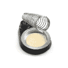
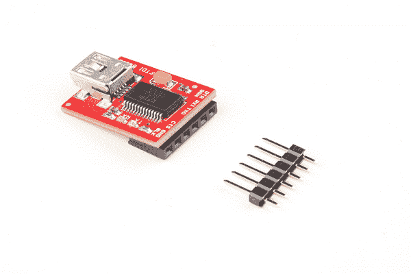

# 西蒙说实验

> 原文：<https://learn.sparkfun.com/tutorials/simon-says-experiments>

## 介绍

现在你已经成功地制作了一个[西蒙说板](https://www.sparkfun.com/products/10547)并彻底打动了你家里所有的朋友，是时候学习如何将你的西蒙说板变成你自己独特的项目了！！没错，你的“西蒙说”板能够做的不仅仅是玩“西蒙说”游戏。它可以被重新编程做你喜欢的任何事情。在本教程中，我们将:

*   设置您的硬件以上传代码。
*   在电脑上安装免费的 Arduino IDE 软件和 FTDI 驱动程序。
*   把一些示例代码放到你的西蒙说板上。
*   加个光电池，用迪斯科模式！！

在本教程的第四部分，我们将向您展示如何使用 Simon Says 板来检测光线。这个例子需要一个光电池、一个 10K 电阻和一个烙铁。但是，您仍然可以上传示例代码并收听 disco 模式(无需焊接光传感器)。

### 所需材料

在本教程中，我们将向您展示如何重新编程您的西蒙说板。我们将指导您安装软件和硬件。要做到这一点，你需要一台个人电脑或苹果电脑。假设您焊接了一个 Simon Says 板，我们将需要另外三个硬件将代码上传到微控制器:

 

将**添加到您的[购物车](https://www.sparkfun.com/cart)中！**

 **### [SparkFun FTDI 基本突破- 3.3V](https://www.sparkfun.com/products/9873)

[In stock](https://learn.sparkfun.com/static/bubbles/ "in stock") DEV-09873

这是我们[FTDI Basic](https://www . spark fun . com/products/retired/8772)的最新修订版。我们现在使用 SMD 6 针头…

$16.9566[Favorited Favorite](# "Add to favorites") 55[Wish List](# "Add to wish list")**** 

将**添加到您的[购物车](https://www.sparkfun.com/cart)中！**

 **### [破开头球——直击](https://www.sparkfun.com/products/116)

[In stock](https://learn.sparkfun.com/static/bubbles/ "in stock") PRT-00116

一排标题-打破适应。40 个引脚，可切割成任何尺寸。用于定制 PCB 或通用定制接头。

$1.7520[Favorited Favorite](# "Add to favorites") 133[Wish List](# "Add to wish list")**** 

将**添加到您的[购物车](https://www.sparkfun.com/cart)中！**

 **### [SparkFun USB 迷你-B 线- 6 脚](https://www.sparkfun.com/products/11301)

[In stock](https://learn.sparkfun.com/static/bubbles/ "in stock") CAB-11301

这是一条 USB 2.0 型到 Mini-B 型 5 针电缆。你知道，通常带有 USB 集线器、相机、MP3 的迷你 B 连接器…

$4.503[Favorited Favorite](# "Add to favorites") 20[Wish List](# "Add to wish list")****** ******### 所需工具

以下是修改纸板所需材料的推荐清单。

 

将**添加到您的[购物车](https://www.sparkfun.com/cart)中！**

 **### [无铅焊料- 15 克管](https://www.sparkfun.com/products/9163)

[In stock](https://learn.sparkfun.com/static/bubbles/ "in stock") TOL-09163

这是你的无铅焊料的基本管，带有不干净的水溶性树脂芯。0.031 英寸规格，15 克

$3.954[Favorited Favorite](# "Add to favorites") 14[Wish List](# "Add to wish list")**** 

将**添加到您的[购物车](https://www.sparkfun.com/cart)中！**

 **### [烙铁架](https://www.sparkfun.com/products/9477)

[21 available](https://learn.sparkfun.com/static/bubbles/ "21 available") TOL-09477

这是一个简单的烙铁架，由一个重型金属底座和一个加固的弹簧座组成。底座和支架…

$6.504[Favorited Favorite](# "Add to favorites") 29[Wish List](# "Add to wish list")**** 

将**添加到您的[购物车](https://www.sparkfun.com/cart)中！**

 **### [烙铁- 30W(美国，110V)](https://www.sparkfun.com/products/9507)

[33 available](https://learn.sparkfun.com/static/bubbles/ "33 available") TOL-09507

这是一个非常简单的固定温度，快速加热，30W 110/120 VAC 烙铁。我们真的很喜欢使用更贵的 iro…

$10.957[Favorited Favorite](# "Add to favorites") 21[Wish List](# "Add to wish list")**** 

将**添加到您的[购物车](https://www.sparkfun.com/cart)中！**

 **### [SparkFun 安全眼镜](https://www.sparkfun.com/products/11046)

[In stock](https://learn.sparkfun.com/static/bubbles/ "in stock") SWG-11046

有了这些 SparkFun 安全眼镜，你将拥有一副轻便、经济、时尚的镜片来保护你珍贵的…

$4.953[Favorited Favorite](# "Add to favorites") 16[Wish List](# "Add to wish list")******** ********### 推荐阅读

如果您不熟悉以下概念，我们建议您在继续之前查看这些教程。

 [### 如何焊接:通孔焊接](https://learn.sparkfun.com/tutorials/how-to-solder-through-hole-soldering) This tutorial covers everything you need to know about through-hole soldering.[Favorited Favorite](# "Add to favorites") 70 [### 分压器](https://learn.sparkfun.com/tutorials/voltage-dividers) Turn a large voltage into a smaller one with voltage dividers. This tutorial covers: what a voltage divider circuit looks like and how it is used in the real world.[Favorited Favorite](# "Add to favorites") 70 [### 什么是 Arduino？](https://learn.sparkfun.com/tutorials/what-is-an-arduino) What is this 'Arduino' thing anyway? This tutorials dives into what an Arduino is and along with Arduino projects and widgets.[Favorited Favorite](# "Add to favorites") 50 [### 安装 Arduino IDE](https://learn.sparkfun.com/tutorials/installing-arduino-ide) A step-by-step guide to installing and testing the Arduino software on Windows, Mac, and Linux.[Favorited Favorite](# "Add to favorites") 16 [### 如何安装 FTDI 驱动程序](https://learn.sparkfun.com/tutorials/how-to-install-ftdi-drivers) How to install drivers for the FTDI Basic on Windows, Mac OS X, and Linux.[Favorited Favorite](# "Add to favorites") 12 [### 光电管连接导轨](https://learn.sparkfun.com/tutorials/photocell-hookup-guide) Hook a light-sensing photocell up to an Arduino to create an ambient light monitor.[Favorited Favorite](# "Add to favorites") 13 [### 西蒙说组装指南](https://learn.sparkfun.com/tutorials/simon-says-assembly-guide) No matter what flavor of the Simon Says Through-hole Soldering Kit you've purchased, this tutorial is here to guide you through the entire build process.[Favorited Favorite](# "Add to favorites") 4

## 硬件装配

要将新代码上传到板上，我们需要一根 mini-B USB 电缆、FTDI 基本分线点和一排直公接头的 1x6 排。

**Note:** A 3.3V FTDI should be used.

如果你从网站上买了一个 40 针的分离式插头，你必须从大的插头上分离出一个 6 针的部分。你可以用钳子将它们剪断，或者用手在所需的断点处将带子弯曲折断。

这三个项目将是你的西蒙说板和你的电脑之间的联系。首先，将 6 针插头插入您的 FTDI 主板。确保将标题的较长一端放入 FTDI，如下所示:

|  |  |

接下来，将 USB 线插入电脑。然后将另一端插入您的 FTDI 基本板。您应该注意到 FTDI 上的 RX 和 TX leds 闪烁了几次。这表明您的 FTDI 正在与您的计算机通信。

|  |  |

**Note:** At this step, you may need to install some FTDI Drivers. Check out the software installation section for more information about installing FTDI drivers.

现在，您已经准备好将您的计算机连接到 Simon Says 板。首先，你必须在你的西蒙说板上找到编程端口。你会发现它靠近西蒙说板的一个边缘。它看起来像 6x 洞没有焊接到他们。下图显示了 PTH 和 SMD 版本的 FTDI 接头。

|  |  |
| *FTDI 头位置为西蒙表示 PTH 版本。* | *FTDI 头位置为 Simon 表示 SMD 版本。* |

要重新编程您的板，您需要将 6 针接头(已经插入您的 FTDI 板)插入此端口。您必须以一定的角度握住它，以建立临时连接。你还需要确保你正确地对齐它。如果你把你的板子翻过来，那么你应该会看到那些小孔被一些白色墨水标记出来。找到标有“GRN”和“BLK”的两个大头针。这些指示了您的 FTDI 板的正确对准，因此它是 GRN 对 GRN 和 BLK 对 BLK。

## 软件安装

### Arduino IDE

Simon 说电路板可以通过 Arduino IDE 编程。如果这是你第一次使用 Arduino，请回顾我们的安装 Arduino IDE 的教程。

 [### 安装 Arduino IDE

#### 2013 年 3 月 26 日](https://learn.sparkfun.com/tutorials/installing-arduino-ide) A step-by-step guide to installing and testing the Arduino software on Windows, Mac, and Linux.[Favorited Favorite](# "Add to favorites") 16

### FTDI 驱动程序

如果这是你第一次使用 FTDI，请阅读我们的教程，为你的操作系统安装 FTDI 驱动程序。

 [### 如何安装 FTDI 驱动程序

#### 2013 年 6 月 4 日](https://learn.sparkfun.com/tutorials/how-to-install-ftdi-drivers) How to install drivers for the FTDI Basic on Windows, Mac OS X, and Linux.[Favorited Favorite](# "Add to favorites") 12

## 上传给西蒙说

现在你已经有了你的硬件设置，是时候回到 Arduino 软件并重新编程你的 Simon Says 板了。在我们开始重新编程之前，我们需要改变软件中的一些设置。

### 电路板选择

首先，从窗口顶部的菜单中点击**“工具”**。然后按照选项选择**工具>板卡>lily pad Arduino w/atmega 328**。这是为了让 Arduino 程序知道它在和一个 Simon 说板对话(Simon 说板和这个 LilyPad 有相同的芯片)。

### COM 端口选择

接下来，我们需要告诉 Arduino 我们要使用哪个 COM 端口。(这是您的 FTDI 分线板正在通话的通信通道)。为此，点击**工具>串口> COM4** 。

**Note**: You may have a different COM PORT option here. Do not select COM1 - your FTDI is not going to be on this COM PORT. Select the option directly below COM1.

### 力量

确保你的西蒙说板的“电源”开关被翻转到电池打开的位置。

**Note:** The Simon Says board's FTDI header is not directly connected to the Vcc pin of your FTDI. This is why you need to have batteries inserted.

### 上传按钮

如硬件组件所示，在上传过程中，将 FTDI 固定在适当的位置，使头部接触电镀通孔，并使用本教程中提供的任何示例代码单击“上传按钮”。上传按钮是窗口顶部的圆形按钮，右边有一个箭头。只要接头引脚和电镀通孔之间有足够的接触，编译后的示例代码就能够上传到 Simon Says 板。

## 示例:闪烁、按钮或蜂鸣器

在这一点上，我想提一下，在 Arduino IDE 中编写的任何一段代码(比如上面下载中的例子)，通常被称为“草图”。草图本质上是一个文本文档，您可以在 Arduino 中编写和编辑代码。在 Arduino IDE 中保存代码时，它会保存为* **。伊诺的**文件又被称为“草图”。

我们已经编写了 4 段可以在 Simon Says 板上使用的示例代码。您可以在此下载:

[Simon Says Example Code Download](https://github.com/sparkfun/Simon-Says)

下载后，将文件解压缩到您的计算机上。

### 眨眼

在你的 Arduino 窗口上，点击**文件>打开...从上层菜单中选择**。导航到带有示例 Simon Says code 的文件夹。这可能在你的下载文件夹中，类似于这个目录:**“C:\ Users \...\下载\ Simon-Says-master \ Simon-Says-master \固件\附加实验"**。因为我们正在测试第一个例子，点击标签为*“西蒙 _ 1 _ 眨眼”*的文件夹。现在双击标题为*“SIMON _ 1 _ blink . ino”*的文件。该文件包含草图(也称为示例代码)。

您应该会看到一个新的 Arduino 窗口弹出，并在 Arduino IDE 的编辑器窗口中显示草图。点击 Arduino IDE 中的上传按钮，等几秒钟，你应该会看到你的 Simon Says 板上的 LED 开始闪烁。

如果有，恭喜你！！你刚刚成功上传了一段新代码到你的西蒙说板上！！

**Note:** You can read the grey text used throughout the example code. Any text that is gray is known as [comments](https://www.arduino.cc/en/Reference/Comments), and will help you understand the code. Comments are actually ignored by the Arduino program, and will not be programmed onto your Simon Says board. The most important part of all this text is the code found at the bottom of the window. This is the actual code that makes it onto your Simon Says.

### 纽扣

试着打开西蒙说的实验例 2。该文件的标题为:*“SIMON _ 2 _ button . ino”*。将代码上传到您的板上。

试着按下按钮。按下其中一个按钮会将 LED 的状态从关闭变为打开。LED 将在一秒钟后熄灭，直到再次按下按钮。

同样，您可以阅读灰色注释来更好地理解代码是如何工作的。尝试用代码做实验，看看是否可以改变 Simon 说板读取按钮或打开 LED 的方式。为了帮助您破解 Simon Says，以下是关于 Simon Says 电镀通孔(PTH)版本的引脚位置的一些注意事项:

如果你碰巧得到了西蒙说的表面贴装器件(SMD)版本，引脚分配会有一点不同。以下是 SMD 版本的引脚位置:

**Note:** This code is based on the push button example in the SparkFun Inventor's Kit. Try looking at the [SIK: Push Buttons](https://learn.sparkfun.com/tutorials/sik-experiment-guide-for-arduino---v33/experiment-5-push-buttons) example for more information.

### 门铃

试着打开另一个西蒙说的实验例 3。文件标题为，*“SIMON _ 3 _ buzzer . ino”*。将代码上传到您的板上。

试着按下按钮。按下其中一个按钮将点亮 LED，并触发蜂鸣器播放几个音符。确保声音开关拨到*“On”*位置。

同样，您可以阅读灰色注释来更好地理解代码是如何工作的。尝试使用 [tone()](https://www.arduino.cc/en/Reference/Tone) 函数，看看是否可以改变 Simon 说板弹奏音符的方式。如果你碰巧得到了镀通孔(PTH)版本:引脚 4 和 7 是绑在蜂鸣器。如果你碰巧得到了表面贴装器件(SMD)版本的西蒙说，引脚分配略有不同:引脚 3 和 4 是绑在蜂鸣器。

**Note:** This example code is similar to the piezo buzzer example code in the SparkFun Inventor's Kit. Try looking at the [SIK: Using a Piezo Buzzer](https://learn.sparkfun.com/tutorials/sik-experiment-guide-for-arduino---v33/experiment-11-using-a-piezo-buzzer) example for more information.

## 例子:迪斯科模式！

本教程的这一部分需要几个硬件和一个烙铁。

 

将**添加到您的[购物车](https://www.sparkfun.com/cart)中！**

 **### [微型光电池](https://www.sparkfun.com/products/9088)

[In stock](https://learn.sparkfun.com/static/bubbles/ "in stock") SEN-09088

这是一个非常小的光传感器。光电池会改变(也称为光电探测器)

$1.607[Favorited Favorite](# "Add to favorites") 67[Wish List](# "Add to wish list")**** 

### [电阻 10k 欧姆 1/6 瓦 PTH](https://www.sparkfun.com/products/retired/8374)

[Retired](https://learn.sparkfun.com/static/bubbles/ "Retired") COM-08374

1/6 瓦，+/- 5%容差的 PTH 电阻。这些 10K 电阻通常用于 PCB 和 perf 板，具有出色的上拉性能…

**Retired**[Favorited Favorite](# "Add to favorites") 3[Wish List](# "Add to wish list")** **利用这些部件和一点点代码，我们可以探测到光。这将有助于检测房间里的灯是开着还是关着。在迪斯科模式示例代码中，我们将让 Simon Says 板仅在灯熄灭时进入迪斯科模式——当你开始跳舞的时候！

首先，让我们看看这两个组件。你认得出西蒙说的那个电阻器吗？这与您在构建套件时焊接到位的组件完全相同！！

接下来，让我们看看光感电路的原理图！不要害怕，这其实很简单！一个[示意图](https://learn.sparkfun.com/tutorials/how-to-read-a-schematic)是代表物理事物的图纸。它向我们展示了如何将两个元件连接到 Simon Says 板。绿线代表“网络”或连接。其他符号代表实际事物(如光电池和电阻器)。原理图中的最后三样东西代表 Simon Says 板上的引脚。(GND、A0 和 5V)。

让我们在西蒙说板上找到这三个洞。它们位于其中一个电池下方的底部。

接下来，让我们将光电管和电阻拧在一起，使其符合原理图。请注意原理图中 A0 实际上是如何连接到光电池和电阻的。为了焊接这种连接，将光电池的一条腿和电阻器的一条腿拧在一起是有帮助的。焊接前，确保有足够的空间将扭绞引脚插入模拟引脚 A0。

西蒙说，现在我们基本上有 3 个引脚，将焊接到 3 个引脚。在我们开始焊接之前，请看看下面的这张图片，它显示了腿应该如何连接到西蒙说。

注意 5V 和 A0 将如何重叠。在开始[焊接](https://learn.sparkfun.com/tutorials/how-to-solder-through-hole-soldering)之前，请务必取下电池。当你把它们焊接到位后，它应该看起来像这样:

你可以把它弯曲到边缘，这样光电池就会朝上，可以更好地探测光线。像这样:

你已经准备好上传迪斯科模式代码了！首先，装回电池，打开主板。然后打开 Arduino 软件，打开*“SIMON _ DISCO _ mode . ino”*。保持 FTDI 不动，点击上传按钮。

代码出来后，试着关掉灯，看看迪斯科模式是否启动！！如果有，恭喜你！您刚刚成功完成了您的第一个嵌入式电子项目！

## 默认西蒙说游戏

如果你想让你的西蒙说回到原来的游戏，前往目录**".../Simon-Says/Firmware/Simon _ Says "**。*“Simon _ Game _ code . ino”*将具有相同的默认示例代码，在芯片封装到套件中之前，我们会对其进行预编程。上传时确保*“hardware _ versions . h”*和*“pitches . h”*文件在同一个文件夹中。

## 资源和更进一步

尝试浏览 SparkFun 客户 Mike Soltys 编写的 [Simon Says GitHub 知识库](https://github.com/sparkfun/Simon-Says/tree/master/Firmware/Additional%20Experiments)中的其他示例。如果你有兴趣学习更多关于代码的知识，我们也建议你看看 Arduino 软件中内置的一些示例草图。在 Arduino IDE 中，点击**文件>示例>基础**。你也可以浏览我们的 [SparkFun Inventor's Kit](https://learn.sparkfun.com/tutorials/sik-experiment-guide-for-arduino---v33) 中使用的任何代码。所有的例子都有很好的注释，可以告诉你很多关于代码如何工作的信息。但最重要的是，我们希望你能开始自己的项目。我们发现，大多数第一次创业的人在心中有一个明确的目标时会有更多的乐趣和最大的动力。

在过去的研讨会上，一位富有创意的女士计划制作一款具有独特声光序列的“晚安”夜灯。另一个人想用 Simon 说的方法来控制他定制的咖啡机的温度。或者也许你可以将西蒙说板和一些魔法结合起来。在 SparkFun AVC 2013 上，西蒙说上的[按钮被替换成了蹦床，以触发扣篮坦克下降](https://www.sparkfun.com/news/1188)。

如果你能想到一个你想做的项目——无论是夜灯还是复杂的自毁机器人——这将帮助你保持专注，你会惊讶地发现你在这个过程中学到了很多！！你会怎么处理你的？天空才是极限！！焊接愉快！

* * *

你的下一个项目需要一些灵感吗？查看一些相关教程:

 [### 西蒙无线公司](https://learn.sparkfun.com/tutorials/simon-splosion-wireless) This is a tutorial demonstrating one of many techniques to "hack" the Simon Says. We will highlight the technique to take your Simon Says Wireless.[Favorited Favorite](# "Add to favorites") 3 [### Simon 倾斜组件导轨](https://learn.sparkfun.com/tutorials/simon-tilts-assembly-guide) This tutorial will guide you through assembling your Simon Tilts PTH Kit.[Favorited Favorite](# "Add to favorites") 3****************