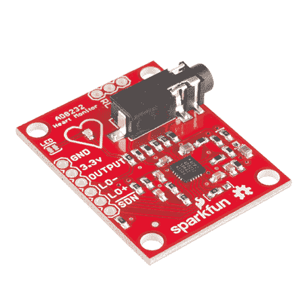
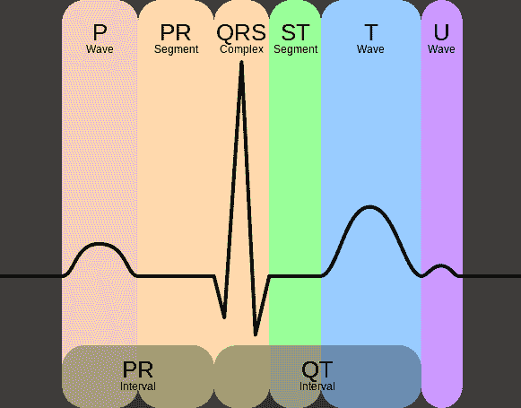
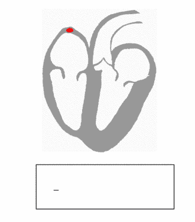

# AD8232 心率监护仪连接指南

> 原文：<https://learn.sparkfun.com/tutorials/ad8232-heart-rate-monitor-hookup-guide>

## 介绍

AD8232 是一个小巧的芯片，用来测量心脏的电活动。这种电活动可以绘制成心电图或心电图。[心电图](http://en.wikipedia.org/wiki/Electrocardiography)用于帮助诊断各种心脏疾病。现在是免责声明:

**NOTE: This device is not intended to diagnose or treat any conditions.** 

将**添加到您的[购物车](https://www.sparkfun.com/cart)中！**

### [SparkFun 单导联心率监护仪- AD8232](https://www.sparkfun.com/products/12650)

[In stock](https://learn.sparkfun.com/static/bubbles/ "in stock") SEN-12650

AD8232 SparkFun 单导联心率监护仪是一款高性价比的电路板，用于测量心率的电活动

$21.5022[Favorited Favorite](# "Add to favorites") 48[Wish List](# "Add to wish list")** **[https://www.youtube.com/embed/rjWXtpbgLKg/?autohide=1&border=0&wmode=opaque&enablejsapi=1](https://www.youtube.com/embed/rjWXtpbgLKg/?autohide=1&border=0&wmode=opaque&enablejsapi=1)

### 本教程涵盖的内容

在本教程中，我们将介绍设置和运行 AD8232 心率监护仪的基本知识。首先，我们将概述该板及其所有特性。然后，我们将向您展示如何将其连接到您最喜欢的微控制器，以及如何使用处理功能创建可视数据。

### 推荐阅读

如果您对以下任何概念都不熟悉，您可能希望在继续之前先回顾一下。

 [### 串行通信](https://learn.sparkfun.com/tutorials/serial-communication) Asynchronous serial communication concepts: packets, signal levels, baud rates, UARTs and more 100 [### 如何为项目提供动力](https://learn.sparkfun.com/tutorials/how-to-power-a-project) A tutorial to help figure out the power requirements of your project.[Favorited Favorite](# "Add to favorites") 67 [### 使用导线](https://learn.sparkfun.com/tutorials/working-with-wire) How to strip, crimp, and work with wire.[Favorited Favorite](# "Add to favorites") 50 [### 什么是 Arduino？](https://learn.sparkfun.com/tutorials/what-is-an-arduino) What is this 'Arduino' thing anyway? This tutorials dives into what an Arduino is and along with Arduino projects and widgets.[Favorited Favorite](# "Add to favorites") 50 [### 将 Arduino 连接到处理](https://learn.sparkfun.com/tutorials/connecting-arduino-to-processing) Send serial data from Arduino to Processing and back - even at the same time 35 [### 串行终端基础知识](https://learn.sparkfun.com/tutorials/terminal-basics) This tutorial will show you how to communicate with your serial devices using a variety of terminal emulator applications.[Favorited Favorite](# "Add to favorites") 46

## 了解心电图

总的来说，让我们看看心电图代表什么，以及我们如何感知它。ECG 分为两个基本间隔，PR 间隔和 QT 间隔，如下所述。

***注:所有信息来自[心电图维基百科页面](http://en.wikipedia.org/wiki/Electrocardiography)的[波和间期](http://en.wikipedia.org/wiki/Electrocardiography#Waves_and_intervals)部分。***

*Credit [Wikipedia.org](http://en.wikipedia.org/wiki/Electrocardiography)*Diagram of the heart. *Credit [Wikipedia.org](http://en.wikipedia.org/wiki/Heart)*

### PR 间隔

PR 间期是由从右心房传到左心房的电脉冲产生的初始波。右心房是第一个感受到电脉冲的心室。这种电脉冲导致心室“去极化”。这迫使它收缩并将来自上腔静脉和下腔静脉的缺氧血液排入右心室。当电脉冲穿过心脏顶部时，触发左心房收缩。左心房负责从肺部接收新氧合的血液，通过左右肺静脉进入左心室。*肺部[静脉](http://en.wikipedia.org/wiki/vein)在图中是红色的，因为它们运送含氧血液。它们仍然被称为静脉，因为静脉将血液输送到心脏。科学！*

### QT Interval

QT 间期是事情变得真正有趣的地方。QRS 是一个复杂的过程，会在心脏监护仪中产生标志性的“哔哔声”。在 QRS 期间，两个心室都开始泵血。右心室开始通过左右肺动脉将缺氧的血液泵入肺部。*肺动脉[动脉](http://en.wikipedia.org/wiki/Artery)在图中是蓝色的，因为它们输送缺氧的血液。它们仍被称为动脉，因为动脉将血液输送到心脏。又是科学！*左心室也开始通过主动脉将新鲜氧合的血液泵入身体的其他部分。在最初的收缩之后是 ST 段。ST 段在电学上相当安静，因为这是心室等待“重新极化”的时间。最后，T 波主动“复极”，或放松心室。这个放松阶段使心室复位，再次被心房充满。

Heartbeat with corresponding ECG *Credit [Wikipedia.org](http://en.wikipedia.org/wiki/Electrocardiography)*

## 连接硬件

在本指南中，我们将 AD8232 分线点连接到 Arduino 微控制器。我们将制作一个简单的心脏监护仪，让您可以实时测量心脏的电活动！

### 所需材料**