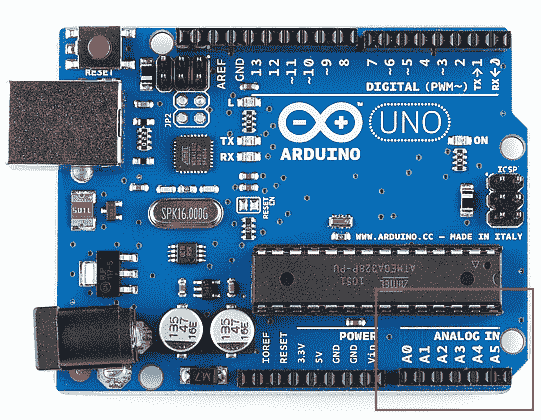
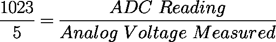
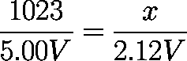
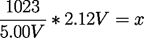
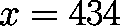
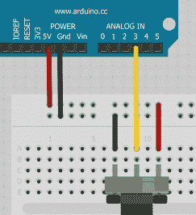

# 模数转换

> 原文：<https://learn.sparkfun.com/tutorials/analog-to-digital-conversion>

## 模拟世界

微控制器能够检测二进制信号:按钮是否被按下？这些是数字信号。当微控制器由 5 伏特供电时，它将 0 伏特(0V)理解为二进制 0，将 5 伏特(5V)理解为二进制 1。然而，这个世界并不简单，它喜欢使用灰色的阴影。信号 2.72V 怎么办？那是 0 还是 1？我们经常需要测量变化的信号；这些被称为模拟信号。5V 模拟传感器可能输出 0.01V 或 4.99V 或两者之间的任何电压。幸运的是，几乎所有的微控制器都内置了一个器件，允许我们将这些电压转换成可以在程序中用来做出决定的值。

在阅读本教程之前，您可能需要了解以下一些主题和概念:

*   [电压、电流、电阻](http://learn.sparkfun.com/tutorials/voltage-current-resistance-and-ohms-law)
*   [二进制](http://learn.sparkfun.com/tutorials/binary)
*   [模拟 vs 数字](https://learn.sparkfun.com/tutorials/analog-vs-digital)
*   [Arduino analogRead()](http://arduino.cc/en/Reference/analogRead)
*   [分压器](http://learn.sparkfun.com/tutorials/voltage-dividers)
*   [数字万用表](http://learn.sparkfun.com/tutorials/how-to-use-a-multimeter)
*   [为您的项目提供动力](https://learn.sparkfun.com/tutorials/how-to-power-a-project)

## ADC 是什么？

模数转换器(ADC)是一项非常有用的功能，它可以将引脚上的模拟电压转换为数字。通过从模拟世界转换到数字世界，我们可以开始使用电子设备与我们周围的模拟世界进行交互。

[](//cdn.sparkfun.com/assets/d/d/5/c/4/5114013ece395f527e000000.jpg)

并非微控制器上的每个引脚都有能力进行模数转换。在 Arduino 板上，这些引脚的标签前面有一个“A ”( A0 到 A5 ),表示这些引脚可以读取模拟电压。

不同微控制器之间的 ADC 差异很大。Arduino 上的 ADC 是一个 10 位 ADC，这意味着它能够检测 1，024 (2^10)个离散模拟电平。一些微控制器具有 8 位 ADC(2^8 = 256 个离散级)，一些具有 16 位 ADC(2^16 = 65，536 个离散级)。

ADC 的工作方式相当复杂。有几种不同的方法可以实现这一壮举(参见维基百科[中的列表](http://en.wikipedia.org/wiki/Analog-to-digital_converter#ADC_types))，但最常用的一种技术是使用模拟电压为内部电容充电，然后测量内部电阻放电所需的时间。微控制器监控电容器放电前经过的时钟周期数。这个周期数是 ADC 完成后返回的数。

## 将 ADC 值与电压相关联

ADC 报告一个*比率值*。这意味着 ADC 假设 5V 为 1023，任何低于 5V 的值都将是 5V 和 1023 之间的比值。

[](//cdn.sparkfun.com/assets/3/9/0/b/6/51140300ce395f777e000002.png)

模数转换取决于系统电压。因为我们主要在 5V 系统上使用 Arduino 的 10 位 ADC，所以我们可以稍微简化这个等式:

[](//cdn.sparkfun.com/assets/4/0/2/7/9/5114021dce395f827d000002.png)

如果您的系统是 3.3V，您只需在等式中用 3.3V 替换 5V 输出。如果您的系统为 3.3V，ADC 报告为 512，那么测得的电压是多少？约为 1.65 伏

如果模拟电压为 2.12V，ADC 会报告什么值？

[](//cdn.sparkfun.com/assets/4/e/3/d/7/513bd09dce395f5a0a000000.png)

稍微重新排列一下，我们会得到:

[](//cdn.sparkfun.com/assets/a/f/e/0/b/513bd09ece395fc409000000.png)[](//cdn.sparkfun.com/assets/2/4/c/9/6/513bd09ece395fb009000001.png)

啊哈！ADC 应该报告 434。

## Arduino ADC 示例

为了在现实世界中展示这一点，让我们使用 Arduino 来检测模拟电压。使用 trimpot，或光传感器，或简单的[分压器](http://learn.sparkfun.com/tutorials/voltage-dividers)来产生电压。让我们为这个例子设置一个简单的 trimpot 电路:

[](//cdn.sparkfun.com/assets/7/f/3/f/a/513bd09ece395f9d09000001.png)

首先，我们需要将 pin 定义为输入。为了匹配电路图，我们将使用 A3:

```
pinMode(A3, INPUT); 
```

然后使用 [analogRead()](http://arduino.cc/en/Reference/analogRead) 命令进行模拟到数字转换:

```
int x = analogRead(A3); //Reads the analog value on pin A3 into x 
```

返回并存储在 x 中的值将是一个从 0 到 1023 的值。Arduino 有一个 [10 位](http://learn.sparkfun.com/tutorials/binary) ADC (2^10 = 1024)。我们将这个值存储到一个 int 中，因为 x(10 位)比一个字节所能容纳的(8 位)要大。

让我们打印这个值，观察它的变化:

```
Serial.print(“Analog value: “);
Serial.println(x); 
```

当我们改变模拟值时，x 也应该改变。例如，如果 x 报告为 334，我们使用的 Arduino 电压为 5V，那么实际电压是多少？拔出你的[数字万用表](http://learn.sparkfun.com/tutorials/how-to-use-a-multimeter)并检查实际电压。应该是 1.63V 左右，恭喜！您刚刚用 Arduino 创建了自己的数字万用表！

## 回顾过去

**如果将模拟传感器连接到常规(数字)引脚，会发生什么情况？**不会有什么不好的事情发生。你就是不能成功地做模拟阅读:

```
int x = analogRead(8); //Try to read the analog value on digital pin 8 - this doesn’t work! 
```

这个*将*编译，但是 x 将被一个无意义的值填充。

**如果我将数字传感器连接到模拟引脚，会发生什么情况？**再说一遍，你不会打碎任何东西。如果在一个按钮上进行模数转换，很可能会看到 ADC 值非常接近 1023(或二进制 1 的 5V)或 0(或二进制 0 的 0V)。

## 有兴趣学习更多基础主题吗？

查看我们的 **[工程要点](https://www.sparkfun.com/engineering_essentials)** 页面，了解电气工程相关基础主题的完整列表。

带我去那里！


## 资源和更进一步

进行模拟数字转换是一件非常值得学习的事情！既然你已经理解了这个重要的概念，那就来看看所有利用模数转换的项目和传感器吧。

*   一些种类的[加速度计](https://learn.sparkfun.com/tutorials/accelerometer-basics)和[陀螺仪](https://learn.sparkfun.com/tutorials/gyroscope)有一个模拟输出，必须在 ADC 上读取以获得可用值。
*   [脉宽调制(PWM)](https://learn.sparkfun.com/tutorials/pulse-width-modulation) 类似于模拟输出，与模拟输入相反。
*   INA169 的[允许您使用 ADC 检测电流。](https://learn.sparkfun.com/tutorials/ina169-breakout-board-hookup-guide)
*   使用[分压器](https://learn.sparkfun.com/tutorials/voltage-dividers)和 ADC，您可以读取各种传感器和可变组件，如[微调按钮、操纵杆、滑块和力敏电阻](https://learn.sparkfun.com/tutorials/resistors/types-of-resistors#trim)等等。
*   Arduino [map()](http://arduino.cc/en/Reference/map) 功能
*   Arduino [模拟引脚](http://arduino.cc/en/Tutorial/AnalogInputPins)