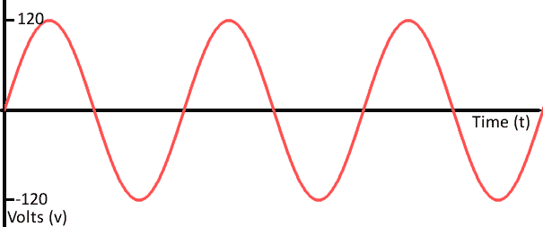

# 模拟与数字

> 原文：<https://learn.sparkfun.com/tutorials/analog-vs-digital>

## 概观

我们生活在一个模拟的世界。有无限多的颜色来描绘一个物体(即使我们的眼睛无法分辨)，有无限多的音调我们可以听到，有无限多的气味我们可以闻到。所有这些模拟信号的共同主题是它们的无限可能性。

数字信号和对象在**离散**或**有限**的领域中处理，这意味着它们的值是有限的。这可能意味着只有两个可能的值，255，4，294，967，296，或者任何不是∞(无穷大)的值。

*Real-world objects can display data, gather inputs by either analog or digital means. (From left to right): Clocks, [multimeters](https://learn.sparkfun.com/tutorials/how-to-use-a-multimeter), and joysticks can all take either form (analog above, digital below).*

使用电子学意味着处理模拟和数字信号，输入和输出。我们的电子项目必须以某种方式与真实的模拟世界互动，但我们的大多数微处理器、计算机和逻辑单元都是纯数字组件。这两类信号就像不同的电子语言；一些电子元件是双语的，其他的只能听懂和说两种语言中的一种。

在本教程中，我们将涵盖数字和模拟信号的基础知识，包括每种信号的示例。我们还将讨论模拟和数字电路以及元件。

&nbsp

&nbsp

### 推荐阅读

模拟和数字的概念是独立的，不需要很多以前的电子学知识。也就是说，如果你还没有，你应该浏览一下这些教程:

*   [电压、电流、电阻和欧姆定律](https://learn.sparkfun.com/tutorials/voltage-current-resistance-and-ohms-law)
*   [什么是电路](https://learn.sparkfun.com/tutorials/what-is-a-circuit)
*   还有一些数学概念:看图，理解有限集和无限集的区别。

## 模拟信号

#### 定义:信号

在深入讨论之前，我们应该先讨论一下*信号*实际上是什么，特别是电子信号(相对于交通信号、终极力量三重奏的[专辑或一般的通信手段)。我们正在谈论的信号是**时变**“量”，它传达某种信息。在电气工程中，随时间变化的*量*通常是**电压**(如果不是，那么通常是电流)。因此，当我们谈论信号时，就把它们想象成一个随时间变化的电压。](http://www.youtube.com/watch?v=z41I3yX_cVI)

信号在设备之间传递，以便发送和接收信息，这些信息可能是视频、音频或某种编码数据。通常，信号通过电线传输，但它们也可以通过无线电频率(RF)波在空气中传播。例如，音频信号可能在电脑的声卡和扬声器之间传输，而数据信号可能在平板电脑和 WiFi 路由器之间通过空气传输。

### 模拟信号图

因为信号会随时间变化，所以将其绘制在图表上是有帮助的，其中横轴为时间，*x*-轴，纵轴为电压，*y*-轴。查看信号图通常是识别信号是模拟信号还是数字信号的最简单方法；模拟信号的时间-电压图应该是**平滑**和**连续**。

虽然这些信号可能被限制在最大值和最小值的**范围**内，但是在该范围内仍然有无限数量的可能值。例如，从墙上插座出来的模拟电压可能被箝位在-120V 和+120V 之间，但是，随着分辨率越来越高，您会发现信号实际上可能有无限多的值(例如 64.4V、64.42V、64.44v 以及无限多的越来越精确的值)。

### 示例模拟信号

视频和音频传输通常使用模拟信号进行传输或记录。例如，从旧 RCA 插孔出来的[复合视频](https://en.wikipedia.org/wiki/Composite_video)是一种编码模拟信号，通常范围在 0 到 1.073V 之间。信号的微小变化对视频的颜色或位置有巨大影响。

*An analog signal representing one line of composite video data.*

纯音频信号也是模拟的。麦克风发出的信号充满了模拟频率和谐波，它们结合在一起构成了美妙的音乐。

## 数字信号

数字信号必须有一组有限的可能值。集合中值的数量可以是 2 到一个非常大的数字(不是无穷大)之间的任意值。最常见的数字信号是两个值中的一个，比如 0V 或 5V。这些信号的时序图看起来像**方波**。

或者数字信号可以是模拟波形的离散表示。从远处看，下面的波函数可能看起来平滑且类似，但当你仔细观察时，当信号试图逼近数值时，会有微小的离散**步**:

这就是模拟波和数字波的巨大区别。模拟波是平滑连续的，数字波是步进、方波和离散的。

### 示例数字信号

并非所有的音频和视频信号都是模拟的。像用于视频(和音频)的 [HDMI](http://en.wikipedia.org/wiki/HDMI) 和用于音频的 [MIDI](http://en.wikipedia.org/wiki/Musical_Instrument_Digital_Interface) 、 [I ² S](http://en.wikipedia.org/wiki/I%C2%B2S) 或[AC’97](http://en.wikipedia.org/wiki/AC%2797)等标准化信号都是数字传输的。

[集成电路](https://learn.sparkfun.com/tutorials/integrated-circuits)之间的大多数通信是数字的。像[串行](https://learn.sparkfun.com/tutorials/serial-communication)、 [I ² C](https://learn.sparkfun.com/tutorials/i2c) 、 [SPI](https://learn.sparkfun.com/tutorials/serial-peripheral-interface-spi) 等接口都是通过方波编码序列传输数据。

*Serial peripheral interface (SPI) uses many digital signals to transmit data between devices.*

## 模拟和数字电路

### 模拟电子学

大多数基本电子元件- [电阻器](https://learn.sparkfun.com/tutorials/resistors)、[电容器](https://learn.sparkfun.com/tutorials/capacitors)、电感器、[二极管](https://learn.sparkfun.com/tutorials/diodes)、晶体管和运算放大器-本质上都是模拟的。仅由这些元件组合而成的电路通常是模拟的。

*Analog circuits are usually complex combinations of op amps, resistors, caps, and other foundational electronic components. This is an example of a class B analog audio amplifier.*

模拟电路可以是非常优雅的设计，包含许多元件，也可以非常简单，比如两个电阻组合成一个分压器。不过，总的来说，模拟电路比那些用数字方式完成同样任务的电路更难设计(T2)。设计模拟无线电接收器或模拟电池充电器需要一种特殊的模拟电路向导；数字元件的存在使得这些设计*更加简单。*

模拟电路通常对噪声(微小的、不期望的电压变化)更加敏感**。处理模拟信号时，电压电平的微小变化可能会产生重大误差。**

### 数字电子学

数字电路使用数字离散信号工作。这些电路通常由晶体管和[逻辑门](https://learn.sparkfun.com/tutorials/digital-logic/combinational-logic)以及更高级别的微控制器或其他计算芯片组合而成。大多数处理器，无论是你电脑中的大而结实的处理器，还是微小的微控制器，都在数字领域运行。

*Digital circuits make use of components like logic gates, or more complicated digital ICs (usually represented by rectangles with labeled pins extending from them).*

数字电路通常使用[二进制](https://learn.sparkfun.com/tutorials/binary)方案进行数字信号传输。这些系统将两个不同的电压分配为两个不同的[逻辑电平](https://learn.sparkfun.com/tutorials/logic-levels)——高电压(通常为 5V、3.3V 或 1.8V)代表一个值，低电压(通常为 0V)代表另一个值。

虽然数字电路通常更容易设计，但它们确实比同等任务的模拟电路贵一点。

### 模拟和数字相结合

在电路中混合使用模拟和数字元件并不罕见。虽然微控制器通常是数字动物，但它们通常具有内部电路，使它们能够与模拟电路([模数转换器](https://learn.sparkfun.com/tutorials/analog-to-digital-conversion)、[脉宽调制](https://learn.sparkfun.com/tutorials/pulse-width-modulation)和数模转换器)接口。模数转换器(ADC)允许微控制器连接到模拟传感器(如光电池或温度传感器)，以读取模拟电压。不太常见的数模转换器允许微控制器产生模拟电压，这在需要发声时很方便。

## 资源和更进一步

既然你知道了模拟信号和数字信号的区别，我们建议你看看[模数转换](https://learn.sparkfun.com/tutorials/analog-to-digital-conversion)教程。使用微控制器或任何基于逻辑的电子设备意味着大部分时间都在数字领域工作。如果您想要检测光线、温度，或者将微控制器与各种其他模拟传感器接口，您需要知道如何将它们产生的模拟电压转换为数字值。

## 有兴趣学习更多基础主题吗？

查看我们的 **[工程要点](https://www.sparkfun.com/engineering_essentials)** 页面，了解电气工程相关基础主题的完整列表。

带我去那里！

另外，考虑阅读我们的[脉宽调制](https://learn.sparkfun.com/tutorials/pulse-width-modulation) (PWM)教程。PWM 是微控制器可以用来使数字信号看起来像模拟信号的一种技巧。

以下是一些与数字接口密切相关的其他主题:

*   [二进制](https://learn.sparkfun.com/tutorials/binary)
*   [逻辑电平](https://learn.sparkfun.com/tutorials/logic-levels)
*   [串行通信](https://learn.sparkfun.com/tutorials/serial-communication)
*   [SPI 通信](https://learn.sparkfun.com/tutorials/serial-peripheral-interface-spi)
*   [I ² C 通信](https://learn.sparkfun.com/tutorials/i2c)
*   [红外通信](https://learn.sparkfun.com/tutorials/ir-communication)

或者，如果您想深入模拟领域，可以考虑查看以下教程:

*   [分压器](https://learn.sparkfun.com/tutorials/voltage-dividers)
*   [电阻器](https://learn.sparkfun.com/tutorials/resistors)
*   [二极管](https://learn.sparkfun.com/tutorials/diodes)
*   [电容器](https://learn.sparkfun.com/tutorials/capacitors)
*   [晶体管](https://learn.sparkfun.com/tutorials/transistors)