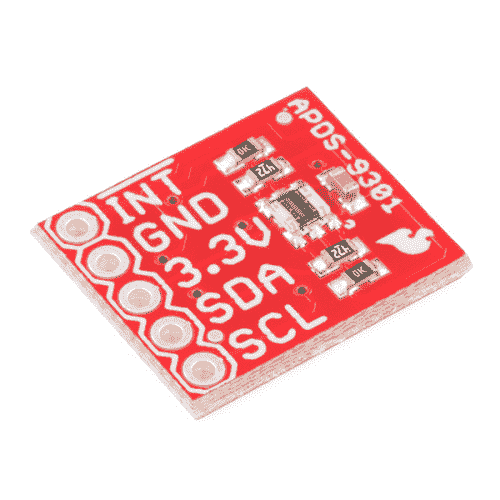

# APDS-9301 传感器连接指南

> 原文：<https://learn.sparkfun.com/tutorials/apds-9301-sensor-hookup-guide>

## 介绍

[APDS-9301](https://www.sparkfun.com/products/14350) 是一个 I ² C 兼容光度传感器，它返回以勒克斯为单位的读数。它不是瞬时的，需要一些积分时间来进行测量。SparkFun 提供了一个非常简单的使用部件的库。

 

### [SparkFun 环境光传感器分线点- APDS-9301](https://www.sparkfun.com/products/retired/14350)

[Retired](https://learn.sparkfun.com/static/bubbles/ "Retired") SEN-14350

APDS-9301 环境光传感器插座是一个 I2C 兼容的光度传感器板，它可以将光强度转换成亮度

**Retired**[Favorited Favorite](# "Add to favorites") 8[Wish List](# "Add to wish list")

### 所需材料

请查看下面的愿望清单，了解完成本教程所需的项目。