# Arduino Shields v2

> 原文：<https://learn.sparkfun.com/tutorials/arduino-shields-v2>

## 介绍

**Update:** This is an updated version of our original Arduino Shields tutorial to expand and update on it as many of the shields highlighted in the original tutorial are no longer carried by SparkFun. If you are looking for the original tutorial it can be found here: [Arduino Shields](https://learn.sparkfun.com/tutorials/arduino-shields)

### 什么是盾牌？

盾牌^([【1】](https://learn.sparkfun.com/tutorials/arduino-shields#footnote1))是模块化电路板，搭载在你的 Arduino 上，给它灌输额外的功能。想要将您的 Arduino 连接到互联网并发布到 Twitter？有一个保护罩。想让你的 Arduino 成为自主漫游车？有护盾可以保护它。有很多屏蔽，所有这些都可以添加各种定制来增强 Arduino 的功能。

[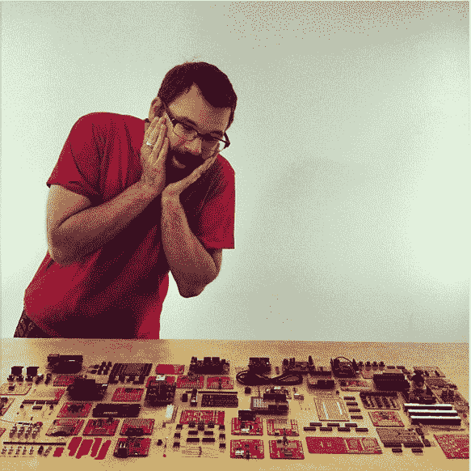](https://cdn.sparkfun.com/assets/3/3/0/9/3/52c5b2f9ce395fad7a8b4567.jpg)*A blast from the past! Former SparkFun catalog manager [RobertC.](https://www.sparkfun.com/users/93309) in awe of an extravagant platter of shields.*

许多 Arduino 护盾可以堆叠。您可以将多个屏蔽连接在一起，创建一个 Arduino 模块堆栈。例如，你可以将 [SparkFun RedBoard](https://www.sparkfun.com/products/13975) 与 [Weather Shield](https://www.sparkfun.com/products/13956) 和 [WiFi Shield - ESP8266](https://www.sparkfun.com/products/13287) 结合起来，创建一个类似于[这个气象站项目](https://learn.sparkfun.com/tutorials/weather-station-wirelessly-connected-to-wunderground)的无线气象站。

盾通常提供有一个示例草图，或者一个[库](https://learn.sparkfun.com/tutorials/installing-an-arduino-library)。因此，它们不仅只是简单地插入你的 Arduino，而且你通常需要做的就是上传一些示例代码到 Arduino。

**[[1]](#footnote1) Note:** In general, these are called "daughter boards." The terminology and layout depends on the environment platform and form factor. Shields for Arduino typically use the Arduino Uno R3 footprint. However, shields can have a different layout depending on the architecture. Stackable PCBs for the Raspberry Pi are referred to as [HATs or pHATs](https://www.sparkfun.com/phats) while the BeagleBone refers to them as Capes. We'll focus on the Arduino shields with the R3 footprint throughout this tutorial.

## 屏蔽形状因数

每个 Arduino 屏蔽都必须符合与其匹配的 Arduino 的相同外形。

In the past, this referred almost exclusively to the [Uno R3 (or RedBoard)](https://learn.sparkfun.com/tutorials/redboard-vs-uno) form factor but as more types of Arduinos and similar development boards have come out, the "shield" definition has become a bit more nebulous.

设计用于 Arduino Uno R3 外形的屏蔽在一个八引脚接头(之前为六引脚接头)上有电源和接地引脚，在其旁边的六引脚接头上有模拟引脚。数字引脚覆盖另一侧的另一个边缘，一个 8 引脚接头与一个 10 引脚接头相隔奇怪的 0.5 英寸间距。一些屏蔽还需要连接到 Arduino 的 ICSP 接头(末端的 2x3 编程接头)。

[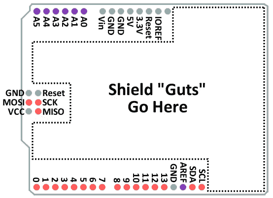](https://cdn.sparkfun.com/assets/learn_tutorials/4/0/SparkFun-Arduino_Shield_Basics.jpg)

### Pin 功能

一些屏蔽使用 Arduino 上几乎所有可用的引脚，而另一些只使用几个。一些屏蔽通过 [SPI](https://learn.sparkfun.com/tutorials/serial-peripheral-interface-spi) 、 [I ² C](https://learn.sparkfun.com/tutorials/i2c) 或[串行](https://learn.sparkfun.com/tutorials/serial-communication)与 Arduino 通信。其他屏蔽使用 Arduino 的[中断](https://learn.sparkfun.com/tutorials/processor-interrupts-with-arduino)、[模拟输入](https://learn.sparkfun.com/tutorials/analog-to-digital-conversion)和 [PWM](https://learn.sparkfun.com/tutorials/pulse-width-modulation) 。堆叠屏蔽时，确保它们不使用重叠的引脚是很重要的。

 [### 串行通信](https://learn.sparkfun.com/tutorials/serial-communication) Asynchronous serial communication concepts: packets, signal levels, baud rates, UARTs and more 100 [### 串行外设接口(SPI)](https://learn.sparkfun.com/tutorials/serial-peripheral-interface-spi) SPI is commonly used to connect microcontrollers to peripherals such as sensors, shift registers, and SD cards.[Favorited Favorite](# "Add to favorites") 91 [### 模数转换](https://learn.sparkfun.com/tutorials/analog-to-digital-conversion) The world is analog. Use analog to digital conversion to help digital devices interpret the world.[Favorited Favorite](# "Add to favorites") 58 [### 脉宽灯](https://learn.sparkfun.com/tutorials/pulse-width-modulation) An introduction to the concept of Pulse Width Modulation.[Favorited Favorite](# "Add to favorites") 46 [### I2C](https://learn.sparkfun.com/tutorials/i2c) An introduction to I2C, one of the main embedded communications protocols in use today.[Favorited Favorite](# "Add to favorites") 128 [### Arduino 处理器中断](https://learn.sparkfun.com/tutorials/processor-interrupts-with-arduino) What is an interrupt? In a nutshell, there is a method by which a processor can execute its normal program while continuously monitoring for some kind of event, or interrupt. There are two types of interrupts: hardware and software interrupts. For the purposes of this tutorial, we will focus on hardware interrupts.[Favorited Favorite](# "Add to favorites") 9

此外，您还需要确保屏蔽引脚与开发板兼容。如果屏蔽是根据 ATmega328p 设计的，则引脚功能可能在不同的位置。例如，XBee shield 是为 Arduino Uno R3(一种基于 ATmega328P 的主板)设计的。如果您要使用 Arduino Leonardo(一种基于 ATmega32U4 的板)或 Arduino Mega 2560(一种基于 ATmega2560 的板)，您需要重新路由连接并重新定义引脚定义。欲了解更多信息，请查看 [XBee Shield 连接指南](https://learn.sparkfun.com/tutorials/xbee-shield-hookup-guide#softwareserialpins)。

|  |  |
| *XBee 屏蔽引脚为基于 ATmega2560 的 Arduino 重新布线* | *XBee 屏蔽引脚为基于 ATmega32U4 的 Arduino 重新布线* |

### 逻辑电平

还要注意，现在有几种 Arduino 开发板适合 R3 外形，但运行在与标准 Uno/RedBoard 不同的[逻辑电平](https://learn.sparkfun.com/tutorials/logic-levels)。例如， [Arduino Uno R3](https://www.sparkfun.com/products/11021) 运行于 **5V** 逻辑，而 [RedBoard Artemis](https://www.sparkfun.com/products/15444) 运行于 **3.3V** 。当电路板在任一逻辑电平下运行时，相当多的屏蔽可以正常工作，但当电平转换电路设置为与 **5V** 系统配合工作时，您可能会遇到一些不稳定的行为。使用 **3.3V** 逻辑 Arduino 可能会遇到的另一个潜在问题是，如果屏蔽通过上拉电阻之类的东西将任何引脚拉至 **5V** 参考电压。

 [### 逻辑电平

#### 2013 年 6 月 3 日](https://learn.sparkfun.com/tutorials/logic-levels) Learn the difference between 3.3V and 5V devices and logic levels.[Favorited Favorite](# "Add to favorites") 82

* * *

### 其他屏蔽形式因素

有各种各样的 Arduino 屏蔽——太多了，无法在本教程中介绍。虽然大多数都遵循标准 Arduino Uno R3 外形，但有些屏蔽设计可能会因开发板的尺寸和环境而异。其中一些设计包括[东西加上](https://www.sparkfun.com/products/15663)、 [Pro Mini](https://www.sparkfun.com/products/11113) 、 [Pro Micro](https://www.sparkfun.com/products/15795) 、 [Arduino Nano](https://www.sparkfun.com/products/15590) 、 [Arduino MKR](https://www.sparkfun.com/products/14870) 和 [Teensy](https://www.sparkfun.com/products/15583) 脚印。

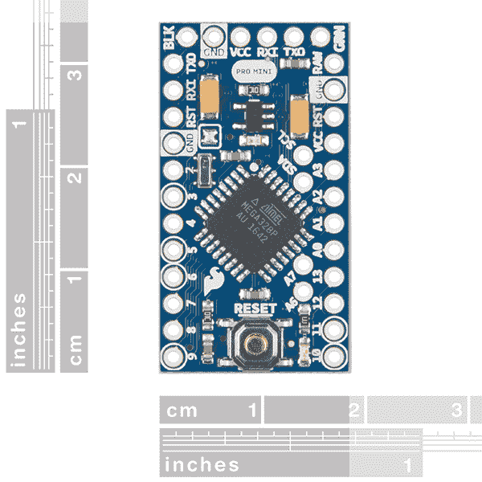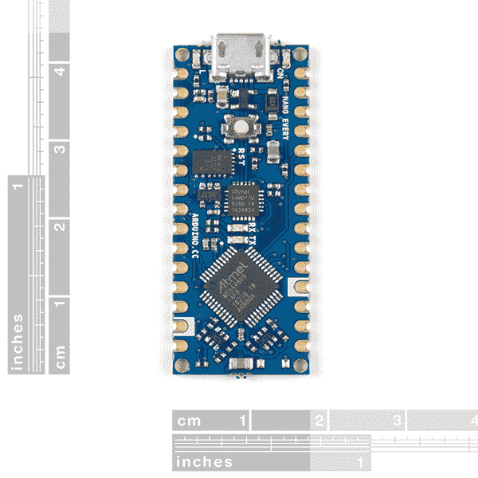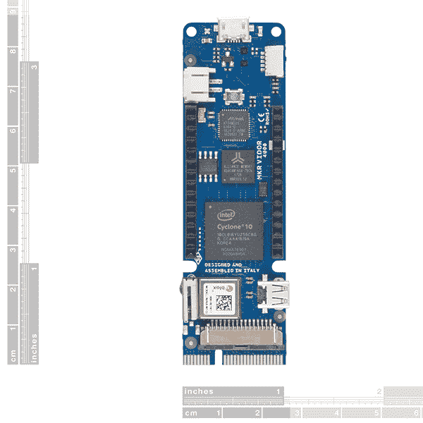

在下一节中，我们将介绍一些为 SparkFun 提供的 R3 外形设计的更受欢迎和独特的盾牌。

## 过多的护盾

以下列表描述了 SparkFun 携带的一些 R3 外形屏蔽，根据其独特的功能分为几个松散的类别。这不是所有 Arduino 盾牌的详尽列表，但它将涵盖 SparkFun 所提供的大部分内容。如果你想浏览 SparkFun 携带的所有盾牌，请查看 [Arduino 盾牌类别](https://www.sparkfun.com/categories/240)。

[Click to Browse Arduino Shields!](https://www.sparkfun.com/categories/240)

### 原型制作及更多

原型护盾通常不像其他护盾那样增加 Arduino 的功能，但它们在其他方面有所帮助。原型屏蔽做一些事情，如打破各种引脚螺丝终端或创造一个空间，建立和测试屏蔽上的电路。

*   [ProtoShield 套件](https://www.sparkfun.com/products/13820)——这个类别的自诩之星。ProtoShield 的中央有一个大的原型制作区。该区域的一半在底部有焊接跳线垫，您可以关闭它，使其功能更像一个[试验板](https://learn.sparkfun.com/tutorials/how-to-use-a-breadboard)，而另一半则作为标准原型/性能板区域。这个盾里有很多东西，所以要全面了解 ProtoShield 工具包里的所有东西以及如何使用它，请查看 [ProtoShield 连接指南](https://learn.sparkfun.com/tutorials/sparkfun-arduino-protoshield-hookup-guide)！

| [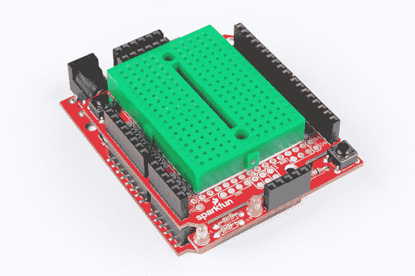](https://cdn.sparkfun.com/assets/learn_tutorials/7/6/7/SparkFun_ProtoShield_for_Arduino_Female_Headers_Mini_Breadboard.jpg) | [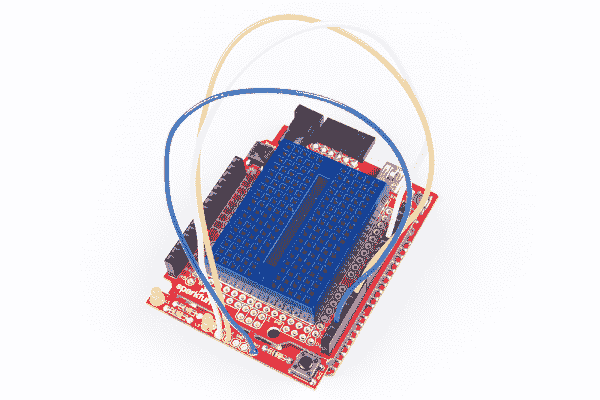](https://cdn.sparkfun.com/assets/learn_tutorials/7/6/7/SparkFun_ProtoShield_for_Arduino_Wires_Female_Header_Wires_Mini_Breadboard.jpg) |

*   ProtoScrew Shield -和 ProtoShield 一样，但是每个引脚都有一个螺丝端子。便于连接外部电机、重型传感器或与每个引脚建立牢固的连接，这种连接不像焊接连接那样持久。
*   [Qwiic Shield](https://www.sparkfun.com/products/14352) -将你的 Arduino 与 SparkFun 的 [Qwiic 系统整合的完美方式](https://www.sparkfun.com/qwiic)！这个屏蔽罩上有四个 Qwiic 连接器，以及一个电平转换电路，可以轻松地与 Qwiic I ² C 分线点连接和通信。shield 还有一个很大的原型制作区域，其中包括一些有助于原型制作的简洁功能。看一看 [Qwiic 屏蔽连接指南](https://learn.sparkfun.com/tutorials/qwiic-shield-for-arduino--photon-hookup-guide)，开始使用该屏蔽和 Qwiic 系统。

[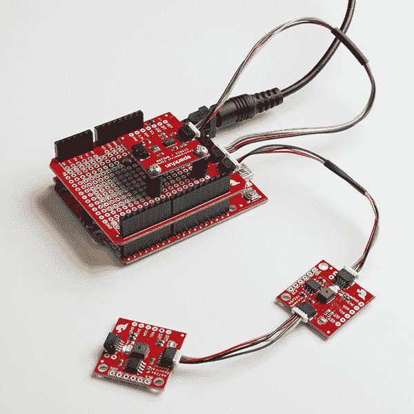](https://cdn.sparkfun.com/assets/learn_tutorials/6/8/4/qwiic_action.jpg)

*   [操纵杆屏蔽套件](https://www.sparkfun.com/products/9760) -这让你的 Arduino 成为一个裸机控制器。这个盾牌上有一个操纵杆和四个按钮，非常适合简单的机器人控制器。
*   许多 Arduinos 的存储空间有限，但这个易于使用的盾(以及 [SD 库](http://arduino.cc/en/Reference/SD))允许为数据记录等事情提供大量额外存储空间。
*   [Mux Shield II](https://www.sparkfun.com/products/11723)-may hew Labs 的这个 Shield 是一个很好的方式，可以使用 R3 布局向 Arduino 添加多达 48 个模拟和数字输入或数字输出。Mayhew Labs 也有一个 Arduino 库，其中内置了一些示例来帮助您入门。以及如何使用 Mux Shield II 的信息可以在他们的[用户指南](https://cdn.sparkfun.com/datasheets/Dev/Arduino/Shields/Mux_Shield_II_User_Guide.pdf)中找到。

### 物联网和无线技术屏障

这些护盾为您的 Arduino 添加了不同类型的无线技术。从为您的下一个物联网 Arduino 项目连接到互联网，到接收和记录基于 Arduino 的机器人的 GPS 坐标，等等！

*   [WiFi Shield (ESP8266)](https://www.sparkfun.com/products/13287) -该 Shield 使用 Espressif 的 ESP8266 SoC 为采用 R3 布局的 Arduino 添加 WiFi 连接。shield 附带预闪存 AT-command 固件，因此它可以作为一个开箱即用的串行控制 WiFi 网关，但它也可以断开 ESP8266 的 I/O 引脚，因此您也可以访问这些引脚，甚至可以使用您自己的自定义固件对 ESP8266 进行重新编程。要开始使用 WiFi 盾(ESP8266)，请浏览我们的[连接指南](https://learn.sparkfun.com/tutorials/esp8266-wifi-shield-hookup-guide)。

[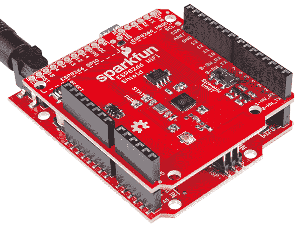](https://cdn.sparkfun.com/assets/learn_tutorials/4/0/3/angled-action.jpg)

*   [Arduino Ethernet Shield 2](https://www.sparkfun.com/products/11166) -想要访问互联网，但更喜欢硬线连接？以太网保护罩是给你的！使用 Arduino [以太网库](https://www.arduino.cc/en/Reference/Ethernet)，开始使用 Ethernet Shield 2 很容易。shield 还包括一个板载 microSD 插槽，用于存储通过网络发送的较大文件。
*   [LTE 卡特彼勒 M1/n B-物联网保护盾(萨拉-R4)](https://www.sparkfun.com/products/14997) -该保护盾为您的物联网项目增加了无线、高带宽蜂窝功能。我们已经写了一个 [Arduino 库](https://github.com/sparkfun/SparkFun_LTE_Shield_Arduino_Library)和一些例子，让你开始发送短信或通过 TCP/IP 连接与服务器通信。你只需要一张兼容的 SIM 卡就可以开始了，或者你可以得到一个包含全息 SIM 卡的版本[这里](https://www.sparkfun.com/products/15087)。查看[连接指南](https://learn.sparkfun.com/tutorials/lte-cat-m1nb-iot-shield-hookup-guide)了解如何开始使用该防护罩的详细信息。
*   XBee Shield - XBee 是出色的射频模块，支持多种无线协议(802.15.4、Digi 的 Zigbee 规范和 BLE)。只需将盾牌上的 XBee 无线电与另一个 XBee 配对，你就可以创建一个由手势控制的[机器人](https://learn.sparkfun.com/tutorials/wireless-gesture-controlled-robot)！
*   [GPS Logger Shield](https://www.sparkfun.com/products/13750) -通过这个 Shield，您可以使用车载 GP3906-TLP GPS 模块记录 Arduino 的位置、速度和高度。看一看[连接指南](https://learn.sparkfun.com/tutorials/gps-logger-shield-hookup-guide)开始记录。

### 音乐和声音

*   [MP3 播放器保护罩](https://www.sparkfun.com/products/12660) -将您的 Arduino 变成 MP3 播放器。只需插入一个存有 MP3 文件的 SD 卡，添加一些扬声器，上传示例代码，你就可以制作一个属于你自己的 [MP3 播放音乐盒](https://learn.sparkfun.com/tutorials/mp3-player-shield-music-box)！

[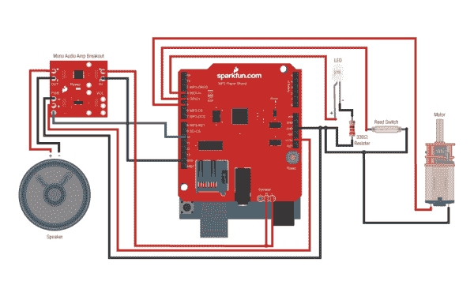](https://cdn.sparkfun.com/assets/3/8/5/a/2/5150bf06ce395f4578000000.png)

*   [MIDI 盾](https://www.sparkfun.com/products/10587) -组装这个盾，让你的 Arduino 访问 [MIDI 通信协议](https://en.wikipedia.org/wiki/MIDI)。除了 MIDI 输入和输出端口，shield 还包括两个电位计，用于控制音高、音量或音调等。有关使用 MIDI 屏蔽的组装说明和示例，请查看[连接指南](https://learn.sparkfun.com/tutorials/midi-shield-hookup-guide)！
*   [频谱屏蔽](https://www.sparkfun.com/products/13116) -它将立体声音频输入到屏蔽中，并将其分成每个通道 7 个频段，然后使用 Arduino 上的 ADC 读取每个通道的振幅。使用这些数据来控制任何东西，从发光二极管，马达，甚至是[火](https://youtu.be/A1VySF2Rd4I)！
*   [EasyVR 3 Plus Shield](https://www.sparkfun.com/products/15453) -该 Shield 使用 EasyVR 模块为您的 Arduino 添加了语音识别技术，因此您可以创建自己的语音控制项目。你可以下载 Arduino 库，并在[用户指南](https://cdn.sparkfun.com/assets/learn_tutorials/9/3/1/EasyVR-3-User-Manual-1.0.17.pdf)中了解如何开始使用 EasyVR 3。

### 电机驱动器

*   Ardumoto 盾牌套件 -有了这个套件，你可以使用 Ardumoto 盾牌来创建一个包含 DC 电机的基本机器人。

[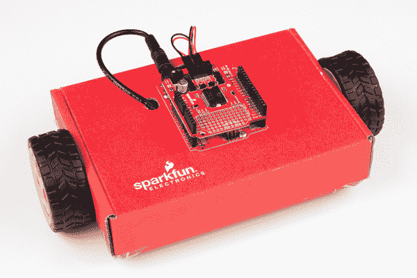](https://cdn.sparkfun.com/assets/learn_tutorials/6/3/0/Marshall-10.jpg)

*   怪物摩托盾牌 -如果你需要驱动比 Ardumoto 盾牌更强大的马达，这是下一步。
*   [无线电机驱动盾](https://www.sparkfun.com/products/14285) -寻找比上面两个盾更通用的东西？无线电机驱动盾可以控制两个 DC 电机，也打破了电源和控制几个伺服引脚，甚至有一个 XBee 插座，轻松地添加无线控制到您的电机项目！这个盾有很多事情要做，所以看一看[连接指南](https://learn.sparkfun.com/tutorials/wireless-motor-driver-shield-hookup-guide)开始吧。

### 杂项盾牌

这些盾牌并不真正符合上述任何类别，但我们仍然希望在此列表中突出它们，因为它们为您的 Arduino 添加了一些简洁、独特的功能。

*   [CAN 总线屏蔽](https://www.sparkfun.com/products/13262) -这允许您的 Arduino 与您的汽车或其他 CAN 应用程序对话。它也有一个 SD 插槽来记录数据，并有连接器用于 GPS 连接和 LCD 来记录和报告数据。查看[连接指南](https://learn.sparkfun.com/tutorials/can-bus-shield-hookup-guide)以获取更多信息和示例代码。
*   [游标接口屏蔽](https://www.sparkfun.com/products/12858) -该屏蔽有四个英国电信连接器(2 个模拟和 2 个数字)，可与各种[游标传感器](https://learn.sparkfun.com/tutorials/vernier-shield-hookup-guide#about-vernier)接口。
*   [同步 RFID 阅读器](https://www.sparkfun.com/products/14066) -使用射频识别(RFID)为您的 Arduino 添加一些物品跟踪功能。该板上的 M6E Nano 模块可读写 EPCglobal Gen 2 UHF RFID 标签，并可同时读取多个标签。我们的 [RFID Arduino 库](https://learn.sparkfun.com/tutorials/simultaneous-rfid-tag-reader-hookup-guide/using-the-arduino-library)有一大堆例子可以帮助你开始下一个 RFID 项目。
*   [气象盾](https://www.sparkfun.com/products/13956) -想创建自己的[气象站](https://learn.sparkfun.com/tutorials/arduino-weather-shield-hookup-guide-v12#example-firmware---weather-station)？天气防护罩是一个很好的起点。该防护罩有传感器来监控温度、湿度、气压和光度，还有端口来连接 GPS 模块以及[气象计](https://www.sparkfun.com/products/15901)来监控风速、方向和降雨量！
*   [EL Escudo Dos](https://www.sparkfun.com/products/10878) -电致发光线牛逼！使用此屏蔽可在您的项目中添加多达八股的 EL 电线。查看这些 [EL Wire 教程](https://learn.sparkfun.com/tutorials/tags/el-wire)，为你自己的 EL 项目寻找一些灵感。
*   克苏鲁之盾 -斯帕克芬携带的最独特、最漂亮的盾牌之一。克苏鲁之盾可以向放置在你舌头上的电极阵列输出信息，也可以从其接收信息！对于一些将这个盾牌与一些传感器配对的巧妙实验想法，看看[这篇博文](https://www.sparkfun.com/news/3244)，开始一些感官替代和增强。

*Pair the Cthulhu Shield with a [Grid-EYE IR Array Breakout](https://www.sparkfun.com/products/14607) for some IR target practice!*

## 安装集管(准备工作)

许多屏蔽罩没有任何接头。这使得它们的最终命运取决于你的解释(也许你更愿意使用直的公头，而不是通常的堆叠式头)。接下来的几页将解释如何将你单调的无头屏蔽变成一个功能齐全、随时可以插入的模块。

[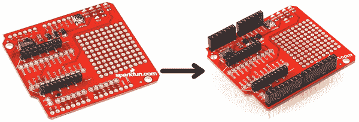](https://cdn.sparkfun.com/assets/e/e/c/7/0/51ddd727ce395f9064000001.png)

屏蔽组件需要焊接。焊料有助于形成良好的物理和电气连接。没有焊料，你的盾牌和 Arduino 几乎肯定不能正常工作。如果它能够工作，充其量也只是不稳定和断断续续的。如果这是你第一次焊接，在组装你的屏蔽之前，考虑看看我们的[如何焊接:通孔焊接教程](https://learn.sparkfun.com/tutorials/how-to-solder-through-hole-soldering):

 [### 如何焊接:通孔焊接

#### 2013 年 9 月 19 日](https://learn.sparkfun.com/tutorials/how-to-solder-through-hole-soldering) This tutorial covers everything you need to know about through-hole soldering.[Favorited Favorite](# "Add to favorites") 70

### 所需材料

选择了您的屏蔽后，唯一需要的其他材料是一个兼容的 Arduino 开发板和一些接头。SparkFun RedBoard 和 Arduino Uno R3 是很好的选择，几乎可以与任何 Arduino 盾牌配合使用，不会有任何问题:

 

将**添加到您的[购物车](https://www.sparkfun.com/cart)中！**

### [spark fun red board——用 Arduino 编程 T3](https://www.sparkfun.com/products/13975)

[In stock](https://learn.sparkfun.com/static/bubbles/ "in stock") DEV-13975

SparkFun RedBoard 结合了 UNO 的 Optiboot 引导程序的简单性、FTDI 的稳定性和 shield com…

$21.5049[Favorited Favorite](# "Add to favorites") 89[Wish List](# "Add to wish list")**** 

将**添加到您的[购物车](https://www.sparkfun.com/cart)中！**

### [Arduino Uno - R3](https://www.sparkfun.com/products/11021)

[In stock](https://learn.sparkfun.com/static/bubbles/ "in stock") DEV-11021

这是新的 Arduino Uno R3。除了以前主板的所有功能外，Uno 现在使用 ATmega16U2 代替…

$27.95138[Favorited Favorite](# "Add to favorites") 162[Wish List](# "Add to wish list")**** ****以下是一些推荐的标题选项:

 

将**添加到您的[购物车](https://www.sparkfun.com/cart)中！**

### [破开头球——直击](https://www.sparkfun.com/products/116)

[In stock](https://learn.sparkfun.com/static/bubbles/ "in stock") PRT-00116

一排标题-打破适应。40 个引脚，可切割成任何尺寸。用于定制 PCB 或通用定制接头。

$1.7520[Favorited Favorite](# "Add to favorites") 133[Wish List](# "Add to wish list")**** 

将**添加到您的[购物车](https://www.sparkfun.com/cart)中！**

### [Arduino 可堆叠接头套件- R3](https://www.sparkfun.com/products/11417)

[In stock](https://learn.sparkfun.com/static/bubbles/ "in stock") PRT-11417

这些接头适用于 Arduino Uno R3、Leonardo 和新的 Arduino 板。他们是完美的 h…

$1.7512[Favorited Favorite](# "Add to favorites") 68[Wish List](# "Add to wish list")****[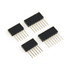](https://www.sparkfun.com/products/10007) 

将**添加到您的[购物车](https://www.sparkfun.com/cart)中！**

### [Arduino 可堆叠插头套件](https://www.sparkfun.com/products/10007)

[In stock](https://learn.sparkfun.com/static/bubbles/ "in stock") PRT-10007

这些接头适用于 Arduino 主板、Arduino Pro 和 Arduino Mega。他们是完美的高度…

$1.753[Favorited Favorite](# "Add to favorites") 19[Wish List](# "Add to wish list")****** ******### 所需工具

你还需要至少一个烙铁和一些焊料来组装你的盾牌。以下是几个烙铁和焊接选项，以及几个工具包，其中包含开始焊接所需的所有工具:

[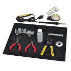](https://www.sparkfun.com/products/14681) 

将**添加到您的[购物车](https://www.sparkfun.com/cart)中！**

### [SparkFun 初学者工具包](https://www.sparkfun.com/products/14681)

[Out of stock](https://learn.sparkfun.com/static/bubbles/ "out of stock") TOL-14681

这些工具非常适合那些需要一套坚实的工具来启动工作台的人！

$62.50[Favorited Favorite](# "Add to favorites") 14[Wish List](# "Add to wish list")**** 

将**添加到您的[购物车](https://www.sparkfun.com/cart)中！**

### [无铅焊料- 15 克管](https://www.sparkfun.com/products/9163)

[In stock](https://learn.sparkfun.com/static/bubbles/ "in stock") TOL-09163

这是你的无铅焊料的基本管，带有不干净的水溶性树脂芯。0.031 英寸规格，15 克

$3.954[Favorited Favorite](# "Add to favorites") 14[Wish List](# "Add to wish list")****[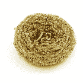](https://www.sparkfun.com/products/8964) 

将**添加到您的[购物车](https://www.sparkfun.com/cart)中！**

### [黄铜海绵](https://www.sparkfun.com/products/8964)

[In stock](https://learn.sparkfun.com/static/bubbles/ "in stock") TOL-08964

这是一种黄铜海绵，有助于清洁烙铁头。使用它来消除残留从您的铁尖之前出售…

$3.504[Favorited Favorite](# "Add to favorites") 38[Wish List](# "Add to wish list")**** 

将**添加到您的[购物车](https://www.sparkfun.com/cart)中！**

### [烙铁- 30W(美国，110V)](https://www.sparkfun.com/products/9507)

[33 available](https://learn.sparkfun.com/static/bubbles/ "33 available") TOL-09507

这是一个非常简单的固定温度，快速加热，30W 110/120 VAC 烙铁。我们真的很喜欢使用更贵的 iro…

$10.957[Favorited Favorite](# "Add to favorites") 21[Wish List](# "Add to wish list")******** ********除了这些必需的工具，这些附件还能让您的焊接体验变得更加轻松:

[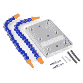](https://www.sparkfun.com/products/11784) 

将**添加到您的[购物车](https://www.sparkfun.com/cart)中！**

### [SparkFun 第三手工具包](https://www.sparkfun.com/products/11784)

[17 available](https://learn.sparkfun.com/static/bubbles/ "17 available") TOL-11784

你对大多数第三只手不够灵活感到沮丧吗？SparkFun 第三只手让你有能力握住…

$37.5060[Favorited Favorite](# "Add to favorites") 86[Wish List](# "Add to wish list")**** 

将**添加到您的[购物车](https://www.sparkfun.com/cart)中！**

### [芯片快克免清洗助焊剂笔- 10mL](https://www.sparkfun.com/products/14579)

[In stock](https://learn.sparkfun.com/static/bubbles/ "in stock") TOL-14579

这款来自 Chip Quik 的 10 毫升免清洗助焊剂笔非常适合您的所有焊接、脱焊、返工和回流目的！

$8.954[Favorited Favorite](# "Add to favorites") 36[Wish List](# "Add to wish list")****[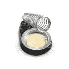](https://www.sparkfun.com/products/9477) 

将**添加到您的[购物车](https://www.sparkfun.com/cart)中！**

### [烙铁架](https://www.sparkfun.com/products/9477)

[21 available](https://learn.sparkfun.com/static/bubbles/ "21 available") TOL-09477

这是一个简单的烙铁架，由一个重型金属底座和一个加固的弹簧座组成。底座和支架…

$6.504[Favorited Favorite](# "Add to favorites") 29[Wish List](# "Add to wish list")**** 

将**添加到您的[购物车](https://www.sparkfun.com/cart)中！**

### [焊芯 2 号 5 英尺。-通用](https://www.sparkfun.com/products/9327)

[In stock](https://learn.sparkfun.com/static/bubbles/ "in stock") TOL-09327

焊芯、咖啡和纸巾让 SparkFun 保持运转。你可以偷别人的斜切刀一分钟，但你会…

$2.754[Favorited Favorite](# "Add to favorites") 30[Wish List](# "Add to wish list")******** ********### 你应该使用什么样的标题？

有各种各样的接头，但我们推荐安装在屏蔽上的只有两种:堆叠式或插头式。

[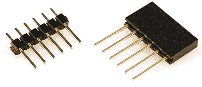](//cdn.sparkfun.com/assets/d/f/7/3/b/51193875ce395f424b000000.jpg)*A straight male header (left) and a stackable header (right).*

可堆叠接头特别适合堆叠屏蔽。它们还能让您将跳线插入 Arduino 的任何引脚。本教程将主要解释如何安装可堆叠式集管。可堆叠接头有 [6 针](https://www.sparkfun.com/products/9280)、 [8 针](https://www.sparkfun.com/products/9279)和 [10 针](https://www.sparkfun.com/products/11376)三种(对于使用不同尺寸/外形的开发板，还有其他[可堆叠接头选项](https://www.sparkfun.com/categories/381))，或者您可以购买像上面所需材料部分所示的成套接头。

[Click Here for More Header Options](https://www.sparkfun.com/categories/381)

简单的直[公接头](https://www.sparkfun.com/products/116)也是将屏蔽连接到 Arduino 的一种选择。公接头的好处在于，当连接到 Arduino 时，它们会形成一个**低剖面堆栈**。如果您打算将 Arduino/shield 组合放入一个机箱中，您可能需要考虑使用插头。本教程重点介绍可堆叠式收割台的安装，查看[提示和技巧](https://learn.sparkfun.com/tutorials/arduino-shields-v2#assembly-tricks)部分，了解外螺纹收割台的组装说明。

**不要安装**内螺纹接头、直角外螺纹接头、瑞士机器销接头、圆形接头或其他各种可能存在的接头。你真的应该只使用直，矩形，公引脚的标题。

* * *

现在，插上电源，开始预热烙铁。是时候焊接了！

## 安装集管(总成)

### 步骤 1:插入所有四个标题

将所有四个接头插入防护罩。确保您**将它们插入正确的方向**。接头的插针应该进入屏蔽层的顶部，并从底部伸出。这个方向是最重要的。不要焊接任何东西，直到你已经得到了正确的方式标题！

*Headers inserted, aligned as well as possible, ready to solder.*

插入接头后，翻转顶部的屏蔽罩，使其靠在接头的黑色凹入侧。希望你有一个很好的平坦的工作空间来放置它。尝试对齐所有接头，使它们**与屏蔽 PCB**精确垂直。

### 第二步:在每个接头上焊接**一个**引脚

终于到了焊接时间！每个接头必须与 PCB 成 90°角，这一点很重要。这将确保盾牌直接滑动到你的 Arduino 上，这样你就不必弯曲任何引脚。

为了保证每个接头都是直的**，首先在每个**上焊接一个引脚。这样，如果他们处于一个奇怪的角度，在调整对齐时，只需重新加热一个引脚就会容易得多。

*One pin down, one in progress, two to go. Soldering one pin on each header.*

四个焊点下来，只剩下 24 个(到 28 个)了！

### 步骤 3:检查标题对齐

焊接这四个引脚后，尝试将屏蔽部分插入 Arduino，以测试接头的对齐情况。进行校准检查时，请确保 Arduino 没有通电。

[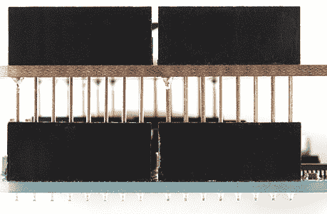](//cdn.sparkfun.com/assets/d/f/7/f/2/51193a9ece395f3b4b000000.jpg)*Temporarily plugging the shield in to check that all pins line up.*

一切都正常吗？没有引脚弯曲？如果没有，找到有问题的标题并尝试重新对齐。用熨斗重新加热接头，并轻微移动和调整割台对齐。此外，将部分焊接的屏蔽从 Arduino 中拔出时要小心。由于所有的接头都没有焊接，当你把它从 Arduino 的母接头中拔出来时，你可以很容易地弯曲它们。

### 步骤 4:焊接所有剩余的引脚

如果您的接头都排成一行，您可以攻击剩余的未焊接的接头引脚。完成后，你应该有 32 个闪亮的焊料火山。

*That's a beautiful sight. Everything's soldered up.*

### 第五步:检查短路或冷接点

所有东西都焊接好后，仔细检查是否有不良焊点。你的关节有没有偏离到另一个关节造成短路？如果是这样，你可以拿一些[焊芯](https://www.sparkfun.com/products/9327)到接头处，或者只是试着重新加热短路并把焊料“推到”你想要的地方。

[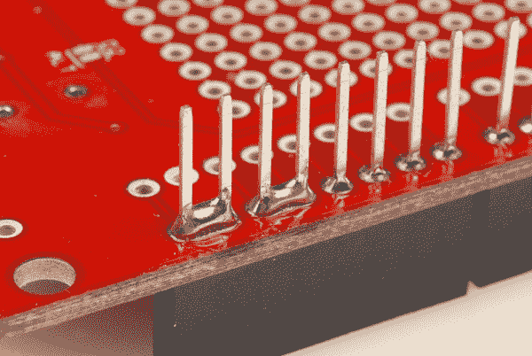](//cdn.sparkfun.com/assets/f/2/8/f/7/5115669cce395ff53c000002.jpg)*Well, that's just egregious! Watch out for shorted solder joints like that.*

还要检查**冷焊点**——一个上面有一些焊料，但没有完全将两个焊点连接在一起的焊点。冷关节并不总是最容易看到的；留意那些不那么光亮的接头，或者看起来仍然松动的别针。

[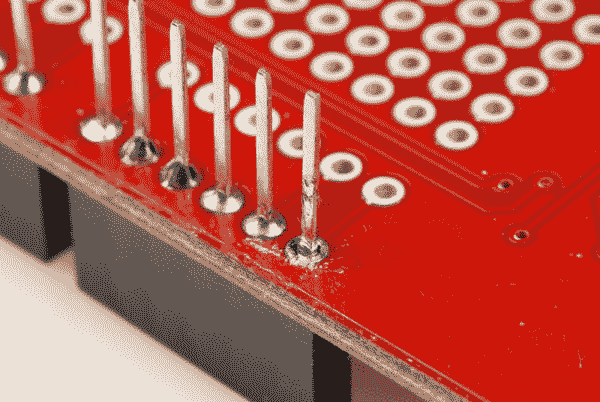](//cdn.sparkfun.com/assets/c/a/3/c/b/5115669cce395f973d000006.jpg)*That last pin could use a bit more solder. It doesn't quite look like a connection's been made.*

要修复冷接点，重新加热引脚上的焊料，再多加一点。

### 第六步:插上电源！

最好的做法通常是在连接屏蔽罩之前关闭(拔下)Arduino 电源。希望所有的引脚仍然排列良好，屏蔽罩正好滑入 Arduino。插入时注意不要弯曲任何引脚，并确保它们都进入其配套的母接头。

*That satisfying feeling as the shield slides straight into your Arduino*

## 组装技巧

前面的组装部分应详细说明简单屏蔽接头安装所需了解的一切。然而，在这个过程中，我们学到了一些技巧...

### 使用旧护罩帮助对准

最容易弄乱屏蔽组件的地方是对准每一个接头。当屏蔽层连接到 Arduino 时，最好避免焊接可堆叠接头，因此组装部分描述的方法通常是最好的。如果你有一个备用的盾牌，你可以利用另一个小技巧，把它作为一个头部对齐夹具。

首先将所有接头插入备用屏蔽夹具。

[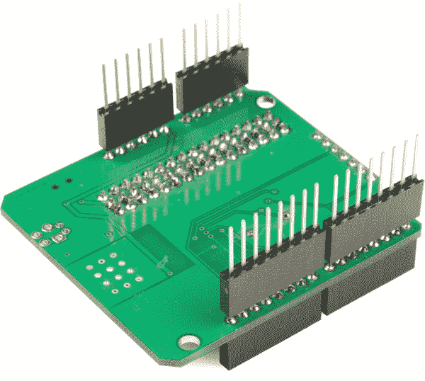](https://cdn.sparkfun.com/assets/1/0/7/3/3/51dde352ce395f0d65000000.png)*The green shield will be used as our jig. First, insert the stackable headers into it.*

然后将接头插入待焊接的屏蔽层，将它们全部焊接起来。假设备用屏蔽正确对齐(您可能想先检查一下)，您的接头将与您的 Arduino 完美对齐。

[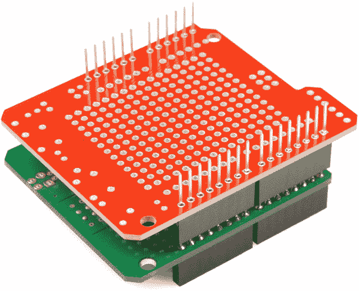](https://cdn.sparkfun.com/assets/1/b/d/5/b/51dde3d9ce395f5665000002.JPG)*The jig should correctly align all of the headers. Solder away!*

### 安装外螺纹接头

如果您重视较小轮廓的屏蔽安装，而不是堆叠屏蔽和连接跳线的能力，那么公接头是一个选项。

在某种程度上，公接头实际上更容易对齐和安装，因为您可以将 Arduino 用作夹具。首先将标题插入 Arduino。

[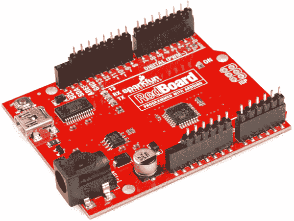](https://cdn.sparkfun.com/assets/1/2/f/1/8/51dde46bce395f4965000000.JPG)*RedBoard's make an especially special jig for aligning male headers.*

然后排好队插上屏蔽，焊掉。

[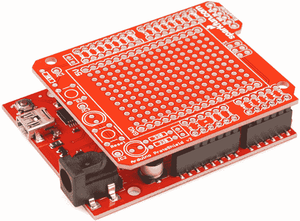](https://cdn.sparkfun.com/assets/0/a/7/6/1/51dde46bce395f7164000000.JPG)*Shield with headers, ready for soldering. We can trust the RedBoard to line the male headers up for us.*

使用这种方法要小心。不要将熨斗放在针脚上太久，否则会有烧坏 Arduino 插头的危险。如果你特别担心烧坏 Arduino 的母插头，你可以在每个插头上只焊一个引脚，去掉屏蔽，然后焊接其余的。

### 将接头固定在护罩上

周围没有额外的屏蔽，或者您的开发板还没有焊接任何接头引脚？对于那些有技巧的人来说，你可以通过将针固定在板上来安装一排割台！你甚至可以尝试使用胶带和粘性图钉。下面是[在 ProtoShield](https://learn.sparkfun.com/tutorials/sparkfun-arduino-protoshield-hookup-guide#hardware-assembly) 上安装母接头的例子。但是，您可以使用公接头，或者使用这种技术在开发板上焊接接头。

抓住一个凹形可堆叠接头，将其从护罩的顶部滑动。用焊接手，用食指和拇指将接头拉向电路板边缘。用另一只手，用食指推压收割台，用拇指抓住板子。用中指按住头部。确保避免接触烙铁会接触到的任何接头引脚。

|  |  |

用你的焊接手抓住烙铁，钉上一个针。对每个标题重复上述步骤。在为每个割台钉上一个针后，你需要确保这些针是直的并且垂直于你的板子。如果没有，您可以尝试重新加热割台销并调整割台的对齐。

如果接头对齐，您可以在板上焊接其余的接头引脚，以完成在屏蔽上安装接头！

### 用试验板将接头安装到其他屏蔽上

如果您使用的屏蔽不采用 R3 外形，您可以使用试验板来帮助焊接接头。下面是一个将插头焊接在 Teensy 和 Pro Mini 的 TeensyView 屏蔽罩上的示例。Teensy 和 Pro Mini 外形规格在电路板边缘使用试验板兼容引脚，没有奇怪的 0.5 英寸间距。

| [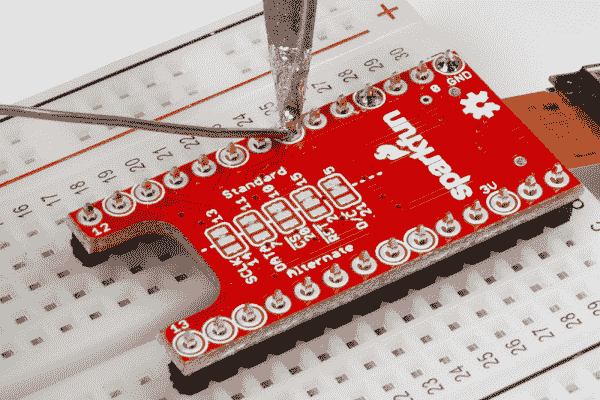](https://learn.sparkfun.com/tutorials/teensyview-hookup-guide#hardware-overview-and-assembly) |  |
| *为带试验板的青少年在[青少年观察罩](https://learn.sparkfun.com/tutorials/teensyview-hookup-guide#hardware-overview-and-assembly)上安装公接头。* | *在带迷你试验板的 Pro Mini 的 [MiniGen 护罩](https://learn.sparkfun.com/tutorials/minigen-hookup-guide)上安装长的公接头。* |

使用试验板时，还需要小心地将引脚焊接到屏蔽上。如果你把熨斗放在插销上太长时间，你也会有熔化固定金属导轨的塑料试验板的风险。

## 资源和更进一步

既然你已经掌握了这些知识，你就可以随心所欲地弯曲任何 Arduino 盾牌了！如果你有兴趣进一步探索盾牌的世界，看看我们的 [Arduino 盾牌类别](https://www.sparkfun.com/categories/240)。

[Click to Browse Arduino Shields!](https://www.sparkfun.com/categories/240)

您是刚刚开始使用 Arduino，还是有兴趣了解更多关于使用 Arduino IDE 的信息？考虑看看这些指南来帮助你开始:

*   [为您的项目选择 Arduino】](https://learn.sparkfun.com/tutorials/choosing-an-arduino-for-your-project)
*   [Arduino 对比指南](https://www.sparkfun.com/standard_arduino_comparison_guide)
*   [如何安装 Arduino 库](https://learn.sparkfun.com/tutorials/installing-an-arduino-library)
*   [Arduino 中的数据类型](https://learn.sparkfun.com/tutorials/data-types-in-arduino)

为你的 Arduino 盾寻找一些项目灵感？以下是一些有趣的项目教程，重点介绍 Arduino 盾的使用:

 [### MP3 播放器屏蔽音乐盒](https://learn.sparkfun.com/tutorials/mp3-player-shield-music-box) Music Box Project based on the Dr. Who TARDIS.[Favorited Favorite](# "Add to favorites") 8 [### 无线连接到地下的气象站](https://learn.sparkfun.com/tutorials/weather-station-wirelessly-connected-to-wunderground) Build your own open-source, official Wunderground weather station that connects over WiFi via an Electric Imp.[Favorited Favorite](# "Add to favorites") 32 [### XBee 屏蔽连接指南](https://learn.sparkfun.com/tutorials/xbee-shield-hookup-guide) How to get started with an XBee Shield and Explorer. Create a remote-control Arduino 13 [### 同步 RFID 标签阅读器连接指南](https://learn.sparkfun.com/tutorials/simultaneous-rfid-tag-reader-hookup-guide) A basic guide to getting started with the RFID Tag Reader breakout and how to read and write multiple RFID tags over multiple feet 8**************************