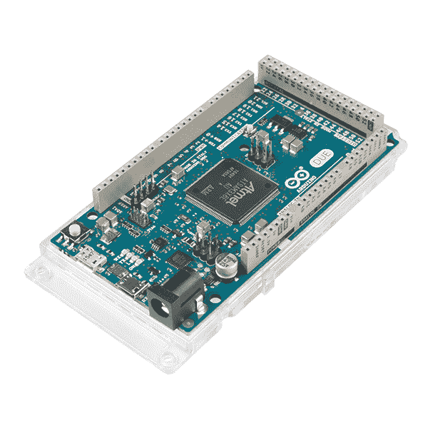
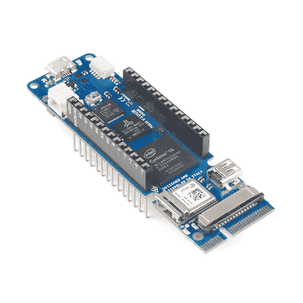
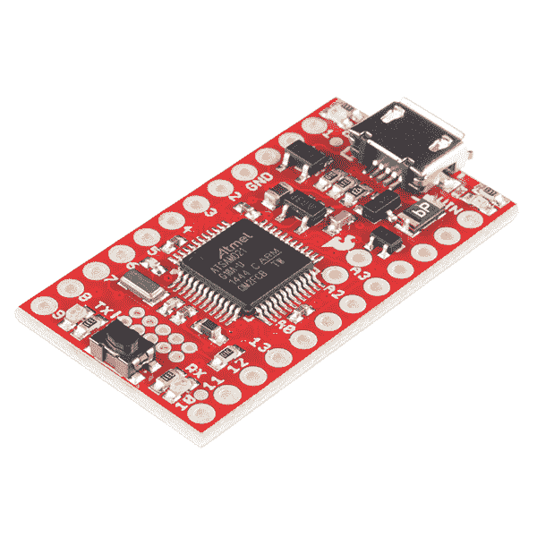
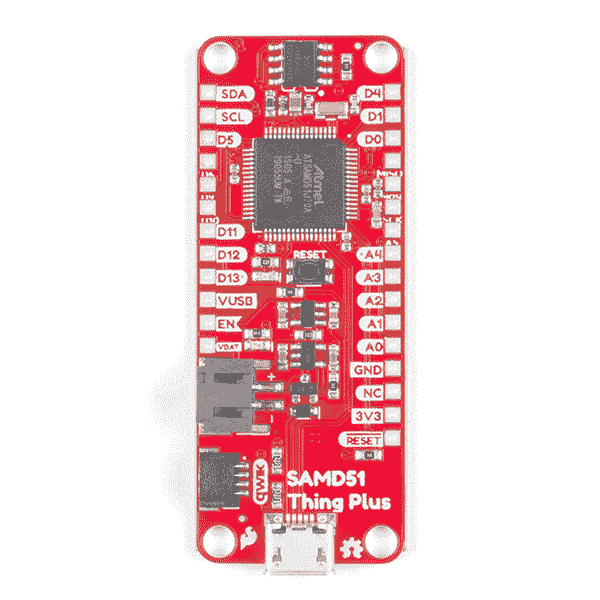

# ARM 编程

> 原文：<https://learn.sparkfun.com/tutorials/arm-programming>

## 介绍

**Heads up!** This tutorial was written for ARM microcontrollers with SWD or JTAG pins. You will need a dedicated programmer (i.e. [J-Link EDU Mini](https://www.sparkfun.com/products/15345) or [J-Link EDU Base](https://www.sparkfun.com/products/15346)) to connect to the port. If you are using an AVR microcontroller with an Arduino bootloader using ICSP pins, you'll need to head on over to the [Installing an Arduino Bootloader](https://learn.sparkfun.com/tutorials/installing-an-arduino-bootloader) tutorial.

SparkFun 是 Arduino 的粉丝已经很久了。我们已经编写了 ATMega328s(和 168，以及之前的 8)，编写了教程，并破解了各种有趣的项目。但现在市场正在成熟，我们正在寻找更多的 ARM 芯片。新型芯片的一个优点是它们通常不需要 USB 转串行适配器；相反，他们有内置的 USB 接口(至少我们正在使用的是内置的)。你仍然需要添加一个 bootloader 来使用 Arduino，由于 ARM 程序员也比 AVR 程序员稍微复杂一些，所以你会想投资一个独立的程序员，而不是试图使用你周围的 Uno。

**Please Note:** Most SparkFun boards come pre-programmed. This tutorial is meant to provide information if you wish to re-program your board or change the bootloader.

几个臂板:

|  |  |  |  |  |
| *[到期:](https://www.sparkfun.com/products/11589) Arduino 的第一臂板* | *[MKR 维多 4000:](https://www.sparkfun.com/products/14870)Arduino 较新的 Arm 板之一* | *[red board Turbo:](https://www.sparkfun.com/products/14812)spark fun 较新的板子之一* | *[samd 21 Dev Mini:](https://www.sparkfun.com/products/13664)spark fun 的 ARM 板之一* | *[SAMD51 东西加板:](https://www.sparkfun.com/products/14713) SparkFun 最新 ARM 板* |

### 所需材料

要跟随本教程，您将需要以下材料。你可能不需要所有的东西，这取决于你有什么。将它添加到您的购物车，通读指南，并根据需要调整购物车。