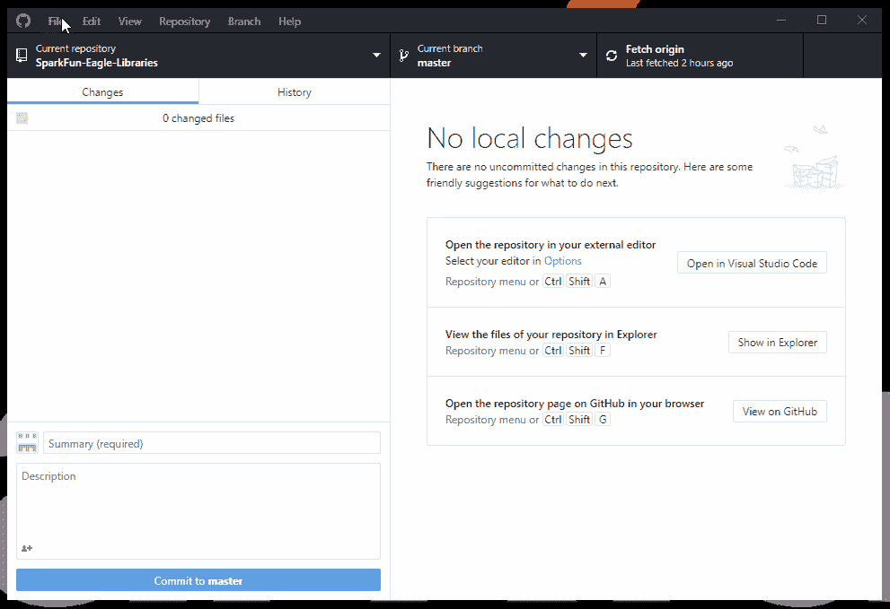
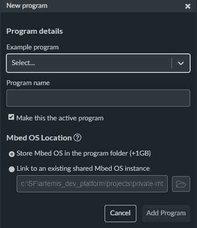
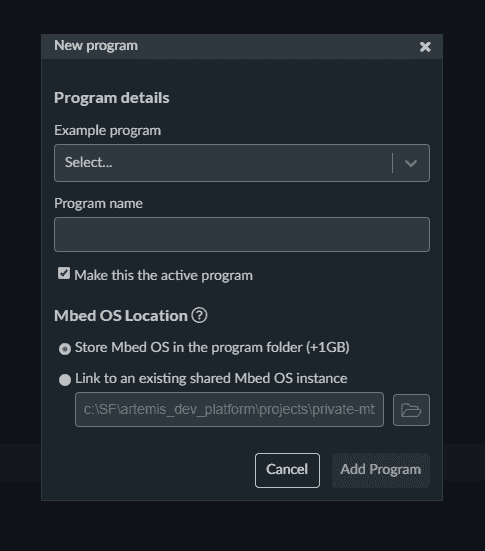
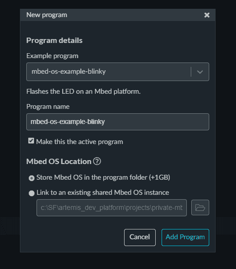
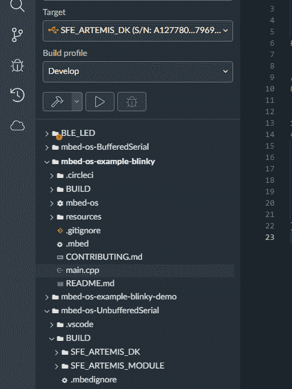
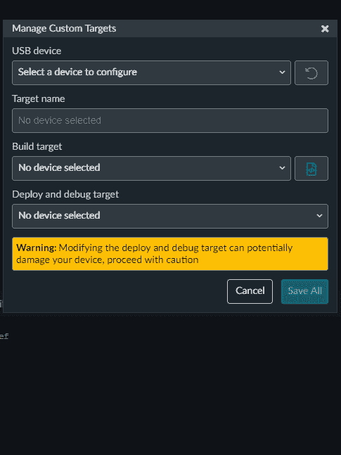
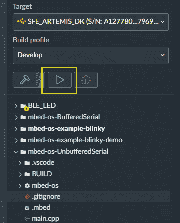
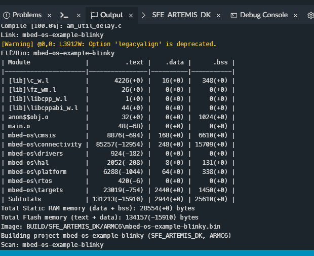

# 基于 Arm Mbed 操作系统的 Artemis 开发(测试版)

> 原文：<https://learn.sparkfun.com/tutorials/artemis-development-on-arm-mbed-os-beta>

## 抢先一步发布

借助最新的 Artemis DK 板，我们现在可以在 Arduino IDE 中提供全面的蓝牙支持，并使用[Arm Mbed OS](https://os.mbed.com/mbed-os)进行开发。虽然我们一直在不懈努力，争取在下一个 Mbed OS 版本中支持 Artemis 模块，但下一个版本要到 Artemis DK 向公众发布后才会发布。因此，这篇文章将在下一个版本(在各种*测试版*中)之前，通过利用我们的 Mbed OS 分支，为用户提供一个使用 Mbed Studio 进行开发的快速起步。

如果您错过了，请查看 Mbed 团队的直播演示:

[https://www.youtube.com/embed/o3ffhf3z6so/?autohide=1&border=0&wmode=opaque&enablejsapi=1](https://www.youtube.com/embed/o3ffhf3z6so/?autohide=1&border=0&wmode=opaque&enablejsapi=1)

*Users may need to watch the video on [YouTube](https://youtu.be/o3ffhf3z6so).*

## 克隆叉子

用户首先需要从 [GitHub 库](https://github.com/sparkfun/mbed-os-ambiq-apollo3/tree/ambiq-apollo3-dev)的`ambiq-apollo3-dev`分支克隆 Mbed OS 的分支。请随意使用您最熟悉的方法。

**Note:** For users who need a little more direction, [install the GitHub desktop application](https://desktop.github.com/) and [register a GitHub account](https://github.com/join?ref_cta=Sign+up&ref_loc=header+logged+out&ref_page=%2F&source=header-home). Once an account has been created and the application has been installed, open the application and log in.

从 GitHub 桌面应用程序中，克隆`sparkfun/mbed-os-ambiq-apollo3`存储库(*请注意存储库在计算机上的位置，稍后会用到它。*)。一旦存储库被克隆，拉动`ambiq-apollo3-dev`分支。

*Cloning the our fork of Mbed™ OS from the `ambiq-apollo3-dev` branch of the [GitHub repository](https://github.com/sparkfun/mbed-os-ambiq-apollo3/tree/ambiq-apollo3-dev) with the [GitHub desktop application](https://desktop.github.com/). (Click to enlarge)*

## 安装 Mbed Studio

用户应安装最新版本的 Mbed Studio。安装说明可在 Mbed 网站上的[处找到。Mbed Studio 的文档也存放在](https://os.mbed.com/docs/mbed-studio/current/installing/installing-mbed-studio.html) [Mbed 网站](https://os.mbed.com/docs/mbed-studio/current/introduction/index.html)上。

[Go to Installation Instructions](https://os.mbed.com/docs/mbed-studio/current/installing/installing-mbed-studio.html)

## 项目设置

一旦用户安装了 Mbed Studio，乐趣就开始了！首先，打开 Mbed Studio 并创建一个新项目。

*   从菜单中选择**文件**T4**新建程序**....
    *   应该会打开一个新程序对话框。 *对话框截图。*
*   从 **Blinky** 示例开始，从**示例程序**下拉列表中，在 MBED OS 6 列表中选择:
    *   对于 Mbed OS 完整配置文件:`mbed-os-example-blinky` *选择 **Blinky** 示例。*
*   对于**Mbed OS 位置**，选择“链接到现有共享 Mbed OS 实例”选项。
    *   浏览前面提到的位置，到 Mbed OS 分支的`ambiq-apollo3-dev`分支。 *设置 Mbed OS 位置。*
*   点击**添加程序**。
    *   该程序被加载到您的工作空间中，并且是活动程序。

## 配置构建目标和配置文件

构建目标告诉 Mbed Studio 如何构建 Mbed OS，使其与您的硬件相匹配。

选择目标的选项有:

*   将您的主板连接到您的计算机。Mbed Studio 将检测电路板并建议匹配的目标。
*   使用**目标**下拉列表。
    *   单击管理自定义目标图标。
        *   选择 **USB 设备**
        *   选择**构建目标**
            *   与您正在使用的 Artemis 板相匹配的名称。

*Click the Manage Custom Target icon.*
*Selecting the custom target options.*

## Artemis DK 编程

这种方法将用于带有 DAPLink 接口芯片的 Artemis 板，如 Artemis DK。该过程需要在 Mbed Studio 中构建项目。生成`.bin`文件后，Mbed Studio 会自动将该文件加载到大容量存储设备上，以便开发板对 Artemis 模块进行编程。

*   连接板卡后，点击`Build and Run`，播放图标。这构建了 **Blinky** 的例子，并将其刷新到连接的板上。(*您可能需要重启您的开发板以运行代码。*

## 制造骚乱

现在是时候做你自己的项目了！如果你想了解更多的例子，请查看 [Mbed API](https://os.mbed.com/docs/mbed-os/v6.2/apis/index.html) 或者尝试一些 [BLE 的例子](https://github.com/armmbed/mbed-os-example-ble)。

## 构建和更新其他 Artemis 板

使用 WCH CH340C 或 CH340C Uart 转串行芯片的开发板将使用 Ambiq 安全引导加载程序(ASB)进行编程。然而，用户将需要构建项目，首先利用所需的`.bin`文件。

### 构建项目

*   点击`Build`，锤子图标。这会构建 Blinky 并停止。
*   检查构建输出中`.bin`文件的位置。

### ASB 上传

*   [Ambiq 安全引导程序(ASB)文档](https://github.com/sparkfun/Apollo3_Uploader_ASB)

    *   示例用法:

        `python asb.py --bin "${path to your binary file}.bin" --load-address-blob 0x20000 --magic-num 0xCB -o "${path to your binary file}" --version 0x0 --load-address-wired 0xC000 -i 6 --options 0x1 -b 115200 -port "{serial.port}" -r 2 -v`

## 资源和更进一步

有关 Artemis 模块和 Mbed 操作系统的更多信息，请查看以下链接:

*   [Artemis 产品页面](https://www.sparkfun.com/artemis)
*   [Apollo 3 板支持包(BSP)的 GitHub 存储库](https://github.com/sparkfun/SparkFun_Apollo3_AmbiqSuite_BSPs)
*   Artemis 模块的开发平台:
    *   [SparkFun Ambiq Apollo3 Arduino 核心](https://github.com/sparkfun/Arduino_Apollo3)
        *   `.json`spark fun Ambiq Apollo 3 Arduino 核心所需文件:
            [`https://raw.githubusercontent.com/sparkfun/Arduino_Apollo3/master/package_sparkfun_apollo3_index.json`](https://raw.githubusercontent.com/sparkfun/Arduino_Apollo3/master/package_sparkfun_apollo3_index.json)
    *   [Mbed 操作系统](https://github.com/sparkfun/mbed-os-ambiq-apollo3)(移植)
    *   [AmbiqSDK](https://github.com/sparkfun/AmbiqSuiteSDK) (移植)
    *   [pyOCD](https://github.com/sparkfun/pyOCD) (带端口)
*   [采用 Mbed 的实时流](https://youtu.be/o3ffhf3z6so)