# 用 Arduino 开发 Artemis

> 原文：<https://learn.sparkfun.com/tutorials/artemis-development-with-arduino>

## 介绍

**Updated Tutorial:** An [updated version of this tutorial for the Arduino IDE](https://learn.sparkfun.com/tutorials/artemis-development-with-the-arduino-ide) has been released. This tutorial will be retired once all the software tutorials (Arduino IDE, Mbed OS, and Ambiq SDK) for the Artemis module have been completed.

SparkFun Artemis 是一个令人惊叹的模块。在 10x15mm 毫米的小尺寸中集成了如此多的功能！但真正让它强大的是只使用 Arduino 代码快速编写草图和构建项目的能力。无论您使用的是我们预先集成了 Artemis 模块的主板，还是您自己的主板，本教程都将向您展示如何安装 SparkFun 的 Apollo3 Arduino 内核，并让您在不到 5 分钟的时间内启动和闪烁！

[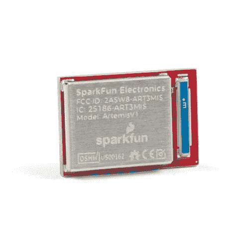](https://www.sparkfun.com/products/15484) 

将**添加到您的[购物车](https://www.sparkfun.com/cart)中！**

### [SparkFun Artemis 模块-低功耗机器学习 BLE Cortex-M4F](https://www.sparkfun.com/products/15484)

[In stock](https://learn.sparkfun.com/static/bubbles/ "in stock") WRL-15484

SparkFun 的 Artemis 模块是第一款经 FCC 认证的开源 Cortex-M4F，支持 BLE 5.0，运行频率高达 96MHz，并具有…

$9.95[Favorited Favorite](# "Add to favorites") 17[Wish List](# "Add to wish list")** **[https://www.youtube.com/embed/sthuUZOTQ-U/?autohide=1&border=0&wmode=opaque&enablejsapi=1](https://www.youtube.com/embed/sthuUZOTQ-U/?autohide=1&border=0&wmode=opaque&enablejsapi=1)

### 所需材料

为了跟随本教程，您需要以下 Artemis 载板之一，如 [RedBoard](https://www.sparkfun.com/products/15444) 、 [RedBoard Nano](https://www.sparkfun.com/products/15443) 或 [RedBoard ATP](https://www.sparkfun.com/products/15442) 和 USB C 电缆。

[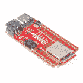](https://www.sparkfun.com/products/15443) 

将**添加到您的[购物车](https://www.sparkfun.com/cart)中！**

### [SparkFun RedBoard Artemis Nano](https://www.sparkfun.com/products/15443)

[In stock](https://learn.sparkfun.com/static/bubbles/ "in stock") DEV-15443

RedBoard Artemis Nano 是 Artemis 模块的一个微型的多功能实现。

$16.506[Favorited Favorite](# "Add to favorites") 50[Wish List](# "Add to wish list")****[](https://www.sparkfun.com/products/15444) 

将**添加到您的[购物车](https://www.sparkfun.com/cart)中！**

### [SparkFun RedBoard Artemis](https://www.sparkfun.com/products/15444)

[In stock](https://learn.sparkfun.com/static/bubbles/ "in stock") DEV-15444

RedBoard Artemis 采用 SparkFun 的功能强大的 Artemis 模块，并将其包装在一个易于使用和熟悉的环境中…

$21.509[Favorited Favorite](# "Add to favorites") 32[Wish List](# "Add to wish list")****[](https://www.sparkfun.com/products/15442) 

将**添加到您的[购物车](https://www.sparkfun.com/cart)中！**

### [spark fun RedBoard Artemis ATP](https://www.sparkfun.com/products/15442)

[32 available](https://learn.sparkfun.com/static/bubbles/ "32 available") DEV-15442

RedBoard Artemis ATP 有 48 个 GPIO，该板以 Arduino Mega 格式将它们全部分开。

$26.951[Favorited Favorite](# "Add to favorites") 17[Wish List](# "Add to wish list")****[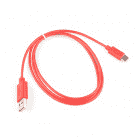](https://www.sparkfun.com/products/retired/15092) 

### [USB 2.0 线 A 到 C - 3 脚](https://www.sparkfun.com/products/retired/15092)

[Retired](https://learn.sparkfun.com/static/bubbles/ "Retired") CAB-15092

USB C 棒极了。但是，在我们将所有的集线器、充电器和端口转换为 USB C 之前，这是您要使用的电缆…

**Retired**[Favorited Favorite](# "Add to favorites") 8[Wish List](# "Add to wish list")****** ******### 推荐阅读

如果您不熟悉以下概念，我们建议您在继续之前查看这些教程。

[](https://learn.sparkfun.com/tutorials/installing-an-arduino-library) [### 安装 Arduino 库](https://learn.sparkfun.com/tutorials/installing-an-arduino-library) How do I install a custom Arduino library? It's easy! This tutorial will go over how to install an Arduino library using the Arduino Library Manager. For libraries not linked with the Arduino IDE, we will also go over manually installing an Arduino library.[Favorited Favorite](# "Add to favorites") 22[](https://learn.sparkfun.com/tutorials/installing-arduino-ide) [### 安装 Arduino IDE](https://learn.sparkfun.com/tutorials/installing-arduino-ide) A step-by-step guide to installing and testing the Arduino software on Windows, Mac, and Linux.[Favorited Favorite](# "Add to favorites") 16[](https://learn.sparkfun.com/tutorials/designing-with-the-sparkfun-artemis) [### 用 SparkFun Artemis 设计](https://learn.sparkfun.com/tutorials/designing-with-the-sparkfun-artemis) Let's chat about layout and design considerations when using the Artemis module.[Favorited Favorite](# "Add to favorites") 4

## Arduino 安装

有了 Arduino [板管理器](https://www.arduino.cc/en/Guide/Cores)，在 Arduino IDE 中安装新的板支持变得轻而易举！

**Note:** This example assumes you are using the latest version of the Arduino IDE on your desktop. If this is your first time using Arduino, please review our tutorial on [installing the Arduino IDE.](https://learn.sparkfun.com/tutorials/installing-arduino-ide) If you have not previously installed an Arduino library, please check out our [installation guide.](https://learn.sparkfun.com/tutorials/installing-an-arduino-library)

### 为 Apollo3 安装 Arduino 核心

我们已经为 Apollo3 从头开始构建了 Arduino 核心，尽可能地使其轻便易用。

要安装 SparkFun Apollo3 Arduino 核心:

*   打开 Arduino IDE(必须是 v1.6.12 或更高版本)
*   导航到**首选项**[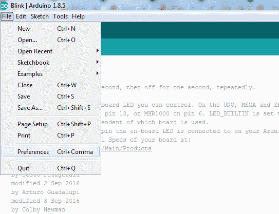](https://cdn.sparkfun.com/assets/learn_tutorials/9/1/1/Arduino-Preferences.png) 

*Having a hard time seeing? Click the image for a closer look.*

*   在“附加 Board Manager URL”框中，添加

    ```
    language:c
    https://raw.githubusercontent.com/sparkfun/Arduino_Apollo3/main/package_sparkfun_apollo3_index.json 
    ```

[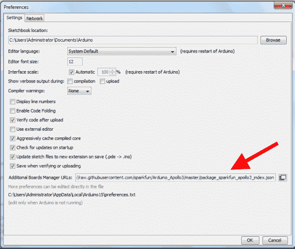](https://cdn.sparkfun.com/assets/learn_tutorials/9/1/1/Arduino-BoardMgrURLs_2.png)*Having a hard time seeing? Click the image for a closer look.*

*   进入**工具** > **板卡**，选择**板卡管理器**

[](https://cdn.sparkfun.com/assets/learn_tutorials/9/1/1/Arduino-BoardsManager.png)*Having a hard time seeing? Click the image for a closer look.*

*   搜索“阿波罗”，应该会找到 **SparkFun 阿波罗 3** 板包。
*   确保选择了最新版本，然后点击**安装**

[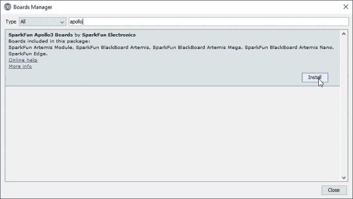](https://cdn.sparkfun.com/assets/learn_tutorials/9/1/1/SparkFun-Arduino-Apollo3-Boards-Install.jpg)*Having a hard time seeing? Click the image for a closer look.*

安装可能需要几分钟——安装中包括 Arduino 核心和 Apollo3 库的所有必要源文件，加上所有编译器和软件上传工具，您将需要使用 Arduino 的 Artemis。

一旦安装了板定义，您应该在工具>板菜单下看到一组新的 Artemis 板。

[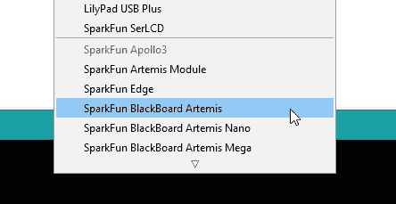](https://cdn.sparkfun.com/assets/learn_tutorials/9/1/1/SparkFun-Arduino-Apollo3-Boards-List.jpg)**Note:** The image here shows the SparkFun BlackBoard Artemis and is out of date. The [latest version of the SparkFun Apollo3 Arduino Core](https://github.com/sparkfun/Arduino_Apollo3) will have selections for the SparkFun RedBoard Artemis, Nano and ATP versions.

## 示例:向上眨眼！

眨眼的例子是最基本的。但它也是一个很好的基准，可以确保您已经正确安装了核心，并且可以将代码上传到您的模块。要运行此示例，请从板管理器下拉菜单中选择您的板，并选择正确的 USB 端口。您可以通过点击**文件- >示例- > 01 来加载 blink 示例。基础知识- >眨眼**。

[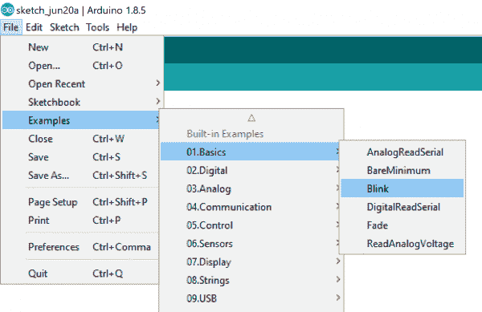](https://cdn.sparkfun.com/assets/learn_tutorials/9/1/1/ArtemisBlinkItUp.png)

点击上传按钮，享受闪闪发光的好处！

[](https://cdn.sparkfun.com/assets/learn_tutorials/9/1/1/BlackBoard_Artemis.gif)*Look at all the blinky!*

## 示例:所有功能

我们已经为阿尔特弥斯建造了 Arduino 核心。一定要检查大量的内置例子。你可以在**文件- >示例->‘阿耳忒弥斯示例’**下找到它们。

[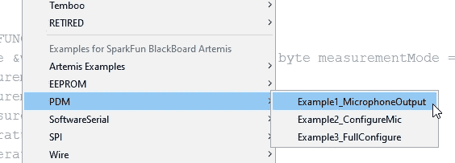](https://cdn.sparkfun.com/assets/learn_tutorials/9/1/1/Artemis-I2C-Examples-FullMenu.jpg)*Click above image for full menu context*

我们已经有了设置多个 I2C 端口的例子(非常简单)，写入 EEPROM，使用软件串行(所有 48 个引脚都可以是串行的！)，使用板载麦克风，并使用伺服(高达 32！).我们一直在添加更多内容，所以请确保您的核心保持最新。

## 引导加载程序选项

每个阿耳忒弥斯都预装了两个引导装载器。SparkFun 变量引导加载程序(SVL)将允许您可靠而方便地加载新代码，数据速率高达 921600bps。除了 SVL，我们还为安全引导应用启用了 Ambiq 工厂引导加载程序。几乎所有用户都应该使用 SparkFun 变量引导程序，忘记 [Ambiq](https://ambiq.com/) 工厂引导程序。欲了解更多信息，请查看[用 Artemis 模块设计](https://learn.sparkfun.com/tutorials/designing-with-the-sparkfun-artemis#programming)教程的编程部分。不要担心——你不能用不正确的引导装载程序损坏或损坏你的 Artemis。

[](https://cdn.sparkfun.com/assets/learn_tutorials/9/0/9/SparkFun_Artemis_Core-Bootloading_Type.jpg)*Don't select Ambiq Secure Bootloader unless you know what you're doing*

## 超越阿杜伊诺

SparkFun Apollo3 内核支持所有[标准 Arduino 功能](https://www.arduino.cc/reference/en/)。这意味着您可以对串行监视器的`digitalWrite` I/O、`analogRead` ADC 引脚、`Serial`打印进行编程，使用`Serial1`与硬件串行交互，甚至使用 Wire 和 SPI 库执行更复杂的 I ² C 或 SPI 写操作。基础知识已经有了，所以让我们深入了解 Artemis 的一些更高级的功能！

Ambiq 开发了一个软件开发包来充分发挥 Apollo3 的功能。 [Ambiq SDK](https://ambiqmicro.com/static/mcu/files/AmbiqSuite-Rel2.1.0.zip) 包含了大量的例子，展示了 Apollo3 各种不可思议的方面。每个示例都使用了不同的函数，如下所示:

[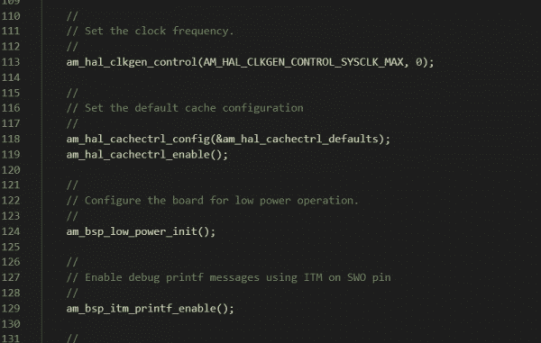](https://cdn.sparkfun.com/assets/learn_tutorials/9/1/1/Ambiq-SDK-HAL.jpg)

这些长期命名的功能是所谓的硬件抽象层的一部分。我们现在不打算进入设置或使用 SDK 的细节，但只知道 SparkFun Arduino Apollo3 核心是建立在这个 HAL 之上的，这意味着你可以在 Arduino 环境中直接调用 HAL 函数。

```
language:c
// Clear the RTC alarm interrupt.
am_hal_rtc_int_clear(AM_HAL_RTC_INT_ALM); 
```

[](https://cdn.sparkfun.com/assets/learn_tutorials/9/1/1/Ambiq_HAL_inside_Arduino_IDE.jpg)

对于高级用户来说，这是一个强大的工具；您可以使用内置的 Arduino 函数，如 Serial.begin(9600)和 delay(100)，同时集成更高级的 HAL 函数来控制中断等事情。

如果您决定深入研究 SDK，请前往我们的[使用 spark fun Edge Board with Ambiq Apollo 3 SDK](https://learn.sparkfun.com/tutorials/using-sparkfun-edge-board-with-ambiq-apollo3-sdk/all)教程了解更多信息！

[](https://learn.sparkfun.com/tutorials/using-sparkfun-edge-board-with-ambiq-apollo3-sdk) [### 将 SparkFun Edge 板与 Ambiq Apollo3 SDK 配合使用

#### 2019 年 3 月 28 日](https://learn.sparkfun.com/tutorials/using-sparkfun-edge-board-with-ambiq-apollo3-sdk) We will demonstrate how to get started with your SparkFun Edge Board by setting up the toolchain on your computer, examining an example program, and using the serial uploader tool to flash the chip.[Favorited Favorite](# "Add to favorites") 7

## 解决纷争

**Need help?**

If your product is not working as you expected or you need technical assistance or information, head on over to the [SparkFun Technical Assistance](https://www.sparkfun.com/technical_assistance) page for some initial troubleshooting.

If you don't find what you need there, the [SparkFun Forums](https://forum.sparkfun.com/index.php) are a great place to find and ask for help. If this is your first visit, you'll need to [create a Forum Account](https://forum.sparkfun.com/ucp.php?mode=register) to search product forums and post questions.

[**SparkFun Artemis Forums**](https://forum.sparkfun.com/viewforum.php?f=163)

## 资源和更进一步

*   想在自己的设计中实现 Artemis 模块吗？查看使用 Artemis 模块进行设计的教程[以及](https://learn.sparkfun.com/tutorials/designing-with-the-sparkfun-artemis) [Artemis 集成指南](https://cdn.sparkfun.com/assets/learn_tutorials/9/0/9/Artemis_Integration_Guide.pdf)。
*   你更喜欢 make 文件和 IDE 吗？查看如何设置 Ambiq Apollo3 SDK 的教程。

最后，Artemis 已经过设计，并被证明可以与我们所有的 [50+ Qwiic 板](https://www.sparkfun.com/qwiic)配合使用。请务必检查并通过插入传感器和输出获得灵感，您需要构建一些令人惊叹的东西！

[](https://www.sparkfun.com/products/15423) 

将**添加到您的[购物车](https://www.sparkfun.com/cart)中！**

### [spark fun Qwiic Micro-samd 21 开发板](https://www.sparkfun.com/products/15423)

[In stock](https://learn.sparkfun.com/static/bubbles/ "in stock") DEV-15423

SparkFun Qwiic Micro 的成型符合我们的标准 1" x 1" Qwiic 板尺寸，这使它成为我们最小的 SAMD21 微控制器…

$22.505[Favorited Favorite](# "Add to favorites") 18[Wish List](# "Add to wish list")****[](https://www.sparkfun.com/products/15805) 

将**添加到您的[购物车](https://www.sparkfun.com/cart)中！**

### [【spark fun 高精度温度传感器- TMP117 (Qwiic)](https://www.sparkfun.com/products/15805)

[In stock](https://learn.sparkfun.com/static/bubbles/ "in stock") SEN-15805

SparkFun Qwiic TMP117 Breakout 是一款配有 I2C 接口的高精度温度传感器。

$14.954[Favorited Favorite](# "Add to favorites") 29[Wish List](# "Add to wish list")****[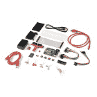](https://www.sparkfun.com/products/16388) 

### [SparkFun 树莓 Pi 4 硬件入门套件- 4GB](https://www.sparkfun.com/products/16388)

[Out of stock](https://learn.sparkfun.com/static/bubbles/ "out of stock") KIT-16388

SparkFun Raspberry Pi 4 硬件入门套件提供了一套可靠的部件和说明，用于在一个

[Favorited Favorite](# "Add to favorites") 8[Wish List](# "Add to wish list")[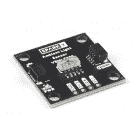](https://www.sparkfun.com/products/18981) 

将**添加到您的[购物车](https://www.sparkfun.com/cart)中！**

### [](https://www.sparkfun.com/products/18981)

[Out of stock](https://learn.sparkfun.com/static/bubbles/ "out of stock") SPX-18981

寻找一个可以直接以勒克斯为单位测量环境光线水平的 Qwiic 传感器？就是这个！VEML7700 是一个高交流…

$5.95[Favorited Favorite](# "Add to favorites") 6[Wish List](# "Add to wish list")**************