# AT42QT101X 电容式触摸分线架连接指南

> 原文：<https://learn.sparkfun.com/tutorials/at42qt101x-capacitive-touch-breakout-hookup-guide>

## 介绍

如果你需要在不使用按钮的情况下添加用户输入，那么电容式触摸界面可能是答案。AT42QT1010 的[和 AT42QT1011](https://www.sparkfun.com/products/12041) 的[电容式触摸分线板提供一个带有易于使用的数字 I/O 引脚的电容式触摸按钮。为方便起见，我将该板的两个版本都称为“AT42QT101X ”,但在讨论它们的差异时，我将分别提到每个版本。](https://www.sparkfun.com/products/14520)

[](https://www.sparkfun.com/products/12041) 

将**添加到您的[购物车](https://www.sparkfun.com/cart)中！**

### [SparkFun 电容式触摸分线点- AT42QT1010](https://www.sparkfun.com/products/12041)

[In stock](https://learn.sparkfun.com/static/bubbles/ "in stock") SEN-12041

如果你需要在不使用按钮的情况下添加用户输入，那么电容式触摸界面可能是答案。AT42QT1010 S…

$8.5010[Favorited Favorite](# "Add to favorites") 22[Wish List](# "Add to wish list")****[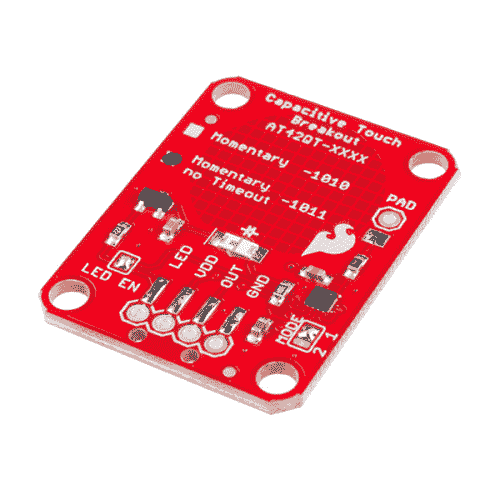](https://www.sparkfun.com/products/14520) 

将**添加到您的[购物车](https://www.sparkfun.com/cart)中！**

### [SparkFun 电容式触摸分线点- AT42QT1011](https://www.sparkfun.com/products/14520)

[Out of stock](https://learn.sparkfun.com/static/bubbles/ "out of stock") SEN-14520

如果你需要在不使用按钮的情况下添加用户输入，那么电容式触摸界面可能是答案。AT42QT1011 S…

$6.507[Favorited Favorite](# "Add to favorites") 12[Wish List](# "Add to wish list")**** ****AT42QT101X 是一款专用的单键电容检测芯片。该芯片负责监控触摸的导电区域。只要检测到触摸(例如手指触摸)，AT42QT101X 就会保持输出线为高电平。否则，该线保持低电平。你只需要提供一个电源(1.8V - 5V)和地，AT42QT101X 就可以工作了。SparkFun 的分线板包含一个能够检测触摸的板载电极。此外，如果您想创建自己的外部电极，可以使用焊盘引脚。

[https://www.youtube.com/embed/g9hCk5EB_64/?autohide=1&border=0&wmode=opaque&enablejsapi=1](https://www.youtube.com/embed/g9hCk5EB_64/?autohide=1&border=0&wmode=opaque&enablejsapi=1)

### 本教程涵盖的内容

本教程将向您展示如何将 AT42QT101X 分线板连接到 Arduino，并提供一些示例代码来读取板的输出。此外，还将展示使用该板的其他方法，例如将其安装到丙烯酸板上，并创建自己的电容式感应垫。

### 所需材料

*   一个 [AT42QT1010](https://www.sparkfun.com/products/12041) 或 [AT42QT1011](https://www.sparkfun.com/products/14520) 电容式触摸分线板
*   [RedBoard](https://www.sparkfun.com/products/13975) 或任何 [Arduino 兼容](https://www.sparkfun.com/categories/242)板。
*   [4 针 SMD 公接头](https://www.sparkfun.com/products/12638)或[PTH 公接头](https://www.sparkfun.com/products/116)使电路板与试验板兼容。
*   [跳线](https://www.sparkfun.com/products/11026)从试验板连接到 Arduino。
*   将所有东西连接在一起的试验板。

### 推荐阅读

[](https://learn.sparkfun.com/tutorials/how-to-solder-through-hole-soldering) [### 如何焊接:通孔焊接](https://learn.sparkfun.com/tutorials/how-to-solder-through-hole-soldering) This tutorial covers everything you need to know about through-hole soldering.[Favorited Favorite](# "Add to favorites") 70[](https://learn.sparkfun.com/tutorials/working-with-wire) [### 使用导线](https://learn.sparkfun.com/tutorials/working-with-wire) How to strip, crimp, and work with wire.[Favorited Favorite](# "Add to favorites") 50[](https://learn.sparkfun.com/tutorials/what-is-an-arduino) [### 什么是 Arduino？](https://learn.sparkfun.com/tutorials/what-is-an-arduino) What is this 'Arduino' thing anyway? This tutorials dives into what an Arduino is and along with Arduino projects and widgets.[Favorited Favorite](# "Add to favorites") 50[](https://learn.sparkfun.com/tutorials/button-and-switch-basics) [### 按钮和开关基础知识](https://learn.sparkfun.com/tutorials/button-and-switch-basics) A tutorial on electronics' most overlooked and underappreciated component: the switch! Here we explain the difference between momentary and maintained switches and what all those acronyms (NO, NC, SPDT, SPST, ...) stand for.[Favorited Favorite](# "Add to favorites") 53[](https://learn.sparkfun.com/tutorials/light-emitting-diodes-leds) [### 发光二极管](https://learn.sparkfun.com/tutorials/light-emitting-diodes-leds) Learn the basics about LEDs as well as some more advanced topics to help you calculate requirements for projects containing many LEDs.[Favorited Favorite](# "Add to favorites") 67[](https://learn.sparkfun.com/tutorials/capacitors) [### 电容器](https://learn.sparkfun.com/tutorials/capacitors) Learn about all things capacitors. How they're made. How they work. How they look. Types of capacitors. Series/parallel capacitors. Capacitor applications.[Favorited Favorite](# "Add to favorites") 84

## 硬件概述

如果我们看电路板的正面，我们会看到一个大的圆形焊盘(“电极”)和几个引脚。只要电路板通电，用手指按压时，板载电极就会检测到触摸。

[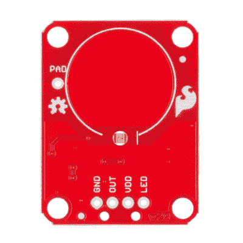](https://cdn.sparkfun.com/assets/learn_tutorials/7/2/2/12401-SparkFun_Capacitive_Touch_Breakout_-_AT42QT1010-03.jpg)*AT42QT101X Breakout front*

**GND** 应连接到主机电路的地。

[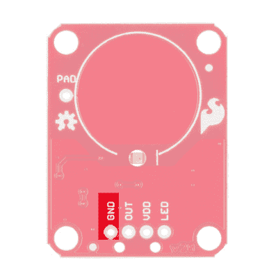](https://cdn.sparkfun.com/assets/learn_tutorials/7/2/2/12401-SparkFun_Capacitive_Touch_Breakout_-_AT42QT101X_GND.jpg)

**OUT** 是 AT42QT101X 的输出。触摸时为高，否则为低。

[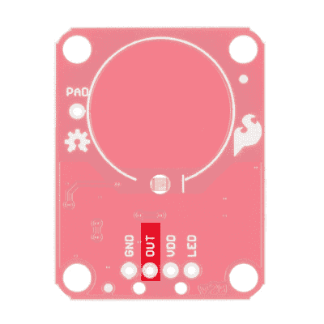](https://cdn.sparkfun.com/assets/learn_tutorials/7/2/2/12401-SparkFun_Capacitive_Touch_Breakout_-_AT42QT101X_OUT.jpg)

**VDD** 是 AT42QT101X 的电源，需要接在 **1.8V - 5V** 之间的电压上。

[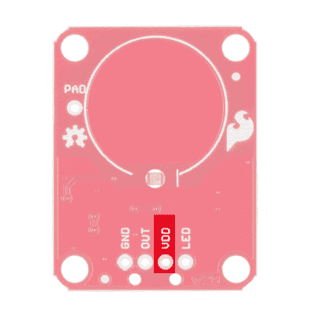](https://cdn.sparkfun.com/assets/learn_tutorials/7/2/2/12401-SparkFun_Capacitive_Touch_Breakout_-_AT42QT101X_VDD.jpg)

**LED** 控制车载 LED 的运行。默认情况下，它连接到 OUT 引脚。如果您将背面的“LED Enable”跳线脱焊，您可以独立控制 LED。

[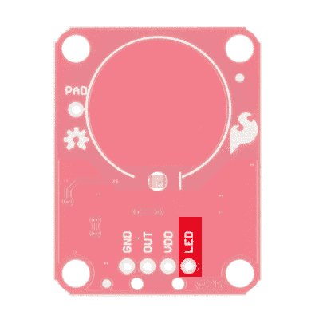](https://cdn.sparkfun.com/assets/learn_tutorials/7/2/2/12401-SparkFun_Capacitive_Touch_Breakout_-_AT42QT101X_LED.jpg)

**PAD** 位于左上角，允许您连接外部电极。请注意，焊盘引脚孔旁边的背面有一个小型表面贴装焊盘。如果希望电路板齐平安装，可以将一根导线直接焊接到表面贴装焊盘上。

[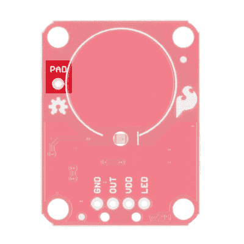](https://cdn.sparkfun.com/assets/learn_tutorials/7/2/2/12401-SparkFun_Capacitive_Touch_Breakout_-_AT42QT101X_PAD.jpg)

### 它是如何工作的

看看 AT42QT101X 的背面。两个版本的 PCB 布局完全相同，但 IC 不同(右下“1011”)。

[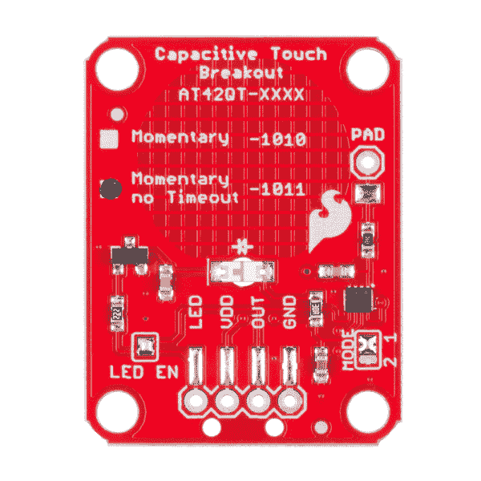](https://cdn.sparkfun.com/assets/learn_tutorials/7/2/2/14520-SparkFun_Capacitive_Touch_Breakout_-_AT42QT1011-04.jpg)*AT42QT1011 Breakout Back*

AT42QT101X 芯片位于电路板的右侧。它使用一个电阻和一个电容网络来调节电极的灵敏度。高频脉冲被发送到衬垫。当一个多肉的物体(如手指)靠近垫子时，它就像一个非常小的电容器一样，改变了脉冲的形状。当 AT42QT101X 检测到这些微小变化时，它会将 OUT 线提高到高电平，表示存在触摸。输出的持续时间取决于所安装的芯片。一旦脉冲恢复正常，AT42QT101X 会将 OUT 线拉低。

#### AT42QT1010 与 AT42QT1011

您的芯片版本由背面的小复选框表示。我们提供同一芯片的两个版本:AT42QT1010 和 AT42QT1011。两种板的功能相同，但有一点需要注意:AT42QT1010 的内部超时时间约为 60 秒，而 AT42QT1011 没有。也就是说，如果你将手指放在 AT42QT1010 的焊盘上超过 60 秒，电路板的 OUT 引脚将变低(自动关闭)。这种差别很小，但可能会改变游戏规则，这取决于项目的用途。

**Note:** Depending on your power supply, the AT42QT-*1011* IC may not stay on indefinitely when powering your microcontroller with less reliable wall warts. If your sensor is not operating as expected, try powering your microcontroller through your computer's USB ports or other more steady power supplies.

#### LED 使能

AT42QT101X 的输出直接进入电路板上的 OUT 引脚以及晶体管(左侧)，后者控制 LED(电路板中央)。默认情况下，OUT 线和 LED 线是相连的，这意味着在触摸时，板上 LED 会亮起。您可以通过拆除标有“LED Enable”的跳线来断开 LED 这将导致 LED 在触摸时不再亮起，但您仍然可以使用电路板上的 LED 引脚来驱动 LED。

#### 方式

在电路板的右侧，您还会注意到一个标有“模式”的跳线，带有“1”和“2”标记。默认情况下，中间焊盘和“1”焊盘相连，使 AT42QT101X 处于“快速”模式。在快速模式下，芯片对触摸事件的响应更快，但在正常操作中消耗 **200 A - 750 A** 。如果您将此跳线脱焊，并将中心焊盘连接到“2”焊盘，AT42QT101X 将处于“低功耗”模式。在这种模式下，芯片对事件的响应稍差，但只使用 **15 A - 75 A** 。请记住，IC 本身的电流消耗。led 消耗另一个 30-40mA 的电流，但是可以通过从“LED 使能”焊接跳线移除焊料来禁用。

## 硬件连接

### 装配

如果你不打算将电路板平齐安装到面板上，你可以将[导线](https://www.sparkfun.com/products/11375)或[断开接头](https://www.sparkfun.com/products/116)焊接到电路板的 4 个接头孔上。

[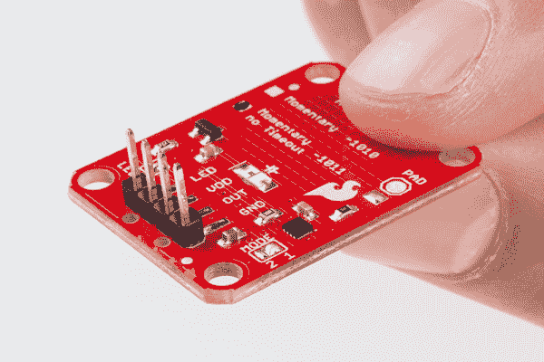](https://cdn.sparkfun.com/assets/learn_tutorials/7/2/2/Capacitive_Touch_Breakout_Tutorial_Updates-02.jpg)*PTH headers are recommended if you are using a breadboard.*

另一方面，如果您希望将 AT42QT101X 安装到面板上，您可以将一个 [4 针插头](https://www.sparkfun.com/products/12638)焊接到 SMD 焊盘上。

[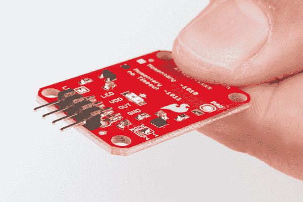](https://cdn.sparkfun.com/assets/learn_tutorials/7/2/2/Capacitive_Touch_Breakout_Tutorial_Updates-01.jpg)*SMD headers work better if you plan to mount the board to a panel*

### 连接 AT42QT101X 分线板

[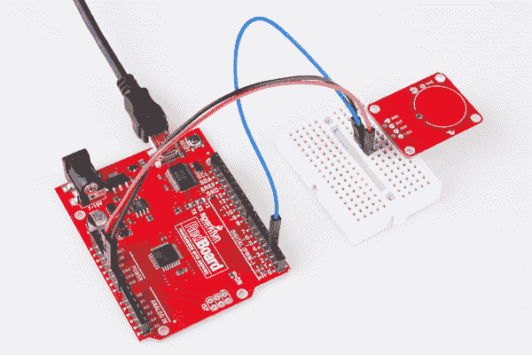](https://cdn.sparkfun.com/assets/learn_tutorials/7/2/2/Breakout_to_Arduino_1.jpg)*Basic hookup using an Arduino and a breadboard*

对于 Arduino，使用跳线进行以下连接:

| AT42QT101X | 阿尔杜伊诺 |
| VDD | 5V |
| 在外 | Two |
| GND | GND |

### 安装 AT42QT101X 分线板

电容式触摸板的一个优点是能够安装到面板上，并通过薄塑料、纸板等检测触摸。使用钻孔机或激光切割机，以与分线板上的安装孔相同的模式切割四个 0.125 英寸的孔。

使用 [#4-40 螺钉](https://www.sparkfun.com/products/10452)和 [#4-40 螺母](https://www.sparkfun.com/products/10454)将电路板固定到面板上。

[](https://cdn.sparkfun.com/assets/learn_tutorials/7/2/2/through_Plexi.jpg)*The AT42QT101X will detect touch through 0.125 inch acrylic*

### 外部电极

您可以使用箔、铜带或任何其他导电材料制作自己的电极。切割或成形电极，并在电极和 AT42QT101X 分线板上的焊盘引脚之间连接一根电线。为了确保安全连接，请确保将外部电极焊接在一起。电极几乎可以是任何形状和尺寸。

[](https://cdn.sparkfun.com/assets/learn_tutorials/7/2/2/Capacitive_Touch_Breakout_Tutorial_Updates-03.jpg)*Touch can be detected on external electrodes*

## 示例代码

**注意:**此示例假设您在桌面上使用的是最新版本的 Arduino IDE。如果这是你第一次使用 Arduino，请回顾我们关于[安装 Arduino IDE 的教程。](https://learn.sparkfun.com/tutorials/installing-arduino-ide)

打开 Arduino 程序，将以下代码粘贴到草图中:

```
language:c
/*
 12-23-2013
 SparkFun Electronics 2013
 Shawn Hymel

 This code is public domain but you buy me a beer if you use this 
 and we meet someday (Beerware license).

 Description:

 This sketch shows how to use the SparkFun AT42QT101X Breakout
 Board. If you touch the Capacitive Touch area on the breakout
 board, the LED attached to the Arduino will light up (in addition
 to the LED on the AT42QT101X breakout board).

 Simply connect power and ground to the breakout board,
 and the AT42QT101X handles all the capacitive touch functions.
 By default, the board will light up the green LED when the pad
 is touched. A wire may also be connected from OUT on the
 breakout board to a digital input pin on an Arduino. This signal
 is normally LOW but goes HIGH on a touch detection. 

 The "LED Enable" solder jumper may be de-soldered in order to
 control the LED directly from the LED pin. This is useful if you
 want to light up a button that the user needs to push.

 Hardware connections:

 Uno Pin    AT42QT101X Board  Function

 +5V        VDD               Power supply
 GND        GND               Ground
 2          OUT               Capacitive touch state output
 */

// Constants
const int TOUCH_BUTTON_PIN = 2;  // Input pin for touch state
const int LED_PIN = 13;          // Pin number for LED

// Global Variables
int buttonState = 0;             // Variable for reading button

void setup() {

  // Configure button pin as input 
  pinMode(TOUCH_BUTTON_PIN, INPUT);

  // Configure LED pin as output
  pinMode(LED_PIN, OUTPUT);

}

void loop() {

  // Read the state of the capacitive touch board
  buttonState = digitalRead(TOUCH_BUTTON_PIN);

  // If a touch is detected, turn on the LED
  if (buttonState == HIGH) {
    digitalWrite(LED_PIN, HIGH);
  } else {
    digitalWrite(LED_PIN, LOW);
  }
} 
```

插入 Arduino 并上传代码。当您触摸电极时，您应该会看到 AT42QT101X 板上的 LED 和 Arduino 上的 LED 亮起。

[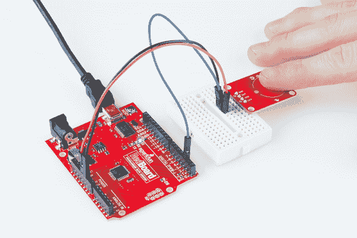](https://cdn.sparkfun.com/assets/learn_tutorials/7/2/2/Breakout_to_Arduino_and_Finger.jpg)*The AT42QT101X detects touches, and the Arduino monitors pin 2 for the output of the AT42QT101X.*

## 资源和更进一步

现在，您已经成功启动并运行了电容式触摸突破，是时候将它纳入您自己的项目了！

如欲了解有关该主板的更多信息，请查看以下资源:

*   [示意图](https://cdn.sparkfun.com/assets/8/4/0/c/0/AT42QT101X_Capacitive_Touch_Breakout.pdf)
*   [老鹰档案](https://cdn.sparkfun.com/assets/0/f/e/b/2/AT42QT101X_Capacitive_Touch_Breakout_1.zip)
*   [AT42QT1010 数据表](https://cdn.sparkfun.com/assets/5/2/e/d/d/40001946A.pdf)
*   [AT42QT1011 数据表](https://cdn.sparkfun.com/assets/6/5/f/2/1/AT42QT1011_DS.pdf)
*   [SparkFun 产品展示区](https://youtu.be/g9hCk5EB_64)
*   [GitHub 库](https://github.com/sparkfun/AT42QT1010_Capacitive_Touch_Breakout)

AT42QT101X 是将单个电容式触摸按钮添加到项目的绝佳方式。你的下一个项目需要一些灵感吗？查看这些教程中的一些想法:

*   为[发光框](https://learn.sparkfun.com/tutorials/quick-illuminated-boxes)创建一个隐藏按钮。
*   为[不确定的 7-Cube](https://learn.sparkfun.com/tutorials/the-uncertain-7-cube) 用电容式触摸按钮替换震动唤醒模块
*   添加一个隐藏的，电容触摸按钮几乎任何东西！

你也可以用晶体管和电容式触摸传感器代替瞬时按钮，就像[交互式 3D 打印发光钻石道具项目](https://learn.sparkfun.com/tutorials/interactive-3d-printed-lit-diamond-prop):

[](https://learn.sparkfun.com/tutorials/interactive-3d-printed-led-diamond-prop) [### 互动 3D 打印 LED 钻石道具

#### 2018 年 4 月 19 日](https://learn.sparkfun.com/tutorials/interactive-3d-printed-led-diamond-prop) In this tutorial, we will learn about how to create an interactive theatrical prop for a performance by 3D printing a translucent diamond prop using a non-addressable RGB LED strip and AT42QT1011 capacitive touch sensing.[Favorited Favorite](# "Add to favorites") 5

或者看看下面的博客文章，了解更多的想法。

[](https://www.sparkfun.com/news/2146 "July 19, 2016: Building a set of speakers from goat skin and connecting them to a network media server") [### t:树莓派和立体声阿卡那

July 19, 2016](https://www.sparkfun.com/news/2146 "July 19, 2016: Building a set of speakers from goat skin and connecting them to a network media server")[Favorited Favorite](# "Add to favorites") 1[](https://www.sparkfun.com/news/2939 "June 6, 2019: How the night was won!") [### Enginursday: DIY 电容式触摸小夜灯

June 6, 2019](https://www.sparkfun.com/news/2939 "June 6, 2019: How the night was won!")[Favorited Favorite](# "Add to favorites") 5****