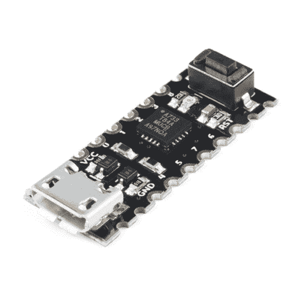
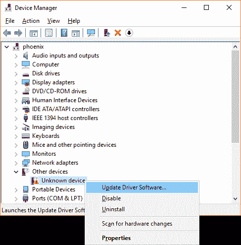
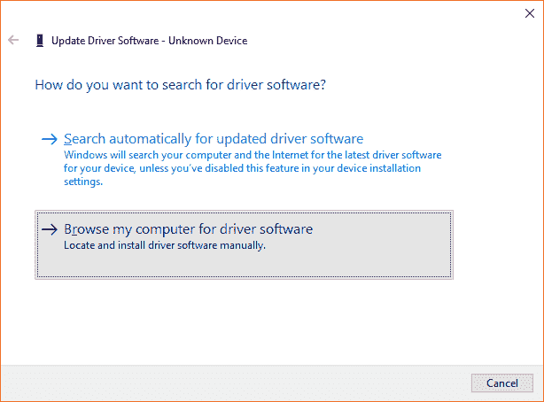
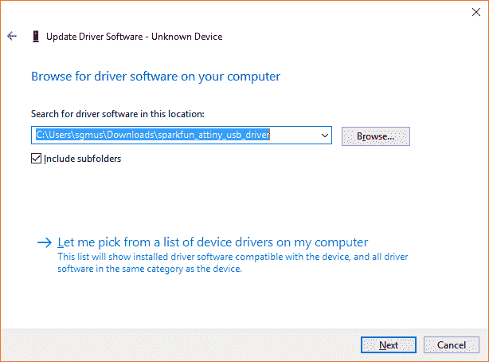
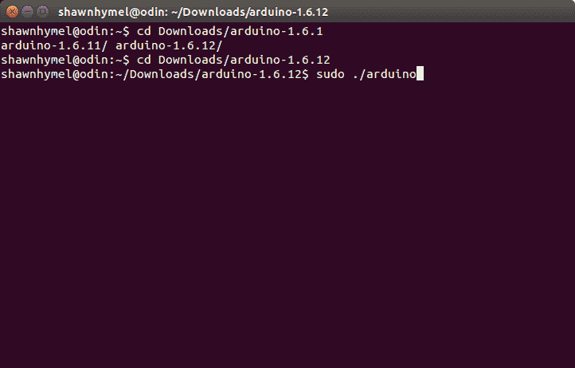
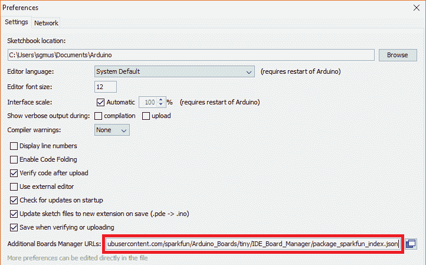
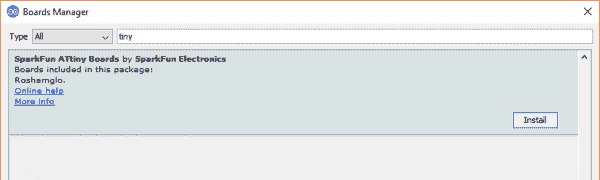
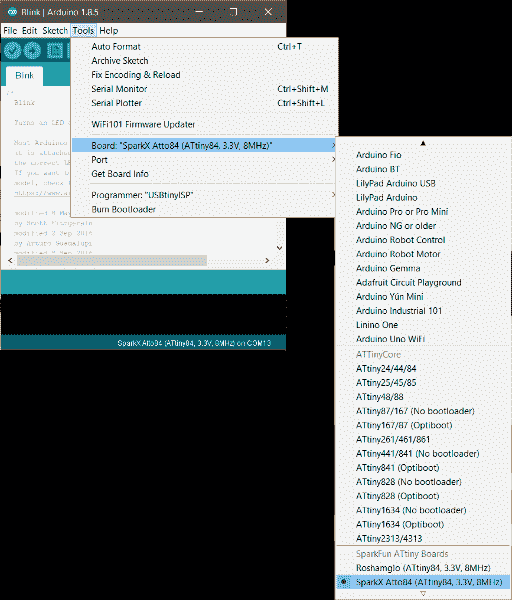

# Atto84 连接指南

> 原文：<https://learn.sparkfun.com/tutorials/atto84-hookup-guide>

## 简介:最小的杜伊诺

[](https://www.sparkfun.com/sparkx)
**Experimental Products:** [SparkX products](https://www.sparkfun.com/sparkx) are rapidly produced to bring you the most cutting edge technology as it becomes available. These products are tested but come with no guarantees. Live technical support is not available for SparkX products.

Arduino 和 Arduino 兼容的开发板是快速开发创意的绝佳工具，但作为开发板，它们通常比您真正需要的体积更大、功能更全。不过，拥有一个 USB 接口和一个引导加载程序是非常好的，所以我们将最基本的 Arduino 兼容突破整合到您的小项目中。我们称之为 [Atto84](https://www.sparkfun.com/products/14804) 。

[](https://www.sparkfun.com/products/retired/14804) 

### [Atto84 带 Arduino 引导程序](https://www.sparkfun.com/products/retired/14804)

[Retired](https://learn.sparkfun.com/static/bubbles/ "Retired") SPX-14804

Arduino 和 Arduino 兼容的开发板是快速开发一个想法的极好工具，但是，作为开发板，开发板的成本很高。

5 **Retired**[Favorited Favorite](# "Add to favorites") 14[Wish List](# "Add to wish list")

Atto84 本质上是绝对分钟 WQFN ATtiny84 的分线板，但我们做了一些工作使其更容易编程。首先，我们为 ATtiny 添加了一个微型 USB 连接器和一个基于固件的 USB 驱动程序，允许您通过 USB 对芯片进行编程。此外，我们还创建了一个 Arduino 板配置文件，将此引导加载程序与功能极其全面的 ATtiny Arduino 内核相结合。

只需在计算机上安装 USB 驱动程序，从 Arduino 的开发板管理器中选择开发板配置文件，然后像任何其他 Arduino 风格的开发板一样将代码上传到该开发板。在这个连接指南中，你将学习如何做到这一点！

### 推荐阅读

如果您不熟悉以下概念，我们建议您查看这些教程。

[](https://learn.sparkfun.com/tutorials/serial-peripheral-interface-spi) [### 串行外设接口(SPI)](https://learn.sparkfun.com/tutorials/serial-peripheral-interface-spi) SPI is commonly used to connect microcontrollers to peripherals such as sensors, shift registers, and SD cards.[Favorited Favorite](# "Add to favorites") 91[](https://learn.sparkfun.com/tutorials/i2c) [### I2C](https://learn.sparkfun.com/tutorials/i2c) An introduction to I2C, one of the main embedded communications protocols in use today.[Favorited Favorite](# "Add to favorites") 128[](https://learn.sparkfun.com/tutorials/how-to-solder-castellated-mounting-holes) [### 如何焊接:堞形安装孔](https://learn.sparkfun.com/tutorials/how-to-solder-castellated-mounting-holes) Tutorial showing how to solder castellated holes (or castellations). This might come in handy if you need to solder a module or PCB to another PCB. These castellations are becoming popular with integrated WiFi and Bluetooth modules.[Favorited Favorite](# "Add to favorites") 19[](https://learn.sparkfun.com/tutorials/how-to-install-an-attiny-bootloader-with-virtual-usb) [### 如何用虚拟 USB 安装 ATtiny 引导程序](https://learn.sparkfun.com/tutorials/how-to-install-an-attiny-bootloader-with-virtual-usb) With this, you will be able to upload Arduino sketches directly to the ATtiny84 over USB without needing to use a programming device (such as another Arduino or FTDI chip).[Favorited Favorite](# "Add to favorites") 13

## 安装 USB 驱动程序

Atto84 正在使用其两个引脚和 [V-USB 驱动器](https://www.obdev.at/products/vusb/index.html)模拟 USB 1.1。但是，没有通用的操作系统驱动程序可以使用这个自定义的 USB 类。因此，我们需要安装自定义驱动程序，以便与 Atto84 通信(并将我们的 Arduino 程序发送到 atto 84)。在下面选择您的操作系统，并按照说明安装驱动程序。

**Note:** We did not write the USB firmware nor the driver. We simply packaged and modified them to work with the Atto84\. The true geniuses are the fine folks who wrote [micronucleus](https://github.com/micronucleus/micronucleus) and [libusb](http://libusb.info/).

### Windows 操作系统

将微型 USB 电缆插入 Atto84。你的电脑可能会发出一个愉快的“USB 连接！”发出蜂鸣声，然后通知您有未知设备连接。

点击下面的链接下载 SparkFun ATtiny USB 驱动程序。

[Download Windows USB Drivers (ZIP)](https://cdn.sparkfun.com/assets/learn_tutorials/6/0/5/sparkfun_attiny_usb_driver.zip)

解压文件。打开 Windows [设备管理器](http://www.mcci.com/mcci-v5/support/howtos1.html)，应该会看到一个*未知设备*。右键点击*未知设备*，选择**更新驱动软件**。

[](https://cdn.sparkfun.com/assets/learn_tutorials/6/0/5/roshamglo_04.png)

在弹出窗口中，点击**浏览我的电脑中的驱动软件**。

[](https://cdn.sparkfun.com/assets/learn_tutorials/6/0/5/roshamglo_05.png)

点击**浏览...**打开包含您刚刚解压缩的驱动程序的文件夹。它可能是*spark fun _ attiny _ USB _ driver*文件夹。

[](https://cdn.sparkfun.com/assets/learn_tutorials/6/0/5/roshamglo_06.png)

点击**下一个**。您可能会看到一个警告弹出窗口，提示“Windows 无法验证该驱动程序软件的发行者”没关系。点击**安装驱动软件**。

[](https://cdn.sparkfun.com/assets/learn_tutorials/6/0/5/roshamglo_07.png)

您应该会看到一个通知，说明 *SparkFun ATtiny* 驱动程序安装成功。关闭窗口，确认你的*未知设备*现在在设备管理器中显示为*spark fun attini*。

[](https://cdn.sparkfun.com/assets/learn_tutorials/6/0/5/roshamglo_08.png)

### mac 操作系统

你需要安装 [Homebrew](https://brew.sh/) 并用它来安装 [libusb](https://libusb.info/) 。在*终端*输入以下命令:

```
language:bash
/usr/bin/ruby -e "$(curl -fsSL https://raw.githubusercontent.com/Homebrew/install/master/install)"
brew doctor
brew install libusb-compat 
```

### Linux 操作系统

好消息！Linux 不需要特殊的驱动程序。但是，您需要执行以下操作之一，才能从 Arduino 对 Atto84 进行编程:

1)当你下载 Arduino IDE(下一节)时，确保你作为*根* : `sudo ./arduino`运行它

[](https://cdn.sparkfun.com/assets/learn_tutorials/6/0/5/arduino_as_root.png)

2)或者，您可以添加一些 udev 规则，以便 Linux 枚举您的具有写权限的设备。在 **rules.d** 中创建一个文件:

```
language:bash
sudo edit /etc/udev/rules.d/49-micronucleus.rules 
```

将以下内容复制到该文件中:

```
language:bash
# UDEV Rules for Micronucleus boards including the Digispark.
# This file must be placed at:
#
# /etc/udev/rules.d/49-micronucleus.rules    (preferred location)
#   or
# /lib/udev/rules.d/49-micronucleus.rules    (req'd on some broken systems)
#
# After this file is copied, physically unplug and reconnect the board.
#
SUBSYSTEMS=="usb", ATTRS{idVendor}=="16d0", ATTRS{idProduct}=="0753", MODE:="0666"
KERNEL=="ttyACM*", ATTRS{idVendor}=="16d0", ATTRS{idProduct}=="0753", MODE:="0666", ENV{ID_MM_DEVICE_IGNORE}="1"
#
# If you share your linux system with other users, or just don't like the
# idea of write permission for everybody, you can replace MODE:="0666" with
# OWNER:="yourusername" to create the device owned by you, or with
# GROUP:="somegroupname" and mange access using standard unix groups. 
```

保存并退出。

## 安装板组件

**重要！**您的 Atto84 只能与 Arduino 版本 1.6.10 及更高版本配合使用。如果这是你第一次使用 Arduino，请回顾我们关于[安装 Arduino IDE 的教程。](https://learn.sparkfun.com/tutorials/installing-arduino-ide)

### 下载并安装板包

因为默认情况下，Arduino IDE 不支持 Atto84，所以我们需要手动添加它。打开 Arduino 程序，进入**文件>首选项**。然后将下面的 URL 复制并粘贴到*附加董事会经理 URL*文本框中。

如果你在想“我已经有了 SparkFun 的主板配置文件，但我没有看到任何小主板！”请注意，我们特别指向 SparkFun 的 Arduino 板库的一个分支，名为“**.../tiny** ，“不是主分支。如果你复制/粘贴下面的网址，你应该没有任何麻烦！

```
https://raw.githubusercontent.com/sparkfun/Arduino_Boards/tiny/IDE_Board_Manager/package_sparkfun_tiny_index.json 
```

[](https://cdn.sparkfun.com/assets/learn_tutorials/6/0/5/roshamglo_01.png)

然后点击 OK，导航到**工具>电路板>电路板管理器…** 工具。搜索“tiny”应该会出现一个 *SparkFun ATtiny Boards* 的结果。选择后点击**安装**。

[](https://cdn.sparkfun.com/assets/learn_tutorials/6/0/5/roshamglo_02.png)

一旦安装完成，进入**工具>板**并在 *SparkFun ATtiny 板*部分选择 **SparkX Atto84 (ATtiny84，3.3V，8MHz)** 。

[](https://cdn.sparkfun.com/assets/learn_tutorials/7/9/4/duinocap.PNG)

## 小技巧和陷阱

### 小把戏

因为 Atto84 是可以进行 USB 编程的最低限度的硬件，它确实有一些你应该知道的怪癖。但首先，让我们谈谈它从 SpenceKonde 的 ATTiny 核心继承的几个很酷的功能。

[![A diagram showing the pinout of the Atto84\. Looking at the board from the top down, with the micro USB port in the 12 o'clock position, the pin assignments are as follows: From top to bottom on the right-hand side: VCC, which is 5 volts maximum. Pin 0, which is also A0\. Pin 1, which is also A1\. Pin 2, which is also A2, Pin 3, which is also A3, Pin 8, which is also the built-in LED. On the left-hand side, from top to bottom the pins are as follows: GND. Pin 4, which is also A4, SCL and SCK. Pin 5, which is also A5, MISO and DO. Pin 7, which is also A7\. Pin 6, which is also A6, MOSI, DI and SDA. Pin 11, which is the Reset Pin.](img/819b19ca01529121fe00a91c1b21c963.png)](https://cdn.sparkfun.com/assets/learn_tutorials/7/9/4/pinout.png)

#### I C 支持

ATTiny 内核包括一个特殊版本的电线库，利用 tiny84 的硬件 USI 进行 I C 通信。这意味着它可以运行你为 ATmega 平台编写的任何有线代码，比如 Arduino Uno 或 SparkFun RedBoard。

#### SPI 支持

ATtiny 实际上支持硬件 SPI，因此 Atto84 在这方面的工作方式与 Uno 相同。

#### 伺服系统？

是啊，为什么不呢？tiny84 有大量的定时器，你会发现一个核心包括伺服库的副本！

### “抓到你了”

听起来很棒，对吧？是的，但是有一些问题你应该注意。

#### 力量

Atto84 上没有**功率调节器**，所以 VCC 的输入必须在 **3.3V** 和 **5V** 之间。通过 USB 连接器为您的项目供电也是一个不错的选择。

#### 串行 UART

ATtiny 没有硬件 UART，所以串行接口不会像你想象的那样工作。ATTiny 内核中内置了一个名为“串行”的自定义库，它实际上是软件串行的一种实现。这工作得很好，但你需要知道它的局限性。例如，它不是全双工的，所以同时发送和接收会产生乱码。此外，它不实现 V_USB，所以如果你想做串行调试，你需要连接一个单独的 USB 串行适配器。

#### 上传代码

大多数 USB Arduino 板可以在编程期间由 Arduino IDE 强制进入引导加载程序模式，但由于 V-USB 的限制，Atto84 需要在编程期间手动复位。每次 Atto84 重新启动时，它都会进入引导加载程序模式大约 5 秒钟。在此期间，您的电脑会将其识别为 USB 设备。5 秒钟后，Atto84 开始运行用户代码。除非您的代码碰巧也实现了 V-USB，否则计算机将停止识别该设备。

要将代码加载到电路板上，只需点击 Arduino IDE 中的上传按钮，然后等待“上传...”要显示的消息。当 IDE 显示“正在上传”时，请按 Atto84 上的重置按钮。别担心，时间并不重要，微核上传程序给你 30 秒的时间按下重置键。在电路板重置并显示为 USB 设备后，您的代码将像正常情况一样上传！

**Note:** If you get an error message while uploading, it could be caused by a variety of reasons. The way we're uploading programs to Atto84 is actually hacked together, as we're [emulating USB](https://www.obdev.at/products/vusb/index.html) on the board, which many computers do not like. Here are some things to try if you do get an error:

*   尝试不同的 USB 端口
*   拔下其他 USB 设备
*   关闭可能正在运行的其他程序
*   重新安装 [Atto84 USB 驱动程序](https://learn.sparkfun.com/tutorials/atto84-hookup-guide#installing-usb-drivers)
*   尝试不同的计算机

[](https://cdn.sparkfun.com/assets/learn_tutorials/7/9/4/FFFFFF-0.0.png)

## 资源和更进一步

有关 Atto84 的更多信息，请查看以下资源:

*   [示意图(PDF)](https://cdn.sparkfun.com/assets/e/5/0/a/d/atto84.pdf)
*   [老鹰文件(ZIP)](https://cdn.sparkfun.com/assets/learn_tutorials/7/9/4/Atto84.zip)
*   [V-USB](https://www.obdev.at/products/vusb/index.html)
    *   [GitHub 微核报告](https://github.com/micronucleus/micronucleus)
    *   [libusb](https://libusb.info/)
    *   [Windows ATtiny 驱动程序(ZIP)](https://cdn.sparkfun.com/assets/learn_tutorials/6/0/5/sparkfun_attiny_usb_driver.zip)
    *   MAC OS home brew
*   [SparkX 登陆页面](https://www.sparkfun.com/sparkx)
*   开源代码库
    *   [产品回购](https://github.com/sparkfunX/Atto84)
    *   [Arduino 板卡:att iny](https://github.com/sparkfun/Arduino_Boards/tree/tiny)-atto 084 的 ATtiny84 分支

需要一些灵感吗？看看这些基于 Arduino 的项目！

[](https://learn.sparkfun.com/tutorials/internet-of-things-experiment-guide) [### 物联网实验指南](https://learn.sparkfun.com/tutorials/internet-of-things-experiment-guide) The SparkFun ESP8266 Thing Dev Board is a powerful development platform that lets you connect your hardware projects to the Internet. In this guide, we show you how to combine some simple components to remotely log temperature data, send yourself texts and control lights from afar.[Favorited Favorite](# "Add to favorites") 11[](https://learn.sparkfun.com/tutorials/papa-soundie-audio-player-hookup-guide) [### Papa Soundie 音频播放器连接指南](https://learn.sparkfun.com/tutorials/papa-soundie-audio-player-hookup-guide) Add sound effects to your project, prop or costume with Papa Soundie Audio Player.[Favorited Favorite](# "Add to favorites") 3[](https://learn.sparkfun.com/tutorials/air-velocity-sensor-breakout---fs3000-hookup-guide) [### 空气速度传感器分线点- FS3000 连接指南](https://learn.sparkfun.com/tutorials/air-velocity-sensor-breakout---fs3000-hookup-guide) Get started with the Air Velocity Sensor Breakout - FS3000 0[](https://learn.sparkfun.com/tutorials/qwiic-pressure-sensor-bmp581-hookup-guide) [### Qwiic 压力传感器(BMP581)连接指南](https://learn.sparkfun.com/tutorials/qwiic-pressure-sensor-bmp581-hookup-guide) Get started with the SparkFun Pressure Sensor - BMP581 (Qwiic) following this Hookup Guide[Favorited Favorite](# "Add to favorites") 0