# AzureWave Thing Plus (AW-CU488)连接指南

> 原文：<https://learn.sparkfun.com/tutorials/azurewave-thing-plus-aw-cu488-hookup-guide>

## 介绍

[spark fun azure wave Thing Plus](https://www.sparkfun.com/products/19957)是一款配备 AW-CU488 的羽毛状开发板。该模块采用 Realtek RTL8721DM 集成单芯片低功耗双频(2.4GHz 和 5GHz)无线局域网。它还包含一个双处理器内核:Real-M300 CPU (Armv8-M，Cortex-M33)和 Real-M200 CPU (Armv8-M，Cortex-M23)。将 SparkFun AzureWave Thing Plus 连接到云，以获取您所在地区的当前天气状况，将传感器数据发布到服务器，控制您下一个家庭自动化项目中的灯光，甚至计算输入音频信号的快速傅立叶变换(FFT )!

[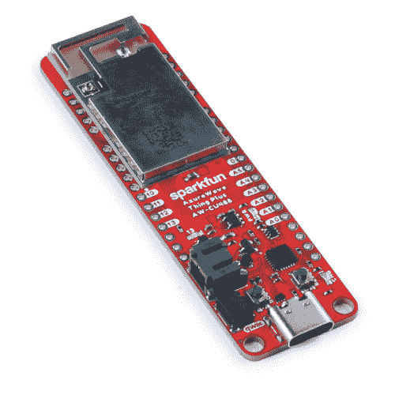](https://www.sparkfun.com/products/19957) 

将**添加到您的[购物车](https://www.sparkfun.com/cart)中！**

### [spark fun azure wave Thing Plus-AW-Cu 488](https://www.sparkfun.com/products/19957)

[In stock](https://learn.sparkfun.com/static/bubbles/ "in stock") DEV-19957

SparkFun AzureWave Thing Plus 是一款配备 AW-CU488 的羽毛外形开发板。

$49.95[Favorited Favorite](# "Add to favorites") 5[Wish List](# "Add to wish list")** **[https://www.youtube.com/embed/7oKjfAUvVZ0/?autohide=1&border=0&wmode=opaque&enablejsapi=1](https://www.youtube.com/embed/7oKjfAUvVZ0/?autohide=1&border=0&wmode=opaque&enablejsapi=1)

### 所需材料

要完成本教程，您至少需要以下材料。你可能不需要所有的东西，这取决于你拥有什么。将它添加到您的购物车，通读指南，并根据需要调整购物车。

[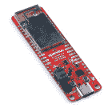](https://www.sparkfun.com/products/19957) 

将**添加到您的[购物车](https://www.sparkfun.com/cart)中！**

### [spark fun azure wave Thing Plus-AW-Cu 488](https://www.sparkfun.com/products/19957)

[In stock](https://learn.sparkfun.com/static/bubbles/ "in stock") DEV-19957

SparkFun AzureWave Thing Plus 是一款配备 AW-CU488 的羽毛外形开发板。

$49.95[Favorited Favorite](# "Add to favorites") 5[Wish List](# "Add to wish list")****[](https://www.sparkfun.com/products/15424) 

将**添加到您的[购物车](https://www.sparkfun.com/cart)中！**

### [可逆 USB A 转 C 线- 2m](https://www.sparkfun.com/products/15424)

[18 available](https://learn.sparkfun.com/static/bubbles/ "18 available") CAB-15424

这些 2 米长的电缆稍加修改后，就可以插入其端口，而不用考虑其在 U…

$8.951[Favorited Favorite](# "Add to favorites") 4[Wish List](# "Add to wish list")**********Note:** Click below for a wishlist of the minimum parts.

[AzureWave Thing Plus (AW-CU488) Minimum Parts Wishlist](https://www.sparkfun.com/wish_lists/169280)

### 工具

当使用电镀通孔时，您将需要一个烙铁、焊料和[通用焊接附件](https://www.sparkfun.com/categories/49)来实现安全连接。

[](https://www.sparkfun.com/products/14782) 

将**添加到您的[购物车](https://www.sparkfun.com/cart)中！**

### [平齐刀具- Xcelite](https://www.sparkfun.com/products/14782)

[Out of stock](https://learn.sparkfun.com/static/bubbles/ "out of stock") TOL-14782

这些是来自 Excelite 的简单平切刀具，让您可以非常干净地切割引线并靠近焊点。

$8.952[Favorited Favorite](# "Add to favorites") 18[Wish List](# "Add to wish list")****[](https://www.sparkfun.com/products/14456) 

将**添加到您的[购物车](https://www.sparkfun.com/cart)中！**

### [【烙铁- 60W(可调温度)](https://www.sparkfun.com/products/14456)

[In stock](https://learn.sparkfun.com/static/bubbles/ "in stock") TOL-14456

当你不想倾家荡产，但又需要一个可靠的烙铁时，这个可调节温度的烙铁是一个很好的工具…

$16.5016[Favorited Favorite](# "Add to favorites") 43[Wish List](# "Add to wish list")****[](https://www.sparkfun.com/products/9163) 

将**添加到您的[购物车](https://www.sparkfun.com/cart)中！**

### [无铅焊料- 15 克管](https://www.sparkfun.com/products/9163)

[In stock](https://learn.sparkfun.com/static/bubbles/ "in stock") TOL-09163

这是你的无铅焊料的基本管，带有不干净的水溶性树脂芯。0.031 英寸规格，15 克

$3.954[Favorited Favorite](# "Add to favorites") 14[Wish List](# "Add to wish list")**************Bundled Kits!** Check out the following tool kits with some of the soldering irons and accessories listed earlier!

[](https://www.sparkfun.com/products/11805) 

将**添加到您的[购物车](https://www.sparkfun.com/cart)中！**

### [SparkFun 豪华工具包](https://www.sparkfun.com/products/11805)

[Only 4 left!](https://learn.sparkfun.com/static/bubbles/ "only 4 left!") TOL-11805

这些工具非常适合那些有工具使用经验但需要一套新零件的人…

$246.50[Favorited Favorite](# "Add to favorites") 21[Wish List](# "Add to wish list")****[](https://www.sparkfun.com/products/14681) 

将**添加到您的[购物车](https://www.sparkfun.com/cart)中！**

### [SparkFun 初学者工具包](https://www.sparkfun.com/products/14681)

[Out of stock](https://learn.sparkfun.com/static/bubbles/ "out of stock") TOL-14681

这些工具非常适合那些需要一套坚实的工具来启动工作台的人！

$62.50[Favorited Favorite](# "Add to favorites") 14[Wish List](# "Add to wish list")**** ****#### 原型配件

根据您的设置，您可能希望使用 IC 挂钩进行临时连接。但是，您可能需要焊接接头引脚，将器件连接到电镀通孔，以实现安全连接。对于那些使用可堆叠接头的用户，您可能需要从 6 针接头上剪下或拔出一个引脚，以连接到 AzureWave Thing Plus 上的一排排 1x5 引脚。

[](https://www.sparkfun.com/products/12002) 

将**添加到您的[购物车](https://www.sparkfun.com/cart)中！**

### [【试验板-不干胶(白色)](https://www.sparkfun.com/products/12002)

[In stock](https://learn.sparkfun.com/static/bubbles/ "in stock") PRT-12002

这是你的尝试和真正的白色无焊试验板。它有 2 条电源总线，10 列，30 行，总共 400 个连接…

$5.5048[Favorited Favorite](# "Add to favorites") 93[Wish List](# "Add to wish list")****[](https://www.sparkfun.com/products/116) 

将**添加到您的[购物车](https://www.sparkfun.com/cart)中！**

### [破开头球——直击](https://www.sparkfun.com/products/116)

[In stock](https://learn.sparkfun.com/static/bubbles/ "in stock") PRT-00116

一排标题-打破适应。40 个引脚，可切割成任何尺寸。用于定制 PCB 或通用定制接头。

$1.7520[Favorited Favorite](# "Add to favorites") 133[Wish List](# "Add to wish list")****[](https://www.sparkfun.com/products/9741) 

将**添加到您的[购物车](https://www.sparkfun.com/cart)中！**

### [带猪尾的 IC 钩](https://www.sparkfun.com/products/9741)

[In stock](https://learn.sparkfun.com/static/bubbles/ "in stock") CAB-09741

这些是高质量的 IC 测试钩，带有一根公连接线。这些有两个挂钩，而不是一个挂钩…

$5.5010[Favorited Favorite](# "Add to favorites") 30[Wish List](# "Add to wish list")****[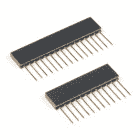](https://www.sparkfun.com/products/15187) 

将**添加到您的[购物车](https://www.sparkfun.com/cart)中！**

### [羽毛可堆叠头套](https://www.sparkfun.com/products/15187)

[In stock](https://learn.sparkfun.com/static/bubbles/ "in stock") PRT-15187

这些可堆叠的接头可与[spark fun ESP32 Thing Plus](https://www . spark fun . com/products/14689)配合使用，以控制

$1.75[Favorited Favorite](# "Add to favorites") 4[Wish List](# "Add to wish list")****[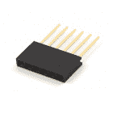](https://www.sparkfun.com/products/9280) 

将**添加到您的[购物车](https://www.sparkfun.com/cart)中！**

### [Arduino 可堆叠接头- 6 针](https://www.sparkfun.com/products/9280)

[In stock](https://learn.sparkfun.com/static/bubbles/ "in stock") PRT-09280

这是一个 6 针母接头，具有超长的腿-非常适合堆叠 Arduino 屏蔽。针脚间距为 0.1 英寸。

$0.75[Favorited Favorite](# "Add to favorites") 7[Wish List](# "Add to wish list")********** **********### Qwiic 电缆

对于那些想利用 Qwiic 功能设备的人来说，你需要一根 Qwiic 电缆。

[](https://www.sparkfun.com/products/15081) 

将**添加到您的[购物车](https://www.sparkfun.com/cart)中！**

### [SparkFun Qwiic 线缆套件](https://www.sparkfun.com/products/15081)

[In stock](https://learn.sparkfun.com/static/bubbles/ "in stock") KIT-15081

为了更容易上手，我们用 50 毫米到 500 毫米的各种 Qwiic 电缆组装了 Qwiic 电缆套件…

$8.9516[Favorited Favorite](# "Add to favorites") 58[Wish List](# "Add to wish list")****[](https://www.sparkfun.com/products/14427) 

将**添加到您的[购物车](https://www.sparkfun.com/cart)中！**

### [Qwiic 线缆- 100mm](https://www.sparkfun.com/products/14427)

[In stock](https://learn.sparkfun.com/static/bubbles/ "in stock") PRT-14427

这是一条 100 毫米长的 4 芯电缆，带有 1 毫米 JST 端接。它旨在将支持 Qwiic 的组件连接在一起…

$1.50[Favorited Favorite](# "Add to favorites") 32[Wish List](# "Add to wish list")****[](https://www.sparkfun.com/products/14429) 

将**添加到您的[购物车](https://www.sparkfun.com/cart)中！**

### [Qwiic 线缆- 500mm](https://www.sparkfun.com/products/14429)

[In stock](https://learn.sparkfun.com/static/bubbles/ "in stock") PRT-14429

这是一根 500mm 长的 4 芯电缆，带有 1mm JST 端接。它旨在将支持 Qwiic 的组件连接在一起…

$1.951[Favorited Favorite](# "Add to favorites") 25[Wish List](# "Add to wish list")****[](https://www.sparkfun.com/products/14425) 

将**添加到您的[购物车](https://www.sparkfun.com/cart)中！**

### [Qwiic 电缆-试验板跳线(4 针)](https://www.sparkfun.com/products/14425)

[In stock](https://learn.sparkfun.com/static/bubbles/ "in stock") PRT-14425

这是一根跳线适配器电缆，一端带有一个 Qwiic JST 母接头，另一端带有一个试验板连接…

$1.50[Favorited Favorite](# "Add to favorites") 34[Wish List](# "Add to wish list")******** ********### 脂肪电池

一个[单节锂离子电池](https://www.sparkfun.com/categories/tags/lithium-polymer)可以连接到 AzureWave Thing Plus (AW-CU488)以实现便携性。

[](https://www.sparkfun.com/products/13813) 

将**添加到您的[购物车](https://www.sparkfun.com/cart)中！**

### [锂离子电池-1Ah](https://www.sparkfun.com/products/13813)

[In stock](https://learn.sparkfun.com/static/bubbles/ "in stock") PRT-13813

基于锂离子化学的超薄超轻电池。每个电池在 1000 毫安时输出 3.7V 的标称电压！

$10.958[Favorited Favorite](# "Add to favorites") 75[Wish List](# "Add to wish list")****[](https://www.sparkfun.com/products/13854) 

将**添加到您的[购物车](https://www.sparkfun.com/cart)中！**

### [锂离子电池- 850mAh](https://www.sparkfun.com/products/13854)

[In stock](https://learn.sparkfun.com/static/bubbles/ "in stock") PRT-13854

这是基于锂离子化学的非常薄、非常轻的电池。每个电池在 850℃时输出 3.7V 的标称电压…

$10.952[Favorited Favorite](# "Add to favorites") 17[Wish List](# "Add to wish list")****[](https://www.sparkfun.com/products/13851) 

将**添加到您的[购物车](https://www.sparkfun.com/cart)中！**

### [锂离子电池- 400mAh](https://www.sparkfun.com/products/13851)

[In stock](https://learn.sparkfun.com/static/bubbles/ "in stock") PRT-13851

这是一种基于锂离子化学的非常小、非常轻的电池，具有目前最高的能量密度…

$5.5010[Favorited Favorite](# "Add to favorites") 41[Wish List](# "Add to wish list")****[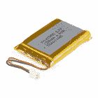](https://www.sparkfun.com/products/18286) 

将**添加到您的[购物车](https://www.sparkfun.com/cart)中！**

### [锂离子电池-1250 mah(T2 认证)](https://www.sparkfun.com/products/18286)

[In stock](https://learn.sparkfun.com/static/bubbles/ "in stock") PRT-18286

基于锂离子化学的超薄超轻电池。每个电池在 1250 毫安时输出 3.7V 的标称电压，即…

$10.951[Favorited Favorite](# "Add to favorites") 8[Wish List](# "Add to wish list")******** ********### 推荐阅读

如果您不熟悉 Qwiic 系统，我们建议您阅读此处的[以了解概述](https://www.sparkfun.com/qwiic)，如果您决定利用 Qwiic 连接器。

| [](https://www.sparkfun.com/qwiic) |
| *[Qwiic 连接系统](https://www.sparkfun.com/qwiic)* |

如果你不熟悉下面的教程，我们也建议你看一看。

[](https://learn.sparkfun.com/tutorials/how-to-solder-through-hole-soldering) [### 如何焊接:通孔焊接](https://learn.sparkfun.com/tutorials/how-to-solder-through-hole-soldering) This tutorial covers everything you need to know about through-hole soldering.[Favorited Favorite](# "Add to favorites") 70[](https://learn.sparkfun.com/tutorials/installing-arduino-ide) [### 安装 Arduino IDE](https://learn.sparkfun.com/tutorials/installing-arduino-ide) A step-by-step guide to installing and testing the Arduino software on Windows, Mac, and Linux.[Favorited Favorite](# "Add to favorites") 16[](https://learn.sparkfun.com/tutorials/arduino-shields-v2) [### Arduino Shields v2](https://learn.sparkfun.com/tutorials/arduino-shields-v2) An update to our classic Arduino Shields Tutorial! All things Arduino shields. What they are and how to assemble them.[Favorited Favorite](# "Add to favorites") 5[](https://learn.sparkfun.com/tutorials/installing-board-definitions-in-the-arduino-ide) [### 在 Arduino IDE 中安装电路板定义](https://learn.sparkfun.com/tutorials/installing-board-definitions-in-the-arduino-ide) How do I install a custom Arduino board/core? It's easy! This tutorial will go over how to install an Arduino board definition using the Arduino Board Manager. We will also go over manually installing third-party cores, such as the board definitions required for many of the SparkFun development boards.[Favorited Favorite](# "Add to favorites") 3[](https://learn.sparkfun.com/tutorials/serial-communication) [### 串行通信](https://learn.sparkfun.com/tutorials/serial-communication) Asynchronous serial communication concepts: packets, signal levels, baud rates, UARTs and more 100[](https://learn.sparkfun.com/tutorials/serial-peripheral-interface-spi) [### 串行外设接口(SPI)](https://learn.sparkfun.com/tutorials/serial-peripheral-interface-spi) SPI is commonly used to connect microcontrollers to peripherals such as sensors, shift registers, and SD cards.[Favorited Favorite](# "Add to favorites") 91[](https://learn.sparkfun.com/tutorials/pulse-width-modulation) [### 脉宽灯](https://learn.sparkfun.com/tutorials/pulse-width-modulation) An introduction to the concept of Pulse Width Modulation.[Favorited Favorite](# "Add to favorites") 46[](https://learn.sparkfun.com/tutorials/logic-levels) [### 逻辑电平](https://learn.sparkfun.com/tutorials/logic-levels) Learn the difference between 3.3V and 5V devices and logic levels.[Favorited Favorite](# "Add to favorites") 82[](https://learn.sparkfun.com/tutorials/i2c) [### I2C](https://learn.sparkfun.com/tutorials/i2c) An introduction to I2C, one of the main embedded communications protocols in use today.[Favorited Favorite](# "Add to favorites") 128[](https://learn.sparkfun.com/tutorials/analog-vs-digital) [### 模拟与数字](https://learn.sparkfun.com/tutorials/analog-vs-digital) This tutorial covers the concept of analog and digital signals, as they relate to electronics.[Favorited Favorite](# "Add to favorites") 66[](https://learn.sparkfun.com/tutorials/noisy-cricket-stereo-amplifier---15w-hookup-guide) [### 嘈杂的板球立体声放大器- 1.5W 连接指南](https://learn.sparkfun.com/tutorials/noisy-cricket-stereo-amplifier---15w-hookup-guide) A hookup guide for the Noisy Cricket Stereo Amplifier - 1.5W.[Favorited Favorite](# "Add to favorites") 2[](https://learn.sparkfun.com/tutorials/analog-mems-microphone-breakout---sph8878lr5h-1-hookup-guide) [### 模拟 MEMS 麦克风分线点- SPH8878LR5H-1 连接指南](https://learn.sparkfun.com/tutorials/analog-mems-microphone-breakout---sph8878lr5h-1-hookup-guide) Get started with sound monitoring using the SparkFun analog MEMS microphone breakout board with Arduino 0

## 硬件概述

在本节中，我们将重点介绍 AzureWave Thing Plus (AW-CU488)上的硬件和引脚。要了解更多信息，请查看我们的[资源，并进一步](https://learn.sparkfun.com/tutorials/azurewave-thing-plus-aw-cu488-hookup-guide#resources-and-going-further)了解有关 AzureWave AW-CU488 模块或该模块中包含的 Realtek RTL8721DM 的更多信息。

### GPIO

AzureWave Thing Plus 使用 Thing Plus/ Feather 外形将 GPIO 引脚连接到电路板边缘的电镀通孔焊盘。额外的 1x5 引脚沿着电路板的延伸部分断开。

[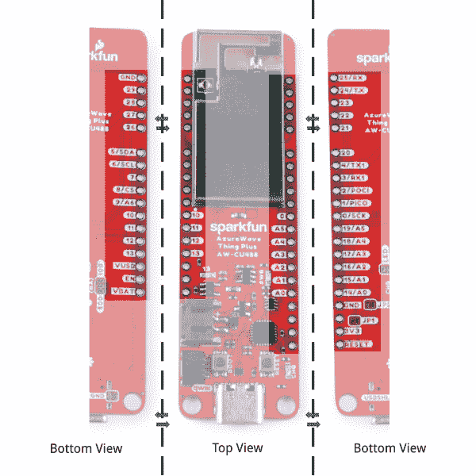](https://cdn.sparkfun.com/assets/learn_tutorials/2/5/1/8/19957_AzureWaveThingPlus_AW-CU488-edge_GPIO_Pins.jpg)

请注意，pin 标签可能具有附加功能。下面是 AzureWave Thing Plus (AW-CU488)的图形数据表，突出了附加功能。

[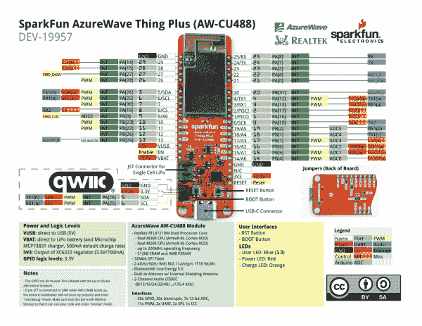](https://cdn.sparkfun.com/assets/f/9/0/2/b/GraphicalDatasheet_SparkFun_AzureWave_ThingPlus-v10b.pdf)*Click image for a closer view.***Note:** We recommend using the pins for the primary peripheral. For advanced users, you could use mux'ed pins for at an alternative location (as listed for with (b) and/or (c) ). Some pins are defined with the board add-on, while others may need to be adjusted in the pin definitions.**Note:** If pin `27` is connected to GND when AW-CU488 boots up, the Arduino bootloader will not boot up properly and enter "test/debug" mode. Make sure that this pin is left HIGH at bootup so that it can run your code and enter "normal" mode.

### 力量

有多种电源和电源相关的网络连接到连接器和通孔焊盘。AW-CU488 的功率被下调至 **3.3V** ，因此 I/O 的[逻辑电平为 3.3V。](https://learn.sparkfun.com/tutorials/logic-levels/all)

*   **VBUS**:VBUS net 连接到 USB Type C 连接器和 VBUS PTH。您可以通过连接到 USB Type C 连接器或将电源连接到 VBUS PTH，从 USB 端口使用 **5V** 。确保您提供给此引脚的电源不超过 6 伏。XC6222 3.3V/700mA 电压调节器可降低功率。USB Type C 连接器还用于将代码上传到您的处理器，将[串行数据发送到终端窗口](https://learn.sparkfun.com/tutorials/terminal-basics/arduino-serial-monitor-windows-mac-linux)，或者给 LiPo 电池充电。当然，对于便携式电源，你可以连接 USB 电池作为使用 LiPo 电池的替代选择。
*   **VBAT**:VBAT 网络连接到 2 引脚 JST 连接器 VBAT PTH 和 AW-CU488 的 VBAT MEAS 引脚。对于便携式应用，您可以将标称 3.7V 单节锂电池连接到 2 针 JST 连接器。此引脚还连接到 MCP73831 充电 IC，以安全地将 LiPo 电池充电至约 4.2V 的最大电压。我们建议仅将 LiPo 电池连接到 VBAT 网络，以便为评估板供电。当然，您可以通过 VBAT PTH 引脚为独立器件供电。XC6222 3.3V/700mA 电压调节器可降低功率。
*   **3V3**:3.3V 网标为 3V3。如果有 3.3V 的调节电压，可以给电路板供电。否则，可以通过 3V3 PTH 引脚给单独的器件供电。这也连接到 Qwiic 连接器的 3.3V 引脚，为支持 Qwiic 的设备供电。
*   **GND** :当然是系统的公共地电压(0V 参考)。

[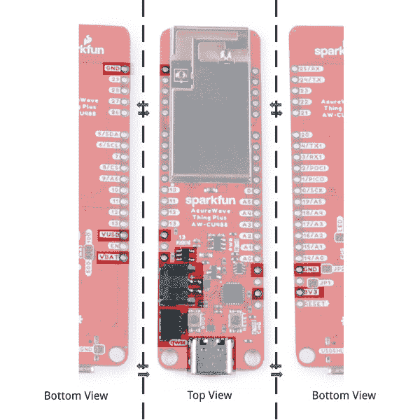](https://cdn.sparkfun.com/assets/learn_tutorials/2/5/1/8/AzureWaveThingPlus_AW-CU488_Power.jpg)

### 脂肪充电电路

该板包括 MCP73831 LiPo 充电器 IC(带有 5 个引脚的小黑 IC ),可安全地为单节 LiPo 电池充电。在这种情况下，充电速率被设置为 500mA 的默认速率。切断背面的走线，并在中间焊盘和标有 100mA 的焊盘之间添加一条跳线，充电速率将设置为 100mA。标有 CHG 的板上 LED 可以用来指示电池的充电状态。

[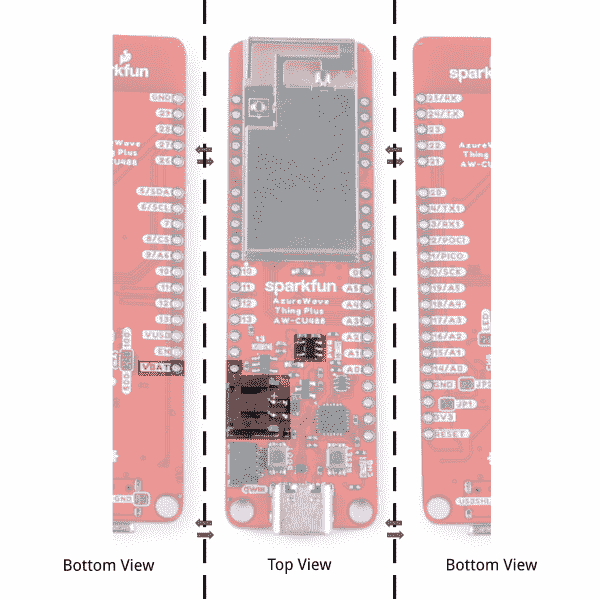](https://cdn.sparkfun.com/assets/learn_tutorials/2/5/1/8/AzureWaveThingPlus_AW-CU488_LiPo_Charge.jpg)**Note:** For more information on proper handling of LiPo batteries, check out the [LilyPad Basics: Powering Your Project - LiPo Battery Safety Care](https://learn.sparkfun.com/tutorials/lilypad-basics-powering-your-project/power-options-rechargeable-lithium-polymer-batteries#lipo_safety_care).

[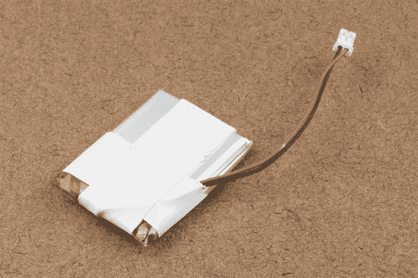](https://learn.sparkfun.com/tutorials/lilypad-basics-powering-your-project/power-options-rechargeable-lithium-polymer-batteries#lipo_safety_care)

### 重置和启动按钮

每个板都包括一个复位和启动按钮。复位按钮旁边还有一个复位按钮。点击复位按钮重启 AW-CU488。要手动将 AW-CU488 置于启动模式，按住启动按钮，同时短暂按下重置按钮，然后松开启动按钮。顺便提一下，启动按钮也连接到引脚`24` (TX)。数据手册将此引脚称为 CHIP_EN。

[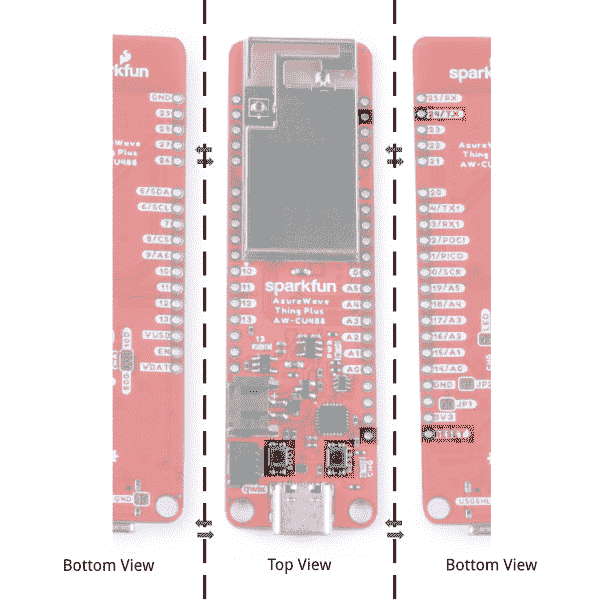](https://cdn.sparkfun.com/assets/learn_tutorials/2/5/1/8/AzureWaveThingPlus_AW-CU488_Reset_Boot_Buttons.jpg)

### CP210X USB 转串行转换器

该板包括一个 USB 转串行转换器。这用于串行编程或与[串行终端](https://learn.sparkfun.com/tutorials/terminal-basics/arduino-serial-monitor-windows-mac-linux)通信。CP210X 的 TX 引脚连接到引脚`25` (RX)，而 and RX 引脚连接到引脚`24` (TX)。

[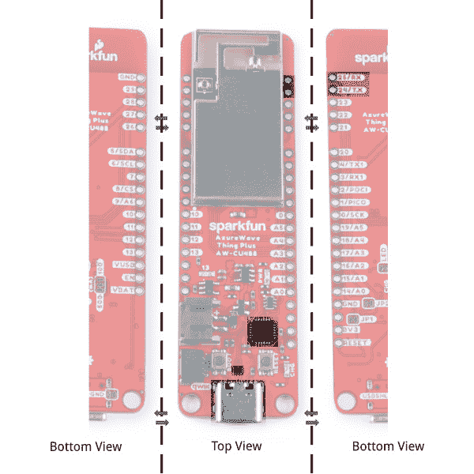](https://cdn.sparkfun.com/assets/learn_tutorials/2/5/1/8/AzureWaveThingPlus_AW-CU488_USB-to-Serial.jpg)

### 通用非同步收发传输器(Universal Asynchronous Receiver/Transmitter)

有两个 UART 端口断开。主 UART 连接到引脚`24` (TX)和`25` (RX)。如前所述，这些引脚连接到启动按钮和 USB 到串行转换器。辅助 UART 连接到引脚`4` (TX1)和`3` (RX1)。

[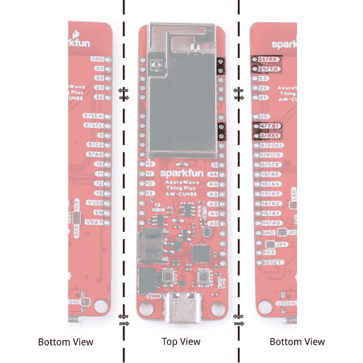](https://cdn.sparkfun.com/assets/learn_tutorials/2/5/1/8/AzureWaveThingPlus_AW-CU488_UART_Pins.jpg)

### Qwiic 和 I ² C

该板包括一个水平 Qwiic 连接器。这些引脚连接到主 I ² C 总线和 3.3V 电源，使您可以轻松地将支持 Qwiic 的设备添加到您的应用中。I ² C SCL 引脚连接到`6`。I ² C SDA 连接到`5`。

[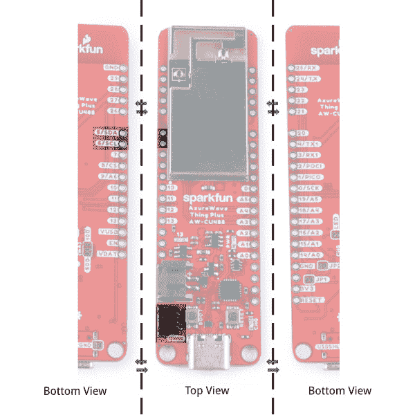](https://cdn.sparkfun.com/assets/learn_tutorials/2/5/1/8/AzureWaveThingPlus_AW-CU488_I2C_Qwiic.jpg)

### 精力

主要 SPI 引脚位于引脚`0` (SCK)、`1`(皮科)、`2` (POCI)和`8` (CS)。

[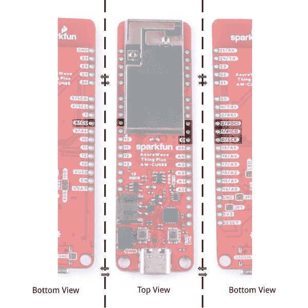](https://cdn.sparkfun.com/assets/learn_tutorials/2/5/1/8/AzureWaveThingPlus_AW-CU488_SPI.jpg)

### 模拟的

引脚`14` (A0)、`15` (A1)、`16` (A2)、`17` (A3)、`18` (A4)、`19` (A5)、和`9` (A6)上有六个模拟引脚。

[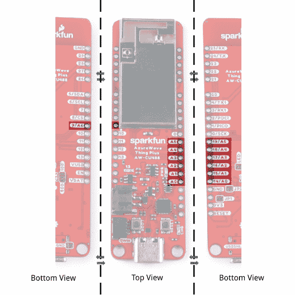](https://cdn.sparkfun.com/assets/learn_tutorials/2/5/1/8/AzureWaveThingPlus_AW-CU488_Analog_Pins.jpg)**Note:** When using the Realtek AudioCodec examples, you may need to make an instance of your variables and use the Arduino's globally defined macros (such as analog pins `A0`-`A6`) before including the library.

```
int analog_pin = A2;  //<=== Add this line before including Audio Codec library

#include "AudioCodec.h" //include Audio Codec Arduino library
#include "FFT.h"
```

### 脉冲宽度调制

该板包括 11x [PWM](https://learn.sparkfun.com/tutorials/pulse-width-modulation/all) 引脚。这些可以在本节前面列出的引脚表上找到:`3`、`4`、`5`、`6`、`7`、`10`、`11`、`14`、`15`、`17`和`26`。

[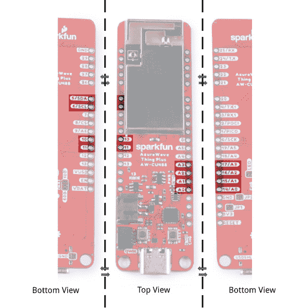](https://cdn.sparkfun.com/assets/learn_tutorials/2/5/1/8/AzureWaveThingPlus_AW-CU488_PWM.jpg)**Note:** Make sure that you are using the correct PWM pins. If a PWM is incorrectly defined in Arduino, all of the PWM pins will cease to function.**Note:** If you are using the PWM with the ServoSweep.ino or TonePlayMelody.ino, you will need to adjust the preprocesser define after the line for the `BOARD_RTL8721DM`. For example, in the ServoSweep.ino file, they attach PWM pin 3 to servo object. You would need to adjust pin `3` to another PWM pin that is available on the AzureWave Thing Plus (AW-CU488).

```
 .
  .
  .
  #elif defined(BOARD_RTL8721DM)
    // attaches the servo on PWM pin 3 to the servo object
    myservo.attach(3);
```

### 音频编解码器输入麦克风和模拟输出引脚

主板上没有标记的是麦克风引脚。引脚`21`也是“MIC_BIAS”，而`22`也是右麦克风“MIC1_R”。左右扬声器的模拟输出在引脚`13`(或“AOUTP_R”)和引脚`20`(或“AOUTP_L”)上。请注意，LED 与引脚`13`相连。如果您决定将此引脚用于音频代码，我们建议使用不同的 LED 输出引脚。

[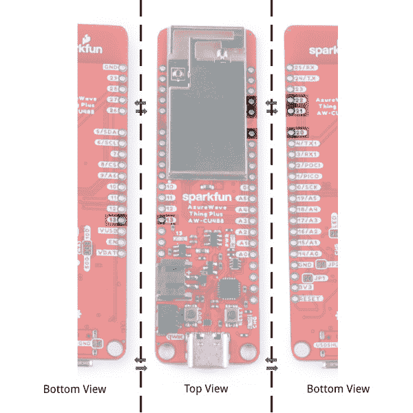](https://cdn.sparkfun.com/assets/learn_tutorials/2/5/1/8/19957_AzureWaveThingPlus_AW-CU488-Audio-CODEC.jpg)

### 天线

AzureWave AW-CU488 模块包括一个内部屏蔽天线。请注意，看起来类似于“u.FL”连接器的连接器用于生产测试，用户无法使用。

[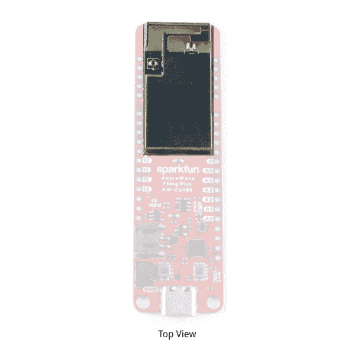](https://cdn.sparkfun.com/assets/learn_tutorials/2/5/1/8/19957_AzureWaveThingPlus_AW-CU488_Module.jpg)

### 发光二极管

该板包括三个状态指示灯。

*   **PWR** -当从 USB 连接器或 LiPo 电池降压后有 3.3V 可用时，PWR LED 亮起。这可以通过切断标有 led 的跳线来禁用。
*   **13**-13 LED 可由用户配置，并连接到 13 引脚。请注意，这也连接到模拟输出“AOUTP_R”。您需要决定是将此引脚用于 LED 还是模拟输出引脚。
*   **CHG** -车载黄色 CHG LED 可用于指示电池的**充电状态**。根据充电 IC 的状态，下表列出了其他状态指示器。

| **充电状态** | **LED 状态** |
| 没有电池 | 浮动(应该关闭，但可能闪烁) |
| 关机 | 浮动(应该关闭，但可能闪烁) |
| 充电 | 在…上 |
| 充电完成 | 离开 |

[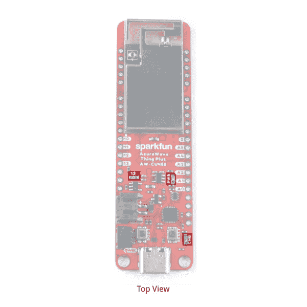](https://cdn.sparkfun.com/assets/learn_tutorials/2/5/1/8/AzureWaveThingPlus_AW-CU488-LEDs.jpg)

### 针织套衫

**Note:** If this is your first time working with jumpers, check out the [How to Work with Jumper Pads and PCB Traces](https://learn.sparkfun.com/tutorials/how-to-work-with-jumper-pads-and-pcb-traces/all) tutorial for more information.

包括以下三种跳线。

*   **CHG** -这个三路跳线设置充电 IC 的充电速率。默认情况下，它连接到 500mA。切割一条走线并在中心焊盘和标记为 100mA 的焊盘之间添加一条跳线，将充电速率设置为 100mA
*   USBSHLD-GND -该跳线将 USB 型连接器的屏蔽引脚连接到 GND。切开这个以隔离 USB Type C 连接器的屏蔽引脚。这适用于希望将电路板接地到机柜而不是接地层的高级用户。
*   **LED** -默认情况下，该跳线关闭，位于电路板底部。切断此迹线，禁用连接到 3.3V 的电源 LED。
*   **JP1** -该跳线默认连接到自动启动电路。这是为希望在上传代码时禁用自动引导的高级用户准备的。你需要和 JP2 一起剪断这件毛衣。
*   **JP2** -这个跳线默认连接到自动启动电路。这是为希望在上传代码时禁用自动引导的高级用户准备的。你需要用 JP1 剪下这件毛衣。

[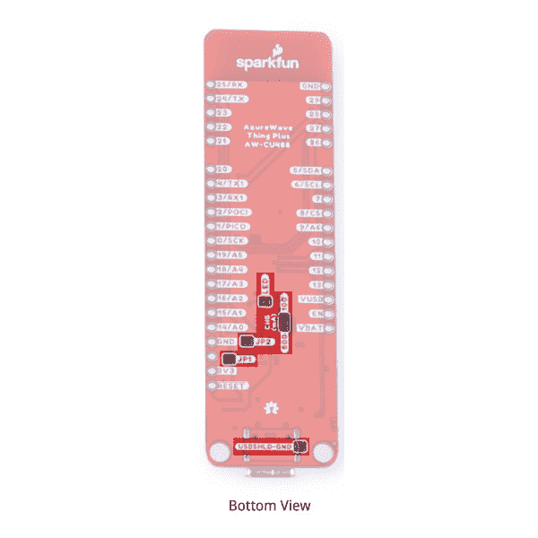](https://cdn.sparkfun.com/assets/learn_tutorials/2/5/1/8/AzureWaveThingPlus_AW-CU488_Jumpers.jpg)

### 电路板尺寸

板子用的是东西加脚印。由于模块的尺寸，有两个安装孔，电路板的长度被延长以适应 AW-CU488 模块的尺寸。因此，该板的尺寸约为 3.05 英寸 x 0.90 英寸(或 77.47 毫米 x 22.86 毫米)。

[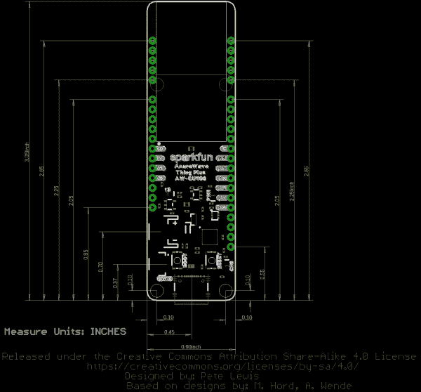](https://cdn.sparkfun.com/assets/6/a/9/9/a/SparkFun_AzureWave_Thing_Plus_AW-CU488_Board_Dimensions.png)

## 硬件连接

至少，将 USB C 电缆插入 AzureWave Thing Plus，为电路板供电和编程。

[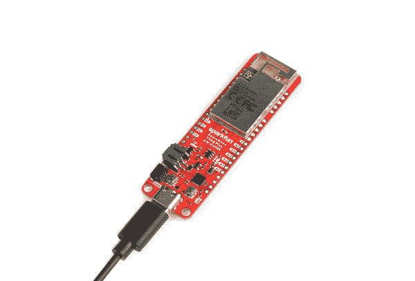](https://cdn.sparkfun.com/assets/learn_tutorials/2/5/1/8/SparkFun_AzureWave_Thing_Plus_AW-CU488_USB-C.jpg)

## 安装 CP2104 USB 驱动程序

**Note:** Make sure to manually install the driver for the CP210X with the following instructions. The driver that Windows auto-installs will not work with the auto-reset circuit on the board and can cause serial uploads to fail.

你还需要安装 SiLabs CP2104 驱动程序，可以在这里找到: [USB 转 UART 桥 VCP 驱动程序](https://www.silabs.com/products/development-tools/software/usb-to-uart-bridge-vcp-drivers)

[Download Windows VCP Driver (ZIP)](https://cdn.sparkfun.com/assets/learn_tutorials/8/5/2/CP210x_Universal_Windows_Driver.zip)[Download Mac OSX VCP Driver (ZIP)](https://www.silabs.com/documents/public/software/Mac_OSX_VCP_Driver.zip)**Note:** If applicable, make sure you are using the proper driver files for your CPU architecture. This is usually indicated by a folder or file name with "*x86*" for 32-bit processors or "*x64*" for 64-bit processors.

## 设置 Arduino

**Note:** If this is your first time using Arduino IDE, library, or board add-on, please review the following tutorials.

*   [安装 Arduino IDE](https://learn.sparkfun.com/tutorials/installing-arduino-ide)
*   [安装 Arduino 库](https://learn.sparkfun.com/tutorials/installing-an-arduino-library)
*   [在 Arduino IDE 中安装板卡定义](https://learn.sparkfun.com/tutorials/installing-board-definitions-in-the-arduino-ide)

### 安装 Realtek 插件板

首先，打开你的 Arduino 首选项(**文件** > **首选项**)。然后找到**附加电路板管理器 URL**文本框，并粘贴以下链接。如果您有其他第三方板的链接，您需要在字段中的每个链接之间添加一个逗号(`,`)。您也可以点击*附加 Boards Manager URL:*字段旁边的窗口按钮打开一个附加窗口，并将链接添加到单独的一行。

语言:bash https://github . com/ambio/ambd _ Arduino/raw/master/Arduino _ package/package _ realtek . com _ ame bad _ index . JSON

[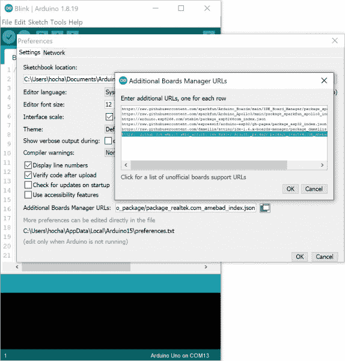](https://cdn.sparkfun.com/assets/learn_tutorials/2/5/1/8/SparkFun_AzureWave_Thing_Plus_Arduino_Board_Support_Files.JPG)

然后点击“确定”，并返回到董事会经理菜单。在搜索栏中输入“ **realtek** ”，然后点击`enter`。点击 **Realtek** 的 **Realtek Ameba 板(32 位 ARM Cortex-M33 @200MHz)** 的“安装”按钮。下载和安装工具可能需要几分钟时间。在工具安装的时候，你可以随意走动，喝点水，或者跳跳舞。

[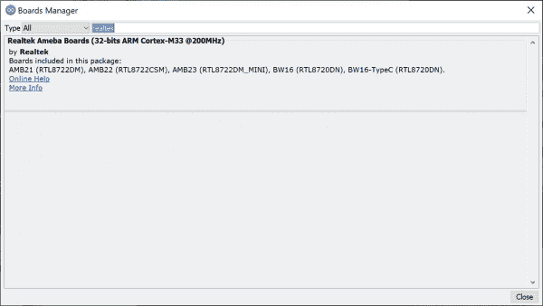](https://cdn.sparkfun.com/assets/learn_tutorials/2/5/1/8/Arduino_Boards_Manager_Install_Realtek_SparkFun_Azurewave_Thing_Plus_Stable.JPG)

安装后，Arduino-blue“已安装”文本应出现在主板列表条目旁边。

[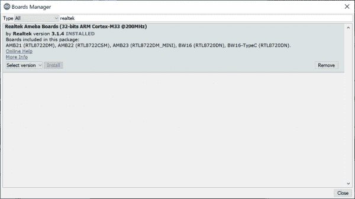](https://cdn.sparkfun.com/assets/learn_tutorials/2/5/1/8/Arduino_Boards_Manager_Installed_Realtek_SparkFun_Azurewave_Thing_Plus_Stable.JPG)

### 选择 AzureWave Thing Plus 板

要将代码上传到电路板，您需要选择正确的电路板。从菜单中选择如下:**工具** > **板卡** > **AW-CU488 东西加(RTL8721DM)** 。

[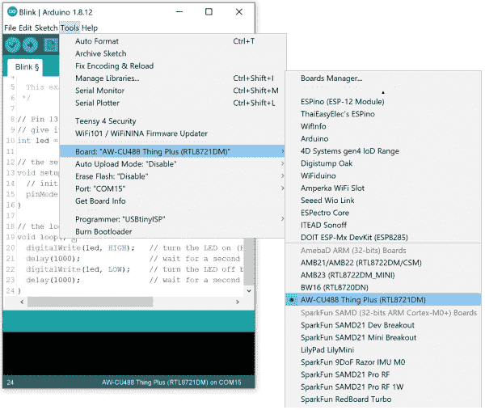](https://cdn.sparkfun.com/assets/learn_tutorials/2/5/1/8/Arduino_IDE_Board_Selection_Realtek_SparkFun_Azurewave_Thing_Plus_AmebaD_ARM_Boards.JPG)

董事会有几个选择。其中之一是可以选择自动上传代码到主板，而无需在 Arduino 上传代码时按下启动和重置按钮。默认情况下，自动上传模式是禁用的。从菜单中选择以下:**工具** > **自动上传模式:** > **启用**。

[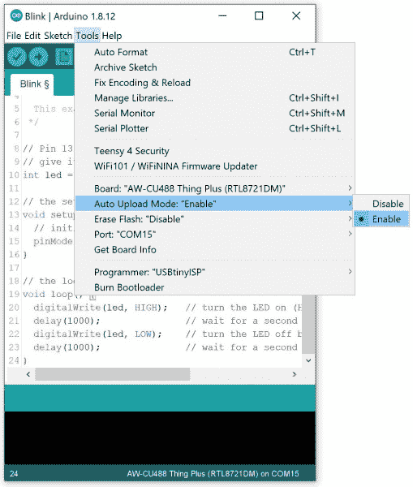](https://cdn.sparkfun.com/assets/learn_tutorials/2/5/1/8/Arduino_Board_Option_Auto_Upload_Mode.JPG)

### COM 端口选择

您还需要选择主板枚举的 COM 端口。从菜单中，选择您计算机上各自的 COM 端口(在本例中，在 Windows 计算机上是**COM 15**):**工具** > **端口**>**COM _ _**。

[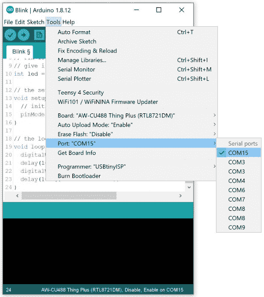](https://cdn.sparkfun.com/assets/learn_tutorials/2/5/1/8/Arduino_COM_Port_Silicon_Labs_CP210X.JPG)

## 示例 1:眨眼

### 所需材料

为了完成教程的这一部分，你需要一个 AzureWave 加上电路板和 USB C 线。

[](https://www.sparkfun.com/products/19957) 

将**添加到您的[购物车](https://www.sparkfun.com/cart)中！**

### [spark fun azure wave Thing Plus-AW-Cu 488](https://www.sparkfun.com/products/19957)

[In stock](https://learn.sparkfun.com/static/bubbles/ "in stock") DEV-19957

SparkFun AzureWave Thing Plus 是一款配备 AW-CU488 的羽毛外形开发板。

$49.95[Favorited Favorite](# "Add to favorites") 5[Wish List](# "Add to wish list")****[](https://www.sparkfun.com/products/15424) 

将**添加到您的[购物车](https://www.sparkfun.com/cart)中！**

### [可逆 USB A 转 C 线- 2m](https://www.sparkfun.com/products/15424)

[18 available](https://learn.sparkfun.com/static/bubbles/ "18 available") CAB-15424

这些 2 米长的电缆稍加修改后，就可以插入其端口，而不用考虑其在 U…

$8.951[Favorited Favorite](# "Add to favorites") 4[Wish List](# "Add to wish list")**********Note:** Click below for a wishlist of the parts for this section.

[AzureWave Thing Plus (AW-CU488) Minimum Parts Wishlist](https://www.sparkfun.com/wish_lists/169280)

### 硬件连接

该连接与本教程前面解释的相同。将 USB 电缆连接到 AzureWave Thing Plus (AW-CU488)。当然，你需要一个 2.4GHz 和 5GHz 的无线路由器。

[](https://cdn.sparkfun.com/assets/learn_tutorials/2/5/1/8/SparkFun_AzureWave_Thing_Plus_AW-CU488_USB-C.jpg)

### 示例代码

我们把草图上传到板上吧。将以下代码复制并粘贴到 Arduino IDE 中。从菜单中选择正确的板卡定义(本例中为**工具** > **板卡**>**AW-Cu 488 Thing Plus(RTL 8721dm)**)。然后选择板卡枚举到的正确 COM 端口(本例中为 **COM15** )。点击上传按钮。

```
language:c
/*
  Blink
  Turns on an LED on for one second, then off for one second, repeatedly.

  This example code is in the public domain.
 */

// Pin 13 has an LED connected on most Arduino boards.
// give it a name:
int led = 13; //LED is connected to pin 13 on the AzureWave Thing Plus (AW-CU488)

// the setup routine runs once when you press reset:
void setup() {
  // initialize the digital pin as an output.
  pinMode(led, OUTPUT);
}

// the loop routine runs over and over again forever:
void loop() {
  digitalWrite(led, HIGH);   // turn the LED on (HIGH is the voltage level)
  delay(1000);               // wait for a second
  digitalWrite(led, LOW);    // turn the LED off by making the voltage LOW
  delay(1000);               // wait for a second
} 
```

**Note:** You can also use the macro for the LED by using `LED_BUILTIN`.

上传后，检查板上标记为 **13** 的 LED。它应该每秒钟闪烁一次！太棒了。

## 示例 2:扫描 WiFi 网络

### 所需材料

为了完成教程的这一部分，你需要一个 AzureWave 加上电路板和 USB C 线。

[](https://www.sparkfun.com/products/19957) 

将**添加到您的[购物车](https://www.sparkfun.com/cart)中！**

### [spark fun azure wave Thing Plus-AW-Cu 488](https://www.sparkfun.com/products/19957)

[In stock](https://learn.sparkfun.com/static/bubbles/ "in stock") DEV-19957

SparkFun AzureWave Thing Plus 是一款配备 AW-CU488 的羽毛外形开发板。

$49.95[Favorited Favorite](# "Add to favorites") 5[Wish List](# "Add to wish list")****[](https://www.sparkfun.com/products/15424) 

将**添加到您的[购物车](https://www.sparkfun.com/cart)中！**

### [可逆 USB A 转 C 线- 2m](https://www.sparkfun.com/products/15424)

[18 available](https://learn.sparkfun.com/static/bubbles/ "18 available") CAB-15424

这些 2 米长的电缆稍加修改后，就可以插入其端口，而不用考虑其在 U…

$8.951[Favorited Favorite](# "Add to favorites") 4[Wish List](# "Add to wish list")**********Note:** Click below for a wishlist of the parts for this section.

[AzureWave Thing Plus (AW-CU488) Minimum Parts Wishlist](https://www.sparkfun.com/wish_lists/169280)

### 硬件连接

该连接与本教程前面解释的相同。将 USB 电缆连接到 AzureWave Thing Plus (AW-CU488)。当然，你需要一个 2.4GHz 和 5GHz 的无线路由器。

[](https://cdn.sparkfun.com/assets/learn_tutorials/2/5/1/8/SparkFun_AzureWave_Thing_Plus_AW-CU488_USB-C.jpg)

### 示例代码

让我们上传草图来扫描您所在地区的本地 WiFi 网络。从菜单中选择如下:**文件** > **实例** > 实例为 AW_CU488 东西加(RTL 8721dm)|**WiFi**>**ScanNetworks**。

或者，您可以在 Arduino IDE 中复制并粘贴以下代码。从菜单中选择正确的板卡定义(本例中为**工具** > **板卡**>**AW-Cu 488 Thing Plus(RTL 8721dm)**)。然后选择板卡枚举到的正确 COM 端口(本例中为 **COM21** )。点击上传按钮。

```
language:c
/*

 This example  prints the Wifi shield's MAC address, and
 scans for available Wifi networks using the Wifi shield.
 Every ten seconds, it scans again. It doesn't actually
 connect to any network, so no encryption scheme is specified.

 Circuit:
 * WiFi shield attached

 created 13 July 2010
 by dlf (Metodo2 srl)
 modified 21 Junn 2012
 by Tom Igoe and Jaymes Dec
 */

#include <WiFi.h>

void setup() {
    //Initialize serial and wait for port to open:
    Serial.begin(115200);
    while (!Serial) {
        ; // wait for serial port to connect. Needed for native USB port only
    }

    // check for the presence of the shield:
    if (WiFi.status() == WL_NO_SHIELD) {
        Serial.println("WiFi shield not present");
        // don't continue:
        while (true);
    }

    // Print WiFi MAC address:
    printMacAddress();
}

void loop() {
    // scan for existing networks:
    Serial.println("Scanning available networks...");
    listNetworks();
    delay(10000);
}

void printMacAddress() {
    // the MAC address of your Wifi shield
    byte mac[6];

    // print your MAC address:
    WiFi.macAddress(mac);
    Serial.print("MAC: ");
    Serial.print(mac[0], HEX);
    Serial.print(":");
    Serial.print(mac[1], HEX);
    Serial.print(":");
    Serial.print(mac[2], HEX);
    Serial.print(":");
    Serial.print(mac[3], HEX);
    Serial.print(":");
    Serial.print(mac[4], HEX);
    Serial.print(":");
    Serial.println(mac[5], HEX);
}

void listNetworks() {
    // scan for nearby networks:
    Serial.println("** Scan Networks **");
    int numSsid = WiFi.scanNetworks();
    if (numSsid == -1) {
        Serial.println("Couldn't get a wifi connection");
        while (true);
    }

    // print the list of networks seen:
    Serial.print("number of available networks:");
    Serial.println(numSsid);

    // print the network number and name for each network found:
    for (int thisNet = 0; thisNet < numSsid; thisNet++) {
        Serial.print(thisNet);
        Serial.print(") ");
        Serial.print(WiFi.SSID(thisNet));
        Serial.print("\tSignal: ");
        Serial.print(WiFi.RSSI(thisNet));
        Serial.print(" dBm");
        Serial.print("\tEncryptionRaw: ");
        printEncryptionTypeEx(WiFi.encryptionTypeEx(thisNet));
        Serial.print("\tEncryption: ");
        printEncryptionType(WiFi.encryptionType(thisNet));
    }
}

void printEncryptionTypeEx(uint32_t thisType) {
    /*  Arduino wifi api use encryption type to mapping to security type.
    *  This function demonstrate how to get more richful information of security type.
    */
    switch (thisType) {
        case SECURITY_OPEN:
            Serial.print("Open");
            break;
        case SECURITY_WEP_PSK:
            Serial.print("WEP");
            break;
        case SECURITY_WPA_TKIP_PSK:
            Serial.print("WPA TKIP");
            break;
        case SECURITY_WPA_AES_PSK:
            Serial.print("WPA AES");
            break;
        case SECURITY_WPA2_AES_PSK:
            Serial.print("WPA2 AES");
            break;
        case SECURITY_WPA2_TKIP_PSK:
            Serial.print("WPA2 TKIP");
            break;
        case SECURITY_WPA2_MIXED_PSK:
            Serial.print("WPA2 Mixed");
            break;
        case SECURITY_WPA_WPA2_MIXED:
            Serial.print("WPA/WPA2 AES");
            break;
    }
}

void printEncryptionType(int thisType) {
    // read the encryption type and print out the name:
    switch (thisType) {
        case ENC_TYPE_WEP:
            Serial.println("WEP");
            break;
        case ENC_TYPE_TKIP:
            Serial.println("WPA");
            break;
        case ENC_TYPE_CCMP:
            Serial.println("WPA2");
            break;
        case ENC_TYPE_NONE:
            Serial.println("None");
            break;
        case ENC_TYPE_AUTO:
            Serial.println("Auto");
            break;
    }
} 
```

在 **115200** 打开你的 Arduino 串口监视器。AzureWave Thing Plus (AW-CU488)将开始扫描您所在的区域。记下您正在连接的 WiFi 网络的加密类型。在这种情况下，我将我的家庭 WiFI 路由器的 5GHz 网络名称设置为“SparkFun_Router_5GHz ”,它使用 WPA2 加密(在 Arduino 串行监视器中突出显示)。

[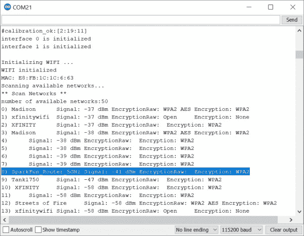](https://cdn.sparkfun.com/assets/learn_tutorials/2/5/1/8/SparkFun_AzureWave_5G_Arduino_WiFi_Network_Scan.jpg)

## 示例 3:连接到 WiFi 网络

### 所需材料

为了完成教程的这一部分，你需要一个 AzureWave 加上电路板和 USB C 线。

[](https://www.sparkfun.com/products/19957) 

将**添加到您的[购物车](https://www.sparkfun.com/cart)中！**

### [spark fun azure wave Thing Plus-AW-Cu 488](https://www.sparkfun.com/products/19957)

[In stock](https://learn.sparkfun.com/static/bubbles/ "in stock") DEV-19957

SparkFun AzureWave Thing Plus 是一款配备 AW-CU488 的羽毛外形开发板。

$49.95[Favorited Favorite](# "Add to favorites") 5[Wish List](# "Add to wish list")****[](https://www.sparkfun.com/products/15424) 

将**添加到您的[购物车](https://www.sparkfun.com/cart)中！**

### [可逆 USB A 转 C 线- 2m](https://www.sparkfun.com/products/15424)

[18 available](https://learn.sparkfun.com/static/bubbles/ "18 available") CAB-15424

这些 2 米长的电缆稍加修改后，就可以插入其端口，而不用考虑其在 U…

$8.951[Favorited Favorite](# "Add to favorites") 4[Wish List](# "Add to wish list")**********Note:** Click below for a wishlist of the parts for this section.

[AzureWave Thing Plus (AW-CU488) Minimum Parts Wishlist](https://www.sparkfun.com/wish_lists/169280)

### 硬件连接

该连接与本教程前面解释的相同。将 USB 电缆连接到 AzureWave Thing Plus (AW-CU488)。同样，你需要一个 2.4GHz 和 5GHz 的无线路由器。

[](https://cdn.sparkfun.com/assets/learn_tutorials/2/5/1/8/SparkFun_AzureWave_Thing_Plus_AW-CU488_USB-C.jpg)

### 示例代码

让我们上传草图以连接到您所在地区的 5GHz 网络。从菜单中选择以下内容:**文件** > **实例** > 实例为 AW_CU488 东西加(RTL 8721dm)|**WiFi**>**connectwithfwifi**>**connectwithwa**。根据您的加密方式，您可以选择不同的。

**Note:** Depending on your encryption, you may select a different Arduino sketch to connect to the WiFi. Based on the previous example, the connect used WPA so we selected the ConnectWithWPA.ino example.

或者，您可以在 Arduino IDE 中复制并粘贴以下代码。从菜单中选择正确的板卡定义(本例中为**工具** > **板卡**>**AW-Cu 488 Thing Plus(RTL 8721dm)**)。然后选择板卡枚举到的正确 COM 端口(本例中为 **COM21** )。点击上传按钮。

```
language:c
/*

 This example connects to an unencrypted Wifi network.
 Then it prints the  MAC address of the Wifi shield,
 the IP address obtained, and other network details.

 Circuit:
 * WiFi shield attached

 created 13 July 2010
 by dlf (Metodo2 srl)
 modified 31 May 2012
 by Tom Igoe
 */
#include <WiFi.h>

// If you are connecting to an iPhone WiFi hotspot, the default SSID uses Unicode (U+2019) Right Single Quotation Mark instead of ASCII apostrophe
// Modify the "Your Name" section in the SSID below to connect to an iPhone using a default SSID style
// char ssid[] = "Your Name\xE2\x80\x99s iPhone";

// UTF-8 encoding can also be used for SSID with emoji characters
// Emoji characters can be converted into UTF-8 at https://mothereff.in/utf-8
// char ssid[] = "\xe2\x9c\x8c\xef\xb8\x8f Ameba \xe2\x9c\x8c\xef\xb8\x8f";

char ssid[] = "yourNetwork";     //  your network SSID (name)
char pass[] = "secretPassword";  // your network password
int status = WL_IDLE_STATUS;     // the Wifi radio's status

void setup() {
    //Initialize serial and wait for port to open:
    Serial.begin(115200);
    while (!Serial) {
        ; // wait for serial port to connect. Needed for native USB port only
    }

    // check for the presence of the shield:
    if (WiFi.status() == WL_NO_SHIELD) {
        Serial.println("WiFi shield not present");
        // don't continue:
        while (true);
    }

    // attempt to connect to Wifi network:
    while (status != WL_CONNECTED) {
        Serial.print("Attempting to connect to WPA SSID: ");
        Serial.println(ssid);
        // Connect to WPA/WPA2 network:
        status = WiFi.begin(ssid, pass);

        // wait 10 seconds for connection:
        delay(10000);
    }

    // you're connected now, so print out the data:
    Serial.println();
    Serial.print("You're connected to the network");
    printCurrentNet();
    printWifiData();
}

void loop() {
    // check the network connection once every 10 seconds:
    delay(10000);
    printCurrentNet();
}

void printWifiData() {
    // print your WiFi shield's IP address:
    IPAddress ip = WiFi.localIP();
    Serial.print("IP Address: ");
    Serial.println(ip);
    Serial.println(ip);

    // print your MAC address:
    byte mac[6];
    WiFi.macAddress(mac);
    Serial.print("MAC address: ");
    Serial.print(mac[0], HEX);
    Serial.print(":");
    Serial.print(mac[1], HEX);
    Serial.print(":");
    Serial.print(mac[2], HEX);
    Serial.print(":");
    Serial.print(mac[3], HEX);
    Serial.print(":");
    Serial.print(mac[4], HEX);
    Serial.print(":");
    Serial.println(mac[5], HEX);
}

void printCurrentNet() {
    // print the SSID of the network you're attached to:
    Serial.print("SSID: ");
    Serial.println(WiFi.SSID());

    // print the MAC address of the router you're attached to:
    byte bssid[6];
    WiFi.BSSID(bssid);
    Serial.print("BSSID: ");
    Serial.print(bssid[5], HEX);
    Serial.print(":");
    Serial.print(bssid[4], HEX);
    Serial.print(":");
    Serial.print(bssid[3], HEX);
    Serial.print(":");
    Serial.print(bssid[2], HEX);
    Serial.print(":");
    Serial.print(bssid[1], HEX);
    Serial.print(":");
    Serial.println(bssid[0], HEX);

    // print the received signal strength:
    long rssi = WiFi.RSSI();
    Serial.print("signal strength (RSSI):");
    Serial.println(rssi);

    // print the encryption type:
    byte encryption = WiFi.encryptionType();
    Serial.print("Encryption Type:");
    Serial.println(encryption, HEX);
    Serial.println();
} 
```

然后根据您的 WiFi 网络设置调整包含 SSID(即`yourNetwork`)和密码(`secretPassword`)的阵列。

[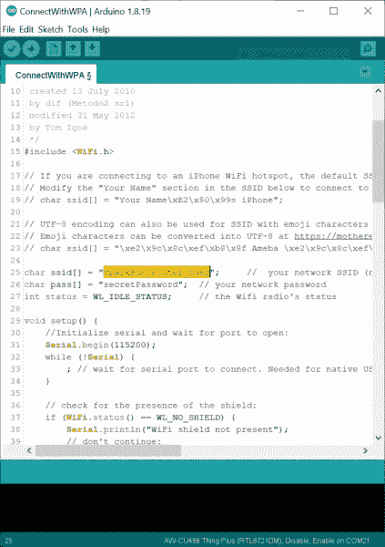](https://cdn.sparkfun.com/assets/learn_tutorials/2/5/1/8/SparkFun_AzureWave_Arduino_5GHz_ConnectwithWPA.jpg)

从菜单中选择正确的板卡定义(本例中为**工具** > **板卡**>**AW-Cu 488 Thing Plus(RTL 8721dm)**)。然后选择板卡枚举到的正确 COM 端口(本例中为 **COM21** )。点击上传按钮。

在 **115200** 处打开 Arduino 串行监视器。AzureWave Thing Plus (AW-CU488)将尝试连接到网络。

[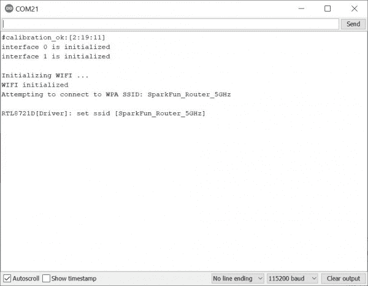](https://cdn.sparkfun.com/assets/learn_tutorials/2/5/1/8/SparkFun_AzureWave_Connect_5GHz_Arduino_WiFi_Network.jpg)

如果一切顺利，您应该会看到一些状态输出和消息，表明您已连接到您的网络！在这种情况下，我收到了以下消息:

```
language:bash
You're connected to the networkSSID: SparkFun_Router_5GHz 
```

串行输出将继续输出连接状态，其中包括 SSID、信号强度(RSSI)和加密类型。如果您有管理员权限，您可以检查设备是否也连接到 5GHz WiFI 网络。尝试连接到一个网站，并拉你所在地区的当地时间或天气！

## 示例 4a:音频编解码器输入快速傅立叶变换(FFT)

### 所需材料

为了完成教程的这一部分，您需要以下材料。你可能不需要所有的东西，这取决于你拥有什么。将它添加到您的购物车，通读指南，并根据需要调整购物车。

[](https://www.sparkfun.com/products/12002) 

将**添加到您的[购物车](https://www.sparkfun.com/cart)中！**

### [【试验板-不干胶(白色)](https://www.sparkfun.com/products/12002)

[In stock](https://learn.sparkfun.com/static/bubbles/ "in stock") PRT-12002

这是你的尝试和真正的白色无焊试验板。它有 2 条电源总线，10 列，30 行，总共 400 个连接…

$5.5048[Favorited Favorite](# "Add to favorites") 93[Wish List](# "Add to wish list")****[](https://www.sparkfun.com/products/19957) 

将**添加到您的[购物车](https://www.sparkfun.com/cart)中！**

### [spark fun azure wave Thing Plus-AW-Cu 488](https://www.sparkfun.com/products/19957)

[In stock](https://learn.sparkfun.com/static/bubbles/ "in stock") DEV-19957

SparkFun AzureWave Thing Plus 是一款配备 AW-CU488 的羽毛外形开发板。

$49.95[Favorited Favorite](# "Add to favorites") 5[Wish List](# "Add to wish list")****[](https://www.sparkfun.com/products/116) 

将**添加到您的[购物车](https://www.sparkfun.com/cart)中！**

### [破开头球——直击](https://www.sparkfun.com/products/116)

[In stock](https://learn.sparkfun.com/static/bubbles/ "in stock") PRT-00116

一排标题-打破适应。40 个引脚，可切割成任何尺寸。用于定制 PCB 或通用定制接头。

$1.7520[Favorited Favorite](# "Add to favorites") 133[Wish List](# "Add to wish list")****[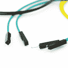](https://www.sparkfun.com/products/9140) 

将**添加到您的[购物车](https://www.sparkfun.com/cart)中！**

### [跳线高级 6" M/F 装 10 根](https://www.sparkfun.com/products/9140)

[In stock](https://learn.sparkfun.com/static/bubbles/ "in stock") PRT-09140

这是一个 SparkFun 独家！这些都是 155 毫米长，26 美国线规跳线终止作为男性到女性。用这些来跳离…

$4.501[Favorited Favorite](# "Add to favorites") 16[Wish List](# "Add to wish list")****[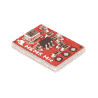](https://www.sparkfun.com/products/19389) 

将**添加到您的[购物车](https://www.sparkfun.com/cart)中！**

### [SparkFun 模拟 MEMS 麦克风分线点- SPH8878LR5H-1](https://www.sparkfun.com/products/19389)

[In stock](https://learn.sparkfun.com/static/bubbles/ "in stock") BOB-19389

SparkFun 模拟 MEMS 麦克风突破使使用 Knowles 的 SPH8878LR5H-1 模拟麦克风变得非常容易。

$6.952[Favorited Favorite](# "Add to favorites") 5[Wish List](# "Add to wish list")****[](https://www.sparkfun.com/products/15424) 

将**添加到您的[购物车](https://www.sparkfun.com/cart)中！**

### [可逆 USB A 转 C 线- 2m](https://www.sparkfun.com/products/15424)

[18 available](https://learn.sparkfun.com/static/bubbles/ "18 available") CAB-15424

这些 2 米长的电缆稍加修改后，就可以插入其端口，而不用考虑其在 U…

$8.951[Favorited Favorite](# "Add to favorites") 4[Wish List](# "Add to wish list")**************************Note:** Click below for a wishlist of the parts for this section.

[AzureWave Thing Plus (AW-CU488) Fast Fourier Transform Parts Wishlist](https://www.sparkfun.com/wish_lists/169282)

### 硬件连接

对于以下示例，您将需要以下连接，如 Fritzing 图所示。

[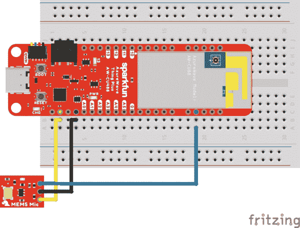](https://cdn.sparkfun.com/assets/learn_tutorials/2/5/1/8/SparkFun_AzureWave_Input_FastFourierTransform_FFT_.jpg)

您需要将接头焊接到 AzureWave Thing Plus (AW-CU488)上。然后在 MEMS 麦克风分接头上焊接接头。在这种情况下，我们以直角焊接直接头，以连接 M/F 跳线。根据您的个人喜好，您也可以像 AzureWave Thing Plus (AW-CU488)一样将接头焊接在 MEMS 麦克风上。请确保电路板底部的麦克风输入背向试验板。

如果你使用水溶性助焊剂，确保清除残留在电路板上的助焊剂。确保小心不要让任何液体进入 MEMs 麦克风或 AW-CU488 模块。异丙醇和棉签可以很好地去除水溶性助焊剂。然后将电路板插入试验板，并将电线连接到 MEMS 麦克风。最后，在 AzureWave Thing Plus (AW-CU488)和电脑的 COM 端口之间连接一根 USB C 线。

[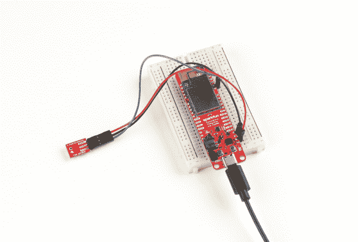](https://cdn.sparkfun.com/assets/learn_tutorials/2/5/1/8/SparkFun_AzureWave_Thing_Plus_AW-CU488_Input_Mic_Fast_Fourier_Transform.jpg)

### 示例代码

让我们上传草图来计算一个音频信号的快速傅立叶变换(FFT)。从菜单中选择如下:**文件** > **实例** > 实例为 AW_CU488 东西加(RTL 8721dm)|**AmebaAudioCodec**>**input ftt**。

或者，您可以在 Arduino IDE 中复制并粘贴以下代码。从菜单中选择正确的板卡定义(本例中为**工具** > **板卡**>**AW-Cu 488 Thing Plus(RTL 8721dm)**)。然后选择板卡枚举到的正确 COM 端口(本例中为 **COM21** )。点击上传按钮。

```
language:c
#include "AudioCodec.h"
#include "FFT.h"

#define SAMPLERATE 16000
#define SAMPLECOUNT 128

int16_t audio_buffer[SAMPLECOUNT] = {0};
float fft_buffer[SAMPLECOUNT/2] = {0};
uint16_t freq_bins[SAMPLECOUNT/2] = {0};
int i = 0;

FFT fft;

void setup() {
    Serial.begin(2000000);

    fft.setWindow(HANN, SAMPLECOUNT);
    fft.getFrequencyBins(freq_bins, SAMPLECOUNT, SAMPLERATE);

    for (i = 0; i < (SAMPLECOUNT/2); i++) {
        Serial.print(freq_bins[i]);
        Serial.print(" Hz | ");
    }
    Serial.println();

    Codec.setSampleRate(SAMPLERATE);
    Codec.begin(TRUE, FALSE);
}

void loop() {
    if(Codec.readAvaliable()) {
        Codec.readDataPage(audio_buffer, SAMPLECOUNT);    // read latest received data from buffer
        fft.calculate(audio_buffer, fft_buffer, SAMPLECOUNT);
        for (i = 0; i < (SAMPLECOUNT/2); i++) {
            if (fft_buffer[i] > 0.01) {
                Serial.print(fft_buffer[i],2);
                Serial.print(" | ");
            } else {
                Serial.print(" - |");
            }
        }
        Serial.println();
    }
    delay(1);
} 
```

打开设置为 **2000000** 的 Arduino 串行监视器，将输出与下图类似的数据。每一行都将为每个频率设置一个值:

```
language:bash
0 Hz,125 Hz,250 Hz,375 Hz,500 Hz,625 Hz,750 Hz,875 Hz,1000 Hz,1125 Hz,1250 Hz,1375 Hz,1500 Hz,1625 Hz,1750 Hz,1875 Hz,2000 Hz,2125 Hz,2250 Hz,2375 Hz,2500 Hz,2625 Hz,2750 Hz,2875 Hz,3000 Hz,3125 Hz,3250 Hz,3375 Hz,3500 Hz,3625 Hz,3750 Hz,3875 Hz,4000 Hz,4125 Hz,4250 Hz,4375 Hz,4500 Hz,4625 Hz,4750 Hz,4875 Hz,5000 Hz,5125 Hz,5250 Hz,5375 Hz,5500 Hz,5625 Hz,5750 Hz,5875 Hz,6000 Hz,6125 Hz,6250 Hz,6375 Hz,6500 Hz,6625 Hz,6750 Hz,6875 Hz,7000 Hz,7125 Hz,7250 Hz,7375 Hz,7500 Hz,7625 Hz,7750 Hz,7875 Hz 
```

尝试向输入麦克风吹气或播放智能手机上的音乐。FFT 输出将对输入音频做出反应，并将信号分成几个频段。更好的是，尝试使用音调发生器或播放视频，它可以生成达到所需频率的音频样本。下面的视频是一个音频样本，在 20Hz 到 20kHz 之间增加。播放下面的视频，观察每个频率的值。您可能需要调整扬声器的音量。您会注意到，当麦克风听到与分量相对应的频率时，该值最大。相邻分量可能大于 0，具体取决于扬声器的音量。

[https://www.youtube.com/embed/qNf9nzvnd1k/?autohide=1&border=0&wmode=opaque&enablejsapi=1](https://www.youtube.com/embed/qNf9nzvnd1k/?autohide=1&border=0&wmode=opaque&enablejsapi=1)

示例代码将音频样本分成几个部分(应该是样本数的一半，因此每行有 64 个值)，这使得很难通过 Arduino 串行监视器查看。通过用逗号`'`替换每个数据之间的空格和`|`，尝试用逗号分隔值输出数据。如果该值小于`0.01`，该值将被视为`0`，而不是`-`。尝试缩放数值(即乘以`fft_buffer[i]*100`)。这将有助于通过 Arduino 串行绘图仪可视化数据。下面是修改后的示例代码，描述了所做的更改。

```
language:c
//modified inputFFT.ino for Comma Separated Values

#include "AudioCodec.h"
#include "FFT.h"

#define SAMPLERATE 16000
#define SAMPLECOUNT 128

int16_t audio_buffer[SAMPLECOUNT] = {0};
float fft_buffer[SAMPLECOUNT/2] = {0};
uint16_t freq_bins[SAMPLECOUNT/2] = {0};
int i = 0;

FFT fft;

void setup() {
    Serial.begin(2000000);

    fft.setWindow(HANN, SAMPLECOUNT);
    fft.getFrequencyBins(freq_bins, SAMPLECOUNT, SAMPLERATE);

    for (i = 0; i < (SAMPLECOUNT/2); i++) {
        //
        Serial.print(freq_bins[i]);
        Serial.print(" Hz");
        Serial.print(","); //comma separated value (CSV)
        //Serial.print(" | ");
    }
    Serial.println();

    Codec.setSampleRate(SAMPLERATE);
    Codec.begin(TRUE, FALSE);
}

void loop() {
    if(Codec.readAvaliable()) {
        Codec.readDataPage(audio_buffer, SAMPLECOUNT);    // read latest received data from buffer
        fft.calculate(audio_buffer, fft_buffer, SAMPLECOUNT);
        for (i = 0; i < (SAMPLECOUNT/2); i++) {
            if (fft_buffer[i] > 0.01) {
                // multiply the component by 100 so we can see the the value better in the Arduino Serial Plotter
                Serial.print(fft_buffer[i]*100,2);
                Serial.print(","); //comma separated value (CSV)
                //Serial.print(" | ");
            } else {
                Serial.print(0);
                Serial.print(","); //comma separated value (CSV)
                //Serial.print(" - |");
            }
        }
        Serial.println();
    }
    delay(1);
} 
```

尝试进一步调整代码，并将值映射到 PWM 引脚，以便在音频达到特定频率时打开 LED！

## 示例 4b:音频编解码器-基本输入/输出

### 所需材料

为了完成教程的这一部分，您需要以下材料。你可能不需要所有的东西，这取决于你拥有什么。将它添加到您的购物车，通读指南，并根据需要调整购物车。

[](https://www.sparkfun.com/products/12002) 

将**添加到您的[购物车](https://www.sparkfun.com/cart)中！**

### [【试验板-不干胶(白色)](https://www.sparkfun.com/products/12002)

[In stock](https://learn.sparkfun.com/static/bubbles/ "in stock") PRT-12002

这是你的尝试和真正的白色无焊试验板。它有 2 条电源总线，10 列，30 行，总共 400 个连接…

$5.5048[Favorited Favorite](# "Add to favorites") 93[Wish List](# "Add to wish list")****[](https://www.sparkfun.com/products/19957) 

将**添加到您的[购物车](https://www.sparkfun.com/cart)中！**

### [spark fun azure wave Thing Plus-AW-Cu 488](https://www.sparkfun.com/products/19957)

[In stock](https://learn.sparkfun.com/static/bubbles/ "in stock") DEV-19957

SparkFun AzureWave Thing Plus 是一款配备 AW-CU488 的羽毛外形开发板。

$49.95[Favorited Favorite](# "Add to favorites") 5[Wish List](# "Add to wish list")****[](https://www.sparkfun.com/products/116) 

将**添加到您的[购物车](https://www.sparkfun.com/cart)中！**

### [破开头球——直击](https://www.sparkfun.com/products/116)

[In stock](https://learn.sparkfun.com/static/bubbles/ "in stock") PRT-00116

一排标题-打破适应。40 个引脚，可切割成任何尺寸。用于定制 PCB 或通用定制接头。

$1.7520[Favorited Favorite](# "Add to favorites") 133[Wish List](# "Add to wish list")****[](https://www.sparkfun.com/products/9140) 

将**添加到您的[购物车](https://www.sparkfun.com/cart)中！**

### [跳线高级 6" M/F 装 10 根](https://www.sparkfun.com/products/9140)

[In stock](https://learn.sparkfun.com/static/bubbles/ "in stock") PRT-09140

这是一个 SparkFun 独家！这些都是 155 毫米长，26 美国线规跳线终止作为男性到女性。用这些来跳离…

$4.501[Favorited Favorite](# "Add to favorites") 16[Wish List](# "Add to wish list")****[](https://www.sparkfun.com/products/19389) 

将**添加到您的[购物车](https://www.sparkfun.com/cart)中！**

### [SparkFun 模拟 MEMS 麦克风分线点- SPH8878LR5H-1](https://www.sparkfun.com/products/19389)

[In stock](https://learn.sparkfun.com/static/bubbles/ "in stock") BOB-19389

SparkFun 模拟 MEMS 麦克风突破使使用 Knowles 的 SPH8878LR5H-1 模拟麦克风变得非常容易。

$6.952[Favorited Favorite](# "Add to favorites") 5[Wish List](# "Add to wish list")****[](https://www.sparkfun.com/products/8431) 

将**添加到您的[购物车](https://www.sparkfun.com/cart)中！**

### [跳线高级 6 "米/米装 10 根](https://www.sparkfun.com/products/8431)

[In stock](https://learn.sparkfun.com/static/bubbles/ "in stock") PRT-08431

这是一个 SparkFun 独家！这些是 155 毫米长、26 AWG 跳线，两端都有公接头。用这些来跳离…

$4.502[Favorited Favorite](# "Add to favorites") 11[Wish List](# "Add to wish list")****[](https://www.sparkfun.com/products/15424) 

将**添加到您的[购物车](https://www.sparkfun.com/cart)中！**

### [可逆 USB A 转 C 线- 2m](https://www.sparkfun.com/products/15424)

[18 available](https://learn.sparkfun.com/static/bubbles/ "18 available") CAB-15424

这些 2 米长的电缆稍加修改后，就可以插入其端口，而不用考虑其在 U…

$8.951[Favorited Favorite](# "Add to favorites") 4[Wish List](# "Add to wish list")****[](https://www.sparkfun.com/products/9151) 

将**添加到您的[购物车](https://www.sparkfun.com/cart)中！**

### [扬声器- 0.5W (8 欧姆)](https://www.sparkfun.com/products/9151)

[In stock](https://learn.sparkfun.com/static/bubbles/ "in stock") COM-09151

一款小型音频扬声器，非常适合无线电和放大器项目，并且小到足以适合机器人项目。

$2.45[Favorited Favorite](# "Add to favorites") 29[Wish List](# "Add to wish list")****[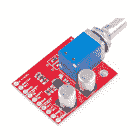](https://www.sparkfun.com/products/14475) 

将**添加到您的[购物车](https://www.sparkfun.com/cart)中！**

### [SparkFun 吵蟋蟀立体声放大器- 1.5W](https://www.sparkfun.com/products/14475)

[In stock](https://learn.sparkfun.com/static/bubbles/ "in stock") DEV-14475

嘈杂的板球立体声放大器，使用 LM4853，可配置输出高达 1.5W 的功率在单声道操作或…

$12.501[Favorited Favorite](# "Add to favorites") 15[Wish List](# "Add to wish list")********************************Note:** Click below for a wishlist to follow along this section.

[AzureWave Thing Plus (AW-CU488) Basic Input/Output Parts Wishlist](https://www.sparkfun.com/wish_lists/169284)

### 硬件连接

对于以下示例，您将需要以下连接，如 Fritzing 图所示。Fritzing 图将麦克风的输入连接到左模拟输出。根据您的设置，您可以将输出连接到两个扬声器，而不是一个。在这种情况下，您还需要将右模拟输出(即引脚“13”到“右输入”)连接到放大器，并在系统中添加第二个扬声器(右输出和 GND)。

[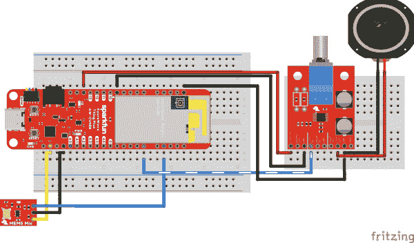](https://cdn.sparkfun.com/assets/learn_tutorials/2/5/1/8/SparkFun_Fritzing_AzureWaveBasicInOut_Mic_Amp_Speaker.jpg)

如果还没有，将接头焊接到 AzureWave Thing Plus (AW-CU488)、MEMs 麦克风和 Noisy Cricket。如前一节所述，确保小心清除电路板上的助焊剂残留物，以免液体滞留在麦克风或 AW-CU488 模块中。然后[剥去两根电线，将电线末端](https://learn.sparkfun.com/tutorials/working-with-wire)焊接到扬声器耳片上。当然，您也可以将 M/M 跳线上的引脚焊接到扬声器标签上，而无需剥去电线。

[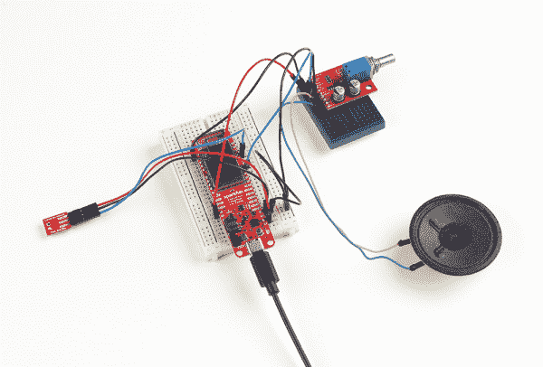](https://cdn.sparkfun.com/assets/learn_tutorials/2/5/1/8/SparkFun_AzureWave_Thing_Plus_AW-CU488_Basic_Input_Output.jpg)**Note:** If you are using the audio codec, you will not be able to use the built-in LED on pin 13\. You will need choose another pin for a digital output and connect a separate LED with a current limiting resistor.**Note:** Adding delays (especially long delays) in the code will affect the performance of the output signal.**Note:** The example in this section sets the input volume to a certain value. To manually adjust the input volume on the microphone side, simply add a potentiometer to the setup as shown below.

[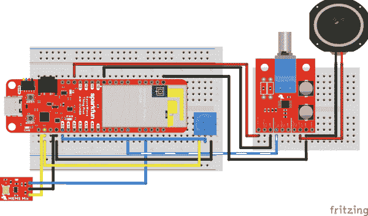](https://cdn.sparkfun.com/assets/learn_tutorials/2/5/1/8/SparkFun_Fritzing_AzureWaveBasicInOut_Mic_Potentiometer_Amp_Speaker.jpg)

### 示例代码

让我们上传草图，从麦克风读取输入，并将信号输出到一个扬声器。从菜单中选择如下:**文件** > **实例** > 实例为 AW_CU488 东西加(RTL 8721dm)|**AmebaAudioCodec**>**基础输入输出**。

或者，您可以在 Arduino IDE 中复制并粘贴以下代码。从菜单中选择正确的板卡定义(本例中为**工具** > **板卡**>**AW-Cu 488 Thing Plus(RTL 8721dm)**)。然后选择板卡枚举到的正确 COM 端口(本例中为 **COM15** )。点击上传按钮。

**Warning:** Make sure to turn the volume down on the amplifier. You may get some feedback with the microphone next to the speakers.

```
language:c
//int analog_pin = A0;  //<=== Add this line before including Audio Codec library if you are using the potiometer and  not using the value A0

#include "AudioCodec.h"

#define SAMPLECOUNT 512

int16_t buffer[SAMPLECOUNT] = {0};
unsigned int vol = 1024;

void setup() {
    Codec.setSampleRate(16000);
    Codec.begin(TRUE, TRUE);
}

void loop() {
    // if received data is avaliable and transmit data buffer is avaliable for write
    if(Codec.writeAvaliable() && Codec.readAvaliable()) {
        Codec.readDataPage(buffer, SAMPLECOUNT);    // read latest received data from buffer
        Codec.writeDataPage(buffer, SAMPLECOUNT);   // write latest data into transmit data buffer
    }
    //vol = analogRead(A0);// commented out so we do not need to connect a potentiometer
    vol = 750; // adjust this value between 0 to 1024
    vol = map(vol, 0, 1024, 0, 100);
    Codec.setOutputVolume(vol, vol);
} 
```

上传后，试着对着麦克风吹气，或者轻敲桌子上的麦克风。您应该在输出扬声器上听到相同的声音，但声音更大。当声音从麦克风读入并输出到扬声器时，您会注意到输出有一点延迟。

## 示例 5: Qwiic 微有机发光二极管

### 所需材料

为了完成教程的这一部分，您需要以下材料。你可能不需要所有的东西，这取决于你拥有什么。将它添加到您的购物车，通读指南，并根据需要调整购物车。

[](https://www.sparkfun.com/products/19957) 

将**添加到您的[购物车](https://www.sparkfun.com/cart)中！**

### [spark fun azure wave Thing Plus-AW-Cu 488](https://www.sparkfun.com/products/19957)

[In stock](https://learn.sparkfun.com/static/bubbles/ "in stock") DEV-19957

SparkFun AzureWave Thing Plus 是一款配备 AW-CU488 的羽毛外形开发板。

$49.95[Favorited Favorite](# "Add to favorites") 5[Wish List](# "Add to wish list")****[](https://www.sparkfun.com/products/17259) 

将**添加到您的[购物车](https://www.sparkfun.com/cart)中！**

### [柔性 Qwiic 线缆- 100mm](https://www.sparkfun.com/products/17259)

[In stock](https://learn.sparkfun.com/static/bubbles/ "in stock") PRT-17259

这种极化 I2C 电缆绝缘是由硅制成的，比我们原来的 Qwiic 电缆更灵活，特别是在

$1.60[Favorited Favorite](# "Add to favorites") 8[Wish List](# "Add to wish list")****[](https://www.sparkfun.com/products/14532) 

将**添加到您的[购物车](https://www.sparkfun.com/cart)中！**

### [【spark fun 微有机发光二极管突围(Qwiic)](https://www.sparkfun.com/products/14532)

[In stock](https://learn.sparkfun.com/static/bubbles/ "in stock") LCD-14532

SparkFun Qwiic 微型有机发光二极管突破是 Qwiic 启用版本的流行微视图和微型有机发光二极管显示器！

$18.506[Favorited Favorite](# "Add to favorites") 45[Wish List](# "Add to wish list")****[](https://www.sparkfun.com/products/15424) 

将**添加到您的[购物车](https://www.sparkfun.com/cart)中！**

### [可逆 USB A 转 C 线- 2m](https://www.sparkfun.com/products/15424)

[18 available](https://learn.sparkfun.com/static/bubbles/ "18 available") CAB-15424

这些 2 米长的电缆稍加修改后，就可以插入其端口，而不用考虑其在 U…

$8.951[Favorited Favorite](# "Add to favorites") 4[Wish List](# "Add to wish list")******************Note:** Click below for a wishlist to follow along this section.

[AzureWave Thing Plus (AW-CU488) Qwiic Micro OLED Parts Wishlist](https://www.sparkfun.com/wish_lists/169285)

### 硬件连接

要连接 qw IC 微型有机发光二极管，只需在显示器和 AzureWave Thing Plus (AW-CU488)之间插入 qw IC 电缆。然后在 AzureWave Thing Plus (AW-CU488)和电脑的 COM 端口之间连接一根 USB C 线。

[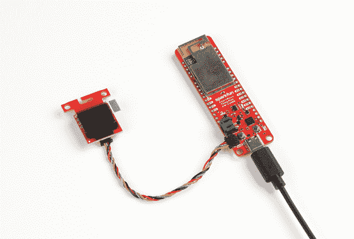](https://cdn.sparkfun.com/assets/learn_tutorials/2/5/1/8/SparkFun_AzureWave_Thing_Plus_AW-CU488_Qwiic_Micro_OLED.jpg)

### 安装 Arduino 库

**注意:**此示例假设您在桌面上使用的是最新版本的 Arduino IDE。如果这是你第一次使用 Arduino，请回顾我们关于[安装 Arduino IDE 的教程。](https://learn.sparkfun.com/tutorials/installing-arduino-ide)如果您之前没有安装 Arduino 库，请查看我们的[安装指南。](https://learn.sparkfun.com/tutorials/installing-an-arduino-library)

首先，你需要下载并安装 **SparkFun 微型有机发光二极管库**。你可以在 Arduino IDE 的库管理器中通过搜索“**微型有机发光二极管突破**”来自动安装这个库。也可以从 [GitHub 库](https://github.com/sparkfun/SparkFun_Micro_OLED_Arduino_Library)手动下载。此外，请务必下载 Qwiic 示例草图，我们将在本教程中回顾这些草图。

[Download the SparkFun Micro OLED Library (ZIP)](https://github.com/sparkfun/SparkFun_Micro_OLED_Arduino_Library/archive/main.zip)

### Arduino 代码|示例 10:多模式 v13

让我们上传草图，在 Qwiic 微型有机发光二极管上显示图形和字符。从菜单中选择以下:**文件** > **示例** > 自定义库示例 | **SparkFun 微有机发光二极管突破** > **示例 10 MultiDemo_v13** 。

或者，您可以在 Arduino IDE 中复制并粘贴以下代码。从菜单中选择正确的板卡定义(本例中为**工具** > **板卡**>**AW-Cu 488 Thing Plus(RTL 8721dm)**)。然后选择板卡枚举到的正确 COM 端口(本例中为 **COM21** )。点击上传按钮。

```
language:c
/*
  SFE_MicroOLED Library Demo
  Paul Clark @ SparkFun Electronics
  Original Creation Date: December 11th, 2020

  This sketch uses the MicroOLED library to show all the functionality built into the library
  using the begin function defined in version v1.3 of the library - which allows different
  TwoWire ports and custom I2C addresses to be used.

  If you are using the standard Micro OLED display, its I2C address will be 0x3D or 0x3C
  depending on how you have the D/C or ADDR jumper configured.

  Hardware Connections:
    This example assumes you are using Qwiic. See the SPI examples for
    a detailed breakdown of connection info.

  Want to support open source hardware? Buy a board from SparkFun!
  https://www.sparkfun.com/products/13003
  https://www.sparkfun.com/products/14532

  This code is beerware; if you see me (or any other SparkFun employee) at the
  local, and you've found our code helpful, please buy us a round!

  Distributed as-is; no warranty is given.
*/

#include <Wire.h>
#include <SFE_MicroOLED.h> //Click here to get the library: http://librarymanager/All#SparkFun_Micro_OLED

#define PIN_RESET 9

/*
// This is the old way of instantiating oled. You can still do it this way if you want to.
#define DC_JUMPER 1
MicroOLED oled(PIN_RESET, DC_JUMPER); // I2C declaration
*/

// From version v1.3, we can also instantiate oled like this (but only for I2C)
MicroOLED oled(PIN_RESET); // The TwoWire I2C port is passed to .begin instead

void setup()
{
  delay(100);
  Wire.begin(); // <-- Change this to (e.g.) Qwiic.begin(); as required
  //Wire.setClock(400000); // Uncomment this line to increase the I2C bus speed to 400kHz

/*
  // This is the old way of initializing the OLED.
  // You can still do it this way if you want to - but only
  // if you instantiated oled using: MicroOLED oled(PIN_RESET, DC_JUMPER)
  oled.begin();    // Initialize the OLED
*/

  // This is the new way of initializing the OLED.
  // We can pass a different I2C address and TwoWire port
  oled.begin(0x3D, Wire);    // Initialize the OLED

/*
  // This is the new way of initializing the OLED.
  // We can pass a different I2C address and TwoWire port
  oled.begin(0x3C, Qwiic);    // Initialize the OLED
*/

  oled.clear(ALL); // Clear the display's internal memory
  oled.display();  // Display what's in the buffer (splashscreen)

  delay(1000); // Delay 1000 ms

  oled.clear(PAGE); // Clear the buffer.

  randomSeed(analogRead(A0) + analogRead(A1));
}

void pixelExample()
{
  printTitle("Pixels", 1);

  for (int i = 0; i < 512; i++)
  {
    oled.pixel(random(oled.getLCDWidth()), random(oled.getLCDHeight()));
    oled.display();
  }
}

void lineExample()
{
  int middleX = oled.getLCDWidth() / 2;
  int middleY = oled.getLCDHeight() / 2;
  int xEnd, yEnd;
  int lineWidth = min(middleX, middleY);

  printTitle("Lines!", 1);

  for (int i = 0; i < 3; i++)
  {
    for (int deg = 0; deg < 360; deg += 15)
    {
      xEnd = lineWidth * cos(deg * PI / 180.0);
      yEnd = lineWidth * sin(deg * PI / 180.0);

      oled.line(middleX, middleY, middleX + xEnd, middleY + yEnd);
      oled.display();
      delay(10);
    }
    for (int deg = 0; deg < 360; deg += 15)
    {
      xEnd = lineWidth * cos(deg * PI / 180.0);
      yEnd = lineWidth * sin(deg * PI / 180.0);

      oled.line(middleX, middleY, middleX + xEnd, middleY + yEnd, BLACK, NORM);
      oled.display();
      delay(10);
    }
  }
}

void shapeExample()
{
  printTitle("Shapes!", 0);

  // Silly pong demo. It takes a lot of work to fake pong...
  int paddleW = 3;  // Paddle width
  int paddleH = 15; // Paddle height
  // Paddle 0 (left) position coordinates
  int paddle0_Y = (oled.getLCDHeight() / 2) - (paddleH / 2);
  int paddle0_X = 2;
  // Paddle 1 (right) position coordinates
  int paddle1_Y = (oled.getLCDHeight() / 2) - (paddleH / 2);
  int paddle1_X = oled.getLCDWidth() - 3 - paddleW;
  int ball_rad = 2; // Ball radius
  // Ball position coordinates
  int ball_X = paddle0_X + paddleW + ball_rad;
  int ball_Y = random(1 + ball_rad, oled.getLCDHeight() - ball_rad); //paddle0_Y + ball_rad;
  int ballVelocityX = 1;                                             // Ball left/right velocity
  int ballVelocityY = 1;                                             // Ball up/down velocity
  int paddle0Velocity = -1;                                          // Paddle 0 velocity
  int paddle1Velocity = 1;                                           // Paddle 1 velocity

  //while(ball_X >= paddle0_X + paddleW - 1)
  while ((ball_X - ball_rad > 1) &&
         (ball_X + ball_rad < oled.getLCDWidth() - 2))
  {
    // Increment ball's position
    ball_X += ballVelocityX;
    ball_Y += ballVelocityY;
    // Check if the ball is colliding with the left paddle
    if (ball_X - ball_rad < paddle0_X + paddleW)
    {
      // Check if ball is within paddle's height
      if ((ball_Y > paddle0_Y) && (ball_Y < paddle0_Y + paddleH))
      {
        ball_X++;                       // Move ball over one to the right
        ballVelocityX = -ballVelocityX; // Change velocity
      }
    }
    // Check if the ball hit the right paddle
    if (ball_X + ball_rad > paddle1_X)
    {
      // Check if ball is within paddle's height
      if ((ball_Y > paddle1_Y) && (ball_Y < paddle1_Y + paddleH))
      {
        ball_X--;                       // Move ball over one to the left
        ballVelocityX = -ballVelocityX; // change velocity
      }
    }
    // Check if the ball hit the top or bottom
    if ((ball_Y <= ball_rad) || (ball_Y >= (oled.getLCDHeight() - ball_rad - 1)))
    {
      // Change up/down velocity direction
      ballVelocityY = -ballVelocityY;
    }
    // Move the paddles up and down
    paddle0_Y += paddle0Velocity;
    paddle1_Y += paddle1Velocity;
    // Change paddle 0's direction if it hit top/bottom
    if ((paddle0_Y <= 1) || (paddle0_Y > oled.getLCDHeight() - 2 - paddleH))
    {
      paddle0Velocity = -paddle0Velocity;
    }
    // Change paddle 1's direction if it hit top/bottom
    if ((paddle1_Y <= 1) || (paddle1_Y > oled.getLCDHeight() - 2 - paddleH))
    {
      paddle1Velocity = -paddle1Velocity;
    }

    // Draw the Pong Field
    oled.clear(PAGE); // Clear the page
    // Draw an outline of the screen:
    oled.rect(0, 0, oled.getLCDWidth() - 1, oled.getLCDHeight());
    // Draw the center line
    oled.rectFill(oled.getLCDWidth() / 2 - 1, 0, 2, oled.getLCDHeight());
    // Draw the Paddles:
    oled.rectFill(paddle0_X, paddle0_Y, paddleW, paddleH);
    oled.rectFill(paddle1_X, paddle1_Y, paddleW, paddleH);
    // Draw the ball:
    oled.circle(ball_X, ball_Y, ball_rad);
    // Actually draw everything on the screen:
    oled.display();
    delay(25); // Delay for visibility
  }
  delay(1000);
}

void textExamples()
{
  printTitle("Text!", 1);

  // Demonstrate font 0\. 5x8 font
  oled.clear(PAGE);     // Clear the screen
  oled.setFontType(0);  // Set font to type 0
  oled.setCursor(0, 0); // Set cursor to top-left
  // There are 255 possible characters in the font 0 type.
  // Lets run through all of them and print them out!
  for (int i = 0; i <= 255; i++)
  {
    // You can write byte values and they'll be mapped to
    // their ASCII equivalent character.
    oled.write(i);  // Write a byte out as a character
    oled.display(); // Draw on the screen
    delay(10);      // Wait 10ms
    // We can only display 60 font 0 characters at a time.
    // Every 60 characters, pause for a moment. Then clear
    // the page and start over.
    if ((i % 60 == 0) && (i != 0))
    {
      delay(500);           // Delay 500 ms
      oled.clear(PAGE);     // Clear the page
      oled.setCursor(0, 0); // Set cursor to top-left
    }
  }
  delay(500); // Wait 500ms before next example

  // Demonstrate font 1\. 8x16\. Let's use the print function
  // to display every character defined in this font.
  oled.setFontType(1);  // Set font to type 1
  oled.clear(PAGE);     // Clear the page
  oled.setCursor(0, 0); // Set cursor to top-left
  // Print can be used to print a string to the screen:
  oled.print(" !\"#$%&'()*+,-./01234");
  oled.display(); // Refresh the display
  delay(1000);    // Delay a second and repeat
  oled.clear(PAGE);
  oled.setCursor(0, 0);
  oled.print("56789:;<=>?@ABCDEFGHI");
  oled.display();
  delay(1000);
  oled.clear(PAGE);
  oled.setCursor(0, 0);
  oled.print("JKLMNOPQRSTUVWXYZ[\\]^");
  oled.display();
  delay(1000);
  oled.clear(PAGE);
  oled.setCursor(0, 0);
  oled.print("_`abcdefghijklmnopqrs");
  oled.display();
  delay(1000);
  oled.clear(PAGE);
  oled.setCursor(0, 0);
  oled.print("tuvwxyz{|}~");
  oled.display();
  delay(1000);

  // Demonstrate font 2\. 10x16\. Only numbers and '.' are defined.
  // This font looks like 7-segment displays.
  // Lets use this big-ish font to display readings from the
  // analog pins.
  for (int i = 0; i < 25; i++)
  {
    oled.clear(PAGE);           // Clear the display
    oled.setCursor(0, 0);       // Set cursor to top-left
    oled.setFontType(0);        // Smallest font
    oled.print("A0: ");         // Print "A0"
    oled.setFontType(2);        // 7-segment font
    oled.print(analogRead(A0)); // Print a0 reading
    oled.setCursor(0, 16);      // Set cursor to top-middle-left
    oled.setFontType(0);        // Repeat
    oled.print("A1: ");
    oled.setFontType(2);
    oled.print(analogRead(A1));
    oled.setCursor(0, 32);
    oled.setFontType(0);
    oled.print("A2: ");
    oled.setFontType(2);
    oled.print(analogRead(A2));
    oled.display();
    delay(100);
  }

  // Demonstrate font 3\. 12x48\. Stopwatch demo.
  oled.setFontType(3); // Use the biggest font
  int ms = 0;
  int s = 0;
  while (s <= 5)
  {
    oled.clear(PAGE);     // Clear the display
    oled.setCursor(0, 0); // Set cursor to top-left
    if (s < 10)
      oled.print("00"); // Print "00" if s is 1 digit
    else if (s < 100)
      oled.print("0"); // Print "0" if s is 2 digits
    oled.print(s);     // Print s's value
    oled.print(":");   // Print ":"
    oled.print(ms);    // Print ms value
    oled.display();    // Draw on the screen
    ms++;              // Increment ms
    if (ms >= 10)      // If ms is >= 10
    {
      ms = 0; // Set ms back to 0
      s++;    // and increment s
    }
  }
}

void loop()
{
  //pixelExample();  // Run the pixel example function
  lineExample();  // Then the line example function
  shapeExample(); // Then the shape example
  textExamples(); // Finally the text example
}

// Center and print a small title
// This function is quick and dirty. Only works for titles one
// line long.
void printTitle(String title, int font)
{
  int middleX = oled.getLCDWidth() / 2;
  int middleY = oled.getLCDHeight() / 2;

  oled.clear(PAGE);
  oled.setFontType(font);
  // Try to set the cursor in the middle of the screen
  oled.setCursor(middleX - (oled.getFontWidth() * (title.length() / 2)),
                 middleY - (oled.getFontHeight() / 2));
  // Print the title:
  oled.print(title);
  oled.display();
  delay(1500);
  oled.clear(PAGE);
} 
```

一旦上传，检查 Qwiic 微型有机发光二极管。你应该看到 SparkFun 的标志，然后是演示！尝试添加一个传感器，修改代码，并在屏幕上显示传感器值。

## 更多例子！

当然，这只是 spark fun azure wave Thing Plus(AW-Cu 488)所能做的事情的表面。本教程中没有重点介绍电路板支持包中的几个示例，我们在 Realtek 的朋友正在将这些示例移植到 AW-CU488 模块中。从菜单中，尝试打开为板列出的其他示例:**文件** > **示例**>AW _ Cu 488 Thing Plus(RTL 8721dm)示例。

[](https://cdn.sparkfun.com/assets/learn_tutorials/2/5/1/8/SparkFun_AzureWave_Arduino_More_Examples.jpg)**Note:** Some of the examples listed in the menu may still be under development. Make sure to be patient as they include more support for the AW-CU488 module.

或者尝试在你的下一个项目中添加另一个支持 Qwiic 的设备或分线板！

## 解决纷争

**Not working as expected and need help?**

If you need technical assistance and more information on a product that is not working as you expected, we recommend heading on over to the [SparkFun Technical Assistance](https://www.sparkfun.com/technical_assistance) page for some initial troubleshooting.

[SparkFun Technical Assistance Page](https://www.sparkfun.com/technical_assistance)
If you don't find what you need there, the [Realtek Forums](https://forum.amebaiot.com/) or our [SparkFun Forums](https://forum.sparkfun.com/viewforum.php?f=143) are a great place to find and ask for help.

[Realtek Forum: Ameba IoT](https://forum.amebaiot.com/)
[SparkFun Forums](https://forum.sparkfun.com/)

### 手动上传模式

在自动上传模式下上传代码有问题吗？尝试手动上传代码。点击 Arduino IDE 中的上传按钮。在调试窗口中，您应该会看到类似的内容。当 Arduino IDE 开始输出数字时。

```
language:bash
Please enter the upload mode manually(wait 5s)
    05
    04
    03
    02
    01 
```

按下启动按钮。按住启动按钮的同时，暂时按下重置按钮。保持按住开机按钮片刻，然后将手指从按钮上拿开。

| [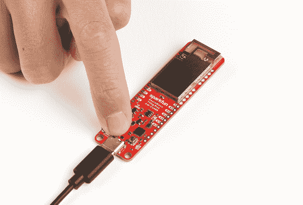](https://cdn.sparkfun.com/assets/learn_tutorials/2/5/1/8/SparkFun_AzureWave_Thing_Plus_AW-CU488_Manual_Upload-1.jpg) | [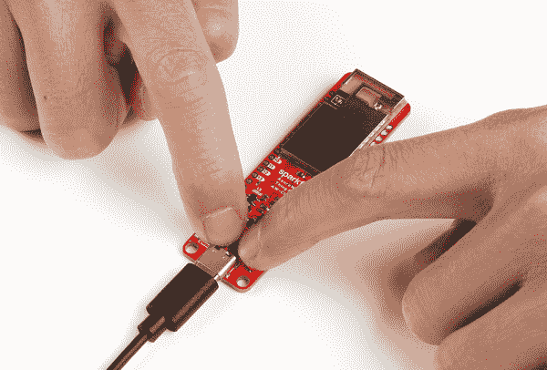](https://cdn.sparkfun.com/assets/learn_tutorials/2/5/1/8/SparkFun_AzureWave_Thing_Plus_AW-CU488_Manual_Upload-2.jpg) | [](https://cdn.sparkfun.com/assets/learn_tutorials/2/5/1/8/SparkFun_AzureWave_Thing_Plus_AW-CU488_Manual_Upload-1.jpg) | [](https://cdn.sparkfun.com/assets/learn_tutorials/2/5/1/8/SparkFun_AzureWave_Thing_Plus_AW-CU488_Manual_Upload-3.jpg) |
| *开机按钮* | *启动和复位* | *一直按住开机键* | *释放开机* |

如果一切顺利，您应该成功上传了以下消息。

```
language:bash
Please enter the upload mode manually(wait 5s)
    05
    04
    03
    02
    01
Uploading..................
    Upload Image done.
All images are sent successfully! 
```

## 资源和更进一步

现在你已经成功地启动并运行了你的 SparkFun azure wave Thing Plus(AW-Cu 488 ),是时候把它整合到你自己的项目中了！有关更多信息，请查看以下资源:

*   [示意图(PDF)](https://cdn.sparkfun.com/assets/4/2/3/5/d/SparkFun_AzureWave_Module_Thing_Plus_AW-CU488_Schematic-V10.pdf)
*   [老鹰文件(ZIP)](https://cdn.sparkfun.com/assets/5/2/c/d/0/SparkFun_AzureWave_Module_Thing_Plus_AW-CU488-V10.zip)
*   [板尺寸(PNG)](https://cdn.sparkfun.com/assets/6/a/9/9/a/SparkFun_AzureWave_Thing_Plus_AW-CU488_Board_Dimensions.png)
*   [烧结部分(FZPZ)](https://github.com/sparkfun/Fritzing_Parts/blob/main/products/19957_SparkFun_AzureWave_Thing_Plus_AW-CU488.fzpz)
*   [图形数据表(PDF)](https://cdn.sparkfun.com/assets/f/9/0/2/b/GraphicalDatasheet_SparkFun_AzureWave_ThingPlus-v10b.pdf)
*   数据表
    *   [AW-CU488 (PDF)](https://cdn.sparkfun.com/assets/c/1/6/d/3/AW-CU488_DS_DF_G_STD.pdf)
    *   [RTL8721DM (PDF)](https://cdn.sparkfun.com/assets/5/0/5/6/0/UM0401-RTL872xD-Datasheet-v2.9.pdf)
*   [Qwiic 信息页面](https://www.sparkfun.com/qwiic)
*   [比较东西加板子](https://www.sparkfun.com/thing_plus)
*   [板卡支持文件](https://github.com/ambiot/ambd_arduino)
*   [GitHub 硬件回购](https://github.com/sparkfun/AW-CU488)
*   [SFE 产品展示区](https://youtu.be/7oKjfAUvVZ0)

你的下一个项目需要一些灵感吗？查看一些与无线相关的教程。

[](https://learn.sparkfun.com/tutorials/gps-basics) [### GPS 基础知识](https://learn.sparkfun.com/tutorials/gps-basics) The Global Positioning System (GPS) is an engineering marvel that we all have access to for a relatively low cost and no subscription fee. With the correct hardware and minimal effort, you can determine your position and time almost anywhere on the globe.[Favorited Favorite](# "Add to favorites") 31[](https://learn.sparkfun.com/tutorials/sparkfun-samd21-pro-rf-hookup-guide) [### SparkFun SAMD21 Pro 射频连接指南](https://learn.sparkfun.com/tutorials/sparkfun-samd21-pro-rf-hookup-guide) Using the super blazing, nay blinding, fast SAMD21 whipping clock cycles at 48MHz and the RFM96 module to connect to the Things Network (and other Radio woodles).[Favorited Favorite](# "Add to favorites") 6[](https://learn.sparkfun.com/tutorials/artemis-global-tracker-hookup-guide) [### Artemis 全球追踪器连接指南](https://learn.sparkfun.com/tutorials/artemis-global-tracker-hookup-guide) The SparkFun Artemis Global Tracker combines the Artemis processor with an Iridium 9603N satellite transceiver, ZOE-M8Q GNSS transceiver, and MS8607 PHT sensor. With a clear view of the sky, this board allows you to send and receive short data messages from anywhere in the world including remote locations far beyond the reach of WiFi and GSM networks. Follow this guide to get started with the Artemis Global Tracker.[Favorited Favorite](# "Add to favorites") 3[](https://learn.sparkfun.com/tutorials/qwiic-kit-for-raspberry-pi-v2-hookup-guide)[New!

### 覆盆子酱 V2 连接指南的 Qwiic 套件](https://learn.sparkfun.com/tutorials/qwiic-kit-for-raspberry-pi-v2-hookup-guide) Get started with the SGP40, BME280, VCNL4040, and microOLED via I2C using the Qwiic system and Python on a Raspberry Pi! Measure VOC Index, light, temperature, humidity, and pressure from the environment. Then display them on the microOLED, serial terminal, or the cloud with Cayenne 0

或者查看一些与音频相关的教程。

[](https://learn.sparkfun.com/tutorials/spectrum-shield-hookup-guide-v2) [### 频谱屏蔽连接指南(v2)](https://learn.sparkfun.com/tutorials/spectrum-shield-hookup-guide-v2) Want your project to react to music? Then the SparkFun Spectrum Shield is the product for you! Get going in no time with this Hookup Guide.[Favorited Favorite](# "Add to favorites") 0[](https://learn.sparkfun.com/tutorials/tsunami-super-wav-trigger-hookup-guide) [### 海啸超级 WAV 触发连接指南](https://learn.sparkfun.com/tutorials/tsunami-super-wav-trigger-hookup-guide) This guide will get users started with the Qwiic Tsunami. We'll start by putting *.wav files and a configuration file on a microSD card, pop it into the Qwiic Tsunami, then trigger sounds across multiple outputs.[Favorited Favorite](# "Add to favorites") 2**************************************************************************************