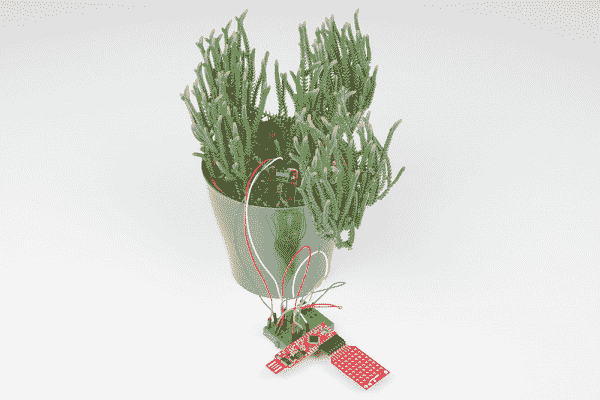

# BadgerHack:传感器附加套件

> 原文：<https://learn.sparkfun.com/tutorials/badgerhack-sensor-add-on-kit>

## 介绍

您在我们参加的各种活动中参观 SparkFun 展台时收到的 BadgerStick 可以被破解来执行各种各样的任务。BadgerStick 是一个功能齐全的微控制器，可以感知周围的环境。

本教程将指导你把你的 BadgerStick 变成一个环境感应站。我们将通过添加一个温度传感器和一个土壤湿度传感器来做到这一点。

*Plant not included***NOTE:** The BadgerStick and RedStick are two different products. The BadgerStick (aka BadgerHack) originated as an event-only platform to aid SparkFun in teaching soldering and programming at events like Maker local Faires and SXSW. The [RedStick](https://www.sparkfun.com/products/13741) evolved from that concept and is the retail version of the BadgerStick, available for sale on SparkFun.com. All of the BadgerStick tutorials and expansion kits are compatible with both the BadgerStick and the RedStick, unless otherwise stated.

### 所需材料

除了你的 Badgerstick/Redstick 和 LED 阵列显示屏，你还需要一些其他部件来完成这个项目: