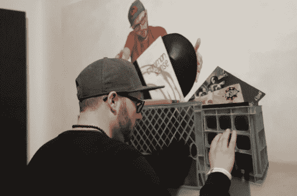
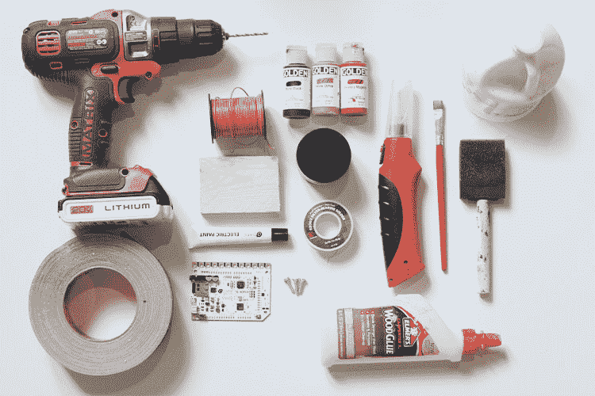
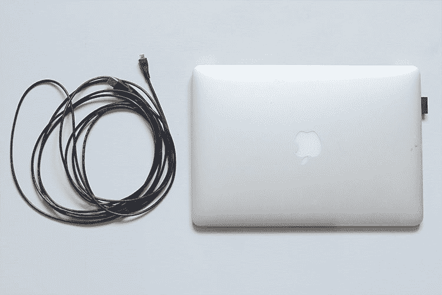

# 裸露导电音乐画

> 原文：<https://learn.sparkfun.com/tutorials/bare-conductive-musical-painting->

## 介绍

大家好！我是弯路，我是来带你走弯路，偏离传统的艺术之路的，从米开朗基罗和达芬奇的时代开始，传统艺术就被当成了只能看不能摸的东西。走进你附近的任何一家画廊，你都可以看到“请勿触摸”的标志贴满整个空间。这种思维方式创造了一个让观者脱离艺术的环境。这意味着，在大多数情况下，我们可以用来体验艺术的五种感官中，只有一种被刺激了。

幸运的是，技术带来了打破陈旧模式的方法。在本教程中，我将向您展示我如何在我的艺术中采用这种方法。更具体地说，我将带您了解我用来创建交互式艺术的过程，这些艺术不仅在墙上看起来很好，而且可以像乐器一样触摸和演奏。

*DJ A-L playing a musical self-portrait painted by Detour*

### 建议阅读/观看

在开始之前，您应该充分了解以下内容:

*   对[电容](https://learn.sparkfun.com/tutorials/capacitors)有基本的了解是很好的，但不是必需的。
*   关于电容检测的维基百科文章。
*   [如何焊接](https://learn.sparkfun.com/tutorials/how-to-solder-through-hole-soldering) -需要轻焊将电线连接到触摸板。
*   这一集 ElectriCute 很好的展示了裸导电触摸板的功能性:

[https://www.youtube.com/embed/pVvEQUbhar8/?autohide=1&border=0&wmode=opaque&enablejsapi=1](https://www.youtube.com/embed/pVvEQUbhar8/?autohide=1&border=0&wmode=opaque&enablejsapi=1)

## 所需材料

以下是本教程中使用的所有工具、耗材、硬件和软件:

### 工具和用品

*   1 块木板帆布(尺寸由您决定)
*   丙烯酸涂料
*   画笔
*   游击磁带
*   机械钻
*   1/16 英寸钻头
*   石膏
*   [焊接套件](https://www.sparkfun.com/products/13086)
*   泡沫刷
*   木块(1 英寸 x 3.5 英寸 x 2.5 英寸)
*   3 个螺钉
*   [线轴](https://www.sparkfun.com/products/11375)

### 软件

*   你需要一台运行车库乐队或类似程序的电脑。

### 电子用品