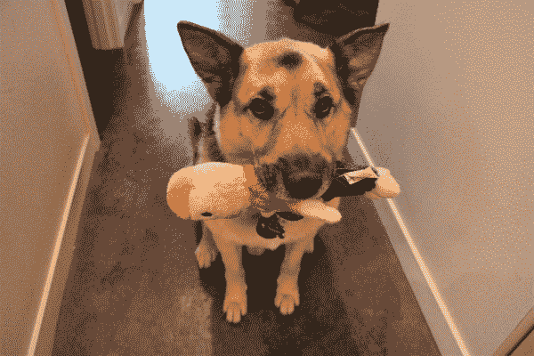
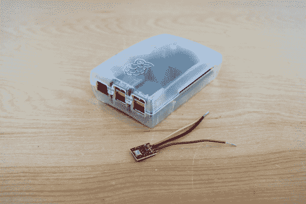

# 吠叫互动宠物监视器

> 原文：<https://learn.sparkfun.com/tutorials/bark-back-interactive-pet-monitor>

## 介绍

当你的宠物离家在外时，给它们难以捉摸的古怪行为带来一些光亮(呃，声音)!这个物联网(IoT) Bark Back 项目监控并上传你家中的噪音水平到云端，这样你就可以检查你心爱的宠物了。最棒的是:如果声音太大(例如，狗在吠叫或发出其他声音)，该程序会播放你自己的“吠叫”音频文件，以帮助分散小狗的注意力，让它们安静下来。

这个项目使用一个 [Raspberry Pi](https://www.sparkfun.com/products/13825) 来读取 [SparkFun MEMS 麦克风转接板](https://www.sparkfun.com/products/9868)并触发一个音频播放器。使用 MQTT 通信协议将数据上传到 CloudMQTT 服务。

如需演示，请查看下面的视频！

[https://www.youtube.com/embed/JbwuoS_6yl8/?autohide=1&border=0&wmode=opaque&enablejsapi=1](https://www.youtube.com/embed/JbwuoS_6yl8/?autohide=1&border=0&wmode=opaque&enablejsapi=1)

## 本教程涵盖的内容

本教程将向您展示如何执行以下操作:

*   使用 Raspberry Pi 3 连接并读取 SparkFun MEMS 麦克风
*   将音量级别上传到 CloudMQTT 服务
*   如果你的狗狗太吵，用一个音量阈值来触发你的狗吠声

## 推荐阅读

为了建立这个项目，你需要一个完全配置的，连接 WiFi 的 [Raspberry Pi 3](https://www.sparkfun.com/products/13825) 和 [Raspbian 操作系统](https://www.raspbian.org/)。了解一些 [Python 编程](https://www.python.org/about/gettingstarted/)以及以下三件事也很有帮助:(Raspberry Pi GPIO 管脚的使用和控制，(2) MQTT 通信，(3)模拟信号。如果这些你都不熟悉，或者你只是好奇(好奇！)，看看下面的教程吧！

### 树莓 Pi 3

 [### SD 卡和书写图像](https://learn.sparkfun.com/tutorials/sd-cards-and-writing-images) How to upload images to an SD card for Raspberry Pi, PCDuino, or your favorite SBC.[Favorited Favorite](# "Add to favorites") 19 [### 树莓 gPIo](https://learn.sparkfun.com/tutorials/raspberry-gpio) How to use either Python or C++ to drive the I/O lines on a Raspberry Pi.[Favorited Favorite](# "Add to favorites") 17 [### 树莓派 SPI 和 I2C 教程](https://learn.sparkfun.com/tutorials/raspberry-pi-spi-and-i2c-tutorial) Learn how to use serial I2C and SPI buses on your Raspberry Pi using the wiringPi I/O library for C/C++ and spidev/smbus for Python.[Favorited Favorite](# "Add to favorites") 24 [### 树莓 Pi 3 入门套件连接指南](https://learn.sparkfun.com/tutorials/raspberry-pi-3-starter-kit-hookup-guide) Guide for getting going with the Raspberry Pi 3 Model B and Raspberry Pi 3 Model B+ starter kit.[Favorited Favorite](# "Add to favorites") 13

### MQTT 通信协议

MQTT(消息查询遥测传输)是一种流行的物联网通信协议。我们将使用 Paho 客户端 Python 库和一个名为 [CloudMQTT](https://www.cloudmqtt.com/) 的 MQTT 服务。

1.  [探索物联网通信协议](https://www.sparkfun.com/news/1705)
2.  【CloudMQTT 入门
3.  [Eclipse Paho MQTT Python 客户端库概述](https://pypi.python.org/pypi/paho-mqtt)

### MEMS 麦克风分线板

MEMS 麦克风是模拟麦克风，因此您需要 MCP3002 模数转换器(“ADC”)通过 Raspberry Pi 数字 GPIO 引脚读入模拟信号。

1.  [spark fun MEMS 麦克风分线板入门](https://learn.sparkfun.com/tutorials/mems-microphone-hookup-guide)
2.  [MEMS 麦克风数据手册](http://www.analog.com/media/en/technical-documentation/obsolete-data-sheets/ADMP401.pdf)
3.  [MCP3002 ADC 数据手册](http://ww1.microchip.com/downloads/en/DeviceDoc/21294C.pdf)

## 材料

你需要以下材料来跟进。