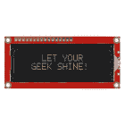
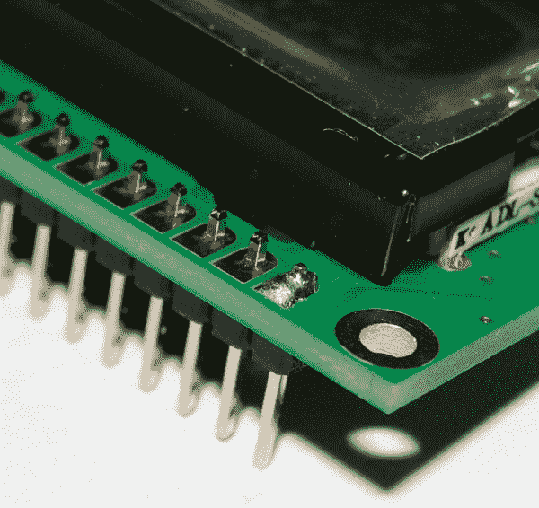
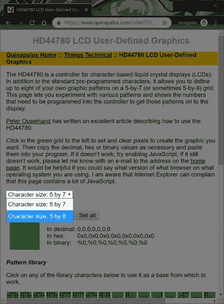
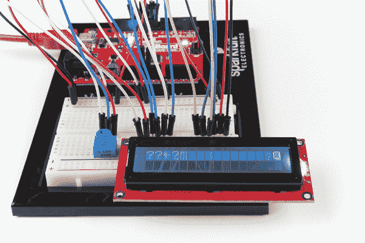

# 基本字符 LCD 连接指南

> 原文：<https://learn.sparkfun.com/tutorials/basic-character-lcd-hookup-guide>

## 介绍

将数据打印到[串行终端](https://learn.sparkfun.com/tutorials/terminal-basics/)是查看来自微控制器的数据的好方法。但是，如果您想让您的项目可移动，并在远离计算机的地方查看传感器值，该怎么办呢？液晶显示器(LCD)是向显示器输出一串文字或传感器数据以获得视觉反馈的一种很好的方式。在本教程中，我们将学习液晶显示器，以及如何将一串文字打印到[基本字符液晶显示器](https://www.sparkfun.com/products/709)上，并创建自定义字符。

[](https://www.sparkfun.com/products/709) 

将**添加到您的[购物车](https://www.sparkfun.com/cart)中！**

### [基本 16x2 字符 LCD -黑底白字 5V](https://www.sparkfun.com/products/709)

[In stock](https://learn.sparkfun.com/static/bubbles/ "in stock") LCD-00709

这是一个基本的 16 个字符的 2 行显示器，黑色背景，白色字符。运用非常 c…

$20.5013[Favorited Favorite](# "Add to favorites") 20[Wish List](# "Add to wish list")** **### 所需材料

要跟随本教程，您将需要以下材料。你可能不需要所有的东西，这取决于你拥有什么。将它添加到您的购物车，通读指南，并根据需要调整购物车。

[](https://www.sparkfun.com/products/13975) 

将**添加到您的[购物车](https://www.sparkfun.com/cart)中！**

### [spark fun red board——用 Arduino 编程 T3](https://www.sparkfun.com/products/13975)

[In stock](https://learn.sparkfun.com/static/bubbles/ "in stock") DEV-13975

SparkFun RedBoard 结合了 UNO 的 Optiboot 引导程序的简单性、FTDI 的稳定性和 shield com…

$21.5049[Favorited Favorite](# "Add to favorites") 89[Wish List](# "Add to wish list")****[](https://www.sparkfun.com/products/12002) 

将**添加到您的[购物车](https://www.sparkfun.com/cart)中！**

### [【试验板-不干胶(白色)](https://www.sparkfun.com/products/12002)

[In stock](https://learn.sparkfun.com/static/bubbles/ "in stock") PRT-12002

这是你的尝试和真正的白色无焊试验板。它有 2 条电源总线，10 列，30 行，总共 400 个连接…

$5.5048[Favorited Favorite](# "Add to favorites") 93[Wish List](# "Add to wish list")****[](https://www.sparkfun.com/products/116) 

将**添加到您的[购物车](https://www.sparkfun.com/cart)中！**

### [破开头球——直击](https://www.sparkfun.com/products/116)

[In stock](https://learn.sparkfun.com/static/bubbles/ "in stock") PRT-00116

一排标题-打破适应。40 个引脚，可切割成任何尺寸。用于定制 PCB 或通用定制接头。

$1.7520[Favorited Favorite](# "Add to favorites") 133[Wish List](# "Add to wish list")****[](https://www.sparkfun.com/products/11026) 

将**添加到您的[购物车](https://www.sparkfun.com/cart)中！**

### [跳线标准 7" M/M - 30 AWG (30 个装)](https://www.sparkfun.com/products/11026)

[In stock](https://learn.sparkfun.com/static/bubbles/ "in stock") PRT-11026

如果你需要快速完成一个原型，没有什么比一堆跳线更能加快速度的了，让我们来看看

$2.4520[Favorited Favorite](# "Add to favorites") 43[Wish List](# "Add to wish list")****[](https://www.sparkfun.com/products/709) 

将**添加到您的[购物车](https://www.sparkfun.com/cart)中！**

### [基本 16x2 字符 LCD -黑底白字 5V](https://www.sparkfun.com/products/709)

[In stock](https://learn.sparkfun.com/static/bubbles/ "in stock") LCD-00709

这是一个基本的 16 个字符的 2 行显示器，黑色背景，白色字符。运用非常 c…

$20.5013[Favorited Favorite](# "Add to favorites") 20[Wish List](# "Add to wish list")****[](https://www.sparkfun.com/products/11301) 

将**添加到您的[购物车](https://www.sparkfun.com/cart)中！**

### [SparkFun USB 迷你-B 线- 6 脚](https://www.sparkfun.com/products/11301)

[In stock](https://learn.sparkfun.com/static/bubbles/ "in stock") CAB-11301

这是一条 USB 2.0 型到 Mini-B 型 5 针电缆。你知道，通常带有 USB 集线器、相机、MP3 的迷你 B 连接器…

$4.503[Favorited Favorite](# "Add to favorites") 20[Wish List](# "Add to wish list")************ ************虽然没有必要，我们将使用一个试验板持有人举行电路在一起。

[](https://www.sparkfun.com/products/11235) 

将**添加到您的[购物车](https://www.sparkfun.com/cart)中！**

### [Arduino 和试验板支架](https://www.sparkfun.com/products/11235)

[In stock](https://learn.sparkfun.com/static/bubbles/ "in stock") DEV-11235

我们已经在这些令人敬畏的小塑料板上做了很长时间的原型，但现在是升级的时候了。这个版本仍然…

$4.9513[Favorited Favorite](# "Add to favorites") 76[Wish List](# "Add to wish list")****[](https://www.sparkfun.com/products/9146) 

将**添加到您的[购物车](https://www.sparkfun.com/cart)中！**

### [SparkFun 迷你螺丝刀](https://www.sparkfun.com/products/9146)

[In stock](https://learn.sparkfun.com/static/bubbles/ "in stock") TOL-09146

这只是你的基本可逆螺丝刀口袋大小！有平头和十字头可供选择。配有别针和…

$1.053[Favorited Favorite](# "Add to favorites") 11[Wish List](# "Add to wish list")**********Looking for More LCDs?** There are a variety of other basic character LCDs with different colors. Here are a few other [monochrome character LCDs](https://www.sparkfun.com/categories/148) available in the catalog. Just make sure to check the datasheet since the pinout for the backlight is [slightly different for the RGB LCD](https://learn.sparkfun.com/tutorials/basic-character-lcd-hookup-guide#rgb-backlight).

[](https://www.sparkfun.com/products/255) 

将**添加到您的[购物车](https://www.sparkfun.com/cart)中！**

### [基本 16x2 字符 LCD -绿上黑 5V](https://www.sparkfun.com/products/255)

[In stock](https://learn.sparkfun.com/static/bubbles/ "in stock") LCD-00255

这是一个基本的 16 字符 2 行显示。绿色背景上的黑色文本。利用非常常见的 HD44780 并行…

$18.5015[Favorited Favorite](# "Add to favorites") 20[Wish List](# "Add to wish list")****[](https://www.sparkfun.com/products/10862) 

将**添加到您的[购物车](https://www.sparkfun.com/cart)中！**

### [基本 16x2 字符 LCD - RGB 背光 5V](https://www.sparkfun.com/products/10862)

[In stock](https://learn.sparkfun.com/static/bubbles/ "in stock") LCD-10862

这类似于你以前见过的其他 16x2 字符液晶显示器，但有一个鲜明的区别:背光是真实的…

$18.503[Favorited Favorite](# "Add to favorites") 17[Wish List](# "Add to wish list")**** ****根据您的 LCD 规格，输入电压可能是 3.3V 或 5V。对于下面列出的 LCD，LCD 的输入电压必须为 3.3V。逻辑电平将与输入电压相同。

⚡ **Warning!** When connecting to 3.3V basic character LCDs, make sure to connect the input to 3.3V.

[](https://www.sparkfun.com/products/9053) 

将**添加到您的[购物车](https://www.sparkfun.com/cart)中！**

### [基本 16x2 字符 LCD -绿底黑 3.3V](https://www.sparkfun.com/products/9053)

[Out of stock](https://learn.sparkfun.com/static/bubbles/ "out of stock") LCD-09053

这是一款 16 个字符的 2 行显示器，工作电压为 3.3V。采用常见的 ST7066/HD44780 并行接口([数据手册…

$18.505[Favorited Favorite](# "Add to favorites") 7[Wish List](# "Add to wish list")****[](https://www.sparkfun.com/products/9052) 

将**添加到您的[购物车](https://www.sparkfun.com/cart)中！**

### [基本 16x2 字符 LCD -黑底白字 3.3V](https://www.sparkfun.com/products/9052)

[In stock](https://learn.sparkfun.com/static/bubbles/ "in stock") LCD-09052

这是一款 16 个字符的 2 行显示器，工作电压为 3.3V。采用常见的 ST7066/HD44780 并行接口([数据手册…

$19.50 $7.802[Favorited Favorite](# "Add to favorites") 12[Wish List](# "Add to wish list")****[](https://www.sparkfun.com/products/retired/9051) 

### [基本 16x2 字符 LCD -黑底红 3.3V](https://www.sparkfun.com/products/retired/9051)

[Retired](https://learn.sparkfun.com/static/bubbles/ "Retired") LCD-09051

这是一款 16 个字符的 2 行显示器，工作电压为 3.3V。采用常见的 ST7066/HD44780 并行接口([数据手册…

**Retired**[Favorited Favorite](# "Add to favorites") 7[Wish List](# "Add to wish list")********If you are using a 3.3V LCD and a 5V Arduino (or [a 5V LCD and a 3.3V Arduino](https://learn.sparkfun.com/tutorials/basic-character-lcd-hookup-guide#3_3V)), you will need a logic level converter between the two boards. You'd have to use two logic level converters (like the four channel bidirectional logic level converter) to convert 6x pins at a minimum if you were using a 3.3V basic character display.

[](https://www.sparkfun.com/products/12009) 

将**添加到您的[购物车](https://www.sparkfun.com/cart)中！**

### [SparkFun 逻辑电平转换器-双向](https://www.sparkfun.com/products/12009)

[In stock](https://learn.sparkfun.com/static/bubbles/ "in stock") BOB-12009

SparkFun 双向逻辑电平转换器是一个小型设备，可以安全地将 5V 信号降压至 3.3V，并升压 3。…

$3.50116[Favorited Favorite](# "Add to favorites") 146[Wish List](# "Add to wish list")****[](https://www.sparkfun.com/products/11771) 

将**添加到您的[购物车](https://www.sparkfun.com/cart)中！**

### [SparkFun 电压电平转换器分线点- TXB0104](https://www.sparkfun.com/products/11771)

[In stock](https://learn.sparkfun.com/static/bubbles/ "in stock") BOB-11771

这是德州仪器 TXB0104 模块的分线板。TXB0104 是一款 4 位双向电压电平转换器

$4.957[Favorited Favorite](# "Add to favorites") 28[Wish List](# "Add to wish list")****[](https://www.sparkfun.com/products/retired/11955) 

### [SparkFun 关卡翻译器分会场- PCA9306](https://www.sparkfun.com/products/retired/11955)

[Retired](https://learn.sparkfun.com/static/bubbles/ "Retired") BOB-11955

这是 PCA9306 双路双向电压电平转换器的分线板。因为不同的部分有时使用 d…

3 **Retired**[Favorited Favorite](# "Add to favorites") 12[Wish List](# "Add to wish list")**** ****### 工具

你需要一个烙铁、焊料和一般的焊接附件。

[](https://www.sparkfun.com/products/14456) 

将**添加到您的[购物车](https://www.sparkfun.com/cart)中！**

### [【烙铁- 60W(可调温度)](https://www.sparkfun.com/products/14456)

[In stock](https://learn.sparkfun.com/static/bubbles/ "in stock") TOL-14456

当你不想倾家荡产，但又需要一个可靠的烙铁时，这个可调节温度的烙铁是一个很好的工具…

$16.5016[Favorited Favorite](# "Add to favorites") 43[Wish List](# "Add to wish list")****[](https://www.sparkfun.com/products/9163) 

将**添加到您的[购物车](https://www.sparkfun.com/cart)中！**

### [无铅焊料- 15 克管](https://www.sparkfun.com/products/9163)

[In stock](https://learn.sparkfun.com/static/bubbles/ "in stock") TOL-09163

这是你的无铅焊料的基本管，带有不干净的水溶性树脂芯。0.031 英寸规格，15 克

$3.954[Favorited Favorite](# "Add to favorites") 14[Wish List](# "Add to wish list")**** ****### 推荐阅读

如果您不熟悉以下概念，我们建议您在继续之前查看这些教程。

[](https://learn.sparkfun.com/tutorials/binary) [### 二进制的](https://learn.sparkfun.com/tutorials/binary) Binary is the numeral system of electronics and programming...so it must be important to learn. But, what is binary? How does it translate to other numeral systems like decimal?[Favorited Favorite](# "Add to favorites") 51[](https://learn.sparkfun.com/tutorials/what-is-an-arduino) [### 什么是 Arduino？](https://learn.sparkfun.com/tutorials/what-is-an-arduino) What is this 'Arduino' thing anyway? This tutorials dives into what an Arduino is and along with Arduino projects and widgets.[Favorited Favorite](# "Add to favorites") 50[](https://learn.sparkfun.com/tutorials/installing-arduino-ide) [### 安装 Arduino IDE](https://learn.sparkfun.com/tutorials/installing-arduino-ide) A step-by-step guide to installing and testing the Arduino software on Windows, Mac, and Linux.[Favorited Favorite](# "Add to favorites") 16[](https://learn.sparkfun.com/tutorials/logic-levels) [### 逻辑电平](https://learn.sparkfun.com/tutorials/logic-levels) Learn the difference between 3.3V and 5V devices and logic levels.[Favorited Favorite](# "Add to favorites") 82

## 液晶显示器是如何工作的？

**LCD** 代表 [**液晶显示器**](https://en.wikipedia.org/wiki/Liquid-crystal_display) 。这些显示器包含一个液晶点网格，或者说**像素**夹在蚀刻有透明电极的玻璃层之间。液晶分子通常是扭曲的，但通电后会变直。这会影响光线穿过点的方式，使它看起来变暗或变清晰。内置于显示器中的 HD44780 控制器芯片(位于背面黑色斑点的下方)接收来自微控制器的命令，并打开和关闭像素以形成各种字母、数字和符号。控制器[数据表](http://www.sparkfun.com/datasheets/LCD/HD44780.pdf)有存储在芯片中的所有字符的图表。该显示器还具有用于背光的 LED，其通常通过基本字符 LCD 引脚 15 和 16 供电。

如果你仔细观察 LCD 上的字符，你会发现它们实际上是由许多小方块组成的。这些小方块被称为像素。显示器的尺寸通常用像素来表示。像素构成一个字符空间，即一个字符可以存在的像素数量。

[](https://cdn.sparkfun.com/assets/learn_tutorials/9/0/5/Pixels_Character_Liquid_Crystal_Display_LCD.jpg)*Here is a capital letter B as created in pixels. The character space in this example is 6 pixels x 8 pixels.*

更多关于液晶显示器的历史和工作原理的信息，请看下面的视频。

[https://www.youtube.com/embed/VbdhbyiHX-s/?autohide=1&border=0&wmode=opaque&enablejsapi=1](https://www.youtube.com/embed/VbdhbyiHX-s/?autohide=1&border=0&wmode=opaque&enablejsapi=1)

## 硬件概述

**Note:** Depending on how the LCD was manufactured, you may have a green or red PCB. Throughout this tutorial, you will see both colors but the overall functionality will be the same for a basic character LCD!

| [](https://cdn.sparkfun.com/assets/learn_tutorials/9/0/5/09761-Character_LCD_Green_PCB.jpg) | [](https://cdn.sparkfun.com/assets/learn_tutorials/9/0/5/00709-01_Character_LCD_Red_PCB.jpg) |
| *带绿色 PCB 的 LCD* | *带红色 PCB 的 LCD* |

基本字符 LCD 有 16 个引脚(RGB LCD 除外，它有 18 个引脚)，并且是偏振的。针脚从左到右编号，从 1 到 16。LCD 使用了日立的一种非常常见的并行接口 LCD 驱动芯片 [HD44780](https://www.sparkfun.com/datasheets/LCD/HD44780.pdf) 。幸运的是，Arduino 社区已经开发了一个库来处理大量的软件到硬件的接口。以下是液晶屏上每个针脚的列表。

[](https://cdn.sparkfun.com/assets/learn_tutorials/9/0/5/Character_LCD_Pinout.png)*Click on image for a closer view.*

### 输入电压和逻辑电平

就本教程而言，我们将把一个 5V Arduino 连接到 **5V** 基本字符 LCD。根据您的 LCD 规格，输入电压可能是 3.3V 或 5V。[逻辑电平](https://learn.sparkfun.com/tutorials/logic-levels)将与输入电压相同。只要确保微控制器和 LCD 的电压匹配即可。

## 硬件装配

液晶显示器通常没有微控制器来控制显示。为了连接，你需要一条**插头引脚**，一个**电位计**来调整显示器的对比度，**试验板**，和**电线**。根据液晶显示器的不同，您可能需要一个[限流电阻](https://learn.sparkfun.com/tutorials/resistors/example-applications#current-limiting)来限制 LED 背光的电流。您将需要[焊接](https://learn.sparkfun.com/tutorials/how-to-solder-through-hole-soldering)您选择的接头引脚到显示器，以便将其插入您的试验板。如果你以前没有焊接过，我们建议你看看我们的焊接教程。

[](https://learn.sparkfun.com/tutorials/how-to-solder-through-hole-soldering) [### 如何焊接:通孔焊接

#### 2013 年 9 月 19 日](https://learn.sparkfun.com/tutorials/how-to-solder-through-hole-soldering) This tutorial covers everything you need to know about through-hole soldering.[Favorited Favorite](# "Add to favorites") 70

虽然您可以使用任何标准的 16x2 字母数字液晶显示器，但套件提供的黑底白字显示器看起来很酷。本指南中的照片是标准的绿底黑字，因此您的照片可能看起来有所不同。“16x2”指的是每行有 16 个字符的两行显示器，也可以使用 8x1 或 20x4 的其他显示器。

### 焊接头

将接头引脚焊接到 LCD 模块非常简单。确保烙铁与接头接触的时间不超过三秒钟。过热损坏电路板上现有元件的风险很小。你还需要小心让烙铁远离电路板上已经焊接的元件——你可能还没有准备好进行表面贴装焊接修复。

### 将接头插入 LCD

焊接前，对零件进行“试装配”。测试装配让你有机会再次检查你是否得到了你需要的零件，并确保它们装配在一起。对于这种连接，断开一排 16x1 插头，并将插头销插入 LCD 模块上的孔中，如下图所示。如果您使用 RGB LED，您将需要一排 18x1 的插头。

[](https://cdn.sparkfun.com/assets/learn_tutorials/9/0/5/Character_LCD_Header_Test_Fit.jpg)

确保你的标题条上没有过多或过少的大头针。还要确保接头的黑色塑料条位于印刷电路板(PCB)的下面，以便 PCB 下面有足够的引脚长度插入试验板或插座。引脚最长的部分应位于 PCB 下方。引脚接头提供了承载用于控制显示器内容的数据信号的连接...显示器。它们还向模块上黑色斑点后面的小型微控制器以及 LED 背光(如果您的显示器有背光的话)供电。

### 焊接公接头

如果你已经做了测试，那么你的头应该在适当的位置。确保接头尽可能与电路板边缘平行对齐。然后将最左边或最右边的引脚焊接到位，如下图所示。

[](https://cdn.sparkfun.com/assets/learn_tutorials/9/0/5/Character_LCD_Header_First_Pin_Tacked_Soldered.jpg)

因为没有太多的空间，当烙铁尖端位于引脚之间时，从引脚后面加入焊料是最容易的，烙铁一侧靠在 PCB 焊盘上，烙铁一侧靠在要焊接的引脚一侧。我们只从一个引脚开始的原因是因为它更容易获得正确的对齐和修复任何错误。

如果接头的对齐不太正确，小心地重新加热焊点并稍微移动接头。然而，当焊点仍处于液态时，不要移动接头，否则你会得到一个不良的焊点。

一旦您对接头的对齐感到满意，您可以将另一个引脚焊接到位，我们建议将接头另一端的引脚焊接到您焊接的第一个引脚。这样做的原因是，一旦两个端销就位，对准就不会改变。

[](https://cdn.sparkfun.com/assets/learn_tutorials/9/0/5/Character_LCD_Header_Second_Pin_Tacked_Soldered.jpg)

仔细检查对准情况是否还可以，如果不太对，你可以重新加热接头并小心移动销钉。确认对齐后，您可以将剩余的引脚焊接到位。

[](https://cdn.sparkfun.com/assets/learn_tutorials/9/0/5/Character_LCD_Header_Pins_Soldered.jpg)

确保焊料覆盖电镀通孔的焊盘和引脚，如下图所示，以实现最佳连接。

[](https://cdn.sparkfun.com/assets/learn_tutorials/9/0/5/Character_LCD_Header_Pins_Soldered_Close_Up.jpg)

现在焊接完成了！

[](https://cdn.sparkfun.com/assets/learn_tutorials/9/0/5/Character_LCD_Header_Pins_Soldered.jpg)

### 完整的 LCD

您的显示模块现在应该看起来像下面的图像。需要注意的另一个细节是，引脚接头通常位于显示屏的“顶部”,因此如果您计划将其安装在任何地方，请记住这一点。记住，在安装到项目之前，一定要测试显示器。

[](https://cdn.sparkfun.com/assets/learn_tutorials/9/0/5/Character_LCD_Header_Pins_Soldered_Top_View.jpg)

现在是时候将你的 LCD 连接到微控制器上了！在本教程中，我们将使用 Arduino。

## 硬件连接

基本字符显示使用一个**并行**接口，可以是 4 位或 8 位宽。我们将使用 4 位，因为它需要更少的导线。将显示器连接到微控制器总共需要 8 根电线:

*   两个用于 Vcc 和接地
*   两个加载数据
*   四个用于数据

您还需要将一个电位计连接到显示器上。这对于设置显示器的对比度以获得最佳可视性是必要的。详见下图。

[](https://cdn.sparkfun.com/assets/learn_tutorials/6/3/6/SIK_Circuit_4A.png)**Note:** Depending on the manufacturer, some LCDs may not come with a current limiting resistor for the backlight. You may need to add an additional current limiting resistor to control the backlight pin(s) from an Arduino's I/O pin. For more options controlling the backlight, you can connect the LED to any PWM pin. Depending on your microcontroller specifications, you may want to use a [transistor](https://learn.sparkfun.com/tutorials/transistors/all#applications-i-switches) to source enough current to an LED from an I/O pin.

[](https://www.sparkfun.com/products/14490) 

将**添加到您的[购物车](https://www.sparkfun.com/cart)中！**

### [电阻器 330 欧姆 1/4 瓦 PTH - 20 包(粗引线)](https://www.sparkfun.com/products/14490)

[In stock](https://learn.sparkfun.com/static/bubbles/ "in stock") PRT-14490

这些是普通的 1/4 瓦、+/- 5%容差 PTH 电阻。通常用于试验板和其他原型制作…

$1.05[Favorited Favorite](# "Add to favorites") 10[Wish List](# "Add to wish list")****[](https://www.sparkfun.com/products/521) 

将**添加到您的[购物车](https://www.sparkfun.com/cart)中！**

### [晶体管- NPN，60V 200mA (2N3904)](https://www.sparkfun.com/products/521)

[In stock](https://learn.sparkfun.com/static/bubbles/ "in stock") COM-00521

这些是由 ST Micro 制造的非常普通的高质量 BJT NPN 晶体管。

$0.55[Favorited Favorite](# "Add to favorites") 13[Wish List](# "Add to wish list")**** ****### [RGB 背光](#rgb-backlight)

**Note:** If you are using the 5V basic 16x2 character LCD w/ RGB backlight, the LED's pins are slightly different. Pin 15 is for the LED's common cathode pin and it should be connected to the GND pin. Additionally, the [LCD-10862](https://www.sparkfun.com/products/10862) requires a current limiting resistor for each color. The diagram below shows a general 330&ohm; resistor in series.

[](https://cdn.sparkfun.com/assets/learn_tutorials/9/0/5/RGB_Backlight-Basic_16x2_Character_LCD_Arduino-Fritzing_bb_2.jpg)

## Arduino 示例:LiquidCrystal 库

**Note:** The library has been tested on an ATmega328P-based Arduino using Arduino IDE v1.8.9\. Otherwise, make sure you are using the latest stable version of the Arduino IDE on your desktop. If this is your first time using Arduino, please review our tutorial on [installing the Arduino IDE.](https://learn.sparkfun.com/tutorials/installing-arduino-ide) If you've never connected an FTDI device to your computer before, you may need to install drivers for the USB-to-serial converter. Check out our [How to Install FTDI Drivers](https://learn.sparkfun.com/tutorials/how-to-install-ftdi-drivers) tutorial for help with the installation.

通常，您需要阅读 HD44780 控制器芯片的大量数据手册，以确定如何控制该显示器。幸运的是，Arduino IDE 附带了一个名为 LiquidCrystal 的[内置库，它可以为您完成所有的艰苦工作。我们将看看 Arduino 提供的十个例子中的一个。](http://arduino.cc/en/Reference/LiquidCrystal)

**Note:** A library is a prebuilt collection of software functions that you can easily include in your code.

打开 Arduino IDE，加载示例程序:**文件** > **示例** > **液晶** > **HelloWorld** 。

[](https://cdn.sparkfun.com/assets/learn_tutorials/9/0/5/LCD_Arduino_Examples.jpg)

一旦断开，您将需要根据您的电路调整引脚连接。在这种情况下，我们需要根据之前连接的电路调整引脚定义。前往定义引脚的行。

```
language:c
const int rs = 12, en = 11, d4 = 5, d5 = 4, d6 = 3, d7 = 2;
LiquidCrystal lcd(rs, en, d4, d5, d6, d7); 
```

然后根据您的连接调整管脚定义。

```
language:c
const int rs = 13, en = 12, d4 = 11, d5 = 10, d6 = 9, d7 = 8;
LiquidCrystal lcd(rs, en, d4, d5, d6, d7); 
```

您也可以复制并粘贴下面的代码。只要确保选择正确的板(在这种情况下是 **Arduino/ Genuino Uno** )和 Arduino 枚举的 COM 端口。然后把代码上传到你的 Arduino。

```
language:c
/*LCD-Hello_world.ino

 Modified By: Ho Yun "Bobby" Chan
 SparkFun Electronics
 Date: 5/22/2019
 License: This code is public domain.

 Demonstrates the use a 16x2 LCD display.  The LiquidCrystal
 library works with all LCD displays that are compatible with the
 Hitachi HD44780 driver. There are many of them out there, and you
 can usually tell them by the 16-pin interface.

 This sketch prints "Hello World!" to the LCD
 and shows the time since the Arduino was turned on.

  Hardware Hookup:

    lCD VSS pin to GND
    LCD VCC pin to 5V
    10kΩ Potentiometer to LCD VO pin (pin 3)
    LCD RS pin to digital pin 13
    LCD R/W pin to GND
    LCD Enable pin to digital pin 12
    .
    .
    .
    LCD D4 pin to digital pin 11
    LCD D5 pin to digital pin 10
    LCD D6 pin to digital pin 9
    LCD D7 pin to digital pin 8
    LCD-Backlight - Anode to 10KΩ resistor to +5V (optional depending on your LCD)
    LCD Backlight - K to GND

 Library originally added 18 Apr 2008
 by David A. Mellis
 library modified 5 Jul 2009
 by Limor Fried (http://www.ladyada.net)
 example added 9 Jul 2009
 by Tom Igoe
 modified 22 Nov 2010
 by Tom Igoe
 modified 7 Nov 2016
 by Arturo Guadalupi

 http://www.arduino.cc/en/Tutorial/LiquidCrystalHelloWorld=

https://learn.sparkfun.com/tutorials/basic-character-lcd-hookup-guide

*/

// include the library code:
#include <LiquidCrystal.h>

//initialize the library by associating any needed LCD interface pin
//with the arduino pin number it is connected to
const int rs = 13, en = 12, d4 = 11, d5 = 10, d6 = 9, d7 = 8;
LiquidCrystal lcd(rs, en, d4, d5, d6, d7);

void setup() {
  //set up the LCD's number of columns and rows:
  lcd.begin(16, 2);
  //Print a message to the LCD.
  lcd.print("Hello, world!");
}

void loop() {
  //set the cursor to column 0, line 1
  //(note: line 1 is the second row, since counting begins with 0):
  lcd.setCursor(0, 1);
  // print the number of seconds since reset:
  lcd.print(millis() / 1000);
} 
```

上传到您的主板后，显示屏上会出现一个“`hello, world!`”。LCD 还将显示 Arduino 复位后的时间(秒)。您应该会看到类似下图的内容。取决于您如何编写代码，字母`h`可能是大写或小写。

[](https://cdn.sparkfun.com/assets/learn_tutorials/6/3/6/SIK_Project4_Circuit4A_Action.jpg)

如果看到“`hello, world!`”，恭喜你！看一看示例草图，并尝试修改它以显示“`hello, your name!`”或您想要的任何其他文本。此外，看看另一个例子 **LiquidCrystal** 草图，以及 Arduino.cc 网站上的文档，看看如何编写草图来利用显示器。请确保根据您将 LCD 连接到 Arduino 的方式来调整引脚定义。

## 自定义用户定义的图形

如果你需要制作自定义字符，有一些在线工具可以生成用户自定义的图形。查看下面的链接，创建您自己的自定义图形或使用模式库中的任何字符。

[HD44780 LCD User-Defined Graphics](https://www.quinapalus.com/hd44780udg.html)

为了简单起见，我们将只使用库中已经生成的模式之一。让我们创造一个空虚的心灵。首先，你需要选择你的字符大小。我们在这个例子中使用的显示器是一个 8x5 的字符空间。您需要从下拉菜单中选择“**字符大小:5 乘 8** ”，这样就有 8 行和 5 列像素。

[](https://cdn.sparkfun.com/assets/learn_tutorials/9/0/5/LCD_Character_Space_Size.jpg)

然后向下滚动网页，点击**图案库**下面列出的空心。您将看到以十进制、十六进制和二进制表示自定义字符的值。

[](https://cdn.sparkfun.com/assets/learn_tutorials/9/0/5/Pre-Defined_Pattern_LCD_Custom_Character.jpg)

我们将使用空心脏的二进制表示。逗号之间的每个值代表从字符空间顶部开始的自定义字符空间的一部分。当值为 0 时，像素被清除，当值为 1 时，像素变暗。

```
language:bash
%0,%0,%1010,%10101,%10001,%1010,%100,%0 
```

您需要复制这些值，并在代码中对其进行格式化。因为我们使用 Arduino 来控制基本的字符显示，所以我们将这些值放在一个数组中。我们将这个数组命名为`emptyHeart[]`。为了更容易阅读并确保像素关闭，我们将在值的左边用 0 填充最高有效位，以便自定义字符空间的每个片段的大小为 1x5。格式化值后，您的数组应该看起来像下面 Arduino 中的代码。

```
language:c
byte emptyHeart[8] = {
  B00000,
  B00000,
  B01010,
  B10101,
  B10001,
  B01010,
  B00100,
  B00000
}; 
```

恭喜你！您刚刚创建了一个自定义角色！根据需要，对多达 8 个自定义字符重复这些步骤。

### 示例代码

现在我们已经创建了一个自定义的用户定义的图形，让我们用一条消息将它显示在屏幕上。下面的示例代码加载三个自定义字符，并在 LCD 上显示它们和一条消息。复制代码并粘贴到 Arduino IDE 中。选择您的主板(在本例中为 **Arduino/ Genuino Uno** )和 COM 端口。然后把代码上传到你的 Arduino。

```
language:c
/*LCD-CustomChar.ino

  By: Ho Yun "Bobby" Chan
  SparkFun Electronics
  Date: May 16th, 2019
  License: This code is public domain.

  Description: Demonstrates the use a 16x2 LCD display
  with custom user-defined graphic based on the example 
  used in the Arduino.cc's Reference Library: createChar().
  A message will display with an empty and full heart!

  Hardware Hookup:

    lCD VSS pin to GND
    LCD VCC pin to 5V
    10kΩ Potentiometer to LCD VO pin (pin 3)
    LCD RS pin to digital pin 13
    LCD R/W pin to GND
    LCD Enable pin to digital pin 12
    .
    .
    .
    LCD D4 pin to digital pin 11
    LCD D5 pin to digital pin 10
    LCD D6 pin to digital pin 9
    LCD D7 pin to digital pin 8
    LCD-Backlight - Anode to 10KΩ resistor to +5V (optional depending on your LCD)
    LCD Backlight - K to GND

  For more information about using the creatChar() function,
  make sure to check out the Arduino.cc reference and associated tutorial:

  https://www.arduino.cc/en/Reference/LiquidCrystalCreateChar
  https://learn.sparkfun.com/tutorials/basic-character-lcd-hookup-guide
*/

//Include the library code:
#include <LiquidCrystal.h>

// initialize the library by associating any needed LCD interface pin
// with the arduino pin number it is connected to
const int rs = 13, en = 12, d4 = 11, d5 = 10, d6 = 9, d7 = 8;
LiquidCrystal lcd(rs, en, d4, d5, d6, d7);

//Load custom charcter into CGRAM
//Note: Up to 8 characters can be saved

byte smiley[8] = {
  B00000,
  B10001,
  B00000,
  B00000,
  B10001,
  B01110,
  B00000,
};

byte emptyHeart[8] = {
  B00000,
  B00000,
  B01010,
  B10101,
  B10001,
  B01010,
  B00100,
  B00000
};

byte fullHeart[8] = {
  B00000,
  B00000,
  B01010,
  B11111,
  B11111,
  B01110,
  B00100,
  B00000,
};

void setup() {
  //Load a custom character (glyph) for use on the LCD
  lcd.createChar(0, smiley);
  lcd.createChar(1, emptyHeart);
  lcd.createChar(2, fullHeart);

  //Set up the LCD's number of columns and rows:
  lcd.begin(16, 2);

  //Clear the display
  lcd.clear();
}

void loop() {
  //Set the cursor to the 0,0 position (top left corner)
  lcd.setCursor(0, 0);

  //Display a message with the custom characters
  lcd.print("I ");
  lcd.write(byte(1)); //display custom character related associated with num 1
  lcd.print(" SparkFun! ");
  lcd.write(byte(0)); //display custom character related associated with num 0
  delay(1000);

  //Set the cursor to the 0,0 position (top left corner)
  lcd.setCursor(2, 0);

  lcd.write(byte(2)); //display custom character related associated with num 1
   delay(1000);
} 
```

上传后会显示一个空满的心的消息！

[](https://cdn.sparkfun.com/assets/learn_tutorials/9/0/5/Basic_Character_LCD_Tutorial.gif)

## RGB LED 背光控制

前面的例子将白色 LED 背光连接到电源。以下示例专门针对那些使用带 RGB LED 背光的 [LCD 的用户。连接的唯一区别是引脚 15-18 上的 LED 背光。](https://learn.sparkfun.com/tutorials/basic-character-lcd-hookup-guide#rgb-backlight)

复制并粘贴下面的代码。只要确保选择正确的板(在这种情况下是 **Arduino/ Genuino Uno** )和 Arduino 枚举的 COM 端口。然后把代码上传到你的 Arduino。

```
language:c
/* LCD-RGB_Hello World.ino

  By: Ho Yun "Bobby" Chan
  SparkFun Electronics
  Date: 5/22/2019
  License: This code is public domain.

  Modified example code of Arduino.cc's Hello World.
  https://www.arduino.cc/en/Tutorial/HelloWorld

  Demonstrates the use a 16x2 LCD display with a common cathode
  RGB LED backlight. The LiquidCrystal library works with all
  LCD displays that are compatible with the Hitachi HD44780 driver.
  There are many of them out there, and you can usually tell them
  by the 16-pin/18-pin interface.

  This sketch prints "Hello world!" to the LCD,
  shows the time since the Arduino was last reset, and 
  controls the RGB backlight. The backlight displays
  the primary, secondary, and tertiary colors.

  Hardware Hookup:
    LCD VSS pin to GND
    LCD VCC pin to 5V
    10kΩ Potentiometer to LCD VO pin (pin 3)
    LCD RS pin to digital pin 13
    LCD R/W pin to GND
    LCD Enable pin to digital pin 12
    .
    .
    .
    .
    LCD D4 pin to digital pin 11
    LCD D5 pin to digital pin 10
    LCD D6 pin to digital pin 9
    LCD D7 pin to digital pin 8
    LCD Backlight - K (Common Cathode) to GND
    LCD Backlight - Anode-RED to 330Ω to PWM pin 6
    LCD Backlight - Anode-GREEN to 330Ω to PWM pin 5
    LCD Backlight - Anode-BLUE to 330Ω to PWM pin 3

  Note: You may need to adjust the current limiting resistor
  and PWM value for the LED depending on the voltage used.
  Depending on the mixed color, this may result in a lower
  brightness.

  https://learn.sparkfun.com/tutorials/basic-character-lcd-hookup-guide

*/

//Include the library code:
#include <LiquidCrystal.h>

//LED Backlight
int ledR = 6;//hardware PWM
int ledG = 5;//hardware PWM
int ledB = 3; //hardware PWM
int redIntensity = 255; //value to adjust since red can be brighter than the other colors depending on the resistor value used

//Initialize the library by associating any 
//needed LCD interface pin with the Arduino pin
//number it is connected to
const int rs = 13, en = 12, d4 = 11, d5 = 10, d6 = 9, d7 = 8;
LiquidCrystal lcd(rs, en, d4, d5, d6, d7);

void setup() {
  //Set up the LCD's number of columns and rows:
  lcd.begin(16, 2);

  //Clear the display
  lcd.clear();

  //Test Colors
  sequenceTest();

  lcd.setCursor(0, 0);
  //Print a message to the LCD.
  lcd.print("Hello, world!");
  //Turn on backlight for red
  redON();
  lcd.setCursor(0, 1);
  lcd.print("Red");
  delay(1500);
  lcd.setCursor(0, 1);
  lcd.print("                ");

}

void loop() {
  // set the cursor to column 0, line 1
  // (note: line 1 is the second row, since counting begins with 0):
  lcd.setCursor(0, 1);
  // print the number of seconds since reset:
  lcd.print(millis() / 1000);
}

void allOFF() {
  analogWrite(ledR, 0);
  analogWrite(ledG, 0);
  analogWrite(ledB, 0);
}

void allON() {
  analogWrite(ledR, redIntensity);
  analogWrite(ledG, 255);
  analogWrite(ledB, 255);
}

void redON() {
  analogWrite(ledR, redIntensity);
  analogWrite(ledG, 0);
  analogWrite(ledB, 0);
}

void roseON() {
  analogWrite(ledR, redIntensity);
  analogWrite(ledG, 0);
  analogWrite(ledB, 128);
}

void magentaON() {
  analogWrite(ledR, redIntensity);
  analogWrite(ledG, 0);
  analogWrite(ledB, 255);
}

void violetON() {
  analogWrite(ledR, 128);
  analogWrite(ledG, 0);
  analogWrite(ledB, 255);
}

void blueON() {
  analogWrite(ledR, 0);
  analogWrite(ledG, 0);
  analogWrite(ledB, 255);
}

void azureON() {
  analogWrite(ledR, 0);
  analogWrite(ledG, 128);
  analogWrite(ledB, 255);
}

void cyanON() {
  analogWrite(ledR, 0);
  analogWrite(ledG, 255);
  analogWrite(ledB, 255);
}

void springgreenON() {
  analogWrite(ledR, 0);
  analogWrite(ledG, 255);
  analogWrite(ledB, 128);
}

void greenON() {
  analogWrite(ledR, 0);
  analogWrite(ledG, 255);
  analogWrite(ledB, 0);
}

void chartreuseON() {
  analogWrite(ledR, 128);
  analogWrite(ledG, 255);
  analogWrite(ledB, 0);
}

void yellowON() {
  analogWrite(ledR, redIntensity);
  analogWrite(ledG, 255);
  analogWrite(ledB, 0);
}

void orangeON() {
  analogWrite(ledR, redIntensity);
  analogWrite(ledG, 51);
  analogWrite(ledB, 0);
}

void sequenceTest() {

  lcd.setCursor(0, 0);
  lcd.print("Backlight Color");

  lcd.setCursor(0, 1);          //set the cursor to the second row, 1st position
  lcd.print("                 ");//clear 2nd row
  lcd.setCursor(0, 1);          //set the cursor to the second row, 1st position
  lcd.print("Red");
  redON();//good
  delay(1500);

  lcd.setCursor(0, 1);           //set the cursor to the second row, 1st position
  lcd.print("                 ");//clear 2nd row
  lcd.setCursor(0, 1);           //set the cursor to the second row, 1st position
  lcd.print("Rose");
  roseON();
  delay(1500);

  lcd.setCursor(0, 1);           //set the cursor to the second row, 1st position
  lcd.print("                 ");//clear 2nd row
  lcd.setCursor(0, 1);           //set the cursor to the second row, 1st position
  lcd.print("Magenta");
  magentaON();//good
  delay(1500);

  lcd.setCursor(0, 1);           //set the cursor to the second row, 1st position
  lcd.print("                 ");//clear 2nd row
  lcd.setCursor(0, 1);           //set the cursor to the second row, 1st position
  lcd.print("Violet");
  violetON();
  delay(1500);

  lcd.setCursor(0, 1);           //set the cursor to the second row, 1st position
  lcd.print("                 ");//clear 2nd row
  lcd.setCursor(0, 1);           //set the cursor to the second row, 1st position
  lcd.print("Blue");
  blueON();//good
  delay(1500);

  lcd.setCursor(0, 1);           //set the cursor to the second row, 1st position
  lcd.print("                 ");//clear 2nd row
  lcd.setCursor(0, 1);           //set the cursor to the second row, 1st position
  lcd.print("Azure");
  azureON();//good
  delay(1500);

  lcd.setCursor(0, 1);           //set the cursor to the second row, 1st position
  lcd.print("                 ");//clear 2nd row
  lcd.setCursor(0, 1);           //set the cursor to the second row, 1st position
  lcd.print("Cyan");
  cyanON();//good
  delay(1500);

  lcd.setCursor(0, 1);           //set the cursor to the second row, 1st position
  lcd.print("                 ");//clear 2nd row
  lcd.setCursor(0, 1);           //set the cursor to the second row, 1st position
  lcd.print("Spring Green");
  springgreenON();//good
  delay(1500);

  lcd.setCursor(0, 1);           //set the cursor to the second row, 1st position
  lcd.print("                 ");//clear 2nd row
  lcd.setCursor(0, 1);           //set the cursor to the second row, 1st position
  lcd.print("Green");
  greenON();//good
  delay(1500);

  lcd.setCursor(0, 1);           //set the cursor to the second row, 1st position
  lcd.print("                 ");//clear 2nd row
  lcd.setCursor(0, 1);           //set the cursor to the second row, 1st position
  lcd.print("Chartreuse");
  chartreuseON();
  delay(1500);

  lcd.setCursor(0, 1);           //set the cursor to the second row, 1st position
  lcd.print("                 ");//clear 2nd row
  lcd.setCursor(0, 1);           //set the cursor to the second row, 1st position
  lcd.print("Yellow");
  yellowON();//good
  delay(1500);

  lcd.setCursor(0, 1);           //set the cursor to the second row, 1st position
  lcd.print("                 ");//clear 2nd row
  lcd.setCursor(0, 1);           //set the cursor to the second row, 1st position
  lcd.print("Orange");
  orangeON();//good
  delay(1500);

  lcd.setCursor(0, 1);           //set the cursor to the second row, 1st position
  lcd.print("                 ");//clear 2nd row
  lcd.setCursor(0, 1);           //set the cursor to the second row, 1st position
  lcd.print("White");
  allON();
  delay(1500);

  lcd.setCursor(0, 1);           //set the cursor to the second row, 1st position
  lcd.print("                 ");//clear 2nd row
  lcd.setCursor(0, 1);           //set the cursor to the second row, 1st position
  lcd.print("LEDs Off");
  allOFF();
  delay(1500);

  lcd.setCursor(0, 0);           //set the cursor to the second row, 1st position
  lcd.clear();                   //Clear the display
} 
```

上传后，您将注意到自第一个示例中 Arduino 最后一次重置以来相同的“`Hello, world!`”和时间。唯一的区别是，背光的当前颜色将在它通过原色、次色和三色中的每一种颜色循环时打印出来。您应该会看到类似下图的内容。

[](https://cdn.sparkfun.com/assets/learn_tutorials/9/0/5/10862-Character_LCD_RGB_LED_Backlight_Action_new.jpg)

## 故障排除和常见问题

### 屏幕空白或闪烁

如果没有消息出现，可能需要调整对比度。为此，转动电位计直到“`hello, world!`”，直到可以在屏幕上看到字符。通过旋转电位计来调节对比度。如果调整不当，你就不能清楚地阅读文本。此外，检查电位计并确保其连接正确。如果您仍然看不到任何东西，请仔细检查您的线路，以确保线路完全连接。此外，检查你的[焊点](https://learn.sparkfun.com/tutorials/sparkfun-troubleshooting-tips#bad-solder-joints)以确保有足够的连接。

### 完全不起作用

仔细检查电路的接线。这个电路里电线很多，很容易搞混一两根。

### 第一行的矩形和随机字符

如果您在第一行看到 16x 矩形(如“█”)或随机字符，可能是由于试验板上的跳线松动。这是正常的，与微控制器并联的其它 LCD 也可能发生这种情况。确保电线完全插入试验板，然后尝试按下复位按钮，并使用电位计调整对比度。此外，确保定义的引脚与您当前的设置相匹配。

[](https://cdn.sparkfun.com/assets/learn_tutorials/6/3/6/Contrast.jpg)*A display that needs the contrast adjusted. Note the white rectangles.*

### 还是不行？

不幸的是，跳线会因为过度弯曲而变得“糟糕”。里面的铜线可能会断裂，在电路中留下开路。如果您确定您的电路接线正确，并且您的代码没有错误并已上传，但您仍然遇到问题，请尝试更换不工作的组件的一根或多根跨接导线。您可能需要返工焊点以确保连接牢固。

* * *

### [可以把一个基本字符 LCD 连接到 ESP8266 东西开发板上吗？](#3_3V)

是的。然而，ESP8266 的 Thing Dev 为 3.3V，如果使用 5V 基本字符显示器，则必须使用两个逻辑电平转换器(如四通道双向逻辑电平转换器)来转换至少 6x 个引脚。那有很多电线。确保避免使用引脚 D0、D16、Tx 和 Rx。使用这些引脚显示字符时会出现问题，因为它们与复位或深度睡眠等其他功能相关联。引脚定义可定义如下。

```
language:c
const int rs = 2, en = 14, d4 = 5, d5 = 4, d6 = 13, d7 = 12;
LiquidCrystal lcd(rs, en, d4, d5, d6, d7); 
```

连接应该类似于下图。

[](https://cdn.sparkfun.com/assets/learn_tutorials/9/0/5/ESP8266_Thing_Parallel_5V_LCD_Fritzing_bb.jpg)[](https://cdn.sparkfun.com/assets/learn_tutorials/9/0/5/ESP8266-Thing_Parallel_3_3V_LCD_Fritzing_bb.jpg)

## 资源和更进一步

现在你已经成功地建立并运行了你的基本角色 LCD，是时候把它整合到你自己的项目中了！有关更多信息，请查看以下资源:

*   [示意图(JPG)](https://www.sparkfun.com/tutorial/LCD_add-on/schematic.jpg)-16x 2 基本字符 LCD 的旧应用电路示意图。
*   数据表
    *   [基本 LCD 数据表(PDF)](http://www.sparkfun.com/datasheets/LCD/ADM1602K-NSW-FBS-3.3v.pdf)
    *   [扩展 LCD 数据表(PDF)](http://www.sparkfun.com/datasheets/LCD/GDM1602K-Extended.pdf)
    *   [HD44780 (PDF)](http://www.sparkfun.com/datasheets/LCD/HD44780.pdf)
*   [旧 SIK 指南 LCD 示例(PDF)](https://www.sparkfun.com/tutorial/AIK/LCDD-01-SPAR-guide.pdf) -带插页的旧 SIK Arduino 示例。
*   [自定义字符生成器(ZIP)](http://cdn.sparkfun.com/datasheets/LCD/Monochrome/HD44780CCGV1001.zip)
*   [在线自定义字符生成器](https://www.quinapalus.com/hd44780udg.html)
*   [mBed 示例代码](https://os.mbed.com/cookbook/Text-LCD)
*   [AVR 示例代码](http://www.peterfleury.epizy.com/avr-lcd44780.html)
*   [Arduino 参考库:LiquidCrystal](http://arduino.cc/en/Reference/LiquidCrystal)

你的下一个项目需要一些灵感吗？查看一些相关教程，使用 javascript 中的显示，使用自定义角色创建自己的游戏，或者在屏幕上显示传感器数据。

[](https://learn.sparkfun.com/tutorials/experiment-guide-for-the-johnny-five-inventors-kit) [### Johnny-Five 发明人工具包实验指南](https://learn.sparkfun.com/tutorials/experiment-guide-for-the-johnny-five-inventors-kit) Use the Tessel 2 and the Johnny Five Inventors kit to explore the world of JavaScript enabled hardware through 14 awesome experiments 8[](https://learn.sparkfun.com/tutorials/endless-runner-game) [### 无尽的奔跑游戏](https://learn.sparkfun.com/tutorials/endless-runner-game) We make a simple side-scrolling endless runner game using parts from the SparkFun Inventor's Kit v4.0\.[Favorited Favorite](# "Add to favorites") 6[](https://learn.sparkfun.com/tutorials/sparkfun-inventors-kit-experiment-guide---v40) [### SparkFun 发明家套件实验指南-4.0 版](https://learn.sparkfun.com/tutorials/sparkfun-inventors-kit-experiment-guide---v40) The SparkFun Inventor's Kit (SIK) Experiment Guide contains all of the information needed to build all five projects, encompassing 16 circuits, in the latest version of the kit, v4.0a.[Favorited Favorite](# "Add to favorites") 8

除了使用并行接口，您还可以尝试使用串行连接来减少导线数量。

[](https://learn.sparkfun.com/tutorials/pic-based-serial-enabled-character-lcd-hookup-guide) [### 基于 PIC 的串行字符 LCD 连接指南](https://learn.sparkfun.com/tutorials/pic-based-serial-enabled-character-lcd-hookup-guide) The PIC-based serial enabled character LCD backpack is a simple and cost effective solution for interfacing to character Liquid Crystal Displays (LCDs) based on the HD44780 controller. The backpack simplifies the number of wires needed and allows your project to display all kinds of text and numbers.[Favorited Favorite](# "Add to favorites") 4[](https://learn.sparkfun.com/tutorials/avr-based-serial-enabled-lcds-hookup-guide) [### 基于 AVR 的串行 LCD 连接指南](https://learn.sparkfun.com/tutorials/avr-based-serial-enabled-lcds-hookup-guide) The AVR-based Qwiic Serial Enabled LCDs are a simple and cost effective solution to include in your project. These screens are based on the HD44780 controller, and include ATmega328P with an Arduino compatible bootloader. They accept control commands via Serial, SPI and I2C (via PTH headers or Qwiic connector). In this tutorial, we will show examples of a simple setup and go through each communication option.[Favorited Favorite](# "Add to favorites") 13

或者，如果你是一名教育工作者，可以参加这个活动。

[](https://learn.sparkfun.com/resources/115) [### SIK 液晶显示器辅导活动

#### 2016 年 7 月 23 日](https://learn.sparkfun.com/resources/115) SIK LCD Tutorial simplifies the wiring and usage of the parallel LCD module that is included in the SIK.[Favorited Favorite](# "Add to favorites") 2**************************************