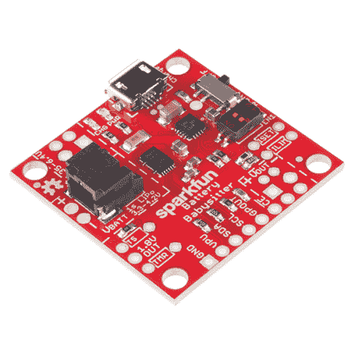

# 电池保姆连接指南

> 原文：<https://learn.sparkfun.com/tutorials/battery-babysitter-hookup-guide>

## 介绍

[SparkFun 电池保姆](https://www.sparkfun.com/products/13777)是一款一体式单体锂聚合物(LiPo)电池管理器。一半是**电池充电器**，一半是**电池监控器**，这一切都是为了让你的电池供电项目安全、广泛地运行。

 

将**添加到您的[购物车](https://www.sparkfun.com/cart)中！**

### [SparkFun 电池保姆- LiPo 电池经理](https://www.sparkfun.com/products/13777)

[In stock](https://learn.sparkfun.com/static/bubbles/ "in stock") PRT-13777

SparkFun 电池保姆是一个一体化的单体锂聚合物(脂)电池管理器。这是半电池充电…

$21.509[Favorited Favorite](# "Add to favorites") 67[Wish List](# "Add to wish list")** **[https://www.youtube.com/embed/u3KjOxiETWU/?autohide=1&border=0&wmode=opaque&enablejsapi=1](https://www.youtube.com/embed/u3KjOxiETWU/?autohide=1&border=0&wmode=opaque&enablejsapi=1)

电池保姆具有一对德州仪器脂肪管理 IC:一个 [BQ24075 电池充电器](http://www.ti.com/product/BQ24075)和一个 [BQ27441-G1A 燃料计](http://www.ti.com/product/BQ27441-G1)。BQ24075 支持高达 1.5A 的可调充电速率，以及 USB 兼容的 100mA 和 500mA 选项。它还具有电源路径管理功能，可确保为您的项目提供可靠的电源。

自校准，I ² 基于 C 的 BQ27441-G1A 测量电池的电压，以估计其充电百分比和剩余容量。该芯片还连接了一个电流感应电阻，可以测量电流和功率！这是一个方便的 IC，尤其是当你需要额外关注项目的功耗时。

### 建议的材料

你需要一些组件、附件和工具来启动和运行电池保姆。下面的愿望清单包括我们在本教程中使用的所有材料:**