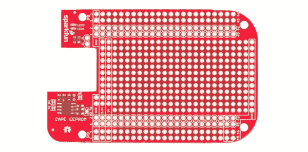
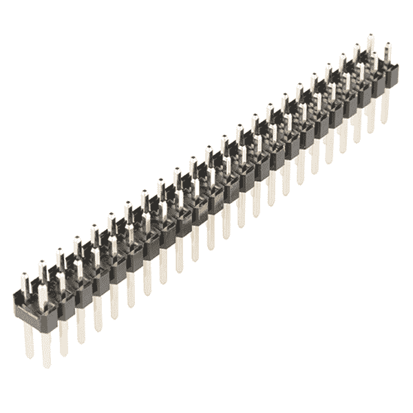
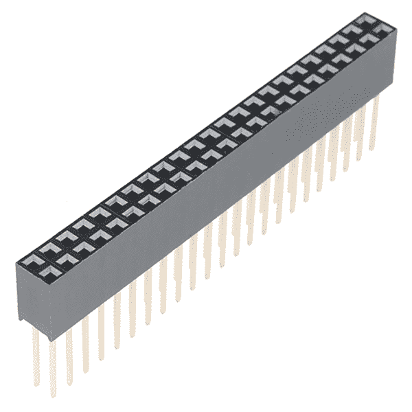
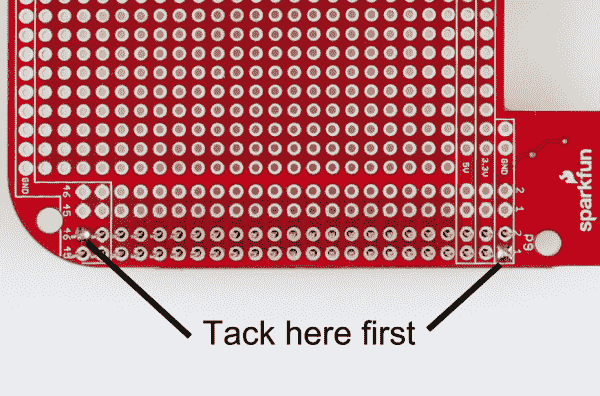
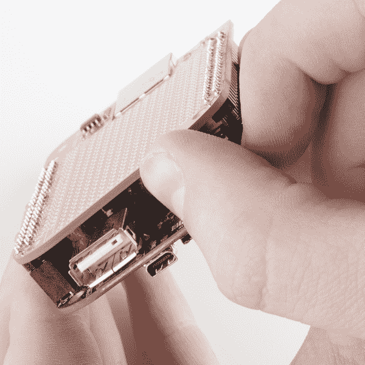
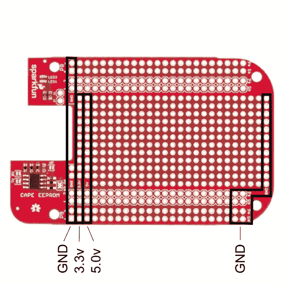
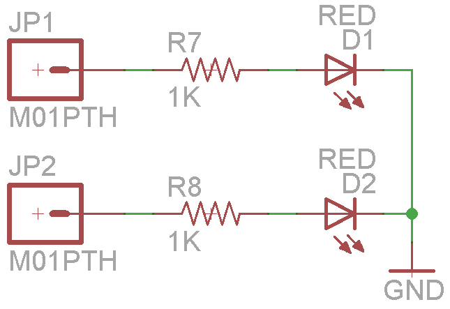

# 比格犬骨黑色原斗篷连接指南

> 原文：<https://learn.sparkfun.com/tutorials/beaglebone-black-proto-cape-hookup-guide>

## 主板概述

比格犬骨黑色原型斗篷是为[比格犬骨黑色](https://www.sparkfun.com/products/12076)设计定制斗篷的绝佳方式。这个斗篷可以让你使用 BeagleBone Black 上所有可用的 gpio。还有两个红色 LED 可供用户应用。内含的 EEPROM 允许用户原型 cape 描述文件， [BeagleBoard 基金会](http://beagleboard.org/)使用这些文件来注册电路板。

### 推荐阅读

在开始之前，我们建议您了解以下背景知识:

*   [如何焊接](https://learn.sparkfun.com/tutorials/how-to-solder-through-hole-soldering)
*   [使用焊线](https://learn.sparkfun.com/tutorials/working-with-wire)
*   [逻辑电平](https://learn.sparkfun.com/tutorials/logic-levels)

## 装配

首先让我们焊接一些头到斗篷。有两种类型的标题可供选择。

如果你只打算用一个披肩，直头也不错。

[Header 2x23 (PRT-12791)](https://www.sparkfun.com/products/12791)

如果您计划使用多个海角，有必要使用可堆叠的标题。

[Stackable Header 2x23 (PRT-12790)](https://www.sparkfun.com/products/12790)

### 焊接头

焊接接头时，保持接头笔直是很重要的。钉上两个相对的大头针，并在完成其余的大头针之前检查对齐情况。完成后，让斗篷冷却后再穿上。

除去斗篷可能相当困难。不要试图一蹴而就。试着摇晃或慢慢地向角落施压。以这种方式分开可以防止针脚弯曲。

让我们来看看原型区域是如何布局的。

## 原型区域

有足够的空间进行原型制作。电路板两侧有两条电源总线和接地连接，通孔间距均为 0.1 英寸。

提供了两个 LED 用于快速简单的调试或一般用途。

只需向每个 LED 施加电流即可点亮。它们支持 3.3v 和 5v 输入。

现在，我们来看看 EEPROM 及其特性。

## 使用 EEPROM

Cape EEPROM 非常适合存储引脚配置数据。BeagleBone Black 在引导期间读取 cape EEPROM。然后，它可以自动设置要使用的引脚。要理解 EEPROM 的使用方法，需要几个步骤。现在，我们将向您展示可用的可能设置。斗篷带有一个空白的 EEPROM。

EEPROM 的默认地址是 0x57。您可以通过选择两个地址跳线将其更改为地址 0x54 - 0x57。它们被标记为 A0 和 A1。当您使用多个 Cape 时，更改 Cape 的地址非常重要。

# 地址表

## 

| 主动脉第二声 | 一流的 | A0 | 7 位地址 |
| one | Zero | Zero | 0x54 |
| one | Zero | one | 0x55 |
| one | one | Zero | 0x56 |
| one | one | one | 0x57 |

一旦你创造了你的下一个伟大的东西，你可以注册你的设置与 BeagleBone 基金会。此注册允许他们将您的设置上传到最新的操作系统。这样用户就不需要设置他们的电路板来使用您的 cape。

## 资源和更进一步

现在，向前迈进，建立一些真棒！这里有一些额外的链接，让你开始使用比格犬骨黑色。

延伸阅读:

*   [BeagleBone 黑主页](http://beagleboard.org/Products/BeagleBone%20Black)
*   [骨骼脚本库支持](http://beagleboard.org/Support/BoneScript)

如果您有任何问题，我们的技术支持部门可以提供帮助。请不要犹豫与我们联系。我们也喜欢听你的项目！