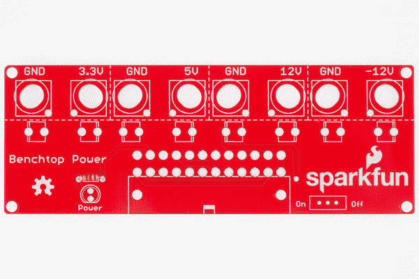
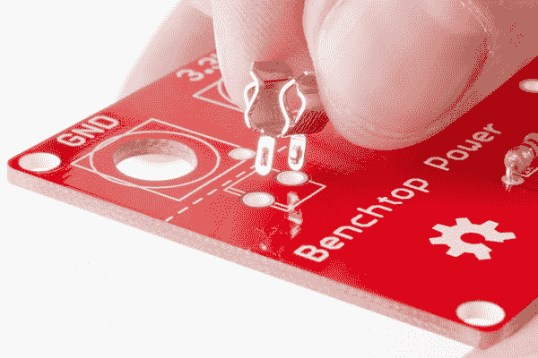

# 台式电源板套件连接指南

> 原文：<https://learn.sparkfun.com/tutorials/benchtop-power-board-kit-hookup-guide>

## 主板概述

[台式电源板套件](https://www.sparkfun.com/products/12867)使您能够从台式电源为嵌入式电子项目供电。该套件将物理计算项目最常用的电压分解为接线柱，包括 3.3V、5V、12V 和-12V。

每个电源轨的间距适合香蕉插孔，上面有一个可更换的 5A 保险丝。它通过 ATX 连接器连接到标准计算机电源。这块板在使用前需要组装。

 

将**添加到您的[购物车](https://www.sparkfun.com/cart)中！**

### [SparkFun 台式电源板套件](https://www.sparkfun.com/products/12867)

[Only 11 left!](https://learn.sparkfun.com/static/bubbles/ "only 11 left!") KIT-12867

你没有权力吗？嗯，没有必要问斯科特 SparkFun 台式电源板套件有你的支持。这…

$26.9520[Favorited Favorite](# "Add to favorites") 72[Wish List](# "Add to wish list")** **要完成本教程，您需要以下材料。

*   台式电源板套件
*   带有 ATX 连接器的电源
*   标准焊接材料
*   安装线

### 推荐阅读

如果您不熟悉以下概念，您可能希望在继续学习本教程之前先了解这些概念。

*   [如何为您的项目提供动力](https://learn.sparkfun.com/tutorials/how-to-power-a-project)
*   [如何焊接](https://learn.sparkfun.com/tutorials/how-to-solder---through-hole-soldering)
*   [使用焊线](https://learn.sparkfun.com/tutorials/working-with-wire)
*   [电力](https://learn.sparkfun.com/tutorials/electric-power)

## 硬件装配

将套件焊接在一起时，通常最好先检查所有的组件，然后从最小的组件开始焊接。

我们将从 1K 欧姆电阻开始。因为电阻没有极化，所以我们用哪种方式将它插入电路板并不重要。将引脚弯曲至与电阻体成 90 度，并将一个引脚放入电路板顶部 1K 丝网旁边的每个孔中。然后，您应该在电路板上与所有丝网相对的一侧焊接电阻引脚。确保电阻引脚和电路板之间连接良好。

*Resistor soldered in the lower left corner of the board.*

一旦你把电阻固定好，就可以把红色 LED 灯加到电路板上了。LED*是极化的*，所以在焊接之前，请仔细检查 LED 的方向是否正确。

看 LED 时，一条腿应该比另一条腿长。这是阳极，或正腿。较短的一条腿，即阴极，应放在电路板上最靠近 LED 丝网平边的孔中。丝网上的平边缘也将对应于 LED 外壳的平边缘。同样，这很重要！如果您将 LED 反向焊接，它将不起作用！

*Make sure the LED is oriented properly *before* soldering it!*

将电路板翻转过来，像焊接电阻器一样焊接 LED。

下一个要焊接的元件是开关。开关没有极化(就像电阻一样)，所以你可以把它放在电路板的任何方向。将它放入带有开/关丝盒的盒子中，并将腿焊接在板的底部。

*At this point, your board should look like this.*

下一个要焊接的元件是保险丝夹。这些夹子基本上是导电金属的成形件，但是它们仍然需要正确地定向！！如果你看一个单独的夹子，U 形的一边会有两个小的弯曲部分。这些设计是为了防止保险丝从保险丝夹的末端滑出。您将在电路板上将它们配对(每个保险丝 2 个夹子)，因此它们需要正确定向，以确保保险丝实际上适合它们之间。

如果你仔细观察电路板上保险丝夹的丝网，你会看到正方形的一边添加了一条第二线条。这是你应该将弯曲的钻头朝向的一面。

*Notice the secondary silk screen line on the same side as the curved edge on the clip.*

请记住，您需要能够在每对夹子之间固定一根保险丝，所以在将它们插入电路板时要非常小心。焊接前仔细检查可以避免令人沮丧的返工时间。

当你焊接它们时，它们在孔中可能有点挑剔，所以在试图焊接它们之前，将夹子的每个腿上的拉环弯曲一点可能会有所帮助。此外，请记住，这些基本上只是大块的金属，所以它们会从烙铁上带走大量的热量，以获得正确流动的接头。夹子本身也会发热，一定不要不小心碰到烫到自己！

一旦保险丝夹在里面，你可以插入保险丝，或者等到焊接完成，这样它们就不会碍事了。

如果保险丝滑出或无法插入，用一把钳子将夹子的一边向另一边弯曲。你需要在保险丝夹和保险丝之间有良好的连接。

你要焊接到电路板顶部的最后一个元件是 ATX 连接器。请确保您仔细对齐所有引脚，并将连接器边缘与电路板边缘对齐。两个塑料夹也应对齐并卡入电路板上的过孔，以确保连接器方向正确。翻转电路板，焊接每个引脚。确保你没有桥接任何这些-这个连接器可以处理大量的电流，短路可能会毁了你的一天。

*Make sure you insert the ATX connector all the way into the board before soldering it down. The two white tabs should pop through the guide-holes.*

一旦你把所有的元件焊接到电路板的顶部，就该把电线连接到电路板上了。您需要剪下 8 根 2 英寸长的电线(每个桶形插孔连接器一根)。我个人喜欢用红色连接线连接正极电压线，黑色连接线连接接地电压线。从金属丝的每一端剥去一点涂层。电线准备好后，就该焊接了。

*Prepped wire inserted into bottom of the board*

为了使装配的其余部分顺利进行，你应该将电线连接到电路板的底部，这意味着你将在电路板的顶部进行焊接。这应该是相反的所有其他焊接你已经做到了这一点。

*So close to completion!*

一旦所有东西都正确焊接到电路板上，请仔细检查，确保任何地方都没有跳线，并确保夹住任何元件引脚，否则以后可能会短路。

是时候添加您的桶形插孔连接器了。您需要拧下每个插孔的大螺母，将插孔定位在电路板的孔中，然后将底部的螺母重新连接，以将插孔固定到电路板上。同样，这应该遵循红色表示正电压，黑色表示接地的惯例。

要将桶形插孔连接到电线上，您需要拧下桶形插孔底部的第一个小螺母。将相应的电线接到插孔上，缠绕在插孔底部。然后通过拧紧插孔的第一个螺母将电线固定到位。

在这一步非常重要的是，要确保你把电线紧紧地连接到插孔上，并夹住任何悬空的一端。一旦系统通电，我们真的不希望这些短路！

*Tighten those connections and trim those potential shorts.*

组装的最后一步是连接支架。请记住，这一步是可选的，取决于您将如何使用该板。如果您打算将它安装到机箱中，您可能不需要以下步骤。我们在 GitHub repo 中有一个模板文件，如果你感兴趣的话，你可以用它来为这块板打磨或切割一个空间。

将螺钉插入电路板顶部，使螺钉头与组件同侧齐平。拧紧电路板底部的塑料支架。

如果你还没有，现在是时候把保险丝插到夹子里了。

您的装配现在完成了！

## 系统连接

现在你已经把台式电源焊接在一起了，是时候给它加电了！首先，你需要决定你的动力系统。对于这个例子，我们将启动一个 [4 RPM 标准齿轮马达](https://www.sparkfun.com/products/12162)。这款电机可以在 3-12V 电压下运行，因此非常适合在台式主板上测试几个电源轨连接。

将计算机电源的 ATX 连接器插入台式电源。由于台式电源板上有一个电源开关，您可以打开计算机电源并保持打开。

将裸线端放入适合您项目的电压轨的筒形插孔中。在我们的例子中，我们首先将电机连接到 3.3V 供电轨。翻转台式主板上的电源开关，你应该看到你的电机旋转！

## 资源和更进一步

现在，您已经了解了台式电源板的功能，您可以使用它为许多不同的项目供电，并制作许多不同元件的原型。我们很想听听你的想法！

如果您有任何反馈，请访问[评论](https://learn.sparkfun.com/tutorials/benchtop-power-board-kit-hookup-guide/discuss)或联系我们在 TechSupport@sparkfun.com[的技术支持团队](mailto:techsupport@sparkfun.com?subject=)。

查看这些附加资源，了解更多信息和其他项目想法。

*   [包含最新文件的 GitHub 存储库](https://github.com/sparkfun/Benchtop_Power_Board_Kit)
*   [保险丝数据表](https://cdn.sparkfun.com/assets/learn_tutorials/2/6/2/glassfusedatasheet.pdf)
*   [交互式悬挂 LED 阵列](https://learn.sparkfun.com/tutorials/interactive-hanging-led-array)
*   [pcDuino 众包亭](https://learn.sparkfun.com/tutorials/pcduino-crowdsource-kiosk)
*   [构建 Auduino 步进序列器](https://learn.sparkfun.com/tutorials/build-an-auduino-step-sequencer)**