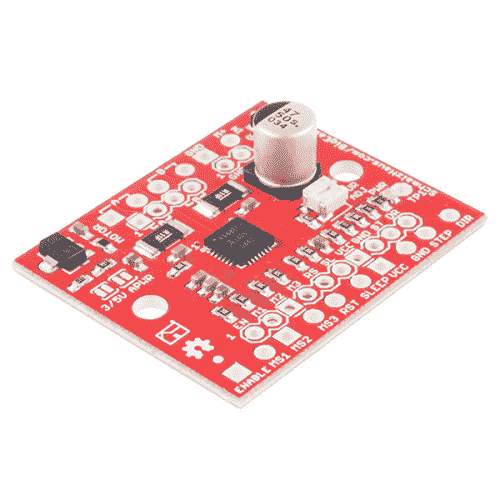

# 大型简易驾驶员连接指南

> 原文：<https://learn.sparkfun.com/tutorials/big-easy-driver-hookup-guide>

## 介绍

[大而简单的驱动器](https://www.sparkfun.com/products/12859)给你驱动步进电机的能力，使其达到 2A/相位。这个驱动器默认为 16 步微步模式，并让您控制电机速度和位置。

 

将**添加到您的[购物车](https://www.sparkfun.com/cart)中！**

### [大易司机](https://www.sparkfun.com/products/12859)

[In stock](https://learn.sparkfun.com/static/bubbles/ "in stock") ROB-12859

Big Easy Driver 由[Brian Schmalz](http://www . schmalzhaus . com/)设计，是一款用于双极 s…

$21.5041[Favorited Favorite](# "Add to favorites") 44[Wish List](# "Add to wish list")** **### 所需材料

为了跟随本教程，我们建议您访问以下资料。你可能不需要所有的东西，这取决于你拥有什么。将它添加到您的购物车，通读指南，并根据需要调整购物车。**